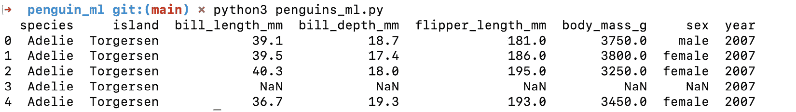
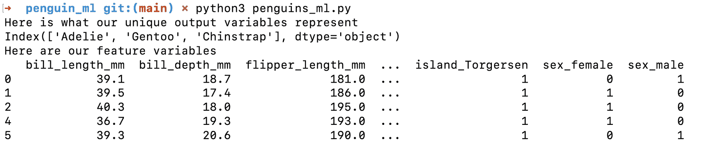
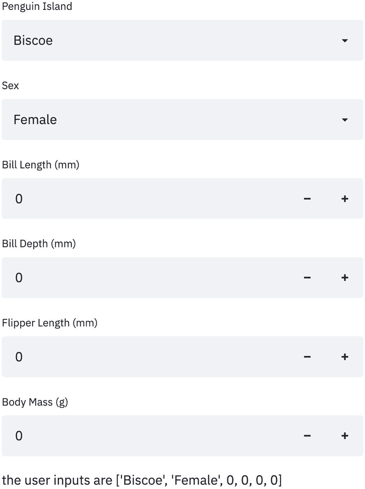
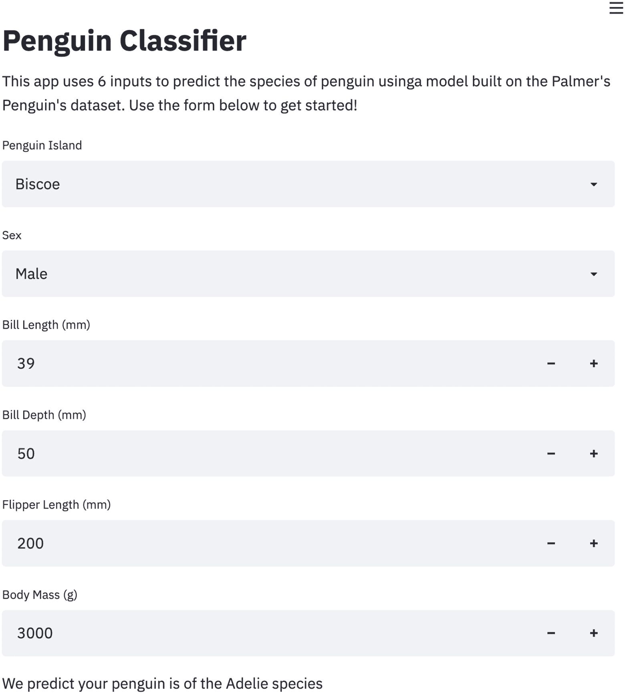
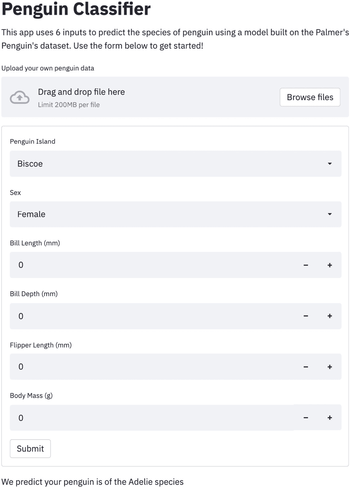
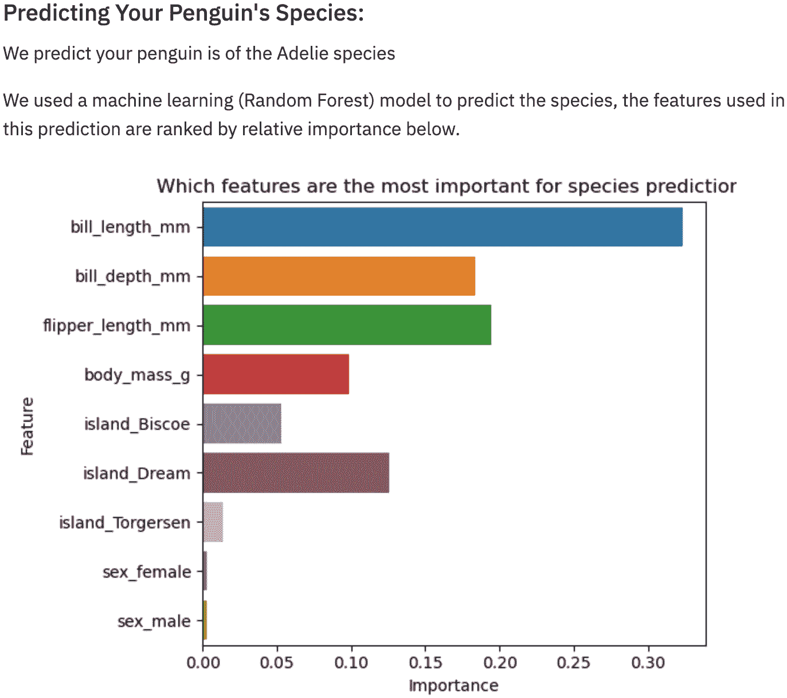
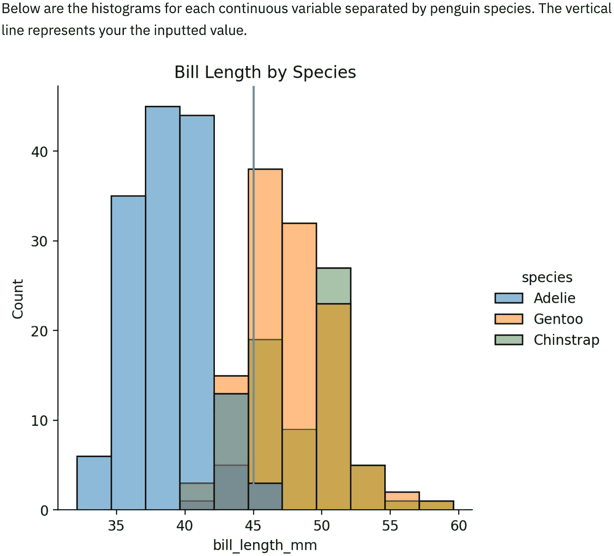

# 第四章：*第四章*：在 Streamlit 中使用机器学习

数据科学家常常遇到的一个非常普遍的情况是在模型创建过程结束时，不知道如何说服非数据科学家相信他们的模型是有价值的。他们可能有模型的性能指标或一些静态的可视化效果，但没有简单的方法让其他人与他们的模型进行交互。

在使用 Streamlit 之前，还有其他一些选择，其中最流行的是在 Flask 或 Django 中创建一个完整的应用程序，或者将模型转换为**应用程序编程接口**（**API**），并引导开发人员使用它。这些选项很棒，但往往耗时且不适合像应用程序原型制作这样的宝贵使用案例。

团队中的激励有点不一致。数据科学家希望为团队创建最好的模型，但如果他们需要花一两天时间（或者，如果有经验的话，几个小时）将他们的模型转化为 Flask 或 Django 应用，那么直到他们认为建模过程接近完成时，才去构建这个应用就没有太大意义。Streamlit 的好处在于，它帮助我们将这个繁琐的过程转化为无摩擦的应用创建体验。在本章中，我们将介绍如何在 Streamlit 中创建**机器学习**（**ML**）原型，如何为你的机器学习应用添加用户交互，以及如何理解机器学习的结果。

本章将涉及以下主题：

+   标准的机器学习工作流

+   预测企鹅物种

+   在 Streamlit 中使用预训练的机器学习模型

+   在 Streamlit 应用中训练模型

+   理解机器学习的结果

# 标准的机器学习（ML）工作流

创建一个使用机器学习的应用程序的第一步是机器学习模型本身。创建你自己的机器学习模型有许多流行的工作流，你很可能已经有自己的方法了！这个过程有两个部分需要考虑：

+   机器学习模型的生成

+   在生产中使用机器学习模型

如果计划是训练一次模型然后将此模型用于我们的 Streamlit 应用，那么最好的方法是先在 Streamlit 外部创建该模型（例如，在 Jupyter notebook 中或在标准的 Python 文件中），然后在应用中使用该模型。

如果计划是使用用户输入来训练我们应用程序中的模型，那么我们就不能再在 Streamlit 外部创建模型，而是需要在 Streamlit 应用程序内部运行模型训练。

我们将首先在 Streamlit 外部构建机器学习模型，然后再转向在 Streamlit 应用中训练模型。

# 预测企鹅物种

本章中我们主要使用的数据集是与 *第一章*，《Streamlit 简介》中使用的相同的 Palmer's Penguins 数据集。像往常一样，我们将创建一个新的文件夹，用于存放我们的 Streamlit 应用和相关代码。以下代码将在`streamlit_apps`文件夹内创建该新文件夹，并将数据从我们的`penguin_app`文件夹复制过来。如果你还没有下载 Palmer's Penguins 数据，请按照*第二章*，《上传、下载和处理数据》中的说明操作：

```py
mkdir penguin_ml
cp penguin_app/penguins.csv penguin_ml 
cd penguin_ml 
touch penguins_ml.py
touch penguins_streamlit.py
```

正如你在前面的代码中可能注意到的那样，这里有两个 Python 文件，一个用于创建机器学习模型（`penguins_ml.py`），另一个用于创建 Streamlit 应用（`penguins_streamlit.py`）。我们将从`penguins_ml.py`文件开始，一旦我们得到了满意的模型，就会转到`penguins_streamlit.py`文件。

注意

你也可以选择在 Jupyter notebook 中创建模型，虽然这种方式设计上较不易复现（因为单元格可以乱序运行），但仍然是非常受欢迎的做法。

让我们重新熟悉一下`penguins.csv`数据集。以下代码将读取数据集并打印出前五行：

```py
import pandas as pd 
penguin_df = pd.read_csv('penguins.csv')
print(penguin_df.head())
```

当我们在终端运行 Python 文件`penguins_ml.py`时，前面代码的输出将类似以下截图所示：



图 4.1 – 前五只企鹅

对于这个应用，我们将尝试创建一个帮助野外研究人员识别企鹅物种的应用。该应用将根据企鹅的喙、鳍和体重的测量值，以及关于企鹅性别和位置的信息来预测企鹅的物种。

接下来的这一部分并不是为了创建最好的机器学习模型，而只是为了快速为我们的 Streamlit 应用创建一个原型，方便我们在此基础上进行迭代。因此，从这个角度来看，我们将删除含有空值的几行，并且不使用`year`变量作为特征，因为它与我们的使用场景不匹配。我们需要定义特征和输出变量，对特征进行独热编码（或者像 pandas 所说的，为我们的文本列创建虚拟变量），并对输出变量进行因子化（将其从字符串转换为数字）。以下代码应该能将我们的数据集整理得更适合进行分类算法的运行：

```py
import pandas as pd 
penguin_df = pd.read_csv('penguins.csv')
 penguin_df.dropna(inplace=True)
 output = penguin_df['species']
 features = penguin_df[['island', 'bill_length_mm', 'bill_depth_mm',
       'flipper_length_mm', 'body_mass_g', 'sex']]
 features = pd.get_dummies(features)
 print('Here are our output variables')
 print(output.head())
print('Here are our feature variables')
print(features.head())
```

现在当我们再次运行 Python 文件`penguins_ml.py`时，我们会看到输出变量和特征变量已经分开，如下图所示：



图 4.2 – 输出变量

现在，我们希望使用我们数据的一个子集（在此情况下为 80%）来创建一个分类模型，并获取该模型的准确性。以下代码通过随机森林模型执行这些步骤，但如果你愿意，也可以使用其他分类算法。再次强调，这里的目的是为了快速制作一个原型，展示给企鹅研究人员，获取反馈！

```py
import pandas as pd
from sklearn.metrics import accuracy_score
from sklearn.ensemble import RandomForestClassifier
from sklearn.model_selection import train_test_split
penguin_df = pd.read_csv('penguins.csv')
penguin_df.dropna(inplace=True)
output = penguin_df['species']
features = penguin_df[['island', 'bill_length_mm', 'bill_depth_mm',
                       'flipper_length_mm', 'body_mass_g', 'sex']]
features = pd.get_dummies(features)
output, uniques = pd.factorize(output)
x_train, x_test, y_train, y_test = train_test_split(
    features, output, test_size=.8)
rfc = RandomForestClassifier(random_state=15)
rfc.fit(x_train, y_train)
y_pred = rfc.predict(x_test)
score = accuracy_score(y_pred, y_test)
print('Our accuracy score for this model is {}'.format(score))
```

现在我们已经有了一个相当不错的模型来预测企鹅的物种！我们在模型生成过程中的最后一步是保存我们最需要的这两部分模型——模型本身和`uniques`变量，它将因子化的输出变量映射到我们可以识别的物种名称。对于之前的代码，我们将添加几行代码，用来将这些对象保存为 pickle 文件（pickle 文件是将 Python 对象转化为可以直接保存并且从其他 Python 文件中轻松导入的格式，譬如我们的 Streamlit 应用程序）。更具体来说，`open()`函数创建了两个 pickle 文件，`pickle.dump()`函数将我们的 Python 文件写入这些文件，`close()`函数用于关闭文件。`open()`函数中的`wb`表示*写入字节*，这告诉 Python 我们要写入文件，而不是读取文件：

```py
import pandas as pd
from sklearn.metrics import accuracy_score
from sklearn.ensemble import RandomForestClassifier
from sklearn.model_selection import train_test_split
import pickle
penguin_df = pd.read_csv('penguins.csv')
penguin_df.dropna(inplace=True)
output = penguin_df['species']
features = penguin_df[['island', 'bill_length_mm', 'bill_depth_mm',
                       'flipper_length_mm', 'body_mass_g', 'sex']]
features = pd.get_dummies(features)
output, uniques = pd.factorize(output)
x_train, x_test, y_train, y_test = train_test_split(
    features, output, test_size=.8)
rfc = RandomForestClassifier(random_state=15)
rfc.fit(x_train, y_train)
y_pred = rfc.predict(x_test)
score = accuracy_score(y_pred, y_test)
print('Our accuracy score for this model is {}'.format(score))
rf_pickle = open('random_forest_penguin.pickle', 'wb')
pickle.dump(rfc, rf_pickle)
rf_pickle.close()
output_pickle = open('output_penguin.pickle', 'wb')
pickle.dump(uniques, output_pickle)
output_pickle.close() 
```

现在，我们的`penguin_ml`文件夹中有了两个新的文件，一个是名为`random_forest_penguin.pickle`的文件，里面包含我们的模型，另一个是`output_penguin_.pickle`文件，它包含了企鹅物种和模型输出之间的映射关系。这就是`penguins_ml.py`函数的全部内容！我们可以继续进行 Streamlit 应用程序的开发。

# 在 Streamlit 中使用预训练的 ML 模型

现在我们已经有了我们的模型，我们希望将它（以及我们的映射函数）加载到 Streamlit 中。在我们之前创建的文件`penguins_streamlit.py`中，我们将再次使用`pickle`库，通过以下代码加载我们的文件。我们使用与之前相同的函数，但这次不是使用`wb`，而是使用`rb`参数，表示*读取字节*。为了确保这些是我们之前使用的相同的 Python 对象，我们将使用我们非常熟悉的`st.write()`函数来进行检查：

```py
import streamlit as st
import pickle
rf_pickle = open('random_forest_penguin.pickle', 'rb')
map_pickle = open('output_penguin.pickle', 'rb')
rfc = pickle.load(rf_pickle)
unique_penguin_mapping = pickle.load(map_pickle)
st.write(rfc)
st.write(unique_penguin_mapping)
```

和我们之前的 Streamlit 应用程序一样，我们在终端中运行以下代码来启动我们的应用程序：

```py
streamlit run penguins_streamlit.py
```

现在我们已经有了随机森林分类器，并且有了企鹅映射！我们的下一步是添加 Streamlit 函数以获取用户输入。在我们的应用程序中，我们使用了岛屿、喙长、喙深、鳍肢长、体重和性别来预测企鹅的物种，因此我们需要从用户那里获取这些信息。对于岛屿和性别，我们已经知道数据集中有哪些选项，并且希望避免解析用户的文本，因此我们将使用`selectbox`。对于其他数据，我们只需要确保用户输入的是一个正数，因此我们将使用`st.number_input()`函数，并将最小值设置为`0`。以下代码将这些输入值获取并在 Streamlit 应用程序中显示出来：

```py
import streamlit as st
import pickle
rf_pickle = open('random_forest_penguin.pickle', 'rb')
map_pickle = open('output_penguin.pickle', 'rb')
rfc = pickle.load(rf_pickle)
unique_penguin_mapping = pickle.load(map_pickle)
rf_pickle.close()
map_pickle.close()
island = st.selectbox('Penguin Island', options=[
                      'Biscoe', 'Dream', 'Torgerson'])
sex = st.selectbox('Sex', options=['Female', 'Male'])
bill_length = st.number_input('Bill Length (mm)', min_value=0)
bill_depth = st.number_input('Bill Depth (mm)', min_value=0)
flipper_length = st.number_input('Flipper Length (mm)', min_value=0)
body_mass = st.number_input('Body Mass (g)', min_value=0)
st.write('the user inputs are {}'.format(
    [island, sex, bill_length,
         bill_depth, flipper_length, body_mass]))
```

前面的代码应该生成如下应用。试试看，修改数值，看看输出是否会有所变化。Streamlit 的设计使得默认情况下，每次更改一个值，整个应用都会重新运行。下面的截图显示了正在运行的应用，展示了一些我更改过的数值。我们可以通过右侧的（**+** 和 **-**）按钮来修改数值，或者直接手动输入数值：



图 4.3 – 模型输入

现在我们有了所有的输入，并且也有了我们的模型。下一步是将数据格式化成与我们预处理数据相同的格式，例如，我们的模型没有一个叫做 `sex` 的变量，而是有两个叫做 `sex_female` 和 `sex_male` 的变量。一旦我们的数据格式正确，我们就可以调用 `predict` 函数，并将预测结果映射到我们原始的物种列表上，看看模型是如何工作的。以下代码正是完成这个任务的，同时还为应用添加了一些基本的标题和说明，以便用户使用。这个应用比较长，所以我会将它分成多个部分来提高可读性，从为应用添加说明和标题开始：

```py
import streamlit as st
import pickle
st.title('Penguin Classifier')
st.write("This app uses 6 inputs to predict the species of penguin using"
         "a model built on the Palmer's Penguin's dataset. Use the form below"
         " to get started!")
rf_pickle = open('random_forest_penguin.pickle', 'rb')
map_pickle = open('output_penguin.pickle', 'rb')
rfc = pickle.load(rf_pickle)
unique_penguin_mapping = pickle.load(map_pickle)
rf_pickle.close()
map_pickle.close()
```

现在我们的应用已经有了标题和用户操作说明。下一步是像之前一样获取用户输入。我们还需要将 `sex` 和 `island` 变量转化为正确的格式，如前所述：

```py
island = st.selectbox('Penguin Island', options=[
                      'Biscoe', 'Dream', 'Torgerson'])
sex = st.selectbox('Sex', options=['Female', 'Male'])
bill_length = st.number_input('Bill Length (mm)', min_value=0)
bill_depth = st.number_input('Bill Depth (mm)', min_value=0)
flipper_length = st.number_input('Flipper Length (mm)', min_value=0)
body_mass = st.number_input('Body Mass (g)', min_value=0)
island_biscoe, island_dream, island_torgerson = 0, 0, 0
if island == 'Biscoe':
    island_biscoe = 1
elif island == 'Dream':
    island_dream = 1
elif island == 'Torgerson':
    island_torgerson = 1
sex_female, sex_male = 0, 0
if sex == 'Female':
    sex_female = 1
elif sex == 'Male':
    sex_male = 1
```

我们的数据格式已经完全正确！最后一步是使用 `predict()` 函数在我们的模型上进行预测，并使用新数据，这一部分代码已经完成：

```py
new_prediction = rfc.predict([[bill_length, bill_depth, flipper_length,
                               body_mass, island_biscoe, island_dream,
                               island_torgerson, sex_female, sex_male]])
prediction_species = unique_penguin_mapping[new_prediction][0]
st.write('We predict your penguin is of the {} species'.format(prediction_species))
```

现在我们的应用应该像下面的截图一样。我在输入框中添加了一些示例值，但你应该尝试更改数据，看看是否能够改变物种预测！



图 4.4 – 完整的 Streamlit 预测

我们现在有一个完整的 Streamlit 应用，它利用了我们预训练的机器学习模型，接收用户输入并输出预测结果。接下来，我们将讨论如何在 Streamlit 应用中直接训练模型！

# 在 Streamlit 应用中训练模型

我们常常希望让用户输入改变我们模型的训练方式。我们可能想接受用户的数据，或者询问用户他们希望使用哪些特征，甚至允许用户选择他们希望使用的机器学习算法类型。所有这些选项在 Streamlit 中都是可行的，在本节中，我们将介绍如何使用用户输入来影响训练过程的基础知识。正如我们在上节中所讨论的那样，如果一个模型只需要训练一次，那么最好是在 Streamlit 外部训练模型，并将模型导入 Streamlit。但如果在我们的例子中，企鹅研究人员的数据已经存储在本地，或者他们不知道如何重新训练模型，但数据已处于正确的格式呢？在这种情况下，我们可以添加`st.file_uploader()`选项，并为这些用户提供一种输入自己数据的方法，从而无需编写任何代码就能为他们部署定制的模型。以下代码将添加一个用户选项以接受数据，并使用我们在`penguins_ml.py`中原本的预处理/训练代码为该用户制作一个独特的模型。这里需要注意的是，只有当用户的数据格式和风格与我们使用的完全相同时，这种方法才有效，这种情况可能比较少见。另一个可能的附加功能是向用户展示数据需要符合什么格式，以便此应用程序能够正确训练模型！

```py
import streamlit as st
import seaborn as sns
import matplotlib.pyplot as plt
import pandas as pd
import pickle
from sklearn.metrics import accuracy_score
from sklearn.ensemble import RandomForestClassifier
from sklearn.model_selection import train_test_split
st.title('Penguin Classifier')
st.write("This app uses 6 inputs to predict the species of penguin using "
         "a model built on the Palmer's Penguin's dataset. Use the form below"
         " to get started!")
penguin_file = st.file_uploader('Upload your own penguin data')
```

本节导入我们需要的库，添加标题——如我们之前所用，并添加`file_uploader()`函数。然而，当用户尚未上传文件时会发生什么呢？我们可以将默认值设置为加载我们的随机森林模型，如果没有企鹅文件，如下一节代码所示：

```py
if penguin_file is None:
    rf_pickle = open('random_forest_penguin.pickle', 'rb')
    map_pickle = open('output_penguin.pickle', 'rb')
    rfc = pickle.load(rf_pickle)
    unique_penguin_mapping = pickle.load(map_pickle)
    rf_pickle.close()
    map_pickle.close()
```

接下来的问题是如何接收用户的数据，清洗它，并基于这些数据训练一个模型。幸运的是，我们可以重复使用已经创建的模型训练代码，并将其放入下一个代码块中的`else`语句中：

```py
else:
    penguin_df = pd.read_csv(penguin_file)
    penguin_df = penguin_df.dropna()
    output = penguin_df['species']
    features = penguin_df[['island', 'bill_length_mm', 'bill_depth_mm',
                           'flipper_length_mm', 'body_mass_g', 'sex']]
    features = pd.get_dummies(features)
    output, unique_penguin_mapping = pd.factorize(output)
    x_train, x_test, y_train, y_test = train_test_split(
        features, output, test_size=.8)
    rfc = RandomForestClassifier(random_state=15)
    rfc.fit(x_train, y_train)
    y_pred = rfc.predict(x_test)
    score = round(accuracy_score(y_pred, y_test), 2)
    st.write('We trained a Random Forest model on these data,'
             ' it has a score of {}! Use the '
             'inputs below to try out the model.'.format(score))
```

我们现在已经在应用内创建了模型，需要从用户那里获取预测输入。不过，这一次，我们可以对之前的做法进行改进。到目前为止，每次用户更改应用中的输入时，整个 Streamlit 应用都会重新运行。我们可以使用`st.form()`和`st.submit_form_button()`函数将其余的用户输入包裹起来，让用户一次性提交整个表单，而不是每次都提交：

```py
with st.form('user_inputs'):
island = st.selectbox('Penguin Island', options=[
                      'Biscoe', 'Dream', 'Torgerson'])
sex = st.selectbox('Sex', options=['Female', 'Male'])
bill_length = st.number_input('Bill Length (mm)', min_value=0)
bill_depth = st.number_input('Bill Depth (mm)', min_value=0)
flipper_length = st.number_input('Flipper Length (mm)', min_value=0)
body_mass = st.number_input('Body Mass (g)', min_value=0)
st.form_submit_button()
island_biscoe, island_dream, island_torgerson = 0, 0, 0
if island == 'Biscoe':
    island_biscoe = 1
elif island == 'Dream':
    island_dream = 1
elif island == 'Torgerson':
    island_torgerson = 1
sex_female, sex_male = 0, 0
if sex == 'Female':
    sex_female = 1
elif sex == 'Male':
    sex_male = 1
```

现在我们已经有了新表单的输入，我们需要创建我们的预测并将预测结果写给用户，如下一个代码块所示：

```py
new_prediction = rfc.predict([[bill_length, bill_depth, flipper_length,
                               body_mass, island_biscoe, island_dream,
                               island_torgerson, sex_female, sex_male]])
prediction_species = unique_penguin_mapping[new_prediction][0]
st.write('We predict your penguin is of the {} species'.format(prediction_species))
```

就这样！我们现在有了一个 Streamlit 应用，允许用户输入自己的数据，并根据他们的数据训练模型并输出结果，如下图所示：



图 4.5 – 企鹅分类器预测

这里有潜在的改进方法，例如使用缓存功能（可以参考 *第二章*，*上传、下载和操作数据*）。像这样允许用户上传数据的应用要构建起来更为困难，尤其是在没有统一数据格式的情况下。截至目前，看到展示出色的机器学习模型和使用案例的 Streamlit 应用比直接在应用内构建模型的应用要更为常见（尤其是对于计算开销较大的模型训练）。正如我们之前提到的，Streamlit 开发者通常会在要求用户输入数据集之前提供必要的数据格式参考。然而，允许用户带入自己数据的选项仍然是可用且实用的，尤其是可以快速迭代模型构建。

# 理解机器学习结果

到目前为止，我们的应用可能很有用，但仅仅展示结果对于一个数据应用来说并不够。我们还应该解释一下为什么会得到这样的结果！为了做到这一点，我们可以在应用输出中添加一个帮助用户更好理解模型的部分。

首先，随机森林模型已经具备了一个内建的特征重要性方法，该方法来源于组成随机森林的单个决策树集合。我们可以编辑我们的 `penguins_ml.py` 文件来绘制这个特征重要性图，然后在我们的 Streamlit 应用中调用该图像。我们也可以直接在 Streamlit 应用中绘制这个图形，但在 `penguins_ml.py` 中绘制一次会更高效，而不是每次我们的 Streamlit 应用重新加载时（即每次用户更改输入时）都绘制一次。以下代码编辑了我们的 `penguins_ml.py` 文件并添加了特征重要性图，将其保存到我们的文件夹中。我们还调用了 `tight_layout()` 功能，这有助于更好地格式化我们的图表，并确保避免任何标签被截断。由于这段代码较长，文件的前半部分保持不变，因此只省略了库导入和数据清洗部分：

```py
x_train, x_test, y_train, y_test = train_test_split(
    features, output, test_size=.8)
rfc = RandomForestClassifier(random_state=15)
rfc.fit(x_train, y_train)
y_pred = rfc.predict(x_test)
score = accuracy_score(y_pred, y_test)
print('Our accuracy score for this model is {}'.format(score))
rf_pickle = open('random_forest_penguin.pickle', 'wb')
pickle.dump(rfc, rf_pickle)
rf_pickle.close()
output_pickle = open('output_penguin.pickle', 'wb')
pickle.dump(uniques, output_pickle)
output_pickle.close()
fig, ax = plt.subplots()
ax = sns.barplot(rfc.feature_importances_, features.columns)
plt.title('Which features are the most important for species prediction?')
plt.xlabel('Importance')
plt.ylabel('Feature')
plt.tight_layout()
fig.savefig('feature_importance.png')
```

现在，当我们重新运行 `pengiuns_ml.py` 时，应该能看到一个名为 `feature_importance.png` 的文件，我们可以从我们的 Streamlit 应用中调用这个文件。我们现在来做这个！我们可以使用 `st.image()` 函数加载我们 `png` 文件中的图像，并将其显示到我们的企鹅应用中。以下代码将我们的图像添加到 Streamlit 应用中，并且改进了我们关于预测的解释。由于这个代码块的长度，我们只展示从开始使用用户数据进行预测的代码部分：

```py
new_prediction = rfc.predict([[bill_length, bill_depth, flipper_length,
                               body_mass, island_biscoe, island_dream,
                               island_torgerson, sex_female, sex_male]])
prediction_species = unique_penguin_mapping[new_prediction][0]
st.subheader("Predicting Your Penguin's Species:")
st.write('We predict your penguin is of the {} species'
         .format(prediction_species))
st.write('We used a machine learning (Random Forest) model to '
         'predict the species, the features used in this prediction '
         ' are ranked by relative importance below.')
st.image('feature_importance.png')
```

现在，您的 Streamlit 应用的底部应该看起来像下图所示（注意：您的字符串可能会因输入的不同而略有不同）。



图 4.6 – 特征重要性截图

如我们所见，喙长、喙深和鳍肢长是根据我们的随机森林模型最重要的变量。解释我们模型工作原理的最终选项是按物种绘制这些变量的分布图，并绘制一些垂直线表示用户输入。理想情况下，用户可以开始全面理解基础数据，从而理解模型给出的预测结果。为此，我们需要将数据导入到 Streamlit 应用程序中，这是我们之前没有做过的。以下代码导入了我们用来构建模型的企鹅数据，并绘制了三张直方图（分别为*喙长*、*喙深*和*鳍肢长*），同时将用户输入作为垂直线显示，从模型解释部分开始：

```py
st.subheader("Predicting Your Penguin's Species:")
st.write('We predict your penguin is of the {} species'
         .format(prediction_species))
st.write('We used a machine learning (Random Forest) model to '
         'predict the species, the features used in this prediction '
         ' are ranked by relative importance below.')
st.image('feature_importance.png')
st.write('Below are the histograms for each continuous variable '
         'separated by penguin species. The vertical line '
         'represents your the inputted value.')
```

现在我们已经为直方图设置好了应用程序，我们可以使用 Seaborn 可视化库中的`displot()`函数来为我们最重要的变量创建三个直方图：

```py
fig, ax = plt.subplots()
ax = sns.displot(x=penguin_df['bill_length_mm'],
                 hue=penguin_df['species'])
plt.axvline(bill_length)
plt.title('Bill Length by Species')
st.pyplot(ax)
fig, ax = plt.subplots()
ax = sns.displot(x=penguin_df['bill_depth_mm'],
                 hue=penguin_df['species'])
plt.axvline(bill_depth)
plt.title('Bill Depth by Species')
st.pyplot(ax)
fig, ax = plt.subplots()
ax = sns.displot(x=penguin_df['flipper_length_mm'],
                 hue=penguin_df['species'])
plt.axvline(flipper_length)
plt.title('Flipper Length by Species')
st.pyplot(ax)
```

上面的代码应该会创建出下图所示的应用程序，这是我们最终形式的应用。为了方便查看，我们将仅展示第一个直方图：



图 4.6 – 按物种分类的喙长

和往常一样，完整的最终代码可以在[`github.com/tylerjrichards/Getting-Started-with-Streamlit-for-Data-Science`](https://github.com/tylerjrichards/Getting-Started-with-Streamlit-for-Data-Science)找到。这部分内容到此结束。我们现在已经创建了一个完整的 Streamlit 应用程序，它能够接受预先构建的模型和用户输入，并输出预测结果和解释输出。

# 总结

在本章中，我们学习了一些机器学习基础：如何在 Streamlit 中使用预构建的机器学习模型，如何在 Streamlit 中创建我们自己的模型，以及如何使用用户输入来理解和迭代机器学习模型。希望在本章结束时，你能对这些内容感到熟悉。接下来，我们将深入了解如何使用 Streamlit Sharing 部署 Streamlit 应用程序！
