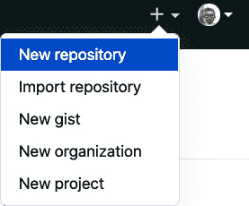

# 第五章：*第五章*：使用 Streamlit Sharing 部署 Streamlit

迄今为止，本书主要关注 Streamlit 应用开发，从创建复杂的可视化到部署和构建 **机器学习**（**ML**）模型。本章将学习如何部署这些应用，以便它们可以与任何拥有互联网连接的人共享。这是 Streamlit 应用的重要部分，因为如果没有部署 Streamlit 应用的能力，用户或你的作品消费者仍然会面临一定的使用障碍。如果我们认为 Streamlit 消除了在创建数据科学分析/产品/模型与与他人共享它们之间的障碍，那么我们也必须相信，广泛共享应用的能力和开发的简便性同样重要。

部署 Streamlit 应用有三种主要方式：通过 Streamlit 创建的产品 *Streamlit Sharing*，通过云服务提供商如 *Amazon Web Services* 或 *Heroku*，或通过 Streamlit 创建的另一款产品 *Streamlit for Teams*。这三种方式都需要付费，但 Streamlit Sharing 提供了免费版，而 Amazon Web Services 经常为学生、首次使用者和初创公司提供免费额度，Heroku 也有免费版。对于大多数 Streamlit 用户来说，最简单和首选的方法是 Streamlit Sharing，因此我们将在此直接介绍该方法，并将在本书后续章节中，分别在*第八章*（*使用 Heroku 和 AWS 部署 Streamlit 应用*）和*第十章*（*数据项目 - 在 Streamlit 中进行原型设计*）中介绍 Amazon Web Services、Heroku 和 Streamlit for Teams。

本章将涵盖以下主题：

+   开始使用 Streamlit Sharing

+   GitHub 简介

+   使用 Streamlit Sharing 部署

+   调试 Streamlit Sharing

# 技术要求

本章需要访问 Streamlit Sharing，截至目前它仍处于测试阶段。你可以在[`streamlit.io/sharing-sign-up`](https://streamlit.io/sharing-sign-up)申请 Streamlit Sharing 访问权限。每周他们都会发放新的申请名额！如果你仍在等待 Streamlit Sharing 的访问权限，并且希望立即部署应用，可以继续阅读*第八章*，*使用 Heroku 和 AWS 部署 Streamlit 应用*，在该章中我们将介绍如何在 AWS 和 Heroku 上部署。

本章还需要一个免费的 GitHub 账户，可以通过[`www.github.com`](https://www.github.com)进行注册。在本章稍后的*GitHub 简介*部分，可以找到有关 GitHub 的完整介绍及详细设置说明。

本章的代码可以在以下 GitHub 仓库中找到：

[`github.com/PacktPublishing/Getting-started-with-Streamlit-for-Data-Science`](https://github.com/PacktPublishing/Getting-started-with-Streamlit-for-Data-Science)

)

# 开始使用 Streamlit Sharing

Streamlit Sharing 是 Streamlit 对快速部署过程的解决方案，肯定是我部署 Streamlit 应用程序的首选方法。我记得第一次在 Streamlit Sharing 上部署应用时，我觉得不可能这么简单。我们只需要将代码推送到 GitHub 仓库，指向该仓库，然后 Streamlit 会处理其余的工作。有时候我们需要关注“其余的部分”，比如当我们想要配置可用的存储空间或内存时，但通常情况下，允许 Streamlit Sharing 处理部署、资源分配和链接创建会让我们的开发变得更加轻松。

这里的目标是将我们已经创建的 Palmer's penguins 机器学习应用程序部署到 Streamlit Sharing 上。在开始之前，Streamlit Sharing 依赖于 GitHub。如果你已经熟悉 Git 和 GitHub，可以跳过此部分，直接创建一个包含 `penguins_ml` 文件夹的 GitHub 仓库。

# GitHub 快速入门

GitHub 和 Git 语言是为软件工程师和数据科学家提供协作工具，它们为版本控制提供框架。我们并不需要了解它们的所有工作原理就能使用 Streamlit Sharing，但我们确实需要能够创建自己的仓库（类似共享文件夹）并在更新应用时进行更新。处理 Git 和 GitHub 有两种方式，通过命令行和通过 GitHub Desktop。到目前为止，在本书中，我们主要使用命令行，本教程也将继续沿用此方法。然而，如果你更喜欢使用 GitHub Desktop，可以访问[`desktop.github.com`](https://desktop.github.com)并按照那里的说明操作。

现在，使用以下步骤在命令行中开始使用 Git 和 GitHub：

1.  首先，前往 [`www.github.com`](https://www.github.com) 并在这里创建一个免费的账户。

1.  然后，我们需要将 Git 语言安装到本地计算机，并通过 Git 连接到我们的 GitHub 账户。我们可以在 Mac 上使用终端中的 `brew` 来完成这个操作：

    ```py
    brew install git
    ```

1.  我们还需要在 Git 中设置一个全局用户名和电子邮件（如果我们还没有设置的话），GitHub 推荐这样做。以下代码将全局设置这些信息：

    ```py
    git config --global user.name "My Name"
    git config --global user.email myemail@email.com
    ```

现在我们已经有了 GitHub 账户，并且 Git 也已经本地安装好了，我们需要创建我们的第一个仓库！我们已经有了包含必要文件的文件夹，名为 `penguin_ml`，因此我们应该确保当前工作目录就是该文件夹（如果不确定，可以使用命令 `pwd` 来查看当前工作目录）。我们将使用 `penguins_streamlit.py` 应用的最终版本，并在以下代码中简要说明一些背景信息：

```py
import streamlit as st
import seaborn as sns
import matplotlib.pyplot as plt
import pandas as pd
import pickle
st.title('Penguin Classifier')
st.write("This app uses 6 inputs to predict the species of penguin using "
         "a model built on the Palmer's Penguin's dataset. Use the form below"
         " to get started!")
penguin_df = pd.read_csv('penguins.csv')
rf_pickle = open('random_forest_penguin.pickle', 'rb')
map_pickle = open('output_penguin.pickle', 'rb')
rfc = pickle.load(rf_pickle)
unique_penguin_mapping = pickle.load(map_pickle)
rf_pickle.close()
map_pickle.close()
```

第一部分导入我们的库，设置应用的标题，并加载我们使用 `penguins_ml.py` 文件创建的模型。如果我们没有 `random_forest_penguin.pickle` 和 `output_penguin.pickle` 文件，这部分会失败。你可以去*第四章*，*使用 Streamlit 进行机器学习*，来创建这些文件，或者直接访问[`github.com/tylerjrichards/Getting-Started-with-Streamlit-for-Data-Science/tree/main/penguin_ml`](https://github.com/tylerjrichards/Getting-Started-with-Streamlit-for-Data-Science/tree/main/penguin_ml)找到它们：

```py
with st.form('user_input'):
island = st.selectbox('Penguin Island', options=[
                      'Biscoe', 'Dream', 'Torgerson'])
sex = st.selectbox('Sex', options=['Female', 'Male'])
bill_length = st.number_input('Bill Length (mm)', min_value=0)
bill_depth = st.number_input('Bill Depth (mm)', min_value=0)
flipper_length = st.number_input('Flipper Length (mm)', min_value=0)
body_mass = st.number_input('Body Mass (g)', min_value=0)
st.form_submit_button()
island_biscoe, island_dream, island_torgerson = 0, 0, 0
if island == 'Biscoe':
    island_biscoe = 1
elif island == 'Dream':
    island_dream = 1
elif island == 'Torgerson':
    island_torgerson = 1
sex_female, sex_male = 0, 0
if sex == 'Female':
    sex_female = 1
elif sex == 'Male':
    sex_male = 1
new_prediction = rfc.predict([[bill_length, bill_depth, flipper_length,
                               body_mass, island_biscoe, island_dream,
                               island_torgerson, sex_female, sex_male]])
prediction_species = unique_penguin_mapping[new_prediction][0]
```

接下来的部分会获取我们预测所需的所有用户输入，从研究员所在的岛屿到企鹅的性别，再到企鹅的喙和鳍的测量数据，这些都为我们在接下来的代码中预测企鹅的物种做准备：

```py
st.subheader("Predicting Your Penguin's Species:")
st.write('We predict your penguin is of the {} species'
         .format(prediction_species))
st.write('We used a machine learning (Random Forest) model to '
         'predict the species, the features used in this prediction '
         ' are ranked by relative importance below.')
st.image('feature_importance.png')
```

最后一部分创建了多个直方图，用以解释模型的预测，显示了按物种区分的喙长/喙深/鳍长数据。我们使用这三个变量，因为我们的特征重要性图告诉我们，这些是*第四章*，*使用 Streamlit 进行机器学习*中预测物种的最佳变量：

```py
st.write('Below are the histograms for each continuous variable '
         'separated by penguin species. The vertical line '
         'represents your the inputted value.')
fig, ax = plt.subplots()
ax = sns.displot(x=penguin_df['bill_length_mm'],
                 hue=penguin_df['species'])
plt.axvline(bill_length)
plt.title('Bill Length by Species')
st.pyplot(ax)
fig, ax = plt.subplots()
ax = sns.displot(x=penguin_df['bill_depth_mm'],
                 hue=penguin_df['species'])
plt.axvline(bill_depth)
plt.title('Bill Depth by Species')
st.pyplot(ax)
fig, ax = plt.subplots()
ax = sns.displot(x=penguin_df['flipper_length_mm'],
                 hue=penguin_df['species'])
plt.axvline(flipper_length)
plt.title('Flipper Length by Species')
st.pyplot(ax)
```

现在我们已经进入了正确的文件夹并拥有了正确的文件，我们将使用以下代码来初始化我们的第一个仓库，并将所有文件添加并提交到仓库：

```py
git init 
git add .
git commit -m 'our first repo commit'
```

下一步是将我们本地设备上的 Git 仓库连接到我们的 GitHub 账户：

1.  首先，我们需要通过返回 GitHub 网站并点击**新建仓库**按钮来设置一个新仓库，如下图所示：

    图 5.1 – 设置新仓库

1.  然后我们可以填写我们的仓库名称（`penguin_ml`），并点击**创建仓库**：

    图 5.2 – 仓库创建

1.  现在我们在 GitHub 上有了一个新仓库，并且本地也有一个仓库，我们需要将两者连接起来。以下代码将两个仓库连接并将我们的代码推送到 GitHub 仓库，GitHub 还会在你点击 `penguin_ml` 文件时建议如何连接两个仓库！如果我们有新的代码需要推送到仓库，我们可以按照一般格式使用 `git add .` 来添加文件更改，`git commit –m "提交信息"`，然后最后使用 `git push` 将更改推送到仓库。

接下来我们可以进入 Streamlit 端的部署过程。

# 使用 Streamlit Sharing 进行部署

现在，所有必要的文件都已上传到 GitHub 仓库，我们几乎拥有了部署应用所需的一切。你可以按照以下步骤列表来部署我们的应用：

1.  当我们部署到 Streamlit Sharing 时，Streamlit 使用自己的服务器来托管应用。因此，我们需要明确告诉 Streamlit 我们的应用运行所需的 Python 库。以下代码安装了一个非常有用的库，名为 `pipreqs`，并创建了一个符合 Streamlit 要求格式的 `requirements.txt` 文件：

    ```py
    pip install pipreqs
    pipreqs .
    ```

1.  当我们查看 `requirements.txt` 文件时，我们可以看到 `pipreqs` 检查了我们所有的 Python 文件，查看了我们导入和使用的库，并创建了一个文件，Streamlit 可以使用它来安装我们库的相同版本，从而避免错误： 

    图 5.3 – Requirements.txt

1.  我们有了一个新文件，因此我们也需要将其添加到我们的 GitHub 仓库中。以下代码将 `requirements.txt` 添加到我们的仓库中：

    ```py
    git add requirements.txt
    git commit -m 'add requirements file'
    git push
    ```

1.  现在，我们的最后一步是注册 Streamlit Sharing（[share.streamlit.io](http://share.streamlit.io)），并点击 `penguins_streamlit.py`。你还应该将用户名从我的个人 GitHub 用户名（`tylerjrichards`）改为你自己的： 

    ```py
    import streamlit as st
    import seaborn as sns
    import matplotlib.pyplot as plt
    import pandas as pd
    import pickle
    st.title('Penguin Classifier: A Machine Learning App')
    st.write("This app uses 6 inputs to predict the species of penguin using "
             "a model built on the Palmer's Penguin's dataset. Use the form below"
             " to get started!")
    penguin_df = pd.read_csv('penguins.csv')
    rf_pickle = open('random_forest_penguin.pickle', 'rb')
    map_pickle = open('output_penguin.pickle', 'rb')
    rfc = pickle.load(rf_pickle)
    unique_penguin_mapping = pickle.load(map_pickle)
    rf_pickle.close()
    map_pickle.close()
    ```

1.  现在，为了推送更改，我们需要更新我们的 GitHub 仓库。我们将使用以下代码来完成此操作：

    ```py
    git add .
    git commit -m 'changed our title'
    git push
    ```

当我们返回到应用时，你的应用将拥有自己的唯一 URL。如果你无法找到你的 Streamlit 应用，可以随时在 [share.streamlit.io](http://share.streamlit.io) 上找到它们。现在，我们应用的顶部应该像以下截图所示：


图 5.5 – 我们部署的 Streamlit 应用

注意

应用重新加载可能需要几分钟时间！

现在我们有了一个完全部署的 Streamlit 应用！我们可以将这个链接分享给朋友、同事，或者在社交媒体上发布，例如 Twitter（如果你通过这本书做了一个有趣的 Streamlit 应用，请在 Twitter 上@我 *@tylerjrichards*，我很想看看！）。现在，让我们学习如何调试我们的 Streamlit 应用。

# 调试 Streamlit Sharing

Streamlit Sharing 还让我们可以访问应用的日志，这些日志会显示在我们的终端上，如果我们是在本地部署应用的话。在右下角，每当我们查看自己的应用时，会有一个 **管理应用** 按钮，允许我们访问日志。在这个选项菜单中，我们可以重启、删除或下载应用的日志，还可以查看其他可用的应用，并从 Streamlit 注销。

## Streamlit 密钥

在创建和部署 Streamlit 应用时，你可能希望使用一些用户无法查看的信息。在 Streamlit Sharing 中，默认情况下是公开 GitHub 仓库，所有的代码、数据和模型都是公开的。但如果你想使用私密的 API 密钥（比如，许多 API（例如 Twitter 的抓取 API 或 Google Maps API）都需要此类密钥），或者希望以编程方式访问存储在受密码保护的数据库中的数据，甚至如果你想对你的 Streamlit 应用进行密码保护，你就需要一种方法，向 Streamlit 暴露一些私密数据。Streamlit 的解决方案是 Streamlit Secrets，它允许我们在每个应用中设置隐藏的、私密的“秘密”。我们从给我们的 Streamlit 应用设置密码保护开始，特别是我们现有的企鹅应用。

首先，我们可以编辑应用的顶部，要求用户在加载应用的其余部分之前输入密码。我们可以使用 `st.stop()` 函数，在密码错误时停止应用运行，代码如下：

```py
import streamlit as st
import seaborn as sns
import matplotlib.pyplot as plt
import pandas as pd
import pickle
from sklearn.metrics import accuracy_score
from sklearn.ensemble import RandomForestClassifier
from sklearn.model_selection import train_test_split

st.title('Penguin Classifier')
st.write("This app uses 6 inputs to predict the species of penguin using "
         "a model built on the Palmer's Penguin's dataset. Use the form below"
         " to get started!")

password_guess = st.text_input('What is the Password?')
if password_guess != 'streamlit_password':
  st.stop()
penguin_file = st.file_uploader('Upload your own penguin data')
```

这段代码将生成下图，只有当用户在文本输入框中输入 `streamlit_password` 字符串时，应用的其余部分才会加载：


图 5.6 – 密码检查器

要创建 Streamlit Secret，我们只需要访问 Streamlit Sharing 的主页 [`share.streamlit.io/`](https://share.streamlit.io/)，然后点击 **编辑秘密** 选项，如下图所示：


图 5.7 – 秘密

一旦点击 **编辑秘密** 按钮，我们就可以向应用中添加新的 Streamlit Secrets：


图 5.8 – 我们的第一个 Streamlit Secret

我们的最后一步是从已部署的应用中读取 Streamlit Secrets，通过代码中调用 `st.secrets` 和我们在 Secrets 中创建的变量。以下代码用 Streamlit Secret 替换了我们硬编码的密码：

```py
st.title('Penguin Classifier')
st.write("This app uses 6 inputs to predict the species of penguin using "
         "a model built on the Palmer's Penguin's dataset. Use the form below"
         " to get started!")

password_guess = st.text_input('What is the Password?')
if password_guess != st.secrets["password"]:
  st.stop()

penguin_file = st.file_uploader('Upload your own penguin data')
```

这段代码将创建以下 Streamlit 应用，使用我们设置的 Streamlit Secret 进行密码保护：


图 5.9 – 部署的密码

当我们将这段代码推送到 GitHub 仓库并重新启动我们的 Streamlit 应用时，我们将在 Streamlit Sharing 上部署一个受密码保护的 Streamlit 应用！我们可以使用相同的方法来处理私密的 API 密钥，或者任何其他需要隐藏数据的应用场景。

# 总结

在本章中，我们学习了如何在命令行中使用 Git 和 GitHub，如何在 Streamlit Sharing 上调试应用程序，如何使用 Streamlit Secrets 在公共应用中使用私密数据，以及如何通过 Streamlit Sharing 快速部署我们的应用程序。这完成了本书的第一部分！恭喜你坚持到这一点。下一部分将以第一部分为基础，讲解更高级的主题，例如更复杂的格式化、Streamlit 应用的美化以及使用由开源社区构建的宝贵附加组件——Streamlit 组件。

在下一章中，我们将通过主题、列以及更多功能来讲解如何美化 Streamlit 应用。
