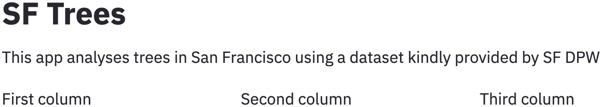
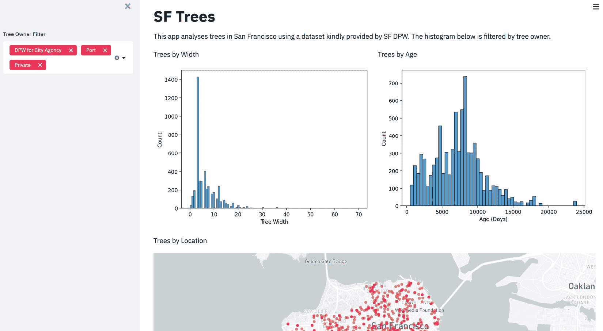

# 第六章：*第六章*：美化 Streamlit 应用程序

欢迎来到本书的第二部分！在*第一部分*，*创建基本的 Streamlit 应用程序*中，我们专注于基础知识——可视化、部署和数据处理，这些都是开始使用 Streamlit 时至关重要的主题。在本部分中，我们的目的是通过更复杂的应用程序和用例来探索 Streamlit，目的是将您培养成 Streamlit 的专家用户。

在本章中，我们将处理包括侧边栏、列、颜色和主题等元素，来扩展我们制作美观 Streamlit 应用程序的能力。到本章结束时，您应该能更自如地创建比普通**最小可行产品**（**MVP**）更好的应用程序。我们将从学习列的使用开始，然后继续介绍本章讨论的其他元素，并将每个元素融入到主 Streamlit 应用程序中。

在本章中，我们将涵盖以下主题：

+   设置 SF（旧金山）Trees 数据集

+   在 Streamlit 中使用列

+   探索页面配置

+   使用 Streamlit 侧边栏

+   使用颜色选择器选择颜色

+   使用 Streamlit 主题

# 技术要求

本章需要一个免费的 GitHub 帐户，您可以在[`www.github.com`](https://www.github.com)注册。有关 GitHub 的完整介绍以及详细的设置说明，可以在前一章的*GitHub 快速入门*部分找到，*第五章*，*使用 Streamlit Sharing 部署 Streamlit*。

# 设置 SF Trees 数据集

在本章中，我们将再次使用 SF Trees 数据集，这是我们在*第三章*中使用的数据集，*数据可视化*。正如我们在之前的章节中所做的那样，我们需要按照以下步骤进行设置：

1.  为本章创建一个新文件夹。

1.  将我们的数据添加到文件夹中。

1.  为我们的应用程序创建一个 Python 文件。

让我们详细查看每个步骤。

在我们的主`streamlit_apps`文件夹中，在终端运行以下代码来创建一个名为`pretty_trees`的新文件夹。您也可以在终端外手动创建一个新文件夹：

```py
mkdir pretty_trees
```

现在，我们需要将数据从*第三章*，*数据可视化*，移动到本章的文件夹中。以下代码将数据复制到正确的文件夹：

```py
cp trees_app/trees.csv pretty_trees
```

如果您没有`trees_app`文件夹并且还没有完成*第三章*，*数据可视化*，您也可以从[`github.com/tylerjrichards/Getting-Started-with-Streamlit-for-Data-Science`](https://github.com/tylerjrichards/Getting-Started-with-Streamlit-for-Data-Science)下载必要的数据，数据将位于名为`trees_app`的文件夹中。

现在我们已经准备好了数据，我们需要创建一个 Python 文件来托管我们的 Streamlit 应用程序代码；以下代码正是为此目的而写：

```py
touch pretty_trees.py
```

`pretty_trees` 文件将包含我们的 Python 代码，因此请打开它并在你选择的文本编辑器中进行编辑，章节正式开始，我们将学习如何在 Streamlit 中使用列！

# 在 Streamlit 中使用列

在此之前的所有应用中，我们都将每个 Streamlit 任务视为自上而下的体验。我们将文本作为标题输出，收集用户输入，然后再展示我们的可视化内容。然而，Streamlit 允许我们通过 `st.beta_columns()` 特性将应用格式化为动态列。截至目前，列特性仍处于测试版（因此函数名中有 `beta_`），但预计在 2021 年某个时候该功能将不再是测试版，届时它将被命名为 `st.columns()`。

我们可以将 Streamlit 应用分为多个不同长度的列，然后将每列视为我们应用中的一个独特区域，用来展示文本、图形、图片或任何其他我们希望展示的内容。

在 Streamlit 中，列的语法使用 `with` 语法，你可能已经熟悉这种语法，用于资源管理、处理文件的打开和写入等 Python 用例。将 `with` 语法应用于 Streamlit 列的最简单理解方式是，它们是自包含的代码块，告诉 Streamlit 在我们的应用中准确地放置项目。让我们通过一个示例来看它是如何工作的。以下代码导入我们的 SF Trees 数据集，并在其中创建三个等长的列，每个列中写入一些文本：

```py
import streamlit as st
import pandas as pd
st.title('SF Trees')
st.write('This app analyses trees in San Francisco using'
         ' a dataset kindly provided by SF DPW')
trees_df = pd.read_csv('trees.csv')
col1, col2, col3 = st.beta_columns((1,1,1))
with col1:
     st.write('First column')
with col2:
     st.write('Second column')
with col3:
     st.write('Third column')
```

上述代码将创建如下截图所示的应用：



图 6.1 – 前三列

如我们所见，`st.beta_columns()` 定义了三个等长的列，我们使用 `with` 语法在每个列中打印一些文本。我们也可以直接在预定义的列上调用 `st.write()` 函数（或任何其他将内容写入 Streamlit 应用的 Streamlit 函数），以获得相同的结果，如以下代码所示。以下代码将产生与前一个代码块完全相同的输出：

```py
import streamlit as st
import pandas as pd
st.title('SF Trees')
st.write('This app analyses trees in San Francisco using'
         ' a dataset kindly provided by SF DPW')
trees_df = pd.read_csv('trees.csv')
col1, col2, col3 = st.beta_columns((1,1,1))
col1.write('First column')
col2.write('Second column')
col3.write('Third column')
```

随着我们编写更多复杂的 Streamlit 应用，每个列中包含更多内容，`with` 语句往往使得应用更加简洁，更容易理解和调试。本书的大多数部分将尽可能使用 `with` 语句。

在 Streamlit 中，列的宽度是相对于其他已定义列的大小的。因此，如果我们将每列的宽度从 `1` 扩大到 `10`，我们的应用不会发生任何变化。此外，我们也可以传递一个数字给 `st.beta_columns()`，它将返回指定数量的等宽列。以下代码块展示了三种列宽度选项，它们都会产生相同的列宽：

```py
#option 1
col1, col2, col3 = st.beta_columns((1,1,1))
#option 2
col1, col2, col3 = st.beta_columns((10,10,10))
#option 3
col1, col2, col3 = st.beta_columns(3)
```

最后一个例子，以下代码块允许用户输入来确定每一列的宽度。请随意尝试生成的应用程序，以更好地理解我们如何使用列来改变 Streamlit 应用程序中的布局格式：

```py
import streamlit as st
import pandas as pd
st.title('SF Trees')
st.write('This app analyses trees in San Francisco using'
         ' a dataset kindly provided by SF DPW')
trees_df = pd.read_csv('trees.csv')
first_width = st.number_input('First Width', min_value=1, value=1)
second_width = st.number_input('Second Width', min_value=1, value=1)
third_width = st.number_input('Third Width', min_value=1, value=1)
col1, col2, col3 = st.beta_columns(
      (first_width,second_width,third_width))
with col1:
     st.write('First column')
with col2:
     st.write('Second column')
with col3:
     st.write('Third column')
```

在*第三章*《数据可视化》中，我们使用以下代码来展示 Streamlit 内置函数 `st.line_chart()`、`st.bar_chart()` 和 `st.area_chart()` 之间的差异：

```py
import streamlit as st
import pandas as pd
st.title('SF Trees')
st.write('This app analyses trees in San Francisco using'
         ' a dataset kindly provided by SF DPW')
trees_df = pd.read_csv('trees.csv')
df_dbh_grouped = pd.DataFrame(trees_df.groupby(['dbh']).count()['tree_id'])
df_dbh_grouped.columns = ['tree_count']
st.line_chart(df_dbh_grouped)
st.bar_chart(df_dbh_grouped)
st.area_chart(df_dbh_grouped)
```

上述代码块创建了以下 Streamlit 应用程序，其中三个按宽度分组的旧金山树木图表依次排列（为了简洁起见，仅显示了两个图表）：


图 6.2 – SF 线形图和条形图

本次练习的目的是更好地理解 Streamlit 的三个函数，但如果我们需要滚动才能看到所有内容，那我们该怎么做呢？让我们通过使用三列将三个图表并排放置来改进这一点。以下代码预定义了三个宽度相等的列，并将每个图表放入其中：

```py
import streamlit as st
import pandas as pd
st.title('SF Trees')
st.write('This app analyses trees in San Francisco using'
         ' a dataset kindly provided by SF DPW')
trees_df = pd.read_csv('trees.csv')
df_dbh_grouped = pd.DataFrame(trees_df.groupby(['dbh']).count()['tree_id'])
df_dbh_grouped.columns = ['tree_count']
col1, col2, col3 = st.beta_columns(3)
with col1:
     st.line_chart(df_dbh_grouped)
with col2:
     st.bar_chart(df_dbh_grouped)
with col3:
     st.area_chart(df_dbh_grouped)
```

当我们运行前面的代码时，得到一个奇怪的结果，如下截图所示：


图 6.3 – 窄图表

这显然不是我们想要的结果！每个图表都太窄了。幸运的是，这引出了我们的下一个小主题——Streamlit 中的页面配置。

# 探索页面配置

Streamlit 允许我们在每个 Streamlit 应用程序的顶部配置一些基本的页面特定功能。到目前为止，我们一直在使用 Streamlit 默认设置，但在 Streamlit 应用程序的顶部，我们可以手动配置所有内容，从在 Web 浏览器中打开 Streamlit 应用时显示的页面标题，到页面布局，再到侧边栏的默认状态（我们将在*使用 Streamlit 侧边栏*章节中介绍！）。

Streamlit 应用程序的默认设置是页面布局居中，这也是为什么我们的应用程序在边缘有大量空白空间的原因。以下代码将我们的 Streamlit 应用程序设置为宽屏格式，而不是默认的居中格式：

```py
import streamlit as st
import pandas as pd
st.set_page_config(layout='wide')
st.title('SF Trees')
st.write('This app analyses trees in San Francisco using'
         ' a dataset kindly provided by SF DPW')
trees_df = pd.read_csv('trees.csv')
df_dbh_grouped = pd.DataFrame(trees_df.groupby(['dbh']).count()['tree_id'])
df_dbh_grouped.columns = ['tree_count']
col1, col2, col3 = st.beta_columns(3)
with col1:
     st.line_chart(df_dbh_grouped)
with col2:
     st.bar_chart(df_dbh_grouped)
with col3:
     st.area_chart(df_dbh_grouped)
```

当我们运行前面的代码时，我们会看到三个图表之间的间距合适，我们可以轻松比较三个图表。以下截图展示了宽格式的 Streamlit 应用程序：


图 6.4 – 宽格式图表

这标志着我们对 Streamlit 列的探索结束，也结束了对页面配置默认设置的首次介绍。在本书的剩余部分，我们将越来越多地使用这两项技能。我们的下一个主题是介绍 Streamlit 侧边栏。

# 使用 Streamlit 侧边栏

正如我们已经在 Streamlit 中看到的，当我们开始接受大量用户输入并且开发较长的 Streamlit 应用时，我们经常失去让用户在同一屏幕上查看输入和输出的能力。在其他情况下，我们可能希望将所有用户输入放入一个独立的部分，以清晰地将输入和输出在我们的 Streamlit 应用中区分开来。对于这两种用例，我们可以使用 Streamlit 侧边栏，它允许我们在 Streamlit 应用的左侧放置一个可最小化的侧边栏，并在其中添加任何 Streamlit 组件。

首先，我们可以制作一个基础示例，使用我们前面的应用中的一个图形，并根据用户输入过滤背后的数据。在这种情况下，我们可以要求用户指定树木所有者的类型（例如私人所有者或公共工程部门），并使用`st.multiselect()`函数在这些条件下进行过滤，该函数允许用户从列表中选择多个选项：

```py
import streamlit as st
import pandas as pd
st.title('SF Trees')
st.write('This app analyses trees in San Francisco using'
         ' a dataset kindly provided by SF DPW. The '
         'histogram below is filtered by tree owner.')
trees_df = pd.read_csv('trees.csv')
owners = st.sidebar.multiselect(
     'Tree Owner Filter', trees_df['caretaker'].unique())
if owners:
     trees_df = trees_df[trees_df['caretaker'].isin(owners)] 
df_dbh_grouped = pd.DataFrame(trees_df.groupby(['dbh']).count()['tree_id'])
df_dbh_grouped.columns = ['tree_count']
st.line_chart(df_dbh_grouped)
```

前述代码将创建以下 Streamlit 应用。与之前一样，我们将`owners`变量隐藏在`if`语句中，因为我们希望应用在用户未从选项中选择之前，使用整个数据集。侧边栏使用户能够轻松看到他们选择的选项和我们应用的输出：


图 6.5 – 第一个侧边栏

我们为这个应用程序的下一步将是添加更多的可视化，首先从我们在*第三章*中创建的树木地图开始，然后将侧边栏与我们在本章中学到的列结合。

以下代码将整个旧金山地区的树木地图，按我们的多选框过滤，放在直方图下方：

```py
import streamlit as st
import pandas as pd
trees_df = pd.read_csv('trees.csv')
owners = st.sidebar.multiselect(
     'Tree Owner Filter', trees_df['caretaker'].unique())
st.title('SF Trees')
st.write('This app analyses trees in San Francisco using'
         ' a dataset kindly provided by SF DPW. The '
         'histogram below is filtered by tree owner.')
st.write('The current analysis is of trees owned by {}'.format(owners))
if owners:
     trees_df = trees_df[trees_df['caretaker'].isin(owners)] 
df_dbh_grouped = pd.DataFrame(trees_df.groupby(['dbh']).count()['tree_id'])
df_dbh_grouped.columns = ['tree_count']
st.line_chart(df_dbh_grouped)
trees_df = trees_df.dropna(subset=['longitude', 'latitude'])
trees_df = trees_df.sample(n = 1000, replace=True)
st.map(trees_df)
```

以下截图展示了前述代码生成的 Streamlit 应用，其中折线图位于新地图的上方，地图显示了按树木所有者过滤的旧金山树木：


图 6.6 – 带侧边栏的过滤地图

我们为这个应用程序的下一步将是将我们在列中学到的内容与侧边栏结合，通过在地理地图上方添加另一个图形来实现。在*第三章*中，*数据可视化*，我们创建了一个树龄的直方图。我们可以将其用作这个 Streamlit 应用中的第三个图形。以下代码块实现了这一点，并且将折线图转换为与我们树龄图形相同的库（`seaborn`）：

```py
import streamlit as st
import pandas as pd
import seaborn as sns
import datetime as dt
import matplotlib.pyplot as plt
st.title('SF Trees')
st.write('This app analyses trees in San Francisco using'
         ' a dataset kindly provided by SF DPW. The '
         'histogram below is filtered by tree owner.')
trees_df = pd.read_csv('trees.csv')
trees_df['age'] = (pd.to_datetime('today') -
                   pd.to_datetime(trees_df['date'])).dt.days
owners = st.sidebar.multiselect(
     'Tree Owner Filter', trees_df['caretaker'].unique())
if owners:
     trees_df = trees_df[trees_df['caretaker'].isin(owners)] 
df_dbh_grouped = pd.DataFrame(trees_df.groupby(['dbh']).count()['tree_id'])
df_dbh_grouped.columns = ['tree_count']
```

第一部分做了以下事情：

1.  它加载树木数据集。

1.  它基于数据集中的日期列添加了一个年龄列。

1.  它在侧边栏创建了一个多选组件。

1.  它根据侧边栏进行过滤。

我们的下一步是创建三个图形：

```py
#define multiple columns, add two graphs
col1, col2 = st.beta_columns(2)
with col1:
     st.write('Trees by Width')
     fig_1, ax_1 = plt.subplots()
     ax_1 = sns.histplot(trees_df['dbh'])
     plt.xlabel('Tree Width')
     st.pyplot(fig_1)
with col2:
     st.write('Trees by Age')
     fig_2, ax_2 = plt.subplots()
     ax_2 = sns.histplot(trees_df['age'])
     plt.xlabel('Age (Days)')
     st.pyplot(fig_2)
st.write('Trees by Location')
trees_df = trees_df.dropna(subset=['longitude', 'latitude'])
trees_df = trees_df.sample(n = 1000, replace=True)
st.map(trees_df)
```

正如我们在 *第三章* *数据可视化* 中讨论的那样，Streamlit 的内置功能，如 `st.map()` 和 `st.line_chart()`，对于快速可视化非常有用，但缺少一些配置选项，如适当的标题或轴名称更改。以下截图展示了我们的 Streamlit 应用，其中预设了几个树主筛选器：



图 6.7 – 三个过滤后的图表

本章要讨论的下一个特性是如何获取和使用用户输入的颜色，这将在下一节中详细介绍。

# 使用颜色选择器选择颜色

在应用程序中，获取颜色作为用户输入是非常困难的。如果用户想要红色，他们是想要浅红色还是深红色？是栗色还是带点粉色的红色？Streamlit 解决这个问题的方法是 `st.color_picker()`，它允许用户选择颜色，并返回该颜色的十六进制字符串（十六进制字符串是定义特定颜色阴影的唯一字符串，通常作为大多数图形库的输入）。以下代码将颜色选择器添加到我们之前的应用程序中，并根据用户选择的颜色更改 Seaborn 图表的颜色：

```py
import streamlit as st
import pandas as pd
import seaborn as sns
import datetime as dt
import matplotlib.pyplot as plt
st.title('SF Trees')
st.write('This app analyses trees in San Francisco using'
         ' a dataset kindly provided by SF DPW. The '
         'histogram below is filtered by tree owner.')
#load trees dataset, add age column in days
trees_df = pd.read_csv('trees.csv')
trees_df['age'] = (pd.to_datetime('today') -
                   pd.to_datetime(trees_df['date'])).dt.days
#add tree owner filter to sidebar, then filter, get color 
owners = st.sidebar.multiselect(
     'Tree Owner Filter', trees_df['caretaker'].unique())
graph_color = st.sidebar.color_picker('Graph Colors')
if owners:
     trees_df = trees_df[trees_df['caretaker'].isin(owners)] 
#group by dbh for leftmost graph
df_dbh_grouped = pd.DataFrame(trees_df.groupby(['dbh']).count()['tree_id'])
df_dbh_grouped.columns = ['tree_count']
```

与我们之前的应用不同的是，这里添加了 `graph_color` 变量，它是 `st.color_picker()` 函数的结果。我们为这个颜色选择器添加了一个名称，并将其放置在侧边栏中，紧挨着所有者的多选组件。现在，我们已获取到用户的颜色输入，可以使用这个颜色来改变图表中的颜色，如下所示的代码所示：

```py
#define multiple columns, add two graphs
col1, col2 = st.beta_columns(2)
with col1:
     st.write('Trees by Width')
     fig_1, ax_1 = plt.subplots()
     ax_1 = sns.histplot(trees_df['dbh'], 
          color=graph_color)
     plt.xlabel('Tree Width')
     st.pyplot(fig_1)
with col2:
     st.write('Trees by Age')
     fig_2, ax_2 = plt.subplots()
     ax_2 = sns.histplot(trees_df['age'],
          color=graph_color)
     plt.xlabel('Age (Days)')
     st.pyplot(fig_2)
st.write('Trees by Location')
trees_df = trees_df.dropna(subset=['longitude', 'latitude'])
trees_df = trees_df.sample(n = 1000, replace=True)
st.map(trees_df)
```

当你运行这个 Streamlit 应用时，你可以准确看到颜色选择器是如何工作的（本书为黑白印刷版，因此在纸质版中不可见）。它有一个默认颜色（在我们的例子中是黑色），你可以通过选择组件然后点击你想要的颜色来进行更改。以下截图展示了点击组件后的状态和我们 SF Trees 应用中的结果：


图 6.8 – 颜色选择器

现在我们已经知道如何在 Streamlit 中更改可视化图表的颜色，如何更改整个 Streamlit 应用程序的格式和配色方案呢？下一章将探讨 Streamlit 主题，以及如何设置不同的主题来美化 Streamlit 应用。

# 使用 Streamlit 主题

到目前为止，我们的应用程序除了在颜色选择器部分外，所有的背景和配色方案都是完全相同的。Streamlit 允许我们更新应用程序，并将背景和各种组件的颜色作为自定义功能进行更改。通过这个功能，我们可以创建默认使用暗黑模式的 Streamlit 应用，或是具有完美配色的应用，甚至可以创建确保色盲人士也能看到我们所有可视化内容的主题。

编辑应用程序*主题*有两种方法——通过 UI 界面或通过我们在*第三章*中使用的相同`config.toml`设置，*数据可视化*。当我们运行 Streamlit 应用程序时，在右上角会有一个小的汉堡菜单图标。点击该图标后，再点击**设置**，我们将看到以下选项出现在屏幕中间：


图 6.9 – 主题编辑

使用前面的菜单，我们可以在**浅色**和**深色**主题之间切换，当我们点击**编辑当前主题**时，可以看到所有的主题编辑选项，如下图所示：


图 6.10 – 编辑当前主题

从前面的截图中，我们可以观察到以下内容可以切换：

+   **主色**：用于交互的颜色

+   **背景色**：应用程序的背景

+   **次要背景色**：组件内部的背景

+   **文本颜色/字体**：应用程序文本的颜色和字体

随意点击它们并更改颜色，观察这如何影响你的 Streamlit 应用程序。一旦你找到了几种喜欢的颜色用于我们的 SF Trees 应用程序，你可以将它们添加到`.streamlit`/`config.toml`文件中的主题部分，以下是`config.toml`文件中的说明以及我为我的主题选择的颜色：

```py
[theme]
# Primary accent color for interactive elements.
primaryColor = "#de8ba1"
# Background color for the main content area.
backgroundColor = "#f4f1ea"
# Background color used for the sidebar and most interactive widgets.
secondaryBackgroundColor = "#9fe4cc"
# Color used for almost all text.
textColor = "#262730"
```

当我们保存这个文件并重新运行应用程序时，我们将在下图中看到我们的应用程序现在拥有了自定义主题，正如预期的那样：


图 6.11 – 自定义主题输出

我发现让 Streamlit 主题看起来很棒的最简单方法是使用浏览器内的编辑器进行实时编辑，然后将结果复制并粘贴到 Streamlit 配置文件中，正如我们在这个例子中所做的那样。不过，和所有事情一样，玩得开心！尝试新的组合，尽可能使你的 Streamlit 应用程序变得更美丽。

# 总结

这就是我们与 SF Trees 数据集的冒险，以及学习如何使我们的 Streamlit 应用程序更加美观的方式。我们涵盖了将应用程序分成列和页面配置的内容，以及如何在侧边栏收集用户输入，通过`st.color_picker()`功能获取用户输入的特定颜色，最后学习如何使用 Streamlit 主题。

在下一章中，我们将通过了解如何下载和使用用户构建的 Streamlit 组件，来学习关于 Streamlit 的开源社区。
