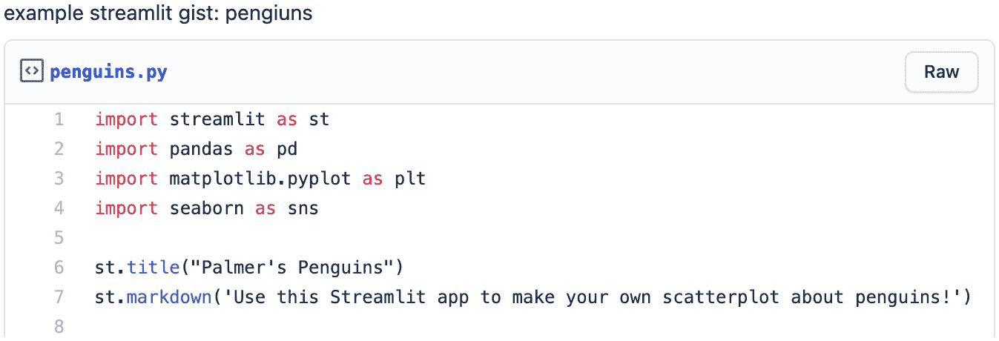
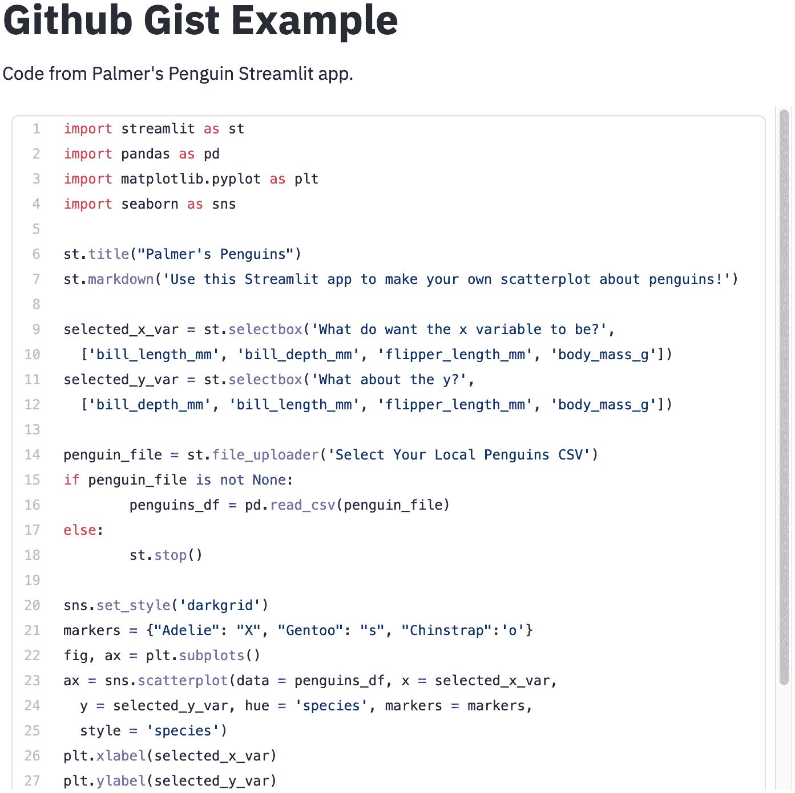
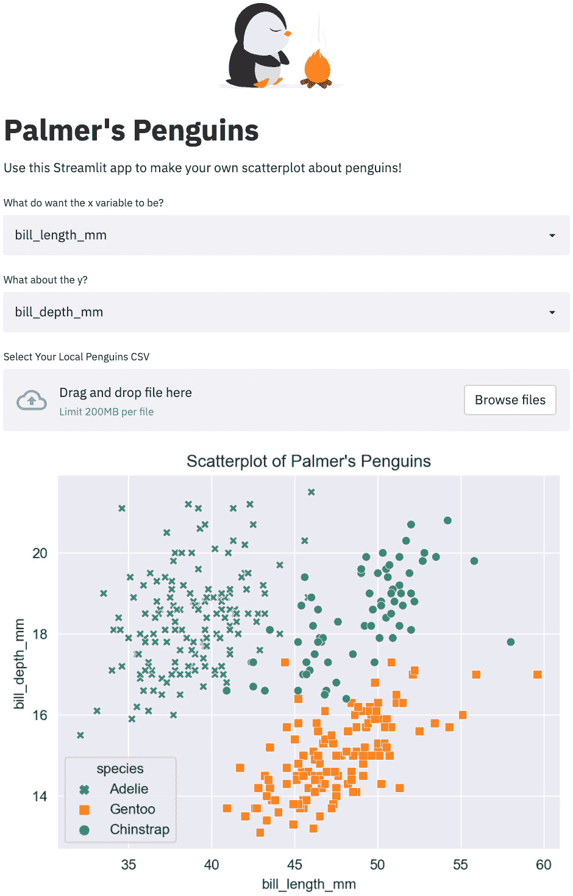
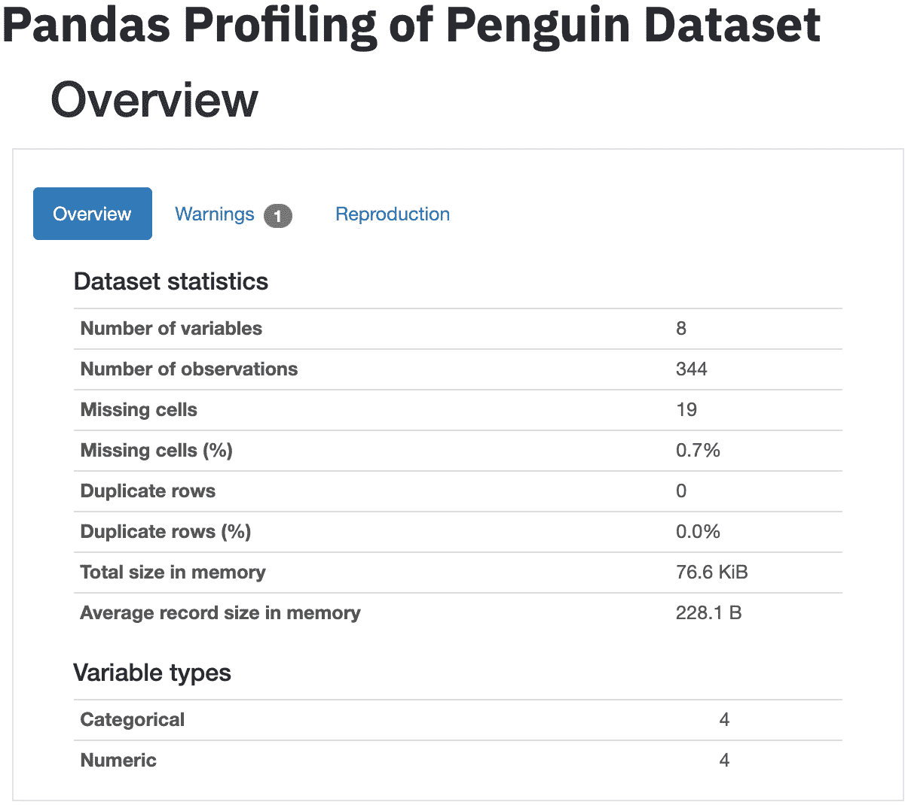
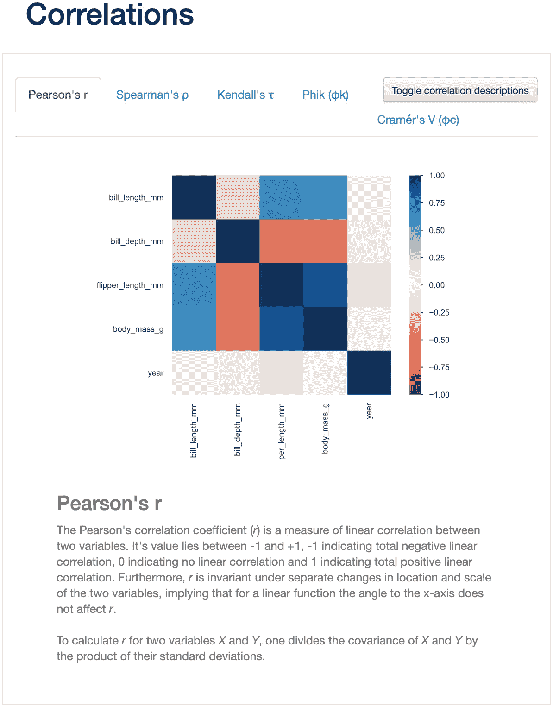

# 第七章：*第七章*：探索 Streamlit 组件

Streamlit 拥有一支全职开发团队，致力于新功能的开发，同时也因为它对社区驱动的开发持开放态度而蓬勃发展。毫无疑问，社区成员会有一些需求，想要实现一个没有进入优先开发路线图的特性。Streamlit 组件允许他们灵活地自己动手实现这些功能，并立即将自己的创意应用到他们的 Streamlit 应用中。

本章的重点是学习如何找到并使用社区制作的 Streamlit 组件。为此，我们将通过三个优秀的 Streamlit 应用进行实践，一个用于学习如何将代码嵌入到 Streamlit 应用中，另一个用于为应用添加美丽的动画，第三个用于将简便的自动化 **探索性数据分析**（**EDA**）嵌入到 Streamlit 应用中。

本章将涵盖以下内容：

+   使用 Streamlit 组件：`streamlit-embedcode`

+   使用 Streamlit 组件：`streamlit-lottie`

+   使用 Streamlit 组件：`streamlit-pandas-profiling`

+   查找更多组件

我们将在下一节中了解技术要求。

# 技术要求

在我们开始使用新的 Streamlit 组件之前，需要先下载它们。我们可以像在 *第一章*《Streamlit 简介》中一样，使用 `pip`（或任何其他包管理器）下载它们。这些是需要下载的组件：

+   `streamlit-embedcode`：要下载此库，在终端中运行以下代码：

    ```py
    pip install streamlit-embedcode
    ```

    `streamlit-embedcode`使得从其他位置（比如 GitHub 的 gist）导入代码块并直接在你的应用中显示变得容易，它是由 Streamlit 员工 Randy Zwitch 创建的。

+   `streamlit-lottie`：要下载此库，在终端中运行以下代码：

    ```py
    pip install streamlit-lottie
    ```

    `streamlit-lottie` 使用 `lottie` 开源库，允许我们将 Web 本地动画（如 **图形交换格式**（**GIF**）文件）添加到我们的 Streamlit 应用中。坦率地说，这是一个美化 Streamlit 应用的绝妙库，由 Streamlit 应用创作者 Andy Fanilo 创建。

+   `streamlit-pandas-profiling`：要下载此库，在终端中运行以下代码：

    ```py
    pip install streamlit-pandas-profiling
    ```

流行的 `pandas` Python 库是标准的 Python 数据分析库，通常位居数据科学家最受欢迎和最有用的 Python 库榜单之首。`pandas-profiling` 在我们创建的任何 DataFrame 上生成自动化的 EDA，并展示所有内容，从描述性统计到重复行的数量。它是由一位 GitHub 用户 *Okld* 创建的，GitHub 地址为 [`github.com/okld`](https://github.com/okld)。

现在我们已经安装了这三个库，我们可以继续学习第一个库：`streamlit-embedcode`。

# 使用 Streamlit 组件 – streamlit-embedcode

如果我们想在 Streamlit 中显示代码，我们可以很容易地将代码作为文本处理，并使用熟悉的 `st.write()`，它接受文本作为输入，或者使用 `st.markdown()`，它接受 Markdown 格式的输入。这对于小片段可能很好，但对于格式化较长的代码或普通用户来说，可能会显得比较困难且不美观。因此，创建了 `streamlit-embedcode` 来帮助解决这个问题。

向他人展示代码片段是一个常见的需求，现有的一些解决方案包括通过 GitHub 代码片段（它们类似于只包含一个文本文件的迷你 GitHub 仓库）或 GitLab 代码片段（与 GitHub 代码片段类似，只是为 GitLab 提供）共享代码片段，或者使用 Pastebin，这是一个 GitHub/GitLab 以外的共享文本/代码片段平台。现在，我们可以创建一个包含示例 Streamlit 代码的 Python 文件，将其放入 GitHub 代码片段，并从一个新的 Streamlit 应用中调用它。为此，我们将按以下步骤操作：

1.  对于这些选项，我们将首先创建一个简单的 Streamlit 应用，该应用只展示 `Palmer's Penguins` Streamlit 应用背后的代码。我们可以将此应用放入独立的 `component_example` 文件夹中，使用以下来自 `streamlit_apps` 文件夹的代码：

    ```py
    mkdir component_example 
    cd component_example 
    touch gist_example.py
    ```

1.  接下来，我们需要访问 [`gist.github.com/`](https://gist.github.com/) 来创建我们自己的代码片段。在我们登录 GitHub 后，需要为代码片段命名，然后将 `Palmer's Penguins` 的代码粘贴到以下代码块中（其中包含一个简短的解释）：

    ```py
    import streamlit as st 
    import pandas as pd 
    import matplotlib.pyplot as plt 
    import seaborn as sns 

    st.title("Palmer's Penguins") 
    st.markdown('Use this Streamlit app to make your own scatterplot about penguins!') 

    selected_x_var = st.selectbox('What do want the x variable to be?', 
      ['bill_length_mm', 'bill_depth_mm', 'flipper_length_mm', 'body_mass_g']) 
    selected_y_var = st.selectbox('What about the y?', 
      ['bill_depth_mm', 'bill_length_mm', 'flipper_length_mm', 'body_mass_g']) 

    penguin_file = st.file_uploader('Select Your Local Penguins CSV') 
    if penguin_file is not None: 
         penguins_df = pd.read_csv(penguin_file) 
    else: 
         st.stop()
    ```

    第一部分导入我们的库，添加一些标题文本，从用户那里获取一些输入，并下载正确的数据集。接下来，我们只需要绘制一个散点图，然后这段代码就完成了进入我们代码片段的部分。再次说明，这里的具体代码并不重要，因为它并不会在代码片段中执行——它只是将代码以更优美的方式传递给他人。以下代码片段展示了这一过程：

    ```py
    sns.set_style('darkgrid')
    markers = {"Adelie": "X", "Gentoo": "s", "Chinstrap":'o'}
    fig, ax = plt.subplots() 
    ax = sns.scatterplot(data = penguins_df, x = selected_x_var, 
      y = selected_y_var, hue = 'species', markers = markers,
      style = 'species') 
    plt.xlabel(selected_x_var) 
    plt.ylabel(selected_y_var) 
    plt.title("Scatterplot of Palmer's Penguins") 
    st.pyplot(fig)
    ```

    现在，我们应该有一个像这样的 GitHub 代码片段：

    

    图 7.1 – GitHub 代码片段示例

1.  当我们保存 GitHub 代码片段时，我们可以直接在 Streamlit 应用中链接到它。在 `gist_example.py` Python 文件中，我们需要从我们新创建的库中导入 `github_gist()` 函数，并将其应用于我们刚刚创建的 GitHub 代码片段。以下代码展示了如何对我的代码片段进行操作，但你应该用你自己的代码片段链接替换：

    ```py
    import streamlit as st 
    from streamlit_embedcode import github_gist
    st.title("Github Gist Example") 
    st.write("Code from Palmer's Penguin Streamlit app.")
    github_gist('https://gist.github.com/tylerjrichards/9dcf6df0c17ccb7b91baafbe3cdf7654')
    ```

    现在，如果我们需要编辑代码片段中的内容，我们可以直接编辑底层的代码片段，Streamlit 应用会自动更新。当我们启动保存在`gist_example.py`中的 Streamlit 应用时，我们将看到以下的 Streamlit 应用：



图 7.2 – 带 GitHub 代码片段的 Streamlit 应用

注意

对于任何公开的 Streamlit 应用程序，我们总是可以通过**设置**标签轻松访问该应用程序的源代码。因此，这种方法对于展示 Streamlit 应用程序背后的代码并不十分有用，因为这一点已经是内置的，但它对于展示常用的代码块非常有用，例如生成**机器学习**（**ML**）模型的通用代码或用户可能学习到的更通用的**结构化查询语言**（**SQL**）查询。

现在，让我们来学习如何使用`streamlit-lottie`为我们的应用程序添加美丽的动画吧！

# 使用 Streamlit 组件 – streamlit-lottie

正如我们在本章开始时提到的，`lottie`是一个由*Airbnb*创建的原生 Web 开源库，旨在让在网站上添加动画变得像添加静态图像一样简单。大型且盈利的科技公司常常通过发布开源软件来回馈开发者社区（或更可能是为了吸引认为其软件很酷的开发者），这一点也不例外。在这个案例中，`streamlit-lottie`是一个包装`lottie`文件的库，将它们直接嵌入到我们的 Streamlit 应用程序中。

为此，我们首先需要导入`streamlit-lottie`库，然后将`st_lottie()`函数指向我们的`lottie`文件。我们可以导入本地的`lottie`文件，或者更有可能的是，我们可以在免费的站点([`lottiefiles.com/`](https://lottiefiles.com/))上找到一个有用的动画文件，并将其从该站点加载到我们的应用程序中。

为了进行测试，我们可以在我们之前创建的《第四章》 *使用 Streamlit 进行机器学习*的企鹅应用程序顶部，添加一个可爱的企鹅动画（[`lottiefiles.com/39646-cute-penguin`](https://lottiefiles.com/39646-cute-penguin)）。在我们新的`components_example`文件夹中，我们可以添加一个新的`penguin_animated.py`文件，代码如下：

```py
touch penguin_animated.py
```

然后，在这个新文件中，我们可以创建这个新应用程序。以下代码块创建了一个函数，如`streamlit-lottie`库中的示例所示（[`github.com/andfanilo/streamlit-lottie`](https://github.com/andfanilo/streamlit-lottie)），它允许我们从 URL 加载`lottie`文件，并将该动画加载到应用程序顶部：

```py
import streamlit as st 
from streamlit_lottie import st_lottie
import requests
import pandas as pd 
import matplotlib.pyplot as plt 
import seaborn as sns 
def load_lottieurl(url: str):
    r = requests.get(url)
    if r.status_code != 200:
        return None
    return r.json()
lottie_penguin = load_lottieurl('https://assets9.lottiefiles.com/private_files/lf30_lntyk83o.json')
st_lottie(lottie_penguin, height=200)
```

上一段代码使用了`requests`库来定义一个我们可以用来从链接加载`lottie`文件的函数。在这个例子中，我已经预先填写了一个链接，指向一个可爱的企鹅动画。然后，我们可以使用我们的新函数加载文件，并通过我们从`streamlit-lottie`库中导入的`st_lottie()`函数调用该文件。接下来，我们可以用之前定义的用户输入和散点图完成应用程序。代码如下所示：

```py

st.title("Palmer's Penguins") 
st.markdown('Use this Streamlit app to make your own scatterplot about penguins!') 

selected_x_var = st.selectbox('What do want the x variable to be?', 
  ['bill_length_mm', 'bill_depth_mm', 'flipper_length_mm', 'body_mass_g']) 
selected_y_var = st.selectbox('What about the y?', 
  ['bill_depth_mm', 'bill_length_mm', 'flipper_length_mm', 'body_mass_g']) 

penguin_file = st.file_uploader('Select Your Local Penguins CSV') 
if penguin_file is not None: 
     penguins_df = pd.read_csv(penguin_file) 
else:
     penguins_df = pd.read_csv('penguins.csv')
sns.set_style('darkgrid')
markers = {"Adelie": "X", "Gentoo": "s", "Chinstrap":'o'}
fig, ax = plt.subplots() 
ax = sns.scatterplot(data = penguins_df, x = selected_x_var, 
  y = selected_y_var, hue = 'species', markers = markers,
  style = 'species') 
plt.xlabel(selected_x_var) 
plt.ylabel(selected_y_var) 
plt.title("Scatterplot of Palmer's Penguins") 
st.pyplot(fig)
```

这段代码将创建如下应用程序，它只是我们带有可爱企鹅动画的*Palmer's Penguins*应用程序（应用程序已被裁剪以简洁显示）：


](img/B16864_07_3.jpg)

图 7.3 – 可爱的企鹅动画

`streamlit-lottie` 还允许我们通过 `speed`、`width` 和 `height` 参数分别改变动画的速度、宽度和高度。如果你觉得动画播放得太慢，可以将速度增加到如 `1.5` 或 `2`，这样可以将速度提高 50% 或 100%。但是，`height` 和 `width` 参数是动画的像素高度/宽度，默认值是动画的原始尺寸（例如，企鹅动画的大小大约是 ~700 像素 x ~400 像素）。在下面的代码块中，我们将改变动画的速度、宽度和高度：

```py
import streamlit as st 
from streamlit_lottie import st_lottie
import requests
import pandas as pd 
import matplotlib.pyplot as plt 
import seaborn as sns 
def load_lottieurl(url: str):
    r = requests.get(url)
    if r.status_code != 200:
        return None
    return r.json()
lottie_penguin = load_lottieurl('https://assets9.lottiefiles.com/private_files/lf30_lntyk83o.json')
st_lottie(lottie_penguin, speed=1.5, width=800, height=400)
```

以下代码块与其他应用相同，只不过我们已经将动画的速度、宽度和高度分别更改为 `1.5`、`800` 和 `400`。需要一些时间才能适应这些输入如何交互，因为动画可能有不同的大小和速度！你可以在这里看到应用的不同设置：

```py

st.title("Palmer's Penguins") 
st.markdown('Use this Streamlit app to make your own scatterplot about penguins!') 

selected_x_var = st.selectbox('What do want the x variable to be?', 
  ['bill_length_mm', 'bill_depth_mm', 'flipper_length_mm', 'body_mass_g']) 
selected_y_var = st.selectbox('What about the y?', 
  ['bill_depth_mm', 'bill_length_mm', 'flipper_length_mm', 'body_mass_g']) 

penguin_file = st.file_uploader('Select Your Local Penguins CSV') 
if penguin_file is not None: 
     penguins_df = pd.read_csv(penguin_file) 
else:
     penguins_df = pd.read_csv('penguins.csv')
sns.set_style('darkgrid')
markers = {"Adelie": "X", "Gentoo": "s", "Chinstrap":'o'}
fig, ax = plt.subplots() 
ax = sns.scatterplot(data = penguins_df, x = selected_x_var, 
  y = selected_y_var, hue = 'species', markers = markers,
  style = 'species') 
plt.xlabel(selected_x_var) 
plt.ylabel(selected_y_var) 
plt.title("Scatterplot of Palmer's Penguins") 
st.pyplot(fig)
```

当我们通过增加宽度和高度使企鹅动画变得比之前的版本大得多时，可以看到动画大小的变化，正如下面的截图所示。当你自己运行时，你还会注意到动画速度也有所增加。我强烈建议你运行这个应用，因为企鹅动画真的非常可爱：



图 7.4 – 最终版企鹅动画应用

这就完成了我们对 `streamlit-lottie` 的介绍！我已经养成了在我创建的每个 Streamlit 应用的顶部放置一个漂亮的动画的习惯——这营造了一种设计感，让 Streamlit 应用显得更有目的性，并立即提醒用户，这不是一个静态文档，而是一个动态互动的应用程序。接下来，让我们进入 `pandas-profiling`！

# 使用 Streamlit 组件 – streamlit-pandas-profiling

`pandas-profiling` 是一个非常强大的 Python 库，它自动化了一些探索性数据分析（EDA）工作，这通常是任何数据分析、建模甚至数据工程任务的第一步。在数据科学家开始几乎所有的数据工作之前，他们希望先了解底层数据的分布、缺失行的数量、变量之间的相关性以及许多其他基本信息。正如我们之前提到的，这个库自动化了这一过程，并将这个交互式分析文档嵌入到 Streamlit 应用中供用户使用。

在名为 `pandas-profiling` 的 Streamlit 组件背后，有一个同名的完整 Python 库，该组件从中导入它的功能。这里的 Streamlit 组件实际上是以非常易于集成的方式呈现 `pandas-profiling` Python 库的输出。对于这一部分，我们将首先学习如何实现该库，然后探索生成的输出。

在我们的示例中，我们将继续使用上一节关于帕尔默企鹅的数据代码，并将自动生成的个人资料添加到应用程序的底部。该代码只有几行——我们需要为数据集生成报告，然后使用 Streamlit 组件将其添加到应用程序中。接下来的代码块导入了必要的库，然后基于我们定义的`penguins_df`变量创建并将个人资料添加到应用程序中：

```py
import streamlit as st 
from streamlit_lottie import st_lottie
import requests
import pandas as pd 
import matplotlib.pyplot as plt 
import seaborn as sns 
from pandas_profiling import ProfileReport
from streamlit_pandas_profiling import st_profile_report
def load_lottieurl(url: str):
    r = requests.get(url)
    if r.status_code != 200:
        return None
    return r.json()
lottie_penguin = load_lottieurl('https://assets9.lottiefiles.com/private_files/lf30_lntyk83o.json')
st_lottie(lottie_penguin, speed=1.5, width = 800, height = 400)

st.title("Palmer's Penguins") 
st.markdown('Use this Streamlit app to make your own scatterplot about penguins!') 

selected_x_var = st.selectbox('What do want the x variable to be?', 
  ['bill_length_mm', 'bill_depth_mm', 'flipper_length_mm', 'body_mass_g']) 
selected_y_var = st.selectbox('What about the y?', 
  ['bill_depth_mm', 'bill_length_mm', 'flipper_length_mm', 'body_mass_g']) 
```

本节使用了相同的`streamlit-lottie`库，同时加载了`pandas_profiling`和`streamlit-pandas-profiling`库以供使用。这是一个很好的经验——我们可以将 Streamlit 组件视为独特的乐高积木，随意组合它们来创建新的有趣的 Streamlit 应用程序。接下来的部分读取我们的 DataFrame，并将 pandas 个人资料添加到数据集中！以下是代码：

```py
penguin_file = st.file_uploader('Select Your Local Penguins CSV') 
if penguin_file is not None: 
     penguins_df = pd.read_csv(penguin_file) 
else:
     penguins_df = pd.read_csv('penguins.csv')
sns.set_style('darkgrid')
markers = {"Adelie": "X", "Gentoo": "s", "Chinstrap":'o'}
fig, ax = plt.subplots() 
ax = sns.scatterplot(data = penguins_df, x = selected_x_var, 
  y = selected_y_var, hue = 'species', markers = markers,
  style = 'species') 
plt.xlabel(selected_x_var) 
plt.ylabel(selected_y_var) 
plt.title("Scatterplot of Palmer's Penguins") 
st.pyplot(fig) 
st.title('Pandas Profiling of Penguin Dataset')
penguin_profile = ProfileReport(penguins_df, explorative=True)
st_profile_report(penguin_profile)
```

生成的应用程序包含这个个人资料，开始时是一个概述，包含有关变量数量、数据集的任何警告（例如，我们被警告说企鹅数据集的某些行缺失了性别信息）以及其他基本信息。以下截图显示了个人资料的顶部部分：



图 7.5 – pandas 个人资料

我强烈建议你亲自尝试这个组件，看看这几行代码所生成的大量信息。它包括每个变量的直方图和基本统计信息，数据集开始和结束的样本行，甚至是一个相关矩阵，解释了几种不同的相关变量。以下截图显示了我们企鹅数据集的相关性部分输出——我们可以立即看到，身体质量与企鹅的鳍足长度呈正相关：



图 7.6 – Pearson 相关系数

注意

自己尝试一下，看看完整的色谱效果。

希望你现在已经对如何使用这个组件添加探索性数据分析（EDA）有了清晰的理解，这对于邀请用户提供他们自己的数据集（例如在企鹅示例中）应该会有所帮助。

# 寻找更多组件

这三个组件仅仅是社区创建的所有组件的一个小部分，到你阅读这篇文章时，我相信这些组件的数量会大大增加。寻找新的有趣组件的最佳地方是 Streamlit 网站的[`streamlit.io/gallery?type=components&category=featured`](https://streamlit.io/gallery?type=components&category=featured) 或讨论论坛[`discuss.streamlit.io/tag/custom-components`](https://discuss.streamlit.io/tag/custom-components)。当你找到一个你认为有趣的组件时，就像我们之前做的那样，使用`pip`下载它并阅读足够的文档来开始使用！

# 总结

到此为止，我希望你已经非常熟悉如何下载和使用 Streamlit 组件，并且能够轻松找到社区创建的新的 Streamlit 组件。你还应该了解如何将 GitHub gist 示例、Lottie 动画和自动化的`pandas-profiling`功能添加到你构建的应用中。

在下一章，我们将深入探讨如何通过云服务提供商，如**亚马逊网络服务**（**AWS**），部署您自己的 Streamlit 应用。
