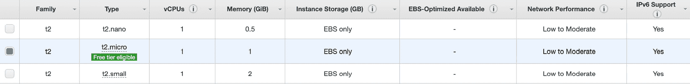

# 第八章：*第八章*：使用 Heroku 和 AWS 部署 Streamlit 应用

在 *第五章*中，*使用 Streamlit Sharing 部署 Streamlit*，我们学习了如何使用 Streamlit Sharing 部署我们的 Streamlit 应用。Streamlit Sharing 快速、简便，对于大多数应用都非常有效，但也有一些缺点，主要是我们只能同时托管三个免费的应用，并且计算能力也有限。以下摘自 Streamlit Sharing 页面：

应用程序最多可使用 1 个 CPU、800 MB 的 RAM 和 800 MB 的专用存储，且都在共享执行环境中运行。

如果你处于一个需要同时部署超过三个应用，或者需要更多计算能力的情况，例如运行更复杂的机器学习模型（需要 GPU 或更多 RAM），那么本章就是为你准备的！我们将介绍如何在 AWS 和 Heroku 上设置账户，并如何在那里完全部署你的 Streamlit 应用。

在本章中，我们将涵盖以下主题：

+   在 AWS、Streamlit Sharing 和 Heroku 之间选择

+   使用 Heroku 部署 Streamlit

+   使用 AWS 部署 Streamlit

# 技术要求

这是本章所需安装项的清单：

+   **Heroku 账户**：Heroku 是一个受欢迎的平台，数据科学家和软件工程师用它来托管他们的应用、模型和 API（应用程序接口），并且它是由 Salesforce 所拥有。要获取 Heroku 账户，请前往 [`signup.heroku.com`](https://signup.heroku.com) 创建一个免费账户。

+   **Heroku 命令行界面** (**CLI**)：要有效使用 Heroku，我们需要下载 Heroku CLI，这样我们才能运行 Heroku 命令。要下载它，请按照此处列出的说明操作：[`devcenter.heroku.com/articles/heroku-cli`](https://devcenter.heroku.com/articles/heroku-cli)。

+   **亚马逊网络服务** (**AWS**) **账户**：在使用 AWS 之前，我们首先需要注册一个自己的 Amazon 账户，你可以通过 [`aws.amazon.com/free`](https://aws.amazon.com/free) 完成注册。幸运的是，学生（持 .edu 账户）、创业公司创始人和非营利组织有一个慷慨的免费套餐可以使用。一旦注册成功，我强烈建议你在账户中设置账单提醒（详情见 [`console.aws.amazon.com/billing/home?#preferences`](https://console.aws.amazon.com/billing/home?#preferences)），确保你不会超出免费套餐，并且在你部署自己的应用时，确保不会花费超过预期。

+   **PuTTy**（仅限 Windows）：如果你使用 Windows，你需要下载并安装 PuTTY 程序，它允许 Windows 操作系统使用一种叫做 **安全外壳协议**（**SSH**）的协议。要下载 PuTTY，请前往 [`www.putty.org/`](https://www.putty.org/) 并按照安装说明进行操作。然后，在本章中每次使用 SSH 时，打开 PuTTY 并按常规步骤进行操作！

现在我们已经有了需求，让我们开始吧！

# 选择 AWS、Streamlit Sharing 和 Heroku 之间的权衡

从高层次来看，当我们试图部署 Streamlit 应用，使得互联网上的用户能够看到我们的应用时，实际上我们在做的是租用一台由其他人（如 Amazon）拥有的计算机，并向这台计算机提供一系列启动我们应用的指令。选择使用哪个平台，如果没有系统部署的背景或者没有先试过每个选项，是很难决定的，但有几个启发式方法可以帮助你。这个决策的两个最重要因素是系统的灵活性和启动所需的时间。请注意，这两个因素是相互权衡的。如果你使用 Streamlit Sharing，你不能说“我想在 macOS 上运行，并且我想给这个应用加两个 GPU”等等，但作为回报，你获得了一个极其简单的过程，你只需要将 Streamlit Sharing 指向你的 GitHub 仓库，它会处理所有其他需要做的小决策。

另一方面，AWS 和 Heroku 给你提供了更多的灵活性，但需要时间来设置（正如你将发现的那样！）。这两者之间最大的区别在于，Heroku 是一个 *平台即服务产品*，而 Amazon 是一个 *基础设施即服务产品*，这意味着从实际操作上来说，Heroku 相比 Streamlit Sharing 提供了更多的灵活性，允许你做一些事情，比如提供更多的计算资源，并且比 AWS 更快部署，正如你在下图中所看到的：


图 8.1 – Heroku 与 AWS 与 Sharing

然而，AWS 的优势在于其极高的灵活性。AWS 允许你在 Ubuntu、macOS、Windows 和 Red Hat Linux 之间进行选择，支持多种不同类型的数据库，并且似乎是无限可定制的。当你在构建 Streamlit 应用时，如果你想快速制作一个原型来测试某个想法，Streamlit Sharing 是非常适合你的。如果你需要一个功能完善的公共应用，并且需要更多计算资源，那么 Heroku 可能是最佳选择。如果你需要为复杂的机器学习应用提供终极灵活性，或者你的业务完全依赖于 Streamlit，那么 AWS 可能是最佳选择。在本章的其余部分，我们将深入探讨如何在 AWS 和 Heroku 上部署你自己的应用，因为我们已经在*第五章*中直接介绍了 Streamlit Sharing 的内容，*使用 Streamlit Sharing 部署 Streamlit*。让我们从 Heroku 开始吧！

# 使用 Heroku 部署 Streamlit

Heroku 比 AWS 稍微更快、更简洁，但比 Streamlit Sharing 更繁琐。不过，如果你的 Streamlit Sharing 仓库已经用完，或者你需要更多计算资源，但不想要 AWS 提供的无限配置选项，那么 Heroku 就是适合你的地方。另一个优点是，你可以为应用设置自定义 URL，而 Streamlit Sharing 目前不支持这一点（至少目前还不支持）。要在 Heroku 上部署我们的 Streamlit 应用，我们需要执行以下步骤：

1.  设置并登录 Heroku。

1.  克隆并配置我们的本地仓库。

1.  部署到 Heroku。

让我们详细看看每个步骤！

## 设置和登录 Heroku

在本章的*技术要求*部分，我们介绍了如何下载 Heroku 并创建账户。现在，我们需要通过命令行登录 Heroku，运行以下命令，并在提示时进行登录：

```py
heroku login
```

这将把我们带到 Heroku 页面，一旦我们登录，就可以开始了。这个命令将使你在机器上保持登录状态，直到密码更改或你故意退出 Heroku。

## 克隆并配置我们的本地仓库

接下来，我们需要切换到企鹅机器学习应用所在的目录。我的应用文件夹在`Documents`文件夹内，因此以下命令将我带到该文件夹，但你的文件夹可能不同：

```py
cd ~/Documents/penguin_ml
```

如果你还没有将仓库下载到本地，并且在 GitHub 上没有相应的仓库，可以去看看*第五章*，*使用 Streamlit Sharing 部署 Streamlit*，了解如何开始使用 GitHub。或者，你也可以运行以下命令，从我个人的 GitHub 上下载仓库，就像我们在从 AWS 部署时所做的那样：

```py
git clone https://github.com/tylerjrichards/penguin_ml.git
```

强烈建议你使用自己的 GitHub 仓库进行实践，因为这比从我这里克隆应用并将其部署到 Heroku 要好得多。

现在，我们需要使用下一个命令为我们的应用创建一个唯一名称的 Heroku 应用（该应用将作为此名称进行部署，后缀为 `.heroku.com`）。我的名称是 `penguin-machine-learning`，你可以自己选择一个！

```py
heroku create penguin-machine-learning
```

一旦我们有了这些，我们需要显式地将我们的 Git 仓库与刚创建的 Heroku 应用连接，这可以通过以下命令来完成：

```py
heroku git:remote -a penguin-machine-learning
```

最后，我们将添加两个文件到仓库中，它们是启动 Heroku 所必需的：`Procfile` 文件和 `streamlit_setup.sh` 文件。Heroku 使用名为 `streamlit run` 的命令来启动我们的应用。我们先通过以下命令创建 `streamlit_setup.sh` 文件：

```py
touch streamlit_setup.sh
```

我们可以用文本编辑器打开这个文件，并将以下内容添加进去，这样就能在根目录下创建我们熟悉的 `config.toml` 文件：

```py
mkdir -p ~/.streamlit
echo "[server]
headless = true
port = $PORT
enableCORS = false
" > ~/.streamlit/config.toml
```

保存此文件后，我们需要创建一个 Procfile，运行 `streamlit_setup.sh` 文件，并启动我们的 Streamlit 应用：

```py
touch Procfile
```

在我们刚刚创建的 `Procfile` 文件中，我们接下来将添加以下内容：

```py
web: sh streamlit_setup.sh && streamlit run penguins_streamlit.py
```

现在我们已经设置好 Streamlit 应用，最后一步就是将其部署到 Heroku！

## 部署到 Heroku

在部署之前，我们的应用中有几个新的文件，所以我们需要通过以下命令将它们添加到 Git 仓库中：

```py
git add .
git commit -m 'added heroku files'
git push
```

现在，本章的最后一步是将应用推送到 Heroku，我们可以通过以下命令来完成：

```py
git push heroku main
```

这将启动 Heroku 构建，不久我们就会看到我们的企鹅应用被部署到 Heroku，任何人都可以查看。我们一直在开发并刚刚部署的应用可以通过以下链接找到（附带截图！），[`penguin-machine-learning.herokuapp.com/`](https://penguin-machine-learning.herokuapp.com/)，该应用的 GitHub 仓库可以在 [`github.com/tylerjrichards/penguin_ml`](https://github.com/tylerjrichards/penguin_ml) 找到。它与我们在本章早些时候部署到 AWS 的应用相同，如下图所示：


图 8.2 – Heroku 应用部署

我们已经成功地将一个 Streamlit 应用部署到 Heroku 平台，但如果我们需要更多控制权，想要更灵活地管理应用背后的服务器，我们需要直接在 AWS 上构建，如下节所示！

# 使用 AWS 部署 Streamlit

相比于 Heroku，AWS 部署应用的过程要复杂得多，但它提供了几乎无限的选项。部署自己的应用到 AWS 需要几个步骤，包括以下内容：

1.  选择并启动虚拟机

1.  安装必要的软件

1.  克隆并运行你的应用

1.  长期的 AWS 部署

我们将按顺序逐步进行！

## 选择并启动虚拟机

AWS 几乎拥有成百上千种服务选项，涵盖从部署机器学习模型、计算资源到各种其他应用。在本书中，我们提到了以下截图中的服务，这些服务都被统一归类为 *AWS*，但更准确地说，我们将使用 **Amazon Elastic Compute Cloud**，简称 **Amazon EC2**。下面的截图展示了仅针对计算资源的服务范围，这不包括任何与机器学习、业务应用或存储相关的服务：


图 8.3 – AWS 计算

Amazon EC2 是一种动态的、按需付费的服务，会根据使用情况自动扩展。如果你的 Streamlit 应用有 10、100 或 10,000 个并发用户，EC2 会自动调整分配给应用的计算资源，以满足用户需求。你只需为实际使用的资源付费！

要开始使用，前往 [`console.aws.amazon.com/ec2/v2/home`](https://console.aws.amazon.com/ec2/v2/home) 并点击显示 **Launch instance** 的按钮，如下截图所示。你的默认区域可能与我的不同，完全没问题！AWS 区域允许你选择计算资源的物理位置，以便满足低延迟需求，或者满足由于法规要求而必须选择特定地区的数据托管（例如，**通用数据保护条例**（**GDPR**）要求在欧盟地区）。大多数情况下，AWS 为你选择的默认区域已经足够适用：


图 8.4 – EC2 启动

一旦你启动了实例，将会有七个标签：

+   **选择 AMI**（亚马逊机器镜像）或你的虚拟机使用的操作系统

+   **选择实例类型**（选择虚拟机的计算/内存/存储配置）

+   **配置实例**

+   **添加存储**

+   **添加标签**

+   **配置安全组**

+   **复习**

你可能开始理解我之前提到的“灵活性与速度”之间的权衡了！幸运的是，我们只需要从这些选项中选择其中几个，首先从选取我们的 AMI 开始。当我们点击 **Launch instance** 按钮时，我们将看到包括但不限于以下选项：

+   Amazon Linux 2 AMI

    这是亚马逊自有的选项，适用于免费套餐，并且与 EC2 的兼容性很好。

+   Red Hat 企业版 Linux

    这个选项是由红帽基金会创建的企业版 Linux，红帽基金会专注于开源企业解决方案 ([`www.redhat.com/en`](https://www.redhat.com/en))。根据版本和卷类型的不同，提供了多种选项。

+   Ubuntu Server

    Ubuntu 是另一个基于 Linux 构建的开源操作系统，类似于 Red Hat。它们也有各种免费和付费选项，与 Red Hat 类似。

我建议选择你最熟悉的操作系统。如果你已经使用过 Ubuntu 服务器，可以尝试最新的 Ubuntu 选项，在这种情况下是 Ubuntu Server 20.04。最常用的 AMI 选项都基于 Linux，这是一个开源操作系统，有很多变种，包括 Red Hat、Debian 和 Ubuntu。

为了跟上本章内容，选择默认的 Amazon 选项**Amazon Linux 2**。选中此选项后，你会进入**选择实例类型**页面，选择任何符合免费套餐条件的类型，如下图所示。当然，如果你想为更多内存或虚拟 CPU 付费也是可以的，但此时并不必要：



图 8.5 – AWS AMI 选项

接下来，我们可以跳过接下来的几个选项，直到你看到第六个标签，名为**配置安全组**。在这里，我们需要做几个编辑：

+   TCP 规则

    我们需要设置我们的 `8501`，即自定义的 Streamlit 端口。

+   访问源

    我们还需要允许任何人访问我们的应用，因此我们也将源设置为**任何地方**，如下图所示：


图 8.6 – 安全设置

现在，我们准备启动了！前往第七个标签**审查**，如果一切看起来正常，就点击**启动**按钮。接下来会弹出一个创建公私钥的方式，一把由 AWS 持有，另一把由你持有，以便你能够通过命令行访问这个新的虚拟计算机，如下图所示：


图 8.7 – 键值对

把它想象成一个独特的密码，它以文件的形式下载。你可以把这个文件保存在最方便和最安全的地方，但一定要确保从不将这个文件上传到公共位置，比如 GitHub 仓库，否则其他人可能会来访问你的虚拟机！现在，我们已经启动了 EC2 实例，可以通过命令行访问它并下载我们的应用。

## 安装必要的软件

在这个例子中，我们将尝试部署我们在*第四章*《*使用 Streamlit 进行机器学习*》中创建的企鹅 ML 应用，并在*第五章*《*通过 Streamlit Sharing 部署 Streamlit*》中进行部署，部署到 Streamlit Sharing 上。现在我们已经有了虚拟机和目标，接下来需要通过命令行访问我们的虚拟机。首先，我们需要找出 AWS 实例的公共 DNS。使用这个链接定位你的 AWS 实例，[`console.aws.amazon.com/ec2/v2/home#Instances`](https://console.aws.amazon.com/ec2/v2/home#Instances)，并查找 `ec2-10-857-84-485.compute-1.amazonaws.com`。这些数字是我随便编的，但你的应该与此类似。

现在，我们可以通过 SSH 访问我们的虚拟机，SSH 是安全外壳协议，使用以下命令来结合密码和公有 DNS：

```py
ssh -i "path_to_private_key.pem" ec2-user@<insert_Public_DNS>
```

经常，AWS 命令会让人感觉像是魔法咒语，尤其是当你刚开始时。经过一段时间的实践，你会变得更加熟练。此时，AWS 可能会在命令行中询问你一些问题，关于是否允许某些类型的访问，这取决于你的本地机器上安全设置的配置。在你确认希望连接后，如果你看到类似下图的内容，就知道你已经连接成功：


图 8.8 – AWS 登录

这是你自己的新虚拟计算机！这台计算机上没有任何程序、文件夹，几乎没有其他东西；它就是从亚马逊的盒子里出来的全新机器。我们通过`ec2`租用的每台计算机，起初几乎什么也没有，因此我们需要下载项目所需的一切。有很多方法可以做到这一点。我们可以执行以下操作：

+   手动安装所有内容。

+   安装一个预打包的安装程序，如 Anaconda 或 Miniconda。

+   使用 Docker 创建一组安装指令。

我建议在大多数使用案例中选择第二个选项，因为 Anaconda 或 Miniconda 设计用来处理安装 Python 时遇到的所有困难，包括路径设置问题，并且能够安装各种 Python 和 R 包。Anaconda 及其精简版（即更小的）Miniconda，以其在非自带环境下安装困难而著名。如果你需要在虚拟机或本地计算机上安装其他 Python 版本，我建议选择*选项 1*或*选项 3*。

对于在虚拟机上安装和设置 Miniconda，我们可以运行以下命令，使用`wget`下载 Miniconda 到文件位置`~/miniconda.sh`，然后使用`bash`运行安装文件，最后更改我们的路径，以便可以更轻松地使用`conda`下载包：

```py
wget https://repo.continuum.io/miniconda/Miniconda3-latest-Linux-x86_64.sh -O ~/miniconda.sh
bash ~/miniconda.sh -b -p ~/miniconda
export PATH="$HOME/miniconda/bin":$PATH
```

太好了！现在我们有了最新版本的`python`、`pip`以及一大堆 Python 包。然而，Miniconda 本身并不包含 Streamlit，因此我们将使用下一个命令来下载、安装并通过启动 Streamlit 演示应用来测试 Streamlit 的安装：

```py
pip install Streamlit
streamlit hello
```

当我们运行此命令时，应该会在终端中看到以下内容（尽管网络和外部网址可能不同）：


图 8.9 – 第一个 Streamlit 命令

当你从任何浏览器访问外部网址时，你将看到 Streamlit 演示应用，如下图所示：


图 8.10 – Streamlit 演示

我们现在已经从 AWS 部署了第一个 Streamlit 应用。现在，要部署我们构建的 Streamlit 应用。

## 克隆并运行你的应用

我们现在有了一个可以运行 Streamlit 的虚拟机，接下来的步骤是将我们自己的应用下载到机器上。最直接的方法是使用 Git 并克隆存储你企鹅机器学习应用的仓库。如果你还没有在*第五章*《使用 Streamlit Sharing 部署 Streamlit》中完成这一步，可以随时使用我的 GitHub 仓库：[`github.com/tylerjrichards/penguin_ml.git`](https://github.com/tylerjrichards/penguin_ml.git)。以下代码下载`git`并从 GitHub 下载我们的应用：

```py
conda install git
git clone https://github.com/tylerjrichards/penguin_ml.git
```

这将会在我们当前的目录下创建一个名为`penguin_ml`的新文件夹，里面包含 Streamlit 应用的所有文件。这个应用比 Miniconda 自带的库需要更多的库，比如 Seaborn 和 scikit-learn，因此我们需要在运行应用之前下载这些库。我们已经将这些库的名称放入一个名为`requirements.txt`的文件中，因此我们需要使用下一组命令将`pip`指向这个文件：

```py
cd penguin_ml
pip install -r penguin_ml/requirements.txt
```

现在，我们的最后一步是运行我们的 Streamlit 应用：

```py
streamlit run penguins_streamlit.py
```

当我们在 AWS 终端访问外部 URL 时，我们会看到我们的 Streamlit 应用在那里完全正常运行，如下图所示：


图 8.11 – AWS 企鹅应用

就这样！我们的应用现在已经在 AWS 上运行，可以被全世界看到。从这个点开始，我们可以通过你可能已经拥有的个人网站链接到我们的应用，或者将其发送给那些可能对分类自己的一组企鹅感兴趣的人。

## 长期 AWS 部署

我们面临的最后一个问题是，连接我们本地计算机与 AWS 的 SSH 会话必须保持运行，Streamlit 应用才能持续运行。在大多数使用场景下，这种方式不可行，因为你通常希望用户能够在本地计算机与 AWS 断开连接时，仍能与 Streamlit 应用进行交互。于是，`tmux`（终端复用器）就派上了用场，它可以保持终端会话持续运行，而不受本地连接的影响。要下载`tmux`，我们可以在连接到 AWS 虚拟机时运行以下命令：

```py
sudo yum install tmux
```

现在，我们可以开始一个新的`tmux`会话，并通过运行以下命令启动我们的 Streamlit 应用：

```py
tmux 
streamlit run penguins_streamlit.py
```

如果我们与 AWS 的连接断开，`tmux`将保持我们的应用运行。我们可以随时按*Ctrl + D*退出`tmux`会话，并通过运行`tmux attach`重新进入会话。

这样就完成了 Streamlit 与 AWS 的部署！正如你所见，Streamlit Sharing 可以开箱即用地解决大部分这些难题，因此我会尽量让 Streamlit Sharing 在可能的情况下工作。然而，这一会话应该让你更好地了解当我们使用 AWS 时所面临的广泛选项和配置控制，这在将来可能会派上用场。

总结

到目前为止，这一章是我们所有章节中最具技术性的，所以恭喜你坚持了下来！部署应用程序通常既困难又耗时，并且需要软件工程和 DevOps 方面的技能，还常常需要具备版本控制软件（如 Git）和 Unix 风格命令与系统的经验。这也是为什么 Streamlit Sharing 如此重要的创新之一，但在本章中，我们已经学习了如何通过租用自己的虚拟机，并在 AWS 和 Heroku 上进行部署，推动 Streamlit 部署的前沿。我们还学习了如何在开始之前确定正确的部署策略，这将节省数小时甚至数天的工作（没有什么比完成应用程序部署后发现需要使用另一个平台更糟糕的了！）。

接下来，我们将进入本书的第三部分，也是最后一部分，重点讨论 Streamlit 的各种应用，首先是如何通过 Streamlit 提升求职申请。下一章将重点讲解如何通过 Streamlit 应用打动招聘经理和招聘人员，如何在实际求职申请环节中使用 Streamlit 应用程序，比如许多面试中臭名昭著的带回家部分，以及如何通过数据项目证明技能，来提升数据科学简历。
