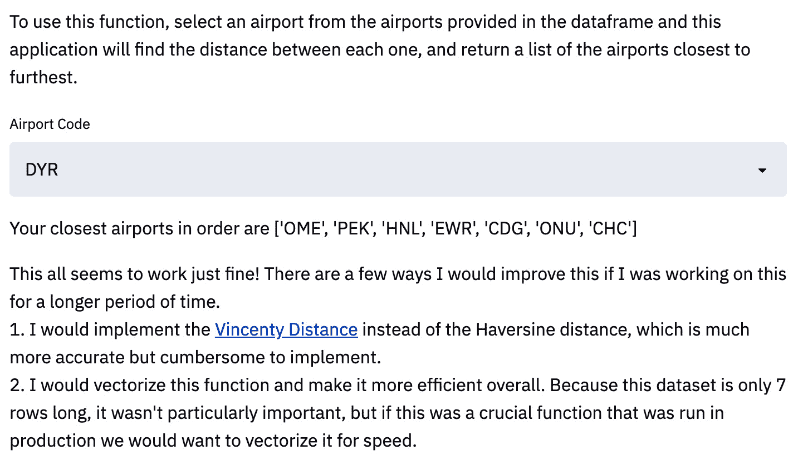

# 第九章：*第九章*：使用 Streamlit 提升工作申请

在本书的这一部分，你应该已经是一个经验丰富的 Streamlit 用户。你对所有内容都有很好的掌握——从 Streamlit 的设计到部署，再到数据可视化，及其间的一切。本章旨在应用为主；它将展示一些 Streamlit 应用的优秀用例，帮助你获得灵感，创造属于你自己的应用！我们将从展示如何使用 Streamlit 进行*技能证明数据项目*开始。然后，我们将讨论如何在工作申请的*Take Home*部分使用 Streamlit。

本章将涵盖以下主题：

+   使用 Streamlit 进行技能证明数据项目

+   在 Streamlit 中提升工作申请

# 技术要求

以下是本章所需的软硬件安装列表：

+   `streamlit-lottie`：要下载这个库，请在终端运行以下代码：

    ```py
    pip install streamlit-lottie
    ```

    有趣的是，`streamlit-lottie`使用了`lottie`开源库，这使我们能够在 Streamlit 应用中添加网页原生动画（如 GIF）。坦率地说，这是一个很棒的库，可以用来美化 Streamlit 应用，由 Streamlit 应用的多产创作者 Andy Fanilo 创建。

+   工作申请示例文件夹：本书的中央仓库可以在[`github.com/tylerjrichards/Getting-Started-with-Streamlit-for-Data-Science`](https://github.com/tylerjrichards/Getting-Started-with-Streamlit-for-Data-Science)找到。在这个仓库中，`job_application_example`文件夹将包含你在本章第二部分（工作申请）中所需的一些文件。如果你还没有下载这个主仓库，请在终端使用以下代码进行克隆：

    ```py
    git clone https://github.com/tylerjrichards/Getting-Started-with-Streamlit-for-Data-Science
    ```

现在我们已经设置好一切，开始吧！

# 使用 Streamlit 进行技能证明数据项目

向他人证明你是一个熟练的数据科学家是出了名的困难。任何人都可以在简历上写上 Python 或机器学习，甚至可以在做机器学习的大学研究小组工作。但往往，招聘人员、你想合作的教授以及数据科学经理们更多依赖于简历上的一些间接标志来评估能力，例如是否就读于“名校”，或已经拥有一份高级的数据科学实习或工作经历。

在 Streamlit 出现之前，这个问题几乎没有什么有效的解决方案。如果你将一个 Python 文件或 Jupyter Notebook 放到你的 GitHub 个人资料上，别人要花费的时间来了解这个作品是否令人印象深刻，风险太大。如果招聘人员必须点击你 GitHub 个人资料中的正确仓库，然后点击多个文件，直到找到那份没有注释、难以阅读的 Jupyter Notebook，你就已经失去了他们的关注。如果招聘人员在你的简历上看到“机器学习”，但需要点击五次才能看到你写的任何机器学习产品或代码，那么你就已经失去了他们的兴趣。大多数感兴趣的人在你的简历上花的时间非常少；根据我的个人网站（www.tylerjrichards.com）的数据，访客平均在该网站上停留约 2 分钟，之后就会离开。

解决这个问题的一种方法是尝试创建和分享专门展示你想要最广泛展示的技能的 Streamlit 应用程序。例如，如果你在基础统计学方面有丰富经验，你可以创建一个 Streamlit 应用程序，证明或说明一个基本的统计定理，如中心极限定理——就像我们在本书中早些时候做的那样。如果你有自然语言处理的经验，你可以创建一个展示你所创建的新的文本生成神经网络的应用程序。关键在于最小化别人需要点击的次数，直到他们看到你在某个领域的能力证明。

我们已经创建的许多 Streamlit 应用程序确实达到了这个目的。让我们来看几个例子。

## 机器学习 – Penguins 应用

在*第四章*，*使用 Streamlit 进行机器学习*中，我们创建了一个随机森林模型，使用我们的 Palmer's Penguin 数据集进行训练，根据特征如体重、栖息岛屿和喙长来预测企鹅的物种。然后，我们保存了该模型，以便在 Streamlit 应用程序中使用。

为了生成我们的 Streamlit 应用程序，我们需要（在第一次迭代中）运行以下代码。这将创建要部署的模型：

```py
import pandas as pd
from sklearn.metrics import accuracy_score
from sklearn.ensemble import RandomForestClassifier
from sklearn.model_selection import train_test_split
import pickle
penguin_df = pd.read_csv('penguins.csv')
penguin_df.dropna(inplace=True)
output = penguin_df['species']
features = penguin_df[['island', 'bill_length_mm', 'bill_depth_mm',
                       'flipper_length_mm', 'body_mass_g', 'sex']]
features = pd.get_dummies(features)
output, uniques = pd.factorize(output)
x_train, x_test, y_train, y_test = train_test_split(
    features, output, test_size=.8)
rfc = RandomForestClassifier(random_state=15)
rfc.fit(x_train, y_train)
y_pred = rfc.predict(x_test)
score = accuracy_score(y_pred, y_test)
print('Our accuracy score for this model is {}'.format(score))
```

在这一部分中，我们导入库，加载数据，并训练/评估我们的模型，同时打印出评估结果。然后，我们使用以下代码将模型结果保存到`pickle`文件中：

```py
rf_pickle = open('random_forest_penguin.pickle', 'wb')
pickle.dump(rfc, rf_pickle)
rf_pickle.close()
output_pickle = open('output_penguin.pickle', 'wb')
pickle.dump(uniques, output_pickle)
output_pickle.close()
```

回想一下，在本章的结尾，我们添加了一个新功能，使得如果用户上传自己的数据集，他们可以使用我们的模型训练脚本，完全基于他们的数据训练一个模型（前提是数据格式相同，且有一些前提条件）。

这个应用的最终版本显示了我们至少具备了数据清理的知识，如何对变量进行独热编码，如何评估模型在测试数据上的表现，最后，如何将预训练的模型部署到应用中。仅这一点就比在简历上单纯写“机器学习”要好得多，而且它展示了我们一些技能的实际证据。没有这种技能证明，招聘人员或招聘经理在查看我们的申请时，只能要么完全相信我们简历上的信息（但根据多年的简历筛选经验，这是一个很糟糕的假设），要么通过某些替代标准来评估我们的能力，比如大学学位（但这同样是一个评估能力的糟糕标准）。

除此之外，当我们在*第五章*《使用 Streamlit Sharing 部署 Streamlit》一节中将应用部署到 Streamlit Sharing 时，我们讨论了 Streamlit Sharing 中免费的一个自动化功能：**查看应用源代码**按钮。如以下截图所示，当我们部署应用时，Streamlit 会在用户的**设置**下拉菜单中添加一个按钮，允许他们查看应用背后的源代码：


图 9.1 – 查看应用源代码选项

通过这种方式，用户可以随时检查，确保恶意代码（例如，研究人员的企鹅数据是否被应用存储）不会被 Streamlit Sharing 部署。作为附加功能，用户还可以查看你编写的构建应用的代码，这增强了我们将 Streamlit 作为*技能证明*工具的能力。

## 可视化 – 漂亮的树木应用

在*第六章*《美化 Streamlit 应用》中，我们开发了一个 Streamlit 应用，它可以创建美观且动态的旧金山树木可视化，最终形成了以下这个应用：


图 9.2 – 映射一个 Web 应用

在这个应用中，我们需要创建多个不同的可视化（即两个直方图和一个地图），这些可视化会根据右侧用户输入动态更新。通过这样的应用，我们能够展示我们在数据处理方面的技能、对 pandas、Matplotlib 和 Seaborn 库的熟悉程度，甚至展示我们理解如何在 Python 中处理日期时间。我们来看看这个应用中专注于可视化的代码部分：

```py
#define multiple columns, add two graphs
col1, col2 = st.beta_columns(2)
with col1:
     st.write('Trees by Width')
     fig_1, ax_1 = plt.subplots()
     ax_1 = sns.histplot(trees_df['dbh'], 
          color=graph_color)
     plt.xlabel('Tree Width')
     st.pyplot(fig_1)
with col2:
     st.write('Trees by Age')
     fig_2, ax_2 = plt.subplots()
     ax_2 = sns.histplot(trees_df['age'],
          color=graph_color)
     plt.xlabel('Age (Days)')
     st.pyplot(fig_2)
st.write('Trees by Location')
trees_df = trees_df.dropna(subset=['longitude', 'latitude'])
trees_df = trees_df.sample(n = 1000, replace=True)
st.map(trees_df)
```

这段代码对于任何熟悉 Python 或其他脚本语言的人来说都相当容易理解，而且它比简历上仅仅写“数据可视化”或“pandas”要好得多。

到这个时候，我希望你已经信服了。Streamlit 应用程序是展示你的工作给招聘人员、潜在的招聘经理或任何需要你证明技能的人群的绝佳方式。在下一节中，我们将更加详细地讲解这个过程，并演示如何利用 Streamlit 来增强你向你可能想要应聘的公司提交的申请。

# 改善 Streamlit 中的求职申请

通常，数据科学和机器学习职位的求职申请依赖于带回家的数据科学挑战来评估候选人。坦率地说，这是一个残酷且令人烦恼的经历，因为申请人与雇主之间的动态关系。举例来说，候选人可能需要 5-10 小时才能完成一个数据科学挑战，但雇主可能只需要 10 分钟来评估它。此外，一个虚拟或电话面试对于雇主来说可能需要 30-45 分钟，加上额外的 15 分钟写反馈，相比之下，申请人也要花费同样的 30-45 分钟。因为雇主通过获得 5-10 小时的工作可以在每分钟员工时间上获得非常高的信号，所以雇主趋向于在招聘申请中包含这些挑战。

在这里你可以利用这个机会，通过创建一个完整运行的应用程序来从人群中脱颖而出，而不是仅仅发送 Jupyter Notebook、Word 文档或 PowerPoint 演示文稿给公司。

## 问题

让我们通过一个虚构的例子来讲解一下，一个求职者正在申请一家美国大型航空公司的职位。他们被给出两个主要的问题需要解决——其中一个包含了数据集：

+   **问题 1**：**机场距离**

    第一个练习要求：“给定包含机场和地点（以经纬度表示）的数据集，编写一个函数，接受一个机场代码作为输入，并返回按距离从近到远排列的机场列表。”

+   **问题 2**：**表示方法**

    第二个问题问到：“你如何将一系列搜索转化为一个表示旅行的数字向量？假设我们有成千上万的用户，并且希望以这种方式表示他们的所有旅行。理想情况下，我们希望这是一个通用的表示，可以在多个不同的建模项目中使用，但我们更关心的是找到相似的旅行。那么，具体来说，你如何比较两次旅行，以了解它们的相似程度？你认为前述数据中缺少了哪些信息，能够帮助改善你的表示方法？”

    注意

    不用担心在这一部分编写代码；你可以简单描述你将执行的任何数据转换。你的描述应该足够清晰，以便让阅读它的数据科学家知道如果有必要，如何实现你的解决方案。

现在我们已经有了所需的问题，我们可以开始新的 Streamlit 应用程序。为此，我采用了迄今为止在每一章中使用的相同过程。我们在我们的中央文件夹（`streamlit_apps`）中创建一个新的文件夹，命名为`job_application_example`。在这个文件夹内，我们可以通过终端使用以下命令创建一个 Python 文件，命名为 `job_streamlit.py`：

```py
touch job_streamlit.py
```

## 回答问题 1

对于你来说，理解如何回答当前问题并不至关重要，但整体框架是非常重要的。我们创建的 Streamlit 应用程序应该像一个极具动态感的文档，根据 Streamlit 的能力回答问题，并以一种独特的方式呈现，这种方式是用 Word 文档无法轻易复制的。

首先，我们可以创建一个标题，介绍我们自己，并为整个应用程序的格式开个头。这里的一个改进是，使用我们在*第七章*《探索 Streamlit 组件》中学到的 `streamlit-lottie` 库，在应用程序顶部添加一个可选的动画，代码如下：

```py
import streamlit as st
from streamlit_lottie import st_lottie
import pandas as pd
import requests
def load_lottieurl(url: str):
    r = requests.get(url)
    if r.status_code != 200:
        return None
    return r.json()
lottie_airplane = load_lottieurl('https://assets4.lottiefiles.com/packages/lf20_jhu1lqdz.json')
st_lottie(lottie_airplane, speed=1, height=200, key="initial")
st.title('Major US Airline Job Application')
st.write('by Tyler Richards')
st.subheader('Question 1: Airport Distance')
```

上述代码将创建一个带有美丽飞机动画的应用程序，如下图所示：


图 9.3 – 一只飞机的 GIF 动画

接下来，我们需要将问题复制并粘贴到子标题下。Streamlit 提供了多种在应用程序中插入文本的方式。我们尚未使用的一种方式是将文本放入三个撇号内，这会告诉 Streamlit 使用 Markdown 语言来显示该文本。这对于大块文本非常有用，例如下面这段文字，它开始回答第一个问题：

```py
'''
The first exercise asks us 'Given the table of airports and 
locations (in latitude and longitude) below, 
write a function that takes an airport code as input and 
returns the airports listed from nearest to furthest from 
the input airport.' There are three steps here:
1\. Load Data
2\. Implement Distance Algorithm
3\. Apply distance formula across all airports other than the input
4\. Return sorted list of airports Distance
'''
```

如本章的*技术要求*部分所述，完成此应用程序需要两个文件。第一个是机场位置数据集（称为 `airport_location.csv`），第二个是显示哈弗辛距离的图片（即球面上两点之间的距离；文件名为 `haversine.png`）。请将这些文件复制到与 Streamlit 应用程序 Python 文件相同的文件夹中。

现在，我们需要完成第一步：加载数据。我们需要在 Streamlit 中完成这一步，并且还需要将代码展示给用户。这与其他 Streamlit 应用程序不同，其他应用程序中的代码通常隐藏在后台。然而，由于用户肯定希望看到我们的代码，因为他们会基于这些代码进行评估，我们需要同时做这两件事。我们可以使用之前用过的 `st.echo()` 函数，将代码块打印到应用程序中。我们可以使用以下代码来实现：

```py
airport_distance_df = pd.read_csv('airport_location.csv')
with st.echo():
     #load necessary data
     airport_distance_df = pd.read_csv('airport_location.csv')
```

我想在这里指出，我们在此代码顶部添加了一条注释。这不是为了给您作为读者注释代码，而是为了应用程序的读者。偶尔在您编写的代码内部和前后的文本块中对编写代码的目的进行评论是个好习惯；这样读者就能理解您试图采取的方法。这在求职申请中尤为重要，但对于协作的 Streamlit 应用程序也是一个良好的实践。

我们的下一步是解释 Haversine 公式，并在我们的 Streamlit 应用程序中展示图像，我们已在以下代码块中完成。在您的文本块中采用叙述格式是完全可以的。只需想象您希望招聘经理阅读的内容，并尽可能复制：

```py
'''
From some quick googling, I found that the haversine distance is 
a good approximation for distance. At least good enough to get the 
distance between airports! Haversine distances can be off by up to .5%, 
because the earth is not actually a sphere. It looks like the latitudes 
and longitudes are in degrees, so I'll make sure to have a way to account 
for that as well. The haversine distance formula is labeled below, 
followed by an implementation in python
'''
st.image('haversine.png')
```

现在，我们的应用程序应该看起来与以下屏幕截图类似：


图 9.4 – 加载问题 1 的数据

我们有要解决的问题清单、动画、Haversine 距离公式以及读取数据的基本代码。此时，我们需要在 Python 中实现 Haversine 距离公式并展示我们的实现：

```py
with st.echo():
     from math import radians, sin, cos, atan2, sqrt
     def haversine_distance(long1, lat1, long2, lat2, degrees=False):
         #degrees vs radians
         if degrees == True:
             long1 = radians(long1)
             lat1 = radians(lat1)
             long2 = radians(long2)
             lat2 = radians(lat2)

         #implementing haversine
         a = sin((lat2-lat1) / 2)**2 + cos(lat1) * cos(lat2) * sin((long2-long1) / 2)**2
         c = 2*atan2(sqrt(a), sqrt(1-a))
         distance = 6371 * c #radius of earth in kilometers
         return(distance)
```

我们代码的第一部分并不创建我们的函数，而是将我们将要在 Streamlit 应用程序中创建的函数打印出来。这样，应用程序的读者可以查看我们编写的两个重要代码片段并与代码本身进行交互。如果我们只是创建了一个函数来实现 Haversine 距离，那么我们应用程序的读者实际上不会真正了解我们是如何解决手头问题的！以下代码块创建了这个函数：

```py
#execute haversine function definition
from math import radians, sin, cos, atan2, sqrt
def haversine_distance(long1, lat1, long2, lat2, degrees=False):
    #degrees vs radians
    if degrees == True:
        long1 = radians(long1)
        lat1 = radians(lat1)
        long2 = radians(long2)
        lat2 = radians(lat2)

    #implementing haversine
    a = sin((lat2-lat1) / 2)**2 + cos(lat1) * cos(lat2) * sin((long2-long1) / 2)**2
    c = 2*atan2(sqrt(a), sqrt(1-a))
    distance = 6371 * c #radius of earth in kilometers
    return(distance)
```

我们完成了 Haversine 的实现！每当我们想要找到两个位置之间的距离时，我们可以调用我们的公式，输入经度和纬度，然后获得以公里为单位的距离。这个应用程序很有用；然而，目前它不比一个 Word 文档好多少。我们的下一步是允许用户输入他们自己的点来检查和查看 Haversine 距离是否有效。几乎没有人知道地球上两点之间相隔多少公里，因此我已包含了默认点并检查了它们之间的实际距离：

```py
'''
Now, we need to test out our function! The 
distance between the default points is 
18,986 kilometers, but feel free to try out
your own points of interest. 
'''
long1 = st.number_input('Longitude 1', value = 2.55)
long2 = st.number_input('Longitude 2', value = 172.00)
lat1 = st.number_input('Latitude 1', value = 49.01)
lat2 = st.number_input('Latitude 2', value = -43.48)
test_distance = haversine_distance(long1 = long1, long2 = long2,
          lat1 = lat1, lat2 = lat2, degrees=True)
st.write('Your distance is: {} kilometers'.format(int(test_distance)))
```

当我们输入默认值时，应用程序返回的距离大约偏差了 2 公里，如下屏幕截图所示：


图 9.5 – 实现 Haversine 距离

此时，我们的下一步是通过在给定数据集上使用实现的 Haversine 距离计算器来组合所有部分。这在以下屏幕截图中简要显示：


图 9.6 – 已给出的机场距离

这个数据集包含机场代码及其对应的`lat`和`long`值。以下代码块展示了一种将两种距离结合起来的解决方案，并省略了完整的`get_distance_list`函数，因为它只是我们已经实现过两次的函数的复制：

```py
'''
We have the Haversine distance implemented, and we also have
proven to ourselves that it works reasonably well.
Our next step is to implement this in a function!
'''
def get_distance_list(airport_dataframe, airport_code):
    df = airport_dataframe.copy() 
    row = df[df.loc[:,'Airport Code'] == airport_code] 
    lat = row['Lat'] 
    long = row['Long'] 
    df = df[df['Airport Code'] != airport_code] 
    df['Distance'] = df.apply(lambda x: haversine_distance(lat1=lat, long1=long, 
         lat2 = x.Lat, long2 = x.Long, degrees=True), axis=1)
    return(df.sort_values(by='Distance').reset_index()['Airport Code']) 
with st.echo():
     def get_distance_list(airport_dataframe, airport_code):
          *copy of function above with comments*
```

最后，我们可以在给定的数据框上实现此距离公式。我们可以让用户从我们拥有数据的选项中输入自己的机场代码，并返回正确的值：

```py
'''
To use this function, select an airport from the airports provided in the dataframe
and this application will find the distance between each one, and 
return a list of the airports closest to furthest.
'''
selected_airport = st.selectbox('Airport Code', airport_distance_df['Airport Code'])
distance_airports = get_distance_list(
     airport_dataframe=airport_distance_df, airport_code=selected_airport)
st.write('Your closest airports in order are {}'.format(list(distance_airports)))
```

这是我们第一个问题的结束部分。我们可以在最后添加一个可选部分，讲述如果我们有更多时间来处理这个问题，我们会如何修改我们的实现。如果你知道自己只想在整个应用程序上花费几个小时，但又希望展示你知道如何在有更多时间的情况下改进它，这总是一个好主意。以下代码块展示了一个例子，应直接放在前面的代码块后面：

```py
'''
This all seems to work just fine! There are a few ways I would improve this if I was working on 
this for a longer period of time.  
1\. I would implement the [Vincenty Distance](https://en.wikipedia.org/wiki/Vincenty%27s_formulae) 
instead of the Haversine distance, which is much more accurate but cumbersome to implement.  
2\. I would vectorize this function and make it more efficient overall. 
Because this dataset is only 7 rows long, it wasn't particularly important, 
but if this was a crucial function that was run in production we would want to vectorize it for speed. 
'''
```

另外，你也可以直接以一段关于前述代码的说明来结束，并继续处理第二个问题。此时，我们对*问题 1*的回答已完成，并应类似于以下截图：



图 9.7 – 获取用户输入

我们现在已经成功回答了*问题 1*！我们可以手动检查这些机场之间的距离以获得相同的结果。但让我们继续处理应用中的第二个问题。

## 回答问题 2

第二个问题更为直接，仅要求提供文本答案。在这里，技巧是尽量添加一些列表或 Python 对象，以打破大量的文本段落。首先，我们将解释我们回答问题的尝试，然后展示它在数据框中的展示效果：

```py
'''
For this transformation, there are a few things 
that I would start with. First, I would have to define 
what a unique trip actually was. In order to do this, I would 
group by the origin, the destination, and the departure date 
(for the departure date, often customers will change around 
this departure date, so we should group by the date plus or 
minus at least 1 buffer day to capture all the correct dates).   
Additionally, we can see that often users search from an entire city, 
and then shrink that down into a specific airport. So we should also 
consider a group of individual queries from cities and airpots in the 
same city, as the same search, and do the same for destination.    
From that point, we should add these important columns to each unique search.
'''
```

现在，我们可以思考一些在用户搜索美国主要航空公司航班时可能有用的列。我们可以将它们放入一个示例数据框，如下所示：

```py
example_df = pd.DataFrame(columns=['userid', 'number_of_queries', 'round_trip', 'distance', 'number_unique_destinations',
                     'number_unique_origins', 'datetime_first_searched','average_length_of_stay',
                     'length_of_search'])
example_row = {'userid':98593, 'number_of_queries':5, 'round_trip':1,
                   'distance':893, 'number_unique_destinations':5,
                     'number_unique_origins':1, 'datetime_first_searched':'2015-01-09',
                   'average_length_of_stay':5, 'length_of_search':4}
st.write(example_df.append(example_row, ignore_index=True))
```

对于问题的其余部分，我们可以添加一些关于如何使用不同方法找到两个点之间距离的知识，然后就可以结束了：

```py
'''
For answering the second part of the question, we should take the euclidian distance 
on two normalized vectors. There are two solid options for comparing two 
entirely numeric rows, the euclidian distance (which is just the straight line 
difference between two values), and the manhattan distance (think of this as the 
distance traveled if you had to use city blocks to travel diagonally across manhattan). 
Because we have normalized data, and the data is not high dimensional or sparse, I 
would recommend using the euclidian distance to start off. This distance would tell 
us how similar two trips were.
'''
```

第二个问题的答案应类似于以下截图：


图 9.8 – 回答问题 2

如你所见，这个例子展示了如何利用 Streamlit 库帮助解决家庭作业中的数据任务，并制作更具吸引力的应用。此项工作的最后一步是部署这个 Streamlit 应用，并将链接分享给招聘人员。我强烈建议你将其部署到 Heroku 上，以确保其他人无法查看招聘公司提供的问题或数据。你也可以采取进一步的预防措施，例如在应用程序开头放置一个文本框，作为应用的“临时”密码保护，如下方代码块所示：

```py
password_attempt = st.text_input('Please Enter The Password')
if password_attempt != 'example_password':
     st.write('Incorrect Password!')
     st.stop()
```

现在，除非用户在文本框中输入 `example_password`，否则整个应用程序将无法运行。这显然并不安全，但对于相对不重要的（至少在保密性方面）应用程序，如带回家的应用程序，它是有用的：


图 9.9 – 输入密码

如你所见，只有输入正确的密码，应用程序才能加载。否则，用户将看到一个空白页面。或者，你也可以在 Streamlit Sharing 中使用 Streamlit secrets 设置密码，这是目前 Streamlit for Teams 的一个功能，将在*第十一章*中讲解，*使用 Streamlit for Teams*。

# 总结

本章是我们迄今为止创建的最注重应用的章节。我们重点讨论了数据科学和机器学习面试的职位申请及申请流程。此外，我们还学习了如何为我们的应用程序设置密码保护，如何创建能够向招聘人员和数据科学招聘经理证明我们是熟练数据科学家的应用程序，以及如何通过创建 Streamlit 应用程序在远程数据科学面试中脱颖而出。下一章将重点介绍 Streamlit 作为一个玩具，你将学习如何为社区创建面向公众的 Streamlit 项目。
