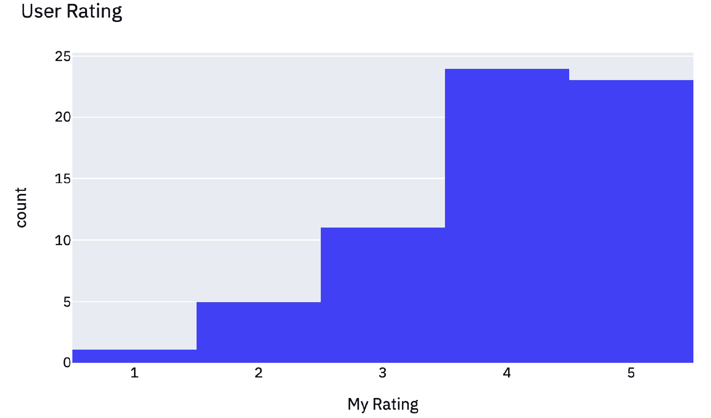

# 第十章：*第十章*：数据项目——在 Streamlit 中进行项目原型设计

在上一章中，我们讨论了如何创建针对职位申请的 Streamlit 应用。Streamlit 的另一个有趣应用是尝试新的、令人兴奋的数据科学创意，并为他人创建互动式应用。例如，将一个新的机器学习模型应用于现有数据集，进行用户上传的数据分析，或创建基于私人数据集的互动分析。做这个项目的理由有很多，比如个人教育或社区贡献。

在个人教育方面，通常，学习一个新主题的最佳方式是通过将其应用到你周围的世界或你熟悉的数据集中，观察它如何真正运作。例如，如果你想了解 *主成分分析* 是如何工作的，你可以在教科书中学习它，或看别人将它应用到数据集中。然而，我发现，当我自己亲自实践时，对一个主题的理解会飞跃性提高。Streamlit 正是为了这种情况而设计的。它让你可以在一个互动、轻松的环境中尝试新创意，而且这些创意可以轻松与他人共享。学习数据科学可以是一个合作的过程，这也是我选择在 Streamlit 中创建数据项目的另一个原因。

就社区贡献而言，Streamlit 的一个亮点——老实说，数据科学的亮点——就是围绕我们日常使用的工具和玩具所形成的日益壮大的社区。通过与他人一起学习，并在 Twitter 上分享 Streamlit 应用（[`twitter.com/tylerjrichards`](https://twitter.com/tylerjrichards)）、LinkedIn 和 Streamlit 论坛（[`discuss.streamlit.io/`](https://discuss.streamlit.io/)）上分享应用，我们可以摆脱大多数学校和大学中所教的零和博弈经验（即如果你的同学得了高分，通常会相对地影响你），转而朝向一个正和博弈的体验，在这种体验中，你能直接从他人学到的经验中受益。举个例子，如果你创建了一个帮助你理解主成分分析背后统计学的应用，分享给他人也许会让他们学到一些东西。

在本章中，我们将从头到尾完整地进行一个数据项目，从一个创意开始，到最终产品结束。具体来说，我们将涵盖以下主题：

+   数据科学创意

+   数据收集与清洗

+   制作 **最小可行产品**（**MVP**）

+   迭代改进

+   托管与推广

# 技术要求

在本节中，我们将使用网站*Goodreads.com*，这是一个由亚马逊拥有的流行网站，用于跟踪用户的阅读习惯，从开始和完成书籍的时间到他们想要阅读的下一本书。建议你首先访问[`www.goodreads.com/`](https://www.goodreads.com/)，注册一个账户，并稍微浏览一下（也许你还可以添加自己的书单！）。

# 数据科学创意

通常，构思一个新的数据科学项目是最具挑战性的部分。你可能会有许多疑虑。如果我开始一个没人喜欢的项目怎么办？如果我的数据实际效果不好怎么办？如果我想不出任何点子怎么办？好消息是，如果你创建的是你真正关心并且会使用的项目，那么最坏的情况就是你只有一个观众！如果你把项目发给我（*tylerjrichards@gmail.com*），我保证会读的。至少那样的话，你的观众就有两个了。

我自己创造或观察到的一些例子包括以下内容：

+   录制一个学期的乒乓球比赛以使用 Elo 模型确定最佳玩家（[`www.tylerjrichards.com/Ping_pong.html`](http://www.tylerjrichards.com/Ping_pong.html)）

+   使用自然语言处理来判断旅馆中 Wi-Fi 的质量（[`www.racketracer.com/2015/11/18/practical-natural-language-processing-for-determing-wifi-quality-in-hostels/`](https://www.racketracer.com/2015/11/18/practical-natural-language-processing-for-determing-wifi-quality-in-hostels/)）

+   分析成千上万条披萨评论，找出你附近的最佳纽约披萨（[`towardsdatascience.com/adventures-in-barstools-pizza-data-9b8ae6bb6cd1`](https://towardsdatascience.com/adventures-in-barstools-pizza-data-9b8ae6bb6cd1)）

+   使用 Goodreads 数据分析你的阅读习惯（[`www.tylerjrichards.com/books_reco.html`](http://www.tylerjrichards.com/books_reco.html)）

这些数据项目中只有一个使用了 Streamlit，其余的在库发布之前就已经完成。然而，如果将这些项目部署到 Streamlit 上，而不是仅仅上传到 Jupyter Notebook（*项目 #1*）或 Word 文档/HTML 文件（*项目 #2 和 #3*），它们都可以得到改进。

你可以使用多种不同的方法来构思自己的数据项目创意，但最常见的方法通常分为三类：

+   查找只有你能收集到的数据（例如，你朋友的乒乓球比赛）

+   查找你关心的数据（例如，Goodreads 的阅读数据）

+   想出一个你希望存在的分析/应用程序来解决你的问题并实施它（例如，旅馆 Wi-Fi 分析或找到你附近的最佳披萨店）。

你可以尝试其中之一，或者从你已有的其他想法开始。最好的方法是最适合你的方法！在本章中，我们将深入走一遍并重建 Goodreads 的 Streamlit 应用，作为数据项目的示例。你可以通过以下链接再次访问：[`www.tylerjrichards.com/books_reco.html`](http://www.tylerjrichards.com/books_reco.html)。

这个应用旨在抓取用户的 Goodreads 历史，并生成一组图表，帮助用户了解自从使用 Goodreads 以来的阅读习惯。图表的样式应该类似于以下截图：


图 10.1 – Goodreads 图表示例

我通过对我的书籍历史进行个人分析得出了这个想法，然后我想，也许其他人也会对这个分析感兴趣！其实没有比这个更好的理由了，很多最有趣的项目往往都是这么开始的。首先，我们将着手收集和清洗 Goodreads 上现有的用户数据。

# 收集和清洗数据

有两种方式可以从 Goodreads 获取数据：通过**应用程序编程接口**（**API**），允许开发者以编程方式访问书籍数据；以及通过其手动导出功能。遗憾的是，Goodreads 将在不久的将来停用 API，并且从 2020 年 12 月开始不再向更多开发者提供访问权限。

原始的 Goodreads 应用使用 API，但我们的版本将依赖于 Goodreads 网站提供的手动导出功能。要获取你的数据，请访问[`www.goodreads.com/review/import`](https://www.goodreads.com/review/import)并下载你的数据。如果你没有 Goodreads 账号，可以使用我的个人数据，数据可以在[`github.com/tylerjrichards/goodreads_book_demo`](https://github.com/tylerjrichards/goodreads_book_demo)找到。我已经将我的 Goodreads 数据保存在一个名为`goodreads_history.csv`的文件中，文件位于一个名为`streamlit_goodreads_book`的新文件夹里。要创建你自己的文件夹并设置适当的环境，请在终端中运行以下命令：

```py
mkdir streamlit_goodreads_book
cd streamlit_goodreads_book
touch goodreads_app.py
```

现在我们准备开始了。我们其实并不知道这些数据是什么样的，也不知道数据集里有什么，所以我们的第一步是做以下几件事：

+   在应用顶部放置标题和说明。

+   允许用户上传自己的数据，如果没有数据，默认使用我们的数据。

+   将前几行数据写入应用中，以便我们查看。

以下代码块完成了所有这些操作。你可以随意更改文本，使你的应用显示你的名字，并添加链接到个人资料，供他人查看！目前，大约 10%的访问量来自我制作的 Streamlit 应用：

```py
import streamlit as st
import pandas as pd
st.title('Analyzing Your Goodreads Reading Habits')
st.subheader('A Web App by [Tyler Richards](http://www.tylerjrichards.com)')
'''
Hey there! Welcome to Tyler's Goodreads Analysis App. This app analyzes (and never stores!) 
the books you've read using the popular service Goodreads, including looking at the distribution 
of the age and length of books you've read. Give it a go by uploading your data below!
'''
goodreads_file = st.file_uploader('Please Import Your Goodreads Data')
if goodreads_file is None:
     books_df = pd.read_csv('goodreads_history.csv')
     st.write("Analyzing Tyler's Goodreads history")
else:
     books_df = pd.read_csv(goodreads_file)
     st.write('Analyzing your Goodreads history')
st.write(books_df.head())
```

现在，当我们运行这个 Streamlit 应用时，应该能看到一个类似于以下截图的界面：


图 10.2 – 前五行

如你所见，我们得到一个数据集，其中每本书都是唯一的一行。此外，我们还获得了关于每本书的大量数据，包括书名和作者、书籍的平均评分、你对书籍的评分、书籍的页数，甚至是你是否已经读过、计划阅读或正在阅读该书。数据看起来大部分是干净的，但也有些奇怪的地方；例如，数据中既有出版年份又有原始出版年份，ISBN（国际标准书号）以 *="1400067820"* 的格式出现，这非常奇怪。现在我们对手头的数据有了更多了解，可以切换到尝试为用户构建一些有趣的图表。

# 创建一个 MVP

通过查看我们的数据，我们可以从一个基本问题开始：我可以用这些数据回答哪些最有趣的问题？在查看数据并思考我希望从 Goodreads 阅读历史中获得什么信息后，我想到了以下几个问题：

+   我每年读多少本书？

+   我需要多久才能完成一本已开始的书？

+   我读过的书籍有多长？

+   我读过的书籍有多旧？

+   我如何将书籍的评分与其他 Goodreads 用户进行比较？

我们可以根据这些问题，弄清楚如何修改数据以便很好地可视化它们，然后通过打印出所有图表来完成我们的第一个版本。

## 我每年读多少本书？

对于第一个关于每年读书数量的问题，我们有 `Date Read` 列，数据呈现为 *yyyy/mm/dd* 格式。以下代码块将执行以下操作：

+   将我们的列转换为日期时间格式。

+   从 `Date Read` 列中提取年份。

+   根据此列对书籍进行分组，并计算每年读书的数量。

+   使用 Plotly 绘制图表。

以下代码块执行此操作，从日期时间转换开始。这里需要特别注意的是，和所有事情一样，我第一次尝试时并没有做到完全正确。事实上，我花了一些时间才弄清楚如何管理和转换这些数据。当你自己创建项目时，不要觉得清理和转换数据花费了很长时间就不好！通常来说，这一步是最困难的：

```py
     goodreads_file = st.file_uploader('Please Import Your Goodreads Data')
if goodreads_file is None:
     books_df = pd.read_csv('goodreads_history.csv')
     st.write("Analyzing Tyler's Goodreads history")
else:
     books_df = pd.read_csv(goodreads_file)
     st.write('Analyzing your Goodreads history')
books_df['Year Finished'] = pd.to_datetime(books_df['Date Read']).dt.year 
books_per_year = books_df.groupby('Year Finished')['Book Id'].count().reset_index()
books_per_year.columns = ['Year Finished', 'Count']
fig_year_finished = px.bar(books_per_year, x='Year Finished', y='Count', title='Books Finished per Year')
st.plotly_chart(fig_year_finished)
```

上述代码块将生成以下图表：


图 10.3 – 完成年份条形图

这里我们实际上做了一个假设，即我们假设 `Date Read` 列中的年份表示我们阅读该书的时间。但如果我们在 12 月中旬开始读一本书，并在 1 月 2 日完成呢？或者，如果我们在 2019 年开始一本书，但只读了几页，然后在 2021 年才继续读呢？我们知道这并不是每年读书数量的完美近似，但将其表达为每年完成的书籍数量会更好。

## 我开始读一本书后，需要多长时间才能读完？

我们下一个问题是关于完成一本书所需的时间，一旦我们开始阅读它。为了回答这个问题，我们需要计算两列之间的差异：`Date Read`列和`Date Added`列。同样，这将是一个近似值，因为我们没有用户开始阅读书籍的日期，只有他们将书籍添加到 Goodreads 的日期。基于此，接下来的步骤包括以下内容：

+   将这两列转换为 datetime 格式。

+   计算两列之间的天数差异。

+   将这个差异绘制为直方图。

以下代码块从转换开始，和之前一样，然后执行我们的任务列表：

```py
books_df['days_to_finish'] = (pd.to_datetime(
            books_df['Date Read']) - pd.to_datetime(books_df['Date Added'])).dt.days
fig_days_finished = px.histogram(books_df, x='days_to_finish')
st.plotly_chart(fig_days_finished)
```

之前的代码块可以添加到当前 Streamlit 应用的底部，运行时应该会显示一个新的图表：


图 10.4 – 完成所需天数图

这对于我的数据来说不是最有用的图表。看起来，在某个时刻，我将曾经读过的书籍添加到了 Goodreads，这些书籍出现在了这个图表中。我们还有一组未完成的书籍，或者是在待阅读书架上的书籍，它们在这个数据集中是空值。我们可以做一些事情，比如过滤数据集，只保留天数为正的书籍，并且只保留已完成的书籍，以下代码块实现了这一点：

```py
books_df['days_to_finish'] = (pd.to_datetime(
            books_df['Date Read']) - pd.to_datetime(books_df['Date Added'])).dt.days
books_finished_filtered = books_df[(books_df['Exclusive Shelf'] == 'read') & (books_df['days_to_finish'] >= 0)]
fig_days_finished = px.histogram(books_finished_filtered, 
 x='days_to_finish', title='Time Between Date Added And Date Finished',
     labels={'days_to_finish':'days'})
st.plotly_chart(fig_days_finished)
```

我们代码中的这个改动使得图表有了显著改进。它做了一些假设，但也提供了更准确的分析。完成后的图表可以在以下截图中查看：


图 10.5 – 改进后的完成所需天数图

这看起来好多了！现在，让我们继续下一个问题。

## 我读过的书籍有多长？

这个问题的数据已经处于相当好的状态。我们有一列名为`Number of Pages`，顾名思义，它包含了每本书的页数。我们只需要将这一列传递给另一个直方图，之后我们就可以开始了：

```py
fig_num_pages = px.histogram(books_df, x='Number of Pages', title='Book Length Histogram')
st.plotly_chart(fig_num_pages)
```

这段代码将生成类似于以下截图的内容，显示书籍页数的直方图：


图 10.6 – 页数直方图

这对我来说有意义；大多数书籍的页数在 300 到 400 页之间，也有一些超大书籍，页数超过 1000 页。接下来，让我们继续看这些书籍的年龄！

## 我读过的书籍有多旧？

我们下一个图表应该是直观的。我们如何找出我们读过的书籍的年龄？我们倾向于选择最新出版的书籍，还是更喜欢阅读经典作品？我们可以从两个列中获取这个信息：出版年份和原出版年份。这个数据集的文档非常少，但我认为我们可以安全地假设原出版年份是我们要找的内容，而出版年份则是出版社重新出版书籍时使用的年份。以下代码块通过打印出所有原出版年份晚于出版年份的书籍来验证这一假设：

```py
st.write('Assumption check')
st.write(len(books_df[books_df['Original Publication Year'] > books_df['Year Published']]))
```

当我们运行这个时，应用应该返回没有原出版年份晚于出版年份的书籍。现在我们已经验证了这一假设，接下来我们可以做以下操作：

1.  按原出版年份对书籍进行分组。

1.  在条形图上绘制此图。

以下代码块分为两个步骤：

```py
books_publication_year = books_df.groupby('Original Publication Year')['Book Id'].count().reset_index()
books_publication_year.columns = ['Year Published', 'Count']
fig_year_published = px.bar(books_publication_year, x='Year Published', y='Count', title='Book Age Plot')
st.plotly_chart(fig_year_published)
```

当我们运行这个应用时，应该会得到以下图表：


图 10.7 – 书籍年龄图

乍一看，这个图表似乎并不是特别有用，因为有很多书籍的写作年代非常久远（例如，柏拉图的著作约公元前 375 年），整个图表很难阅读。然而，Plotly 默认是交互式的，它允许我们缩放到我们更关心的历史时期。例如，以下截图展示了当我们将范围缩放到 1850 年至今时发生的情况，这段时间内大多数我读过的书籍恰好都在此范围内：


图 10.8 – 缩放出版年份

这是一个更好的图表！接下来有几种选择。我们可以从一个不太有用的图表开始，并告诉用户放大，或者我们可以筛选数据集只显示较新的书籍（这会违背图表的主要目的），或者我们可以为图表设置默认的缩放状态，并在底部提醒用户可以根据需要进行缩放。我认为第三种选择是最好的。以下代码实现了这个选项：

```py
Books_publication_year = books_df.groupby('Original Publication Year')['Book Id'].count().reset_index()
books_publication_year.columns = ['Year Published', 'Count']
st.write(books_df.sort_values(by='Original Publication Year').head())
fig_year_published = px.bar(books_publication_year, x='Year Published', y='Count', title='Book Age Plot')
fig_year_published.update_xaxes(range=[1850, 2021])
st.plotly_chart(fig_year_published)
st.write('This chart is zoomed into the period of 1850-2021, but is interactive so try zooming in/out on interesting periods!')
```

当我们运行这段代码时，应该会得到最终的图表：


图 10.9 – 带有提示文本的默认缩放

再答四个问题，剩下一个！

## 我如何与其他 Goodreads 用户比较我对书籍的评分？

对于这个最后的问题，我们实际上需要两个独立的图表。首先，我们需要绘制我们如何对书籍进行评分。其次，我们需要绘制其他用户对我们也评分过的书籍的评分情况。这并不是一个完美的分析，因为 Goodreads 只显示书籍的平均评分——我们并没有查看评分分布。例如，如果我们读过《雪球》这本沃伦·巴菲特的传记，并且给了它 3 星评分，而 Goodreads 上一半的读者评分为 1 星，另一半评分为 5 星，我们的评分就会和平均评分完全一样，但和任何个别读者的评分都不相同！不过，我们只能尽力利用我们拥有的数据。因此，我们可以做以下事情：

+   根据我们已评分（即已阅读）的书籍来筛选图书。

+   为我们的第一个图表创建每本书的平均评分直方图。

+   创建一个关于你自己评分的直方图。

以下代码块正是实现了这一功能：

```py
books_rated = books_df[books_df['My Rating'] != 0]
fig_my_rating = px.histogram(books_rated, x='My Rating', title='User Rating')
st.plotly_chart(fig_my_rating)
fig_avg_rating = px.histogram(books_rated, x='Average Rating', title='Average Goodreads Rating')
st.plotly_chart(fig_avg_rating)
```

如下图所示，第一个图表展示了用户评分分布，看起来很不错。图表显示我主要给书籍评分为 4 星或 5 星，这总体来说是相当宽松的评分：



图 10.10 – 用户评分分布

当我们查看第二个图表时，我们会看到一个相当干净的分布。然而，我们遇到了之前已经提到的问题——所有评分的平均值比用户评分更加紧密地集中在一起：


图 10.11 – Goodreads 平均评分

我们始终可以将两个图表的 *x* 轴范围设置为 1–5，但这并不能解决我们实际的问题。相反，我们可以保留两个图表，同时计算我们是否普遍给书籍打高于或低于 Goodreads 平均评分的分数。以下代码块将计算这一点，并将其添加到平均 Goodreads 评分图表下方：

```py
Fig_avg_rating = px.histogram(books_rated, x='Average Rating', title='Average Goodreads Rating')
st.plotly_chart(fig_avg_rating)
import numpy as np
avg_difference = np.round(np.mean(books_rated['My Rating'] – books_rated['Average Rating']), 2)
if avg_difference >= 0:
     sign = 'higher'
else:
     sign = 'lower'
st.write(f"You rate books {sign} than the average Goodreads user by {abs(avg_difference)}!")
```

这个代码块计算我们的平均值，并生成一个动态字符串，显示 Goodreads 用户的评分是高于还是低于 Goodreads 平均用户评分。我数据的结果如下：


图 10.12 – 添加平均差异

这更好，并且完成了我们的最小可行产品（MVP）。我们的应用程序已经处于一个不错的状态，复杂的数据处理和可视化步骤几乎完成了。然而，我们的应用程序看起来并不好，只是一些排成一行的图表。这对于 MVP 来说可能不错，但我们需要添加一些样式，真正提升我们的状态。这引出了我们的下一部分内容：对这个想法进行迭代，使其变得更好。

# 迭代改进

到目前为止，我们的应用几乎处于生产模式。迭代改进就是对我们已完成的工作进行编辑，并以一种使应用更加易用、更加美观的方式进行组织。我们可以尝试做出以下一些改进：

+   通过动画进行美化

+   使用列和宽度进行组织

+   通过文本和附加统计信息构建叙述

让我们通过动画来让我们的应用更美观吧！

## 通过动画进行美化

在 *第七章*，*探索* *Streamlit 组件* 中，我们探讨了如何使用各种 Streamlit 组件：其中之一是 `streamlit-lottie` 组件，它使我们能够为 Streamlit 应用添加动画。我们可以通过以下代码向当前 Streamlit 应用的顶部添加动画，从而改善我们的应用。如果你想了解更多关于 Streamlit 组件的内容，请返回 *第七章**，探索 Streamlit 组件*：

```py
import streamlit as st
import pandas as pd
import plotly.express as px
import numpy as np
from streamlit_lottie import st_lottie
import requests
def load_lottieurl(url: str):
    r = requests.get(url)
    if r.status_code != 200:
        return None
    return r.json()
file_url = 'https://assets4.lottiefiles.com/temp/lf20_aKAfIn.json'
lottie_book = load_lottieurl(file_url)
st_lottie(lottie_book, speed=1, height=200, key="initial")
```

这个 Lottie 文件是一本书翻动页面的动画，正如以下截图所示。这些动画总是为较长的 Streamlit 应用增添了一些亮点：


图 12.13 – Goodreads 动画

现在我们已经添加了动画，接下来可以继续改进我们应用的组织方式。

## 使用列和宽度进行组织

正如我们之前讨论的那样，我们的应用看起来并不十分美观，因为每个图表都一个接一个地显示。我们可以做出的另一个改进是让我们的应用设置为宽格式，而不是窄格式，然后将应用中的图表并排放在每一列中。

首先，在我们的应用顶部，我们需要设置第一个 Streamlit 调用，将 Streamlit 应用的配置设置为宽格式，而不是窄格式，代码如下所示：

```py
import requests
st.set_page_config(layout="wide")
def load_lottieurl(url: str):
    r = requests.get(url)
    if r.status_code != 200:
        return None
    return r.json()
```

这将把我们的 Streamlit 设置为宽格式。到目前为止，在我们的应用中，我们已经为每个图表指定了一个独特的名称（如`fig_year_finished`），以便简化下一步操作。我们现在可以删除所有的`st.plotly_chart()`调用，并创建一组两列三行的布局，在这里我们可以放置我们的六个图表。以下代码创建了每个图表。我们首先命名每个位置，然后将其中一个图表填充进去：

```py
row1_col1, row1_col2 = st.beta_columns(2)
row2_col1, row2_col2 = st.beta_columns(2)
row3_col1, row3_col2 = st.beta_columns(2)
with row1_col1:
     st.plotly_chart(fig_year_finished)
with row1_col2:
     st.plotly_chart(fig_days_finished)
with row2_col1:
     st.plotly_chart(fig_num_pages)
with row2_col2:
     st.plotly_chart(fig_year_published)
     st.write('This chart is zoomed into the period of 1850-2021, but is interactive so try zooming in/out on interesting periods!')
with row3_col1:
     st.plotly_chart(fig_my_rating)
with row3_col2:
     st.plotly_chart(fig_avg_rating)
     st.write(f"You rate books {sign} than the average Goodreads user by {abs(avg_difference)}!")
```

这段代码将创建如下截图所示的应用，截图已被裁剪为仅显示前两个图表以便简洁：


图 12.14 – 宽格式示例

这样可以使我们的图表更易于阅读，并且能够轻松地进行比较。我们故意按照评分将两个图表配对，其他图表也看起来很适合并排显示。我们的最后一步是增加一些文字，使整个应用更加易读。

## 通过文本和附加统计信息构建叙述

这些图表对于理解用户如何阅读已经非常有帮助，但我们可以通过在每个图表下方和应用程序开头添加一些有用的统计信息和文本来增强应用的可读性。

在我们开始定义列的地方，我们可以添加一个初步部分，显示我们读过的独特书籍数量、独特作者数量以及我们最喜欢的作者，一目了然。我们可以利用这些基本统计数据来启动应用程序，并告诉用户每个图表也是互动的：

```py
if goodreads_file is None:
     st.subheader("Tyler's Analysis Results:")
else:
     st.subheader('Your Analysis Results:')
books_finished = books_df[books_df['Exclusive Shelf'] == 'read']
u_books = len(books_finished['Book Id'].unique())
u_authors = len(books_finished['Author'].unique())
mode_author = books_finished['Author'].mode()[0] 
st.write(f'It looks like you have finished {u_books} books with a total of {u_authors} unique authors. Your most read author is {mode_author}!')
st.write(f'Your app results can be found below, we have analyzed everything from your book length distribution to how you rate books. Take a look around, all the graphs are interactive!')
row1_col1, row1_col2 = st.beta_columns(2)
```

现在，我们需要在四个尚未添加任何注释文本的图表下方添加四个新的文本部分。对于前三个图表，以下代码会为每个图表添加一些统计数据和文本：

```py
row1_col1, row1_col2 = st.beta_columns(2)
row2_col1, row2_col2 = st.beta_columns(2)
row3_col1, row3_col2 = st.beta_columns(2)
with row1_col1:
     mode_year_finished = int(books_df['Year Finished'].mode()[0])
     st.plotly_chart(fig_year_finished)
     st.write(f'You finished the most books in {mode_year_finished}. Awesome job!')
with row1_col2:
     st.plotly_chart(fig_days_finished)
     mean_days_to_finish = int(books_finished_filtered['days_to_finish'].mean())
     st.write(f'It took you an average of {mean_days_to_finish} days between when the book was added to Goodreads and when you finished the book. This is not a perfect metric, as you may have added this book to a to-read list!')
with row2_col1:
     st.plotly_chart(fig_num_pages)
     avg_pages = int(books_df['Number of Pages'].mean())
     st.write(f'Your books are an average of {avg_pages} pages long, check out the distribution above!')
```

这里的一个示例图表是关于书籍长度的直方图。前面的代码添加了一个平均长度以及一些图表下方的文本，如下图所示：


图 10.15 – 平均页数文本

对于最后一组图表，我们可以为没有上下文的图表添加文本：

```py
with row2_col2:
     st.plotly_chart(fig_year_published)
     st.write('This chart is zoomed into the period of 1850-2021, but is interactive so try zooming in/out on interesting periods!')
with row3_col1:
     st.plotly_chart(fig_my_rating)
     avg_my_rating = round(books_rated['My Rating'].mean(), 2)
     st.write(f'You rate books an average of {avg_my_rating} stars on Goodreads.')
with row3_col2:
     st.plotly_chart(fig_avg_rating)
     st.write(f"You rate books {sign} than the average Goodreads user by {abs(avg_difference)}!")
```

这完成了我们关于添加文本和附加统计信息的部分！现在，我们的最后一步是将其部署到 Streamlit Sharing 上。

# 托管和推广

我们的最后一步是将这个应用程序托管到 Streamlit Sharing 上。为了做到这一点，我们需要执行以下步骤：

1.  为此工作创建一个 GitHub 仓库。

1.  添加一个 `requirements.txt` 文件。

1.  使用 Streamlit Sharing 上的一键部署进行部署。

我们在*第五章*中已经详细介绍了这一点，*通过 Streamlit Sharing 部署 Streamlit*，所以现在就按照没有说明的方式尝试一下吧。如果遇到问题，可以返回到*第五章*，*通过 Streamlit Sharing 部署 Streamlit*，查找具体的指导。

# 总结

多么有趣的一章！我们在这里学到了很多东西——从如何提出自己的数据科学项目到如何创建初始 MVP，再到如何迭代改进我们的应用程序。我们通过 Goodreads 数据集的视角完成了这一切，并将这个应用程序从一个想法发展到一个完全功能的应用程序，并托管在 Streamlit Sharing 上。我期待看到你们创造的各种 Streamlit 应用。请创造一些有趣的内容，并在 Twitter 上 @*tylerjrichards* 发给我。下一章，我们将专注于学习如何在工作中使用 Streamlit，使用 Streamlit 新产品 *Streamlit for Teams*。到时候见！
