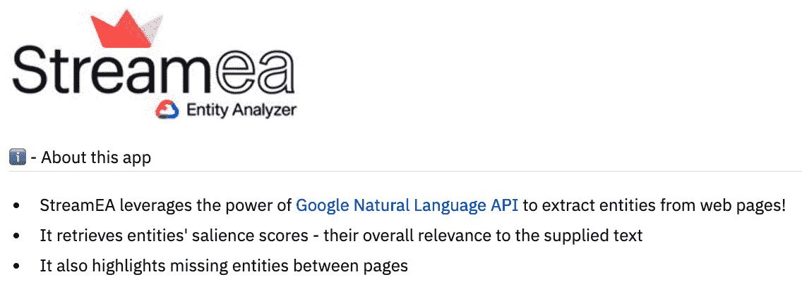

# 第十二章：*第十二章*：Streamlit 强力用户

欢迎来到本书的最后一章！在这一章中，我们将向最佳学习者学习，包括 Streamlit 的创始人和有丰富应用及组件开发经验的 Streamlit 用户，他们中的一些人已经转变为 Streamlit 员工，甚至还有现在管理支持 Streamlit 库开发的初创公司的创始人。我们与四位不同的用户坐下来进行了访谈，了解了他们的背景、他们使用 Streamlit 的经验，以及他们为不同经验水平的用户提供的建议。通过这些访谈，我们将了解他们如何在日常工作中、教学中使用 Streamlit，以及 Streamlit 接下来的发展方向。

本章分为四个访谈：

+   Fanilo Andrianasolo，Streamlit 创始人和 Worldline 技术负责人

+   Johannes Rieke，Streamlit 创始人转工程师

+   Adrien Treuille，Streamlit 创始人兼 CEO

+   Charly Wargnier，Streamlit 创始人兼 SEO 顾问

首先，让我们从 Fanilo 开始！

# 访谈 #1 – Fanilo Andrianasolo

（Tyler）嘿，Fanilo！在我们开始之前，你想向读者自我介绍一下吗？你有什么背景？你平时做什么工作，在哪工作？

（Fanilo）大家好！我叫 Fanilo Andrianasolo，来自马达加斯加，我在 Worldline 工作，Worldline 是欧洲领先的数字支付和交易服务公司之一。我在那里担任数据科学和商业智能倡导者及技术负责人，帮助内部产品和开发团队原型化新的数据科学应用场景、设计这些场景的架构，并将它们投入生产。所以，我的大部分工作专注于将数据分析集成到 Worldline 中，这是一项庞大的任务，因为它涉及多个行业，例如金融（如欺诈检测）、零售和客户分析。同时，我还是数据科学的倡导者，因此我会为内部员工或潜在客户提供多个讲座，向他们展示：“这就是数据科学，别担心，它并没有你想象的那么难”或“这就是随机森林，别担心，它没有你想象的那么复杂。”此外，我还在里昂大学教授大数据和 NoSQL，每年讲授大约 50 小时。这是一个极好的机会，可以与学生交流，并看到他们成长为出色的软件工程师和数据科学家！

（Tyler）听起来很棒！我觉得你基本上有两个非常有趣的角色，你需要在工作和大学中向他人解释数据科学概念。你在这两个场景中都使用 Streamlit 吗？

（Fanilo）是的，我用过！当我第一次发现 Streamlit 时，是为了内部工作。起初，我在追踪不同机器的指标，并希望展示它们，而不想使用 Jupyter Notebook，因为我不想每次都点击运行每一个单元格。我尝试了 Streamlit，发现它非常快速且易于使用，立刻就被它吸引了。

在我做大学讲座时，主要是讲 PySpark、MongoDB 和 Elasticsearch，这些都是通过它们的 Python 插件进行演示的。我会展示一个 Streamlit 应用，代码在旁边，我会在学生面前修改代码，所有的 Python 变量会实时在应用上更新。当你写这段代码来构建某个 MapReduce 任务时，比如在 PySpark 中，展示代码实时效果很容易，甚至可以和学生一起做编程练习。为了展示代码如何工作，我会在代码里放一个函数，结果会直接显示在 Streamlit 应用的右侧。这种方式非常动态，也让我能轻松地展示和讲解代码。

（Tyler）你为这两个团队开发 Streamlit 应用时，有什么不同吗？我觉得它们有很多相似之处，但具体有哪些区别呢？

（Fanilo）对于学生来说，这将是一个从上到下运行的单一脚本，方便他们跟着走；这对他们来说就像是一个实时演示。而在公司工作时，我将 Streamlit 集成到更大的项目中，因此通常会有一个已经建立的项目结构，并有一个专门用于 UI 的文件夹。对于工作项目，Streamlit 应用将会使用来自多个库和模块的函数，所以会有所不同。我们在工作中分发和使用 Streamlit 应用的方式也稍有不同，因为在大学里，我可以随意在我的机器上做任何事情。而在工作中，我必须考虑更多问题，比如能否将某些内容放入缓存中？能否重写同事的函数，因为它不能放入 Streamlit 哈希？我在职业工作中的一些限制让写 Streamlit 应用变得更复杂。

（Tyler）我很好奇你在工作中是如何进行部署的。你是在 Heroku 服务器上使用 Streamlit for Teams 吗？还是全部在本地进行？

（Fanilo）我们公司内部有两台本地服务器，我将 Streamlit 应用部署在这些服务器上。公司内部使用 Streamlit 的人不多，所以我可以暂时把应用托管在服务器上，让市场部门可以试用。而那些不懂 Python 的技术人员，我就直接把脚本发给他们，并告诉他们如何使用 Anaconda 运行。

（Tyler）你提到过第一次使用 Streamlit 的经历。你是通过 Twitter 发现它的吗？还是在某个论坛上看到的？是什么让你开始使用它的？最初的使用场景是什么？

（Fanilo）我想我是在 Twitter 上听说的它。一开始我并没有在意，想，“哦，这只是另一个 Python 库，我把它放到待办事项清单里，哪天试试就好。”然后我在两个月后尝试了它，当时我正在为一个潜在客户做一个实时数据科学演示。他们想追踪来自不同网站的访问指标并进行可视化。事实上，我们的大部分客户只是要求我们做一些数据分析。他们还没有想到 KPIs、分析业务用例，或者通过数据回答的商业问题。这些总是很难开始，我通常会为他们构建一个小的互动演示，帮助他们理解数据科学的过程。正是在那个时候，我想，“哦，我应该试试 Streamlit。”

在这之前，我实际上用 Jupyter Notebook 为另一个客户做过演示，但客户并不感兴趣，因为他们觉得这太技术化了；他们不喜欢看到代码。所以，我想对于这个客户，我或许应该试试 Streamlit，展示一组图表，使用滑块来决定你想要可视化多少数据。对于这个问题，我们想对一组日期做窗口处理，以回答这些网站的平均访问量是多少，并且希望能够决定窗口的大小。我们可以将它放在 Streamlit 的侧边栏中，这是一个很好的机会，能够实时展示结果给客户看。所以我们在 Streamlit 应用中加入了这个滑块并交给了客户，你可以看到，当出现一个峰值时，可以进一步分析。是的，这就是我通过内部和外部演示数据科学的过程中，更多地了解 Streamlit 的方式。

（Tyler）这种情况经常发生，客户在提出请求时并不完全知道自己想要什么。真是一个很棒的使用案例！我想跟你聊一聊 Streamlit 社区，过去一年你已经成为其中一个相当强大的成员了。Streamlit 的哪些方面让你继续投资这个生态系统呢？

（Fanilo）对我来说，吸引我进入 Streamlit 的东西，实际上就是我在做前端工程时错过的反馈循环。我可以写一些代码，并且立刻在屏幕上看到结果。我可以直接在 CSS 中编辑颜色，并看到变化。而且在 Streamlit 中，这个反馈循环非常短，加上 API 的简洁性，使得构建一个基础应用变得非常容易，这才是让我真正被这个框架吸引的原因。我还和 Adrian（Streamlit 的创始人）有过一次对话，我告诉他，这个反馈循环让我想起了网页生态系统，对我来说，这就是 Streamlit 的“秘密酱料”。

另一件事是现在我们可以很容易地将 web 组件集成到 Streamlit 中，这使得我们能够为数据科学家构建更多样化的交互式 web 应用程序变得非常简单。我总是从与我的学生、其他同事或者在聚会上与人交流中得到这样的印象，他们总是在努力构建交互式应用程序，可以在其中选择或绘制某些内容，并将这些绘制内容作为他们的机器学习模型的输入。为了做到这一点，他们需要预先绘制，然后将图像加载到 Jupyter 笔记本中，这太费时了，但有 HTML 组件可以进行绘制。Streamlit 作为 Python 与 web 之间的桥梁通过组件将我们作为创建者拉入到 Streamlit 中。

(Tyler) 所以说到基于 web 的平台，你花了很多时间构建像 streamlit-lottie ([`github.com/andfanilo/streamlit-lottie`](https://github.com/andfanilo/streamlit-lottie))，我们之前在书中提到的 streamlit-drawable-canvas ([`github.com/andfanilo/streamlit-drawable-canvas`](https://github.com/andfanilo/streamlit-drawable-canvas))，甚至 streamlit-echarts ([`github.com/andfanilo/streamlit-echarts`](https://github.com/andfanilo/streamlit-echarts)) 这样的组件。你能谈谈你是如何想出这些组件的想法的吗？

(Fanilo) 所以对于这三个组件，我有两个不同的故事。我要从 streamlit-lottie 开始；这个想法是在一个无聊的周六晚上，我在 Twitter 上滚动时突然冒出来的。我看到使用 Lottie 文件的漂亮动画，心想，“哦，很不错，我想在 Streamlit 中也能有这样酷炫的动画”，于是我就开始构建它。就是这样，我想把更多的 web 组件引入到 Streamlit 中。

对于 streamlit-echarts 和 streamlit-drawable-canvas，有一个更大的用例。几年前，我因为一个使用 TensorFlow.js 的演示项目紧急的截止日期而处于压力之下。我想要在绘图上进行训练和推断，花了 5 天时间在 JavaScript 生态系统中创建这个演示项目，混合使用 Fabric.js 在画布上绘图和 Echarts 显示结果。这非常困难，特别是因为这是我第一次真正涉足前端工程领域。后来 Streamlit 推出时，我想看看其他用户是否能在几小时内构建这个演示项目，如果 Fabric.js 和 Echarts 组件已经存在的话，所以我把这个演示项目的代码提取出来做成了外部库，就这样！

我的思考过程总是围绕着，我们可以为 Streamlit 带来什么样的新输入和输出？比如，我们能否把实时音乐输入带到 Streamlit？现在深度学习领域大家都在谈论图像和声音，所以这将是一个很棒的组件。而作为输出，现如今有很多流行的 JavaScript 库可以以互动的方式展示数据，这对分析非常有帮助。我的目标始终是，能为 Streamlit 添加什么样的输入和输出，以利用 web 的能力？希望 web 开发者会想要在 Streamlit 中构建更多的东西！

(Tyler) 你可能看过很多使用你组件的 Streamlit 应用。我想你一定会对一些巧妙使用 streamlit-lottie 或 streamlit-echarts 的例子感到非常兴奋。看到这种东西时你是不是会特别激动？有没有一些你特别喜欢的应用，它们是基于你制作的一些组件搭建的？

(Fanilo) 这些是我真正投入精力去构建和推广的开源项目。我喜欢这些工具的灵活性，它们可以用于许多我从未想过的使用场景，特别是对于 streamlit-drawable-canvas。我看到有一个用户在 Streamlit 中展示了一个足球场的侧视图，然后他在画布上绘制了场地的边界，接着进行了一些 3D 重映射，把它转化为顶视图，以便分析球员的位置。我当时想，哇，谁会这么做呢？

有些人正在将 Streamlit 用于医疗目的。例如，他们想在一堆图像的每一张切片上绘制一些分子的位置，从而绘制出这种分子的 3D 版本。我甚至看到过 Jina AI 的一个应用，他们构建了一个 Pokémon 识别器（[`github.com/jina-ai/integration-streamlit-pokemon`](https://github.com/jina-ai/integration-streamlit-pokemon)）！所以你可以画一个 Pokémon，它会将你的绘图输入到神经网络中，识别你想画的 Pokémon。你知道吗，我从未预测到这种应用，真是太神奇了。

(Tyler) 听起来真棒。对于刚接触 Streamlit 的初学者，你有什么建议吗？你有没有什么是你当初刚开始时希望知道的？

（Fanilo）对我来说，就是不断地尝试新的库。如果有一个新的 Python 库，我常常想要了解它是如何工作的。如果我改变这个参数，会发生什么？每个参数是如何影响输出的？所以，我只需启动一个新的 Streamlit 脚本并导入这个库。然后，对于你所拥有的每个参数，你可以构建一个滑块、一个数字输入框、一个日期输入框，然后开始构建这个未知库的演示，而 Streamlit 只是帮助你尽可能深入地探索它。接着，你会开始思考如何更好地布局，如何为应用保留一些状态，而这正是你开始深入了解 Streamlit 的地方。我们曾讨论过 Streamlit 组件的 Web 生态系统。但我也认为 Streamlit 是展示任何 Python 库的最佳方式之一，涵盖了 Python 生态系统中的一切。

除此之外，我还会建议大家在线参与社区互动。Streamlit 社区实际上是我第一次与一个完全陌生的在线社区互动，我既不认识这些人，也没有见过他们。我不记得自己写的第一个帖子或话题是什么，但我记得我投入了大量的精力去写它。我知道在公开场合提问需要勇气，所以我会说：敢于在论坛上发一个新帖子。如果你在使用 Streamlit 或 Python 时遇到困难，尝试在社区论坛上发布一些问题是一次不错的体验([`discuss.streamlit.io/`](https://discuss.streamlit.io/))，因为那里的每个人都非常友好，总是有人愿意帮忙。我鼓励大家多玩 Streamlit 并进行创新，然后到论坛上提问那些无法解决的问题。论坛里有很多非常隐藏的功能，只有在论坛里才能找到，所以我鼓励大家去论坛看看。

（Tyler）是的，绝对如此。这是一个非常有趣的例子，展示了互联网中积累的知识如何以小块的形式存在。提出问题是让人害怕的，因为你总会想，“如果他们觉得我真的很傻怎么办？”这是经常出现的首要担忧：给别人传递出你知道自己在做什么的信号。但 Streamlit 社区的人似乎都非常友好，说实话，这在互联网上是一个巨大的变化。

(Fanilo) 是的，也许我已经习惯了和学生互动，这帮助我理解了向“陌生人”提问的恐惧。发生在我学生身上的最糟糕的事情是，他们想要克隆一个 Git 仓库，日志显示该文件夹已经存在于他们的机器上，因此无法克隆。答案很简单，直接写在我们的眼前的日志上，至少我们容易理解，对吧？但是，当你第一次写代码时，你根本不知道这个日志意味着什么，或者你甚至应该检查日志。所以，我尽量像回答第一次写代码的学生那样回答问题，并以此作为我们社区的标准，让每个人都意识到我们曾经都是初学者，我们应该引导他们进入这个庞大的 Python/Streamlit 世界，而不是回答“去读手册”。

一年前，我完全不接触在线社区。我那时候也很害怕做这件事。现在，我是一个论坛版主和 Streamlit 的创作者。一年前，我根本没想过会做这件事。所以，大家尽管提问吧！

(Tyler) 非常感谢你，Fanilo！对于任何想了解更多的人，可以在 [`github.com/andfanilo`](https://github.com/andfanilo) 找到 Fanilo 的 GitHub，另外他的 Streamlit 组件教程也可以在 [`streamlit-components-tutorial.netlify.app/`](https://streamlit-components-tutorial.netlify.app/) 查看。

# 采访 #2 – Johannes Rieke

(Tyler) 嗨，Johannes！在我们开始之前，你能给我们简单介绍一下自己吗？你过去在哪里工作过，你做什么工作，有什么背景？

(Johannes) 你好！我来自德国，现在住在柏林。嗯，正如你所知道的，我现在在 Streamlit 工作，已经工作了两个月，但我的背景实际上是在物理学方面。所以我本科时学的是物理，后来不知怎么的我进入了神经科学领域。我上了几门课，做了一些项目，真的很喜欢，尤其是与计算机科学结合，做神经细胞、脑部模拟等等这一类的事情。我对此产生了浓厚的兴趣。于是我决定攻读计算神经科学的硕士学位，这个学科一方面涉及神经科学，另一方面也涉及机器学习。在那个项目中，我做了很多与机器学习相关的工作，涉及各个领域，比如医学影像、自然语言处理、图神经网络等各种东西。硕士毕业后，我参与了一些开源项目。其实，我本来打算去旅行一段时间，但因为 Covid 的原因，我比预期更早回到了德国。然后我开始参与开源项目，做了很多与 Streamlit 相关的工作，现在我就在 Streamlit 担任产品工程师。

(Tyler) 非常有趣！你是什么时候开始接触 Python 生态系统的？那是你学习物理的时候吗？

（Johannes）是的，那是很久以前的事了，基本上是在我本科开始的时候，或者说是我本科的第一年。我从高中就开始编程了。最开始是用 Java，然后在 2013 年，在我本科期间，我接触了 Python，并且真的爱上了它。因为对于我所做的工作，从计算和模拟，到后来机器学习，Python 简直太棒了。

（Tyler）你在 Java 中做过机器学习吗？我没见过很多机器学习工程师在 Java 中工作，或者需要写 Java 代码。

（Johannes）我绝对是用 Python 做的。在我攻读硕士学位之前，我实际上在一个研究实验室工作过，利用一个空档年，做了一些计算相关的工作，用的是 C++，但那真是太糟糕了。如果我当时知道 Python，我可能会全部用 Python 做，时间也能缩短十倍。

（Tyler）我知道很多人会主要使用 Python 来做大部分工作，如果他们有强烈的需求让某个算法变得更快，他们就会切换到低级语言，这种做法是最有效的。那时，你已经深度参与 Python 的工作，并且在 Python 中编程一段时间了，之后你开始使用 Streamlit 做这些机器学习项目，比如你的 Traingenerator 应用（[`traingenerator.jrieke.com/`](https://traingenerator.jrieke.com/)），这是一个多用途的应用，可以为你写机器学习代码。你创建这些应用的动机是什么？是为了回馈社区、展示你的作品、创建个人作品集，还是其他完全不同的原因？

图 12.1 – Traingenerator 应用

（Johannes）是的，基本上是这些点的组合。我是在去年春天毕业后开始使用 Streamlit 的。毕业后我去旅行，但由于疫情，我不得不回到德国，而且显然有了很多空闲时间。我一些朋友和以前的同事开始做一个开源项目，涉及 Covid 追踪领域，所以我加入了他们。作为这个项目的一部分，我们需要一个小型的仪表盘，一个朋友告诉我 Streamlit，我试了一下，觉得它非常酷。

但基本上这就是我开始用 Streamlit 玩乐的方式。我开发的 Traingenerator 应用其实更具商业或初创意图。我想，试试自己的项目。然后我意识到，我真的很喜欢用一行代码训练机器学习模型的想法，就像 FastAI 和 PyTorch Lightning 所做的那样。PyTorch Lightning 是一个同领域的库。我在机器学习领域工作了很久，通常我使用的是非常标准和基础的模型，并将它们应用到新的数据集或新领域。有一件事一直让我困扰，就是你采用了一个非常标准的方法，但你必须写大量代码来实现一个模型，或者即使你已经有了一个实现好的模型，你也必须测试并调整它；你需要转换数据以使其适应这个模型。你还得写代码来追踪你的指标和实验，所有这些内容。因此，我的想法是：能否建立一个简化这个过程的工具，也许还有可能成为一个可行的产品、可行的商业模式？

我在这方面工作了一段时间，然后当我和朋友谈论这个项目时，Traingenerator 的想法就出现了。我们讨论了一个简化这个过程的 Python 库，这个库非常好，但当你想构建更复杂的东西时，它就会达到极限；显然，这是因为你不能轻松地修改里面的内容。我们认为它对于原型非常有用，但一旦你想把模型投入生产，就必须重新开始。

然后我们有了这样一个想法：建立一个网络应用，你可以输入你想要训练的内容以及你想使用的框架，然后它会为你生成代码。你可以直接使用这些代码来训练模型，或者根据需要修改它，这就是 Traingenerator 的功能。

之后我做的其他项目，比如 GitHub 2020 应用（[`gh2020.jrieke.com/`](http://gh2020.jrieke.com/)），还有最佳 Streamlit 列表，那些更像是为了好玩而做的个人项目，当然也是为我的作品集增加内容。

（Tyler）这一切都非常有趣。我用过 Traingenerator 好几次，非常喜欢。当时你开发它时，是在 Streamlit Sharing 发布之前，你使用 Heroku 来部署这个应用。我很好奇，如果现在再做，你还会选择同样的方式吗？你是怎么决定应用部署在哪里的？

（Johannes）当时的原因很简单，我想要一个简短的自定义网址；我不想要一个很长、难以理解的网址。但实际上，我现在已经把它迁移到了 Streamlit Sharing！相比 Heroku，这提供了更好的开发者体验，因为应用在推送到 GitHub 后，几乎在一秒钟内就会更新，而不需要重启或其他操作。Sharing 目前默认不支持自定义网址，但论坛上有一个方法，我现在正在使用它。我已经因这个功能请求把我们的产品经理烦得不轻，所以希望不会太久就能实现！

（Tyler）你做的另一个应用是一个动态生成并分享用户 GitHub 统计数据的应用，叫做 Year on GitHub（[`gh2020.jrieke.com/`](http://gh2020.jrieke.com/)）。它变得相当受欢迎；我几乎在互联网上每个地方都看到了它。你能给我们讲讲这个故事吗？

图 12.2 – GitHub 统计应用

（Johannes）当然可以。所以背后的原因或者想法其实是一个非常随机的想法，我真不知道我是怎么想到的。背后没有什么大故事。我已经做了 Traingenerator，并且得到了极大的好评。我又做了一些 Streamlit 相关的工作，然后在圣诞节前几天，我突然想到要做一个应用，只需要输入你的 GitHub 用户名，它就会显示你在 2020 年在 GitHub 上的某些统计数据。然后你可以把它发到 Twitter 上。所以这跟 Spotify Wrapped 每年年底做的事情类似。

在我想到这个点子后几天，实际上有一个新的 Python 库发布了，专门用于 GitHub API，这个库非常酷。然后我想，显然，在三月或四月发布这样的东西是没有任何意义的，这意味着我需要在接下来的两周内完成它，并且尽快发布。所以我在整个圣诞假期期间都在忙这个项目，感觉超级酷。

我认为通过这个应用生成了大约四五百条推文。Julia 编程语言的创建者也使用了它。看到这些反应真的很棒，而且 Streamlit 的员工们也看到了所有这些推文，我想这大概给我带来了我工作的半数机会。

（Tyler）我有一个理论，如果你真的想在某个地方找到工作，你应该为他们做一个 Streamlit 应用，解决他们的某个问题或者让他们注意到你。如果你这样做，你就更有可能真的被他们聘用。我已经试过几次，通常最后都会收到工作机会。

（Johannes）实际上当时根本没有计划这样做。那时我甚至没有想过要申请 Streamlit，但它运作得非常好。回想起来，我觉得他们内部肯定都喜欢这个应用，因为它带动了 Streamlit 推特账号上的巨大流量，看到关于这个新应用的所有推文也非常酷。

（Tyler）这一切我都能理解！所以在 Streamlit 工作了 8 或 9 个月后，你决定这是你想工作的地方，申请了那里的工作，然后拿到了这份工作。首先，祝贺你。其次，是什么让你觉得这个库将会在未来成为数据科学和机器学习社区中的重要工具？我对 Streamlit 有足够的信心甚至想为它写一本书，所以我显然是同意你的，但你能谈谈你对这家公司在这个领域的信心吗？

（Johannes）所以在我看来，Streamlit 的优势在于开发者体验和它的简单性。在我当前作为产品工程师的工作中，我也会看看其他许多 Web 框架和解决方案，并且需要尝试它们。虽然确实有其他工具具有一些很酷的功能，可以做一些比 Streamlit 更复杂的事情，因为 Streamlit 还比较年轻，但就开发者体验而言，开始一个项目有多简单，制作应用有多有趣，这些工具都远不及 Streamlit。我认为有很多因素在其中起作用。

在简单性方面，你基本上只需 5 分钟，几行代码就能快速搭建一个应用。而且这只是你通常编写的 Python 脚本；你不需要学习其他类或前端开发的任何内容。对新手来说，它非常直观。

然后是 Streamlit 的实时编码模式，它允许你编写应用，Streamlit 会同时重新运行你的应用，并且非常智能地决定需要重新运行什么，尤其是当你使用缓存时。我认为这就是 Streamlit 为什么这么有趣和让人上瘾的原因，因为你可以通过即时看到结果来获得超快速的反馈。

另一个方面是社区；Streamlit 社区简直太棒了。我的意思是，现在有很多开发者真的很喜欢使用 Streamlit。论坛是一个非常酷的地方，可以交流想法、获取建议，而且有很多人非常投入，愿意在空闲时间每周花上几个小时回答问题。

事实上，我们在 Streamlit 内部有三到五个人全职负责论坛，和开发者互动，给那些构建 Streamlit 应用的人送纪念品，这对于一个只有大约 25 名员工的公司来说是非常独特的。

（Tyler）我经常想到这种动态。当我开始时，Streamlit 只感觉是一个非常好的工具。然后我开始更多地玩它。后来我意识到，它可能更像一个玩具，在其中我不断地进行迭代和反馈。每当你有一个既是工具又是玩具的东西，它最终都会非常成功。

（Johannes）是的，绝对有。我认为 Streamlit 很酷的一个重要方面，以及为什么我认为它将来会变得更酷，是它有很多不同的部分。它不仅仅是一个开源库，还是 Streamlit Sharing，如果你想部署你的模型，它非常好用且简便。此外，正如我所说，论坛也是其中一部分，如果你遇到问题，肯定能在那里得到帮助。我认为未来还会有更多的部分加入。

（Tyler）你大概已经有 9 个月的 Streamlit 开发经验了。你有什么针对初学者的建议吗？有没有一些你希望当时知道的事情？

（Johannes）我其实认为，对于初学者来说，没有太多可以给的建议，除了就是试试看。这就是 Streamlit 很酷的地方；如果你开始使用它，基本上 10 分钟后你就能了解它是怎么工作的。而且开始使用起来非常简单。我也有几个朋友，我推荐了 Streamlit 给他们，结果我并不需要做很多说服工作。我只是告诉他们这个工具，第二天他们就回来说已经知道怎么用了。唯一的建议就是注册论坛，如果有任何问题，直接问或者通过任何方式联系我们。论坛上有很多乐于助人的人。正如我所说，在 Streamlit 内部有很多人的工作就是和开发者互动。

更复杂的内容，比如缓存和状态，对于初学者来说并不容易理解，需要一些解释，我们现在也在这一方面做了很多工作。

（Tyler）感谢 Johannes 来和我们聊一聊，我相信大家从中受益匪浅。Johannes 的个人网站可以在 [`www.jrieke.com/`](https://www.jrieke.com/) 找到。

# 采访 #3 – Adrien Treuille

（Tyler）嘿，Adrien！感谢你愿意接受采访。在我们真正开始之前，你愿意先简要介绍一下自己吗？我知道你曾是卡内基梅隆大学的教授，在那之前你在做蛋白质折叠的研究。你也曾参与过自动驾驶汽车的研究，现在是 Streamlit 的创始人。那么你怎么介绍自己呢？

（Adrien）首先，当我还是教授时，整个 Python 数据栈算是比较新的东西。NumPy 甚至在 1.0 之前就已经存在，而且突然间有一个了不起的库叫 NumPy，让 Python 一下子和 MATLAB 比肩，后来，Python 甚至比 MATLAB 更强大。这是 Python 开始成为数值计算主流语言的起点，最终也成为了机器学习的主流语言。Python 曾经是一个脚本语言，是一个系统管理员语言，或者说是一个计算机科学 101 级别的语言。突然间，它拥有了一个庞大的、新的、极其重要的工业应用。从最初一群极客和教授在研究中使用它开始，他们发现它真的非常有用，而且比用 C 写自己的机器学习代码或者数值计算代码要容易得多。

我做的另一件事是创造了可以让人们开发科学问题的计算机游戏，最终，数百万人玩过这些游戏。稍微快进一下，我去了 Google 工作。在技术和机器学习的交汇点上，我有了一个非常有趣、酷的职业生涯。

然后我开始了 Streamlit。我们正在构建的工具基于 15 年前我们使用的数值 Python 栈（那时还不流行）。Streamlit 的另一个部分是构建一个社区。我认为这一方面非常特别。我的研究中这两个主题已经完美结合：数值 Python 世界和在线社区的构建。

（Tyler）在 2019 年 10 月的原始文档和随后的 Medium 文章中，Streamlit 最初被推介为机器学习工程师的工具。现在，你可以看到各种各样的人都在使用它。我不是一个机器学习工程师，但我一直在使用它。Streamlit 的想法随着时间的推移是如何变化的？

（Adrien）从一个更宏观的角度来看，我很真诚地说，很酷的是你能够观察到这一点。对于我们 Streamlit 内部的人来说，我们在谈论目标用户群体时会有一些微妙的变化。但这并不一定意味着其他人注意到了这些细微的变化。看到别人能注意到这一点真的很酷！

有几种方式可以回答这个问题。Streamlit 对 Python 编程的意义，比对机器学习或数据科学的意义更为根本。它满足了 Python 编程中，其他工具无法提供的需求。你可以编写命令行脚本，也有 Python 的 GUI 框架，但这些框架的使用相当复杂，因为 GUI 应用开发与数据工作是完全不同的编程风格。你也可以进入 Jupyter notebook，但那同样是另一种完全不同的编程风格。

Streamlit 是图形用户界面编程和脚本编程的融合。对我来说，这是一个非常有用的功能。它实际上超越了机器学习。因此，Streamlit 的潜力之一，举个例子，就是它可以在 CS 101 课程中发挥作用。Streamlit 的一个酷点是，它不仅有技术本身的概念，还有如何将它应用于不同问题和领域的思考。我们如何优先考虑应用，以便既能造福社区，又能创造一个可持续的公司？

（Tyler）我想再谈谈你刚才提到的社区，因为你之前做过很多在线游戏，比如 FoldIt ([`fold.it/`](https://fold.it/))，它有很强的众包功能。在我看来，Streamlit 有两个方面。一方面非常注重社区，它是一个开源语言，任何人都可以在其基础上构建，而且可以很容易地制作并添加 Streamlit 组件。另一方面则是 Streamlit 公司，显然它的存在是为了最终实现盈利。你是如何管理这两方面的？

（Adrien）我不觉得我们必须选择。当两者的利益相一致时，大家都能受益。从商业模式的角度来看，我们正在努力将这款软件推向世界，它在数据科学中有很多应用场景。例如，我为我儿子的班级编写了一个计算机游戏，使用 Streamlit 帮助他们理解乘法。它也有很多工业应用。这两个群体是相互契合的：社区中的人越多，越多的人为 Streamlit 做出贡献，我们的可服务用户群体也就越大，尤其是对于那些工业应用。

这是一个漏斗。数据科学家流入 Streamlit 的开源社区，然后再流入我们的客户基础。我们努力在漏斗的每个阶段都实现增长，这对商业模式和社区都是有利的。

（Tyler）你从自己十年构建在线众包游戏的经历中学到了什么，并且带到了 Streamlit 的世界中？因为社区感觉像是一个元游戏，人们在尝试为他人创建酷炫的 Streamlit 应用。你是如何培育这种氛围的？这是有意为之，还是仅仅因为它是一个酷工具的结果？

（Adrien）FoldIt 和 Streamlit 之间有一个有趣的相似点，那就是它们都被设计成像玩具一样。所谓“玩具”——这是游戏设计中的一个技术术语——指的是没有规则的游戏，你只想和它一起玩。GI Joe 玩具就没有使用手册，它只是一个通过让它做事情来玩的东西。你也可以为它加上规则，但并不是必须的。

这里还有一个 Streamlit 游戏化的方面：人们构建 Streamlit 应用并将其上线，来传达思想、展示工作成果、获得赞赏。这有助于其他人了解 Streamlit，然后他们也会构建更多应用，进一步壮大社区。我们意识到，“哇，发布和赞赏的循环是我们一个了不起的增长动力。”我们确实做了一些努力来支持那些展示自己作品的人，但我认为我们还没有真正探索 Streamlit 这一方面的所有可能性。我们只是没有时间去执行，因为有太多重要的事情要做。

（Tyler）如果我们在谈论公司优先级问题，你如何看待当前公司的优先事项？你提到了漏斗，那么就有三个主要部分，数据科学家、使用 Streamlit 的数据科学家，以及在公司内部使用 Streamlit 的数据科学家。当前 Streamlit 的焦点在哪里？

（Adrien）实际上，还有一个阶段，那就是有多少人正在观看那些公司内部创建的应用，因为我们目前的定价计划是基于观众人数，而不是开发者的数量。我们按每个观众每月收费。

所以，我们的优先级聚焦在这个管道的另一个层面上。

我们把发布后的第一年称为“开发者之年”，那时我们的重点是发展开源社区。经历了指数级增长后，运营发生了不连续的变化。我们没有为此做好准备。我们把整个工程团队轮流安排去回答社区论坛中的问题。他们给出的答案非常专业，但整个工程团队在三个月内几乎停滞不前。然后我们意识到，糟糕，我们不能通过雇佣工程师来解决社区问题。

现在是第二年，我们所处的这一年是“客户之年”。这一年主要是围绕建立初步的盈利引擎，并创建一个自助机制，让用户可以轻松点击按钮，使用 Streamlit for Teams。我们还没有完全实现这一点，但各个环节正在逐步到位！

(Tyler) 很多读这篇文章的人可能刚刚开始接触 Python 开发，或者处于 Python 和数据科学的初学者/中级阶段。他们有很多选择可以考虑，从 Django 或 Flask，到无代码工具，再到其他仪表盘框架。他们甚至可以转向 R 的 Shiny 应用开发。你有什么简洁的推荐给新用户？为什么选择 Streamlit？

(Adrien) 我会说，你应该直接尝试一下。Twitter 上有很多关于 Streamlit 有多“酷”的讨论。我认为 Streamlit 既强大又酷。Streamlit 基于脚本编程的理念，这是一种非常自然且简洁的数据流思维方式。我觉得其他人并没有真正做到这一点。它应该让你觉得有点神奇；编程本身并不是魔法，但它确实非常有趣。很多受过高等教育、薪水极高的人做应用只是因为这很有趣，所以我们喜欢用这种视角来接触它。如果你能感觉到每写一个函数调用都能得到比花费更多的回报，那么经历这个过程会非常激动人心。

(Tyler) 对我来说，我一开始选择它是因为它简单，后来坚持使用是因为它是最好的，你懂吗？

(Adrien) 我认为有一个事实是（也许我错了），在这个可视化/仪表盘应用/开发领域，越是深入了解它们的工作原理，越是会感到失望。你看到的演示看起来非常可定制，似乎很棒，但当你真正体验构建或尝试复制演示时，实际上很难实现它们在网站上承诺的功能。

这对于 Streamlit 来说根本不是问题。当你查看画廊中的所有演示应用时（[`streamlit.io/gallery`](https://streamlit.io/gallery)），它们其实非常易于使用。我们并不打算去竞争“打造一个庞大且完美的应用”这一领域。

(Tyler) 感谢你过来和我们交流！我们应该指向的一个主要资源显然是 Streamlit 的官方网站（[`streamlit.io/`](https://streamlit.io/)）。你可以在[`medium.com/@adrien.g.treuille`](https://medium.com/@adrien.g.treuille)找到 Adrien 的文章，或者在 Twitter 上通过[`twitter.com/myelbows`](https://twitter.com/myelbows)联系他。

# 采访 #4 – Charly Wargnier

(Tyler) 嗨，Charly！非常感谢你过来跟我们分享。首先，你能向读者介绍一下自己吗？

(Charly) 嗨！我来自法国，已经在英国生活了大约 13 年。我主要从事数字营销、商业智能和**SEO**（**搜索引擎优化**）咨询工作。最近几年，我转向了数据工程和数据科学。此外，我曾在公司内部和代理机构工作过，也曾为零售时尚的大公司和许多小型企业工作过。但自 2014 年以来，我的工作主要集中在企业级客户，而 2008 到 2014 年间则主要是为小型企业服务。

(Tyler) 我们稍微回顾一下，做 SEO 是什么感觉？它实际是什么样的工作？

(Charly) 我的核心技能主要是技术 SEO。SEO 是一个广阔的领域，正如你可以想象的那样，而我的核心技能是与网站的技术相关的任何事情，比如网站的编码方式，或者它是如何被爬虫抓取和传递的。确保 Google 和 Bing 能准确地抓取这些大型网站，显然，这涉及很多方面，比如确保付费搜索与 SEO 协同工作。

这是一份非常多元化的工作，你不仅需要与 SEO 人员合作，还需要与开发网站的人员，甚至公关、内容和产品团队合作。从互动的角度来看，这可以说是最具多样性的工作之一。

(Tyler) 明白了，一切都说得通。还有一个我们还没提到的事情是 Streamlit。你很常用 Streamlit，而且是一个多产的创作者。Streamlit 对你来说有什么特别有价值的地方？

(Charly) 我过去经常通过 Google Colab 或 Jupyter Notebook 提供一些 Python 脚本给别人。而自从使用 Streamlit 之后，我不再需要发送脚本，我可以直接发送这些应用程序！我可以展示一些 SEO 应用或功能，用户如果不是开发人员，可能根本无法使用这些功能。它真的拓宽了应用范围和用户接受度。在过去几个月我与几家公司合作时，我能够让更多的人开始使用我设计的 SEO 应用程序。真是发生了很大的变化。

(Tyler) 真有趣！你在 Python 中的另一个选择是为 Django 应用程序做 Flask；你曾考虑过为 SEO 应用做类似的事情吗？

(Charly) 是的，我曾经开发过一些 Flask 应用，但那时候对我来说开发起来比较繁琐，因为它需要很多 HTML 或 JavaScript 的技能。但使用 Streamlit 后，它让我能够非常快速地创建一些东西并与他人分享。所以不再用 Flask，我也试过 Django，但它的学习曲线相当陡峭。通常设计一个 Django 应用会花我很长时间。所以，确实没有可比性；我暂时放下了 Flask 和 Django，现在真的把精力集中在 Streamlit 上。

(Tyler) 完全同意，在 Streamlit 出现之前，我做了很多不同的数据科学项目，我的选择总是把它放在 Jupyter notebook 或者博客文章中，或者用 Flask 做一个完整的应用。对我来说，问题在于，在 Streamlit 出现之前，做一个完整的应用所需的时间和精力差异太大了。那几乎会把项目的时间翻倍！而有了 Streamlit，制作应用只是比制作 Jupyter notebook 稍微困难一点，但输出效果好得多。

(Charly) 现在我在尝试学习 React，希望能做出一些更集成、更精致的东西，同时用 Streamlit 作为最小可行产品（MVP）。我也用过其他一些 Web 框架，但你说得对，就快速性而言，到目前为止没有什么能比得上 Streamlit。我认为最接近的是 Panel（[`panel.holoviz.org/`](https://panel.holoviz.org/)），它既灵活又简单易用，但我觉得 Streamlit 和 Panel 之间的最大区别就是社区。Streamlit 社区非常热情，包括你在内的许多人。即使是在几年前，我几乎没有用 Python 编程，而 Streamlit 真的是我接纳的应用。我认为社区真的是关键。

(Tyler) 说到社区，你一直活跃于 SEO 和 Streamlit 社区。你创建了像 StreamEA 这样的应用（[`www.charlywargnier.com/post/streamea-entity-analyzer`](https://www.charlywargnier.com/post/streamea-entity-analyzer)），它能够从网页中提取和分析实体；你是怎么想到做这样的应用的呢？是先解决自己的问题，然后将其转化为应用，还是把以前为旧客户写的 Python 脚本转化成应用？

(Charly) 所以这真的是不同因素的结合。你提到了一些原因。首先，我是在解决我自己遇到的问题，因为我做 SEO 已经多年了，经常会碰到 SEO 方面的问题，想到的解决方案就是通过创建应用，大家也能使用这个解决方法。我一直对 Web 应用很感兴趣；我记得早在 2013 年时，我就有一个小小的“极客梦想”——开发 Web 应用！另外，你说得对，我有很多年一直在用的 Jupyter notebook 和脚本，至于用户采用方面，我希望确保任何人都能尝试这些工具。

我通常也会在公司内部或者向我合作过的客户收集反馈，所以我获得了很多用户反馈。有时也会是偶然发现一些新库，像你一样，我很感兴趣去尝试。最后一个方面是收费问题；市场上有很多 SEO 工具，价格可能很贵。我想，如果可以的话，我的一个秘密愿望就是能让那些应用免费开放。我有种“罪恶的快乐”，就是将一些人们愿意每月花费几百或几千英镑的应用，通过 Python 重新开发成免费的。这是一种很棒的满足感！

(Tyler) 我很想再谈谈 StreamEA，你能谈谈在开发这个应用时遇到的困难吗？这个过程是什么样的？

图 12.3 – StreamEA

(Charly) 实体分析在 SEO 领域是一个热门话题。谷歌已经从纯粹的关键词转向了各种语义技术进步，比如实体。例如，谷歌对这些实体赋予了一定的排名价值或权重，因此你需要确保你的页面或网站准确地针对这些实体进行优化。

就挑战而言，代码量还是比较大的，但也不算太具有挑战性。谷歌自然语言 API 相对简单。所以这个应用的构建方式主要分为两个部分，一个是用 BeautifulSoup 的抓取部分，另一个是通过 API 进行实体分析的部分。这里的难点在于，默认情况下，谷歌的自然语言 API 会获取一些数据，你需要创建一些函数来实现字典和数据框之间的转换，这对我来说有点挑战，因为我在去年八月刚开始做这个项目时，Python 知识并不算扎实。我记得当时我为此挣扎了很久，想要让谷歌的 API 能与我的数据框兼容。现在我已经觉得这很简单了，但我记得那时是个瓶颈，也是一个学习的过程。

然后你有一个小预算估算工具，因为如果不加以控制，谷歌 NLP API 的费用可能会非常高！很多人都在抓取 Wikipedia，它的页面可能很长，所以我认为，提供这样一个小预算估算工具，来估算使用 StreamEA 的费用（StreamEA 要求你上传自己的谷歌 API 凭证），会很有用。

最近，我开源了另一个应用程序，它从 Wikipedia 的 URL 中提取实体关系。我还没有对它进行预算估算，因此人们对我有点不满，这也是我加上警告的原因。它不仅抓取你输入的 Wikipedia URL，还抓取任何子页面，如果没有限制，可能会变得疯狂。前几天，有些人通过脚本将应用程序推到最大，例如从主页面提取 100 个子页面，这个过程非常长。他们因此被 Google 收取了几百英镑的费用！

(Tyler) 这是我在一开始为人们设置 AWS 或 GCP 账户时推荐的唯一建议，你应该绝对设置一个你能承受的预算限制，这样它会在你花费接近那个金额之前自动关闭你的服务。

所以你差不多是同时开始使用 Python 和 Streamlit 的，对于刚入门 Streamlit 的初学者，你有什么建议吗？有没有什么是你当初开始时希望自己知道的事情？

(Charly) 我是在 2016 年或 2017 年开始接触 Python 的，那时我几乎是在 GitHub 上找到一些脚本，什么也不做。只是用 Python 而并不一定理解这些代码的含义。然后我开始在线学习 Jupyter Notebook，最终有机会开始构建一些 Web 应用。

但回到你的问题，我给新用户的建议是依靠社区。对于 Streamlit，我认为这就是我们的独特之处。我会说，不要太害羞！那里的人非常乐于助人，他们一定会尽力提供帮助。而且不要害怕分享任何东西；拥抱 Twitter，利用它与别人分享信息。不要害怕分享你的项目和进展，而不仅仅是最终产品；毕竟没有“最终产品”这一说。我真的曾经在真空中工作，为自己工作，如果你不分享你的工作，就无法从社区的反馈中获得这种良好的情感推动。

它永远不会完美，你也永远不会完全准备好。所以，尽早发布，频繁发布！如果应用程序有一些问题，别担心。在你的推文或帖子中提醒一下，大家会理解的。毕竟，你的工具是免费的，所以大家不能要求太多。

(Tyler) 当我刚开始在学校做数据科学工作时，我从不分享任何东西，因为我非常紧张，觉得自己的东西和外面那些专业人士比起来不够好。所以我做了很多东西，却从不展示给任何人看，因为我觉得它不够好。后来我意识到这样行不通，于是开始分享更多的项目，结果发现这样好多了，变得更加有趣。

(Charly) 你这些年来发布了很多项目，真的很棒，非常令人印象深刻。

（Tyler）谢谢！你现在有没有其他想要推荐的项目？

（Charly）哦，是的，正如你想象的那样，现在有很多事情在进行中。我大约两年前就开始了其中一些项目，不过当时只是脚本或者笔记本，现在我正在慢慢将它们转换为 Streamlit 应用。我希望能把 StreamEA 变成一款付费应用，让它对 SEO 更加有用。我还在筹备一些机器学习应用，希望能尽快发布。

（Tyler）非常感谢你来和我们交流！你可以在 Twitter 上找到 Charly：[`twitter.com/DataChaz`](https://twitter.com/DataChaz)。

# 总结

这就结束了*第十二章*，*Streamlit 高级用户*，也标志着这本书的结束！在这一章中，我们讨论了很多深刻的内容，从与 Fanilo 讨论社区开发的重要性，到与 Johannes 交流流行应用的实际示例，甚至与 Adrien 一起探讨了 Streamlit 的玩具式功能，以及 Streamlit 的未来发展方向。我们还简单回顾了 Streamlit 在过去几年（2019 和 2020）中的历史，了解了 Charly 关于 SEO 生态系统的看法，并在过程中学到了许多技巧和窍门。我的一些最喜欢的建议包括：加入并在论坛上发帖（Fanilo），发布你认为有趣的 Streamlit 应用（Johannes），以及从 Adrien 那里领悟到 Streamlit 玩具式特性的魅力。

我只想说感谢你阅读这本书；这对我来说是一个充满热爱的工作，我最希望的就是你能联系我，让我知道它如何影响了你的 Streamlit 开发者体验。你可以在 Twitter 上找到我：[`twitter.com/tylerjrichards`](https://twitter.com/tylerjrichards)，希望你在阅读这本书时，能够像我写这本书一样享受其中。谢谢你，去制作一些很棒的 Streamlit 应用吧！
