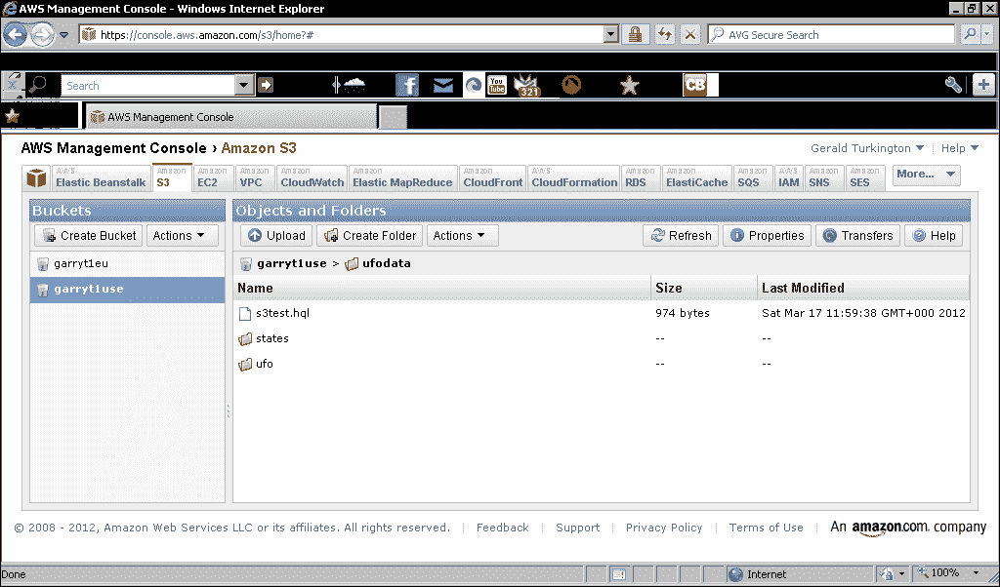
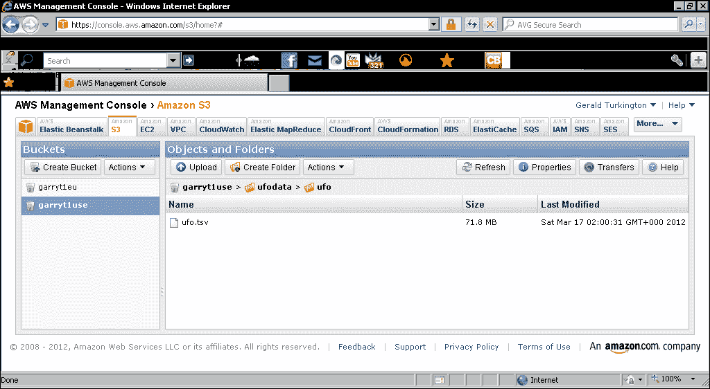
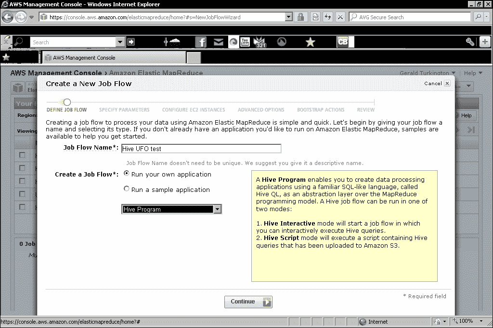
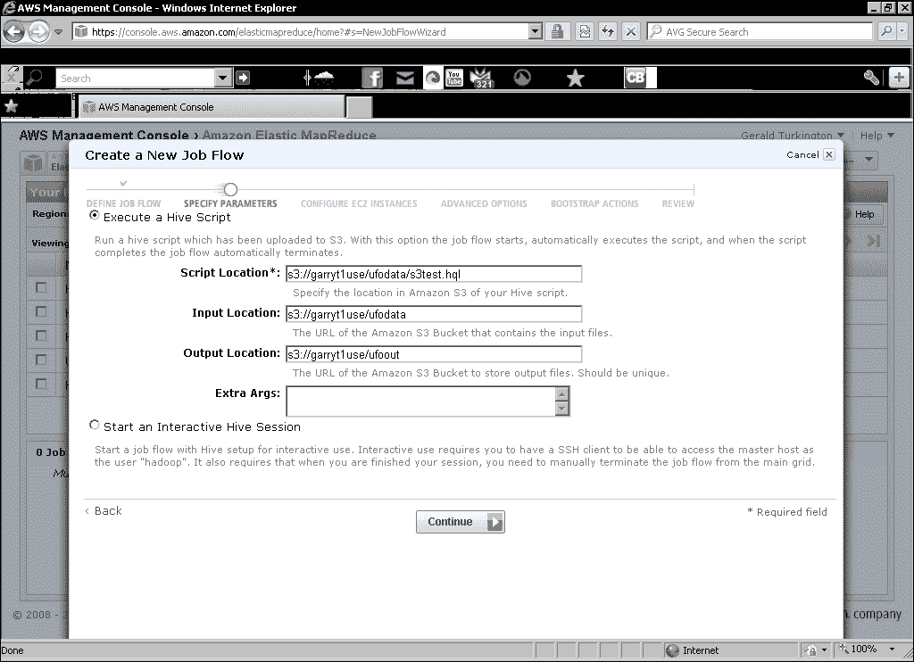
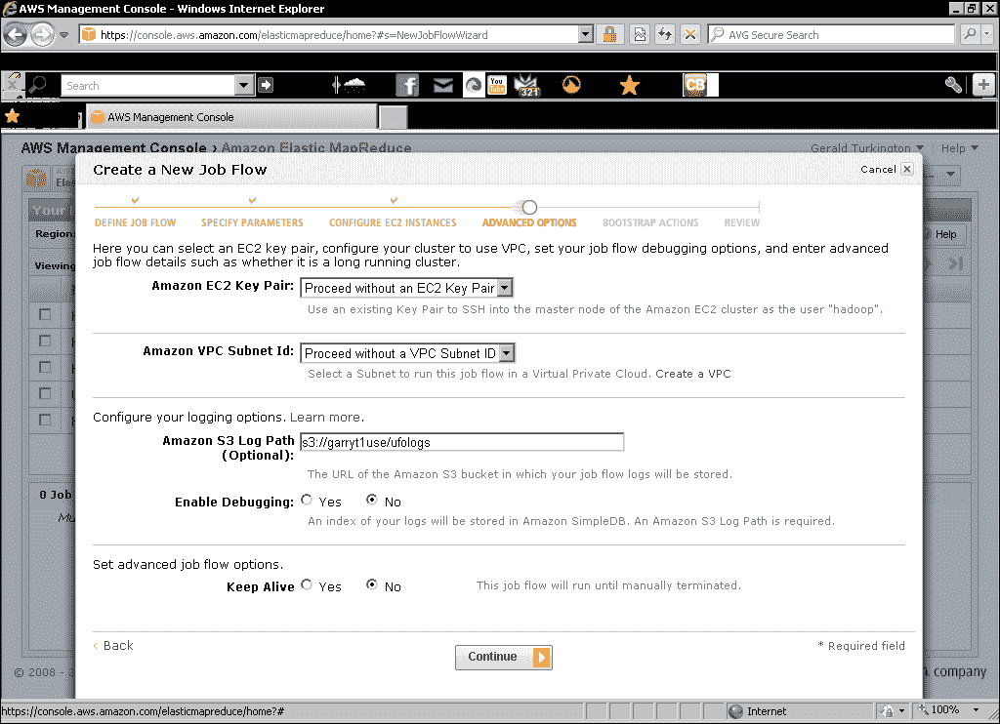

# 八、Hive 数据关系视图

*MapReduce 是一个强大的范例，它支持复杂的数据处理，可以揭示有价值的见解。 然而，在将处理分析分解为一系列映射和减少步骤的模型方面，它确实需要不同的思维方式以及一些培训和经验。 有几个构建在 Hadoop 之上的产品可以为 HDFS 中保存的数据提供更高级别或更熟悉的视图。 本章将介绍其中最流行的工具之一**配置单元**。*

在本章中，我们将介绍：

*   Hive 是什么？您可能想要使用它的原因
*   如何安装和配置配置单元
*   使用配置单元对 UFO 数据集进行类 SQL 分析
*   配置单元如何近似关系数据库的常见功能，如联接和视图
*   如何在非常大的数据集上高效地使用配置单元
*   配置单元如何允许将用户定义的函数合并到其查询中
*   Hive 如何补充另一个常用工具--PIG

# Hive 概述

配置单元是一个数据仓库，它使用 MapReduce 分析存储在 HDFS 上的数据。 特别是，它提供了一种名为**HiveQL**的查询语言，与常见的**结构化查询语言**(**SQL**)标准非常相似。

## 为什么使用 Hive？

在[章](04.html "Chapter 4. Developing MapReduce Programs")，*开发 MapReduce 程序*中，我们介绍了 Hadoop 流，并解释了流的一大好处是它如何在 MapReduce 作业的开发中实现更快的周转。 Hive 将这一点更进了一步。 它提供了一种基于行业标准 SQL 的查询语言，而不是提供一种更快速地开发 MAP 和 Reduce 任务的方法。 HIVE 接受这些 HiveQL 语句，并立即自动将查询转换为一个或多个 MapReduce 作业。 然后，它执行整个 MapReduce 程序并将结果返回给用户。 Hadoop 流减少了所需的代码/编译/提交周期，而配置单元则完全删除了它，只需要组合 HiveQL 语句。

这种与 Hadoop 的接口不仅加快了从数据分析中产生结果所需的时间，而且大大拓宽了可以使用 Hadoop 和 MapReduce 的用户范围。 任何熟悉 SQL 的人都可以使用配置单元，而不需要软件开发技能。

这些属性的组合是，配置单元通常用作业务和数据分析师对存储在 HDFS 上的数据执行即席查询的工具。 直接使用 MapReduce 需要在执行作业之前编写 map 和 Reduce 任务，这意味着从设想可能的查询到其执行有必要的延迟。 有了 Hive，数据分析师可以在不需要软件开发人员持续参与的情况下改进 HiveQL 查询。 当然，也有操作和实践上的限制(一个写得不好的查询无论采用哪种技术都是低效的)，但总的原则是令人信服的。

## 谢谢，Facebook！

正如我们早些时候感谢 Google、Yahoo！和 Doug Cutting 为 Hadoop 以及激发其灵感的技术所做的贡献一样，现在我们必须直接感谢 Facebook。

HIVE 是由 Facebook 数据团队开发的，在内部使用后，它被贡献给了 Apache 软件基金会，并作为开源软件免费提供。 它的主页是[http://hive.apache.org](http://hive.apache.org)。

# 设置配置单元

在本节中，我们将演练下载、安装和配置配置单元的操作。

## 必备条件

与 Hadoop 不同，没有配置单元主机、从属或节点。 HIVE 作为客户端应用运行，该应用处理 HiveQL 查询，将其转换为 MapReduce 作业，并将其提交到 Hadoop 群集。

虽然有一种适合小型作业和开发使用的模式，但通常情况是，配置单元需要一个现有的运行正常的 Hadoop 集群。

就像其他 Hadoop 客户端不需要在实际群集节点上执行一样，配置单元可以在满足以下条件的任何主机上执行：

*   主机上安装了 Hadoop(即使没有进程在运行)
*   设置了`HADOOP_HOME`环境变量并指向 Hadoop 安装位置
*   将`${HADOOP_HOME}/bin`目录添加到系统或用户路径

## 获取 Hive

您应该从[http://hive.apache.org/releases.html](http://hive.apache.org/releases.html)下载最新的稳定配置单元版本。

位于[Hadoop](http://cwiki.apache.org/confluence/display/Hive/GettingStarted)的配置单元入门指南将提供有关版本兼容性的建议，但作为一般原则，您应该期待最新稳定版本的配置单元、http://cwiki.apache.org/confluence/display/Hive/GettingStarted 和 JAVA 能够协同工作。

# 行动时间-安装 Hive

现在让我们设置 Hive，这样我们就可以开始使用它了。

1.  下载最新稳定版本的配置单元，并将其移动到您希望安装的位置：

    ```scala
    $ mv hive-0.8.1.tar.gz /usr/local

    ```

2.  解压缩包：

    ```scala
    $ tar –xzf hive-0.8.1.tar.gz

    ```

3.  将`HIVE_HOME`变量设置为安装目录：

    ```scala
    $ export HIVE_HOME=/usr/local/hive

    ```

4.  将配置单元主目录添加到 PATH 变量：

    ```scala
    $ export PATH=${HIVE_HOME}/bin:${PATH}

    ```

5.  在 HDFS 上创建配置单元所需的目录：

    ```scala
    $ hadoop fs -mkdir /tmp
    $ hadoop fs -mkdir /user/hive/warehouse

    ```

6.  使这两个目录组都可写：

    ```scala
    $ hadoop fs -chmod g+w /tmp
    $ hadoop fs -chmod g+w /user/hive/warehouse

    ```

7.  Try to start Hive:

    ```scala
    $ hive

    ```

    您将收到以下响应：

    ```scala
    Logging initialized using configuration in jar:file:/opt/hive-0.8.1/lib/hive-common-0.8.1.jar!/hive-log4j.properties
    Hive history file=/tmp/hadoop/hive_job_log_hadoop_201203031500_480385673.txt
    hive>

    ```

8.  退出配置单元交互式外壳：

    ```scala
    $ hive> quit;

    ```

## *刚刚发生了什么？*

下载最新的稳定配置单元版本后，我们将其复制到所需位置并解压缩存档文件。 这创建了一个目录`hive-<version>`。

类似地，正如我们之前定义的`HADOOP_HOME`并将安装中的`bin`目录添加到 PATH 变量，然后我们对 HIVE_HOME 及其 bin 目录执行了类似的操作。

### 备注

请记住，为了避免每次登录时都必须设置这些变量，请将它们添加到您的 Shell 登录脚本中，或者添加到您希望使用配置单元时获取的单独配置脚本中。

然后，我们在 HDFS 上创建了配置单元需要的两个目录，并更改了它们的属性，使它们可以分组写入。 默认情况下，配置单元将在`/tmp`目录中写入查询执行期间创建的临时数据，并将输出数据放在此位置。 `/user/hive/warehouse`目录是配置单元存储写入其表的数据的位置。

在所有这些设置之后，我们运行`hive`命令，成功的安装将产生类似于上面提到的输出。 运行不带参数的`hive`命令进入交互式 shell；`hive>`提示符类似于关系数据库交互工具中熟悉的`sql>`或`mysql>`提示符。

然后，我们通过键入`quit;`退出交互式 shell。 请注意尾随的分号`;`。 如前所述，HiveQL 非常类似于 SQL，并且遵循所有命令必须以分号结束的约定。 按不带分号的*Enter*将允许在后续行上继续执行命令。

# 使用配置单元

通过我们的配置单元安装，我们现在将导入和分析[第 4 章](04.html "Chapter 4. Developing MapReduce Programs")，*开发 MapReduce 程序*中介绍的 UFO 数据集。

将任何新数据导入配置单元时，通常有三个阶段的流程：

1.  创建要向其中导入数据的表的规范。
2.  将数据导入到创建的表中。
3.  对该表执行 HiveQL 查询。

对于那些有关系数据库经验的人来说，这个过程应该非常熟悉。 HIVE 提供了数据的结构化查询视图，要实现这一点，我们必须首先定义表列的规范，并将数据导入到表中，然后才能执行任何查询。

### 备注

我们假定您对 SQL 有一定的熟悉程度，并且将更多地关注如何使用配置单元完成工作，而不是详细解释特定的 SQL 构造。 SQL 参考对于那些对该语言不太熟悉的人来说可能很方便，但我们将确保您知道每条语句的作用，即使细节需要更深入的 SQL 知识。

# 操作时间-为 UFO 数据创建表

执行下面的步骤，为 UFO 数据创建表：

1.  启动配置单元交互式外壳：

    ```scala
    $ hive

    ```

2.  Create a table for the UFO data set, splitting the statement across multiple lines for easy readability:

    ```scala
    hive> CREATE TABLE ufodata(sighted STRING, reported STRING, sighting_location STRING,    > shape STRING, duration STRING, 
    description STRING COMMENT 'Free text description') 
    COMMENT 'The UFO data set.' ;

    ```

    完成后，您应该看到以下几行：

    ```scala
    OK
    Time taken: 0.238 seconds

    ```

3.  List all existing tables:

    ```scala
    hive> show tables;

    ```

    您将收到以下输出：

    ```scala
    OK
    ufodata
    Time taken: 0.156 seconds

    ```

4.  Show tables matching a regular expression:

    ```scala
    hive> show tables '.*data';

    ```

    您将收到以下输出：

    ```scala
    OK
    ufodata
    Time taken: 0.065 seconds

    ```

5.  Validate the table specification:

    ```scala
    hive> describe ufodata;

    ```

    您将收到以下输出：

    ```scala
    OK
    sighted  string 
    reported  string 
    sighting_location  string 
    shape  string 
    duration  string 
    description  string  Free text description
    Time taken: 0.086 seconds

    ```

6.  Display a more detailed description of the table:

    ```scala
    hive> describe extended ufodata;

    ```

    您将收到以下输出：

    ```scala
    OK
    sighted  string 
    reported  string 
    …
    Detailed Table Information  Table(tableName:ufodata, dbName:default, owner:hadoop, createTime:1330818664, lastAccessTime:0, retention:0, 
    …
    …location:hdfs://head:9000/user/hive/warehouse/ufodata, inputFormat:org.apache.hadoop.mapred.TextInputFormat, outputFormat:org.apache.hadoop.hive.ql.io.HiveIgnoreKeyTextOutputFormat, compressed:false, numBuckets:-1, 

    ```

## *刚刚发生了什么？*

启动交互式配置单元解释器后，我们使用`CREATE TABLE`命令定义 UFO 数据表的结构。 与标准 SQL 一样，这要求表中的每一列都有一个名称和数据类型。 HiveQL 还为每列和整个表提供了可选的注释，如前面所示，我们在其中添加了一列和一张表注释。

对于 UFO 数据，我们使用`STRING`作为数据类型；HiveQL 和 SQL 一样，支持多种数据类型：

*   **布尔类型**：`BOOLEAN`
*   **整数类型**：`TINYINT`、`INT`、`BIGINT`
*   **浮点类型**：`FLOAT`，`DOUBLE`
*   **文本类型**：`STRING`

在创建表之后，我们使用`SHOW TABLES`语句来验证表是否已创建。 此命令列出所有表格，在本例中，我们的新 UFO 表格是系统中唯一的表格。

然后，我们在`SHOW TABLES`上使用一个变量，该变量接受一个可选的 Java 正则表达式来匹配表名。 在这种情况下，输出与前面的命令相同，但在包含大量表的系统中-尤其是当您不知道确切名称时-这个变体可能非常有用。

### 备注

我们已经看到该表存在，但是我们还没有验证它是否正确创建。 接下来，我们使用`DESCRIBE TABLE`命令来显示命名表的规范。 我们看到所有内容都是指定的(尽管注意，此命令没有显示表注释)，然后使用`DESCRIBE TABLE EXTENDED`变体获取有关表的更多信息。

虽然有几个有趣的地方，但我们省略了大部分最终输出。 注意：输入格式指定为`TextInputFormat`；默认情况下，配置单元将假定插入到表中的任何 HDFS 文件都存储为文本文件。

我们还看到，表数据将存储在前面创建的`/user/hive/warehouse`HDFS 目录下的一个目录中。

### 提示

**关于区分大小写的说明：**

与 SQL 一样，HiveQL 在关键字、列或表名方面不区分大小写。 按照惯例，SQL 语句使用大写作为 SQL 语言关键字，当在文件中使用 HiveQL 时，我们通常会遵循这一点，如下所示。 然而，在输入交互式命令时，我们会经常选择阻力最小的行，并使用小写。

# 动作时间-插入 UFO 数据

现在我们已经创建了一个表，让我们将 UFO 数据加载到其中。

1.  将 UFO 数据文件复制到 HDFS：

    ```scala
    $ hadoop fs -put ufo.tsv /tmp/ufo.tsv

    ```

2.  Confirm that the file was copied:

    ```scala
    $ hadoop fs -ls /tmp

    ```

    您将收到以下响应：

    ```scala
    Found 2 items
    drwxrwxr-x   - hadoop supergroup          0 … 14:52 /tmp/hive-hadoop
    -rw-r--r--   3 hadoop supergroup   75342464 2012-03-03 16:01 /tmp/ufo.tsv

    ```

3.  进入 Hive 互动外壳：

    ```scala
    $ hive

    ```

4.  Load the data from the previously copied file into the `ufodata` table:

    ```scala
    hive> LOAD DATA INPATH '/tmp/ufo.tsv' OVERWRITE INTO TABLE ufodata;

    ```

    您将收到以下响应：

    ```scala
    Loading data to table default.ufodata
    Deleted hdfs://head:9000/user/hive/warehouse/ufodata
    OK
    Time taken: 5.494 seconds

    ```

5.  退出配置单元外壳：

    ```scala
    hive> quit;

    ```

6.  Check the location from which we copied the data file:

    ```scala
    $ hadoop fs -ls /tmp

    ```

    您将收到以下响应：

    ```scala
    Found 1 items
    drwxrwxr-x   - hadoop supergroup          0 … 16:10 /tmp/hive-hadoop

    ```

## *刚刚发生了什么？*

我们首先将之前在[第 4 章](04.html "Chapter 4. Developing MapReduce Programs")，*开发 MapReduce 程序*中使用的 UFO 目击事件的制表符分隔文件复制到 HDFS 上。 在 HDFS 上验证了该文件是否存在之后，我们启动了配置单元交互式 shell，并使用`LOAD DATA`命令将该文件加载到`ufodata`表中。

因为我们使用的是 HDFS 上已有的文件，所以路径仅由`INPATH`指定。 我们可以使用`LOCAL INPATH`直接从本地文件系统上的文件加载(不需要以前的显式 HDFS 副本)。

我们指定了`OVERWRITE`语句，该语句将在加载新数据之前删除表中的所有现有数据。 这显然应该小心使用，从命令的输出可以看出，使用`OVERWRITE`删除了保存表数据的目录。

注意：该命令的执行时间仅为 5 秒多一点，比将 UFO 数据文件复制到 HDFS 所需的时间要长得多。

### 备注

虽然我们在本例中指定了一个显式文件，但通过将目录指定为`INPATH`位置，可以使用一条语句加载多个文件；在这种情况下，目录中的所有文件都将加载到表中。

退出配置单元外壳后，我们再次查看将数据文件复制到的目录，发现它已经不在那里了。 如果`LOAD`语句被赋予 HDFS 上数据的路径，它不会简单地将其复制到`/user/hive/datawarehouse`中，而是会将其移动到那里。 如果要分析其他应用使用的 HDFS 上的数据，请创建副本或使用稍后介绍的`EXTERNAL`机制。

## 验证数据

现在我们已经将数据加载到表中，最好执行一些快速验证查询，以确认一切都符合预期。 有时，我们的初始表定义被证明是不正确的。

# 执行操作的时间-验证表

执行某些初始验证的最简单方法是执行一些摘要查询来验证导入。 这类似于我们在[第 4 章](04.html "Chapter 4. Developing MapReduce Programs")，*开发 MapReduce 程序*中使用 Hadoop 流的活动类型。

1.  Instead of using the Hive shell, pass the following HiveQL to the `hive` command-line tool to count the number of entries in the table:

    ```scala
    $ hive -e "select count(*) from ufodata;"

    ```

    您将收到以下响应：

    ```scala
    Total MapReduce jobs = 1
    Launching Job 1 out of 1
    …
    Hadoop job information for Stage-1: number of mappers: 1; number of reducers: 1
    2012-03-03 16:15:15,510 Stage-1 map = 0%,  reduce = 0%
    2012-03-03 16:15:21,552 Stage-1 map = 100%,  reduce = 0%
    2012-03-03 16:15:30,622 Stage-1 map = 100%,  reduce = 100%
    Ended Job = job_201202281524_0006
    MapReduce Jobs Launched: 
    Job 0: Map: 1  Reduce: 1   HDFS Read: 75416209 HDFS Write: 6 SUCESS
    Total MapReduce CPU Time Spent: 0 msec
    OK
    61393
    Time taken: 28.218 seconds

    ```

2.  Display a sample of five values for the sighted column:

    ```scala
    $ hive -e  "select sighted from ufodata limit 5;"

    ```

    您将收到以下响应：

    ```scala
    Total MapReduce jobs = 1
    Launching Job 1 out of 1
    …
    OK
    19951009  19951009   Iowa City, IA      Man repts. witnessing &quot;flash, followed by a classic UFO, w/ a tailfin at back.&quot; Red color on top half of tailfin. Became triangular.
    19951010  19951011   Milwaukee, WI    2 min.  Man  on Hwy 43 SW of Milwaukee sees large, bright blue light streak by his car, descend, turn, cross road ahead, strobe. Bizarre!
    19950101  19950103   Shelton, WA      Telephoned Report:CA woman visiting daughter witness discs and triangular ships over Squaxin Island in Puget Sound. Dramatic.  Written report, with illustrations, submitted to NUFORC.
    19950510  19950510   Columbia, MO    2 min.  Man repts. son&apos;s bizarre sighting of small humanoid creature in back yard.  Reptd. in Acteon Journal, St. Louis UFO newsletter.
    19950611  19950614   Seattle, WA      Anonymous caller repts. sighting 4 ufo&apos;s in NNE sky, 45 deg. above horizon.  (No other facts reptd.  No return tel. #.)
    Time taken: 11.693 seconds

    ```

## *刚刚发生了什么？*

在本例中，我们使用`hive -e`命令将 HiveQL 直接传递给配置单元工具，而不是使用交互式 shell。 交互式外壳在执行一系列配置单元操作时非常有用。 对于简单的语句，使用此方法并将查询字符串直接传递给命令行工具通常更为方便。 这也表明可以像任何其他 Unix 工具一样从脚本中调用配置单元。

### 备注

使用`hive –e`时，HiveQL 字符串没有必要以分号结尾，但如果您和我一样，这个习惯很难改掉。 如果要在单个字符串中包含多个命令，显然必须用分号分隔。

第一个查询的结果是 61393 条，与我们以前使用直接 MapReduce 分析 UFO 数据集时看到的记录数量相同。 这告诉我们整个数据集确实加载到了表中。

然后，我们执行第二个查询来选择表中第一列的五个值，该查询应该返回一个包含五个日期的列表。 但是，输出反而包括已加载到第一列中的整个记录。

问题是，尽管我们依赖于配置单元将数据文件加载为文本文件，但我们没有考虑列之间的分隔符。 我们的文件是制表符分隔的，但是默认情况下，配置单元希望它的输入文件具有由 ASCII 代码 00(CONTROL-A)分隔的字段。

# 执行操作的时间-使用正确的列分隔符重新定义表格

让我们按如下方式修改我们的表规范：

1.  将以下文件创建为`commands.hql`：

    ```scala
    DROP TABLE ufodata ;
    CREATE TABLE ufodata(sighted string, reported string, sighting_location string,
    shape string, duration string, description string)
    ROW FORMAT DELIMITED
    FIELDS TERMINATED BY '\t' ;
    LOAD DATA INPATH '/tmp/ufo.tsv' OVERWRITE INTO TABLE ufodata ;
    ```

2.  将数据文件复制到 HDFS：

    ```scala
    $ hadoop fs -put ufo.tsv /tmp/ufo.tsv

    ```

3.  Execute the HiveQL script:

    ```scala
    $ hive -f commands.hql 

    ```

    您将收到以下响应：

    ```scala
    OK
    Time taken: 5.821 seconds
    OK
    Time taken: 0.248 seconds
    Loading data to table default.ufodata
    Deleted hdfs://head:9000/user/hive/warehouse/ufodata
    OK
    Time taken: 0.285 seconds

    ```

4.  Validate the number of rows in the table:

    ```scala
    $ hive -e "select count(*) from ufodata;"

    ```

    您将收到以下响应：

    ```scala
    OK
    61393
    Time taken: 28.077 seconds

    ```

5.  Validate the contents of the reported column:

    ```scala
    $ hive -e "select reported from ufodata limit 5"

    ```

    您将收到以下响应：

    ```scala
    OK
    19951009
    19951011
    19950103
    19950510
    19950614
    Time taken: 14.852 seconds

    ```

## *刚刚发生了什么？*

在本例中，我们介绍了第三种调用 HiveQL 命令的方法。 除了使用交互式外壳或将查询字符串传递给配置单元工具之外，我们还可以让配置单元读取并执行包含一系列 HiveQL 语句的文件的内容。

我们首先创建了这样一个文件，该文件删除旧的表，创建一个新的表，然后将数据文件加载到其中。

与表规范的主要区别是`ROW FORMAT`和`FIELDS TERMINATED BY`语句。 我们需要这两个命令，因为第一个命令告诉配置单元该行包含多个分隔字段，而第二个命令指定实际的分隔符。 从这里可以看到，我们既可以使用显式的 ASCII 码，也可以使用通用的标记，比如`\t`for tab。

### 备注

请小心使用分隔符规格，因为它必须精确且区分大小写。 不要像我最近那样，因为不小心写了`\T`而不是`\t`而浪费了几个小时。

在运行脚本之前，我们再次将数据文件复制到 HDFS 上-前一个副本被`DELETE`语句删除-然后使用`hive -f`执行 HiveQL 文件。

与前面一样，我们然后执行两个简单的`SELECT`语句，首先计算表中的行数，然后从指定的列中提取少量行的特定值。

正如预期的那样，总行计数与以前相同，但是第二条语句现在生成看起来正确的数据，显示行现在被正确地拆分成它们的组成字段。

## Hive 表--是真的还是假的？

如果仔细观察前面示例中各种命令所花费的时间，您会发现一种乍一看可能很奇怪的模式。 将数据加载到表中所需的时间与创建表规范的时间差不多，但即使是简单地计算所有 ROW 语句的时间也要长得多。 输出还显示，表创建和数据加载实际上并不会导致执行 MapReduce 作业，这就解释了执行时间非常短的原因。

将数据加载到配置单元表中时，该过程可能与传统关系数据库的预期过程不同。 尽管配置单元将数据文件复制到其工作目录中，但它实际上并不会在此时将输入数据处理成行。 相反，它所做的是围绕数据创建元数据，然后由后续 HiveQL 查询使用。

因此，`CREATE TABLE`和`LOAD DATA`语句本身并不真正创建具体的表数据，而是生成在配置单元生成 MapReduce 作业以访问表中概念性存储的数据时将使用的元数据。

# 执行操作的时间-从现有文件创建表

到目前为止，我们已经将数据直接从配置单元有效控制的文件加载到配置单元中。 但是，也可以创建表格来模拟配置单元外部文件中保存的数据。 当我们希望能够对外部应用写入和管理的数据或需要保存在配置单元仓库目录之外的目录中的数据执行配置单元处理时，这会很有用。 这样的文件不会移动到配置单元仓库目录，也不会在删除表时删除。

1.  将以下内容保存到名为`states.hql`的文件中：

    ```scala
    CREATE EXTERNAL TABLE states(abbreviation string, full_name string)
    ROW FORMAT DELIMITED
    FIELDS TERMINATED BY '\t'
    LOCATION '/tmp/states' ;
    ```

2.  Copy the data file onto HDFS and confirm its presence afterwards:

    ```scala
    $ hadoop fs -put states.txt /tmp/states/states.txt
    $ hadoop fs -ls /tmp/states

    ```

    您将收到以下响应：

    ```scala
    Found 1 items
    -rw-r--r--   3 hadoop supergroup        654 2012-03-03 16:54 /tmp/states/states.txt

    ```

3.  Execute the HiveQL script:

    ```scala
    $ hive -f states.hql

    ```

    您将收到以下响应：

    ```scala
    Logging initialized using configuration in jar:file:/opt/hive-0.8.1/lib/hive-common-0.8.1.jar!/hive-log4j.properties
    Hive history file=/tmp/hadoop/hive_job_log_hadoop_201203031655_1132553792.txt
    OK
    Time taken: 3.954 seconds
    OK
    Time taken: 0.594 seconds

    ```

4.  Check the source data file:

    ```scala
    $ hadoop fs -ls /tmp/states

    ```

    您将收到以下响应：

    ```scala
    Found 1 items
    -rw-r--r--   3 hadoop supergroup        654 … /tmp/states/states.txt

    ```

5.  Execute a sample query against the table:

    ```scala
    $ hive -e "select full_name from states where abbreviation like 'CA'"

    ```

    您将收到以下响应：

    ```scala
    Logging initialized using configuration in jar:file:/opt/hive-0.8.1/lib/hive-common-0.8.1.jar!/hive-log4j.properties
    Hive history file=/tmp/hadoop/hive_job_log_hadoop_201203031655_410945775.txt
    Total MapReduce jobs = 1
    ...
    OK
    California
    Time taken: 15.75 seconds

    ```

## *刚刚发生了什么？*

用于创建外部表的 HiveQL 语句与我们之前使用的`CREATE TABLE`的形式仅略有不同。 关键字`EXTERNAL`指定表存在于配置单元不控制的资源中，`LOCATION`子句指定要在何处找到源文件或目录。

创建 HiveQL 脚本后，我们将源文件复制到 HDFS。 对于该表，我们使用了[章](04.html "Chapter 4. Developing MapReduce Programs")，*开发 MapReduce 程序*中的数据文件，该文件将美国各州映射到它们常见的两个字母的缩写。

在确认文件位于 HDFS 上的预期位置后，我们执行查询以创建表，并再次检查源文件。 与以前将源文件移动到`/user/hive/warehouse`目录的表创建不同，`states.txt`文件仍然位于它被复制到的 HDFS 位置。

最后，我们对该表执行查询，以确认它已填充源数据，预期结果证实了这一点。 这突出了这种形式的`CREATE TABLE`的另一个不同之处；对于前面的非外部表，表创建语句不会将任何数据摄取到表中，后续的`LOAD DATA`或(稍后我们将看到)`INSERT`语句执行实际的表填充。 使用包含`LOCATION`规范的表定义，我们可以在单个语句中创建表和获取数据。

我们现在在 Hive 中有两个表；较大的表包含 UFO 目击数据，较小的表将美国各州的缩写映射到它们的全名。 使用第二个表中的数据来丰富前一个表中的 Location 列不是一个有用的组合吗？

# 操作时间-执行联接

联接是 SQL 中非常常用的一种工具，尽管对于新手来说有时看起来有点吓人。 本质上，**JOIN**允许基于条件语句将多个表中的行逻辑组合在一起。 HIVE 对联接有丰富的支持，我们现在将研究这一点。

1.  将以下内容创建为`join.hql`：

    ```scala
    SELECT t1.sighted, t2.full_name
    FROM ufodata t1 JOIN states t2
    ON (LOWER(t2.abbreviation) = LOWER(SUBSTR( t1.sighting_location, (LENGTH(t1.sighting_location)-1)))) 
    LIMIT 5 ;
    ```

2.  Execute the query:

    ```scala
    $ hive -f join.hql

    ```

    您将收到以下响应：

    ```scala
    OK
    20060930  Alaska
    20051018  Alaska
    20050707  Alaska
    20100112  Alaska
    20100625  Alaska
    Time taken: 33.255 seconds

    ```

## *刚刚发生了什么？*

实际的`join`查询相对简单；我们希望提取一系列记录的目击日期和位置，但我们希望将其映射到州全名，而不是原始位置字段。 我们创建的 HiveQL 文件执行这样的查询。 联接本身由标准的`JOIN`关键字指定，匹配条件包含在`ON`子句中。

配置单元的限制使情况变得复杂，因为它只支持等联接，即 ON 子句包含相等检查的连接。 不可能使用`>`、`?`、`<`等运算符或我们更愿意在这里使用的`LIKE`关键字来指定联接条件。

相反，因此，我们有机会引入几个配置单元的内置函数，特别是那些将字符串转换为小写(`LOWER`)、从字符串中提取子字符串(`SUBSTR`)以及返回字符串中的字符数(`LENGTH`)的函数。

我们知道，大多数位置条目的格式为“City，State_abbreitation(城市，州 _ 缩写)”。 因此，我们使用`SUBSTR`提取字符串中倒数第三个和第二个字符，使用`length`计算索引。 我们通过`LOWER`将州缩写和提取的字符串都转换为小写，因为我们不能假设视觉表中的所有条目都将正确地使用统一的大写。

执行该脚本后，我们将获得预期的输出样本行，其中确实包括目击日期和州全名，而不是缩写。

请注意，使用了`LIMIT`子句，该子句仅限制查询将返回多少输出行。 这也表明 HiveQL 与 SQL 方言最相似，比如 MySQL 等开源数据库中的方言。

此示例显示了内部联接；配置单元还支持左和右外联接以及左半联接。 在配置单元中使用联接有许多微妙之处(例如前面提到的等值联接限制)，如果您可能要使用联接，尤其是在使用非常大的表时，您真的应该通读一下配置单元主页上的文档。

### 备注

这不仅仅是对配置单元的批评；联接是非常强大的工具，但可以公平地说，编写糟糕的联接或在忽视关键约束的情况下创建的联接比任何其他类型的 SQL 查询都导致更多的关系数据库陷入停滞。

## 有一个围棋英雄-改进连接以使用正则表达式

除了我们之前使用的字符串函数，配置单元还具有`RLIKE`和`REGEXP_EXTRACT`等函数，这些函数直接支持类似 Java 的正则表达式操作。 使用正则表达式重写前面的联接规范，以创建更准确、更优雅的联接语句。

## 配置单元和 SQL 视图

配置单元支持的另一个强大的 SQL 特性是视图。 当逻辑表的内容由`SELECT`语句指定，并且随后可以针对底层数据的这个动态视图(因此而得名)执行后续查询时，这些方法非常有用。

# 使用视图执行操作的时间

我们可以使用视图来隐藏底层查询复杂性，例如前面的连接示例。 现在让我们创建一个视图来实现这一点。

1.  将以下内容创建为`view.hql`：

    ```scala
    CREATE VIEW IF NOT EXISTS usa_sightings (sighted, reported, shape, state)
    AS select t1.sighted, t1.reported, t1.shape, t2.full_name
    FROM ufodata t1 JOIN states t2
    ON (LOWER(t2.abbreviation) = LOWER(substr( t1.sighting_location, (LENGTH(t1.sighting_location)-1)))) ;
    ```

2.  Execute the script:

    ```scala
    $ hive -f view.hql

    ```

    您将收到以下响应：

    ```scala
    Logging initialized using configuration in jar:file:/opt/hive-0.8.1/lib/hive-common-0.8.1.jar!/hive-log4j.properties
    Hive history file=/tmp/hadoop/hive_job_log_hadoop_201203040557_1017700649.txt
    OK
    Time taken: 5.135 seconds

    ```

3.  Execute the script again:

    ```scala
    $ hive -f view.hql

    ```

    您将收到以下响应：

    ```scala
    Logging initialized using configuration in jar:file:/opt/hive-0.8.1/lib/hive-common-0.8.1.jar!/hive-log4j.properties
    Hive history file=/tmp/hadoop/hive_job_log_hadoop_201203040557_851275946.txt
    OK
    Time taken: 4.828 seconds

    ```

4.  Execute a test query against the view:

    ```scala
    $ hive -e "select count(state) from usa_sightings where state = 'California'"

    ```

    您将收到以下响应：

    ```scala
    Logging initialized using configuration in jar:file:/opt/hive-0.8.1/lib/hive-common-0.8.1.jar!/hive-log4j.properties
    Hive history file=/tmp/hadoop/hive_job_log_hadoop_201203040558_1729315866.txt
    Total MapReduce jobs = 2
    Launching Job 1 out of 2
    …
    2012-03-04 05:58:12,991 Stage-1 map = 0%,  reduce = 0%
    2012-03-04 05:58:16,021 Stage-1 map = 50%,  reduce = 0%
    2012-03-04 05:58:18,046 Stage-1 map = 100%,  reduce = 0%
    2012-03-04 05:58:24,092 Stage-1 map = 100%,  reduce = 100%
    Ended Job = job_201203040432_0027
    Launching Job 2 out of 2
    …
    2012-03-04 05:58:33,650 Stage-2 map = 0%,  reduce = 0%
    2012-03-04 05:58:36,673 Stage-2 map = 100%,  reduce = 0%
    2012-03-04 05:58:45,730 Stage-2 map = 100%,  reduce = 100%
    Ended Job = job_201203040432_0028
    MapReduce Jobs Launched: 
    Job 0: Map: 2  Reduce: 1   HDFS Read: 75416863 HDFS Write: 116 SUCESS
    Job 1: Map: 1  Reduce: 1   HDFS Read: 304 HDFS Write: 5 SUCESS
    Total MapReduce CPU Time Spent: 0 msec.
    OK
    7599
    Time taken: 47.03 seconds

    ```

5.  Delete the view:

    ```scala
    $ hive -e "drop view usa_sightings"

    ```

    您将在屏幕上收到以下输出：

    ```scala
    OK
    Time taken: 5.298 seconds

    ```

## *刚刚发生了什么？*

我们首先使用`CREATE VIEW`语句创建视图。 这类似于`CREATE TABLE`，但有两个主要区别：

*   列定义仅包括名称作为类型，该类型将由基础查询确定
*   `AS`子句指定将用于生成视图的`SELECT`语句

我们使用前面的 JOIN 语句来生成视图，因此实际上我们正在创建一个将 Location 字段标准化为完整状态名称的表，而不直接要求用户处理如何执行规范化。

可选的`IF NOT EXISTS`子句(也可以与`CREATE TABLE`一起使用)意味着配置单元将忽略创建视图的重复尝试。 如果没有这个子句，重复尝试创建视图将生成错误，这并不总是所需的行为。

然后，我们执行该脚本两次，以创建视图并演示包含`IF NOT EXISTS`子句可以防止我们想要的错误。

创建视图后，我们随后对其执行查询(在本例中)，以简单地计算有多少目击事件发生在加利福尼亚州。 我们之前所有生成 MapReduce 作业的配置单元语句都只生成了一个；针对我们的视图的这个查询需要两个链接的 MapReduce 作业。 查看查询和视图规范，这并不令人惊讶；不难想象第一个 MapReduce 作业及其输出将如何实现视图，并将其输出提供给作为第二个作业执行的后续计数查询。 因此，您还会看到这个分两个阶段的作业比我们之前的任何查询花费的时间都要长得多。

Hive 实际上比这更聪明。 如果外部查询可以合并到视图创建中，那么配置单元将只生成并执行一个 MapReduce 作业。 考虑到手工开发一系列合作的 MapReduce 作业所花费的时间，这是一个很好的例子，说明了 Hive 可以提供的好处。 尽管手写的 MapReduce 作业(或一系列作业)可能效率更高，但配置单元是一个很好的工具，可以首先确定哪些作业是有用的。 与其花一天时间开发 MapReduce 作业来得出相同的结论，不如运行一个较慢的配置单元查询来确定一个想法没有期望的那么有用。

我们已经提到，视图可以隐藏底层的复杂性；这通常意味着执行视图本质上很慢。 对于大规模生产工作负载，您需要优化 SQL，并可能完全删除视图。

在运行查询之后，我们通过`DROP VIEW`语句删除视图，这再次证明了 HiveQL(和 SQL)处理表和视图的相似性。

## 在配置单元中处理脏数据

您中的观察者可能会注意到，此查询报告的加利福尼亚目击事件数量与我们在[第 4 章](04.html "Chapter 4. Developing MapReduce Programs")，*开发 MapReduce 程序*中生成的数量不同。 为什么？

回想一下，在[第 4 章](04.html "Chapter 4. Developing MapReduce Programs")，*开发 MapReduce 程序*中运行 Hadoop Streaming 或 Java MapReduce 作业之前，我们有一种机制可以忽略格式错误的输入行。 然后，在处理数据时，我们使用更精确的正则表达式从 Location 字段中提取两个字母的州缩写。 然而，在 Hive 中，我们没有做这样的预处理，而是依靠相当粗糙的机制来提取缩写。

对于后者，我们可以使用前面提到的一些支持正则表达式的配置单元函数，但对于前者，我们最多只能在许多查询中添加复杂的 VALIDATION`WHERE`子句。

一种常见的模式是在将数据导入配置单元之前对其进行预处理，因此，例如，在本例中，我们可以运行一个 MapReduce 作业来删除输入文件中的所有格式错误的记录，而另一个作业则提前执行位置字段的规范化。

## 来个围棋英雄--来吧！

编写 MapReduce 作业(可能是一个或两个)来对输入数据进行预处理，并生成更适合直接导入到配置单元的清理文件。 然后编写执行作业的脚本，创建配置单元表，并将新文件导入到表中。 这也将展示 Hadoop 和 Have 在一起是多么容易和强大的脚本化。

# 操作导出查询输出的时间

我们之前已经将大量数据加载到配置单元中，或者提取非常少量的数据作为查询结果。 我们还可以导出大型结果集；让我们看一个示例。

1.  重新创建以前使用的视图：

    ```scala
    $ hive -f view.hql

    ```

2.  将以下文件创建为`export.hql`：

    ```scala
    INSERT OVERWRITE DIRECTORY '/tmp/out'
    SELECT reported, shape, state
    FROM usa_sightings
    WHERE state = 'California' ;
    ```

3.  Execute the script:

    ```scala
    $ hive -f export.hql

    ```

    您将收到以下响应：

    ```scala
    2012-03-04 06:20:44,571 Stage-1 map = 100%,  reduce = 100%
    Ended Job = job_201203040432_0029
    Moving data to: /tmp/out
    7599 Rows loaded to /tmp/out
    MapReduce Jobs Launched: 
    Job 0: Map: 2  Reduce: 1   HDFS Read: 75416863 HDFS Write: 210901 SUCESS
    Total MapReduce CPU Time Spent: 0 msec
    OK
    Time taken: 46.669 seconds

    ```

4.  Look in the specified output directory:

    ```scala
    $ hadoop fs -ls /tmp/out

    ```

    您将收到以下响应：

    ```scala
    Found 1 items
    -rw-r--r--   3 hadoop supergroup     210901 … /tmp/out/000000_1

    ```

5.  Examine the output file:

    ```scala
    $ hadoop fs -cat /tmp/out/000000_1 | head

    ```

    您将在屏幕上收到以下输出：

    ```scala
    20021014_ light_California
    20050224_ other_California
    20021001_ egg_California
    20030527_ sphere_California
    20050813_ light_California
    20040701_ other_California
    20031007_ light_California

    ```

## *刚刚发生了什么？*

重用前一个视图之后，我们使用`INSERT OVERWRITE DIRECTORY`命令创建了 HiveQL 脚本。 顾名思义，这会将后续语句的结果放到指定位置。 `OVERWRITE`修饰符也是可选的，它简单地确定是否要首先删除该位置中的任何现有内容。 `INSERT`命令后跟一条`SELECT`语句，该语句生成要写入输出位置的数据。 在本例中，我们使用以前创建的视图上的查询，您会记得该查询构建在连接之上，演示了这里的查询如何可以任意复杂。

当输出数据要写入运行配置单元命令而不是 HDFS 的主机的本地文件系统时，还有一个额外的可选`LOCAL`修饰符。

当我们运行脚本时，MapReduce 的输出基本上与我们预期的一样，但增加了一行，说明已将多少行导出到指定的输出位置。

在运行脚本之后，我们检查输出目录，看看结果文件是否在那里，当我们查看它时，内容与我们预期的一样。

### 备注

正如配置单元用于输入中的文本文件的默认分隔符是 ASCII 代码 0001(‘\a’)一样，它也将其用作输出文件的默认分隔符，如上例所示。

`INSERT`命令还可以用对其他表的查询结果填充一个表，我们将研究下一个表。 首先，我们需要解释一个我们将同时使用的概念。

## 对表进行分区

我们在前面提到过，编写得不好的连接有很长一段不好的历史，会导致关系数据库花费大量时间来处理不必要的工作。 执行全表扫描(访问表中的每一行)而不是使用允许直接访问感兴趣的行的索引的查询可以讲述类似的悲惨故事。

对于存储在 HDFS 上并映射到配置单元表的数据，默认情况下几乎需要全表扫描。 由于没有办法将数据分割成更有组织的结构，允许处理只应用于感兴趣的数据子集，Hive 被迫处理整个数据集。 对于我们大约 70MB 的 UFO 文件，这真的不是问题，因为我们看到文件处理只需要几十秒。 然而，如果它大一千倍呢？

与传统关系数据库一样，配置单元允许根据虚拟列的值对表进行分区，然后将这些值用于查询谓词中。

具体地说，在创建表时，它可以有一个或多个分区列，并且在将数据加载到表中时，这些列的指定值将确定将数据写入的分区。

对于每天接收大量数据的表，最常见的分区策略是将分区列设置为日期。 然后，可以将将来的查询限制为仅处理包含在特定分区中的数据。 在幕后，配置单元将每个分区存储在它自己的目录和文件中，这样它就可以只在感兴趣的数据上应用 MapReduce 作业。 通过使用多个分区列，可以创建丰富的分层结构，并且对于具有仅需要较小数据子集的查询的大型表，花一些时间决定最佳分区策略是值得的。

对于我们的 UFO 数据集，我们将使用目击年份作为分割值，但是我们必须使用一些不太常见的特性来实现它。 所以，在介绍完之后，现在让我们来做一些分区！

# 该行动了-制作一张分区的不明飞行物目录表

我们将为 UFO 数据创建一个新表，以演示分区的有效性。

1.  将以下查询另存为`createpartition.hql`：

    ```scala
    CREATE TABLE partufo(sighted string, reported string, sighting_location string,shape string, duration string, description string) 
    PARTITIONED BY (year string)
    ROW FORMAT DELIMITED
    FIELDS TERMINATED BY '\t' ;
    ```

2.  将以下查询另存为`insertpartition.hql`：

    ```scala
    SET hive.exec.dynamic.partition=true ;
    SET hive.exec.dynamic.partition.mode=nonstrict ;

    INSERT OVERWRITE TABLE partufo partition (year)
    SELECT sighted, reported, sighting_location, shape, duration, description,
    SUBSTR(TRIM(sighted), 1,4)  FROM ufodata ;
    ```

3.  Create the partitioned table:

    ```scala
    $ hive -f createpartition.hql 

    ```

    您将收到以下响应：

    ```scala
    Logging initialized using configuration in jar:file:/opt/hive-0.8.1/lib/hive-common-0.8.1.jar!/hive-log4j.properties
    Hive history file=/tmp/hadoop/hive_job_log_hadoop_201203101838_17331656.txt
    OK
    Time taken: 4.754 seconds

    ```

4.  检查创建的表：

    ```scala
    OK
    sighted  string 
    reported  string 
    sighting_location  string 
    shape  string 
    duration  string 
    description  string 
    year  string 
    Time taken: 4.704 seconds

    ```

5.  Populate the table:

    ```scala
    $ hive -f insertpartition.hql 

    ```

    您将在屏幕上看到以下行：

    ```scala
    Total MapReduce jobs = 2
    …
    …
    Ended Job = job_201203040432_0041
    Ended Job = 994255701, job is filtered out (removed at runtime).
    Moving data to: hdfs://head:9000/tmp/hive-hadoop/hive_2012-03-10_18-38-36_380_1188564613139061024/-ext-10000
    Loading data to table default.partufo partition (year=null)
    Loading partition {year=1977}
    Loading partition {year=1880}
    Loading partition {year=1975}
    Loading partition {year=2007}
    Loading partition {year=1957}
    …
    Table default.partufo stats: [num_partitions: 100, num_files: 100, num_rows: 0, total_size: 74751215, raw_data_size: 0]
    61393 Rows loaded to partufo
    …
    OK
    Time taken: 46.285 seconds

    ```

6.  Execute a `count` command against a partition:

    ```scala
    $ hive –e "select count(*)from partufo where year  = '1989'"

    ```

    您将收到以下响应：

    ```scala
    OK
    249
    Time taken: 26.56 seconds

    ```

7.  Execute a similar query on the non-partitioned table:

    ```scala
    $ hive –e "select count(*) from ufodata where sighted like '1989%'"

    ```

    您将收到以下响应：

    ```scala
    OK
    249
    Time taken: 28.61 seconds

    ```

8.  List the contents of the Hive directory housing the partitioned table:

    ```scala
    $ Hadoop fs –ls /user/hive/warehouse/partufo

    ```

    您将收到以下响应：

    ```scala
    Found 100 items
    drwxr-xr-x   - hadoop supergroup          0 2012-03-10 18:38 /user/hive/warehouse/partufo/year=0000
    drwxr-xr-x   - hadoop supergroup          0 2012-03-10 18:38 /user/hive/warehouse/partufo/year=1400
    drwxr-xr-x   - hadoop supergroup          0 2012-03-10 18:38 /user/hive/warehouse/partufo/year=1762
    drwxr-xr-x   - hadoop supergroup          0 2012-03-10 18:38 /user/hive/warehouse/partufo/year=1790
    drwxr-xr-x   - hadoop supergroup          0 2012-03-10 18:38 /user/hive/warehouse/partufo/year=1860
    drwxr-xr-x   - hadoop supergroup          0 2012-03-10 18:38 /user/hive/warehouse/partufo/year=1864
    drwxr-xr-x   - hadoop supergroup          0 2012-03-10 18:38 /user/hive/warehouse/partufo/year=1865

    ```

## *刚刚发生了什么？*

我们为这个示例创建了两个 HiveQL 脚本。 其中第一个用于创建新的分区表。 正如我们所看到的，它看起来与前面的`CREATE TABLE`语句非常相似；不同之处在于附加的`PARTITIONED BY`子句。

在我们执行这个脚本之后，我们描述了该表，看到，从 HiveQL 的角度来看，该表看起来就像前面的`ufodata`表，但是增加了一列年份的内容。 这允许在`WHERE`子句中指定条件时将该列视为任何其他列，即使该列数据实际上并不存在于磁盘数据文件中。

接下来，我们执行第二个脚本，该脚本执行将数据实际加载到分区表中。 这里有几件值得注意的事情。

首先，我们看到`INSERT`命令可以用于表，就像我们之前对目录所做的那样。 `INSERT`语句指定数据的去向，随后的`SELECT`语句从现有的表或视图中收集所需的数据。

这里使用的分区机制利用了配置单元中一个相对较新的功能，即动态分区。 在大多数情况下，此语句中的 PARTITION 子句将包括 Year 列的显式值。 但是，尽管如果我们将一天的数据上载到每日分区中，这将会起作用，但是它不适合我们的数据文件类型，在我们的数据文件中，应该将各种行插入到各种分区中。 通过简单地指定不带值的列名，分区名将由`SELECT`语句返回的 Year 列的值自动生成。

这有望解释`SELECT`语句中奇怪的最后一个子句；在指定了`ufodata`中的所有标准列之后，我们添加了一个规范，用于提取包含视线列的前四个字符的字符串。 请记住，因为分区表将 Year 分区列视为第七列，这意味着我们将看到的字符串的 Year 组件分配给每行中的 Year 列。 因此，每一行都被插入到与其目击年份相关联的分区中。

为了证明这是按预期工作的，我们然后执行两个查询；一个计算分区表中 1989 年的分区中的所有记录，另一个计算`ufodata`中以字符串“1989”开头的记录，也就是以前用于动态创建分区的组件。

可以看到，这两个查询返回相同的结果，验证了我们的分区策略是否按预期工作。 我们还注意到分区查询比其他查询稍微快一些，尽管速度不是很快。 这很可能是因为 MapReduce 启动时间主导了我们相对较少的数据集的处理。

最后，我们查看配置单元存储分区表数据的目录，发现 100 个动态生成的分区中的每一个确实都有一个目录。 现在，每当我们表达引用特定分区的 HiveQL 语句时，配置单元都可以通过只处理在适当分区目录中找到的数据来执行显著的优化。

## 扣件、群集和排序...。 哦天啊!

我们在这里不会详细探讨它，但是分层分区列并不是配置单元如何优化数据子集内的数据访问模式的全部内容。 在分区内，配置单元提供了一种机制，可以使用指定的`CLUSTER BY`列上的散列函数将行进一步收集到个存储桶中。 在存储桶中，可以使用指定的`SORT BY`列按排序顺序保存行。 例如，我们可以根据不明飞行物的形状和根据发现日期排序的每个桶中的数据来存储数据。

这些特性不一定是您在使用配置单元的第一天就需要使用的特性，但是如果您发现自己使用的数据集越来越大，那么考虑这种类型的优化可能会大大缩短查询处理时间。

## 自定义函数

配置单元提供了机制，让您可以将自定义代码直接挂接到 HiveQL 执行中。 这可以是添加新的库函数的形式，也可以是指定**配置单元转换**的形式，其工作方式与 Hadoop 流非常相似。 我们将在本节中查看用户定义的函数，因为它们是您最有可能在早期需要添加自定义代码的地方。 配置单元转换是一种稍微复杂一些的机制，通过它可以添加由配置单元运行时调用的自定义映射和减少类。 如果你感兴趣的是变换，那么在 Hive 维基上有很好的文档记录。

# 操作时间-添加新的用户定义函数(UDF)

让我们展示如何通过新的 UDF 创建和调用一些自定义 Java 代码。

1.  将以下代码另存为`City.java`：

    ```scala
    package com.kycorsystems ;

    import java.util.regex.Matcher ;
    import java.util.regex.Pattern ;
    import org.apache.hadoop.hive.ql.exec.UDF ;
    import org.apache.hadoop.io.Text ;

    public class City extends UDF
    {
        private static Pattern pattern = Pattern.compile(
            "[a-zA-z]+?[\\. ]*[a-zA-z]+?[\\, ][^a-zA-Z]") ;

        public Text evaluate( final Text str)
        {
            Text result ;
            String location = str.toString().trim() ;
            Matcher matcher = pattern.matcher(location) ;

            if (matcher.find())
            {
                result = new Text(                 location.substring(matcher.start(), matcher.end()-2)) ;
            }
            else
            {
                result = new Text("Unknown") ;
            }        
            return result ;
        }
    }
    ```

2.  编译此文件：

    ```scala
    $ javac -cp hive/lib/hive-exec-0.8.1.jar:hadoop/hadoop-1.0.4-core.jar  -d . City.java

    ```

3.  Package the generated class file into a JAR file:

    ```scala
    $ jar cvf city.jar com

    ```

    您将收到以下响应：

    ```scala
    added manifest
    adding: com/(in = 0) (out= 0)(stored 0%)
    adding: com/kycorsystems/(in = 0) (out= 0)(stored 0%)
    adding: com/kycorsystems/City.class(in = 1101) (out= 647)(deflated 41%)

    ```

4.  启动交互式配置单元外壳：

    ```scala
    $ hive

    ```

5.  Add the new JAR file to the Hive classpath:

    ```scala
    hive> add jar city.jar;

    ```

    您将收到以下响应：

    ```scala
    Added city.jar to class path
    Added resource: city.jar

    ```

6.  Confirm that the JAR file was added:

    ```scala
    hive> list jars;

    ```

    您将收到以下响应：

    ```scala
    file:/opt/hive-0.8.1/lib/hive-builtins-0.8.1.jar
    city.jar

    ```

7.  Register the new code with a function name:

    ```scala
    hive> create temporary function city as 'com.kycorsystems.City' ;

    ```

    您将收到以下响应：

    ```scala
    OK
    Time taken: 0.277 seconds

    ```

8.  Execute a query using the new function:

    ```scala
    hive> select city(sighting_location), count(*) as total
    > from partufo
    > where year = '1999'
    > group by city(sighting_location)
    > having  total > 15 ;

    ```

    您将收到以下响应：

    ```scala
    Total MapReduce jobs = 1
    Launching Job 1 out of 1
    …
    OK
    Chicago  19
    Las Vegas  19
    Phoenix  19
    Portland  17
    San Diego  18
    Seattle  26
    Unknown  34
    Time taken: 29.055 seconds

    ```

## *刚刚发生了什么？*

我们编写的 Java 类扩展了基础`org.apache.hadoop.hive.exec.ql.UDF`(用户定义函数)类。 在这个类中，我们定义了一个方法，用于在给定位置字符串的情况下返回城市名称，该字符串遵循我们前面看到的一般模式。

UDF 实际上并不基于类型定义一系列**Evaluate**方法；相反，您可以使用任意参数和返回类型自由添加自己的方法。 HIVE 使用 Java 反射来选择正确的求值方法，如果您需要更细粒度的选择，您可以开发实现`UDFMethodResolver`接口的您自己的实用程序类。

这里使用的正则表达式有点笨拙；我们希望提取城市的名称，假设后跟一个州缩写。 但是，名称的描述方式和对多个单词名称的处理方式不一致，这就给我们带来了前面看到的正则表达式。 除此之外，这门课非常简单。

我们编译`City.java`文件，同时从配置单元和 Hadoop 添加必要的 JAR。

### 备注

当然，请记住，如果您使用的是 Hadoop 和 Have 的相同版本，则特定的 JAR 文件名可能不同。

然后，我们将生成的类文件捆绑到一个 JAR 中，并启动配置单元交互外壳。

创建 JAR 之后，我们需要配置配置单元以使用它。 这是一个分两步走的过程。 首先，我们使用`add jar`命令将新的 JAR 文件添加到配置单元使用的类路径中。 这样做之后，我们使用`list jars`命令确认我们的新 JAR 已经在系统中注册。

添加 JAR 只是告诉配置单元存在一些代码，并没有说明我们希望如何在 HiveQL 语句中引用该函数。 `CREATE FUNCTION`命令实现了这一点-将一个函数名(在本例中为`city`)与提供实现的完全限定的 Java 类(在本例中为`com.kycorsystems.City`)关联起来。

将 JAR 文件添加到类路径并创建函数后，我们现在可以在 HiveQL 语句中引用`city()`函数。

接下来，我们运行了一个示例查询，演示了新函数的运行情况。 回到分区的不明飞行物目击事件表，我们认为，在每个人都在为千禧年末日做准备的时候，看看 UFO 目击事件最多发生在哪里会很有趣。

从 HiveQL 语句可以看出，我们可以像使用任何其他函数一样使用我们的新函数，事实上，了解哪些函数是内置函数、哪些函数是 UDF 的唯一方法就是熟悉标准配置单元函数库。

结果显示，目击事件主要集中在美国西北部和西南部，芝加哥是唯一例外。 然而，我们确实得到了相当多的`Unknown`结果，这需要进一步的分析来确定这是由于美国以外的地方造成的，还是我们需要进一步改进我们的正则表达式。

## 预处理或不预处理...

让我们再来回顾一下前面的主题；在将数据导入到配置单元之前，可能需要将数据预处理为更干净的形式。 从前面的示例可以看出，我们可以通过一系列 UDF 动态执行类似的处理。 例如，我们可以添加名为`state`和`country`的函数，这些函数从位置观察字符串中提取或推断出进一步的地区和国家分量。 关于哪种方法是最好的，很少有具体的规则，但一些指导方针可能会有所帮助。

如果就像这里的情况一样，除了提取不同的组件之外，我们不太可能实际处理完整的位置字符串，那么预处理可能更有意义。 我们可以将其规范化为更可预测的格式，甚至将其分成单独的城市/地区/国家列，而不是在每次访问列时都执行昂贵的文本处理。

但是，如果 HiveQL 中的列通常以其原始形式使用，而额外的处理是例外情况，那么在整个数据集中执行昂贵的处理步骤可能没有什么好处。

使用对您的数据和工作负载最有意义的策略。 请记住，UDF 不仅仅用于这种类型的文本处理，它们还可以用来封装您希望应用于表中数据的任何类型的逻辑。

## Hive 对 PIG

在 Internet 上搜索有关 Hive 的文章，很快就会发现许多将 Hive 与另一个名为**Pig**的 Apache 项目进行比较的文章。 围绕这一比较的一些最常见的问题是，为什么两者都存在，什么时候使用一种比另一种更好，以及在酒吧里穿项目 T 恤时，哪种会让你看起来更酷。

这两个项目之间的重叠之处在于，hive 希望为数据提供一个熟悉的类似 SQL 的界面，而 Pig 使用一种名为**Pig 拉丁语**的语言来指定数据流管道。 就像配置单元将 HiveQL 转换成 MapReduce 然后执行一样，Pig 从 Pig 的拉丁脚本执行类似的 MapReduce 代码生成。

HiveQL 和 Pig 拉丁语之间最大的区别是对作业将如何执行表示的控制量。 与 SQL 一样，HiveQL 指定要做什么，但几乎没有说明如何实际构建实现。 HiveQL 查询规划器负责确定执行 HiveQL 命令的特定部分的顺序、评估函数的顺序，等等。 这些决策是由配置单元在运行时做出的，类似于传统的关系数据库查询规划器，这也是 Pig 拉丁语操作的级别。

这两种方法都不需要编写原始 MapReduce 代码；它们提供的抽象有所不同。

Hive 和 PIG 的选择将取决于你的需要。 如果拥有熟悉的数据 SQL 接口对于使 Hadoop 中的数据可供更广泛的受众使用很重要，那么配置单元是显而易见的选择。 相反，如果您的人员从数据管道的角度考虑问题，并且需要对作业的执行方式进行更细粒度的控制，那么 Pig 可能更合适。 Hive 和 Pig 项目正在寻求更紧密的集成，因此希望错误的竞争感将会减少，相反，这两个项目将被视为减少执行 MapReduce 作业所需的 Hadoop 知识的互补方式。

## 我们没有讲到的是

在这个配置单元概述中，我们介绍了它的安装和设置、表、视图和联接的创建和操作。 我们研究了如何将数据移入和移出 Hive，如何优化数据处理，并探索了 Hive 的几个内置函数。

在现实中，我们仅仅触及了皮毛。 除了对前面的主题和各种相关概念进行更深入的介绍外，我们甚至没有触及这样的主题，例如**MetaStore**(配置单元存储其配置和元数据)或**SerDe**(**序列化/反序列化**)对象，这些对象可用于从更复杂的文件格式(如 JSON)读取数据。

HIVE 是一个非常丰富的工具，具有许多强大而复杂的功能。 如果您认为 Hive 对您有价值，则建议您在浏览完本章中的示例后，花些时间阅读 Hive 网站上的文档。 在那里，您还可以找到指向用户邮件列表的链接，这是一个很好的信息和帮助来源。

# 亚马逊网络服务上的 Hive

Elastic MapReduce 通过一些特定机制为配置单元提供了重要支持，以帮助其与其他 AWS 服务集成。

# 电子病历动作运行 UFO 分析时间

让我们通过在该平台上进行一些 UFO 分析，来探索 EMR 与 Hive 的使用。

1.  在[http://aws.amazon.com/console](http://aws.amazon.com/console)登录到亚马逊网络服务管理控制台。
2.  电子病历上的每个配置单元作业流都从 S3 存储桶运行，我们需要选择要用于此目的的存储桶。 选择**S3**查看与您的帐户关联的存储桶列表，然后选择要从中运行示例的存储桶，在下面的示例中，我们选择了名为 garryt1use 的存储桶。
3.  Use the web interface to create three directories called `ufodata`, `ufoout`, and `ufologs` within that bucket. The resulting list of the bucket's contents should look like the following screenshot:

    

4.  双击`ufodata`目录上的将其打开，并在其中创建名为`ufo`和`states`的两个子目录。
5.  Create the following as `s3test.hql`, click on the **Upload** link within the `ufodata` directory, and follow the prompts to upload the file:

    ```scala
    CREATE EXTERNAL TABLE IF NOT EXISTS ufodata(sighted string, reported string, sighting_location string,
    shape string, duration string, description string)
    ROW FORMAT DELIMITED
    FIELDS TERMINATED BY '\t' 
    LOCATION '${INPUT}/ufo' ;

    CREATE EXTERNAL TABLE IF NOT EXISTS states(abbreviation string, full_name string)
    ROW FORMAT DELIMITED
    FIELDS TERMINATED BY '\t'
    LOCATION '${INPUT}/states' ;

    CREATE VIEW IF NOT EXISTS usa_sightings (sighted, reported, shape, state)
    AS SELECT t1.sighted, t1.reported, t1.shape, t2.full_name
    FROM ufodata t1 JOIN states t2
    ON (LOWER(t2.abbreviation) = LOWER(SUBSTR( t1.sighting_location, (LENGTH(t1.sighting_location)-1)))) ;

    CREATE EXTERNAL TABLE IF NOT EXISTS state_results ( reported string, shape string, state string)
    ROW FORMAT DELIMITED
    FFIELDS TERMINATED BY '\t' LINES TERMINATED BY '\n'
    STORED AS TEXTFILE
    LOCATION '${OUTPUT}/states' ;

    INSERT OVERWRITE TABLE state_results
    SELECT reported, shape, state
    FROM usa_sightings
    WHERE state = 'California' ;
    ```

    现在，`ufodata`的内容应如以下屏幕截图所示：

    

6.  Double-click the `states` directory to open it and into this, upload the `states.txt` file used earlier. The directory should now look like the following screenshot:

    

7.  单击文件列表顶部的`ufodata`组件以返回到此目录。
8.  Double-click on the `ufo` directory to open it and into this, upload the `ufo.tsv` file used earlier. The directory should now look like the following screenshot:

    

9.  Now select **Elastic MapReduce** and click on **Create a New Job Flow**. Then select the option **Run your own application** and select a Hive application, as shown in the following screenshot:

    

10.  Click on **Continue** and then fill in the required details for the Hive job flow. Use the following screenshot as a guide, but remember to change the bucket name (the first component in the `s3:// URLs`) to the bucket you set up before:

    

11.  Click on **Continue**, review the number and the type of hosts to be used, and then click on **Continue** once again. Then fill in the name of the directory for the logs, as shown in the following screenshot:

    

12.  单击**继续**。 然后，在剩余的作业创建过程中执行与相同的操作，本例中没有其他需要更改的默认选项。 最后，启动作业流并从管理控制台监视其进度。
13.  作业成功完成后，返回**S3**并双击`ufoout`目录。 其中应该有一个名为`states`的目录，还有一个名为`0000000`的文件。 双击以下载该文件，并验证其内容是否如下所示：

    ```scala
    20021014   light   California
    20050224   other   California
    20021001   egg     California
    20030527   sphere  California
    ```

## *刚刚发生了什么？*

在实际执行 EMR 作业流之前，我们需要在前面的示例中进行一些设置。 首先，我们使用 S3Web 界面为我们的工作准备目录结构。 我们创建了三个主要目录来保存输入数据，一个目录用于写入结果，一个目录用于 EMR 放置作业流执行的日志。

HiveQL 脚本是对本章前面使用的几个配置单元命令的修改。 它为 UFO 目击数据和州名称以及连接它们的视图创建表。 然后，它创建一个没有源数据的新表，并使用`INSERT OVERWRITE TABLE`用查询结果填充该表。

该脚本的独特之处在于我们为每个表指定`LOCATION`子句的方式。 对于输入表，我们使用相对于名为`INPUT`的变量的路径，并对结果表的`OUTPUT`变量执行同样的操作。

请注意，EMR 中的配置单元要求表数据的位置是目录，而不是文件。 这就是我们之前为上传特定源文件的每个表创建子目录的原因，而不是使用数据文件本身的直接路径指定表。

在我们的 S3 存储桶中设置了所需的文件和目录结构后，我们转到 EMR Web 控制台并开始作业流创建过程。

在指定我们希望使用我们自己的程序并且它将是一个配置单元应用之后，我们在一个屏幕上填写了我们的工作流所需的关键数据：

*   HiveQL 脚本本身的位置
*   包含输入数据的目录
*   要用于输出数据的目录

HiveQL 脚本的路径是显式路径，不需要任何解释。 但是，重要的是要了解如何将其他值映射到我们的配置单元脚本中使用的变量。

输入路径的值可以作为`INPUT`变量提供给配置单元脚本，这就是我们将包含 UFO 目击数据的目录指定为`${INPUT}/ufo`的方式。 同样，此表单中指定的输出值将用作配置单元脚本中的`OUTPUT`变量。

我们没有对默认主机设置进行任何更改，它将是一个小主机和两个小核心节点。 在下一个屏幕上，我们添加了希望 EMR 写入作业流执行生成的日志的位置。

虽然是可选的，但捕获这些日志很有用，特别是在运行新脚本的早期阶段，尽管 S3 存储显然是有成本的。 EMR 还可以将索引日志数据写入**SimpleDB**(另一项 AWS 服务)，但我们在这里没有展示这一点。

在完成作业流定义之后，我们启动它，在成功执行之后，转到 S3 界面浏览到输出位置，其中很高兴地包含了我们期望的数据。

## 使用交互式工作流进行开发

在开发要在 EMR 上执行的新配置单元脚本时，以前的批处理作业执行不太合适。 在作业流创建和执行之间通常有几分钟的延迟，如果作业失败，则会产生几个小时的 EC2 实例时间成本(部分时间四舍五入)。

我们可以在交互模式下启动配置单元作业流，而不是选择创建 EMR 作业流的选项来运行配置单元脚本(如前面的示例所示)。 这可以有效地启动 Hadoop 集群，而不需要命名脚本。 然后，您可以以 hadoop 用户的身份通过 SSH 连接到主节点，您将发现已在其中安装和配置了配置单元。 在此环境中进行脚本开发，然后根据需要设置批处理脚本作业流以在生产中自动执行脚本，效率要高得多。

## 拥有围棋英雄-使用交互式电子病历群集

在电子病历中启动交互式配置单元作业流。 您需要已向 EC2 注册 SSH 凭据，才能连接到主节点。 直接从主节点运行前面的脚本，记住要将适当的变量传递给脚本。

## 与其他 AWS 产品集成

对于本地 Hadoop/Have 安装，数据存储位置的问题通常归结为 HDFS 或本地文件系统。 正如我们之前看到的，EMR 中的配置单元提供了另一种选择，它支持数据驻留在 S3 中的外部表。

另一个具有类似支持的 aws 服务是**DynamoDB**(位于[NoSQL](http://aws.amazon.com/dynamodb))，这是一个托管在云中的 http://aws.amazon.com/dynamodb 数据库解决方案。 EMR 中的配置单元作业流可以声明从 DynamoDB 读取数据或将其用作查询输出目标的外部表。

这是一个非常强大的模型，因为它允许使用配置单元来处理和组合来自多个源的数据，而将数据从一个系统映射到配置单元表的机制是透明的。 它还允许将配置单元用作将数据从一个系统移动到另一个系统的机制。 从现有商店频繁地将数据放入此类托管服务的行为是采用的主要障碍。

# 摘要

我们已经在本章中了解了配置单元，并了解了它如何提供使用关系数据库的任何人都会熟悉的许多工具和功能。 它不需要开发 MapReduce 应用，而是将 Hadoop 的强大功能提供给更广泛的社区。

具体地说，我们下载并安装了 hive，了解到它是一个客户端应用，将其 HiveQL 语言转换为 MapReduce 代码，然后提交给 Hadoop 集群。 我们探索了配置单元用于创建表和对这些表运行查询的机制。 我们了解了配置单元如何支持各种底层数据文件格式和结构，以及如何修改这些选项。

我们还认识到，配置单元表在很大程度上是一个逻辑结构，在幕后，表上的所有类似 SQL 的操作实际上都是由 HDFS 文件上的 MapReduce 作业执行的。 然后，我们了解了配置单元如何支持强大的特性，如联接和视图，以及如何对表进行分区以帮助高效执行查询。

我们使用配置单元将查询结果输出到 HDFS 上的文件，并了解 Elastic MapReduce 如何支持配置单元，其中交互式作业流可用于开发新的配置单元应用，然后以批处理模式自动运行。

正如我们在本书中多次提到的，Hive 看起来像一个关系数据库，但实际上并不是。 然而，在许多情况下，您会发现现有的关系数据库是您需要集成到的更广泛基础设施的一部分。 执行这种集成以及如何在这些不同类型的数据源之间移动数据将是下一章的主题。