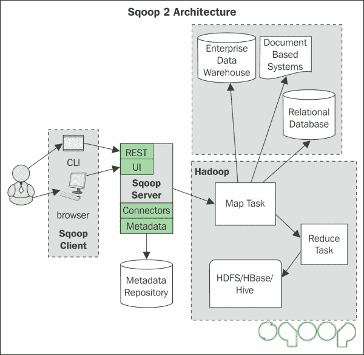
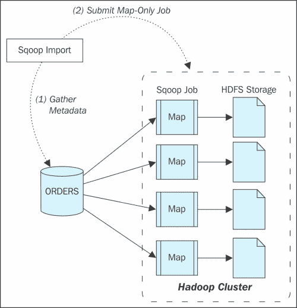
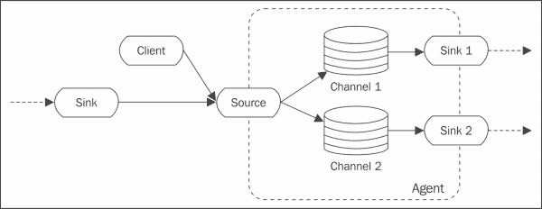
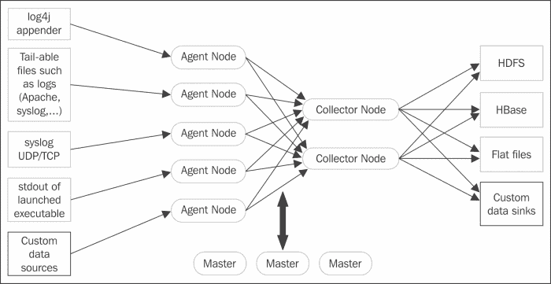

# 六、Hadoop 中的数据摄取——SQOOP 和 Flume

数据摄取至关重要，对于任何大数据项目都应予以强调，因为数据量通常以万亿字节或千兆字节为单位，可能是千兆字节。处理海量数据始终是一项挑战和关键。由于大数据系统普遍用于处理非结构化或半结构化数据，这带来了大量数据的复杂数据源。随着每个数据源的增加，系统的复杂性也随之增加。许多领域或数据类型，如社交媒体、营销、医疗保健中的基因、视频和音频系统、电信 CDR 等，都有不同的数据来源。其中许多大规模一致地产生或发送数据。关键问题是管理数据一致性以及如何利用可用资源。尤其是数据摄取，在 Hadoop 或一般大数据中是复杂的，因为数据源和处理现在是批处理、流式、实时的。这也增加了复杂性和管理。

在这一章中，我们将研究 Hadoop 中数据摄取的一些挑战，以及使用 Sqoop 和 Flume 等工具的可能解决方案。我们将详细介绍 Sqoop 和 Flume。

# 数据来源

由于处理各种数据和大量数据的能力，Hadoop 的数据源增加了，复杂性也随之大大增加。我们现在看到 Hadoop 中处理了大量的批处理、流和实时分析，如果不按照要求设计，数据摄入可能会成为瓶颈或破坏系统。

让我们来看一些数据源，它们可以连续产生大量数据或一致数据:

*   **数据传感器**:这些是上千个传感器，持续产生数据。
*   **机器数据**:为产生应近实时处理的数据，避免巨大损失。
*   **电信数据** : CDR 数据和其他电信数据产生大量数据。
*   **医疗保健系统数据**:基因、图像、ECR 记录都是非结构化且复杂的要处理。
*   **社交媒体**:脸书、推特、谷歌 Plus、YouTube 等获得了巨大的数据量。
*   **地质数据**:半导体和其他地质数据产生了巨大的数据量。
*   **地图**:地图数据量巨大，处理数据也是地图中的一个挑战。
*   **航空航天**:飞行细节和跑道管理系统实时产生大量数据和处理。
*   **天文学**:行星和其他物体产生重影，必须以更快的速度进行处理。
*   **移动数据**:移动以高速率产生许多事件和大量数据。

这些只是产生万亿字节或千兆字节数据的一些域或数据源。数据接收至关重要，它可以决定系统的成败。

# 数据摄取方面的挑战

以下是数据源摄取方面的挑战:

*   多源摄入
*   流/实时摄取
*   可量测性
*   并行处理
*   数据质量
*   机器数据可以以每分钟 GB 为单位进行大规模存储

# Sqoop

Sqoop 可以高效地处理传统数据库、Hadoop 和像 HBase、Cassandra 这样的 NoSQL 数据库之间的数据传输。Sqoop 通过提供从这些数据源导入和导出 Hadoop 中的数据的实用程序来提供帮助。Sqoop 有助于并行执行进程，因此速度更快。Sqoop 利用连接器和驱动与底层数据库源连接，在多个 Mapper 进程中执行的导入和导出，以便并行更快地执行数据。Sqoop 可以在 HDFS、Hive 或 HBase 上处理批量数据传输。

# 连接器和驱动器

Sqoop 实用程序需要驱动程序和连接器，以便在数据库和 Hadoop 之间进行数据传输。配置 Sqoop 的一个重要步骤是获取驱动程序并用 Sqoop 进行配置。Sqoop 需要驱动程序来与之连接，并且应该是 Sqoop 1 的 JDBC 驱动程序，由数据库供应商为相应的数据库提供。驱动程序不随 Sqoop 一起提供，因为有些驱动程序是有许可证的，因此我们必须获得数据库的 JDBC 驱动程序，并将其保存在 Sqoop 库中。连接器需要通过获取数据库的元数据信息来优化数据传输。所有关系数据库管理系统数据库都使用 SQL，但是有些命令和语法随其他数据库而异。这使得获取元数据和优化数据变得困难。Sqoop 提供了通用连接器，可用于数据库，如 MySQL、Oracle、PostgreSQL、DB2 和 SQL Server，但不是最佳连接器。为了获得最佳性能，一些供应商发布了可以插入 Sqoop 的连接器，如下图所示:


# Sqoop 1 体系结构

Sqoop1 架构是客户端工具，与 Hadoop 集群紧密耦合。客户端启动的一个 Sqoop 命令根据连接器和驱动程序接口获取表、列和数据类型的元数据。导入或导出被转换为仅映射作业程序，以便在数据库和 Hadoop 之间并行加载数据。客户端应该有适当的连接器和驱动程序来执行这个过程。

Sqoop 架构如下图所示:


## Sqoop 1 的限制

在对数据摄取的 Sqoop 1 进行广泛调整后，实现的一些限制导致了 Sqoop 2，它们是:

*   连接器必须支持序列化格式，否则 Sqoop 无法以该格式传输数据，连接器必须是 JDBC 驱动程序。一些数据库供应商不提供它。
*   不易配置和安装。
*   监控和调试很困难。
*   安全问题，因为 Sqoop 1 需要 root 访问权限来安装和配置它。
*   仅支持命令行参数。
*   连接器仅位于 JDBC。

# Sqoop 2 体系结构

Sqoop 2 架构克服了我们之前讨论过的 Sqoop 1 的局限性。Sqoop 2 的特点是:

*   Sqoop 2 将 REST API 公开为 web 服务，可以很容易地与其他系统集成。
*   连接器和驱动程序集中管理在一个地方。
*   Sqoop 2 配置良好，并与 HBase、Hive 和 Oozie 集成，以实现互操作性和管理。
*   连接器可以不基于 JDBC。
*   作为一个面向服务的设计，Sqoop 2 可以具有基于角色的身份验证和审计跟踪记录，以提高安全性。

以下是 Sqoop 2 的架构:



# 进口

Sqoop 导入分两步执行:

1.  收集元数据
2.  仅提交地图作业

下图解释了导入到 Sqoop 的过程:



Sqoop 导入提供以下选项:

*   导入整个表格:

    ```sh
    sqoop import \
    --connect jdbc:mysql://mysql.example.com/sqoop \
    --username sqoop \
    --password sqoop \
    --table cities
    ```

*   导入数据子集:

    ```sh
    sqoop import \
    --connect jdbc:mysql://mysql.example.com/sqoop \
    --username sqoop \
    --password sqoop \
    --table cities \
    --where "country = 'USA'"
    ```

*   更改文件格式，默认情况下数据会以制表符分隔的 csv 格式保存，但 Sqoop 提供了以 Hadoop SequenceFile、Avro 二进制格式和 Parquet 文件保存数据的选项:

    ```sh
    sqoop import \
    --connect jdbc:mysql://mysql.example.com/sqoop \
    --username sqoop \
    --password sqoop \
    --table cities \
    --as-sequencefile

    sqoop import \
    --connect jdbc:mysql://mysql.example.com/sqoop \
    --username sqoop \
    --password sqoop \
    --table cities \
    --as-avrodatafile
    ```

*   压缩导入数据:

    ```sh
    sqoop import \
    --connect jdbc:mysql://mysql.example.com/sqoop \
    --username sqoop \
    --table cities \
    --compress \
    --compression-codec org.apache.hadoop.io.compress.BZip2Codec
    ```

*   批量进口:

    ```sh
    sqoop import \
    --connect jdbc:mysql://mysql.example.com/sqoop \
    --username sqoop \
    --table cities \
    --direct
    ```

*   导入你所有的表:

    ```sh
    sqoop import-all-tables \
    --connect jdbc:mysql://mysql.example.com/sqoop \
    --username sqoop \
    --password sqoop
    ```

*   增量导入:

    ```sh
    sqoop import \
    --connect jdbc:mysql://mysql.example.com/sqoop \
    --username sqoop \
    --password sqoop \
    --table visits \
    --incremental append \
    --check-column id \
    --last-value 1
    ```

*   自由形式查询导入:

    ```sh
    sqoop import \
    --connect jdbc:mysql://mysql.example.com/sqoop \
    --username sqoop \
    --password sqoop \
    --query 'SELECT normcities.id, \
        countries.country, \
        normcities.city \
        FROM normcities \
        JOIN countries USING(country_id) \
        WHERE $CONDITIONS' \
    --split-by id \
    --target-dir cities
    ```

*   自定义边界查询导入:

    ```sh
    sqoop import \
    --connect jdbc:mysql://mysql.example.com/sqoop \
    --username sqoop \
    --password sqoop \
    --query 'SELECT normcities.id, \
    countries.country, \
    normcities.city \
    FROM normcities \
    JOIN countries USING(country_id) \
    WHERE $CONDITIONS' \
    --split-by id \
    --target-dir cities \
    --boundary-query "select min(id), max(id) from normcities"
    ```

# 出口

Sqoop Export 也在类似的流程，只是来源会是 HDFS。导出分两步进行；

*   收集元数据
*   提交仅地图作业

下图解释了导出到 Sqoop 的过程:


Sqoop 导出有以下选项:

*   将 HDFS 目录下的文件导出到表中:

    ```sh
    sqoop export \
    --connect jdbc:mysql://mysql.example.com/sqoop \
    --username sqoop \
    --password sqoop \
    --table cities \
    --export-dir cities
    ```

*   批量插入导出:

    ```sh
    sqoop export \
    --connect jdbc:mysql://mysql.example.com/sqoop \
    --username sqoop \
    --password sqoop \
    --table cities \
    --export-dir cities \
    --batch
    ```

*   更新现有数据集:

    ```sh
    sqoop export \
    --connect jdbc:mysql://mysql.example.com/sqoop \
    --username sqoop \
    --password sqoop \
    --table cities \
    --update-key id
    ```

*   追加出口:

    ```sh
    sqoop export \
    --connect jdbc:mysql://mysql.example.com/sqoop \
    --username sqoop \
    --password sqoop \
    --table cities \
    --update-key id \
    --update-mode allowinsert
    ```

*   栏目导出:

    ```sh
    sqoop export \
    --connect jdbc:mysql://mysql.example.com/sqoop \
    --username sqoop \
    --password sqoop \
    --table cities \
    --columns country,city
    ```

# ApacheFlume

Flume 是极为流行的数据摄取系统，可用于摄取来自不同多源的数据，并可将其放入多个目的地。Flume 提供了一个大规模处理数据的框架，非常可靠。

Flume 通常被描述为分布式的、可靠的、可扩展的、可管理的和可定制的，以从不同的多个数据源摄取和处理数据到多个目的地。

正如我们已经讨论过的不同类型的数据源。让设计变得更加困难的一件事是，数据格式在某些情况下会频繁变化，尤其是 JSON 中的社交媒体数据，通常一个大数据系统有多个数据源。Flume 在处理此类场景时非常高效，并且对每个数据源和处理层提供了更好的控制。Flume 可以配置为三种模式:单节点、伪分布式和全分布式模式。

由于 Flume 具有高度可靠、灵活、可定制、可扩展的能力，并且能够以分布式方式并行处理大数据，因此对其进行了调整。

## 可靠性

分布式环境下的可靠性难以设计和实现。Flume 在可靠性方面表现出色。Flume 动态处理逻辑组件，以实现负载平衡和可靠性。如果代理节点是活动的，它可以保证消息的传递。正如我们提到的，可靠性是很难实现的，尽管 Flume 可以用一些成本来实现，并且可能是资源密集型的。根据要求和需要，Flume 提供了三个可靠性级别，分别是:

*   **端到端**:端到端级别是最可靠的级别，只要代理还活着，就保证了事件的交付。持久性是通过将事件写入 **提前写入日志** ( **WAL** )文件来实现的，该文件可用于恢复事件，即使在崩溃的情况下。
*   **故障时存储**:故障级存储依赖于发送事件的确认确认来接收。如果节点未收到确认，数据将存储在本地磁盘中，并等待直到识别出另一个节点的节点恢复。这个级别是可靠的，但是在静默故障的情况下可能会有数据丢失。
*   **尽力而为**:尽力水平可靠性最低，会有数据丢失，但是数据处理会更快。尽最大努力，不会尝试重试或确认，因此数据可能会丢失。

# Flume 建筑

Flume 架构是一个非常灵活和可定制的组合代理，可以配置为数据流进程的多层。数据流设计允许将源或数据从源传输或处理到目标。这些组件以链的形式连接在一起，位于不同的层中，称为逻辑节点的配置。逻辑节点配置在三个层中，即客户端、收集器和存储。第一层是从数据源捕获数据的客户端，将其转发给收集器，收集器在处理后整合数据并将其发送到存储层。

Flume 过程和逻辑组件由 Flume 管理员控制。逻辑节点非常灵活，可以由主节点动态添加或删除。

## 多层拓扑

在 Flume 中，代理可以配置为客户端、收集器或存储。客户端代理从数据源获取数据，并使用 Avro/节俭或中间存储区域将其推送到另一个代理。收集器代理从另一个代理获取输入，并充当存储代理的源。存储代理从收集器代理或其他代理获取输入，并将数据保存在最终存储位置。每层可以有多个独立的代理，它们可以充当负载平衡器。层接收器可以将事件转发到任何可用的下一跳目的地。Flume 拓扑如下图所示:


Flume 实体有两个组件:Flume 主节点和 Flume 节点。

### Flume 师傅

正如我们前面提到的，Flume 主控器分配和协调物理和动态逻辑层，因此，主控器对于实现的灵活性和可靠性非常重要。逻辑节点还与主节点一起检查配置中的任何更新。为了实现 Master 的高可用性，我们可以配置多个 Master 或者使用 Zookeeper 来管理 Master 和 Nodes。

### Flume 节点

Flume 节点是物理 JVM 进程，运行在各个节点。在 Flume 中，每台机器都有一个 JVM 进程作为物理节点，充当多个逻辑进程的容器。即使代理和收集器在逻辑上是独立的进程，它们也可以在同一台机器上运行。

Flume 中的逻辑组件有两个，即事件和代理。我们将讨论以下组件:

*   **事件** : Flume 有一个数据流模型，流中的一个数据单位叫做一个事件。事件携带有效负载和一组可选的头。可以通过实现事件接口或覆盖 Flume 中的现有事件来自定义事件。事件通过一个或多个代理，特别是从源到通道，再到代理的接收器组件。
*   **Agent**: An Agent in Flume provides the flexibility to Flume architecture, as it runs on a separate JVM process. An Agent in Flume has three components: Source, Channel, and Sink. Agent works on hop-by-hop flow. It receives events from the Source and puts it in a Channel. It then stores or processes the events and forwards them via Sink to the next hop destination. An Agent can have multiple Sink to forward the events to multiple Agents. The following figure explains the Agent's role:

    

### 制剂中的成分

让我们看看代理的组件，也就是接下来几节中的源和宿。

#### 来源

仅来源监听并接收来自数据源的事件。然后，它将其转换为事件，并将其放入通道队列。Flume 与各种源类型(如 Avro、节俭、HTTP 等)集成得非常好。为了定义一个源，我们必须设置属性类型的值。一些常用的源类型有:

<colgroup><col> <col> <col></colgroup> 
| 

来源类型

 | 

属性类型的值

 | 

要为源类型设置的强制属性

 |
| --- | --- | --- |
| 欧罗欧欧欧罗欧欧欧欧欧欧欧欧欧欧欧欧欧欧欧欧欧欧欧欧欧欧欧欧欧欧欧欧欧欧欧欧欧 | `avro` | 绑定:主机名或 IP 地址端口:要绑定的端口号 |
| 节约 | `thrift` | 绑定:主机名或 IP 地址端口:要绑定的端口号 |
| Unix 命令 | `exec` | 命令:像 tail 或 cat 一样执行的 unix 命令 |
| JMS 源 | `jms` | `initialContextFactory`:例:`org.apache.activemq.jndi.ActiveMQInitialContextFactory``connectionFactory`:连接工厂的 JNDI 名称应该显示为:`providerURL`:JMS 提供者的网址`destinationName`；目的名字`destinationType`:目的地类型(队列或主题) |
| 假脱机目录源 | `spooldir` | `spoolDir`:从中读取文件的目录 |
| 推特 | `org.apache.flume.source.twitter.TwitterSource` | 注:这个来源是高度实验性的，可能会在小版本的 Flume 之间改变。自担风险使用:`consumerKey` : OAuth 消费者密钥`consumerSecret` : OAuth 消费者秘密`accessToken` : OAuth 访问令牌`accessTokenSecret` : OAuth 令牌秘密 |
| NetCat 源 | `netcat` | 绑定:主机名或 IP 地址端口:要绑定的端口号 |
| 序列发生器源 | `seq` | 序列生成器从 0 开始，递增 1 索引。 |
| HTTP 源 | `http` | 端口:要绑定的端口号 |

更多详情，可以查看 ApacheFlume 用户指南页面[https://flume.apache.org/FlumeUserGuide.html#flume-sources](https://flume.apache.org/FlumeUserGuide.html#flume-sources)。

示例:对于创建应该获取日志文件更新数据的代理源，强制参数和值应该是:

*   **型**:T0
*   **命令** : `tail –f log_file`
*   **频道** : `<channel_name>`

以下命令解释了上述要点:

```sh
agent.sources.source_log-tail.type = exec
agent.sources.source_log-tail.command = tail -F /log/system.log
agent.sources.source_log-tail.channels = channel1

```

#### 下沉

接收器从通道收集事件，并将其作为代理的输出转发到下一跳目的地。

为了定义接收器，我们必须设置属性类型的值。一些常用的 Flume 类型有:

<colgroup><col> <col> <col></colgroup> 
| 

Flume 类型

 | 

属性类型的值

 | 

为接收器类型设置的强制属性

 |
| --- | --- | --- |
| HDFS Flume | `hdfs` | `hdfs.path`–HDFS 目录路径 |
| 记录器接收器 | `logger` |   |
| 欧罗欧欧欧罗欧欧欧欧欧欧欧欧欧欧欧欧欧欧欧欧欧欧欧欧欧欧欧欧欧欧欧欧欧欧欧欧欧 | `avro` | 绑定:主机名或 IP 地址端口:要绑定的端口号 |
| 节约 | `thrift` | 绑定:主机名或 IP 地址端口:要绑定的端口号 |
| IRC 接收器 | `irc` | `hostname`:主机名或 IP 地址`nick`:昵称`chan`:通道 |
| 文件滚动接收器 | `file_roll` | `sink.directory`:存储文件的目录 |
| 零锌 | `null` |   |
| HBaseSinks | `hbase` | `table`:要写入的 HBase 中的表的名称。`columnFamily`:要写入的 HBase 中的列族。 |
| 异步接收器 | `asynchbase` | 表:Hbase 中要写入的表的名称。`columnFamily`:要写入的 HBase 中的列族。 |
| MorphlineSolrSink | `org.apache.flume.sink.solr.morphline.MorphlineSolrSink` | `morphlineFile`:本地文件系统上 morphline 配置文件的相对或绝对路径。示例:`/etc/flume-ng/conf/morphline.conf` |
| 弹性搜索 | `org.apache.flume.sink.elasticsearch.ElasticSearchSink` | `hostNames`:主机名:端口的逗号分隔列表，如果端口不存在，将使用默认端口 9300 |

示例:对于输出到 hdfs 的接收器:

```sh
agent.sinks.log-hdfs.channel = channel1
agent.sinks.log-hdfs.type = hdfs
agent.sinks.log-hdfs.hdfs.path = hdfs://<server> /log/system.log/

```

### 渠道

通道是代理中的临时存储，可用于保存从源接收的事件，并将事件传输到接收器。通道通常有两种形式:

*   **内存队列**:这些通道提供高吞吐量，因为数据不会持久，因此如果代理出现故障，事件不会恢复。
*   **基于磁盘的队列**:即使在事件失败的情况下，这些通道也提供完全恢复，但是由于事件的持续存在，比内存中的稍慢。

记忆通道、文件通道和 JDBC 通道是三种常用的 Flume 通道。我们将在接下来的章节中讨论它们。

#### 记忆通道

内存通道在内存堆空间中存储事件。内存通道更快，因为内存，因为它不会将数据保存到磁盘。如果担心数据丢失，则不应使用内存通道，因为如果进程或机器发生崩溃，数据将无法恢复。可以配置用于定义内存通道的属性有:

*   **类型**:房产价值应为`org.apache.flume.channel.MemoryChannel`。
*   **容量**:这是频道能容纳的最大赛事数量。默认值为`100`。
*   **transactionCapacity** :这是每个事务中源可以向通道发送事件的最大事件数。默认值为`100`。
*   **保持活动状态**:这是添加和删除事件的超时时间。默认值为`3`。
*   **字节容量**:这是通道允许的最大空间大小。默认值是分配给 JVM 的总堆内存的 80%。
*   **字节容量缓冲区百分比**:这是通道的字节容量和通道中当前所有事件主体的总大小之间的缓冲区百分比。默认值为`20`。

#### 文件通道

文件通道将事件保存在磁盘上，因此在崩溃时不会丢失事件数据。文件通道用于数据丢失不可接受的地方，用于实现处理的可靠性。可以设置的配置属性有:

*   **类型**:房产的值应为`file`。
*   **容量**:频道可以容纳的最大事件数。默认值为`1000000`。
*   **事务处理能力**:每个事务中，源可以向通道发送事件的最大事件数。默认值为`10000`。
*   **检查点目录**:应该保存检查点数据的目录路径。
*   **数据目录**:应该保存数据的目录。目录可以是多个，这可以提高文件通道的性能。
*   **useualcheckpoints**:默认情况下，该属性的值为`false`，表示不会备份检查点目录。如果`true`，将备份检查点目录。
*   **备份检查点目录**:如果`useDualCheckpoints`为真，则保存检查点的目录。
*   **检查点间隔**:检查点之间的时间。
*   **最大文件大小**:单个日志文件的最大大小。默认值为`2146435071`。
*   **最小要求空间**:通道将停止运行以避免数据损坏的最小尺寸。默认值为`524288000`。
*   **保持活动状态**:添加和删除事件的超时时间。默认值为`3`。

#### JDBC 海峡

JDBC 频道将事件保存在数据库中，目前只支持 derby 数据库。该通道可用于应恢复事件的地方，所有事件处理都至关重要。为 JDBC 频道设置的配置属性有:

*   **类型**:类型的值应该是`jdbc`。
*   **db.type** :数据库默认的类型，目前只能设置`DERBY`值。
*   **司机班**:供应商 JDBC 司机班。默认值为`org.apache.derby.jdbc.EmbeddedDriver`。
*   **驱动程序. url** :连接 url。
*   **db.username** :要连接的数据库的用户标识。

示例:

```sh
db.password: password of the user id for database to connect.Example of a Channel:agent.channels = c1
agent.channels.c1.type = memory
agent.channels.c1.capacity = 10000
agent.channels.c1.transactionCapacity = 10000
agent.channels.c1.byteCapacityBufferPercentage = 20
agent.channels.c1.byteCapacity = 800000

```

下图显示了一个简单的 Flume 配置:



# 配置 Flume 的示例

Flume 可配置为单智能体或多智能体；我们将在接下来的章节中看到相应的例子。

## 单一代理示例

我们将查看记录器示例，并将其保存在 HDFS 和一个内存通道中，使用以下代码:

```sh
# Source of an Agent with tail
agent.source = source_log-tail
agent.sources.source_log-tail.type = exec
agent.sources.source_log-tail.command = tail -F /log/logger.log
agent.sources.source_log-tail.channels = memoryChannel

# Sink of an Agent to save in HDFS
agent.sinks = log-hdfs
agent.sinks.log-hdfs.channel = memoryChannel
agent.sinks.log-hdfs.type = hdfs
agent.sinks.log-hdfs.hdfs.path = /log/logger.log

# Channel of an Agent to store in memory
agent.channels = memoryChannel
agent.channels.memoryChannel.type = memory
agent.channels.memoryChannel.capacity = 10000
agent.channels.memoryChannel.transactionCapacity = 10000
agent.channels.memoryChannel.byteCapacityBufferPercentage = 20
agent.channels.memoryChannel.byteCapacity = 800000
```

使用以下命令启动 Flume 过程:

```sh
$ flume-ng agent -n agent -c conf -f conf/flume-conf.properties -Dflume.root.logger=INFO,console 

```

## 一个代理中的多个流

我们可以在一个代理配置中有多个源、通道和接收器，使用以下命令:

```sh
<Agent>.sources = <Source1> <Source2>
<Agent>.sinks = <Sink1> <Sink2>
<Agent>.channels = <Channel1> <Channel2>

```

我们可以在接下来的章节中定义相应的源、汇和通道。

### 配置多代理设置

要配置多代理设置，我们必须通过 Avro/节俭链接代理，其中一个代理的 Avro 接收器类型充当另一个代理的 Avro 源类型。我们应该有两个特工。第一个将有一个记录器源和一个 Avro 接收器，如以下代码所示:

```sh
# Source of an Agent with tail
agent1.source = source_log-tail
agent1.sources.source_log-tail.type = exec
agent1.sources.source_log-tail.command = tail -F /log/logger.log
agent1.sources.source_log-tail.channels = memoryChannel

agent1.sinks.avro-sink.type = avro
agent1.sinks.avro-sink.hostname = 192.168.0.1 #<hostname>
agent1.sinks.avro-sink.port = 1111

agent1.channels = memoryChannel
agent1.channels.memoryChannel.type = memory
agent1.channels.memoryChannel.capacity = 10000
agent1.channels.memoryChannel.transactionCapacity = 10000
agent1.channels.memoryChannel.byteCapacityBufferPercentage = 20
agent1.channels.memoryChannel.byteCapacity = 800000
```

第二个代理将拥有第一个代理接收器的 Avro 源:

```sh
# Source of an Agent with Avro source listening to sink of first Agent
agent2.source = avro-sink
agent2.sources.avro-sink.type = avro
agent2.sources.avro-sink.hostname = 192.168.0.1 #<hostname>
agent2.sources.avro-sink.port = 1111
agent2.sources.avro-sink.channels = memoryChannel

# Sink of an Agent to save in HDFS
agent2.sinks = log-hdfs
agent2.sinks.log-hdfs.channel = memoryChannel
agent2.sinks.log-hdfs.type = hdfs
agent2.sinks.log-hdfs.hdfs.path = /log/logger.log

agent2.channels = memoryChannel
agent2.channels.memoryChannel.type = memory
agent2.channels.memoryChannel.capacity = 10000
agent2.channels.memoryChannel.transactionCapacity = 10000
agent2.channels.memoryChannel.byteCapacityBufferPercentage = 20
agent2.channels.memoryChannel.byteCapacity = 800000
```

启动不同节点的 Flume 代理。

使用以下命令启动节点 1 中的代理 2:

```sh
$ flume-ng agent -n agent2 -c conf -f conf/flume-conf.properties -Dflume.root.logger=INFO,console 

```

使用以下命令启动节点 2 中的代理 1:

```sh
$ flume-ng agent -n agent1 -c conf -f conf/flume-conf.properties -Dflume.root.logger=INFO,console 

```

# 总结

大数据项目的关键阶段之一是数据摄取，我们已经讨论过了。开发和管理起来既困难又复杂。如今，数据源采用不同的格式，并以高速产生数据。我们在一个坚果外壳中探索了 Sqoop 和 Flume 架构及其应用。

我们还学习了如何使用连接器和驱动程序在 Hadoop 和数据库之间导入和导出数据。Sqoop 1 仅基于 JDBC，客户端责任和互操作性仅限于代码。Sqoop 2 不仅基于 JDBC，还公开了易于集成的 restful API 网络架构。

Apache Flume 是一个可靠、灵活、可定制和可扩展的框架，用于从扇入和扇出过程中获取数据。Flume 具有多层拓扑，其中代理可以配置为用作客户端、收集器或存储层。

Hadoop 主要是一个批处理系统，它具有有限的用例以及流数据分析和实时能力所需的许多大数据用例。对于处理实时分析，我们将在下一章讨论 Storm 和 Spark，以有效地处理数据。