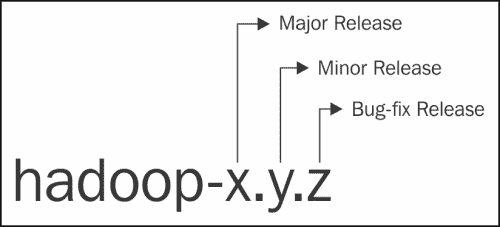
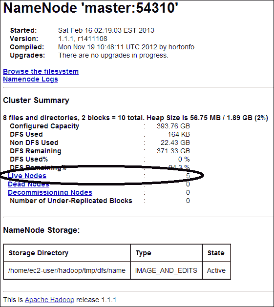
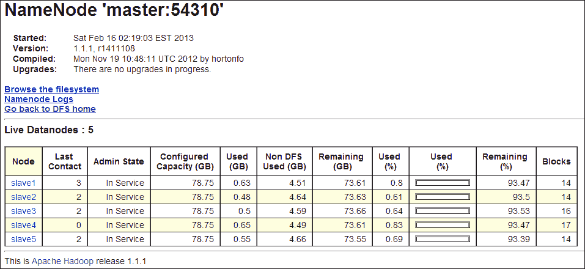
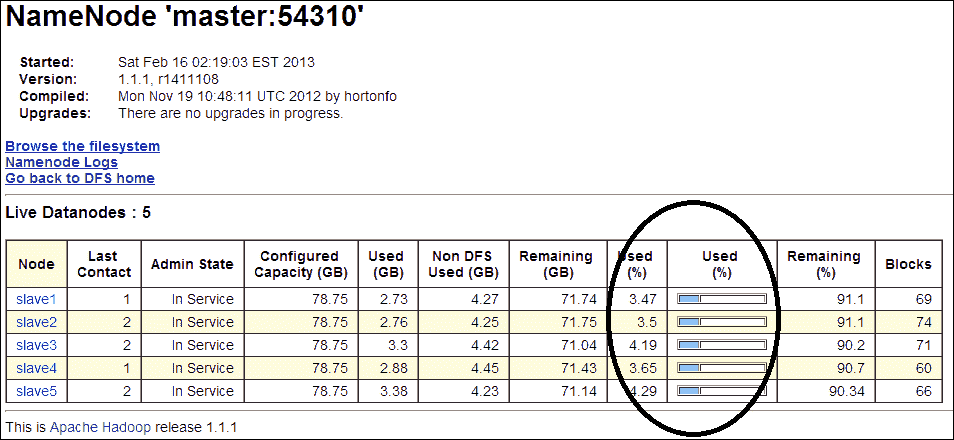
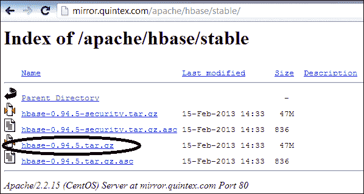

# 三、配置 Hadoop 集群

在本章中，我们将介绍：

*   选择 Hadoop 版本
*   在伪分布式模式下配置 Hadoop
*   在完全分布式模式下配置 Hadoop
*   正在验证 Hadoop 安装
*   配置 ZooKeeper
*   安装 HBase
*   安装配置单元
*   安装清管器
*   安装 Mahout

# 简介

完成所有准备任务后，我们就可以在本章中配置 Hadoop 集群了。 首先，我们将给您一些关于选择合适的 Hadoop 发布版本的提示。 然后，我们将向您展示如何在伪分布式和全分布式模式下配置 Hadoop 集群。 如果您没有配置 Hadoop 集群的经验，伪分布式模式是一个非常好的起点。 在此模式下，我们将所有 Hadoop 守护进程配置为在一台机器上运行，这可以让我们第一次感受到 Hadoop 集群正在工作，同时将配置困难降至最低。 接下来，我们将向您展示如何验证 Hadoop 集群。 验证 Hadoop 集群配置的重要性永远不会被过分强调。 我们通常使用此步骤来确认 Hadoop 集群是否按预期运行。 最后几个菜谱将向您展示如何在集群中安装一些组件。

# 选择 Hadoop 版本

作为一个开源项目，Hadoop 在过去几年中得到了积极的开发。 新版本正在定期发布。 这些新版本要么修复了社区贡献的 bug，带来了更稳定的 Hadoop 软件堆栈，要么添加了新功能，以实现更成熟的企业级分发。

在本节中，我们将回顾 Hadoop 版本的历史，指出这些版本的特性。 更重要的是，我们将给出选择合适 Hadoop 发行版的提示。

## 做好准备

一般而言，Hadoop 发行版的**发行版本号**由三部分组成：**版本**号、**主要版****修订版**号和**次版本号****修订版**。

### 备注

有时修订号可以有第四部分，例如 0.20.203.0，但这种情况相对较少。

Hadoop 版本名称可以用下图描述：



## 怎么做……

下表显示了 Hadoop 主要版本的功能：

<colgroup><col style="text-align: left"> <col style="text-align: left"> <col style="text-align: left"> <col style="text-align: left"> <col style="text-align: left"></colgroup> 
| 

功能\版本

 | 

2.0.x.2.0.x

 | 

1.1.x

 | 

0.23.x 0.23.x

 | 

0.20.x 0.20.x

 |
| --- | --- | --- | --- | --- |
| 马厩 / 赛马训练场 / 组织 / 牛棚 |   | 肯定的回答 / 赞成 / 是 |   | 肯定的回答 / 赞成 / 是 |
| MRv1 |   | 肯定的回答 / 赞成 / 是 |   | 肯定的回答 / 赞成 / 是 |
| MRv2 | 肯定的回答 / 赞成 / 是 |   | 肯定的回答 / 赞成 / 是 |   |
| Kerberos 安全性 | 肯定的回答 / 赞成 / 是 | 肯定的回答 / 赞成 / 是 | 肯定的回答 / 赞成 / 是 |   |
| HDFS 联合 | 肯定的回答 / 赞成 / 是 |   | 肯定的回答 / 赞成 / 是 |   |
| NameNode HA | 肯定的回答 / 赞成 / 是 |   | 肯定的回答 / 赞成 / 是 |   |
| HDFS 附加 | 肯定的回答 / 赞成 / 是 | 肯定的回答 / 赞成 / 是 | 肯定的回答 / 赞成 / 是 |   |
| HDFS 符号链接 | 肯定的回答 / 赞成 / 是 | 肯定的回答 / 赞成 / 是 | 肯定的回答 / 赞成 / 是 |   |

该表告诉我们 Hadoop 正在快速发展，随着时间的推移，安全性、**HDFS 联合**和**NameNode HA**等新功能不断增加。 我们可以从该表中学到的另一个教训是，最新的稳定版本 1.1.x 并不包含所有功能。 尽管 2.0.x 版是功能最丰富的 Hadoop 发行版，但它仍然处于阿尔法状态，需要进一步改进。

那么，您应该为您的部署选择哪个版本呢？ 一般来说，我们需要考虑两个属性：稳定性和特性。 对于生产部署，我们肯定希望部署一个稳定的版本，并且我们希望使用包含所有必需功能的版本。 显然，我们目前最理想也是唯一的选择是版本 1.1.x，特别是本书撰写时的版本 1.1.2。

## 另请参阅

*   有关 Hadoop 版本的更多信息，请参阅[http://hadoop.apache.org/releases.html](http://hadoop.apache.org/releases.html)

# 在伪分布式模式下配置 Hadoop

**伪分布式模式**指的是只包含一个节点的 Hadoop 集群配置。 此模式对调试和验证目的很有帮助。 在本食谱中，我们将概述在伪分布式模式下配置 Hadoop 的步骤。

## 做好准备

在伪分布式模式下配置 Hadoop 之前，我们假设有一台机器，例如，Hadoop 集群的主节点，安装了 Linux。 我们还假设所有必要的工具都已安装并正确配置。

*   The most important dependent software is Java, which is the programming language and library that Hadoop is based on. To check that Java has been properly installed, we can use the following command:

    ```sh
    $ java -version

    ```

    您应该有类似于以下内容的输出：

    ```sh
    java version "1.7.0_13"
    Java(TM) SE Runtime Environment (build 1.7.0_13-b20)
    Java HotSpot(TM) 64-Bit Server VM (build 23.7-b01, mixed mode)

    ```

*   If you have installed OpenJDK other than the Oracle's official Java, the output will be similar to the following:

    ```sh
    Java version "1.7.0_09-icedtea"
    OpenJDK Runtime Environment (fedora-2.3.4.fc17-x86_64)
    OpenJDK 64-Bit Server VM (build 23.2-b09, mixed mode)

    ```

    ### 提示

    如果您已经安装了 OpenJDK，请参考[第 2 章](2.html "Chapter 2. Preparing for Hadoop Installation")，*准备 Hadoop 安装*中的*安装 Java 和其他工具*食谱。

*   Download the desired Hadoop distribution. In this book, we assume that we're using Hadoop release 1.1.2\. To download a Hadoop release, please visit the following URL:

    [http：//www.apache.org/dyn/closer.cgi/hadoop/common/](http://www.apache.org/dyn/closer.cgi/hadoop/common/)

    选择合适的镜像站点(或使用镜像顶部的建议链接)。 点击适当的 Hadoop 版本开始下载。 我们建议下载文件名以`tar.gz`结尾的`.gzip`存档文件。

*   或者，我们可以在 Linux 下使用以下命令下载 Hadoop 版本：

    ```sh
    wget http://mirror.quintex.com/apache/hadoop/common/hadoop-1.1.2/hadoop-1.1.2.tar.gz -P ~

    ```

*   最后，我们假设已经正确配置了`ssh`无密码登录。

## 怎么做……

要在伪分布式模式下配置 Hadoop，请执行以下步骤：

1.  将 Hadoop 归档文件复制到`/usr/local`目录：

    ```sh
    sudo cp hadoop-1.1.2.tar.gz /usr/local

    ```

2.  Decompress the Hadoop package archive:

    ```sh
    cd /usr/local
    sudo tar xvf hadoop-1.1.2.tar.gz

    ```

    未压缩的存档文件将包含以下文件和文件夹：

    ```sh
    CHANGES.txt  c++                     hadoop-examples-1.1.2.jar     lib
    LICENSE.txt  conf                    hadoop-minicluster-1.1.2.jar  libexec
    NOTICE.txt   contrib                 hadoop-test-1.1.2.jar         sbin
    README.txt   hadoop-ant-1.1.2.jar    hadoop-tools-1.1.2.jar        share
    bin          hadoop-client-1.1.2.jar ivy                           src
    build.xml    hadoop-core-1.1.2.jar   ivy.xml                       webapps

    ```

    ### 备注

    该文件夹包含多个`.jar`文件和文件夹，如`bin`、`sbin`和`conf`。 `.jar`文件`hadoop-core-1.1.2.jar`和`hadoop-tools-1.1.2.jar`包含 Hadoop 的核心类。 文件`hadoop-examples-1.1.2.jar`和`hadoop-test-1.1.2.jar`包含示例 MapReduce 作业。

    `conf`文件夹包含集群配置文件，`bin`文件夹包含启动和停止集群的命令和脚本，`sbin`文件夹包含执行特定任务的脚本。

3.  创建 Hadoop 根目录的软链接：

    ```sh
    sudo ln -s hadoop-1.1.2 hadoop

    ```

4.  Use your favorite text editor to open the file `~/.bashrc` and add the following contents:

    ```sh
    export JAVA_HOME=/usr/java/latest
    export HADOOP_HOME=/usr/local/hadoop
    export PATH=$PATH:$JAVA_HOME/bin:HADOOP_HOME/bin
    ```

    ### 备注

    我们假设 Oracle Java 已安装在`/usr/java/latest`目录下。

5.  使用以下命令重新加载配置文件`~/.bashrc`：

    ```sh
    . ~/.bashrc

    ```

6.  使用您喜欢的文本编辑器打开文件`$HADOOP_HOME/conf/hadoop-env.sh`，并将`JAVA_HOME`环境变量更改为以下内容：

    ```sh
    export JAVA_HOME=/usr/Java/latest
    ```

7.  使用您喜欢的文本编辑器打开文件`$HADOOP_HOME/conf/core-site.xml`，并添加以下内容：

    ```sh
    <configuration>
      <property>
        <name>fs.default.name</name>
        <value>hdfs://localhost:54310</value>
      </property>

      <property>
        <name>mapred.job.tracker</name>
        <value>localhost:54311</value>
      </property>

      <property>
        <name>hadoop.tmp.dir</name>
        <value>/hadoop/tmp/</value>
      </property>
    </configuration>
    ```

8.  使用您喜欢的文本编辑器打开文件`$HADOOP_HOME/conf/hdfs-site.xml`，并向该文件添加以下内容：

    ```sh
    <configuration>
      <property>
        <name>dfs.replication</name>
        <value>2</value>
      </property>

      <property>
        <name>dfs.data.dir</name>
        <value>/hadoop/data/</value>
      </property>
    </configuration>
    ```

9.  使用您喜欢的文本编辑器打开文件`$HADOOP_HOME/conf/mapred-site.xml`，并添加以下内容：

    ```sh
    <configuration>
      <property>
        <name>mapred.system.dir</name>
        <value>/hadoop/mapred</value>
      </property>
    </configuration>
    ```

10.  使用以下命令要求`localhost`运行 Second DaryNameNode 守护进程：

    ```sh
    sudo echo "localhost" > $HADOOP_HOME/conf/masters

    ```

11.  使用以下命令将`localhost`配置为单个从节点：

    ```sh
    sudo echo "localhost" > $HADOOP_HOME/conf/slaves

    ```

使用以下步骤启动和停止 Hadoop 集群：

1.  Format the HDFS filesystem from NameNode with the following command:

    ```sh
    hadoop namenode -format

    ```

    我们将得到类似于以下内容的输出：

    ```sh
    13/02/14 01:43:12 INFO namenode.NameNode: STARTUP_MSG:
    /************************************************************
    STARTUP_MSG: Starting NameNode
    STARTUP_MSG:   host = localhost/127.0.0.1
    STARTUP_MSG:   args = [-format]
    STARTUP_MSG:   version = 1.1.2
    STARTUP_MSG:   build = https://svn.apache.org/repos/asf/hadoop/common/branches/branch-1.0 -r 1393290; compiled by 'hortonfo' on Wed Oct  3 05:13:58 UTC 2012
    ************************************************************/
    13/02/14 01:43:13 INFO util.GSet: VM type       = 64-bit
    13/02/14 01:43:13 INFO util.GSet: 2% max memory = 17.77875 MB
    13/02/14 01:43:13 INFO util.GSet: capacity      = 2^21 = 2097152 entries
    13/02/14 01:43:13 INFO util.GSet: recommended=2097152, actual=2097152
    13/02/14 01:43:13 INFO namenode.FSNamesystem: fsOwner=shumin
    13/02/14 01:43:13 INFO namenode.FSNamesystem: supergroup=supergroup
    13/02/14 01:43:13 INFO namenode.FSNamesystem: isPermissionEnabled=true
    13/02/14 01:43:13 INFO namenode.FSNamesystem: dfs.block.invalidate.limit=100
    13/02/14 01:43:13 INFO namenode.FSNamesystem: isAccessTokenEnabled=false accessKeyUpdateInterval=0 min(s), accessTokenLifetime=0 min(s)
    13/02/14 01:43:13 INFO namenode.NameNode: Caching file names occuring more than 10 times
    13/02/14 01:43:13 INFO common.Storage: Image file of size 112 saved in 0 seconds.
    13/02/14 01:43:14 INFO common.Storage: Storage directory /hadoop/tmp/dfs/name has been successfully formatted.
    13/02/14 01:43:14 INFO namenode.NameNode: SHUTDOWN_MSG:
    /************************************************************
    SHUTDOWN_MSG: Shutting down NameNode at localhost/127.0.0.1
    ************************************************************/

    ```

2.  Start the HDFS daemons with the following command:

    ```sh
    start-dfs.sh

    ```

    我们将得到类似于以下内容的输出：

    ```sh
    starting namenode, logging to /usr/local/hadoop/libexec/../logs/hadoop-hduser-namenode-localhost.out
    localhost: starting datanode, logging to /usr/local/hadoop/Hadoop/libexec/../logs/hadoop-hduser-datanode-localhost.out
    localhost: starting secondarynamenode, logging to /usr/local/hadoop/libexec/../logs/hadoop-hduser-secondarynamenode-localhost.out

    ```

    ### 备注

    输出显示以下 HDFS 守护程序已启动：

    NameNode、DataNode 和 Second daryNameNode。

3.  Start the MapReduce daemons with the following command:

    ```sh
    start-mapred.sh

    ```

    输出将类似于以下内容：

    ```sh
    starting jobtracker, logging to /usr/local/hadoop/libexec/../logs/hadoop-hduser-jobtracker-localhost.out
    localhost: starting tasktracker, logging to /usr/local/hadoop/libexec/../logs/hadoop-hduser-tasktracker-localhost.out

    ```

    ### 备注

    输出显示 JobTracker 和 TaskTracker MapReduce 守护进程已启动。

4.  With the `jps` command, we can get a list of all running daemons as follows:

    ```sh
    10984 SecondaryNameNode
    11272 TaskTracker
    11144 JobTracker
    26966 NameNode
    10855 DataNode
    27183 Jps

    ```

    ### 备注

    到目前为止，所有 Hadoop 守护进程都已启动。

5.  使用以下命令停止 MapReduce 后台进程：

    ```sh
    stop-mapred.sh

    ```

6.  使用以下命令停止 HDFS 守护程序：

    ```sh
    stop-hdfs.sh

    ```

## 它是如何工作的.

在类 Unix 操作系统下，系统运行时配置和环境变量是通过纯文本文件指定的。 这些文件称为运行配置文件，表示它们在程序运行时提供配置。 例如，用户主目录下的`.bashrc`文件是 bash shell 的运行配置文件。 每次打开 bash 终端时，它都会自动源(加载)。 因此，在此文件中，我们可以为运行的 bash 环境指定命令和环境变量。

### 提示

**.bashrc 或.bash_profile**

在 Linux 下，bash shell 为一个用户提供了两个运行配置文件`.bashrc`和`.bash_profile`。 这两个文件的不同之处在于，`.bash_profile`是针对登录 shell 执行的，而`.bashrc`是针对交互式非登录 shell 执行的。 更具体地说，当我们在本地或从远程机器输入用户名和密码登录到系统时，将执行`.bash_profile`，并初始化 bash shell 进程。 另一方面，如果我们在登录机器后打开一个新的 bash 终端，或者在命令行中输入`bash`命令，那么在我们看到终端窗口上的命令提示符之前，将使用`.bashrc`文件进行初始化。 在本配方中，我们使用了`.bashrc`文件，以便在打开新的 bash 流程后可以使用新的配置。 或者，我们也可以在使用`source`命令创建或更改配置文件后手动创建源文件。

下表显示了在伪分布式模式下配置 Hadoop 集群的配置文件：

<colgroup><col style="text-align: left"> <col style="text-align: left"></colgroup> 
| 

文件夹 / 卷宗 / 文件 / 锉刀

 | 

描述 / 描写 / 形容 / 类别

 |
| --- | --- |
| `hadoop-env.sh` | 配置 Hadoop 使用的环境变量 |
| `core-site.xml` | 配置整个 Hadoop 集群的参数 |
| `hdfs-site.xml` | 配置 HDFS 及其客户端的参数 |
| `mapred-site.xml` | 配置 MapReduce 及其客户端的参数 |
| `masters` | 配置 Second DaryNameNode 的主机 |
| `slaves` | 配置从节点主机列表 |

以下列表说明了配置文件：

*   `hadoop-env.sh`指定用于运行 Hadoop 的个环境个变量。 例如，Java 安装的主目录`JAVA_HOME`、与 Hadoop 运行时选项和集群日志记录相关的主目录，等等。
*   `core-site.xml`指定 HDFS NameNode 和 MapReduce JobTracker 的 URI。 `fs.default.name`属性的`hdfs://localhost:54310`值将默认文件系统的位置指定为使用端口`54310`的`localhost`上的 HDFS。 我们可以指定其他文件系统方案，比如使用`file:///home/hduser/hadoop`的本地文件系统、使用`s3://a-bucket/hadoop`的 Amazon web 服务 S3，等等。 `mapred.job.tracker`属性的`localhost:54311`值指定集群的 JobTracker 的 URI。
*   `hdfs-site.xml`指定与 HDFS 相关的配置。 例如，`dfs.replication`配置 HDFS 上的数据块的复制因子。 例如，值`2`指定每个数据块将在文件系统上复制两次。 `dfs.data.dir`属性指定主机 Linux 文件系统上数据目录的位置。
*   `mapred-site.xml`指定 MapReduce 框架的配置。 例如，我们可以配置`jvm`个任务的总数、`map`个插槽的数量，以及减少从节点上的插槽、减少每个任务的内存量等。
*   `masters`文件指定将运行 Second daryNameNode 守护进程的台主机。 在我们的单节点配置中，我们将`localhost`放入此文件。 第二个 daryNameNode 守护进程将在`localhost`上启动，该守护进程已使用`jps`命令进行了验证。
*   `slaves`文件指定运行由任务跟踪器控制的任务的从节点。 在我们的伪分布式模式配置中，`localhost`是集群中唯一的从节点。

Hadoop 提供了许多 bash 脚本，以方便启动和停止集群。 下表显示了这些脚本：

<colgroup><col style="text-align: left"> <col style="text-align: left"></colgroup> 
| 

书法 / 笔迹 / 手书 / 剧本

 | 

描述 / 描写 / 形容 / 类别

 |
| --- | --- |
| `start-dfs.sh` | 此是启动 HDFS 守护进程的脚本，包括 NameNode、Second daryNameNode 和 DataNode。 将在默认文件夹`${hadoop.tmp.dir}`下为每个守护进程创建一个 PID 文件。 例如，如果用户`hduser`用于运行脚本，则将为 NameNode 守护进程创建`/hadoop/tmp/hadoop-hduser-namenode.pid`文件。 |
| `stop-dfs.sh` | 此是停止 HDFS 守护进程的脚本。 此命令将尝试查找 HDFS 守护进程的 PID 文件，并终止具有 PID 文件的进程。 因此，如果缺少 PID 文件，此脚本将不起作用。 |
| `start-mapred.sh` | 这个是启动 MapReduce 守护进程的脚本，包括 JobTracker 和 TaskTracker 守护进程。 与`start-hdfs.sh`脚本类似，将为每个守护进程创建 PID 文件。 |
| `stop-mapred.sh` | 这是停止 Hadoop MapReduce 守护进程的脚本。 与`stop-dfs.sh`脚本类似，该脚本将尝试查找 PID 文件，然后终止这些进程。 |
| `start-all.sh` | 它等于等于`start-dfs.sh`加上`start-mapred.sh`。 |
| `stop-all.sh` | 它等于等于`stop-dfs.sh`加上`stop-mapred.sh`。 |

## 还有更多...

目前，Hadoop 还提供`rpm`格式。 因此，我们可以使用以下命令安装 Hadoop：

```sh
sudo rpm -ivh http://www.poolsaboveground.com/apache/hadoop/common/stable/hadoop-1.1.2-1.x86_64.rpm

```

安装文件的位置与 tarball 方法不同，我们可以使用以下命令检查文件布局：

```sh
rpm -ql hadoop

```

然后，我们可以使用以下命令在单节点中配置 Hadoop 集群：

```sh
sudo hadoop-setup-single-node.sh

```

## 另请参阅

*   [第 3 章](3.html "Chapter 3. Configuring a Hadoop Cluster")、*配置 Hadoop 集群*中的*在完全分布式模式下配置 Hadoop*配方
*   [第 3 章](3.html "Chapter 3. Configuring a Hadoop Cluster")，*配置 Hadoop 集群*中的*验证 Hadoop 安装*配方

# 在完全分布式模式下配置 Hadoop

要在**完全分布式模式**下配置 Hadoop 集群，我们需要配置所有主机和从机。 虽然与伪分布式模式不同，但配置体验将是相似的。 在本食谱中，我们将概述在完全分布式模式下配置 Hadoop 的步骤。

## 做好准备

在本书中，我们建议配置一个具有一个主节点和五个从节点的 Hadoop 集群。 `master`节点的主机名为`1`，从节点的主机名为`slave1`、`slave2`、`slave3`、`slave4`和`slave5`。

在开始之前，我们假设 Linux 已经安装在所有集群节点上，并且我们应该在主节点上使用以下命令验证无密码登录：

```sh
ssh hduser@slave1
ssh hduser@slave2
...

```

### 提示

与伪分布式模式不同，在完全分布式模式下配置 Hadoop 集群需要成功配置集群中的所有节点。 否则，集群将无法按预期工作。

我们应该谨慎对待集群节点的互联互通。 连接问题可能是由防火墙、网络等的配置引起的。

假设`$HADOOP_HOME/conf/slaves`文件包含从节点的主机名，我们可以使用以下命令检查从主节点到所有从节点的无密码登录：

```sh
for host in 'cat $HADOOP_HOME/conf/slaves'; do
 echo 'Testing ssh from master to node ' $host
 ssh hduser@$host
done

```

## 怎么做……

使用以下配方在完全分布式模式下配置 Hadoop：

1.  使用以下命令从管理员计算机登录到主节点：

    ```sh
    ssh hduser@master

    ```

2.  将 Hadoop 归档文件复制到`/usr/local`目录：

    ```sh
    sudo cp hadoop-1.1.2.tar.gz /usr/local

    ```

3.  解压缩 Hadoop 存档：

    ```sh
    cd /usr/local
    sudo tar xvf hadoop-1.1.2.tar.gz

    ```

4.  为 Hadoop 根目录创建适当的软链接：

    ```sh
    sudo ln -s hadoop-1.1.2 hadoop

    ```

5.  使用您喜欢的文本编辑器打开`~/.bashrc`文件，并添加以下内容：

    ```sh
    export JAVA_HOME=/usr/java/latest
    export HADOOP_HOME=/usr/local/Hadoop
    export PATH=$PATH:$JAVA_HOME/bin:HADOOP_HOME/bin
    ```

6.  使用您喜欢的文本编辑器打开`$HADOOP_HOME/conf/hadoop-env.sh`文件，并添加以下内容：

    ```sh
    export JAVA_HOME=/usr/java/latest
    ```

7.  使用您喜欢的文本编辑器打开`$HADOOP_HOME/conf/core-site.xml`文件，并添加以下内容：

    ```sh
    <configuration>
      <property>
        <name>fs.default.name</name>
        <value>hdfs://master:54310</value>
      </property>

      <property>
        <name>mapred.job.tracker</name>
        <value>master:54311</value>
      </property>
    </configuration>
    ```

8.  使用您喜欢的文本编辑器打开`$HADOOP_HOME/conf/hdfs-site.xml`文件，然后将以下内容添加到文件中：

    ```sh
    <configuration>
      <property>
        <name>dfs.replication</name>
        <value>2</value>
      </property>

      <property>
        <name>dfs.data.dir</name>
        <value>/hadoop/data/</value>
      </property>

      <property>
        <name>hadoop.tmp.dir</name>
        <value>/hadoop/tmp/</value>
      </property>
    </configuration>
    ```

9.  使用您喜欢的文本编辑器打开`$HADOOP_HOME/conf/mapred-site.xml`文件，并添加以下内容：

    ```sh
    <configuration>
      <property>
        <name>mapred.tasktracker.map.tasks.maximum</name>
        <value>6</value>
      </property>

      <property>
        <name>mapred.tasktracker.reduce.tasks.maximum</name>
        <value>6</value>
      </property>

      <property>
        <name>mapred.map.child.java.opts</name>
        <value>-Xmx512m</value>
      </property>

      <property>
        <name>mapred.reduce.child.java.opts</name>
        <value>-Xmx512m</value>
      </property>

    </configuration>
    ```

10.  Configure the `$HADOOP_HOME/conf/masters` file with the following command:

    ```sh
    sudo echo "master" > $HADOOP_HOME/conf/masters

    ```

    这将配置主节点以运行 Second daryNameNode。

11.  使用您喜欢的文本编辑器打开`$HADOOP_HOME/conf/slaves`文件，并将所有从节点主机名添加到该文件中，如下所示：

    ```sh
    slave1
    slave2
    slave3
    ...

    ```

12.  Copy the configured Hadoop directory to all the slave nodes with the following command:

    ```sh
    for host in 'cat $HADOOP_HOME/conf/slaves
     do
     echo 'Configuring hadoop on slave node ' $host
     sudo scp -r /usr/local/hadoop-1.1.2 hduser@$host:/usr/local/
     echo 'Making symbolic link for Hadoop home directory on host ' $host
     sudo ssh hduser@$host -C "ln -s /usr/local/hadoop-1.1.2 /usr/local/hadoop"
    done

    ```

    ### 备注

    `for-loop`命令会递归地将`/usr/local/hadoop-1.1.2`目录复制到`$HADOOP_HOME/conf/slaves`文件中指定的每个节点，并在每个节点上为 Hadoop 目录创建一个符号链接。 我们可以获得以下输出信息：

    ```sh
    Configuring hadoop on slave node slave1
    Making symbolic link for Hadoop home directory on host host slave1
    Configuring hadoop on slave node slave2
    Making symbolic link for Hadoop home directory on host host slave2
    Configuring hadoop on slave node slave3
    Making symbolic link for Hadoop home directory on host host slave3
    Configuring hadoop on slave node slave4
    Making symbolic link for Hadoop home directory on host host slave4
    ...

    ```

13.  使用以下命令将 bash 配置文件复制到每个从节点：

    ```sh
    for host in cat $HADOOP_HOME/conf/slaves; do
     echo 'Copying local bash run configuration file to host ' $host
     sudo cp ~/.bashrc $host:~/
    done

    ```

### 备注

`for-loop`命令将 bash run 配置文件从主节点复制到集群中的所有从节点。 我们可以获得以下输出消息：

```sh
Copying local bash run configuration file to host slave1
Copying local bash run configuration file to host slave2
Copying local bash run configuration file to host slave3
...

```

使用以下配方启动 Hadoop 集群：

1.  Format the HDFS filesystem on the master node with the following command:

    ```sh
    hadoop namenode -format

    ```

    ### 提示

    如果这是第一次格式化 HDFS，该命令应该会自动完成。 如果您正在重新格式化现有的文件系统，它将要求您允许格式化该文件系统。 例如，输出信息将包含类似以下内容的消息：

    ```sh
    Re-format filesystem in /tmp/hadoop-shumin/dfs/name ? (Y or N)
    ```

    在这种情况下，我们需要按*Y*确认文件系统的重新格式化。 请注意，当您按下*Enter*键后，所有数据都将被清除。

2.  Check the directory structure of the formatted NameNode with the following command:

    ```sh
    tree /hadoop/dfs/

    ```

    输出将类似于以下内容：

    ```sh
    /hadoop/dfs/
    └── name
     ├── current
     │ ├── edits
     │ ├── fsimage
     │ ├── fstime
     │ └── VERSION
     └── image
     └── fsimage

    3 directories, 5 files

    ```

    ### 备注

    树形列表显示了格式化 HDFS 文件系统的目录结构，该文件系统包含主内存中的文件系统`image`(在`/hadoop/dfs/name/image`目录中)和当前活动的`image`(镜像到`/hadoop/dfs/name/current`文件夹)。

3.  Start HDFS cluster daemons with the following command:

    ```sh
    start-dfs.sh

    ```

    我们将得到类似于以下内容的输出：

    ```sh
    starting namenode, logging to /usr/local/hadoop/logs/hadoop-hdu                       ser-namenode-master.out
    slave1: starting datanode, logging to /usr/local/hadoop/logs/h                       adoop-hduser-datanode-sslave1.out
    slave2: starting datanode, logging to /usr/local/hadoop/logs/                       hadoop-hduser-datanode-slave2.out
    slave3: starting datanode, logging to /usr/local/hadoop/logs/                       hadoop-hduser-datanode-slave3.out
    slave4: starting datanode, logging to /usr/local/hadoop/logs/                       hadoop-hduser-datanode-slave4.out
    slave5: starting datanode, logging to /usr/local/hadoop/logs/                       hadoop-hduser-datanode-slave5.out
    master: starting secondarynamenode, logging to /usr/local/hadoop/logs/hadoop-hduser-secondarynamenode-hadoop-master.out

    ```

    ### 备注

    输出消息显示在主节点上启动了 NameNode 和 Second daryNameNode 守护进程，在每个从节点上启动了一个 DataNode 守护进程。

4.  Start the MapReduce cluster daemons with the following command:

    ```sh
    start-mapred.sh

    ```

    输出将类似于以下内容：

    ```sh
    starting jobtracker, logging to /usr/local/hadoop/logs/hadoop-hduser-jobtracker-master.out
    slave1: starting tasktracker, logging to /usr/local/Hadoop/logs/hadoop-hduser-tasktracker-slave1.out
    slave2: starting tasktracker, logging to /usr/local/Hadoop/logs/hadoop-hduser-tasktracker-slave2.out
    slave3: starting tasktracker, logging to /usr/local/Hadoop/logs/hadoop-hduser-tasktracker-slave3.out
    slave4: starting tasktracker, logging to /usr/local/Hadoop/logs/hadoop-hduser-tasktracker-slave4.out
    slave5: starting tasktracker, logging to /usr/local/Hadoop/logs/hadoop-hduser-tasktracker-slave5.out

    ```

    ### 备注

    输出消息显示在主节点上启动了 JobTracker 守护进程，在每个从节点上启动了 TaskTracker 守护进程。

5.  On the master node, check the status of the Hadoop daemons with the following command:

    ```sh
    jps

    ```

    输出将类似于以下内容：

    ```sh
    19512 NameNode
    19930 JobTracker
    19708 SecondaryNameNode
    20276 Jps

    ```

6.  On a slave node, we can check the status of the daemon processes with the same command, and the output will be similar to the following:

    ```sh
    3949 Jps
    3639 TaskTracker
    3501 DataNode

    ```

    ### 提示

    前两个步骤中突出显示的守护程序必须存在。 否则会出现配置问题。 您可以查看菜谱*验证 Hadoop 安装*以获得故障排除和调试建议。

7.  List all the available TaskTrackers with the following command:

    ```sh
    hadoop job -list-active-trackers

    ```

    输出消息将类似于以下内容：

    ```sh
    tracker_slave1:slave1/10.0.0.2:38615
    tracker_slave2:slave2/10.0.0.3:39618
    tracker_slave3:slave3/10.0.0.4:48228
    tracker_slave4:slave4/10.0.0.5:42954
    tracker_slave5:slave5/10.0.0.6:43858

    ```

8.  Check the status of each node in the HDFS cluster with the following command:

    ```sh
    hadoop dfsadmin -report

    ```

    输出消息将类似于以下内容：

    ```sh
    Configured Capacity: 13500319031296 (12.28 TB)
    Present Capacity: 12015141961728 (10.93 TB)
    DFS Remaining: 4067084627968 (3.7 TB)
    DFS Used: 7948057333760 (7.23 TB)
    DFS Used%: 66.15%
    Under replicated blocks: 0
    Blocks with corrupt replicas: 0
    Missing blocks: 0

    -------------------------------------------------
    Datanodes available: 5 (5 total, 0 dead)

    Name: 192.168.1.14:50010
    Decommission Status : Normal
    Configured Capacity: 964306395136 (898.08 GB)
    DFS Used: 590553788416 (550 GB)
    Non DFS Used: 97300185088 (90.62 GB)
    DFS Remaining: 276452421632(257.47 GB)
    DFS Used%: 61.24%
    DFS Remaining%: 28.67%
    Last contact: Sat Feb 16 00:34:17 EST 2013

    ...

    Name: 192.168.1.17:50010
    Decommission Status : Normal
    Configured Capacity: 964262363136 (898.04 GB)
    DFS Used: 617057673216 (574.68 GB)
    Non DFS Used: 81531011072 (75.93 GB)
    DFS Remaining: 265673678848(247.43 GB)
    DFS Used%: 63.99%
    DFS Remaining%: 27.55%
    Last contact: Sat Feb 16 00:34:15 EST 2013

    ```

### 备注

输出显示集群中有`5`个 DataNode，并报告每个 DataNode 的状态，如容量和使用率。

使用以下两个步骤停止正在运行的 Hadoop 集群：

1.  Stop the MapReduce daemons with the following command on the master node:

    ```sh
    stop-mapred.sh

    ```

    我们将获得类似以下内容的输出消息：

    ```sh
    stopping jobtracker
    slave3: stopping tasktracker
    slave2: stopping tasktracker
    slave5: stopping tasktracker
    slave4: stopping tasktracker
    slave1: stopping tasktracker

    ```

    ### 备注

    输出显示主节点上的 JobTracker 守护进程和从节点上的 TaskTracker 守护进程正在停止。

2.  Stop the HDFS daemons with the following command on the master node:

    ```sh
    stop-dfs.sh

    ```

    输出消息将类似于以下内容：

    ```sh
    stopping namenode
    slave3: stopping datanode
    slave4: stopping datanode
    slave2: stopping datanode
    slave1: stopping datanode
    slave5: stopping datanode
    localhost: stopping secondarynamenode

    ```

### 备注

输出显示主节点上的 NameNode 和 Second daryNameNode 守护进程以及从节点上的 DataNode 守护进程正在停止。

## 它是如何工作的.

下表显示了此配方中使用的属性：

<colgroup><col style="text-align: left"> <col style="text-align: left"></colgroup> 
| 

性质 / 财产 / 所有权

 | 

描述 / 描写 / 形容 / 类别

 |
| --- | --- |
| `fs.default.name` | 默认文件系统的 URI。 |
| `mapred.job.tracker` | JobTracker 的 URI，例如`localhost:54310`。 |
| `dfs.replication` | 指定块应复制到多少个节点。 此属性的默认值为`3`。 |
| `dfs.data.dir` | 数据节点上数据块的本地存储目录。 |
| `hadoop.tmp.dir` | 许多其他目录的基目录。 |
| `mapred.tasktracker.map.tasks.maximum` | TaskTracker 守护程序可以运行的最大并行映射任务数。 |
| `mapred.tasktracker.reduce.tasks.maximum` | TaskTracker 守护程序可以运行的最大并行 Reduce 任务数。 |
| `mapred.map.child.java.opts` | `map`任务子进程的 Java 选项。 |
| `mapred.reduce.child.java.opts` | Reduce 任务子进程的 Java 选项。 |

## 还有更多...

或者，我们也可以使用以下步骤配置全分布式 Hadoop 集群：

1.  使用以下命令在管理员计算机上下载 Hadoop`rpm`包：

    ```sh
    wget http://www.poolsaboveground.com/apache/hadoop/common/stable/hadoop-1.1.2-1.x86_64.rpm -P ~/repo

    ```

2.  使用以下命令登录主节点：

    ```sh
    ssh hduser@master

    ```

3.  使用以下命令在所有节点上安装 Hadoop：

    ```sh
    for host in master slave1 slave2 slave3 slave4 slave5; do
     echo 'Installing Hadoop on node: ' $host
     sudo rpm -ivh ftp://hadoop.admin/repo/hadoop-1.1.2-1.x86_64.rpm
    done

    ```

4.  通过修改位于`/etc/hadoop`文件夹中的配置文件来配置 Hadoop 集群。

## 另请参阅

*   [第 3 章](3.html "Chapter 3. Configuring a Hadoop Cluster")、*配置 Hadoop 集群*中的*在伪分布式模式下配置 Hadoop*配方
*   [第 3 章](3.html "Chapter 3. Configuring a Hadoop Cluster")，*配置 Hadoop 集群*中的*验证 Hadoop 安装*配方

# 验证 Hadoop 安装

在验证步骤之前，不会完成 Hadoop 集群的配置。 验证在 Hadoop 集群的配置中扮演着重要的角色；例如，它可以帮助我们找出配置问题。

验证 Hadoop 集群配置的最直接方法是从主节点运行 MapReduce 作业。 或者，有两种方法可以验证集群配置。 一个来自 Web 界面，另一个来自命令行。 在本食谱中，我们将列出验证 Hadoop 集群配置的步骤。

## 做好准备

要从 Web 界面验证配置，需要使用 Firefox 或 Google Chrome 等 Web 浏览器。 有时，如果 GUI Web 浏览器不可用，我们可以使用基于命令行的 Web 浏览器，如`elinks`和`lynx`。 在本书中，我们假定使用`elinks`作为说明。

我们假设已经使用以下命令安装了`elinks`：

```sh
sudo yum install elinks

```

使用以下命令启动所有 Hadoop 守护程序：

```sh
start-dfs.sh
start-mapred.sh

```

## 怎么做……

使用以下步骤运行 MapReduce 作业：

1.  使用以下命令登录主节点：

    ```sh
    ssh hduser@master

    ```

2.  Run a sample MapReduce job with the following command:

    ```sh
    hadoop jar $HADOOP_HOME/hadoop-examples*.jar pi 20 100000

    ```

    ### 提示

    在此命令中，`hadoop-examples*jar`是一个`.jar`文件，其中包含一些示例 MapReduce 作业，如`pi`。 选项`20`是要运行的任务数，`100000`指定每个任务的样本大小。

    如果该作业完成时没有任何问题，我们可以说 Hadoop 集群正在工作。 但这还不够，因为我们还需要确保所有从节点都可用于运行任务。

使用以下步骤通过 Web 用户界面验证 Hadoop 集群配置：

1.  Open the `master:50030/jobtracker.jsp` URL with a web browser. The web page will be similar to the following screenshot:

    

2.  Check the status of each slave node by clicking on the link, which leads us to a web page similar to the following screenshot:

    

    从这个屏幕截图中，我们可以很容易地检查从节点上活动的 TaskTracker 的状态。 例如，我们可以看到失败任务的计数、MapReduce 插槽的数量、心跳秒数等等。

3.  Check the status of slave DataNodes by opening the `master:50070` URL. The web page will be similar to the following screenshot:

    

4.  By clicking on the **Live Nodes** link we can see the details of each node as shown in the following screenshot:

    

5.  Run an example `teragen` job to generate 10 GB data on the HDFS with the following command:

    ```sh
    hadoop jar $HADOOP_HOME/hadoop-examples-1.1.2.jar teragen $((1024*1024*1024* 10/100)) teraout

    ```

    ### 备注

    在此命令中，`hadoop-examples-1.1.2.jar`是 Java 存档文件，它提供了许多 Hadoop 示例。 选项`$((1024*1024*1024* 10/100))`告诉我们总数据大小为 10 GB 时将生成多少行数据。

6.  When the job is running, we can check the status of the job by opening the following URL:

    `http://master:50030/jobdetails.jsp?jobid=job_201302160219_0003&refresh=30`

    ### 备注

    在此 URL 中，`job_201302160219_0003`是作业 ID，`refresh=30`表示应该刷新网页的频率。

    作业状态网页将类似于以下屏幕截图：

    

7.  After the `teragen` job finishes, we can check the node storage space usage by opening the URL `http://master:50070/dfsnodelist.jsp?whatNodes=LIVE`. The web page will be similar to the following screenshot:

    

有时，基于命令行的 Web 浏览器可能比 GUI 浏览器更方便。 例如，我们可以使用`elinks master:50030`命令检查主节点上 MapReduce 的状态，并使用`elinks master:50070`命令检查 HDFS 的状态。

使用以下步骤从命令行验证 Hadoop 集群的配置：

1.  List all available TaskTrackers with the following command:

    ```sh
    hadoop job -list-active-trackers

    ```

    示例输出类似于以下内容：

    ```sh
    tracker_slave1:localhost/127.0.0.1:53431
    tracker_slave4:localhost/127.0.0.1:52644
    tracker_slave3:localhost/127.0.0.1:37775
    tracker_slave2:localhost/127.0.0.1:56074
    tracker_slave5:localhost/127.0.0.1:43541
    ```

    ### 备注

    输出确认所有配置的 TaskTracker 在 Hadoop 集群中都处于活动状态。

2.  Check the status of the HDFS cluster with the following command:

    ```sh
    hadoop fsck /

    ```

    输出将类似于以下内容：

    ```sh
    FSCK started by hduser from /10.0.0.1 for path / at Sat Feb 16 03:03:44 EST 2013
    ...............................Status: HEALTHY
     Total size:    7516316665 B
     Total dirs:    15
     Total files:   31
     Total blocks (validated):      125 (avg. block size 60130533 B)
     Minimally replicated blocks:   125 (100.0 %)
     Over-replicated blocks:        0 (0.0 %)
     Under-replicated blocks:       0 (0.0 %)
     Mis-replicated blocks:         0 (0.0 %)
     Default replication factor:    2
     Average block replication:     2.0
     Corrupt blocks:                0
     Missing replicas:              0 (0.0 %)
     Number of data-nodes:          5
     Number of racks:               1
    FSCK ended at Sat Feb 16 03:03:44 EST 2013 in 12 milliseconds

    The filesystem under path '/' is HEALTHY

    ```

### 备注

输出给我们的信息与 Web 界面中的信息相同，最后一行告诉我们`root`文件系统是`HEALTHY`。

## 它是如何工作的.

Hadoop 提供命令和 Web 界面，供系统管理员检查集群状态。 当我们启动 Hadoop 守护进程时，将启动一个内置的 Web 服务器，并使用一些预写的`.jsp`脚本文件来响应来自 Web 浏览器的用户请求。 可以在`$HADOOP_HOME/webapps`目录下找到`.jsp`文件。 如果您有编程经验，您可以利用`.jsp`文件来开发个性化的 Hadoop 集群管理工具。

## 还有更多...

在这一部分中，我们列出了几个典型的 Hadoop 配置问题，并给出了解决这些问题的建议。

### 无法启动 HDFS 后台进程

有许多可能的原因可能导致此问题。 例如，主节点上的 NameNode 尚未格式化，在这种情况下，我们可以使用以下命令在启动集群之前格式化 HDFS：

```sh
hadoop namenode -format

```

### 提示

**警告！**

使用此命令格式化文件系统时要小心。 它将擦除文件系统上的所有数据。 在使用此方法之前，请务必尝试其他方法。

一般而言，要解决此问题，我们需要检查 HDFS 是否已正确配置以及守护进程是否正在运行。 这可以使用以下命令来完成：

```sh
jps

```

### 提示

如果此命令的输出不包含 NameNode 和 Second daryNameNode 守护进程，我们需要检查 HDFS 的配置。

要解决 HDFS 启动问题，我们可以打开一个新终端，并使用以下命令监视主节点上的 NameNode 日志文件：

```sh
tail -f $HADOOP_HOME/logs/hadoop-hduser-namenode-master.log

```

当向日志文件追加新日志时，此命令将以动态方式显示日志文件的内容。 如果发生错误，我们可以得到类似以下内容的错误消息：

```sh
2013-02-16 11:44:29,860 ERROR org.apache.hadoop.hdfs.server.namenode.NameNode: java.net.UnknownHostException: Invalid hostname for server: master1
 at org.apache.hadoop.ipc.Server.bind(Server.java:236)
 at org.apache.hadoop.ipc.Server$Listener.<init>(Server.java:302)
 at org.apache.hadoop.ipc.Server.<init>(Server.java:1488)
 at org.apache.hadoop.ipc.RPC$Server.<init>(RPC.java:560)
 at org.apache.hadoop.ipc.RPC.getServer(RPC.java:521)
 at org.apache.hadoop.hdfs.server.namenode.NameNode.initialize(NameNode.java:295)
 at org.apache.hadoop.hdfs.server.namenode.NameNode.<init>(NameNode.java:529)
 at org.apache.hadoop.hdfs.server.namenode.NameNode.createNameNode(NameNode.java:1403)
 at org.apache.hadoop.hdfs.server.namenode.NameNode.main(NameNode.java:1412)

2013-02-16 11:44:29,865 INFO org.apache.hadoop.hdfs.server.namenode.NameNode: SHUTDOWN_MSG:
/************************************************************
SHUTDOWN_MSG: Shutting down NameNode at master/10.144.150.104

```

```sh
************************************************************/

```

或者，以下命令也会给出相同的错误：

```sh
hadoop jobtracker

```

### 备注

前面的消息显示 NameNode 的主机名错误。 应该是`master`而不是`master1`。

### 集群缺少从节点

此问题很可能是由主机名解析引起的。 为了确认，我们可以使用以下命令检查`/etc/hosts`文件的内容：

```sh
cat /etc/hosts

```

输出应与以下内容类似：

```sh
10.0.0.1  master
10.0.0.2  slave1
10.0.0.3  slave2
10.0.0.4  slave3
10.0.0.5  slave4
10.0.0.6  slave5

```

### 备注

如果 IP 地址和主机名映射不存在或在此文件中指定错误，纠正错误可以解决此问题。

### 无法启动 MapReduce 后台进程

以下两个原因可能导致此问题：

*   The HDFS daemons are not running, which can cause the MapReduce daemons to ping the NameNode daemon at a regular interval, which can be illustrated with the following log output:

    ```sh
    13/02/16 11:32:19 INFO ipc.Client: Retrying connect to server: master/10.0.0.1:54310\. Already tried 0           time(s); retry policy is RetryUpToMaximumCountWithFixedSleep(maxRetries=10, sleepTime=1 SECONDS)
    13/02/16 11:32:20 INFO ipc.Client: Retrying connect to server: master/10.0.0.1:54310\. Already tried 1 time(s); retry policy is RetryUpToMaximumCountWithFixedSleep(maxRetries=10, sleepTime=1 SECONDS)
    13/02/16 11:32:21 INFO ipc.Client: Retrying connect to server: master/10.0.0.1:54310\. Already tried 2 time(s); retry policy is RetryUpToMaximumCountWithFixedSleep(maxRetries=10, sleepTime=1 SECONDS)
    13/02/16 11:32:22 INFO ipc.Client: Retrying connect to server: master/10.0.0.1:54310\. Already tried 3 time(s); retry policy is RetryUpToMaximumCountWithFixedSleep(maxRetries=10, sleepTime=1 SECONDS)
    13/02/16 11:32:23 INFO ipc.Client: Retrying connect to server: master/10.0.0.1:54310\. Already tried 4 time(s); retry policy is RetryUpToMaximumCountWithFixedSleep(maxRetries=10, sleepTime=1 SECONDS).

    ```

    ### 备注

    要解决此问题，我们可以参考*无法启动 HDFS 守护进程*部分中的提示。

*   Configuration problems of MapReduce can cause the `MapReduce daemons can't be started` problem. Recall that we have configurations for the number of the `map` slots and reduce slots as well as the amount of memory in the `$HADOOP_HOME/conf/mapred-site.xml` file. Before starting a cluster, we need to make sure that the total amount of configured memory should be smaller than the total amount of system memory.

    ### 备注

    例如，假设从主机有 4 GB 内存，我们配置了 6 个映射插槽和 6 个 Reduce 插槽，每个插槽有 512 MB 内存。 因此，我们可以使用以下公式计算配置的任务内存总量：

    6 × 512 + 6x512 = 6GB

    由于 6 GB 的内存大于 4 GB 的系统内存，系统将不会启动。 要解决此问题，我们可以减少`map`个插槽的数量，并将插槽从 6 个减少到 3 个。 此配置为我们提供了 3 GB 的总配置内存，这比系统总内存 4 GB 要小，因此 MapReduce 守护进程应该能够成功启动。

## 另请参阅

*   [第 3 章](3.html "Chapter 3. Configuring a Hadoop Cluster")、*配置 Hadoop 集群*中的*在伪分布式模式下配置 Hadoop*配方
*   [第 3 章](3.html "Chapter 3. Configuring a Hadoop Cluster")、*配置 Hadoop 集群*中的*在完全分布式模式下配置 Hadoop*配方

# 配置 ZooKeeper

**ZooKeeper**提供高度可靠的集中式服务，用于维护配置信息、命名以及提供分布式同步和组服务。 在本食谱中，我们将概述安装 ZooKeeper 的步骤。

## 做好准备

确保 Hadoop 已正确配置。 请参考本章前面有关在集群上安装 Hadoop 的食谱。

使用以下命令以`hduser`身份从 Hadoop 管理员计算机登录到主节点：

```sh
ssh hduser@master

```

使用以下命令下载 ZooKeeper 存档文件：

```sh
wget http://www.gtlib.gatech.edu/pub/apache/zookeeper/stable/zookeeper-3.4.5.tar.gz -P ~/repo

```

## 怎么做……

使用以下步骤配置 ZooKeeper：

1.  使用以下命令登录主节点：

    ```sh
    ssh hduser@master

    ```

2.  使用以下命令将下载的归档文件复制到`/usr/local`：

    ```sh
    sudo wget ftp://hadoop.admin/repo/zookeeper-3.4.5.tar.gz -P /usr/local

    ```

3.  使用以下命令解压缩文件：

    ```sh
    cd /usr/local/
    sudo tar xvf zookeeper-3.4.5.tar.gz

    ```

4.  使用以下命令创建符号链接：

    ```sh
    sudo ln -s /usr/local/zookeeper-3.4.5 /usr/local/zookeeper

    ```

5.  打开`~/.bashrc`文件并添加以下行：

    ```sh
    ZK_HOME=/usr/local/zookeeper
    export PATH=$ZK_HOME/bin:$PATH
    ```

6.  使用以下命令加载配置文件：

    ```sh
    . ~/.bashrc

    ```

7.  使用以下命令为 ZooKeeper 创建数据和日志目录：

    ```sh
    sudo mkdir -pv /hadoop/zookeeper/{data,log}

    ```

8.  Create Java configuration file `$ZK_HOME/conf/java.env` with the following content:

    ```sh
    JAVA_HOME=/usr/java/latest
    export PATH=$JAVA_HOME/bin:$PATH
    ```

    ### 提示

    文件名`java.env`是必需的。 它将由动物园管理员装载。

9.  Create the `$ZK_HOME/conf/zookeeper.cfg` file and add the following lines to it:

    ```sh
    tickTime=2000
    clientPort=2181
    initLimit=5
    syncLimit=2
    server.1=master:2888:3888
    server.2=slave1:2888:3888
    server.3=slave2:2888:3888
    server.4=slave3:2888:3888
    server.5=slave4:2888:3888
    server.6=slave5:2888:3888
    dataDir=/hadoop/zookeeper/data
    dataLogDir=/hadoop/zookeeper/log
    ```

    ### 提示

    高亮显示的部分使每个节点都知道 ZooKeeper 集合中的其他节点。

10.  使用以下命令在所有从节点上配置 ZooKeeper：

    ```sh
    for host in cat $HADOOP_HOME/conf/slaves; do
     echo 'Configuring ZooKeeper on ' $host
     scp ~/.bashrc hduser@$host:~/
     sudo scp -r /usr/local/zookeeper-3.4.5 hduser@$host:/usr/local/
     echo 'Making symbolic link for ZooKeeper home directory on ' $host
     sudo ssh hduser@$host -C "ln -s /usr/local/zookeeper-3.4.5 /usr/local/zookeeper"
    done

    ```

11.  使用以下命令在主节点上启动 ZooKeeper：

    ```sh
    zkServer.sh start

    ```

12.  使用以下命令验证 ZooKeeper 配置：

    ```sh
    zkCli.sh -server master:2181

    ```

13.  使用以下命令停止 ZooKeeper：

    ```sh
    zkServer.sh stop

    ```

## 另请参阅

*   [第 3 章](3.html "Chapter 3. Configuring a Hadoop Cluster")，*配置 Hadoop 集群*中的*安装 HBase*配方
*   从[http://zookeeper.apache.org/doc/r3.4.5/zookeeperAdmin.html](http://zookeeper.apache.org/doc/r3.4.5/zookeeperAdmin.html)获取有关 ZooKeeper 的更多文档

# 安装 HBase

**HBase**是基于 Hadoop 的数据库。 它是一个分布式、可扩展的大数据存储系统。 在本节中，我们将列出在 Hadoop 集群中安装 HBase 的步骤。

## 做好准备

要安装 HBase，我们假设 Hadoop 已经配置好，没有任何问题。

从镜像站点下载 HBase。 与下载 Hadoop 类似，HBase 托管在世界各地的镜像上。 访问链接[http://www.apache.org/dyn/closer.cgi/hbase/](http://www.apache.org/dyn/closer.cgi/hbase/)，并选择最近的镜像(建议位于顶部的镜像是最佳选择)。 选择镜像后，点击链接选择 HBase 版本；我们建议使用稳定版本。 例如，单击链接[http://mirror.quintex.com/apache/hbase/stable/](http://mirror.quintex.com/apache/hbase/stable/)，您可以看到可下载的文件，如以下屏幕截图所示：



单击文件链接`hbase-0.94.5.tar.gz`将文件下载到管理员计算机。 然后，使用以下命令将文件复制到 FTP 存储库：

```sh
cp hbase-0.94.5.tar.gz ~/repo

```

或者，我们可以使用以下命令下载该文件：

```sh
wget http://mirror.quintex.com/apache/hbase/stable/hbase-0.94.5.tar.gz -P ~/repo

```

## 怎么做……

使用以下配方安装 HBase：

1.  使用以下命令从管理员计算机登录到主节点：

    ```sh
    ssh hduser@master

    ```

2.  使用以下命令解压缩 HBase 存档：

    ```sh
    cd /usr/local
    sudo wget ftp://hadoop.admin/repo/hbase-0.94.5.tar.gz -P /usr/local
    sudo tar xvf hbase-0.94.5.tar.gz

    ```

3.  使用以下命令创建符号链接：

    ```sh
    ln -s hbase-0.94.5 hbase

    ```

4.  使用您喜欢的文本编辑器打开`~/.bashrc`文件，并将以下行附加到文件中：

    ```sh
    export HBASE_HOME=/usr/local/hbase
    export PATH=$HBASE_HOME/bin:$PATH
    ```

5.  打开`$HBASE_HOME/conf/hbase-env.sh`文件，将`JAVA_HOME`设置为：

    ```sh
    export JAVA_HOME=/usr/java/latest
    ```

6.  使用您喜欢的文本编辑器打开`$HBASE_HOME/conf/hbase-site.xml`文件，并向该文件添加以下内容：

    ```sh
    <?xml version="1.0"?>
    <?xml-stylesheet type="text/xsl" href="configuration.xsl"?>
    <configuration>
      <property>
        <name>hbase.rootdir</name>
        <value>hdfs://master:54310/hbase</value>
      </property>

      <property>
        <name>hbase.cluster.distributed</name>
        <value>true</value>
      </property>

      <property>
        <name>hbase.tmp.dir</name>
        <value>/hadoop/hbase</value>
      </property>

      <property>
        <name>hbase.ZooKeeper.quorum</name>
        <value>master</value>
      </property>

      <property>
        <name>hbase.zookeeper.property.dataDir</name>
        <value>/hadoop/zookeeper</value>
      </property>
    </configuration>
    ```

7.  打开`$HBASE_HOME/conf/regionservers`文件并添加以下行：

    ```sh
    slave1
    slave2
    slave3
    slave4
    slave5
    ```

8.  使用以下命令将 HDFS 配置文件链接到 HBase 配置目录：

    ```sh
    sudo ln -s $HADOOP_HOME/conf/hdfs-site.xml $HBASE_HOME/conf/hdfs-site.xml

    ```

9.  使用以下命令替换 HBase 的从属`.jar`文件：

    ```sh
    rm -i $HBASE_HOME/lib/hadoop-core*.jar $HBASE_HOME/lib/zookeeper-*.jar
    cp -i $HADOOP_HOME/hadoop-core*.jar $HADOOP_HOME/lib/commons-*.jar $ZK_HOME/zookeeper-*.jar $HBASE_HOME/lib/

    ```

10.  使用以下命令配置所有从节点：

    ```sh
    for host in 'cat $HBASE_HOME/conf/regionservers'; do
     echo 'Configuring HBase on ' $host
     scp ~/.bashrc hduser@$host:~/
     sudo scp -r /usr/local/hbase-0.94.5 hduser@$host:/usr/local/
     echo 'Making symbolic link for HBase home directory on ' $host
     sudo ssh hduser@$host -C "ln -s /usr/local/hbase-0.94.5 /usr/local/hbase"
     echo 'Making symbolic link for hdfs-site.xml to the HBase configuration directory on ' $host
     sudo ssh hduser@$host -C "ln -s /usr/local/hadoop-1.1.2/conf/hdfs-site.xml /usr/local/hbase-0.94.5/conf/hdfs-site.xml"
    done

    ```

11.  使用以下命令启动 HBase 守护程序：

    ```sh
    start-hbase.sh

    ```

12.  使用以下命令连接到正在运行的 HBase：

    ```sh
    hbase shell

    ```

13.  使用以下 HBase shell 命令验证 HBase 安装：

    ```sh
    hbase(main):001:0> create 'test', 'c'
    0 row(s) in 0.2410 seconds

    hbase(main):001:0> put 'test', 'r1', 'c:a', 'v1'
    0 row(s) in 0.0320 seconds

    hbase(main):003:0> scan 'test'
    ROW COLUMN+CELL row1 column=c:a, timestamp=124455459102, value=v1 r1
    1 row(s) in 0.2130 seconds

    hbase(main):006:0> disable 'test'
    0 row(s) in 9.4210 seconds

    hbase(main):007:0> drop 'test'
    0 row(s) in 8.3412 seconds

    hbase(main):010:0> exit

    ```

14.  To stop HBase, use the following command:

    ```sh
    stop-hbase.sh

    ```

    将会发出以下信息：

    ```sh
    stopping hbase...............

    ```

## 它是如何工作的.

在配置中，`hbase.rootdir`属性指定 HBase 数据存储的根目录，`hbase.zookeeper.property.dataDir`属性指定 ZooKeeper 数据存储的根目录。

## 另请参阅

*   [第 3 章](3.html "Chapter 3. Configuring a Hadoop Cluster")，*配置 Hadoop 集群*中的*安装 ZooKeeper*配方
*   有关 HBase 的更多文档，请访问：[http://wiki.apache.org/hadoop/Hbase](http://wiki.apache.org/hadoop/Hbase)

# 安装 Hive

作为一种顶级抽象语言，**Hieve**提供了一个方便的工具，用于使用类似 SQL 的语言操作 HDFS 上的数据存储。 在本节中，我们将讨论如何在 Hadoop 集群上安装配置单元。

## 做好准备

在安装配置单元之前，我们需要确保 Hadoop 已正确安装。 有关 Hadoop 集群的配置，请参阅前面几节。

在管理员计算机上使用类似于以下命令的命令从镜像站点下载配置单元：

```sh
wget http://apache.osuosl.org/hive/stable/hive-0.9.0.tar.gz -P ~/repo

```

## 怎么做……

使用以下步骤安装配置单元：

1.  使用以下命令以`hduser`身份从 Hadoop 管理员计算机登录到主节点：

    ```sh
    ssh hduser@master

    ```

2.  使用以下命令将档案复制到`/usr/local`：

    ```sh
    sudo wget ftp://hadoop.admin/repo/hive-0.9.0.tar.gz /usr/local

    ```

3.  使用以下命令解压缩配置单元存档：

    ```sh
    cd /usr/local
    tar xvf hive-0.9.0.tar.gz

    ```

4.  使用以下命令创建符号链接：

    ```sh
    ln -s /usr/local/hive-0.9.0 /usr/local/hive

    ```

5.  使用您喜欢的文本编辑器打开`~/.bashrc`文件，并向该文件添加以下行：

    ```sh
    export HIVE_HOME=/usr/local/hive
    export PATH=$HIVE_HOME/bin:$PATH
    ```

6.  使用以下命令启动配置单元：

    ```sh
    hive

    ```

## 另请参阅

*   [第 3 章](3.html "Chapter 3. Configuring a Hadoop Cluster")，*配置 Hadoop 集群*中的*安装 Pig*配方
*   从[https://cwiki.apache.org/confluence/display/Hive/Home](https://cwiki.apache.org/confluence/display/Hive/Home)获取有关配置单元的更多文档

# 安装清管器

与配置单元类似，**Pig**为操作 Hadoop 数据提供了一个方便的工具。 在本食谱中，我们将讨论 Apache Pig 的安装。

## 做好准备

在安装 Pig 之前，我们需要确保 Hadoop 已正确安装。 有关 Hadoop 集群的配置，请参阅前面几节。

在管理员计算机上使用以下命令从镜像站点下载 Pig 存档文件：

```sh
wget http://www.motorlogy.com/apache/pig/stable/pig-0.10.1.tar.gz ~/repo

```

## 怎么做……

使用以下步骤配置 PIG：

1.  使用以下命令以`hduser`身份从 Hadoop 管理员计算机登录到主节点：

    ```sh
    ssh hduser@master

    ```

2.  使用以下命令将档案复制到`/usr/local`：

    ```sh
    sudo wget ftp://hadoop.admin/repo/pig-0.10.1.tar.gz /usr/local

    ```

3.  使用以下命令解压缩 Pig 存档文件：

    ```sh
    cd /usr/local
    sudo tar xvf pig-0.10.1.tar.gz

    ```

4.  使用以下命令创建指向 Pig 目录的符号链接：

    ```sh
    sudo ln -s /usr/local/pig-0.10.1 /usr/local/pig

    ```

5.  使用您喜欢的文本编辑器打开`~/.bashrc`文件，并将以下行添加到文件中：

    ```sh
    export PIG_HOME=/usr/local/pig
    export PATH=$PIG_HOME/bin:$PATH
    ```

6.  使用以下命令在本地模式下运行 Pig：

    ```sh
    pig -x local

    ```

7.  使用以下命令在 MapReduce 模式下运行 Pig：

    ```sh
    pig

    ```

8.  或者，我们可以使用以下命令：

    ```sh
    pig -x mapreduce

    ```

### 备注

在 MapReduce 模式下运行的 PIG 将利用 Hadoop 提供的分布式计算能力。

## 另请参阅

*   [第 3 章](3.html "Chapter 3. Configuring a Hadoop Cluster")，*配置 Hadoop 集群*中的*安装配置单元*配方
*   有关 PIG 的更多文档，请访问：[http://pig.apache.org/docs/r0.10.0/](http://pig.apache.org/docs/r0.10.0/)

# 安装 Mahout

Apache**Mahout**是一个机器学习库，可以在大数据上扩展机器学习算法。 它在 Hadoop 大数据堆栈之上实施。 它已经实现了广泛的机器学习算法。 在本食谱中，我们将概述配置 Apache Mahout 的步骤。

## 做好准备

在安装 Mahout 之前，我们需要确保 Hadoop 已正确安装。

在主节点上使用以下命令从镜像站点下载 Mahout：

```sh
wget http://www.eng.lsu.edu/mirrors/apache/mahout/0.7/mahout-distribution-0.7.tar.gz -P ~/repo

```

## 怎么做……

使用下面的配方安装 Mahout：

1.  使用以下命令以`hduser`身份从 Hadoop 管理员计算机登录到主节点：

    ```sh
    ssh hduser@master

    ```

2.  使用以下命令将档案复制到`/usr/local`：

    ```sh
    sudo wget ftp://hadoop.admin/repo/mahout-distribution-0.7.tar.gz /usr/local

    ```

3.  使用以下命令解压缩 Mahout 存档：

    ```sh
    cd /usr/local
    sudo tar xvf mahout-distribution-0.7.tar.gz

    ```

4.  使用以下命令创建指向 Mahout 目录的符号链接：

    ```sh
    sudo ln -s /usr/local/mahout-distribution-0.7 /usr/local/mahout

    ```

5.  使用您喜欢的文本编辑器打开`~/.bashrc`文件，并向该文件添加以下行：

    ```sh
    export MAHOUT_HOME=/usr/local/pig
    export PATH=$MAHOUT_HOME/bin:$PATH
    ```

6.  使用以下命令加载配置：

    ```sh
    . ~/.bashrc

    ```

7.  使用以下命令安装**Maven**：

    ```sh
    sudo yum install maven

    ```

8.  Compile and install Mahout core with the following commands:

    ```sh
    cd $MAHOUT_HOME
    sudo mvn compile
    sudo mvn install

    ```

    ### 提示

    默认情况下，`install`命令将运行所有测试；我们可以忽略这些测试，以使用命令`sudo``mvn -DskipTests install`加快安装过程。

9.  使用以下命令编译 Mahout 示例：

    ```sh
    cd examples
    sudo mvn compile

    ```

使用以下步骤验证 Mahout 配置：

1.  使用以下命令下载示例数据：

    ```sh
    wget http://archive.ics.uci.edu/ml/databases/synthetic_control/synthetic_control.data -P ~/

    ```

2.  使用以下命令启动 Hadoop 集群：

    ```sh
    start-dfs.sh
    start-mapred.sh

    ```

3.  使用以下命令将下载的数据放入 HDFS：

    ```sh
    hadoop fs -mkdir testdata
    hadoop fs -put ~/synthetic_control.data testdata

    ```

4.  使用以下命令运行`kmeans`集群：

    ```sh
    mahout org.apache.mahout.clustering.syntheticcontrol.kmeans.Job

    ```

## 另请参阅

*   有关 Mahout 的更多文档可以从[https://cwiki.apache.org/confluence/display/MAHOUT/Mahout+Wiki](https://cwiki.apache.org/confluence/display/MAHOUT/Mahout+Wiki)获得。