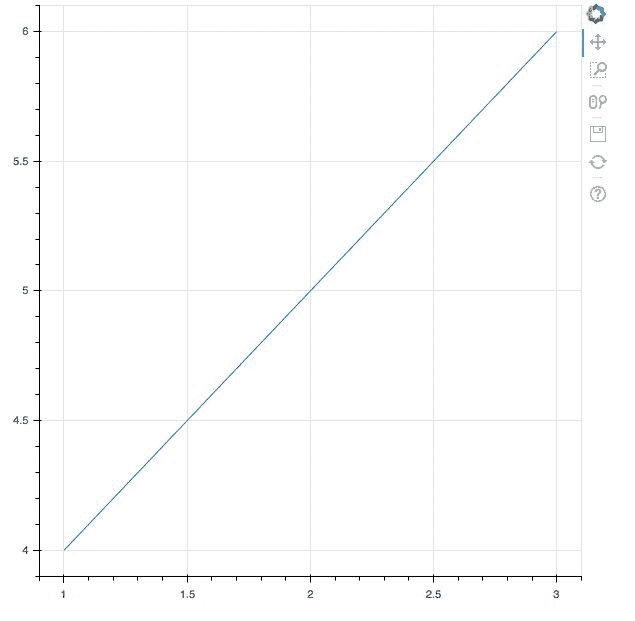

# 一、Bokeh 安装和关键概念

欢迎来到使用 Python 中流行的 Bokeh 库的交互式数据可视化世界。在本章中，您将了解以下主题:

*   Bokeh 到底是什么，它与其他绘图库有何不同
*   如何在本地计算机上安装 Bokeh
*   如何验证您的 Bokeh 安装
*   如果出了问题，你可以去哪里寻求帮助
*   关于 Bokeh 内部运作的一些关键概念

Bokeh 是 Python 中的一个交互式数据可视化库，帮助所有级别的用户可视化从小到大的数据集的简单和复杂数据。您可以使用 Bokeh 来创建交互式图表和应用，这些图表和应用面向普通公众、统计学家甚至商业领袖！

# 技术要求

您需要在系统上安装 Python。最后，为了使用本书的 Git 存储库，用户需要安装 Git。

本章的代码文件可以在 GitHub:
[https://GitHub . com/PacktPublishing/动手-数据-可视化-with-Bokeh](https://github.com/PacktPublishing/Hands-on-Data-Visualization-with-Bokeh) 上找到。

查看以下视频，了解代码的运行情况:

[http://bit.ly/2l0d7Cb](http://bit.ly/2l0d7Cb)。

# 静态绘图和交互式绘图的区别

在数据可视化领域，有三个主要的使用 Python 的库主导着市场，它们是:

*   Matplotlib
*   希伯恩
*   Bokeh

前两个，Matplotlib 和 Seaborn，让你绘制静态图——不变的图和无法交互的图。当执行探索性数据分析时，这些图很有用，并且增加了价值，因为它们快速且易于实现，并且执行速度非常快。

第三个绘图库 Bokeh 允许您绘制交互式绘图-当用户与其交互时会改变的绘图。当你想给你的观众提供广泛的选项和工具，从不同的角度推断和观察数据时，这些绘图非常有用。

# 安装 Bokeh 库

Bokeh 有一些依赖关系。为了使用 Bokeh，请确保已经安装了以下软件包:

*   NumPy
*   金耶 2
*   六
*   要求
*   龙卷风> = 4.0
*   皮亚米雅米雅米雅米雅米雅米雅米雅米雅米雅米雅米雅米雅米雅米雅米雅米雅米雅米雅米雅米雅米雅米雅米雅
*   日期使用

如果您正在使用 Python 2.7，请确保您拥有所有上述软件包以及:

*   期货

# 使用 Python 发行版安装 Bokeh

如果您已经使用诸如 **Anaconda** 之类的发行版安装和管理了所有 Python 包，您可以使用 Bash 终端或 Windows 提示符使用以下代码安装 Bokeh:

```py
conda install bokeh
```

您还可以通过以下代码使用 Python 2 的 PyPi 安装 Bokeh:

```py
pip install bokeh
```

您可以通过以下代码使用 Python 3 的 PyPi 安装 Bokeh:

```py
pip3 install bokeh
```

就本书而言，所有绘图都将使用 Bokeh 版本 0.12.15 进行渲染。如果您已经安装了 Bokeh 并需要更新，只需在您的终端或外壳中输入以下代码:

```py
sudo pip3 install bokeh --upgrade
```

# 验证您的安装

一旦安装了 Bokeh，您将需要验证它是否安装正确。为了验证安装并创建所有 Bokeh 图，您需要一个 Jupyter 笔记本。如果您之前不熟悉使用 Jupyter Notebook 或安装过，以下链接将为您提供如何安装和使用 Jupyter Notebook 的分步教程:[http://jupyter.org/install](http://jupyter.org/install)。

您可以使用带有以下代码的 Jupyter 笔记本生成一个简单的线图来验证 Bokeh 的安装:

```py
from bokeh.plotting import figure, output_file, show

#HTML file to output your plot into
output_file("bokeh.html")

#Constructing a basic line plot 

x = [1,2,3]
y = [4,5,6]

p = figure()

p.line(x,y)

show(p)
```

这将在您的浏览器上打开一个新的选项卡，图如下所示:



Don't worry too much about what the code does for now. If you have got the preceding plot, you should be satisfied that Bokeh has been successfully installed on your local machine.

# 当事情出错时

如果安装出现问题，您有以下两种选择:

*   Bokeh 邮寄名单([https://groups.google.com/a/anaconda.com/forum/#!forum/bokeh](https://groups.google.com/a/anaconda.com/forum/#!forum/bokeh) )是 Google 上的一个群，发布与 bokeh 相关的问题和查询，然后由定期使用该包的专家来回答。加入这个小组或者浏览它的常见问题会帮助你找到解决方案的答案。
*   也可以在 Bokeh GitHub 问题跟踪器([https://github.com/bokeh/bokeh/issues](https://github.com/bokeh/bokeh/issues))上提交问题；你的问题通常会在几个小时内，甚至几天内得到解决。

# Bokeh 的关键概念和构建模块

在阅读这本书的过程中，您会遇到一些对理解 Bokeh 包至关重要的术语。这一部分将带你浏览它们。

以下是与 Bokeh 相关的一些关键定义:

*   **应用**:Bokeh 应用是在浏览器中运行的渲染 Bokeh 文档
*   **字形**:字形是 Bokeh 的构造块，它们是你在 Bokeh 图上看到的线、圆、矩形和其他形状
*   **服务器**:**Bokeh 服务器用于向您选择的受众共享和发布互动绘图和应用**
***   **Widgets**:**Bokeh 中的 Widgets 是滑块、下拉菜单和其他小工具，你可以将它们嵌入到你的绘图中来增加一些交互性****

 ****# 绘制输出

有两种方法可以用来渲染您的绘图:

*   `output_file` : 此方法用于将您的绘图输出为`HTML`文件，可按以下代码所示使用:

```py
output_file('plot.html')
```

*   `output_notebook`:这是用来输出你目前正在制作的 Jupyter 笔记本中的绘图，可以按照下面的代码使用:

```py
output_notebook()
```

**接口**:

理解接口的第一步是理解什么是类和方法。把一个类想象成一个容器，把不同类型的饼干放在一起。在这种情况下，容器是类，而 cookie 是给容器一些功能的方法，在我们的情况下，作为 cookie 的容器。

因为 Python 是一种面向对象的编程语言，所以它使用类来将它一起创建的不同对象分组。

一个类本身是无用的，除非它有一些相关的功能。这些功能由方法提供给类。

Bokeh 提供了一个中级绘图界面，类似于`matplotlib`的界面，被称为`bokeh.plotting` **。**在`bokeh.plotting`界面中的主要类是`Figure`类，它包括了为一个图添加不同种类的字形的方法。

用户可以使用`figure`功能创建`Figure object`，如以下代码所示:

```py
from bokeh.plotting import figure

# create a Figure object
p = figure(plot_width=500, plot_height=400, tools="pan,hover")
```

在 Bokeh 中，`figure`函数，如前面的代码所示，用于初始化和存储您的绘图内容。前面代码中的变量 *p* 现在保存了关于绘图的信息，包括其高度、宽度和绘图将使用的工具类型。由于`figure`是我们的主类，所以可以在我们的图中添加线、圆等方法来创建图。

# 摘要

本章已经为您提供了在本地机器上安装 Bokeh 所需的一组确切步骤。它还让你一瞥在你阅读这本书的过程中会遇到的关键术语。

现在，Bokeh 已经成功安装在您的本地机器上，您可以打开一个新的 Jupyter 笔记本，与 Bokeh 一起在您的第一个绘图上工作！

在下一章中，你将学习如何使用字形创建你的第一个图；您将看到它如何为使用 Bokeh 进行绘图奠定基础。****