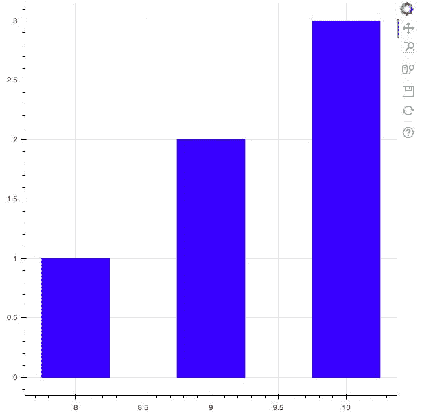

# 二、使用字形绘图

字形是 Bokeh 的基本构件，用于创建各种各样的绘图。事实上，您在使用 Bokeh 时构建的每个单独的绘图都有一个附加的字形机制，例如线条、矩形、圆形和组成绘图的任何其他对象。

在本章中，您将了解以下主题:

*   什么是字形
*   如何用字形绘图
*   如何使用字形创建散点图
*   如何自定义字形

# 技术要求

您需要在系统上安装 Python。最后，为了使用本书的 Git 存储库，用户需要安装 Git。

本章的代码文件可以在 GitHub:
[https://GitHub . com/PacktPublishing/动手-数据-可视化-with-Bokeh](https://github.com/PacktPublishing/Hands-on-Data-Visualization-with-Bokeh) 上找到。

查看以下视频，了解代码的运行情况:

[http://bit.ly/2sMGWdU](http://bit.ly/2sMGWdU)。

# 什么是字形？

当你看到一个绘图，不管是互动的还是非互动的，它通常是由构成绘图中每一个元素的几何形状组成的。在 Bokeh，这些几何形状被称为字形。如果我们想要创建一个线图，我们必须使用**线**来表示图上的信息，如果我们想要创建一个以圆为标记的散点图，我们将使用**圆**来表示该信息。

这些用于向读者传达关于数据的视觉信息的几何形状被称为字形。

在本书中，我们将帮助您使用字形绘制上述四种类型的图，我们还将为您提供使用字形绘制的各种类型的图的信息。

# 用字形绘图

在本节中，我们将学习如何使用字形绘制以下类型的图:

*   **线图**:线图提供了一种以直线的形式可视化沿着 *x-* 和 *y-* 轴的点的运动的方式。这些图对于执行时间序列分析非常有用。
*   **条形图**:条形图对于指示数据集中特定列或字段的每个类别的计数非常有用。
*   **面片图**:面片图用于指示特定色调的点区域。此类图可用于区分同一数据集中的不同组。
*   **散点图**:散点图用于可视化两个变量之间的关系，并指示它们之间的相关强度。

# 创建线图

我们可以使用以下代码在 Bokeh 中绘制一个简单的线图:

```py
#Importing the required packages

from bokeh.io import output_file, show

from bokeh.plotting import figure

#Creating our data arrays used for plotting the line plot

x = [5,6,7,8,9,10]

y = [1,2,3,4,5,6]

#Calling the figure() function to create the figure of the plot

plot = figure()

#Creating a line plot using the line() function

plot.line(x,y)

#Creating markers on our line plot at the location of the intersection between x and y

plot.cross(x,y, size = 15)

#Output the plot 

output_file('line_plot.html')

show(plot)
```

这导致如下所示的图:


在前面的代码中，我们首先调用了`figure()`函数，作为指示 Bokeh 构建图表的一种方式。一旦我们做到了这一点，我们就可以向图表中添加字形或几何形状的图层。

为了构建线图，我们首先在图中添加了`line()`字形，然后在线的顶部添加了`cross()`字形来标记 *x* 和 *y* 点之间的交点。

# 创建条形图

现在让我们看一下构建一个简单的酒吧绘图。我们可以使用以下代码来实现这一点:

```py
#Importing the required packages

from bokeh.plotting import figure, show, output_file

#Points on the x axis

x = [8,9,10]

#Points on the y axis

y = [1,2,3]

#Creating the figure of the plot

plot = figure()

#Code to create the barplot

plot.vbar(x,top = y, color = "blue", width= 0.5)

#Output the plot

output_file('barplot.html')

show(plot)
```

这导致如下所示的图:



在前面的代码中，我们使用了`vbar`，或者竖条函数来生成条形图。这包括四个参数，沿着 *x-* 轴的点:**顶部**参数，沿着 *y-* 轴的点，给你的图一个你选择的颜色的颜色参数，和宽度参数，你想要设置为 0.5 或 1，这取决于你想要在你的条之间的分离水平。此外，您可以使用`hbar`功能构建水平条形图。

# 创建面片图

面片图以特定颜色为空间区域着色，以指示具有相似属性的区域或组。我们可以使用以下代码构建一个简单的补丁图:

```py
#Importing the required packages

from bokeh.io import output_file, show

from bokeh.plotting import figure

#Creating the regions to map

x_region = [[1,1,2,], [2,2,3], [2,3,5,4]]

y_region = [[2,5,6], [3,6,7], [2,4,7,8]]

#Creating the figure

plot = figure()

#Building the patch plot

plot.patches(x_region, y_region, fill_color = ['yellow', 'black', 'green'], line_color = 'white')

#Output the plot

output_file('patch_plot.html')

show(plot)
```

这导致如下所示的图:


在前面的代码中，`x_region`和`y_region`被分为三个不同的区域。沿着 *x* 轴的【1，1，2】的第一个区域映射沿着 *y* 轴的【2，5，6】的对应区域，并被赋予黄色。沿着 *x* 轴的【2，2，3】的第二个区域映射了沿着 *y* 轴的【3，6，7】的对应区域，并被赋予黑色。沿着 *x-* 轴的【2，3，5，4】的第三个区域映射了沿着 *y* 轴的【2，4，7，8】的对应区域，并被赋予绿色。然后，我们使用`patches`函数，通过给它区域，以及每个区域的颜色作为参数来构建图。`line_color`参数用于为每个面片赋予边框颜色。

# 创建散点图

散点图是确定两个变量之间双变量关系最常用的图之一，因此当我们使用 Bokeh 向它们添加交互性时，这种关系会得到增强。为了使用 Bokeh 构建一个简单的散点图，我们可以使用以下代码:

```py
#Importing the required packages

from bokeh.io import output_file, show

from bokeh.plotting import figure

#Creating the figure

plot = figure()

#Creating the x and y points

x = [1,2,3,4,5]

y = [5,7,2,2,4]

#Plotting the points with a cirle marker

plot.circle(x,y, size = 30)

#Output the plot

output_file('scatter.html')

show(plot)
```

这导致如下所示的图:


在前面的代码中，我们使用圆形标记为每个圆形创建大小为 30 的散点图。圆圈表示 *x* 和 *y* 列表中的点之间的交点。

# 自定义字形

创建前面的散点图时，我们使用圆形标记来指示图上的点。Bokeh 为我们提供了各种各样的标记，您可以使用它们来代替圆圈，它们如下:

```py
- cross()
- x()
- diamond()
- diamond_cross()
- circle_x()
- circle_cross()
- triangle()
- inverted_triangle()
- square()
- square_x()
- square_cross()
- asterisk()
```

您也可以使用以下代码为*x*-和 *y* 轴添加标签:

```py
plot.figure(x_axis_label = "Label name of x axis", y_axis_label = "Label name of y axis")
```

您可以使用以下代码来自定义散点图上点的透明度:

```py
plot.circle(x, y, alpha = 0.5)
```

alpha 参数的取值范围在 0 到 1 之间，0 表示完全透明，1 表示不透明。

# 摘要

这一章已经给你介绍了什么是字形，以及如何使用它们来创建使用 Bokeh 的基本图。我们还研究了如何进一步定制这些图。

字形是 Bokeh 的基本构造块，为了在未来创建更复杂、更有统计意义的绘图，需要字形。

在本章中，您学习了如何使用字形创建四种不同的绘图。线图通常用于时间序列分析，条形图通常用于比较不同类别之间的计数，面片图通常用于突出显示一个区域的点，散点图通常用于映射两个或多个变量之间的关系。

在下一章中，我们将利用这些概念，并使用 NumPy 数组和 Pandas 数据帧绘制图表。