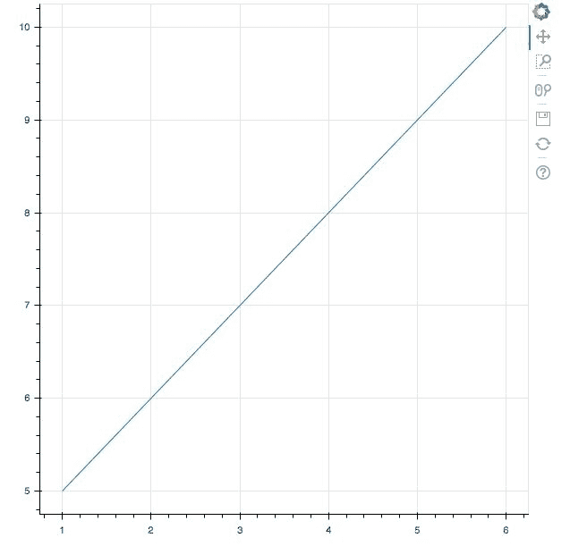
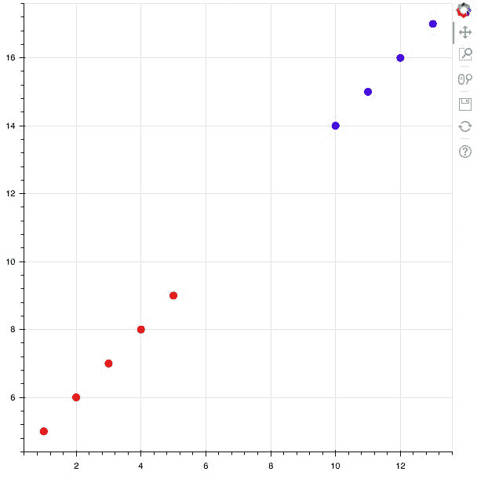
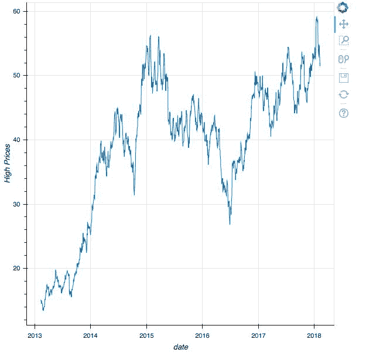
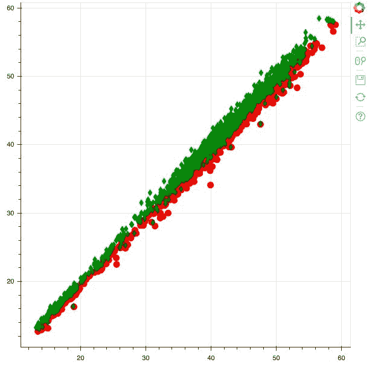
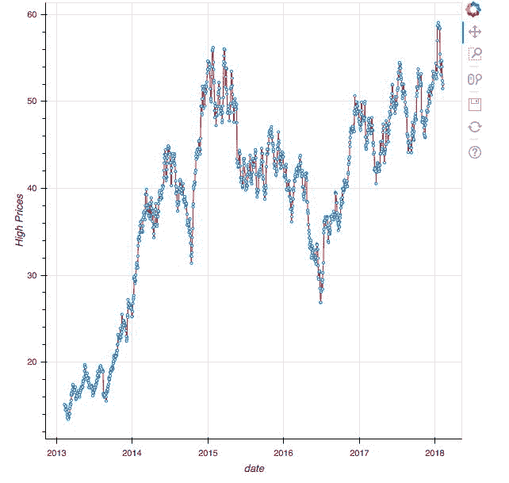
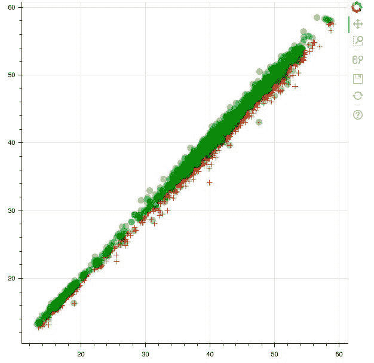

# 三、使用不同的数据结构绘图

现在，您已经学习了如何使用 Glyphs 从头开始构建可视化，我们可以扩展这个概念，并使用数据结构(如 NumPy 数组和熊猫数据框)构建绘图。

本章还将教你`ColumnDataSource`，Bokeh 库的核心本质，它将允许你通过多个图和小部件共享你的数据！

简而言之，您将获得在各种数据结构中使用 Bokeh 的实际经验，因为本章将带您了解:

*   使用 NumPy 数组创建绘图
*   用熊猫数据帧创建绘图
*   使用`ColumnDataSource`创建绘图

# 技术要求

您需要在系统上安装 Python。最后，为了使用本书的 Git 存储库，用户需要安装 Git。

本章的代码文件可以在 GitHub:
[https://GitHub . com/PacktPublishing/动手-数据-可视化-with-Bokeh](https://github.com/PacktPublishing/Hands-on-Data-Visualization-with-Bokeh) 上找到。

查看以下视频，了解代码的运行情况:

[http://bit.ly/2MjrvSm](http://bit.ly/2MjrvSm)。

# 使用 NumPy 数组创建绘图

NumPy 数组是 Python 中最基本的数据结构之一，因此在 Bokeh 中创建交互式可视化时是一种重要的数据结构。在本节中，我们将介绍如何使用 NumPy 阵列构建直线和散点图。

# 使用 NumPy 数组创建线图

为了使用 NumPy 数组创建简单的线图，我们可以使用以下代码:

```py
#Import required packages

import numpy as np
import random
from bokeh.io import output_file, show
from bokeh.plotting import figure

#Creating an array for the points along the x and y axes

array_x =np.array([1,2,3,4,5,6])

array_y = np.array([5,6,7,8,9,10])

#Creating a line plot

plot = figure()

plot.line(array_x, array_y)

#Output the plot

output_file('numpy_line.html')

show(plot)
```

这将绘制如下图所示的图:



在前面的代码中，我们创建了两个 NumPy 数组来保存沿着 *x* 轴和 *y* 轴的点。然后，我们使用我们在上一章中学习的常规 Bokeh 函数调用来构建线图。

# 使用 NumPy 数组创建散点图

为了使用 NumPy 数组创建散点图，我们使用如下所示的代码:

```py
#Import required packages

import numpy as np
import random
from bokeh.io import output_file, show
from bokeh.plotting import figure

#Creating arrays for two different categories of points

x_red = np.array([1,2,3,4,5])
y_red = np.array([5,6,7,8,9])

x_blue = np.array([10,11,12,13])
y_blue = np.array([14,15,16,17])

#Creating the categorical scatter plot 

plot = figure()

plot.circle(x_red, y_red, size = 9, color = 'red', alpha = 0.8)
plot.circle(x_blue, y_blue, size = 9, color = 'blue', alpha = 0.8)

#Output the plot 

output_file('numpy_scatter.html')

show(plot)
```

这将产生如下图所示的图:



在前面的代码中，我们创建了两组不同的点:红色组和蓝色组。每组都有自己的一组 *x* 和 *y* 点，它们是 NumPy 数组。然后，我们通过相应地给每个组着色来创建散点图。

现在，您可以在散点图上看到两组不同的彩色点。这些图对于可视化分类数据非常有用。

# 使用熊猫数据帧创建绘图

您将使用的大部分数据将以 CSV 或 Excel 格式提供，因此您将不可避免地将它们转换为熊猫数据框，以便有效地使用它们。Bokeh 扩展了它的功能，帮助我们使用 Python 中的熊猫数据框架构建交互式但有意义的绘图。在本节中，我们将使用熊猫数据框构建散点图和时间序列图。

在本节中，我们将使用一个关于卡格勒上的股票市场的流行数据集，该数据集可通过以下链接访问:卡格勒标准普尔 500 股票数据([https://www.kaggle.com/camnugent/sandp500/data](https://www.kaggle.com/camnugent/sandp500/data))。

作为第一步，让我们将数据集加载到 Jupyter 笔记本中。我们可以使用这里显示的代码来实现这一点:

```py
#Importing the required packages

import pandas as pd

#Read in the data

df = pd.read_csv('all_stocks_5yr.csv')

#Filtering for apple stocks

df_apple = df[df['Name'] == 'AAL']

#Converting the date column to a time series

df_apple['date'] = pd.to_datetime(df_apple['date'])
```

在前面的代码中，我将从 Kaggle 下载的文件保存为`all_stocks_5yr.csv`，并使用 pandas 将其加载到 Jupyter Notebook 中。然后我过滤了股票，创建了一个新的数据框架，其中只有苹果的股票信息。

# 使用熊猫数据框创建时间序列图

时间序列图显示了数据集中的点在一定时间内是如何变化的。时间通常沿着 *x-* 轴绘制，而感兴趣的点在 *y* 轴上。

我们现在将创建一个时间序列图，以便通过使用这里显示的代码来可视化苹果股票的`High Prices`在 5 年期间是如何变化的:

```py
#Import the required packages

from bokeh.io import output_file, show
from bokeh.plotting import figure
import pandas as pd

#Read in the data

df = pd.read_csv('all_stocks_5yr.csv')

#Filtering for apple stocks

df_apple = df[df['Name'] == 'AAL']

#Converting the date column to a time series

df_apple['date'] = pd.to_datetime(df_apple['date'])

#Create the time series plot

plot = figure(x_axis_type = 'datetime', x_axis_label = 'date', y_axis_label = 'High Prices')

plot.line(x = df_apple['date'], y = df_apple['high'])

#Output the plot

output_file('pandas_time.html')

show(plot)
```

这将产生如下图所示的图:



在前面的代码中，我们必须在`figure`功能中将 *x* 轴类型设置为`datetime`，以便沿 *x* 轴渲染日期。然后，我们使用线函数来生成过去 5 年中苹果的日期和高价之间的时间序列图。

# 使用熊猫数据框创建散点图

为了在低价和高价之间创建散点图，以及在同一图中呈现的开盘价和收盘价，我们使用这里显示的代码:

```py
#Import the required packages

from bokeh.io import output_file, show
from bokeh.plotting import figure

#Create the scatter plot

plot = figure()

plot.circle(x = df_apple['high'], y = df_apple['low'], color = 'red', size = 10, alpha = 0.8)

plot.diamond(x = df_apple['open'], y = df_apple['close'], color = 'green', size = 10, alpha = 0.8)

#Output the plot

output_file('pandas_scatter.html')

show(plot)
```

这将产生如下图所示的图:



在之前的绘图中，红色的圆圈代表苹果价格高低的关系，绿色的钻石代表开盘价和收盘价的关系。我们使用`circle`函数在高、低价格之间创建红色圆圈，而使用`diamond`函数在开盘价和收盘价之间创建绿色钻石。

# 使用列数据源创建绘图

`ColumnDataSource`为我们提供了一种跨多个图和小部件使用相同数据的方法。通过将数据输入`ColumnDataSource`，你就建立了一个可以随时调用的数据基础，而不是将数据多次加载到你的 Jupyter 笔记本中。

基本上，`ColumnDataSource`创建一个字典，其中值是包含在列中的数据，键是您为该特定列指定的字符串名称。

# 使用列数据源创建时间序列图

为了使用`ColumnDataSource`构建时间序列图，我们使用以下代码:

```py
#Import the required packages

from bokeh.io import output_file, show
from bokeh.plotting import figure
from bokeh.plotting import ColumnDataSource

#Create the ColumnDataSource object

data = ColumnDataSource(df_apple)

#Create the time series plot

plot = figure(x_axis_type = 'datetime', x_axis_label = 'date', y_axis_label = 'High Prices')

plot.line(x = 'date', y = 'high', source = data, color = 'red')

plot.circle(x = 'date', y = 'high', source = data, fill_color = 'white', size = 3)

#Output the plot

output_file('CDS_time.html')

show(plot)
```

这将产生如下图所示的图:



该图向我们展示了苹果股票的高价格在 5 年期间是如何变化的，蓝色圆圈表示股票的每个价格点。

创建此图时，我们将整个苹果股票数据框传递到`ColumnDataSource`函数，并将其保存到名为`data`的变量中。

然后，我们在创建图时使用了源参数，并在此传递了`data` *。*我们现在可以在创建绘图时直接使用列名，而不是调用数据框。

最后，我们使用圆函数生成带有白色填充的蓝色圆来表示各个数据点。

# 使用列数据源创建散点图

使用`ColumnDataSource`的另一种方法是传入数据，如代码所示:

```py
#Import the required packages

from bokeh.io import output_file, show
from bokeh.plotting import figure
from bokeh.models import ColumnDataSource

#Create the ColumnDataSource object

data = ColumnDataSource(data = {
    'x' : df_apple['high'],
    'y' : df_apple['low'],
    'x1': df_apple['open'],
    'x2': df_apple['close'],

})

#Create the scatter plot

plot = figure()

plot.cross(x = 'x', y = 'y', source = data, color = 'red', size = 10, alpha = 0.8)

plot.circle(x = 'x1', y = 'x2', source = data, color = 'green', size = 10, alpha = 0.3)

#Output the plot

output_file('CDS_scatter.html')

show(plot)
```

这将产生如下图所示的图:



在前面的代码中，我们将数据框的列映射为字典中的值，该字典由键值对组成，键是您选择的字符串名称，值是数据框的列。

然后，我们将该字典作为`ColumnDataSource`函数的`data` 参数的值传递。最后，在创建圆形和交叉散点图时，字典的关键字被传递到 *x* 和 *y* 参数中。

# 摘要

本章向您介绍了使用 Python 时会遇到的最常见的数据格式，以及如何使用这些格式在 Bokeh 中创建可视化。

您还学习了如何使用`ColumnDataSource`将列名映射到数据值列表，该列表可用于多个图和小部件。

在接下来的一章中，你将学习如何使用布局，通过熊猫数据帧构建的图来有效地展示数据。