# 四、将布局用于有效演示

在绘制多个图时，最好总是使用布局，以便并排显示图，或者在彼此的顶部垂直显示图，以便在两个图之间进行统计比较，同时使它们具有视觉吸引力。

使用 Bokeh 创建绘图时，有效地使用布局、选项卡和网格也将允许您通过使用相同的轴将多个绘图链接在一起。这使得多个图的比较比您在 Jupyter 笔记本的单独单元格中创建图要精确得多。

在本章中，您将学习如何:

*   沿同一行创建多个绘图
*   沿同一列创建多个图
*   在行和列中创建多个图
*   使用选项卡式布局创建多个绘图
*   创建健壮的网格布局
*   将多个绘图链接在一起

# 技术要求

您需要在系统上安装 Python。最后，为了使用本书的 Git 存储库，用户需要安装 Git。

本章的代码文件可以在 GitHub:
[https://GitHub . com/PacktPublishing/动手-数据-可视化-with-Bokeh](https://github.com/PacktPublishing/Hands-on-Data-Visualization-with-Bokeh) 上找到。

查看以下视频，了解代码的运行情况:

[http://bit.ly/2sOMTab](http://bit.ly/2sOMTab)。

# 沿同一行创建多个绘图

为了沿着同一行创建多个图，让我们首先创建三个唯一的图。我们将使用在卡格尔([https://www.kaggle.com/camnugent/sandp500/data](https://www.kaggle.com/camnugent/sandp500/data))上找到的标准普尔 500 股票数据。

第一步是读取数据并对其进行过滤，以便我们只使用与 Apple 相关的数据，如下所示:

```py
#Import the required packages

import pandas as pd

#Read in the data

df = pd.read_csv('all_stocks_5yr.csv')

#Convert the date column into datetime data type

df['date'] = pd.to_datetime(df['date'])

#Filter the data for Apple stocks only

df_apple = df[df['Name'] == 'AAL']
```

接下来，让我们使用如下所示的代码构建三个独特的图:

```py
#Import the required packages

from bokeh.io import output_file, show
from bokeh.plotting import figure
from bokeh.plotting import ColumnDataSource

#Create the ColumnDataSource object

data = ColumnDataSource(data = {
    'x' : df_apple['high'],
    'y' : df_apple['low'],
    'x1': df_apple['open'],
    'y1': df_apple['close'],
    'x2': df_apple['date'],
    'y2': df_apple['volume'],

})

#Create the first scatter plot

plot1 = figure()

plot1.cross(x = 'x', y = 'y', source = data, color = 'red', size = 10, alpha = 0.8)

#Create the second scatter plot

plot2 = figure()

plot2.circle(x = 'x1', y = 'y1', source = data, color = 'green', size = 10, alpha = 0.3)

#Create the third scatter plot

plot3 = figure(x_axis_type = 'datetime', x_axis_label = 'date', y_axis_label = 'Volume Traded')

plot3.line(x = 'x2', y = 'y2', source = data, color = 'red')

plot3.circle(x = 'x2', y = 'y2', source = data, fill_color = 'white', size = 3)

```

在前面的代码中，为了映射所有感兴趣的变量，我们创建了一个`ColumnDataSource`对象。

第一个散点图位于苹果的高价格和低价格之间，可以使用这里显示的代码显示:

```py
#Output the plot

output_file('first_plot.html')

show(plot1)
```

这将产生如下图所示的图:

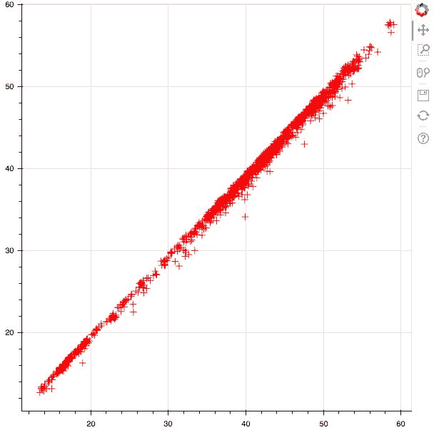

第二个图位于苹果的开盘价和收盘价之间，可以使用以下代码显示:

```py
#Output the plot

output_file('second_plot.html')

show(plot2)
```

这将产生如下图所示的图:

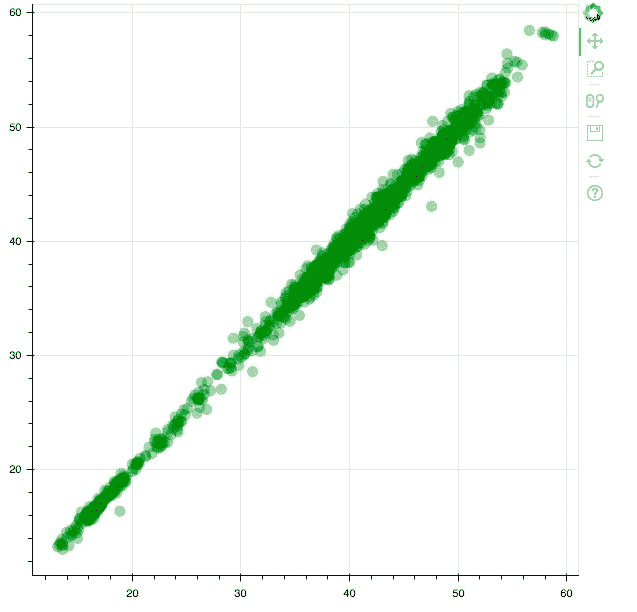

第三个图是 5 年期间苹果股票交易量之间的时间序列图。我们可以使用下面显示的代码显示该图:

```py
#Output the plot

output_file('third_plot.html')

show(plot3)
```

这将产生如下图所示的图:

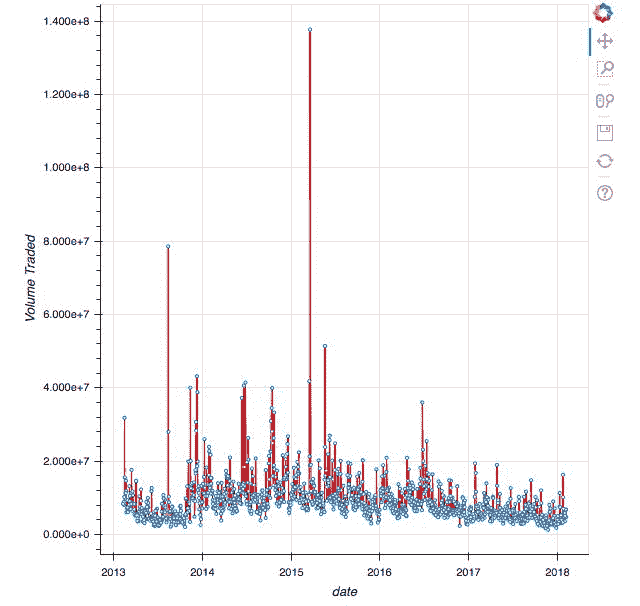

请注意，为了查看三个图，我们必须创建三个单独的输出。当我们想要并排查看三个图以便快速简单地比较所有三个图时，这对我们不利。

为了绘制水平行中的三个图，我们使用如下所示的代码:

```py
#Import the required packages

from bokeh.layouts import row
from bokeh.io import output_file, show

#Group the 3 plots into a 'row' layout

row_layout = row(plot1,plot2,plot3)

#Output the plot

output_file('horizontal.html')

show(row_layout)
```

这将产生如下图所示的图:

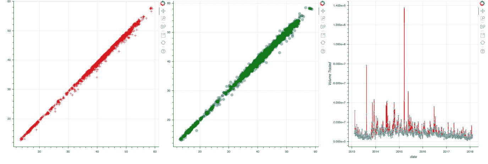

Plots 1, 2, and 3 in a horizontal layout

我们现在可以观察到，三个绘图以水平方式并排堆叠在一起。在前面的代码中，我们使用了*行*函数，该函数将我们之前创建的图作为参数，以便水平绘制三个图形。

# 在同一列中创建多个图

在本节中，您将学习如何将多个图垂直堆叠在一起，以创建图的列式比较。我们将使用本章前面创建的两个散点图来实现这一点。

为了创建绘图的垂直布局，我们使用如下所示的代码:

```py
#Import the required packages

from bokeh.layouts import column
from bokeh.io import output_file, show

#Group the 2 plots into a 'column' layout

col_layout = column(plot1,plot2)

#Output the plot

output_file('vertical.html')

show(col_layout)
```

这导致了图的布局，如下图所示:

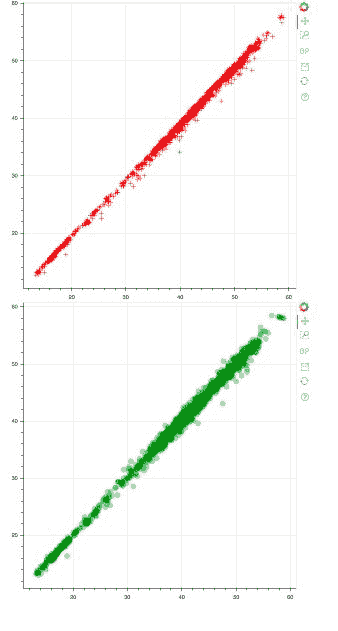

Plots 1 and 2 in a vertical layout

在前面的代码中，我们使用了`column`函数，该函数将我们想要垂直堆叠的图作为输入参数，以创建图的垂直布局。这创建了散点图的垂直布局，我们现在可以使用它进行比较。

# 在行和列中创建多个图

我们可能会看到这样一种情况，即我们希望水平比较两个散点图，但希望时间序列图与散点图堆叠在一起，但都在同一布局的范围内。

这种水平和垂直布局的组合称为嵌套布局。

我们可以使用下面显示的代码构建嵌套布局:

```py
#Import the required packages

from bokeh.layouts import column, row
from bokeh.io import output_file, show

#Construct the nested layout

nested_layout = column(row(plot1,plot2), plot3)

#Output the plot

output_file('nested.html')

show(nested_layout)
```

这将产生如下图所示的图:

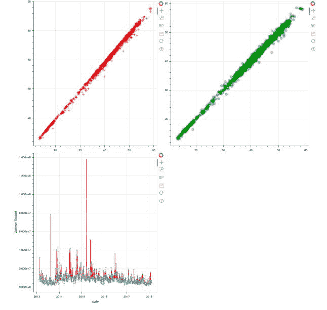

Plots 1, 2, and 3 in a nested layout

在前面的代码中，我们使用行函数将图 1 和图 2 组合成一个水平行，然后在散点图和图 3 的水平组合上使用列函数。

这生成了一个嵌套布局，散点图并排，而时间序列图在这里是一个独立的实体。嵌套布局提供了一种有效的方法，可以将特定的图组分成行和列，从而通过有效的比较帮助我们理解数据。

# 使用选项卡式布局创建多个绘图

有时，一次查看一个绘图，但在同一空间中有多个绘图可能更有效。这可以通过使用 Bokeh 提供的选项卡式布局来实现。使用选项卡式布局，每个图都存储在一个选项卡中，只需单击该选项卡即可访问。

我们将使用与前面部分相同的三个图来构建选项卡式布局。

为了在选项卡式布局中创建图，我们可以使用这里显示的代码:

```py
#Import the required packages

from bokeh.models.widgets import Tabs, Panel
from bokeh.io import output_file, show
from bokeh.layouts import column, row

#Create the two panels 

tab1 = Panel(child = plot1, title = 'Tab One')

tab2 = Panel(child = column(plot2,plot3), title = 'Tab Two')

#Feed the tabs into a Tabs object

tabs_object = Tabs(tabs = [tab1, tab2])

#Output the plot

output_file('tab_layout.html')

show(tabs_object)
```

这将产生一个选项卡式布局，如下所示:

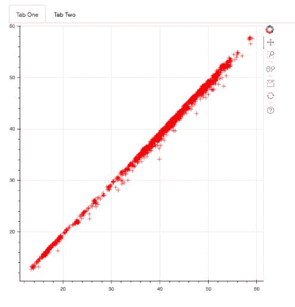

Plot 1 in a tabbed layout

在前面的代码中，我们首先使用`Panel`函数创建了两个面板。每个面板都由自己的一组图组成，这些图是使用`Panel`函数中的`child`参数指定的。

然后，我们使用`Tabs`函数创建了一个标签对象，方法是将面板传递给`tabs`参数。

在前面的图中，我们现在在标签一上，它由一个散点图组成。如果我们单击选项卡二，我们将在垂直布局中看到图 2 和图 3，如下图所示:

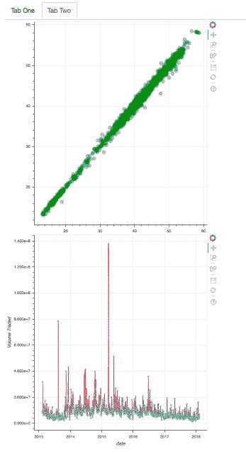

Plot 2 and Plot 3 in a vertical layout

如果我们希望轻松地将所有图集中在一个位置，但同时又希望查看单个图或一组图，而又不想让所有图在屏幕上杂乱无章，那么使用选项卡式布局会非常有效。

# 创建健壮的网格布局

网格布局结合了行、列和嵌套布局，允许您水平、垂直或水平和垂直创建绘图。使用网格布局更加健壮，因为该布局提供了在单个屏幕中将多个图堆叠在一起的组合的多功能性。

为了构建一个网格布局，我们将使用与前面几节中相同的三个图。

我们可以使用下面显示的代码创建嵌套网格布局:

```py
#Import required packages

from bokeh.io import output_file, show
from bokeh.layouts import gridplot

#Create the grid layout

grid_layout = gridplot([plot1, plot2], [plot3, None])

#Output the plot

output_file('grid.html')

show(grid_layout)
```

这将产生如下所示的网格布局:

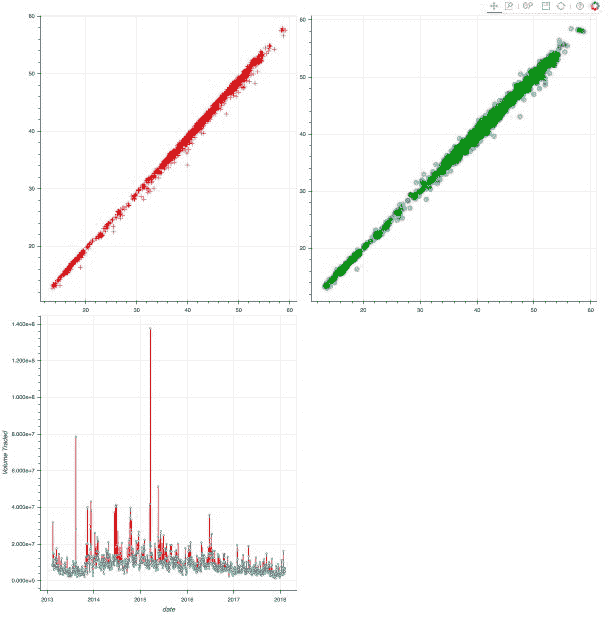

Creating a nested layout using the grid layout

在前面的代码中，我们使用了`gridplot`函数来创建图的网格，如前所述。我们将`plot1`和`plot2`作为列表传入`gridplot`功能，表示我们希望 p `lot 1`和`plot2`水平显示在第一行。然后我们将`plot3`和`None`作为第二个列表传递给`gridplot`函数，以表明我们想要`plot3`，并且第二行中没有水平显示的图。

# 将多个绘图链接在一起

有时，我们可能希望我们的图沿着 *x-* 和/或 *y-* 轴具有相同的值范围，以便于对不同图中相同范围的点进行有意义的比较。

我们将与`plot1`、`plot2,`和`plot3`合作，如之前章节所述。

为了沿着 *y-* 轴创建具有相同范围的多个图，我们使用如下所示的代码:

```py
#Import the required packages

from bokeh.io import output_file, show
from bokeh.layouts import row

#Creating equal y axis ranges

plot3.y_range = plot1.y_range

#Create the row layout

row_layout = row(plot3, plot1)

#Output the plot

output_file('grid.html')

show(row_layout)
```

这将产生如下图所示的绘图布局:

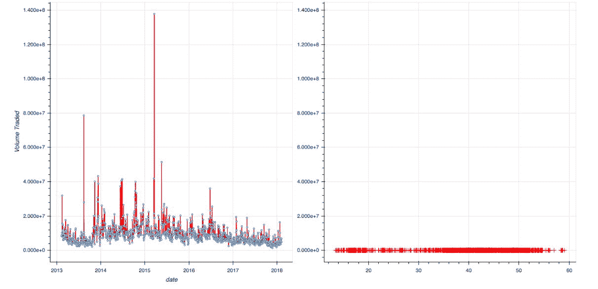

Plots 1 and 3 linked together by the same *y *axis range as plot 3

在前面的代码中，我们给了`plot1`与`plot3`相同的 *y* 范围。在生成的图表中，您可以观察到`plot3`和`plot1`如何具有完全相同的 *y-* 轴范围。您还可以看到，使用`plot1`，由于其 *y* 轴范围的变化，最初非常线性的散点图变成了水平线。这是因为`plot1`最初的 *y-* 轴范围在 0 到 60 之间，但是现在它采用了`plot3`的 *y-* 轴范围，这是一个在 10^7 范围内的值，该图的形状也发生了巨大的变化。

我们可以使用此处显示的代码沿 *x-* 轴创建多个范围相同的图:

```py
#Import the required packages

from bokeh.io import output_file, show
from bokeh.layouts import row

#Creating equal x-axis ranges

plot2.x_range = plot1.x_range

#Create the row layout

row_layout = row(plot2, plot1)

#Output the plot

output_file('row.html')

show(row_layout)
```

这将产生如下图所示的行布局:

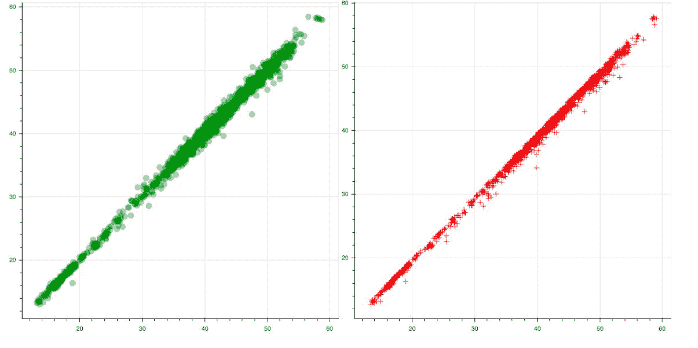

Plots 1 and 2 linked together using the same *x*-axis range as Plot 2

将多个绘图链接在一起时，需要注意的最重要的一点是 *x* -/ *y-* 轴中的数据类型必须相同。例如，沿 *x-* 轴链接两个绘图，其中一个绘图沿 *x-* 轴具有日期(时间戳)类型，而另一个绘图具有数字，这种方法不可行。

# 摘要

本章让您深入了解了如何在 Bokeh 中使用布局来最大限度地发挥您的绘图带来的影响，包括统计和视觉效果。

您学习了如何在水平布局、垂直布局和嵌套布局中创建绘图。您还学习了如何使用网格布局作为将水平和垂直布局组合在一起的更有效的方法。

独立布局需要更多的代码行才能在同一个图像中水平和垂直堆叠图，而网格布局只需一行代码就可以做到这一点，是在不同布局配置中将多个图堆叠在一起的更有效方法。

创建选项卡以减少混乱，并将多个图链接在一起以改进数据点的比较研究，现在这些都在您位于 Bokeh 的工具带上。

在下一章中，您将学习如何使用注释、小部件和属性来增强您到目前为止创建的绘图的视觉效果，这些将为您的绘图增加一个交互性的世界！