# 五、使用标注、小部件和视觉属性进行视觉增强

现在您已经学习了如何在 Bokeh 中创建图和布局，是时候在视觉上增强它们，并使用标注、小部件和视觉属性添加一层交互性了。

标注用于向您的绘图添加补充信息，例如标题、图例和彩色地图，它们提供了有关绘图试图向查看您的绘图的人传达的信息。

小部件通过按钮、下拉菜单、滑块和文本框提供交互性。这些小部件允许观看绘图的人与绘图互动，并改变他或她想要观看的方式。

视觉属性为绘图提供了大量的视觉增强，例如线条和文本的颜色和填充，以及交互性增强，例如悬停工具，用于悬停和选择感兴趣的点。

在本章中，您将学习如何创建:

*   传达绘图补充信息的标注
*   为绘图增加互动性的小部件
*   增强绘图风格和互动性的视觉属性

# 技术要求

您需要在系统上安装 Python。最后，为了使用本书的 Git 存储库，用户需要安装 Git。

本章的代码文件可以在 GitHub:
[https://GitHub . com/PacktPublishing/动手-数据-可视化-with-Bokeh](https://github.com/PacktPublishing/Hands-on-Data-Visualization-with-Bokeh) 上找到。

查看以下视频，了解代码的运行情况:

[http://bit.ly/2sYn4DN](http://bit.ly/2sYn4DN) 。

# 创建标注以传达补充信息

在创作绘图时，最基本的是要理解绘图中的信息试图传达的故事。这可以通过在你的绘图中添加标题、图例和彩色地图来完成。

# 向绘图添加标题

标题是用来告诉读者整个故事绘图的。

为了本章的目的，我们将使用卡格尔网站上的标准普尔 500 股票数据。([https://www.kaggle.com/camnugent/sandp500/data](https://www.kaggle.com/camnugent/sandp500/data))。

我们还将过滤数据，只显示有关苹果股票的信息，如以下代码所示:

```py
#Import the required packages

import pandas as pd

#Read in the data

df = pd.read_csv('all_stocks_5yr.csv')

#Convert the date column into datetime data type

df['date'] = pd.to_datetime(df['date'])

#Filter the data for Apple stocks only

df_apple = df[df['Name'] == 'AAL']
```

我们现在将使用这里显示的代码将所需的数据存储在一个`ColumnDataSource`对象中:

```py
#Import the required packages

from bokeh.io import output_file, show
from bokeh.plotting import figure
from bokeh.plotting import ColumnDataSource

#Create the ColumnDataSource object

data = ColumnDataSource(data = {
    'x' : df_apple['high'],
    'y' : df_apple['low'],
    'x1': df_apple['open'],
    'y1': df_apple['close'],
    'x2': df_apple['date'],
    'y2': df_apple['volume'],

})
```

为了给我们的绘图增加一个标题，我们使用了如下所示的代码:

```py
#Import the required packages

from bokeh.plotting import figure, show, output_file, output_notebook

#Create the plot with the title

plot = figure(title = "5 year time series distribution of volume of Apple stocks traded",title_location = "above",x_axis_type = 'datetime', x_axis_label = 'date', y_axis_label = 'Volume Traded')

#Create the time series plot

plot.line(x = 'x2', y = 'y2', source = data, color = 'red')

plot.circle(x = 'x2', y = 'y2', source = data, fill_color = 'white', size = 3)

#Output the plot

output_file('title.html')

show(plot)

```

这将产生一个标题图，如下图所示:

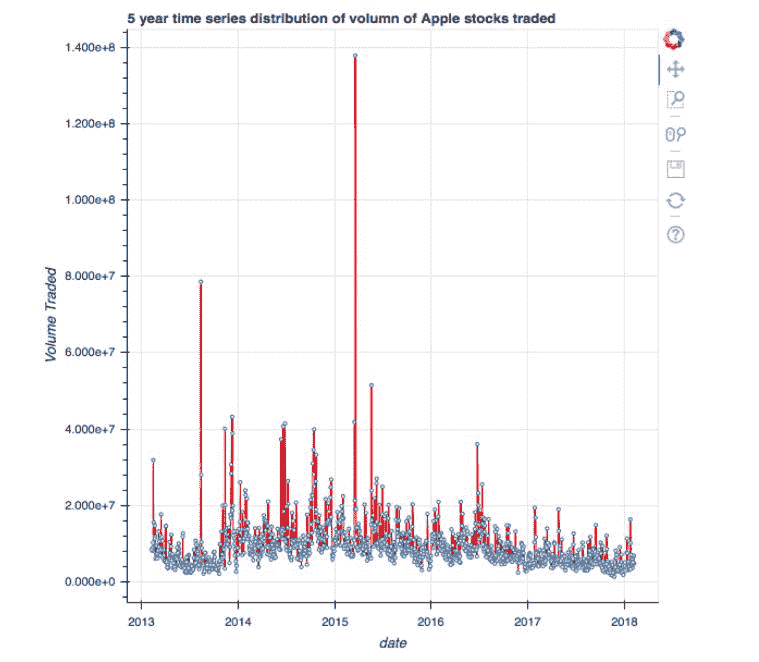

在这段代码中，我们使用了`figure` 函数，以便使用`title`参数生成标题。此外，我们还可以使用`title_location`参数指定标题的位置。标题的不同位置是`above`、`left`、`right`和`below`。

# 向图中添加图例

当我们有一个绘图，其中有不同的可视化不同的颜色，这是很重要的读者能够区分不同的颜色。这可以通过在我们的绘图中加入一个传说来实现。

在下面的代码中，我们在同一个图中绘制了两个不同的散点图，但颜色不同。我们使用下面显示的代码为每个散点图添加一个图例:

```py
#Import the required packages

from bokeh.plotting import figure, show, output_file

#Create the two scatter plots

plot = figure()

#Create the legends

plot.cross(x = 'x', y = 'y', source = data, color = 'red', size = 10, alpha = 0.8, legend = "High Vs. Low")

plot.circle(x = 'x1', y = 'y1', source = data, color = 'green', size = 10, alpha = 0.3, legend = "Open Vs. Close")

#Output the plot

output_file('legend.html')

show(plot)
```

这将产生一个带有图例的图，如下图所示:

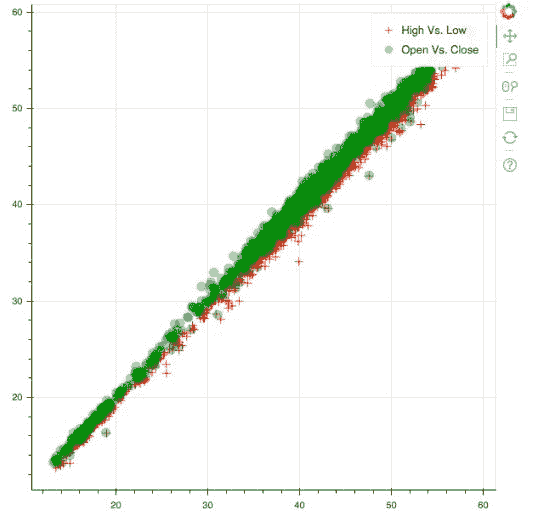

在这段代码中，我们在创建单个散点图时使用了`legend`参数来指定该特定图的图例。多亏了这个传说，我们现在可以清楚地区分绿色散点图和红色散点图的含义。

# 向绘图添加彩色地图

当我们有分类数据时，用不同的颜色给不同的类别着色是一个很好的做法，这样读者就可以清楚地看到不同的颜色表示不同的类别。

为了做到这一点，我们首先使用这里显示的代码过滤两个股票的`S&P 500`股票数据:谷歌和 USB:

```py
#Reading in the S&P 500 data

df = pd.read_csv('all_stocks_5yr.csv')

#Filtering for Google or USB

df_multiple = df[(df['Name'] == 'GOOGL') | (df['Name'] == 'USB')]
```

接下来，我们将在`high`和`low`之间创建一个散点图，并使用这里显示的代码用不同的颜色对谷歌股票和通用串行总线股票进行分类着色:

```py
#Import the required packages

from bokeh.models import CategoricalColorMapper

#Store the data in the ColumnDataSource object

data = ColumnDataSource(df_multiple)

#Create the mapper 

category_map = CategoricalColorMapper(
    factors = ['GOOGL', 'USB'], palette = ['blue', 'red'])

#Plot the figure

plot = figure()

plot.circle('high', 'low', size = 8, source = data, color = {'field': 'Name', 'transform': category_map})

#Output the plot

output_file('category.html')

show(plot)
```

这将产生如图所示的图:

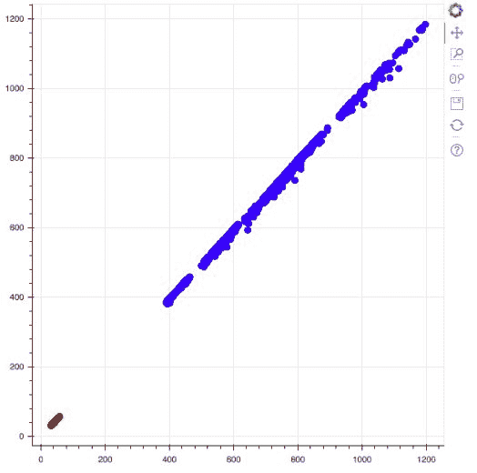

从绘图来看，很明显蓝色和红色这两种颜色分别代表了谷歌和 USB 股票。

在这段代码中，我们使用`CategoricalColorMapper`函数为每只股票指定一种特定的颜色。然后，我们在创建图时使用`color`参数来构建包含类别的`field`或列的字典，以及我们用`CategoricalColorMapper` *创建的类别地图。*

# 创建小部件来增加绘图的互动性

Bokeh 最独特的功能之一是能够添加小部件，为绘图增加交互性。小部件允许用户通过选择、点击按钮和在文本框中输入来改变他们想要看到的内容。在本节中，您将了解 Bokeh 可以添加到工具带的所有小部件。

这里给出了创建和输出任何类型的小部件所需的两个导入:

```py
from bokeh.io import output_file, show
from bokeh.layouts import widgetbox
```

# 创建按钮小部件

按钮允许用户点击并进行选择。我们可以使用下面显示的代码在 Bokeh 中创建一个按钮小部件:

```py
#Import the required packages

from bokeh.models.widgets import Button

#Create the button widget

button_widget = Button(label="Click this")

#Output the button

output_file("button_widget.html")

show(widgetbox(button_widget))
```

这将创建一个按钮，如下图所示:

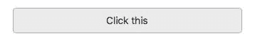

在这段代码中，我们使用`Button` 功能创建了一个按钮，其文本为点击此处。

# 创建复选框小部件

复选框允许用户进行一个或多个选择。当一个图有多个类别和/或可视化时，它们通常用于选择单个或多个类别/图。

为了在 Bokeh 中创建一个简单的复选框，请使用下面显示的代码:

```py
#Import the required packages

from bokeh.models.widgets import CheckboxGroup

#Create the checkbox

checkbox_widget = CheckboxGroup(
        labels=["box: 1", "box: 2", "box:3"], active=[1,2])

#Output the checkbox

output_file("checkbox_widget.html")

show(widgetbox(checkbox_widget))
```

这将导致复选框的创建，如下所示:

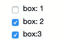

在这段代码中，我们使用了`CheckboxGroup` 功能来创建三个类别。`active`参数用于指定创建复选框时三个类别中的哪一个应保持选中状态。在这种情况下，我们在创建时将`active`配置为复选框 2 和 3。

# 创建下拉菜单小部件

下拉菜单可用于从用户可用的众多选项中进行选择。要构建下拉菜单，请使用下面显示的代码:

```py
#Import the required packages

from bokeh.models.widgets import Dropdown

#Create the menu

menu_widget = [("menu option 1", "1"), ("menu option 2", "2")]

#Create the Dropdown

menu_dropdown = Dropdown(label="Dropdown Menu", menu=menu_widget)

#Output the dropdown menu

output_file("dropdown.html")

show(widgetbox(menu_dropdown))
```

这将创建一个下拉菜单，如下图所示:

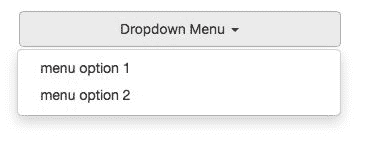

在这段代码中，我们首先创建了一个将出现在下拉菜单中的名称列表。然后，我们通过使用`Dropdown` 功能并通过将菜单列表传递给`menu`参数来创建下拉菜单。

# 创建单选按钮小部件

单选按钮限制用户只能选择一个选项，而不是复选框等多个选项。当多次选择导致错误时，此类按钮非常有用。要构建单选按钮，请使用此处显示的代码:

```py
#Import the required packages

from bokeh.models.widgets import RadioGroup

#Create the radio button 

radio_button_widget = RadioGroup(
        labels=["First Radio Button", "Second Radio Button"], active=0)

#Output the radio button widget

output_file("radiobutton_widget.html")

show(widgetbox(radio_button_widget))
```

这将创建一个单选按钮，如下图所示:

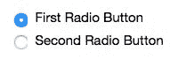

在这段代码中，我们使用`RadioGroup`功能来创建单选按钮。`labels`参数用于指定按钮的名称，而`active`参数用于指定默认选择哪个按钮。

# 创建滑块小部件

滑块用于增加或减少您可能想要在绘图中查看的设定点数或区域。为了在 Bokeh 中构建一个简单的滑块小部件，请使用下面显示的代码:

```py
#Import the required packages

from bokeh.models.widgets import Slider

#Create the slider widget

slider_widget = Slider(start=0, end=50, value=0, title="Simple Slider", step = 5)

#Output the slider

output_file("slider_widget.html")

show(widgetbox(slider_widget))
```

这将产生一个滑块小部件，如下图所示:

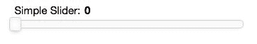

在这段代码中，我们使用了`Slider`函数来创建滑块部件。`start`参数用于指定滑块的起始值，`end`参数用于指定滑块的最后一个值，在本例中为 *50* 。`value`参数用于指定滑块生成时的起始值。`step`参数用于指定滑块向右或向左移动时其值增加或减少的次数。最后，`title`参数被用来给滑块一个标题。

# 创建文本输入小部件

文本输入框为用户提供了一种键入文本的方式，该方式可以链接到更改绘图的输出，具体取决于您之前如何配置绘图。要创建文本输入小部件，请使用下面显示的代码:

```py
#Import the required packages

from bokeh.models.widgets import TextInput

#Create the text input widget

text_input_widget = TextInput(title="Type your text here", value = "")

#Output the text input widget

output_file("text_input_widget.html")

show(widgetbox(text_input_widget))
```

这将产生一个文本输入小部件，如下图所示:

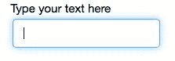

在这段代码中，我们使用了`TextInput` 功能来创建文本输入小部件。`value`参数用于设置创建文本输入小部件时出现在文本输入框中的默认文本。`title`参数用于指定文本输入小部件的标题，它很重要，因为标题通常会向用户提供他/她必须在文本输入框中键入的内容。

# 创建视觉属性以增强风格和交互性

视觉属性可以大致分为两类:

*   增加绘图互动性的属性
*   增强绘图视觉风格的属性

本节将为这两个类别奠定基础，并展示如何充分利用和开发 Bokeh 来充分利用您的绘图。

# 增加绘图互动性的属性

进一步增强绘图互动性的视觉属性如下:

*   **悬停工具提示**:让您将鼠标指向图中的特定点并显示相关信息
*   **选择**:允许您选择绘图的一个区域，并为该区域选择不同的颜色

# 创建悬停工具提示

为了创建悬停工具提示，我们将使用这里显示的代码:

```py
#Import the required packages

from bokeh.models import CategoricalColorMapper
from bokeh.models import HoverTool
from bokeh.io import output_file, show
from bokeh.plotting import ColumnDataSource
from bokeh.plotting import figure
import pandas as pd

#Read in the data and filter for Google and USB stocks

df = pd.read_csv('all_stocks_5yr.csv')

df_multiple = df[(df['Name'] == 'GOOGL') | (df['Name'] == 'USB')]

#Create the hover tooltip

hover_tool = HoverTool(tooltips = [
    ('Stock Ticker', '@Name'),
    ('High Price', '@high'),
    ('Low Price', '@low')
]) 

#Save the data in a ColumnDataSource object

data = ColumnDataSource(df_multiple)

#Create the categorical color mapper

category_map = CategoricalColorMapper(
    factors = ['GOOGL', 'USB'], palette = ['blue', 'red'])

#Create the plot with the hover tooltip

plot = figure(tools = [hover_tool])

plot.circle('high', 'low', size = 8, source = data, color = {'field': 'Name', 'transform': category_map})

#Output the plot

output_file('hover.html')

show(plot)
```

这将产生一个带有悬停工具提示的绘图，显示有关绘图中特定点的信息，如下所示:

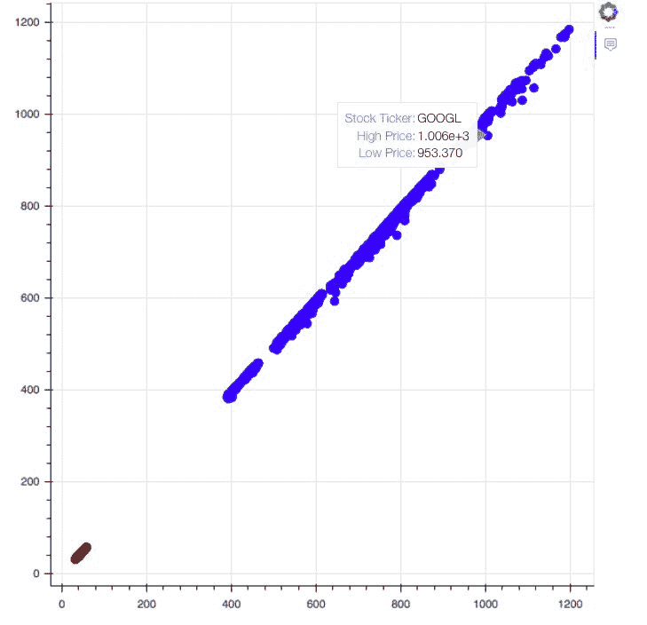

在这段代码中，我们重用了我们使用分类颜色映射器为不同类别着色而创建的图。我们使用`HoverTool` 函数来创建元组列表。每个元组包含要传递的信息的名称，如`Stock Ticker`，以及在其中找到该信息的关联列，如`@Name`。然后，我们在创建绘图时将这个`HoverTool` 对象传递到`figure`函数的`tools`参数中。

将鼠标指向图中的特定点，我们会看到诸如股票代码、高价和低价等信息。

# 创建选择

为了选择我们刚刚创建的绘图区域，我们将使用这里显示的代码:

```py
#Import the required packages

from bokeh.models import CategoricalColorMapper
from bokeh.models import HoverTool
from bokeh.io import output_file, show
from bokeh.plotting import ColumnDataSource
from bokeh.plotting import figure

#Read in the dataset and filter for Google and USB stocks

df = pd.read_csv('all_stocks_5yr.csv')

df_multiple = df[(df['Name'] == 'GOOGL') | (df['Name'] == 'USB')]

#Save the data into a ColumnDataSource object

data = ColumnDataSource(df_multiple)

#Create the categorical color mapper

category_map = CategoricalColorMapper(
    factors = ['GOOGL', 'USB'], palette = ['blue', 'red'])

#Create the plot with the selection tool 

plot = figure(tools = 'box_select')

plot.circle('high', 'low', size = 8, source = data, 
            color = {'field': 'Name', 'transform': category_map}, selection_color = 'green',
           nonselection_fill_alpha = 0.3, nonselection_fill_color = 'grey')

#Output the plot

output_file('selection.html')

show(plot)
```

这导致了如下图所示的结果:

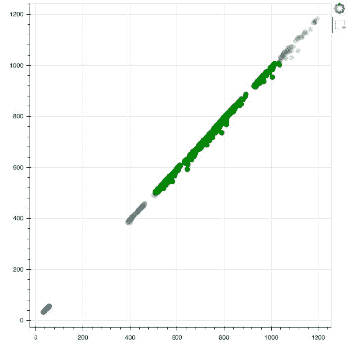

在这个图中，`Box Select`工具可以在右上角找到。单击框选择工具后，我们可以在绘图上拖动并创建一个框来选择绘图的一个区域。在前面的图中，选定的区域显示为绿色，而未选定的区域显示为灰色。

在这段代码中，我们在创建绘图时使用`selection_color`参数来指定绘图在选择后将变为的颜色。我们使用`nonselection_fill_color`来指定图中未选择的区域将采用的颜色，在本例中为灰色。

最后，我们使用`figure`功能来指定`tools`，在这种情况下是`box_select`工具，它以正方形选择绘图的区域。

# 增强绘图视觉风格的属性

增强绘图视觉风格的属性可分为以下几类:

*   设计标题
*   设计背景
*   设计绘图的轮廓
*   设计标签的样式

# 设计标题

设计绘图的标题是一个非常棒的方法，可以创造出一个对手头的任务来说真正独特的绘图。为了创建自定义的绘图样式，我们使用如下所示的代码:

```py
#Import the required packages

from bokeh.models import CategoricalColorMapper
from bokeh.models import HoverTool
from bokeh.io import output_file, show
from bokeh.plotting import ColumnDataSource
from bokeh.plotting import figure

#Read in and filter the data for Google and USB stocks

df = pd.read_csv("all_stocks_5yr.csv")

df_multiple = df[(df['Name'] == 'GOOGL') | (df['Name'] == 'USB')]

#Store the data in a ColumnDataSource

data = ColumnDataSource(df_multiple)

#Create the categorical color mapper

category_map = CategoricalColorMapper(
    factors = ['GOOGL', 'USB'], palette = ['blue', 'red'])

#Create the plot and configure the title 

plot = figure(title = "High Vs. Low Prices (Google & USB)")

plot.title.text_color = "red"

plot.title.text_font = "times"

plot.title.text_font_style = "bold"

plot.circle('high', 'low', size = 8, source = data, 
            color = {'field': 'Name', 'transform': category_map})

#Output the plot

output_file('title.html')

show(plot)
```

这将产生一个标题独特的图，如下图所示:

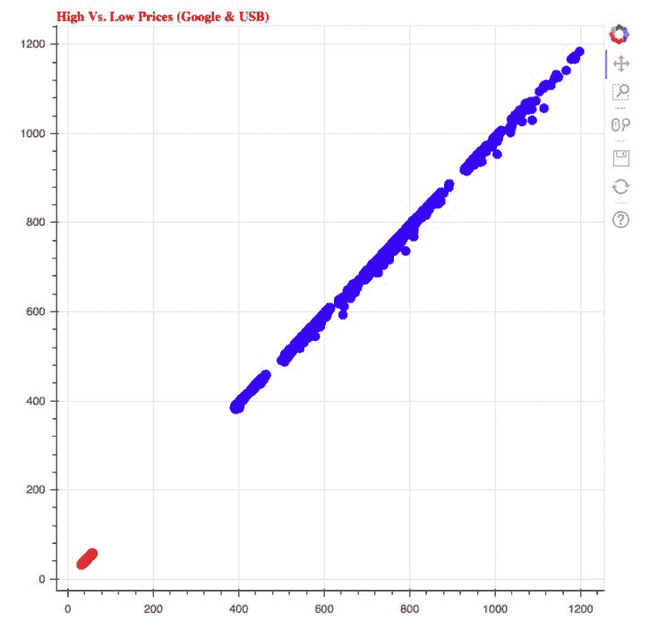

在这个绘图中，标题是红色的，用的是泰晤士新罗马字体，而且是粗体。在这段代码中，我们使用`title.text_color`给标题一个红色。然后我们使用`title.text_font`给标题命名为泰晤士新罗马字体。最后我们用`title.text_font_style`给绘图加粗字体。

# 设计背景

你的绘图背景可以设计成不同的颜色。当我们希望绘图中的要点在对比鲜明的背景下显得突出时，这一点尤其有用。我们可以使用下面显示的代码定制和设计我们的绘图背景:

```py
#Import the required packages

from bokeh.models import CategoricalColorMapper
from bokeh.models import HoverTool
from bokeh.io import output_file, show
from bokeh.plotting import ColumnDataSource
from bokeh.plotting import figure

#Read in the data and filter for Google and USB stocks

df = pd.read_csv("all_stocks_5yr.csv")

df_multiple = df[(df['Name'] == 'GOOGL') | (df['Name'] == 'USB')]

#Save the data in a ColumnDataSource object

data = ColumnDataSource(df_multiple)

#Create the categorical color mapper

category_map = CategoricalColorMapper(
    factors = ['GOOGL', 'USB'], palette = ['blue', 'red'])

#Create the plot and configure the background

plot = figure(title = "High Vs. Low Prices (Google & USB)")

plot.background_fill_color = "yellow"
plot.background_fill_alpha = 0.3

plot.circle('high', 'low', size = 8, source = data, 
            color = {'field': 'Name', 'transform': category_map})

#Output the plot

output_file('title.html')

show(plot)
```

这将产生一个黄色背景的图，如下图所示:

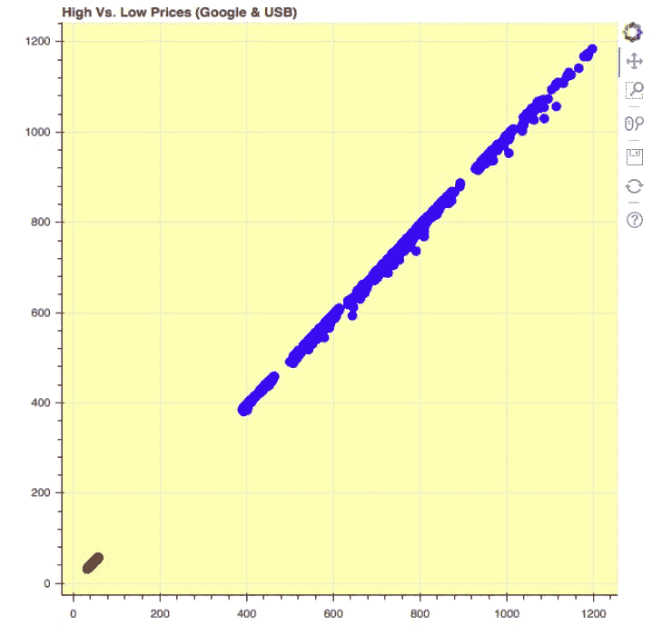

我们现在可以看到，绘图得到了增强，红色和蓝色的点由于黄色背景而更加突出。

在这段代码中，我们使用了`background_fill_color`给绘图黄色背景。然后我们使用`background_fill_alpha`给我们的背景一点透明度。

# 设计绘图的轮廓

对我们的绘图轮廓进行造型是一个很好的方法，可以给绘图一个强烈且定义明确的边界，增强绘图的整体美感，给它一个人像效果。这可以使用下面显示的代码来完成:

```py
#Import the required packages

from bokeh.models import CategoricalColorMapper
from bokeh.models import HoverTool
from bokeh.io import output_file, show
from bokeh.plotting import ColumnDataSource
from bokeh.plotting import figure

#Read in the data and filter for Google and USB stocks

df = pd.read_csv("all_stocks_5yr.csv")

df_multiple = df[(df['Name'] == 'GOOGL') | (df['Name'] == 'USB')]

#Save data into a ColumnDataSource object

data = ColumnDataSource(df_multiple)

#Create the color mapper

category_map = CategoricalColorMapper(
    factors = ['GOOGL', 'USB'], palette = ['blue', 'red'])

plot = figure(title = "High Vs. Low Prices (Google & USB)")

#Configure the outline of the plot

plot.outline_line_width = 8
plot.outline_line_alpha = 0.8
plot.outline_line_color = "black"

#Create and output the plot

plot.circle('high', 'low', size = 8, source = data, 
            color = {'field': 'Name', 'transform': category_map})

output_file('outline.html')

show(plot)
```

这将产生一个黑色轮廓的图，如下图所示:

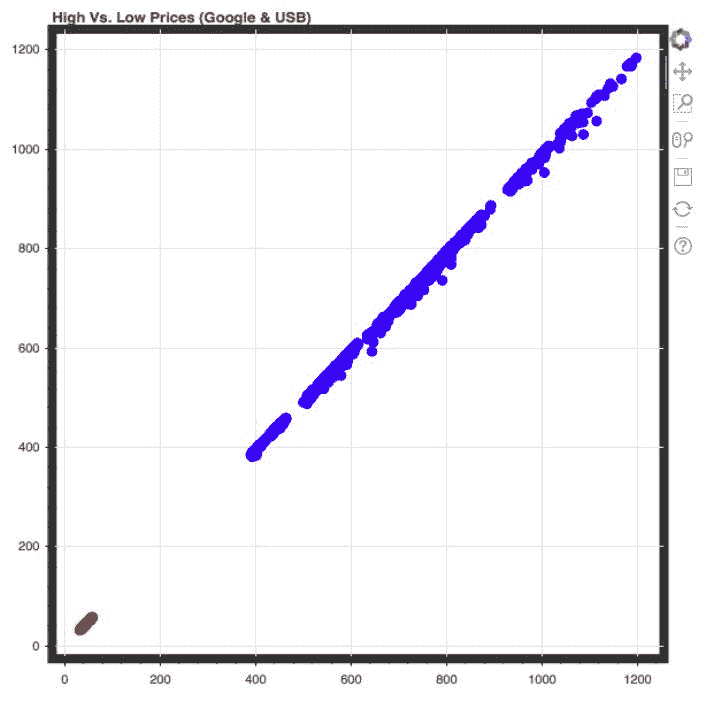

在这段代码中，我们使用`outline_line_width`来配置轮廓的宽度。值越高，轮廓越宽。然后我们使用`outline_line_alpha`来配置轮廓的透明度。值越高，轮廓越不透明。最后，我们使用`outline_line_color`给轮廓一个黑色。

# 设计标签的样式

为您的绘图标签提供独特的字体和颜色，为您的绘图提供更高级别的可定制性。为了自定义我们的图的标签，我们将使用这里显示的代码:

```py
#Import the required packages

from bokeh.models import CategoricalColorMapper
from bokeh.models import HoverTool
from bokeh.io import output_file, show
from bokeh.plotting import ColumnDataSource
from bokeh.plotting import figure

#Read in the data

df = pd.read_csv("all_stocks_5yr.csv")

df_multiple = df[(df['Name'] == 'GOOGL') | (df['Name'] == 'USB')]

#Save the data as a ColumnDataSource object

data = ColumnDataSource(df_multiple)

#Create a categorical color mapper

category_map = CategoricalColorMapper(
    factors = ['GOOGL', 'USB'], palette = ['blue', 'red'])

#Create the plot and configure the labels

plot = figure(title = "High Vs. Low Prices (Google & USB)")

plot.xaxis.axis_label = "High Prices"
plot.xaxis.axis_label_text_color = "green"

plot.yaxis.axis_label = "Low Prices"
plot.yaxis.axis_label_text_font_style = "bold"

plot.circle('high', 'low', size = 8, source = data, 
            color = {'field': 'Name', 'transform': category_map})

#Output the plot

output_file('title.html')

show(plot)
```

这将生成带有自定义标签的图，如下图所示:

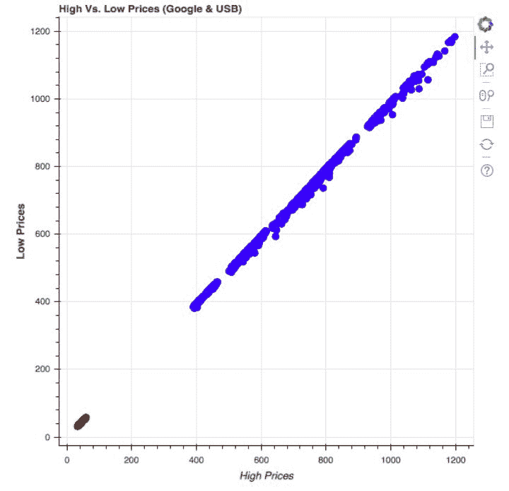

在该图中，我们可以观察到 *x* 轴标签为绿色，而 *y* 轴标签为粗体。在这段代码中，我们使用`axis_label_text_color`给标签一个我们选择的独特颜色，使用`axis_label_text_font_style`给标签一个加粗的字体样式。

# 摘要

这一章已经阐明了所有不同的工具，你可以利用这些工具来为你的绘图增加互动性和视觉吸引力。

您已经学习了如何使用标注将标题、图例和分类颜色映射添加到绘图中，以便传达有关绘图的补充信息。您还学习了如何构建 Bokeh 提供的所有不同类型的小部件，以使您的绘图更具互动性。最后，您还了解了为可视化添加交互性和风格的视觉属性。

在下一章中，你将学习如何将你在这一章和前几章中学到的东西结合成一个互动的应用，让你自己和你的绘图的用户都着迷！