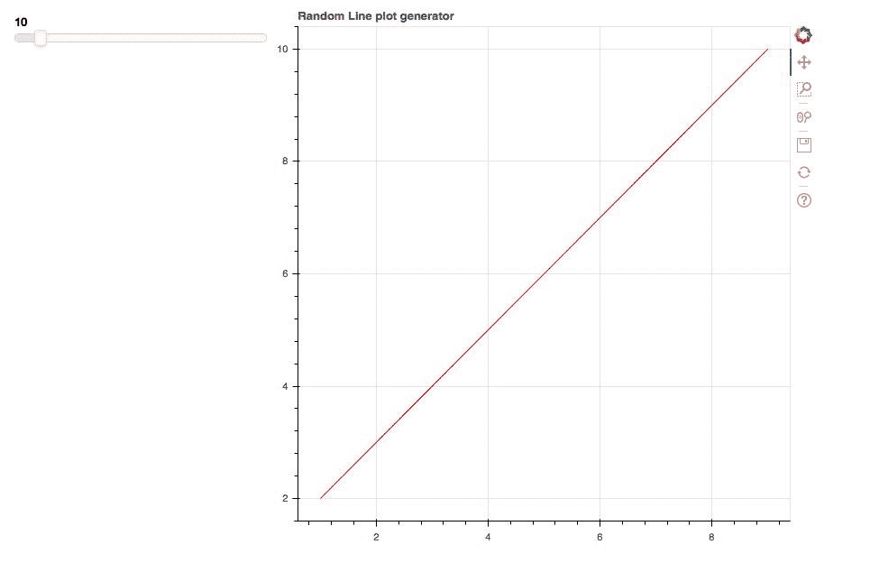

# 六、使用 Bokeh 服务器构建和托管应用

Bokeh 为用户提供了在自己的服务器上托管实时应用的灵活性和便利性。Bokeh 服务器是连接 Python 和浏览器的桥梁，您可以在浏览器中托管应用。事实上，当你在 Jupyter 笔记本中创建你的绘图时，你一直在使用 Bokeh 服务器，方法是遵循在此之前章节中的代码！

您可以使用 Bokeh Server 的方法之一是在您的机器上本地部署具有交互性的应用，然后您可以与同事共享这些应用。

在本章中，您将获得:

*   Bokeh 服务器简介
*   创建 Bokeh 应用简介
*   部署 Bokeh 应用简介

本章旨在构建您关于 Bokeh 服务器的基础知识，以便我们可以在本书的最后一章构建一个漂亮的交互式实时 Bokeh 应用！

# 技术要求

您需要在系统上安装 Python。最后，为了使用本书的 Git 存储库，用户需要安装 Git。

本章的代码文件可以在 GitHub:
[https://GitHub . com/PacktPublishing/动手-数据-可视化-with-Bokeh](https://github.com/PacktPublishing/Hands-on-Data-Visualization-with-Bokeh) 上找到。

查看以下视频，了解代码的运行情况:

[http://bit.ly/2LGCqEC](http://bit.ly/2LGCqEC)。

# Bokeh 服务器简介

在使用 Bokeh 服务器创建我们自己的应用之前，明确 Bokeh 服务器到底是什么是很重要的。

简单来说，您创建的 Bokeh 对象，例如图、轴、小部件，以及几乎所有与您的交互式可视化相关的东西，都是由您用 Python 编码的。这些 Bokeh 对象然后被 Bokeh 转换成 JSON 格式。

为了可视化这个过程，请看一下这个图表:


在 BOKEH SERVER 的上下文中，您编写的 Python 代码将被转换为 JSON 文档。然后，名为 BOKEHJS 的客户端库用 JavaScript 呈现 JSON 文档，这样我们就可以在浏览器中查看应用。

Bokeh 为您做了所有这些，所以制作一个应用不需要 JavaScript 的先验知识！

# 构建 Bokeh 应用

每个 Bokeh 应用都有一个结构。这种结构有助于将大型应用分解成较小的组件，这些组件可以单独构建，然后组合在一起，作为一个整体呈现应用。这种结构如下图所示:


如图所示，在 Bokeh 中构建端到端应用的第一步是创建您希望在应用中看到的图和小部件。在这个阶段，创建绘图和小部件是一个您应该很熟悉的概念。

下一步是定义回调函数。回调函数只是一个告诉应用当用户与您的应用交互时如何响应的函数。例如，如果您创建了一个名为`Update Plot`的按钮，该函数将使用它从网络上检索的新数据来更新绘图。换句话说，回调函数充当连接您创建的小部件以及这些小部件如何交互和更改您的绘图的桥梁。

最后一步是创建布局，以尽可能最有效和美观的方式展示您的绘图。同样，创建和定制布局是一个您现在已经熟悉的概念。

结合这三个步骤将呈现你自己的 Bokeh 应用！

# 创建单个滑块应用

在前一章中，您学习了如何在 Jupyter 笔记本中创建一个简单的滑块小部件。然而，这个小部件不是一个可以被你或者你的内部团队/更广泛的受众使用的应用。

为了创建应用，我们将使用文本编辑器而不是 Jupyter 笔记本。您可以使用自己选择的任何文本编辑器。一旦您将下面显示的代码复制并粘贴到文本编辑器中，您必须确保将文件保存为`bokeh.py`或任何`{name}.py`，只要它有一个`.py`扩展名。

在您的终端(对于 MacOS/Linux)或 PowerShell (Windows)中，您需要转到保存文件的目录，以便启动应用。

为了在 Bokeh 中创建一个简单的单滑块应用，我们使用这里显示的代码:

```py
#Import the required packages

from bokeh.layouts import widgetbox
from bokeh.models import Slider
from bokeh.io import curdoc

#Create a slider widget

slider_widget = Slider(start = 0, end = 100, step = 10, title = 'Single Slider')

#Create a layout for the widget

slider_layout = widgetbox(slider_widget)

#Add the slider widget to the application

curdoc().add_root(slider_layout)
```

在这段代码中，我们创建了一个简单的单滑块小部件，从 0 开始，到 100 结束。然后，我们使用`widgetbox`功能将此滑块添加到布局中。最后，我们使用`curdoc`函数，通过调用`add_root`方法将滑块部件嵌入到我们的应用中。

每当我们创建一个应用时，Bokeh 都会为该应用创建一个空白文档或画布。这份空白文件被称为`curdoc`。我们可以使用`add_root`方法向这个空白文档添加小部件、图和感兴趣的元素。

这次的不同之处在于，我们没有将前面的代码键入 Jupyter Notebook 单元格并执行它。相反，我们使用文本编辑器保存前面的代码。您必须确保前面的代码有一个`.py`扩展名。例如，前面的代码是使用文本编辑器保存为`bokeh.py`的。

为了运行该应用，如果您在 Mac/Linux 上，您将打开终端，如果您在 Windows 机器上，您将打开 Windows Shell，并键入此处显示的命令:

```py
bokeh serve --show bokeh.py
```

这将在浏览器中启动您的 Bokeh 应用，如下图所示:


虽然我们将滑块小部件配置为从 0 开始，到 100 结束，但它不会显示这一点，因为滑块小部件没有链接到它可以处理的任何数据源。这就是为什么我们定义了一个回调函数来通过数据源将您的图和小部件连接在一起，正如在 Bokeh Server 部分的*介绍中所解释的那样。*

# 创建多滑块应用

在本节中，我们将创建一个具有三个滑块的应用。为此，我们使用这里显示的代码:

```py
#Import the required packages

from bokeh.layouts import widgetbox
from bokeh.models import Slider
from bokeh.io import curdoc

#Create multiple slider widgets

slider_widget1 = Slider(start = 0, end = 100, step = 10, title = 'Slider 1')

slider_widget2 = Slider(start = 0, end = 50, step = 5, title = 'Slider 2')

slider_widget3 = Slider(start = 50, end = 100, step = 5, title = 'Slider 3')

#Create a layout for the widget

slider_layout = widgetbox(slider_widget1, slider_widget2, slider_widget3)

#Add the slider widget to the application

curdoc().add_root(slider_layout)
```

在前面的代码中，我们创建了三个滑块小部件，然后将它们添加到`widgetbox`函数中。然后，我们使用终端/外壳执行应用，如下所示:

```py
bokeh serve --show bokeh.py
```

这将产生如下所示的应用:


我们现在有一个使用三个滑块而不是一个滑块的应用。

# 将滑块应用与散点图相结合

滑块应用的基本目的只有在我们可以使用它为我们的绘图添加一层交互性时才能实现。我们可以将一个简单的散点图与一个滑块结合起来，并使用下面显示的代码作为一个应用:

```py
#Import the required packages

from bokeh.models import Slider, ColumnDataSource
from bokeh.io import curdoc
from bokeh.layouts import row
from bokeh.plotting import figure
from numpy.random import random

#Create data for the plot

initial_points = 500

data_points = ColumnDataSource(data = {'x': random(initial_points), 'y': random(initial_points)})

#Create the plot

plot = figure(title = "Random scatter plot generator")

plot.diamond(x = 'x', y = 'y', source = data_points, color = 'red')

#Create the slider widget

slider_widget = Slider(start = 0, end = 10000, step = 10, value = initial_points, title = 'Slide right to increase number of points')

#Define the callback function

def callback(attr, old, new):

    points = slider_widget.value
    data_points.data = {'x': random(points), 'y': random(points)}

slider_widget.on_change('value', callback)

#Create a layout for the application

layout = row(slider_widget, plot)

#Add the layout to the application

curdoc().add_root(layout)
```

现在，我们可以使用这里显示的命令来执行这个脚本:

```py
bokeh serve --show bokeh.py
```

这将产生如下所示的应用:


在前面的代码中，我们首先定义了希望在散点图中显示的初始点数。这个数字是 500。

然后我们使用`ColumnDataSource`通过使用来自`NumPy`的随机函数来定义 *x* 和 *y* 变量的数据。基本上， *x* 和 *y* 各生成一组随机的 500 个数字，这用于生成之前显示的散点图。

接下来，我们创建了一个滑块函数，它从 0 个数据点开始，到 10，000 个数据点结束，滑块的初始值是我们前面定义的数据点的初始数量，即 500。

让滑块为我们工作的最重要的部分是`callback`功能。在这个函数中，我们定义了一个名为`points`的变量，它基本上取滑块可以取的可能值，在本例中是 0 到 10，000 之间的任何值。

然后，我们使用`data_points.data`变量定义了当我们从左向右移动滑块时滑块将改变的数据，反之亦然。

最后，我们在滑块部件上使用`on_change`方法，主要是告诉滑块，当我们在任一方向上移动滑块时，它必须改变数据的`values`。

因此，该图向我们展示了当滑块位于`70`点时以及当滑块位于`9030`点时会发生什么:


我们可以清楚地观察到散点图上看到的点数是如何随着使用滑块添加更多的点而急剧增加的。

当我们想要完全控制想要查看的数据量时，可以使用这样的应用，因为有时更少或更多的数据点可能会揭示有趣的见解。

# 将滑块应用与折线图相结合

在本节中，我们将看到如何在线图的用例中扩展滑块应用的功能。为了构建一个带有线图的滑块应用，我们使用如下所示的代码:

```py
#Import the required packages

from bokeh.models import Slider, ColumnDataSource
from bokeh.io import curdoc
from bokeh.layouts import row
from bokeh.plotting import figure
from numpy.random import random

#Define the points that create the line plot

x = [1,2,3,4,5,6,7,8,9]
y = [2,3,4,5,6,7,8,9,10]

#Create the data source

data_points = ColumnDataSource(data = {'x': x, 'y': y})

#Create the line plot

plot = figure(title = 'Random Line plot generator')

plot.line('x', 'y', source = data_points, color = 'red')

#Create the slider widget 

slider_widget = Slider(start = 0, end = 100, step = 1, value = 10)

#Define the callback function

def callback(attr, old, new):

    points = slider_widget.value
    data_points.data = {'x': random(points), 'y': random(points)}

slider_widget.on_change('value', callback)

#Create the layout

layout = row(slider_widget, plot)

#Add the layout to the application

curdoc().add_root(layout)
```

我们现在可以使用终端/外壳中显示的代码来执行这个脚本:

```py
bokeh serve --show bokeh.py
```

这将产生如下所示的应用:



在前面的代码中，我们创建了一个简单的线图，并添加了一个滑块小部件，其值可以从 0 增加到 100。

然后我们定义了一个回调函数，它将滑块的值作为`points`变量。因此，`points`变量可以存储 0 到 100 之间的任何值。

接下来，我们定义了每次移动滑块时滑块必须更新的数据。在前面的代码中，我们从变量`points`中给出了变量 *x* 和 *y* 的随机值，因为我们的目的是创建一个随机线图生成器。

最后，我们用滑块小部件和绘图创建了一个布局，并将这个布局添加到应用中。

在应用的初始启动时，我们可以看到应用显示一条直线，因为这是我们创建的初始图。如果我们移动滑块到 48 点，我们会得到一个随机生成的线图，其中 *x* 和 *y* 变量都有 48 点，如下图所示:


因此，我们看到如何将滑块应用与线图结合使用，以生成具有不同点数的新图。

# 使用选择小部件创建应用

在本节中，我们将创建一个用于更改数据分布的应用。我们将给用户两个选择:均匀分布和正态分布。我们可以通过使用这里显示的代码来做到这一点:

```py
#Import the required packages

from bokeh.models import Select, ColumnDataSource
from bokeh.io import curdoc
from bokeh.layouts import row
from bokeh.plotting import figure
from numpy.random import random, normal

#Create data for the plot

initial_points = 500

data_points = ColumnDataSource(data = {'x': random(initial_points), 'y': random(initial_points)})

#Create the plot

plot = figure(title = "Scatter plot distribution selector")

plot.diamond(x = 'x', y = 'y', source = data_points, color = 'red')

#Create the select widget

select_widget = Select(options = ['uniform distribution', 'normal distribution'], value = 'uniform distribution', title = 'Select the distribution of your choice')

#Define the callback function

def callback(attr, old, new):

    if select_widget.value == 'uniform distribution':
        function = random
    else:
        function = normal
    data_points.data = {'x': function(size = initial_points), 'y': function(size = initial_points)}

select_widget.on_change('value', callback)

#Create a layout for the application

layout = row(select_widget, plot)

#Add the layout to the application

curdoc().add_root(layout)
```

现在，我们可以使用这里显示的代码来运行应用:

```py
bokeh serve --show bokeh.py
```

这将产生如下所示的应用:


在前面我们用来创建这个应用的代码中，我们创建了一个 500 点的随机散点图。然后我们创建了一个 select 小部件，它有两个选项:均匀分布和正态分布。

在我们定义的回调函数中，如果用户选择均匀分布，则函数设置为`random`，如果用户选择正态分布，则函数设置为`normal`。然后，根据用户在应用中所做的选择，将这些函数应用于数据点。

在前面的截图中，我们将随机函数应用于数据点，以便创建一个均匀的分布，这被设置为应用启动时显示的默认分布。

但是，如果我们将分布更改为正态分布，我们将获得如下所示的散点图:


我们现在可以观察当我们改变点的分布时散点图是如何变化的。这样的应用有助于从不同的角度、使用不同的分布来观察我们的数据，以便获取我们以前通常无法获取的见解。

# 使用按钮小部件创建应用

在本节中，我们将创建一个带有按钮小部件的应用，当您单击它时，它将改变数据的显示方式。为了创建这样一个应用，我们使用如下所示的代码:

```py
#Import the required packages

from bokeh.models import Button, ColumnDataSource
from bokeh.io import curdoc
from bokeh.layouts import row
from bokeh.plotting import figure
from numpy.random import random, normal
import numpy as np

#Create data for the plot

initial_points = 500

data_points = ColumnDataSource(data = {'x': random(initial_points), 'y': random(initial_points)})

#Create the plot

plot = figure(title = "Data change application")

plot.diamond(x = 'x', y = 'y', source = data_points, color = 'red')

#Create the button widget

button_widget = Button(label = 'Change Data')

#Define the callback function

def callback():

    #New y values 

    y = np.cos(initial_points) + random(initial_points)

    data_points.data = {'x': random(initial_points), 'y': y}

button_widget.on_click(callback)

#Create a layout for the application

layout = row(button_widget, plot)

#Add the layout to the application

curdoc().add_root(layout)
```

使用这个脚本，我们可以使用如下所示的命令来执行应用:

```py
bokeh serve --show bokeh.py
```

这将启动此处显示的应用:


在前面的代码中，我们首先创建了一个 500 点的随机散点图。然后我们创建了一个按钮小部件，并定义了`callback`函数。

在回调函数的构造中，我们通过使用`NumPy`的`cos`和`random`函数给沿 *y-* 轴的点新值。

然后，我们将 *y* 的值输入到`ColumnDataSource`中。每次我们单击按钮，散点图都会用我们指定的新值 *y* 进行更新。如下所示:


虽然没有明显的不同，但这些点已经从第一个绘图改变了位置。因此，您可以看到如何使用按钮功能来更新您的图，并允许用户通过修改数据的操作方式来查看单个图的不同版本。

# 创建应用以选择不同的列

使用 Bokeh 创建一个应用的一个小例子是，作为用户，您可以选择不同的列显示在 *x-* 和 *y-* 轴上，如下所示的代码所示:

```py
#Importing the required packages

import pandas as pd
from bokeh.plotting import figure
from bokeh.models import ColumnDataSource, Select
from bokeh.io import curdoc
from bokeh.layouts import row

#Read in the data

df = pd.read_csv('all_stocks_5yr.csv')

#Filtering for apple stocks

df_apple = df[df['Name'] == 'AAL']

#Create the ColumnDataSource object

data = ColumnDataSource(data = {
    'x' : df_apple['high'],
    'y' : df_apple['low'],
    'x1': df_apple['volume']

})

#Creating the scatter plot 

plot = figure(title = 'Attribute selector application')

plot.diamond('x', 'y', source = data, color = 'red')

#Creating the select widget

select_widget = Select(options = ['low', 'volume'], value = 'low', title = 'Select a new y axis attribute')

#Define the callback function

def callback(attr, old, new):

    if new == 'low':

        data.data = {'x' : df_apple['high'], 'y': df_apple['low']}

    else:

        data.data = {'x' : df_apple['high'], 'y': df_apple['volume']}

select_widget.on_change('value', callback)

#Add the layout to the application

layout = row(select_widget, plot)

curdoc().add_root(layout)
```

然后，我们可以使用这里显示的命令启动这个应用:

```py
bokeh serve --show bokeh.py
```

这将产生如下所示的应用:


在前面的代码中，我们首先加载了 5 年期的股票数据，可以在 Kaggle 这里找到:[https://www.kaggle.com/camnugent/sandp500/data](https://www.kaggle.com/camnugent/sandp500/data)。

然后，我们过滤数据，只包括苹果股票，并在`ColumnDataSource`的构造中添加感兴趣的属性/列。

接下来，我们用两个选项`low`和`volume`创建了一个选择小部件，并将默认选项设置为`low`。

我们构建回调函数的方式是，如果用户选择`low`选项，应用将显示苹果股票的`high`和`low`值之间的散点图，如果用户选择`volume`选项，应用将显示`high`和`volume`之间的散点图。

选择`volume`选项会产生如下散点图:


因此，我们看到了这样一个应用是如何在一个浏览器选项卡中显示多个图的，并因此可以向用户呈现各种各样的信息。

# 部署 Bokeh 应用简介

在前面的部分中，我们使用本地机器部署了我们的 Bokeh 应用，然后可以与我们内部团队的同事共享。

为了部署一个 Bokeh 应用，我们首先用 Python 编写了一个脚本，其中包含了绘图、回调函数和布局。然后我们给剧本取了一个合适的名字。在前面的例子中，我们给我们的脚本命名为`bokeh.py`。

使用 Mac/Linux 的终端或 Windows 的外壳，我们从 Python 脚本所在的目录部署了应用，命令如下所示:

```py
bokeh serve --show bokeh.py
```

这将在您选择的默认浏览器中启动应用，如下所示:

```py
http://localhost:5006/bokeh
```

在这种情况下，我们使用 Bokeh 服务器来运行和部署我们的应用。

# 摘要

本章已经向您介绍了在本地机器上构建和部署自己的 *Bokeh* 应用的基本原理。

您已经学习了如何使用 select 小部件、slider 小部件和 button 小部件构建基本应用，以及如何将这些应用用于各种应用。

在下一章中，您将学习如何使用实时数据构建您自己的应用，以便创建一个具有统计意义且美观的应用。