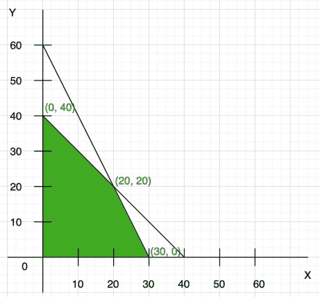
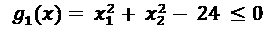
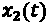
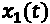
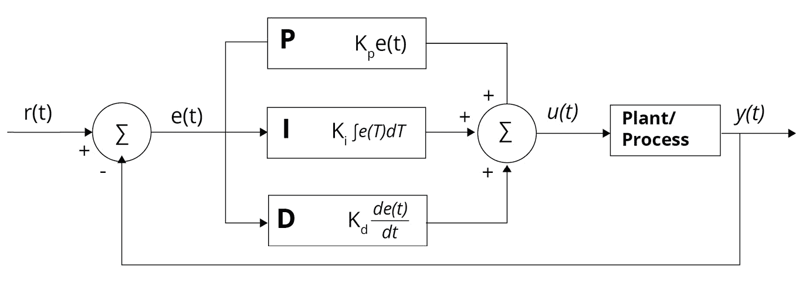

# 第一章：数学建模简介

在数据科学领域，特别是在**机器学习**（**ML**）和**深度学习**（**DL**）的领域，正在进行大量有趣的工作，并且这些方法之所以受到广泛关注是有原因的。然而，经过验证的“老派”数学建模方法却鲜少被提及。数学建模方法同样具有重要意义，并且与机器学习互为补充。为了创造能够解决实际商业问题的成功数据产品，我们往往需要部署一整套可用的数学工具，远远超出机器学习的范畴。

模型是现实系统的简化表示，旨在捕捉系统的本质。数学模型使用变量、运算符、函数、方程和等式。在数学模型的背后，有基于物理定律的第一性原理模型，基于分布、平均值的随机模型，以及基于模式或历史数据的经验模型。根据建模的具体类型，可以为所考虑的系统提供定性或定量的建议。数学模型有助于设计和原型开发，并为决策提供依据。为了建立数学模型，需要输入和输出、常数和变量、领域和边界或初始条件和约束。解决方案可以是解析的，也可以是数值的；无论是哪种情况，都能确定系统的典型行为和关键参数、趋势、依赖关系以及操作模式。系统可以是确定性的，我们知道因果关系，或者是随机的，涉及概率分布。

数学建模中的一些成熟工具涵盖以下领域：

+   数学优化

+   信号处理

+   控制理论

我们将在接下来的章节中探讨这些数学建模方法。仅专注于机器学习（ML）会忽略许多纯数学优化在许多应用场景中的相关特征。跨多个领域的成功解决方案将机器学习的现代方法与经典的数学建模技术相结合。例如，可以将状态空间建模方法与机器学习结合，推断参数估计问题中系统的未观测参数。

# 数学优化

应用数学的一个分支是数学优化，通常被称为数学编程。它广泛应用于制造、库存控制、调度、网络、经济学、工程和金融组合配置等领域。几乎任何分类、回归或聚类问题都可以转化为优化问题。一些问题是静态的，而另一些则是动态的，其中系统变量的值随时间变化。

## 理解问题

数学优化基本上是从一组允许的选项中选择输入，以便在给定的问题中获得优化或最佳可能的输出。变量本质上是我们必须做出的决策；约束是我们必须遵守的业务规则；目标是通过将现实世界的业务问题表示为优化问题来实现的业务目标。例如，医院的业务问题是设备和设施容量规划。包括床位和检测工具在内的医疗设备构成了此案例中的决策变量；约束是常规和危机容量水平及规定；最终，目标是最大化资源利用率和服务表现，并同时最小化运营成本。

最基本的优化问题由一个目标函数或成本函数组成，它是我们尝试优化的输出值，换句话说，最大化或最小化。输入是可以控制的变量，变量可以是离散的或连续的。问题的规模通常由其维度决定，即搜索所涉及的标量变量数量（也称为决策变量）。约束或方程对某些变量的最大值或最小值进行限制。一些问题有约束，这些约束可以是等式或不等式约束，而有些问题完全没有约束，这意味着函数的优化没有边界。

线性规划问题是一个优化问题，其中目标函数和所有约束都是线性的，即变量只有一阶项。正是线性规划推动了 20 世纪 40 年代优化学科的发展。如果函数或一个或多个约束是非线性的，那么我们就有了非线性规划问题。例如，优化平滑（良好定义的梯度，连续）函数相对较容易。了解问题的类型有助于选择正确的工具来解决它。

## 问题的表述

数学问题的一般表述，具有目标函数*f(x)*，通过变量和约束来表达问题。一个典型的形式如下：

最小化 f (，使得 ，其中 i = 1, 2, ...., m

变量和约束的性质可能非常多样。变量可以是离散的、连续的或集合（组）；约束可以是确定性的或随机的。目标函数也可能包含动态方面。

有时我们感兴趣的是在没有任何约束或限制的情况下找到全局最优点。这类问题是无约束优化问题。而在其他情况下，我们需要解决有特定约束的问题，比如对控制变量的限制。例如，在上述情况下，我们可能需要最小化目标函数，同时满足（）。这些是有约束的优化问题。

示例 1：

假设我们有多个（不等式）约束，涉及两个变量，*x* 和 *y*，如下所示：

*2x + 3y ≤* *34*

*3x + 5y ≤* *54*

*0 ≤* *x, y*

图形优化将是图形的重叠（暗区），如 *图 1.1* 所示。这里的约束是线性的，因此最大值和最小值必须位于边界上。而最优解很可能出现在三个指定的点之一。对于非线性约束，最优解出现在边界上或边界之间。在无约束优化中，要么函数没有边界，要么如果有边界，它们是软约束。

图 1.1：线性约束优化的图形表示

商业问题中的典型约束包括时间、金钱和资源，同时试图最大化目标函数。约束更加针对特定的用例，同时最小化目标函数。假设在上述问题中，目标函数是线性的，如 *f(x, y) = 20x + 35y*，并且最优解是通过函数的斜率得出的。如果 *f(x, y)* 取得一个值，这个值就成为边界，约束和边界结合形成线性约束。

对于线性约束，重叠区域被认为是可行的。非线性约束则非常难以可视化，因为扭曲的 *x*-*y* 平面几乎使得绘制可行区域变得不可能。

示例 2：

在非线性约束优化中，第一步是从可行区域的边界开始。为了最小化目标函数，应该选择一个向量方向，使得它能够降低函数值并保持在可行区域内。如果目标函数的梯度（斜率）与该向量在边界上的点的点积为负，则该向量被认为是朝着下降方向移动的。另外，一个不违反约束的向量被认为是朝着可行方向移动的。

图 1.2：非线性约束优化中的可行方向

边界上的约束方程是 *g(x)* = 0，如 *图 1.2* 所示。一个可行向量不能使 *g(x)* 的值增加。它必须保持为零或减小。如果约束的梯度与该向量本身的点积在该点为负或零，则可以认为该向量沿着可行方向移动。例如，假设我们有以下目标函数：

最小化 

以及初始点（4, 2 在单一约束条件下：

其中  和  通常是代表矩阵或数组的变量。向量 `<-1, 0>` 既是下降方向也是可行方向。由于初始点是随机选择的，因此所有可行向量集合和所有下降向量集合的重叠可能较大。然而，随着我们接近最小值，重叠会变小，并且在最小值或最优点时，二者完全没有重叠。在最优点处，如果不违反约束，目标函数就无法进一步最小化。当两个梯度的点积为负，并且这两个向量的矩阵行列式等于零时，我们就知道达到了最优解。

另一种可能性是最优解发生在可行区域的内部，而不是边界上。在这种情况下，目标函数的梯度在该点将为零。该点的凹性（非凸性）由函数的 Hessian 矩阵（第二阶导数）的特征值决定。

在目标函数存在噪声或其梯度是通过数值计算得出的情况下（例如，复杂的边值问题），会引入误差。即使目标函数本身没有噪声，基于梯度的优化方法也可能变得有噪声。对于这类优化问题，Scientific Python 库中有不同的优化器，简称`scipy`，我们将在接下来的章节中了解其中的一些。现在我们已经了解了数学优化的概念，接下来将探讨数学建模中的另一个概念——信号处理。

# 信号处理

应用数学的另一个分支是信号处理，它在工程领域中得到了应用，专注于分析和处理信号，如声音、图像、科学测量，并去除噪声。信号处理涉及将信号从时间序列转换为超光谱图像，这些图像是通过不同的电磁测量得到的。经典的信号转换，如频谱图和小波，常与机器学习技术一起使用。这些表示也可以作为深度神经网络的输入。卡尔曼滤波器是一个经典的信号处理滤波器，通过一系列时间测量来产生未知变量的估计。

## 理解问题

信号是一个连续变量的函数，例如时间或空间。通过在规定的时间间隔（称为采样周期）对模拟信号进行采样，可以将模拟信号转换为数字信号，采样周期的倒数就是采样率（每秒或赫兹）。采样率必须至少是模拟信号最大频率的两倍。这建立了一个充分的条件，允许通过离散的采样序列将所有连续时间信号的信息封装到离散时间信号中。

图 1.3：在信号的时域和频域中的 60 kHz 正弦波（汉宁窗）脉冲

信号的频域表示通过使用 `scipy` 计算每一帧的频率来实现。通常在每一帧上应用一种叫做**短时傅里叶变换**（**STFT**）的傅里叶变换。

## 问题的表述

很明显，**离散时间信号处理**（**DSP**）是用于采样信号的，并为 DSP 建立了数学基础，本质上是分析和修改信号，以提高（或优化）其效率或性能。通过使用离散傅里叶变换（DFT），离散序列可以表示为其等效的频域‘”。傅里叶变换的线性性质产生了两个信号， 和 ： 

其中  和  分别是  和  的傅里叶变换，这是信号过滤中常用的概念，指的是将时间  域转化为频率  域。傅里叶变换的对偶性质非常有用，因为它能够解决一些复杂的问题，这些问题如果直接计算会很困难。它的结果是，如果 x 有傅里叶变换 ，那么可以形成一个新的时间函数 ，其形式与该变换的功能形式相同，例如：

时间的偏移会影响频率，而频率的偏移则会影响函数的时间。让我们以一个频谱图为例来理解数字信号处理（DSP）。

频谱图显示了波形随时间变化的频率谱，并广泛应用于音乐和语音处理以及雷达领域。它是通过光学光谱仪、傅里叶变换或小波变换生成的，通常以热图的形式呈现，其中信号的强度或强度随着颜色（亮度）的变化而变化。为了生成频谱图，时域信号被分割成等长且通常有重叠的块，并对每个块应用快速傅里叶变换（FFT）来计算频率范围。频谱图是每个段或 FFT 框架上频谱的图表或图像，表现为频率*与*时间的关系（或 3D 表面），如*图 1.4*所示，第三维（由颜色条表示）指示特定时间点特定频率的幅度。此过程对应于信号的短时傅里叶变换（STFT）的平方幅度计算。

图 1.4: 频谱图

频谱图可以用来识别非平稳或非线性信号的特征，作为一系列时间频率分析。频谱图中的参数通常包括帧数（构成它的 FFT 数量）、频率范围（最小值和最大值）、FFT 间距和 FFT 宽度（每个 FFT 表示的时间宽度）。

频谱图与**循环神经网络**（**RNNs**）一起应用于语音识别，这是一个主要的例子。我们在这一小节中了解了数字信号在噪声上的免疫性（好吧，几乎）以及更少的失真，接下来我们将探索控制理论，这是一种广泛应用于工业过程中的数学建模技术。控制理论通常在反馈发生的情况下有用，无论是在调节器还是伺服机制中，例如导航系统和工业生产过程。

# 控制理论

控制理论是数学和工程学的一个分支，也在社会科学中得到了应用，例如经济学和心理学。它处理动态系统的行为或演化。尤其在系统的动态不是任意的，即我们理解系统的物理特性时，它非常有用。控制的目标是从测量数据中开发模型。这个模型是应用于驱动系统达到期望状态的输入的数学描述，同时最小化任何延迟或误差，并确保一定的稳定性。

动态系统的行为受反馈回路的影响——控制器通过操控系统输入来获得期望的输出效果。误差控制调节通常通过**比例-积分-微分**（**PID**）控制器来实现，顾名思义，信号是通过误差信号的加权和、积分和微分来得出的。误差是实际输出与期望输出之间的差异，作为反馈作用于输入。系统的标准术语是过程，控制变量的术语是**过程变量**（**PV**），其目标是减少偏差误差。通过负反馈回路，PV 的测量值（图 1.5 中的 E）从期望值 S（设定点或 SP）中减去，估算误差（SP 减去 PV），该误差被调节器 R（图 1.5）用来缩小测量值与期望值之间的差距。误差可能会作为干扰 D 引入系统 T，如控制器的闭环（图 1.5）所示。

图 1.5：负反馈控制器

控制理论可以是线性的，也可以是非线性的。线性控制理论适用于遵循叠加原理的设备，意味着输出大致与输入成比例。这类（接近理想的）系统可以通过频域数学方法进行处理，如拉普拉斯变换、傅里叶变换和奈奎斯特稳定性准则。另一方面，非线性控制理论适用于不遵循叠加原理的真实世界系统。这些系统通常由非线性微分方程控制，并通过数值方法进行分析。非线性系统通常通过仿真操作进行数值研究，使用的仿真语言模拟系统过程。然而，如果仅对稳定点或平衡点附近的解感兴趣，可以通过扰动技术将非线性控制系统线性化为近似值。

## 理解问题

数学技术用于频域或时域中分析控制系统。在频域中，表示系统输入、输出和反馈的状态变量是频率的函数。传递函数、系统函数或网络函数是描述输入与输出之间关系的数学模型，基于描述或支配系统的微分方程。输入和传递函数通过数学变换从时间函数转化为频率函数。在该领域，微分方程被代数方程替代，后者更容易求解。时域中的状态变量是时间的函数，系统通过一个或多个微分方程来描述。

时域技术用于探索和分析实际的非线性系统，因为频域技术仅能用于研究（理想的）线性系统。尽管非线性系统的方程难以求解，但计算机仿真方法使其分析变得常见。控制回路的一个关键应用是在工业过程控制系统设计中，如*图 1.6* 所示。

图 1.6：工业控制显示持续调节的过程流

工业过程的基础是控制回路，它由所有元素组成，用于在扰动存在的情况下测量并控制过程值，以达到期望的设定点（SP）。控制器可以是一个独立的硬件单元，或者在大型分布式控制系统中，是一个**可编程逻辑控制器**（**PLC**）系统，设定点输入可以手动设置或从其他来源级联。*图 1.6* 中的绿色文本是描述功能并标识组件的标签，这些标签在工厂中是唯一的（字符串），表示设备组件或元素。相关的传感器本质上捕捉这些标签的数据。

## 问题的公式化

现代控制理论利用状态空间方法（时域表示），不同于经典控制理论使用变换方法（频域表示），如拉普拉斯变换，它编码了所有的系统信息。在状态空间方法中，数学模型是一组一阶微分方程，支配着系统的相关输入、输出和状态变量。这些变量以向量的形式表示，微分方程采用矩阵格式，更便于解决。相反，表示线性动态系统行为的代数方程是以矩阵形式书写的。

状态空间方法不限于线性系统，提供了一种方便且紧凑的方式来建模和分析大多数具有多个输入和输出的非线性系统。状态空间是指其坐标轴为状态变量的空间，系统状态以向量形式表示在该空间内。

工厂或过程是被控制的系统部分，控制器（或简单的过滤器）构成其余部分。输入到过程的信号会影响输出，效果通过传感器测量并由控制器处理。控制信号反馈到输入，从而闭合回路。这样的典型架构是 PID 控制器，通常是最常用的工业设计，如*图 1.7*所示。它持续计算误差值*e(t)*，误差是期望的 SP 和测量的 PV 之间的差异，并基于比例、积分和微分项进行修正。

图 1.7：u(t)是发送到系统的控制信号，e(t) = r(t) – y(t)是误差

当多个控制器监控一个过程时，它就成为一个具有分散控制回路的分布式控制系统。分散化是有益的，因为它有助于控制系统在广泛的区域内操作，同时通过通信渠道进行交互。

工业中广泛使用的一些主要控制技术包括自适应控制、层次控制、最优控制、鲁棒控制和随机控制。除此之外，智能控制利用**人工智能**（**AI**）和机器学习（ML）方法，如模糊逻辑、神经网络等，来控制动态系统。工业 4.0 正在彻底改变制造商将 AI 整合到其运营和生产设施中的方式。

# 总结

本章介绍了通过其广泛应用的主要领域，如优化、信号处理、控制系统和控制工程，引入数学建模的概念。数学建模或数学规划是将问题转化为清晰的数学公式的艺术。随后的算法实现生成可操作的洞察力，并帮助构建更多关于该领域的知识。

本章帮助我们学习了数学优化问题的公式化，以便得出最优解，公式化取决于我们打算研究的领域。数学优化模型就像现实世界商业场景的数字化双胞胎。它在严格的数学和编程设置中反映了商业景观，这种环境对于支持高风险决策的业务过程可解释性尤为重要。

在下一章中，我们将了解数学模型如何强调数据和领域知识的重要性。此外，我们还将学习如何将机器学习模型视为优化问题。
