# 第三章：主成分分析

一个广为人知的算法，用于从高维数据中提取特征，供**机器学习**（**ML**）模型使用，便是**主成分分析**（**PCA**）。用数学术语来说，*维度*是指指定空间中一个向量所需的最小坐标数。要在高维空间中找到两个向量之间的距离，需要大量的计算能力，在这种情况下，维度被视为一种诅咒。维度的增加会在一定程度上提升算法的性能，但超过这个范围后，性能将下降。这就是维度诅咒，正如*图 3.1*所示，它妨碍了大多数 ML 算法效率的提升。数据中的变量列或特征代表空间的维度，而行代表该空间中的坐标。随着数据维度的增加，稀疏性增加，并且计算距离和密度所需的计算量呈指数增长。从理论上讲，维度的增加实际上会增加大数据集中的噪声和冗余。可以说，PCA 是应对高维问题中维度复杂性最流行的技术。

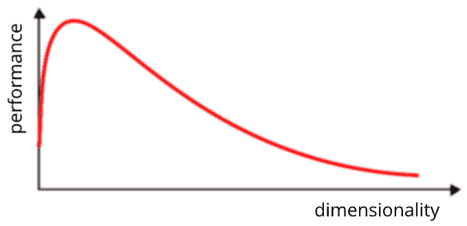

图 3.1：维度诅咒

PCA 源自线性代数领域，本质上是一种数据准备方法，在将 ML 模型拟合到新创建的低维数据集之前，先将数据投影到一个子空间。PCA 是一种数据投影技术，能有效地可视化高维数据并改善数据分类。它是在 1900 年代根据主轴定理发明的。PCA 的主要目标是为数据找到一个正交归一基，按重要性或方差的顺序排序维度，丢弃不重要的维度，并只关注不相关的高斯成分。

本章涵盖以下内容：

+   PCA 的线性代数

+   线性判别分析 – 与 PCA 的区别

+   PCA 的应用

接下来的部分将讨论线性代数，这是 PCA 所基于的数学学科。

# PCA 的线性代数

PCA 是一种无监督方法，用于减少高维数据集的特征数量。通过矩阵因式分解（或分解），然后根据方差对这些部分进行排序，将一个未标记的数据集缩减为其组成部分。表示原始数据的投影数据将成为训练 ML 模型的输入。

PCA 被定义为数据向下投影到一个称为主子空间的低维线性空间，这一过程是通过找到新的坐标轴（或基向量）来实现的，这些新坐标轴最大程度地保留了投影数据的方差；这些新坐标轴或向量被称为主成分。PCA 通过考虑投影向量的方差来保持信息：最大方差位于第一坐标轴，第二大方差位于第二坐标轴，依此类推。线性变换的工作原理，即 PCA，如*图 3.2* 所示。它通过识别一个子空间，捕捉完整特征矩阵的本质，从而压缩了特征空间。

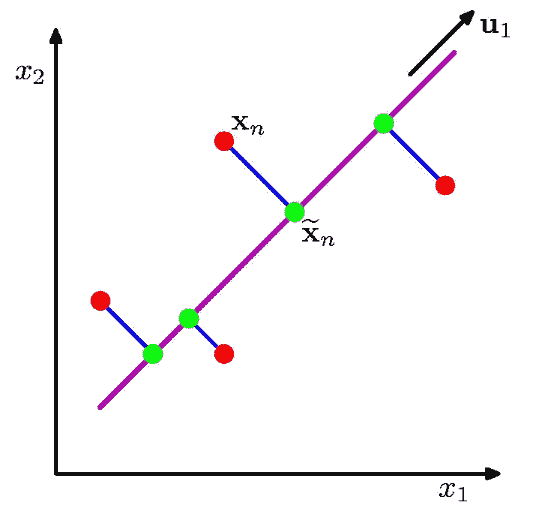

图 3.2：PCA 工作原理

除了 PCA，还有其他减少数据维度的方法，如特征选择方法（包装法和过滤法）、非线性方法如流形学习（t-SNE），以及深度学习（自编码器）网络；然而，最广泛且最流行的探索性方法是 PCA。通常，线性代数方法假设所有输入具有相同的分布，因此，如果输入特征具有不同的单位，使用 PCA 之前最好对数据进行归一化或标准化处理。

## 协方差矩阵 – 特征值和特征向量

PCA 的约束是所有主轴应互相正交。数据的协方差是衡量数据中任意一对特征之间变化程度的度量。协方差矩阵检查数据中特征之间的相关性，这些关系的方向取决于协方差是小于、等于还是大于零。*图 3.3* 显示了协方差矩阵的公式。矩阵中的每个元素表示数据中两个特征之间的相关性，其中*j* 和 *k* 遍历*p*个变量，*N* 是观察值的数量（行数），公式中的 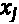 条和 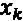 条表示期望值（均值）。

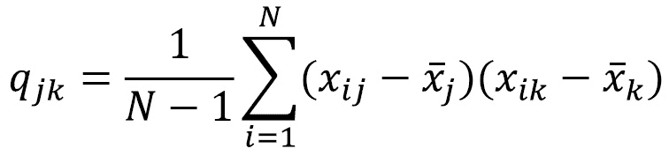

图 3.3：协方差矩阵

PCA 的目标是通过比原始数据集中的变量或特征少得多的变量来解释大部分的数据变化性。每个*N*个观察值或记录都位于*p*维空间中。并非所有维度都是同等重要的。PCA 寻求少数几个重要的维度，其中重要性通过每个维度上观察值的变化量来量化。PCA 确定的维度是*p*个特征的线性组合。我们可以利用这些线性组合来减少用于可视化分析特征空间的图表数量，同时保留原始数据的本质。

由特征分解计算出的协方差矩阵的特征值和特征向量分别决定了新子空间的大小和方向。在线性代数中，**特征向量**（与一组线性方程相关联）是一个非零向量，当对其进行线性变换时，该向量会按某个大小（标量）发生变化。对应的**特征值**是特征向量被缩放的大小或因子，**特征分解**是将矩阵分解为其特征向量和特征值。主成分就是特征向量。对协方差矩阵按降序排序后，最顶端的特征值对应数据集的主成分。

数据的第一个**主成分**（**PC**）是具有最大方差的特征的线性组合。第二个主成分是所有与第一个主成分不相关的线性组合中具有最大方差的特征的线性组合。前两个主成分在*图 3.4*中显示，这一计算过程会一直进行，直到找到数据集的所有主成分。这些主成分本质上就是特征向量，线性代数方法表明，协方差矩阵中与最大特征值对应的特征向量解释了数据变异性的最大比例。每个主成分向量在特征空间中定义了一个方向，而且它们彼此之间没有相关性——即相互正交。主成分构成了新空间的基础。

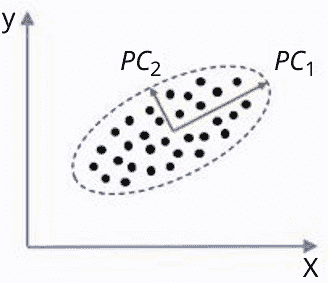

图 3.4：特征空间中的主成分（x = 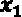，y = 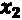)

## 主成分数量 – 如何为数据集选择合适的数量

问题是如何确定一个数据集被某个数量的主成分（PC）解释的程度。答案在于由主成分数量保留的方差百分比。我们理想情况下希望能够用最少数量的主成分来解释大部分的变异性。没有一个健壮的方法来确定可用的成分数量。随着数据集中观测值和变量的变化，所需的准确度和降维量也不同。

**主成分方差解释比例**（**PVE**）是通过考虑第*m*个特征值来计算的。PVE 是由第*m*个特征值表示的比例，即 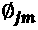（来自*图 3.5*中的*j*个变异量），与所有主成分或特征向量的特征值之和的比率。简单来说，PVE 是每个主成分解释的方差与数据集中所有主成分总方差之比。

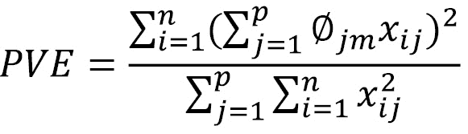

图 3.5：PVE 计算

通常，我们会寻找 PVE 显著下降的“拐点”，以确定可用的主成分数量。

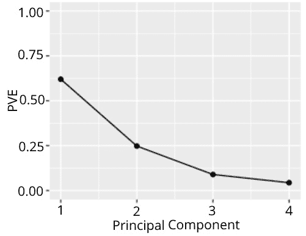

图 3.6a：PVE 与主成分的关系

在 *图 3.6a* 中显示的第一个主成分解释了 62.5% 的数据变异性，第二个主成分解释了 25%。以累积的方式，前两个主成分解释了 87.5% 的变异性，如 *图 3.6b* 所示。

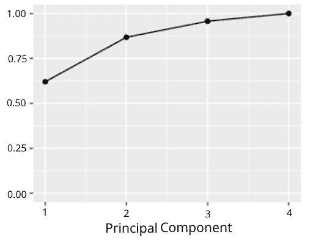

图 3.6b：累积 PVE（纵轴）与主成分（PC）

另一种广泛使用的矩阵分解方法用于确定主成分（PC）的数量是 **奇异值分解** (**SVD**)。它是一种降秩逼近方法，提供了一种简便的方式来实现相同的目标——即计算与奇异值对应的主成分。SVD 只是另一种矩阵分解方法，它让我们解开与特征分解类似的信息。通过 SVD 得到的数据矩阵的奇异值，本质上是 PCA 中协方差矩阵的特征值的平方根。SVD 就是对原始数据矩阵（均值中心化的矩阵）进行 PCA。

SVD 的数学演示可以在 Wolfram 页面上找到：[`mathworld.wolfram.com/SingularValueDecomposition.xhtml`](https://mathworld.wolfram.com/SingularValueDecomposition.xhtml)。

SVD 是一种迭代的数值方法。每个矩阵都有 SVD，尽管对于一些复杂问题，它可能无法整齐地分解某些矩阵。你可以使用 Python 库中的线性代数类 `scipy` 来执行 SVD。`scikit-learn` 库提供了 SVD 的函数：[`scikit-learn.org/stable/modules/generated/sklearn.decomposition.PCA.xhtml`](https://scikit-learn.org/stable/modules/generated/sklearn.decomposition.PCA.xhtml)。

高维数据可以被简化为一组与所解决问题最相关的维度（列）。数据矩阵（行与列）会得到一个秩较低的矩阵，该矩阵近似原始矩阵，并且最佳地捕捉其显著特征。

## 特征提取方法

降维可以通过两种方式进行：一种是特征选择，另一种是特征提取。在特征选择方法中，通过根据某些符合特定使用案例和相应数据的标准进行过滤，选出原始特征的一个子集。而在特征提取方法中，找到一组新的特征。

特征提取是通过从原始特征进行线性映射来完成的，实施该方法后原始特征将不再存在。从本质上讲，通过可用数据构建的新特征没有像原始数据那样的列名。有两种特征提取方法：PCA 和 LDA。根据数据的不同，也可以使用非线性映射，但该方法就不再是 PCA 或 LDA。

现在我们已经探索了用于特征降维的 PCA（因此，也降维了高维空间），接下来我们将学习一种监督式的线性特征提取方法，称为 **线性判别分析** (**LDA**)。

# LDA – 与 PCA 的区别

LDA 和 PCA 都是线性变换方法；后者通过求解最大化数据方差的方向或主成分（PCs），前者则通过求解最大化数据类别间分离的方向。PCA 算法的工作方式忽略了类别标签。

LDA 是一种监督方法，用于将数据投影到一个子空间，以最大化（组）类别之间的可分性；因此，它用于模式分类问题。LDA 对于具有多个类别的数据效果较好；然而，它假设类别是正态分布的且类别协方差相等。PCA 通常在每个类别的样本数相对较少时表现较好。然而，无论如何，观测值应该相对于维度要高得多，以便获得有意义的结果。

LDA 寻找一种最能区分数据的投影，而 PCA 则寻找一种能够保持数据中最大信息量的投影。当引入协方差估计的正则化，以调节不同变量对 LDA 的影响时，这被称为**正则化** **判别分析**。

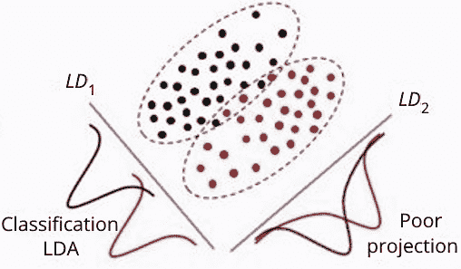

图 3.7：线性判别

LDA 涉及为每个类别基于每个输入变量的分布开发一个概率模型（*图 3.7*）。它可以视为应用贝叶斯定理进行分类，并假设输入变量是无关的；如果它们是相关的，PCA 变换可以帮助去除线性依赖。scikit-learn 库提供了 LDA 的函数。这里给出了一个使用合成数据集的示例代码：

```py
from sklearn.datasets import make_classification
from sklearn.model_selection import GridSearchCV
from sklearn.model_selection import RepeatedStratifiedKFold
from sklearn.discriminant_analysis import LinearDiscriminantAnalysis
X, y = make_classification(n_samples = 1000, n_features = 8, n_informative = 8,
n_redundant = 0, random_state = 1) #train examples and labels
model = LinearDiscriminantAnalysis()
cv = RepeatedStratifiedKFold(n_splits = 10, n_repeats = 3, random_state = 1)
grid = dict()
grid['solver'] = ['svd', 'lsqr', 'eigen'] #grid configuration
search = GridSearchCV(model, grid, scoring = 'accuracy', cv = cv, n_jobs = -1)
results = search.fit(X, y)
print('Mean Accuracy: %.4f' % results.best_score_) #model accuracy check
row = [0.1277, -3.6440, -2.2326, 1.8211, 1.7546, 0.1243, 1.0339, 2.3582] #new example
yhat = search.predict([row]) #predict on test data
print('Predicted Class: %d' % yhat) #class probability of new example
```

在上述示例中，网格搜索中的超参数（`solver`）设置为`'svd'`（默认值），但也可以使用其他`solver`值。此示例只是介绍了如何在 scikit-learn 中使用 LDA；根据解决的问题，实际上可以进行大量定制。

我们已经探讨了用于降维的线性代数方法；接下来我们将学习 PCA 的最重要应用。

# PCA 的应用

PCA 是一个基础算法，是机器学习的基石。它广泛应用于图像噪声减少、数据分类、异常检测以及医学数据相关性等领域。在本节中，我们将探讨 PCA 的几个广泛应用。

Python 中的 scikit-learn 库提供了 PCA 的函数。以下示例代码展示了如何在开发预测模型时，利用 PCA 进行降维，并将 PCA 投影作为输入。我们将在一个合成数据集上使用 PCA，同时拟合一个用于分类的逻辑回归模型：

```py
from sklearn.datasets import make_classification
from sklearn.model_selection import cross_val_score
from sklearn.model_selection import RepeatedStratifiedKFold
from sklearn.pipeline import Pipeline
from sklearn.decomposition import PCA
from sklearn.linear_model import LogisticRegression
from numpy import mean
from numpy import std
import matplotlib.pyplot as plt
def get_models():
     models = dict()
     for i in range(1, 11):
           steps = [('pca', PCA(n_components = i)), ('m', LogisticRegression())]
models[i] = Pipeline(steps = steps)
return models
def evaluate_model(model, X, y):
     cv = RepeatedStratifiedKFold(n_splits = 10, n_repeats = 3, random_state = 1)
scores = cross_val_score(model, X,  y, scoring = 'accuracy', cv = cv, n_jobs = -1,  error_score = 'raise')
return scores
X, y = make_classification(n_samples = 1000, n_features = 10, n_informative = 8, n_redundant = 2, random_state = 7)
models = get_models()
results, names = list(), list()
for name, model in models.items():
     scores = evaluate_model(model, X, y)
     results.append(scores)
     names.append(name)
print('Mean Accuracy: %.4f (%.4f)' % (mean(results), std(results))) red_square = dict(markerfacecolor = 'r', marker = 's')
```

我们将使用以下代码绘制主成分：

```py
plt.boxplot(results, labels = names, showmeans = True, showfliers = True, flierprops = red_square)
plt.grid()
plt.xlabel('Principal Components')
plt.xticks(rotation = 45)
plt.show()
row = [0.1277, -3.6440, -2.2326, 1.8211, 1.7546, 0.1243, 1.0339, 2.3582, -2.8264,0.4491] #new example
steps = [('pca', PCA(n_components = 8)), ('m', LogisticRegression())]
model = Pipeline(steps = steps)
model.fit(X, y)
yhat = model.predict([row]) #predict on test data
print('Predicted Class: %d' % yhat) #predicted class of new example
```

在前面的例子中，我们没有看到模型准确率在超过八个主成分后有所提升（*图 3.8*）。显然，前八个主成分包含了关于类别的最大信息，其余的则是冗余的。

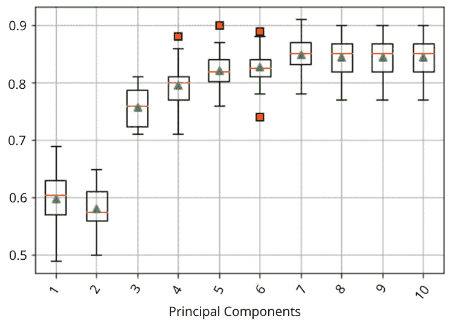

图 3.8：合成数据集上分类准确率与主成分数量的关系

在 PCA 转换特征后的主成分数量，是选择能够提供最佳平均模型性能的数量，然后将其输入到机器学习模型中进行预测。在接下来的小节中，我们将学习如何使用 PCA 进行去噪和异常点检测。

## 噪声减少

PCA 用于减少数据中的噪声，尤其是在图像处理中。PCA 通过去噪对图像进行重建可以通过使用 scikit-learn Python 库的分解方法实现。该库函数的详细信息和示例可以在此找到：[`scikit-learn.org/stable/auto_examples/applications/plot_digits_denoising.xhtml`](https://scikit-learn.org/stable/auto_examples/applications/plot_digits_denoising.xhtml)

一个好的练习是重建从视频序列中获得的图像，探索线性 PCA 和核 PCA，并检查哪种方法提供更平滑的图像。

图像压缩（*图 3.9*）是 PCA 的另一个重要应用。

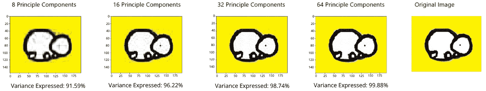

图 3.9：PCA 图像压缩

主成分所表示的方差百分比决定了应该有多少特征作为输入传递到深度学习模型（神经网络）中进行图像分类，以便在处理庞大和高维数据集时，不影响计算性能。

## 异常检测

异常检测在欺诈检测、故障检测和传感器网络中的系统健康监控中非常常见。PCA 利用聚类方法来检测异常点，通常是集体性的和无序的异常点。基于聚类的异常检测假设，正常数据点属于大而密集的簇，而异常数据点则属于小的或稀疏的簇，或者根本不属于任何簇。带有示例遥测数据的代码可以在以下仓库找到：[`github.com/ranja-sarkar/mm`](https://github.com/ranja-sarkar/mm)。

主成分应用距离度量来识别异常。在这种情况下，PCA 确定什么构成正常类别。作为一个练习，你可以使用无监督学习方法，如 K 均值和隔离森林，在相同数据集上检测异常点，并比较结果，获取更多有意义的洞察。

# 总结

在本章，我们学习了两种用于减少数据维度的线性代数方法：即主成分分析（PCA）和线性判别分析（LDA）。重点是 PCA，它是一种无监督方法，用于减少高维数据的特征空间，并了解为什么这种降维对于解决业务问题至关重要。我们详细研究了该算法背后的数学原理及其在机器学习模型中的工作原理。我们还了解了 PCA 的一些重要应用，并附带了 Python 代码。

在下一章，我们将学习一种优化方法——梯度下降法，它可以说是优化神经网络中最常见（也是最流行）的算法。这是一种通过最小化给定的成本函数来工作的学习算法。顾名思义，它通过迭代使用梯度（导数）来最小化该函数。
