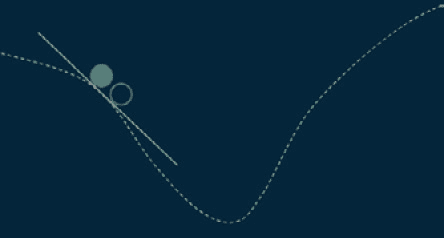
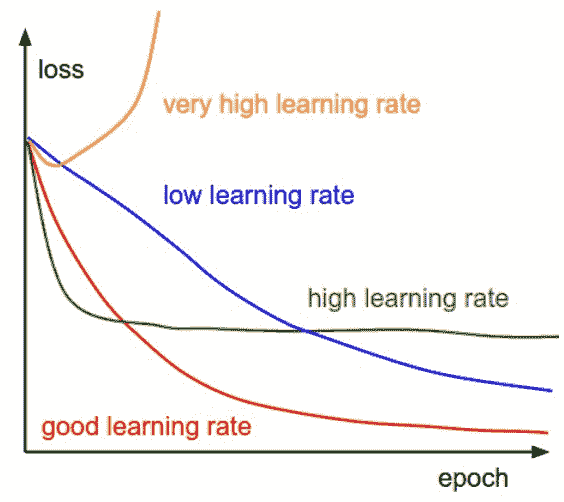
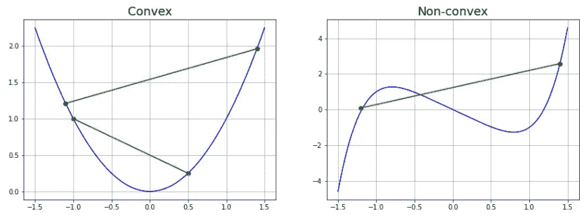
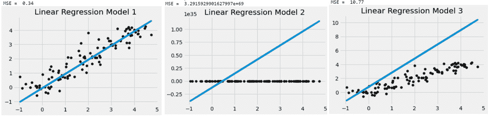
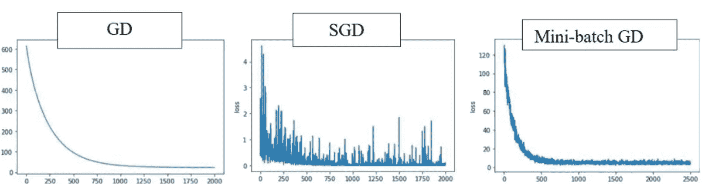
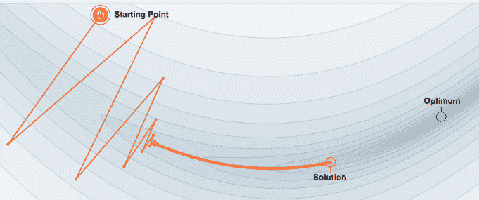
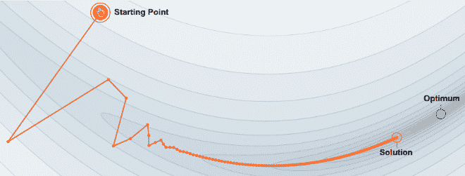
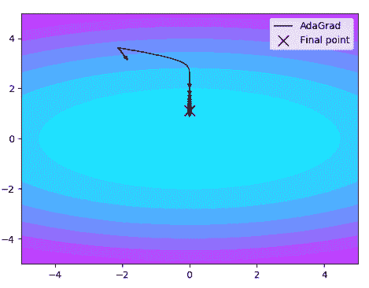
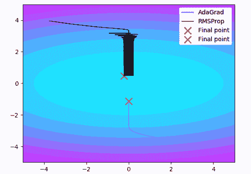
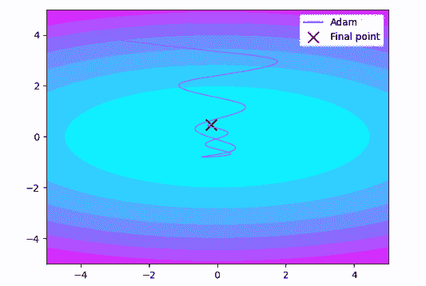

# 第四章：梯度下降

一种为机器学习模型奠定基础的优化算法是**梯度下降**（**GD**）。GD 是一个简单且有效的工具，适用于训练此类模型。顾名思义，梯度下降涉及“下坡”。我们选择一个方向穿越地形，并采取每一步让我们下坡的方式。步长取决于坡度（梯度）。在**机器学习**（**ML**）模型中，梯度下降估计误差梯度，帮助最小化成本函数。很少有优化方法能像梯度下降那样在计算效率上表现得如此出色。GD 还为深度学习模型的优化奠定了基础。

在那些无法通过线性代数解析计算参数，且必须通过优化搜索的难题中，GD 找到了它的最佳应用。该算法通过迭代的方式沿着最陡的下降方向移动。在每次迭代中，模型参数（如线性回归中的系数和神经网络中的权重）都会被更新。模型会不断更新其参数，直到成本函数收敛或达到最小值（即*图 4.1a*中的斜坡底部）。



图 4.1a：梯度下降

每次迭代中所采取的步长称为学习率（每次迭代时，函数的导数都会按学习率缩放）。如果学习率过低，模型可能会在达到底部之前就达到最大允许迭代次数，而如果学习率过高，则可能无法收敛或完全发散（即所谓的爆炸梯度问题）。选择最合适的学习率对于获得最佳精度的模型至关重要，如*图 4.1b*所示。



图 4.1b：梯度下降中的学习率

为了使梯度下降（GD）有效，目标或成本函数必须是可微分的（意味着在单变量函数的定义域中的每个点都有一阶导数）且是凸的（即函数上的两点可以通过一条不相交的线段连接）。凸函数的二阶导数总是为正。凸函数和非凸函数的例子如*图 4.2*所示。GD 是一种一阶优化算法。



图 4.2：凸函数（L）和非凸函数（R）的示例

在多变量函数中，梯度是该函数在定义域中每个方向上的导数向量。此类函数可能具有鞍点（准凸或半凸），在这些点上，算法可能会陷入困境，无法保证找到最小值。为了突破鞍点并达到全局最小值，引入了二阶优化算法。除了机器学习（ML）和深度学习（**DL**）之外，梯度下降算法也在控制工程和机械工程中有应用。以下各节将梯度下降算法与其他用于 ML 和**深度学习**（**DL**）模型的优化算法进行比较，并专门探讨一些常用的梯度下降优化器。

本章涵盖以下主题：

+   梯度下降法的变种

+   梯度下降优化器

# 梯度下降法的变种

本节通过 Python 代码详细说明了梯度下降算法在优化简单线性回归模型（*y = mx + c*）中的工作原理。

## 梯度下降法的应用

在保持迭代次数相同的情况下，算法会分别在三种不同的学习率下运行，产生三种模型，因此得到三种**MSE**（**均方误差**）值。MSE 是线性回归中计算的损失或代价函数：

```py
import numpy as np
import matplotlib.pyplot as plt
from sklearn.metrics import mean_squared_error
#gradient descent method
class GDLinearRegression:
    def __init__(self, learning_rate, epoch):
        self.learning_rate, self.iterations = learning_rate, epoch
       #epoch is number of iterations
    def fit(self, X, y):
        c = 0
        m = 5
        n = X.shape[0]
        for _ in range(self.iterations):
            b_gradient = -2 * np.sum(y - m*X + c) / n
            m_gradient = -2 * np.sum(X*(y - (m*X + c))) / n
            c = c + (self.learning_rate * b_gradient)
            m = m - (self.learning_rate * m_gradient)
        self.m, self.c = m, c
    def predict(self, X):
        return self.m*X + self.c
#dataset
np.random.seed(42)
X = np.array(sorted(list(range(5))*20)) + np.random.normal(size = 100, scale = 0.5)
y = np.array(sorted(list(range(5))*20)) + np.random.normal(size = 100, scale = 0.3)
#model 1
Clf_1 = GDLinearRegression(learning_rate = 0.05, epoch = 1000)
Clf_1.fit(X, y)
y_pred = Clf_1.predict(X)
mse_1 = mean_squared_error(y, y_pred)
plt.style.use('fivethirtyeight')
plt.scatter(X, y, color='black')
plt.plot(X, y_pred)
plt.gca().set_title("Linear Regression Model 1")
print('Slope = ', round(Clf_1.m, 4))
print('Intercept = ', round(Clf_1.c, 4))
print('MSE = ', round(mse_1, 2))
```

另外两个模型分别使用两种不同的学习率进行训练，一个比模型 1 的学习率高，另一个低，如下所示：

```py
#model 2
Clf_2 = GDLinearRegression(learning_rate = 0.2, epoch = 1000)
Clf_2.fit(X, y)
y_pred = Clf_2.predict(X)
mse_2 = mean_squared_error(y, y_pred)
plt.style.use('fivethirtyeight')
plt.scatter(X, y, color='black')
plt.plot(X, y_pred)
plt.gca().set_title("Linear Regression Model 2")
print('MSE = ', round(mse_2, 2))
#model 3
Clf_3 = GDLinearRegression(learning_rate = 0.0001, epoch = 1000)
Clf_3.fit(X, y)
y_pred = Clf_3.predict(X)
mse_3 = mean_squared_error(y, y_pred)
plt.style.use('fivethirtyeight')
plt.scatter(X, y, color='black')
plt.plot(X, y_pred)
plt.gca().set_title("Linear Regression Model 3")
print('MSE = ', round(mse_3, 2))
```

执行代码后，得到的线性回归模型（*图 4.3*）展示了如何谨慎选择参数（学习率），以达到最佳性能或最优的 ML 模型准确度。



图 4.3：线性回归模型的梯度下降

存在不同的梯度下降法变种（*图 4.4*），它们在计算目标函数的梯度时使用的数据量不同。根据数据量的多少，在参数（系数或权重）的准确性与计算所需时间之间需要做出权衡。梯度下降法的变种包括**批量梯度下降**（**BGD**）、**小批量梯度下降**和**随机梯度下降**（**SGD**），我们将在以下小节中讨论它们。

## 小批量梯度下降与随机梯度下降

BGD，也称为原始梯度下降法，仅仅是梯度下降，它对整个训练数据计算梯度，进行一次更新（一步更新），因此可能非常慢。使用 BGD 优化的常见 ML 模型包括用于较小数据集的线性回归和逻辑回归。

对于更大的数据集，我们通常使用小批量梯度下降（mini-batch GD），它允许将训练数据分割成可以单独处理的小批量。处理完每个小批量后，更新参数，直到整个数据集被迭代处理完毕。通过这种方式，一次完整的数据集循环称为一个周期。为了达到全局最小值，需要执行若干步骤，这在优化过程中引入了一些方差。这种 GD 的变体通常用于效率与精度同等重要的建模问题。

SGD 对每个训练样例执行频繁的参数更新，具有较高的方差，导致成本函数波动较大。这使得它能够跳到一个新的、潜在更好的局部最小值。通过缓慢减小学习率，SGD 表现出类似于 BGD 的收敛行为。SGD 的计算速度比 BGD 快，因为它一次考虑一个样本。



图 4.4: 梯度下降变种

SGD 通常是训练神经网络的选择算法。在最小化神经网络中常见的高度非凸误差函数时，SGD 的一个关键挑战是避免陷入其众多次优局部最小值中。这些鞍点使得 SGD 很难逃脱，因为梯度在所有维度上接近零。在下一节中，我们将概述一些处理此类挑战的梯度下降优化器。

# 梯度下降优化器

这里讨论的优化器广泛用于训练依赖于误差或成本函数非凸性程度的深度学习模型。

## 动量

动量法使用移动平均梯度而不是每个时间步的梯度，并减少由 SGD 引起的前后振荡（成本函数波动）。此过程侧重于最陡下降路径。*图 4**.5a* 显示了没有动量时 SGD 中的振荡，而 *图 4**.5b* 显示了在相关方向上累积速度并减少阻尼振荡，接近最优解。



图 4.5a: 没有动量的 SGD



图 4.5b: 具有动量的 SGD

动量项减少了梯度方向变化的维度更新，从而实现更快的收敛。

## Adagrad

`adagrad` 优化器在处理稀疏数据时使用，因为该算法基于频繁出现的特征对参数进行小的更新。在 `adagrad` 中，每次更新的学习率是不同的或“自适应”的（*图 4**.6*）。该算法为不常见的特征使用较大的学习率，为更常见的特征使用较小的学习率。使用此优化器的主要优势是学习率不需要手动设置。当学习率缩小到接近零时，模型将不再获得新的知识。



图 4.6：Adagrad 优化器

## RMSprop

RMSprop 优化器类似于`adagrad`优化器，因此也被称为**泄漏的 adagrad**，只是它使用不同的参数更新方法。RMSprop 算法限制了垂直方向的振荡，使其可以在水平方向上迈出更大的步伐（*图 4**.7*）。该算法通过使用梯度的指数加权平均值来自适应地缩放每个维度的学习率，从而使其能够聚焦于最近的梯度。



图 4.7：RMSprop 优化器

## Adam

**自适应矩估计**（**adam**）优化器继承了动量和 RMSprop 优化算法的优点（*图 4**.8*）。它结合了移动平均梯度和自适应学习率的思想。这两者分别表示代价函数梯度的一阶矩（均值）和二阶矩（方差）的估计，因此得名。



图 4.8：Adam 优化器

经实验证明，Adam 优化器在实践中比 SGD 更有效，表现更好。它已经成为训练深度学习模型的默认优化器。欲了解更多，请阅读以下《机器学习精粹》文章：[`machinelearningmastery.com/adam-optimization-algorithm-for-deep-learning/`](https://machinelearningmastery.com/adam-optimization-algorithm-for-deep-learning/)。

# 总结

在本章中，我们学习了一个基础的优化算法及其在训练机器学习和深度学习模型中的变体。还详细讲解了如何在 Python 中将优化技术应用于线性回归问题。无论是代价函数及其梯度，还是如何更新梯度以收敛到最优点，都是每个数据科学家必须彻底理解的数学概念；优化代价函数是为问题或预测实现最优模型的基础。根据代价函数的行为，可以使用不同的方法来估算梯度。

在接下来的章节中，我们将探讨另一种基础算法，称为**支持向量机**（**SVMs**）。尽管 SVM 可以用于回归问题，但它更广泛地用于分类任务。
