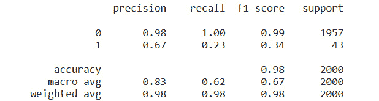

# 第五章：支持向量机

本章探讨了一种经典算法，它是每个机器学习工具库中都必须掌握的算法——**支持向量机**（**SVM**），主要用于分类问题而非回归问题。自 1990 年代问世以来，它通常用于识别数据中的模式和异常值。在 **极限梯度提升**（**XGB**）等提升算法出现后，它的受欢迎程度有所下降。然而，它仍然是最常用的监督学习算法之一。

在 1990 年代，基于计算学习的高效学习算法被开发出来，用于处理非线性函数。诸如线性学习算法等算法具有明确定义的理论特性。随着这一发展的出现，使用核函数的非线性区域的高效可分性（决策面）被建立起来。非线性 SVM 被广泛应用于实际（非线性）数据的分类中。

SVM 最初被称为一种二分类器，可以用于处理类别分布不平衡或倾斜的一类分类问题。这个无监督算法可以有效地从数据集中的大多数或正常类别中学习，将新的数据点分类为 *正常* 或 *异常值*。识别少数类或稀有类（通常被称为异常值）的过程被称为 **异常检测**，因为异常值是异常的，其他数据点则是正常的。分类过程包括在正常数据（训练样本）上拟合模型，并预测传入的新数据是正常的（内点）还是异常的。单类 SVM 最适合于一种特定的问题，即少数类没有一致的模式或是噪声实例，导致其他分类算法难以学习决策边界。异常值通常被视为与正常数据的偏差。

一般来说，SVM 在变量数量大于记录数的问题中有效，即在高维空间中。该算法在决策函数中使用训练样本的子集，因此具有内存效率。事实证明，该算法非常灵活，因为可以为决策函数指定不同的核函数。

本章涵盖以下主题：

+   SVM 中的支持向量

+   SVM 的核函数

+   SVM 的实现

我们将在接下来的章节中学习支持向量和核函数。

# SVM 中的支持向量

SVM 是一种可以以较少计算资源产生显著准确结果的算法，广泛应用于数据分类任务。如果一个数据集有 *n* 个特征，SVM 会在 *n* 维空间中找到一个超平面，也称为 **决策边界**，以分类数据点。最优的决策边界最大化边界与两类实例之间的距离。类别中数据点之间的距离（如 *图 5.1a* 所示）被称为 **间隔**：


图 5.1a：最优超平面

SVM 算法在二维空间中找到最优直线，或在多维空间中找到最优超平面，从而将空间分割成不同类别。最优超平面或最优直线最大化边距（即两个类别的数据点之间的距离）。在三维空间（或更高维度）中，数据点变成了向量，而那些最靠近或在超平面上的数据点（位于最大边距外的极小子集的训练样本）被称为**支持向量**（见 *图 5.1b*）：


图 5.1b：支持向量

如果所有支持向量距离最优超平面相同，则表示边距很好。图中的边距（*图 5.1b*）较差，因为类别 +1 的支持向量非常接近最优超平面，而类别 -1 的支持向量距离最优超平面较远。移动一个支持向量会移动决策边界或超平面，而移动其他数据点则不会产生影响。

如果输入数据集的特征数为 2，则超平面仅为一条直线。如果特征数为 3，则超平面（见 *图 5.2*）是一个二维平面。决策边界的维度取决于特征的数量，而其两侧（超平面两侧）属于不同类别的数据点：


图 5.2：三维特征空间中的超平面

支持向量影响超平面的位置和方向。使用支持向量可以最大化分类器的边距。如果数据是线性可分的，则边距为硬边距。对于大多数实际问题，数据是非线性可分的，因此在这种情况下，边距为软边距。这允许数据点位于两个类别分隔符之间的边距距离内（见 *图 5.3*）：


图 5.3：软边距

较大的边距更好，它可能会允许一些边距违规的发生。边距越大，分类器的误差越低。最大化边距等同于在机器学习算法中最小化损失。帮助最大化边距的函数是**铰链损失**。如果数据正确分类，则铰链损失（错误）为零，意味着我们有一个硬边距，因为数据点距离超平面较远。若大多数数据点被错误分类，则铰链损失为一。通常，当问题无法线性分割时，支持向量位于边距边界内（软边距）。

在下一节中，将介绍核技巧。核函数是 SVM 中用来分类非线性可分数据点的一种技术。核函数使得我们可以在高维特征空间中进行操作，而无需计算数据在该空间中的坐标，因此该操作在计算上并不昂贵。

# SVM 的核函数

通过核技巧，二维空间通过映射函数转换为三维空间，从而使得非线性数据能够在更高维度上进行分类或分离（见*图 5**.4*）。原始数据的转换是通过核来完成的。核函数定义了在变换空间中的内积（相似性度量）。

随着训练样本数的增加，SVM 的计算和存储需求也随之增加。该算法的核心是一个二次规划问题，将支持向量从训练数据集中分离出来。线性核是 SVM 最快速的实现方式，它仅是一个点积。*图 5**.5a*中展示了线性和非线性核的一些示例。最常见的非线性 SVM 核函数有**径向基函数**（**RBF**）、**Sigmoid**和**多项式**。


图 5.4：（a）非线性分隔符示例（L），和（b）数据在更高维度中有效分类

SVM 对于那些非线性可分的小型数据集非常有效。所谓的小型数据，是指特征数大于训练样本数，这会导致 SVM 在某些情况下出现过拟合。在这些情况下，合适的核函数和正则化（惩罚函数）可以帮助解决问题。每个核函数有不同的数学形式，因此它们的参数集合各不相同。


图 5.5a：使用线性核（L）、RBF 核（M）和多项式核（R）函数进行数据分类

多项式核的参数指数（度数）设为 1 时成为线性核，设为 3 时成为三次核，其中一个示例如*图 5**.5a*（最右侧）所示。Sigmoid 核的累积分布函数从 0 到 1 分类数据，通常作为神经网络中的激活函数或感知机使用。使用 Sigmoid 核函数进行 SVM 数据分类的示例见*图 5**.5b*：


图 5.5b：Sigmoid 核（L），使用 sigmoid 分类的数据（R）

所有的 SVM 核函数都有一个参数，用于在数据集的误分类与分隔器的简洁性之间进行权衡。在使用 RBF 核（它是一个指数型函数（)）训练 SVM 时，参数*a*大于零，并定义了一个训练样本对分隔器的影响。各个核函数参数的选择对于 SVM 的性能至关重要。

在不平衡数据集中，用于为类和样本提供权重的参数变得至关重要，因为在这种情况下，可能需要赋予某个样本或类更多的权重。样本加权对类边界的影响如*图 5.6*所示，其中数据点的大小与样本权重成比例：


图 5.6：使用恒定样本权重（左图）与修改后权重（右图）的分类

虽然各种方法和算法可以检测数据集中的离群点，但本章演示了由一类支持向量机（SVM）算法使用的核方法。其他示例包括孤立森林算法中的决策树集成方法、局部离群因子算法中的距离或密度方法等。异常类型可以是*点*异常或*集体*异常，选择检测算法时需要根据数据集中的异常类型进行选择。*图 5.7a 和 5.7b* 展示了这些异常类型的示例。点异常是全局行为，而集体异常是局部异常（非正常）行为。还可能存在一些数据集，其中异常是完全上下文相关的，这在时间序列数据中大多能看到。


图 5.7a：点异常的示例


图 5.7b：集体（非点）异常的示例

在接下来的部分中，我们将使用 Python 实现一类 SVM 解决方案，因为该解决方案通常在解决那些少数类离群点没有结构并且主要是噪声样本（即与正常点的偏差严重）的情况下被证明非常有用。

# SVM 实现

一类支持向量机（SVM）算法在训练过程中不使用（忽略）远离或偏离观察值的示例。只有那些最集中或密集的观察值用于（无监督）学习，这种方法在那些期望只有极少数偏离正常的特定问题中非常有效。

为了实现 SVM，创建了一个合成数据集。该数据集约有 2% 的少数类（离群点），用 `1` 表示，98% 的多数类（正常点）用 `0` 表示，并利用 RBF 核将数据映射到高维空间。以下是使用 Python（配合 scikit-learn 库）运行的代码：

```py
import pandas as pd, numpy as np
from collections import Counter
import matplotlib.pyplot as plt
from sklearn.datasets import make_classification
from sklearn.svm import OneClassSVM
from sklearn.model_selection import train_test_split
from sklearn.metrics import classification_report
X, y = make_classification(n_samples = 10000, n_features = 2, n_informative = 2,
                           n_redundant = 0, n_classes = 2,
                           n_clusters_per_class = 1,
                           weights = [0.98, 0.02], class_sep = 0.5, random_state = 0)
#Dataset as pandas dataframe
df = pd.DataFrame({'feature1': X[:, 0], 'feature2': X[:, 1], 'target': y})
#Split dataset into train and test subsets in the ratio 4:1
X_train, X_test, y_train, y_test = train_test_split(X, y, test_size = 0.2, random_state = 42)
#Train SVM model with RBF
one_class_svm = OneClassSVM(nu = 0.01, kernel = 'rbf', gamma = 'auto').fit(X_train)
#nu (specifies number of outliers) = 1% , gamma is a parameter for nonlinear kernels
prediction = one_class_svm.predict(X_test)
prediction = [1 if i == -1 else 0 for i in prediction] #outliers denoted by 1, inliers by 0
print(classification_report(y_test, prediction))
```

分类器的报告（*图 5.8*）清楚地显示，一类 SVM 模型的召回率为 23%，这意味着该模型捕捉到了 23% 的离群点。F1 分数是精确度和召回率的调和平均数：



图 5.8：一类 SVM 的分类报告

我们将使用以下代码来可视化异常值：

```py
#Visualization of outliers
df_test = pd.DataFrame(X_test, columns = ['feature1', 'feature2'])
df_test['y_test'] = y_test
df_test['svm_predictions'] = prediction
fig, (ax1, ax2) = plt.subplots(1, 2, figsize = (16, 8))
ax1.set_title('Original Data')
ax1.scatter(df_test['feature1'], df_test['feature2'], c = df_test['y_test'])
ax2.set_title('One-Class SVM Prediction')
ax2.scatter(df_test['feature1'], df_test['feature2'], c = df_test['svm_predictions'])
```

用于识别这 2%异常值的算法默认阈值也可以定制，以便根据不同的使用场景，标记更多或更少的数据点为异常值。从*图 5.9*中可以明显看出，大多数异常值（黄色）已经被分类器正确检测出来：


图 5.9：一类 SVM 分类

一类 SVM 特别适合作为异常检测器，并在制造业中通过从机器捕获的传感器数据得到了广泛应用。

# 总结

在这一章中，我们探讨了支持向量机（SVM）作为分类器的应用。除了线性数据外，SVM 还可以通过使用核函数高效地分类非线性数据。SVM 算法所使用的方法也可以扩展用于解决回归问题。SVM 同样可以用于新颖性检测，其中训练数据集不会被异常值污染，算法被用来将新的观测值检测为异常值，这时异常值被称为新颖性。

下一章将介绍图论，它提供了必要的数学工具来量化和简化复杂系统。图论研究的是在动态系统中，节点或个体实体之间的关系（连接或边）。它是机器学习（ML）和深度学习（DL）的重要组成部分，因为图提供了一种将商业问题表示为数学编程任务的方式，形式为节点和边。
