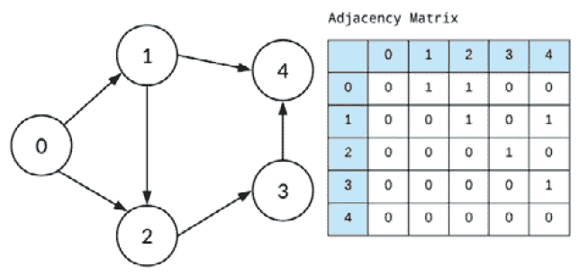

# 第六章：图论

图是用于建模成对关系的数学结构。图论提供了量化这些关系的工具，特别是在动态系统中。换句话说，图是表示网络或一组互联对象的方式。图论主要应用于运筹学和社会科学。其历史可以追溯到 18 世纪，当时瑞士数学家莱昂哈德·欧拉解决了“哥尼斯堡七桥问题”（*图 6.1*），这个问题也被认为是图论的前身。俄罗斯哥尼斯堡市位于普雷格尔河的两岸，包含两个大岛——克奈普霍夫和洛姆泽，这两个岛通过七座桥连接。问题是如何设计一条路径，使得每座桥都只跨越一次。欧拉绘制了城市的第一个现代图形的可视化表示。它通过一组称为顶点或节点的点表示（抽象表示），并通过一组称为边的线连接。边表示节点之间的关系。


图 6.1：哥尼斯堡七桥问题

图论问题通常使用数学优化框架，该框架包括三个组成部分：目标函数、决策变量和约束条件。目标函数被最小化，以获取图中节点之间的最优路径，因为两个节点之间可能存在多条路径（多重图）。使用图解决问题的目标是多方面的。一个目标可能是可视化边，找出紧密连接的节点，并识别直接影响目标函数的节点。可能的决策变量之一是是否在两个节点之间添加一条边。一个典型的约束条件可能是每个节点能够达到的度数，即每个节点能与其他节点的最大连接数。一个使用图论解决的著名问题是**旅行商问题**（**TSP**），其中最短路径从同一个顶点/节点开始并结束，并且每条边都经过一次。这样的例子（路由）与线性规划领域有关。


图 6.2a：简单图（左）与多重图（右）

图有多种类型，其中最常见的是简单图和多重图。它们在*图 6.2a*中展示，还有一种图形或有向图（边有方向），并且每条边都有一个正实数的函数赋值，这种图被称为网络。网络实际上是一个有向边标记图，如*图 6.2b*所示。


图 6.2b：图作为网络（模型）

有一种限制类型的图叫做树。树数据结构不同于图数据结构（*图 6.3*）。树作为一种层次模型，永远不会像某些图那样具有循环链接（边）。树是**有向无环图**（**DAGs**），并且是单向的。图没有根节点（源节点），而树具有根节点，以及子节点，每个子节点都有一个父节点。


图 6.3：树（左）具有 n-1 条边（n = 节点数量）和图（右）没有关于其边数的规则

图还可以包含循环、回路和自循环。有些数据库使用图结构进行语义查询，具有节点和边。查询关系（带标签的、有方向的边）通常是快速的，因为它们始终存储在数据库中。图数据库通常被称为 NoSQL。图也被用于分析社交网络。

本章涵盖以下主题：

+   图的类型

+   优化使用案例

+   图神经网络

下一节将讨论根据标签、方向和图中边的权重来区分图的类型。

# 图的类型

主要的图类型有无向图、有向图和带权图，如*图 6.4*所示。社交网络可以是无向图或有向图。在前者中，边是无序的对，例如 Facebook。在后者中，边是有序的对，例如 Twitter，其中一个节点是起点，另一个是终点。


图 6.4：三种标准图类型

我们将在接下来的小节中探索这些图的每一种。

## 无向图

在使用图论解决问题时，第一步是确定我们所处理的图的类型。在无向图中，节点之间的边没有特定方向，换句话说，边是双向的。连接节点 1 和节点 2 的边（*图 6.5*）与连接节点 2 和节点 1 的边是相同的。


图 6.5：有向图和无向图

## 有向图

在有向图（或称为有向图）中，节点之间有一个指定的方向。从节点 1 到节点 2 的边是从 1 指向 2（*图 6.5*），而从 2 指向 1 的链接是不允许的。换句话说，节点之间的边是单向的。

## 带权图

如果两个节点或顶点之间的边有一个相关的权重，用来表示如距离或成本等含义，那么这个图就称为加权图。加权图可以是有向的也可以是无向的（*图 6.6*）。加权图适用于许多现实世界的场景，例如搜索引擎比较航班时间和成本或路径规划。


图 6.6：无向加权图 (L) 和有向加权图 (R)

任何图都可以通过邻接矩阵进行数学表示，邻接矩阵描述了图中节点之间所有允许的路径或路线。有向图的邻接矩阵见*图 6.7a*，而无向图的邻接矩阵见*图 6.7b*。



图 6.7a：有向图的邻接矩阵

到目前为止，我们知道图能够使网络更具可解释性并更易于可视化。对于一个更大的图（更多节点），邻接矩阵消耗更多计算机内存，像图中显示的加权图就是一个例子（*图 6.7c*）。


图 6.7b：无向图的邻接矩阵


图 6.7c：有向加权图的邻接矩阵

大多数邻接矩阵是稀疏的；也就是说，图的连接不是非常密集，这使得计算变得更加困难。

现在我们已经探索了不同的图，我们将研究一个使用图论解决的优化问题的应用场景。

# 优化应用场景

图可以用于建模物理、生物和信息系统中的关系和过程。它们有广泛的应用，如搜索引擎中超链接的排名、生物分子研究、计算机网络安全、地图中的 GPS 寻找最短路线以及社交网络分析。还有用于信息挖掘的知识图谱。接下来的子节中，我们选择一个数据集并以一种利用图论解决的问题的方式来表达它。

## 优化问题

起点和终点机场之间可能有多条路径。航空公司寻求机场之间的最短路径，其中最短路径可以通过距离或飞行时间来定义。如果将城市机场表示为节点，航班路线表示为边，我们就将问题转化为一个图（*图 6.8a*）。数据集可以在 GitHub 仓库中找到：[`github.com/ranja-sarkar/graphs`](http://ebay.co.uk)。


图 6.8a：起点（城市）机场与终点（城市）机场之间的网络（航班路线）

我们可以从图中识别出任何两个城市机场之间可能的最短路径（最小空中时间或最小距离）。实现此解决方案的 Python 示例代码将在下一个小节中进行讲解。

## 优化解决方案

数据集，其中一部分显示在*图 6**.8b*中，包含 2017 年 1 月从美国起飞的航班记录，从源城市（`Origin`）到目的城市（`Dest`）。源和目的地之间的距离以及航班的空中时间是寻找优化解决方案所需的最相关变量。


图 6.8b：案例研究的数据集

您可以查看执行代码后生成的相应图的节点和边。航班的图（网络）如图 6.8a 所示：

```py
import pandas as pd, numpy as np
import networkx as nx
import matplotlib.pyplot as plt
#dataset
data = pd.read_csv('FlightsUSA.csv')
df = nx.from_pandas_edgelist(data, source = 'Origin', target = 'Dest', edge_attr = True)
#df.nodes()
#df.edges()
plt.figure(figsize = (18,12))
nx.draw_networkx(df, with_labels = True)
```

希望根据距离和空中时间指标从`LAS`（拉斯维加斯）到`PBI`（佛罗里达州的棕榈滩）走最短路线的乘客，可以运行这段代码（使用 NetworkX Python 库中的 Dijkstra 最短路径算法）来自助服务或决定最佳路线：

```py
shortest_airtime = nx.dijkstra_path(df, source = 'LAS', target = 'PBI', weight = 'AirTime')
shortest_dist = nx.dijkstra_path(df, source = 'LAS', target = 'PBI', weight = 'Distance')
print(shortest_dist,shortest_airtime)
```

`LAS`和`PBI`之间基于距离的最短路径如*图 6**.9a*所示。


图 6.9a：当模型参数为距离时的输出

基于空中时间的最短路径如*图 6**.9b*所示。


图 6.9b：当模型参数为空中时间时的输出

该算法首先通过选择距离源顶点最近的顶点来创建最短路径集合，然后从剩余的顶点中选择一个离源顶点最近的顶点。直到集合中包含所有顶点/节点为止。因此，图论可以应用于旅行规划和寻找最佳邮递路线等方面。图的数学公式直观且全面。在接下来的部分中，我们将介绍**图神经网络**（**GNNs**），并深入探讨**深度学习**（**DL**）。

# 图神经网络

深度学习算法利用图来进行节点、边或整个图的预测。在节点分类中，通过查看邻居的标签来确定样本（节点）的标签。在图分类中，整个图被分类到不同的类别中，一个例子是使用自然语言处理对文档进行分类。节点或实体之间的关系（边）被推荐系统利用。图像和文本是结构化数据的类型，分别可以描述为像素网格和单词序列。这些都显示在*图 6**.10a*中。相比之下，图是非结构化数据。图可以包含任何类型的数据，包括图像和文本。


图 6.10a：结构化数据（左）与图/网络（右）

GNN 通过一种叫做消息传递的过程来组织图，这样深度学习算法可以利用每个节点邻居的信息来寻找模式并做出预测。通常，GNN 管道的输入（*图 6.10b*）是一个定义好的图结构，带有其类型和规模。


图 6.10b：GNN 以图作为输入

在图论中，节点嵌入的概念被实现，即将节点映射到比实际维度更低的空间，以使图中相似的节点靠得更近。*图 6.11*说明了输入图中的信息如何传播到神经网络的外部（灰色框）。因此，信息的聚合需要多层（这里是三层）。一个模型可以通过有监督和无监督的方法进行训练。在后者中，仅使用图结构，相似的节点具有相似的嵌入。前者用于诸如节点分类等有监督任务。


图 6.11：信息传播

GNN 架构用于图像和文本分类问题。它们还用于关系（语义）提取。在近年来，它们已成为可以通过图模型化的任何问题的强大工具。

# 总结

在本章中，我们学习了一种有助于简化和量化复杂连接系统的理论，这些系统被称为网络。图论研究的是动态实体之间的关系（在图中表示为边），并有助于更好地解释网络模型。我们进一步阐述了（通过 Python 代码）如何利用这个概念将优化问题进行数学建模并求解。许多问题可以通过使用图框架来处理，其中涉及数学优化的组成部分，这一点在本章的某一部分中进行了讨论。

本章还介绍了 GNN，它们在图的结构和属性上进行操作。对于图级任务，预测整个图的单一属性；对于节点级任务，预测每个节点的属性；对于边级任务，抽象地预测图中每个现有边的属性。GNN 在图复杂且深时得到应用。

在下一章中，我们将学习卡尔曼滤波器，这是最有效的估计算法之一。它提供了一种递归计算方法，通过使用一系列通常带有噪声的测量数据，估计离散数据控制过程的（未知）状态，并计算测量的不确定性。卡尔曼滤波是应用于信号处理等领域的一个概念，在这些领域中，无法直接测量的感兴趣变量通过间接方式被测量。
