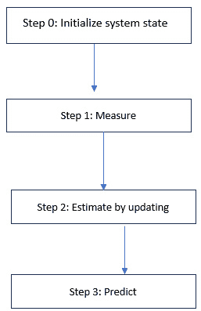

# 第七章：卡尔曼滤波器

在动态系统中，存在不确定信息。为了捕捉这些不确定性，另一个数学工具——卡尔曼滤波器应运而生。我们可以利用卡尔曼滤波器来最优地估算系统的下一个状态，它特别适用于不断变化的系统。它对于处理噪声传感器数据尤其有用，通过对传感器数据的整合来最佳估算感兴趣的参数。换句话说，卡尔曼滤波器是在不精确和不确定的测量条件下，对系统状态进行估算的工具。它主要用于实时估算未观察到的变量。

卡尔曼滤波算法广泛应用于信号处理、目标跟踪、导航和控制等领域。在跟踪和控制系统中，位置和速度的准确精确估算是一个挑战，因为它们是隐藏（未知）状态。隐藏状态测量中的不确定性通常归因于外部因素，如大气效应和热噪声。卡尔曼滤波器是一种估算动态系统隐藏状态并根据过去的估算预测系统未来状态的算法。它以 Rudolf E. Kalman 的名字命名，他在 1960 年发表了关于离散数据线性滤波问题的递归解决方案的著名论文。

一个系统由一组方程控制，这组方程称为动态模型或状态空间模型。如果已知系统的当前状态和动态模型，就可以估算出后续状态。动态模型中的不确定性受外部因素的影响，称为过程噪声。这是运动方程与系统实际运动之间的误差或偏差。测量中的随机误差或不确定性被称为测量噪声。为了提高对系统未来状态的估算，必须考虑过程噪声和测量噪声。卡尔曼滤波器会同时考虑这两种不确定性。

任何测量（或计算）的参数都是一个估算值，通过使用多个传感器，可以显著提高估算精度。在这方面，有两个术语需要明确理解，它们不能互换使用，分别是准确度和精度。准确度表示测量值与真实值之间的接近程度，而精度表示相同参数测量值的变异性。准确度和精度构成了对系统隐藏状态估算的基础。*图 7.1* 显示了高精度和高准确度的估算：


图 7.1：高精度和高准确度的测量

无偏系统没有或只有极低的内建系统误差（偏差），因此是高精度系统。实际系统是有偏的，并且有过程噪声。高精度系统具有低方差（或低不确定性）。通过对测量值进行平均（平滑），可以减小方差的影响。测量次数越多，估算值越接近真实值。**概率分布函数**（**PDF**）将测量值描述为一个随机变量。分布的离散度（*图 7.2*）显示了测量噪声。在低精度和低准确度系统中，估计值既不彼此接近，也不接近真实值，且将分布在空间坐标的四个象限中。


图 7.2：测量分布

现在我们已经清楚了测量值的概念及其精度和准确度，我们将讨论卡尔曼滤波器是如何工作的。本章涵盖了这一估算算法的基本步骤，最后会给出一个示范的 Python 代码：

+   测量值的计算

+   测量值的滤波

+   卡尔曼滤波器的实现

卡尔曼滤波器将在最后一节中通过一个示例进行测试，用 Python 来估算一个移动物体的位置（位移）和速度。

# 测量值的计算

我们将从卡尔曼滤波器算法的流程图开始，如*图 7.3a*所示。卡尔曼滤波器需要一个初始猜测来开始，这个输入可以是一个非常粗略的估计。因此，步骤 0 是初始猜测，步骤 1 是状态变量的测量。



图 7.3a：卡尔曼滤波器的流程图

当输入是测量值时，输出是使用步骤 2 中的状态更新方程估算的当前状态，该状态是根据当前状态的预测值和由一个叫做卡尔曼增益的因子缩放（更新）的残差计算出来的。卡尔曼增益考虑了输入测量的不确定性，残差是测量值和预测值之间的差异。这一更新和估算构成了算法中的第二步。

步骤 2 的输出被用来预测系统的下一状态。下一次迭代的状态通过动态模型来预测。步骤 3 中的预测基本上是利用动态方程组对当前状态的外推。这一过程会持续多个迭代，每次迭代都会计算卡尔曼增益。*图 7.3b* 中展示了一个示例，追踪了一个常速飞机在一维空间中的值（真实值、测量值、估计值和预测值），这也举例了一个单变量卡尔曼滤波器：


图 7.3b：恒速飞行器的估计值和预测值（位置）

从图中可以看出，估计算法（卡尔曼滤波器）对测量值具有平滑作用，并且随着迭代步数的增加，估计值逐渐趋近于真实值。下一节描述了如何以测量形式对随机变量进行滤波，以优化估计中的不确定性。

# 测量值的滤波

卡尔曼滤波器具有与任何滤波器相似的输入和输出。输入是噪声大且不准确的测量值，而输出则是噪声较小、估计更准确的值。从数学角度来看，滤波器的输入是测量值和测量协方差矩阵。动态系统模型是状态转移矩阵（表示方程）和过程噪声协方差矩阵，卡尔曼增益是内部的，并且依赖于系统，滤波器的输出是状态变量和状态协方差矩阵。如*图 7.4a*所示：


图 7.4a：卡尔曼滤波器的输入和输出

当估计值在时间上传播时，未来状态本质上是不可确定的，因此，误差协方差矩阵会随着时间的推移而增长。动态模型（运动方程）是近似的，过程噪声（不确定性）会增加已有的噪声，这由过程噪声协方差矩阵表示。估计值需要从状态空间转换到测量空间，这一转换是通过另一个矩阵（状态到测量矩阵）完成的。对于本章讨论的应用于线性系统的卡尔曼滤波器，这一变换矩阵较为简单，而对于非线性（或扩展）卡尔曼滤波器，变换可能会更为复杂。如果系统是非线性的，则使用非线性状态估计器或滤波器。例如，扩展卡尔曼滤波器会对当前估计的均值附近的分布进行线性化，并将其应用于算法的预测和更新状态。

卡尔曼增益在每次迭代中计算，并决定输入测量（新信息）对估计的影响。如果输入测量非常嘈杂，卡尔曼增益会更多依赖当前的状态估计而非输入。卡尔曼滤波器能够在每个时间步长上识别如何适当地对当前估计和新的输入测量赋予权重，从而生成最优估计。


图 7.4b：以分布函数形式表示的卡尔曼滤波

总结来说，卡尔曼滤波器是一种最优滤波器，它通过最小化不确定性来处理两个随机变量（先验估计和测量），以估计当前状态变量，如*图 7.4b*所示。如果我们有一个高方差的先验分布和一个低方差的测量分布，卡尔曼滤波器将两者结合起来，估计出一个比先验分布峰值更高、方差更窄的分布。

在接下来的章节中，将实现基于卡尔曼滤波估计算法的测量计算与滤波过程，并使用 Python 代码。

# 卡尔曼滤波器的实现

在这个示例中，使用时间序列数据作为输入，卡尔曼滤波器在每个时间步骤提供估计值。该示例展示了一辆移动的车辆，并进行了速度、位移和加速度的初始化。不同时间步的加速度值也被包含在内。描述车辆位移、速度和加速度之间关系的运动学方程式提供了真实值：

```py
import numpy as np
import math, random
import matplotlib.pyplot as plt
current_vel, current_disp, current_accel = 2, 0, 0
total_time = 100
accel_dict = {0:0,5:2,10:8, 20: -2,40:5,45: 9, 60: -3,85:0}
true_values = []
for t in range (1, total_time+1):
     current_disp = current_disp + current_vel + (1/2) * current_accel
     try:
         current_accel = accel_dict[t]
     except KeyError:
                    pass
     current_vel = current_vel + current_accel
     true_values.append((current_disp, current_vel, current_accel))
```

随机噪声（误差）以小扰动的形式添加到真实值中，并确定了测量值：

```py
err_range = [700, 30, 15] #noise
measurements = []
for item in true_values:
     d,v,a = item
     random_err = [random.randint(-1*err_range[0], err_range[0]), random.randint(-1*err_range[1], err_range[1]), random.randint(-1*err_range[2], err_range[2])]
      new_disp = d + random_err[0] if d+random_err[0] > 0 else 0
      new_vel = v + random_err[1]
      new_accel = a + random_err[2]
      measurements.append((new_disp, new_vel, new_accel))
```

我们可以将真实值与位移的测量值进行比较。运行以下代码后，我们得到一个视觉对比（*图 7.5*）。类似地，我们也可以对真实值和速度的测量值进行视觉对比：

```py
plt.plot([i for i in range(total_time)], [y[0] for y in true_values], 'r--', label = 'True Values')
plt.plot([i for i in range(total_time)], [y[0] for y in measurements], 'b--', label = 'Measurements')
plt.ylabel("Displacement")
plt.xlabel("Time (s)")
plt.legend()
plt.show()
```


图 7.5：位移的真实值与测量值

因此，我们已经完成了测量值的计算。接下来是测量值的滤波过程，其中噪声数据被输入到卡尔曼滤波器中。初始化了位移和速度，并估计了误差协方差（`Q`）。同时使用了转移矩阵（`A`），假设车辆的加速度是未知的。由于数据中的噪声，测量误差（`R`）高于估计误差。以下代码中的`H`提供了状态，`P`是误差矩阵：

```py
x_k = np.asarray([30,20])
Q = np.asarray([[0.004,0.002],[0.002,0.001]])
A = np.asarray([[1,1],[0,1]])
R = np.asarray([[0.4,0.01],[0.04,0.01]])
H = np.asarray([[1,0],[0,1]])
P = np.asarray([[0,0],[0,0]])
estimation = []
for k_loop in range(total_time):
     z_k = np.asarray([measurements[k_loop][0], measurements[k_loop][1]])
     x_k = A.dot(x_k)
     P = (A.dot(P)).dot(A.T) + Q
            K = (P.dot(H.T)).dot(np.linalg.inv((H.dot(P).dot(H.T)) + R))
     x_k = x_k + K.dot((z_k - H.dot(x_k)))
     P = (np.identity(2) - K.dot(H)).dot(P)
     estimation.append((x_k[0], x_k[1]))
```

我们现在可以将真实值与位移和速度的估计值进行比较。运行以下代码后，我们得到一个仅关于位移的视觉对比（*图 7.6*）：

```py
plt.plot([i for i in range(total_time)], [y[0] for y in true_values], 'r--', label = 'True Values')
plt.plot([i for i in range(total_time)], [y[0] for y in measurements], 'b--', label = 'Measurements')
plt.plot([i for i in range(total_time)], [y[0] for y in estimation], 'g--', label = 'Estimated Values')
plt.title('Estimation of displacement')
plt.ylabel("Displacement")
plt.xlabel("Time (s)")
plt.legend()
plt.show()
```


图 7.6：位移的真实值与估计值

显而易见，当使用卡尔曼滤波器处理带噪数据时，它能够提供与真实值非常接近的位移估计。算法实现中使用的移动车辆示例如*图 7.7*所示：


图 7.7：移动车辆的最优状态估计

尽管在 Python 代码中使用了合成数据，但该算法的使用和应用是通用的，只要系统动态的矩阵设置得当，该算法就能有效作用于动态系统。

# 总结

在本章中，我们探讨了卡尔曼滤波器——一种用于解决信号处理、导航和控制系统问题的估计与预测算法。卡尔曼滤波器包括线性和单变量（即一维）滤波器，其中假设系统动态是线性的。然而，许多动态过程具有多维度，在这种情况下，我们使用多变量且通常是非线性的（或扩展的）卡尔曼滤波器。例如，描述一个运动物体的位置和速度的状态向量是六维的，而非线性卡尔曼滤波器被用来确定此类物体在空间中的位移（和速度）。此外，由于卡尔曼滤波器在操作中使用占用较少计算机内存的矩阵，它消耗的计算资源较少（从而减少运行时间）。卡尔曼滤波器被认为是在噪声数据下最好的估计算法，因为它通过结合我们已有的信息，提供了一个更具信心的分布，从而减轻了不确定性。

下一章是本书这一部分（*数学工具*）的最后一章，内容是关于马尔可夫链的，它是一种从具有复杂概率分布的总体中采样状态的算法。它是一个用于遍历状态系统的概率工具。换句话说，它在图上随机行走，并帮助根据当前知识预测下一个状态。
