# 第八章：马尔可夫链

马尔可夫链是最重要的随机过程之一，能够通过概率解决现实世界中的问题。马尔可夫链是一个离散位置集合中的随机运动模型，换句话说，它是一个从一个位置（状态）到另一个位置（状态）过渡的模型，并且具有一定的概率。它以俄罗斯数学家安德雷·马尔可夫（Andrey Markov）的名字命名，他以在随机过程上的工作而著名。它是一个数学系统，用于描述一系列事件，其中每个事件的概率仅依赖于前一个事件。

“未来仅依赖于当前，而非过去。”

事件或状态可以表示为 {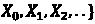，其中 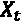 是时刻 t 的状态。该过程 {} 具有一个性质，即 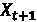，它仅依赖于 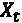，并且不依赖于 {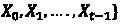}。这样的过程称为马尔可夫过程或马尔可夫链。它是遍历一组状态的随机游走。二状态马尔可夫链是一种状态可以转换为自身（即保持在同一状态）。如 *图 8.1*（状态图）所示。马尔可夫链的一个例子是 PageRank 算法，它被谷歌用来确定搜索结果的排序。

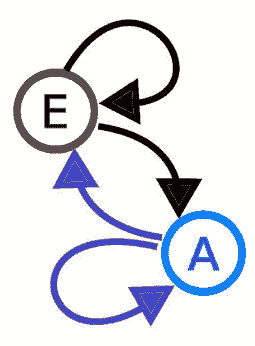

图 8.1：二状态（A 和 E）马尔可夫链

当涉及将现实世界的现象融入计算机仿真时，马尔可夫链非常强大。它是一类表示动态过程的概率图模型，限制在于它只能采用有限数量的状态。马尔可夫链没有长期记忆（简而言之是无记忆的），因此无法知道过去的状态。因此，在马尔可夫链中，唯一决定未来状态的状态是当前状态，这就是所谓的马尔可夫性质。

本章涵盖以下主题：

+   离散时间马尔可夫链

+   **马尔可夫链蒙特卡洛** (**MCMC**)

以下部分讨论了马尔可夫链的基本原理，马尔可夫链是一个离散时间的随机过程。

# 离散时间马尔可夫链

对于离散时间马尔可夫过程，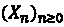 在连续时间中，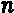 被 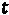 替代，其中 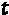 会持续到无穷大。在马尔可夫链中，给定当前状态，过去和未来的状态是独立的，这也意味着未来仅依赖于当前状态。在以下小节中，我们将学习转移矩阵以及马尔可夫链在时间序列数据中的应用，特别是在短期预测中的应用。

## 转移概率

马尔科夫状态之间的转移概率被捕捉在状态转移矩阵中。转移矩阵的维度由状态空间中的状态数量决定。每个状态都作为一行和一列包含在内，矩阵中的每个单元格给出了从其行状态到其列状态的转移概率，如 *图 8.2* 所示。为了预测一步后的状态，必须知道转移矩阵和当前状态。转移概率（矩阵元素）通常通过历史序列数据来建立。

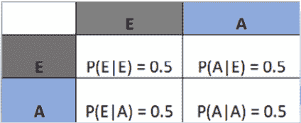

图 8.2：两个状态的转移矩阵

## 马尔科夫链的应用

马尔科夫链用于建模随机过程的行为。它们可以用于文本预测，例如自动完成句子，或者建模时间序列数据的演变，例如建模金融市场的行为。

以下 Python 代码展示了如何使用马尔科夫链建模股票价格。为股票价格的时间演变定义了一组状态（按顺序为 `increase`、`decrease` 和 `stable`），并给出了这些状态之间的转移概率。转移矩阵用于预测未来的可能（下一个状态）价格：

```py
import numpy as np
states = ["increase", "decrease", "stable"] #Markov states
transition_probs = np.array([[0.6, 0.3, 0.1], [0.4, 0.4, 0.2], [0.5, 0.3, 0.2]])
num_steps = 10                 #time-steps for simulation
def MC_states(current_state):
     future_states = []
for i in range(num_steps):
           probs = transition_probs[states.index(current_state)]
           new_state = np.random.choice(states, p = probs)
           future_states.append(new_state)
           current_state = new_state #Update current state
     return future_states
#output
MC_states("increase")
```

输出是一系列未来的状态，如 *图 8.3* 所示，基于当前状态。如果在执行代码中的函数时，当前状态设置为 `decrease` 或 `stable`（初始状态），则会得到不同的输出。状态序列展示了股票价格随时间的变化。需要注意的是，当系统未表现出平稳行为时（即状态之间的转移概率随时间变化），应当小心处理。在这种情况下，可以使用更复杂的马尔科夫模型或完全不同的模型来捕捉系统的行为。

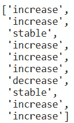

图 8.3：Python 示例代码的输出

如果 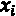 是序列处于状态 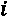（观察到状态）的次数，而 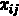 是从状态 *i* 到状态 *j* 之间发生转移的次数，那么转移概率定义如下：

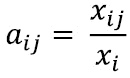

在下一节中，我们将学习一种用于高维概率分布的采样方法 MCMC，其中下一个样本依赖于当前从一个人群中随机抽取的样本。简而言之，从分布中抽取的样本在概率上是相互依赖的。样本空间的体积随着参数或维度的增加而呈指数增长，使用蒙特卡罗采样等直接方法建模这样的空间可能会不准确。MCMC 方法尝试利用随机问题的属性，并高效地构建相应的马尔可夫过程。

# 马尔可夫链蒙特卡罗

MCMC 是一种从高维概率定义所定义的目标人群/分布中进行随机采样的方法。这是一种大规模统计方法，从复杂的概率空间中随机抽取样本，以近似未来状态范围内属性的分布。它有助于评估未来结果的分布，样本均值帮助近似期望值。马尔可夫链是一个**状态图**，采样算法在其上执行随机游走。

最著名的 MCMC 算法可能是吉布斯采样。这些算法只是构建马尔可夫链的不同方法论。最通用的 MCMC 算法是 Metropolis-Hastings 算法，具有多种灵活性。这两个算法将在接下来的小节中讨论。

## 吉布斯采样算法

在吉布斯采样中，马尔可夫链中下一个样本的概率被计算为前一个样本的条件概率。马尔可夫链中的样本是通过每次改变一个随机变量来构建的（以分布中的其他变量为条件），这意味着后续样本在搜索空间中会更接近。吉布斯采样最适用于离散（而非连续）分布，这种分布具有允许采样并计算条件概率的参数形式。吉布斯采样的一个示例显示在*图 8.4*中，它再现了期望的分布。

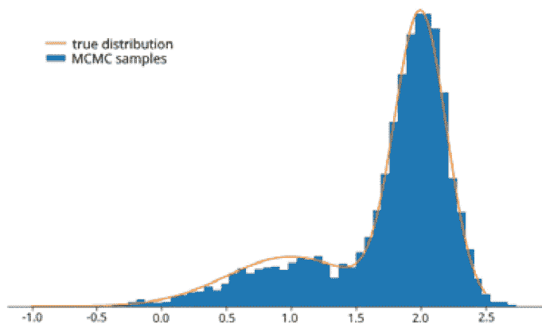

图 8.4：吉布斯采样器再现期望的高斯混合

吉布斯采样器比 Metropolis-Hastings 算法（将在下一个小节中讨论）更高效。它从一个提议分布开始，并且提议总是被接受；也就是说，接受概率始终为 1。我们将在最后一个小节中使用二维高斯分布的例子，结合 Python 代码来演示吉布斯采样器。

## Metropolis-Hastings 算法

Metropolis-Hastings 算法用于吉布斯抽样无法使用的概率模型。它不假设下一个样本的状态可以从目标分布生成，这是吉布斯抽样中的主要假设。该算法使用了一个代理概率分布，也叫做核函数，并通过接受准则帮助决定是否将新样本接受到马尔科夫链中，或者是否必须拒绝它。提议分布（代理）是对下一个样本的任意建议，接受准则确保在接近真实或期望的下一个样本状态时，能沿着适当的方向收敛。算法的起始点非常重要，可以探索不同的提议分布。

这个算法是如何工作的？

1.  我们从一个随机状态开始。

1.  基于提议的概率，我们随机选择一个新的状态。

1.  我们计算提议新状态的接受概率。

例如，假设投币正面朝上的概率就是接受概率。如果投币正面朝上，我们接受该样本；否则，拒绝它。

1.  我们重复这个过程很长时间。

我们丢弃最初的几个样本，因为链条尚未达到其平稳状态。链条达到平稳状态之前的阶段称为烧入期（见*图 8.5*）。经过一段时间后，接受的抽样将会收敛到平稳分布。

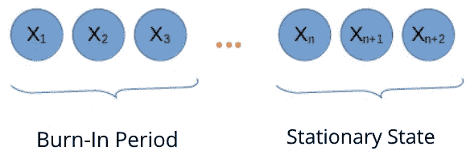

图 8.5：马尔科夫链

平稳分布展示了在任意给定时间处于任意状态 X 的概率，如果生成大量样本，始终可以达到该分布。这个分布就是我们要寻找的后验分布。后验分布与似然函数和先验分布的乘积成正比。Metropolis-Hastings 算法类似于扩散过程，其中所有状态都在相互交流（设计使然），因此系统最终会趋于一个平衡状态，这与收敛到平稳状态是一样的。这一性质称为**遍历性**。

在接下来的小节中，我们通过 Python 代码使用双变量分布的例子来说明 Metropolis-Hastings 抽样算法。

## MCMC 算法的示意图

吉布斯抽样算法的工作原理通过以下代码展示了一个简单的双变量高斯分布。我们传递两个参数（mu 和 sigma）用于条件概率分布，并丢弃一部分最初采样的值，以便算法收敛，即使起始（猜测）值偏差很大。这部分样本称为烧入期：

```py
import numpy as np
import matplotlib.pyplot as plt
import seaborn as sns
np.random.seed(42)
def gibbs_sampler(mus, sigmas, n_iter = 10000):
    samples = []
    y = mus[1]
    for _ in range(n_iter):
        x = p_x_y(y, mus, sigmas)
        y = p_y_x(x, mus, sigmas)
        samples.append([x, y])
    return samples
def p_x_y(y, mus, sigmas):
    mu = mus[0] + sigmas[1, 0]/sigmas[0, 0] * (y - mus[1])
    sigma = sigmas[0, 0]-sigmas[1, 0]/sigmas[1, 1]*sigmas[1, 0]
    return np.random.normal(mu, sigma)
def p_y_x(x, mus, sigmas):
    mu = mus[1] + sigmas[0, 1] / sigmas[1, 1]*(x - mus[0])
    sigma = sigmas[1, 1] - sigmas[0, 1]/sigmas[0, 0]*sigmas[0, 1]
    return np.random.normal(mu, sigma)
mus = np.asarray([5, 5])
sigmas = np.asarray([[1, 0.9], [0.9, 1]])
samples = gibbs_sampler(mus, sigmas)
burnin = 200
x = list(zip(*samples[burnin:]))[0]
y = list(zip(*samples[burnin:]))[1]
sns.jointplot(samples[burnin:], x = x, y = y, kind = 'kde')
sns.jointplot(samples[burnin:], x = x, y = y, kind = 'reg')
plt.show()
```

我们运行代码，Gibbs 采样器生成了一个输出，如*图 8.6a*所示，输出有两种形式，即核密度估计图和线性回归拟合图。输出是基于使用 Gibbs 采样算法的采样值所得到的结果（目标）分布。

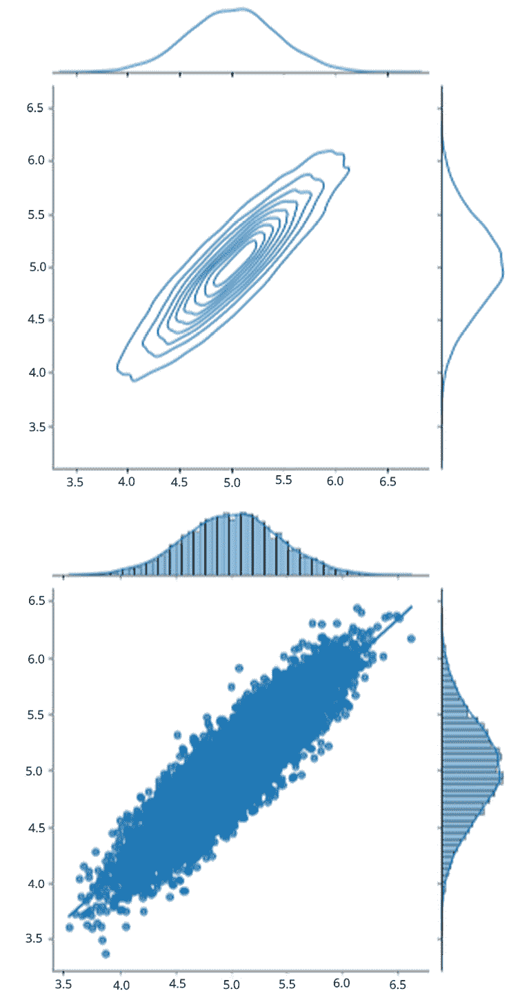

图 8.6a：Gibbs 采样算法的目标分布

我们为 Metropolis-Hastings 采样器运行了一个类似的设置（二元分布）。Python 代码和输出如下所示。首先，我们绘制真实分布，然后使用多元正态分布作为提议分布。*图 8.6b* 是基于使用该算法采样的输出（目标分布）：

```py
import numpy as np
import matplotlib.pyplot as plt
from tqdm import tqdm as tqdm
def density(z):
    z = np.reshape(z, [z.shape[0], 2])
    z1, z2 = z[:, 0], z[:, 1]
    norm = np.sqrt(z1 ** 2 + z2 ** 2)
    exp1 = np.exp(-0.5 * ((z1 - 2) / 0.6) ** 2)
    exp2 = np.exp(-0.5 * ((z1 + 2) / 0.6) ** 2)
    v = 0.5 * ((norm - 2) / 0.4) ** 2 – np.log(exp1 + exp2)
    return np.exp(-v)
r = np.linspace(-5, 5, 1000)
z = np.array(np.meshgrid(r, r)).transpose(1, 2, 0)
z = np.reshape(z, [z.shape[0] * z.shape[1], -1])
def metropolis_sampler(target_density, size = 100000):
    burnin = 5000
    size += burnin
    x0 = np.array([[0, 0]])
    xt = x0
    samples = []
    for i in tqdm(range(size)):
        xt_candidate = np.array([np.random.multivariate_normal(xt[0], np.eye(2))])
      accept_prob = (target_density(xt_candidate))/(target_density(xt))
      if np.random.uniform(0, 1) < accept_prob:
         xt = xt_candidate
      samples.append(xt)
    samples = np.array(samples[burnin:])
     samples = np.reshape(samples, [samples.shape[0], 2])
    return samples
q = density(z) #true density
plt.hexbin(z[:,0], z[:,1], C = q.squeeze())
plt.gca().set_aspect('equal', adjustable ='box')
plt.xlim([-3, 3])
plt.ylim([-3, 3])
plt.show()
samples = metropolis_sampler(density)
plt.hexbin(samples[:,0], samples[:,1])
plt.gca().set_aspect('equal', adjustable = 'box')
plt.xlim([-3, 3])
plt.ylim([-3, 3])
plt.show()
```

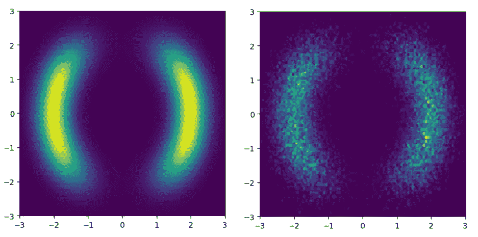

图 8.6b：Metropolis-Hastings 采样算法的真实分布（L）和目标分布（R）

对于有限（离散的以及连续的）状态空间，保证存在一个唯一的平稳状态。我们从一个先验概率分布开始，最终得到一个平稳分布，即基于采样值得到的后验或目标分布。

# 摘要

在本章中，我们学习了马尔科夫链，它被用来建模特殊类型的随机过程，比如那些假设整个过去已经编码在当前状态中的问题，这反过来可以用于确定下一个（未来）状态。我们还展示了马尔科夫链在建模时间序列数据中的应用。我们还介绍了最常见的 MCMC 算法（Metropolis-Hastings），并用代码进行了说明。如果一个系统表现出非平稳行为（转移概率随时间变化），那么马尔科夫链就不是合适的模型，可能需要更复杂的模型来捕捉动态系统的行为。

本章结束后，我们完成了本书的第二部分。在下一章中，我们将探讨基本的优化技术，其中一些技术在机器学习中得到了应用。我们将讨论进化优化、运筹学中的优化，以及在神经网络训练中应用的优化方法。

# 第三部分：数学优化

在本部分，你将接触到为机器学习、深度学习以及运筹学中使用的其他模型奠定基础的优化技术。优化技术在预测性和规范性分析中具有极大的威力，并应用于重工业中的许多复杂问题。此外，将经典数学建模与机器学习相结合，通常可以为特定的敏感商业问题提取出更有意义的洞察。

本部分包括以下章节：

+   *第九章*，*探索优化技术*

+   *第十章*，*机器学习的优化技术*
