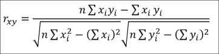

# 第二章 完整性与检查

本章将涵盖以下内容：

+   去除多余的空格

+   忽略标点符号和特定字符

+   处理意外或缺失的输入

+   通过匹配正则表达式验证记录

+   对电子邮件地址进行词法分析和解析

+   去重无冲突的数据项

+   去重有冲突的数据项

+   使用 Data.List 实现频率表

+   使用 Data.MultiSet 实现频率表

+   计算曼哈顿距离

+   计算欧几里得距离

+   使用 Pearson 相关系数比较缩放后的数据

+   使用余弦相似度比较稀疏数据

# 介绍


从数据分析中得出的结论的稳健性仅取决于数据本身的质量。在获得原始文本后，下一步自然是仔细验证和清理它。即使是最轻微的偏差也可能危及结果的完整性。因此，我们必须采取严格的预防措施，包括全面检查，以确保在开始理解数据之前对数据进行合理性检查。本节应为在 Haskell 中清理数据的起点。

现实世界中的数据通常带有一些杂质，需要在处理之前进行清理。例如，多余的空格或标点符号可能会使数据混乱，难以解析。重复和数据冲突是读取现实世界数据时常见的意外后果。有时，通过执行合理性检查来确保数据是有意义的，这会令人放心。一些合理性检查的例子包括匹配正则表达式以及通过建立距离度量来检测离群值。本章将涵盖这些主题。

# 去除多余的空格

从源获取的文本可能会无意中包含开头或结尾的空格字符。在解析此类输入时，通常明智的做法是修剪文本。例如，当 Haskell 源代码包含尾部空格时，**GHC** 编译器会通过称为 **词法分析** 的过程忽略它。词法分析器生成一系列标记，实际上忽略了像多余空格这样的无意义字符。

在本例中，我们将使用内置库来制作我们自己的 `trim` 函数。

## 如何实现...

创建一个新的文件，我们称之为 `Main.hs`，并执行以下步骤：

1.  从内置的 `Data.Char` 包中导入 `isSpace :: Char -> Bool` 函数：

    ```py
    import Data.Char (isSpace)
    ```

1.  编写一个 `trim` 函数，去除开头和结尾的空格：

    ```py
    trim :: String -> String
    trim = f . f
      where f = reverse . dropWhile isSpace
    ```

1.  在 `main` 中测试：

    ```py
    main :: IO ()
    main = putStrLn $ trim " wahoowa! "
    ```

1.  运行代码将得到以下修剪后的字符串：

    ```py
    $ runhaskell Main.hs

    wahoowa!

    ```

## 它是如何工作的...

我们的`trim`函数懒加载地去除了字符串开头和结尾的空白。它首先删除字符串开头的空白字符。然后，它会将字符串反转，再次应用同样的函数。最后，它会将字符串再反转一次，使其恢复到原来的形式。幸运的是，`Data.Char`中的`isSpace`函数处理了所有**Unicode**空白字符以及控制字符`\t`、`\n`、`\r`、`\f`和`\v`。

## 还有更多...

现成的解析器组合库，如`parsec`或`uu-parsinglib`，可以用来实现这一功能，而不是重新发明轮子。通过引入`Token`类型并解析为该类型，我们可以优雅地忽略空白字符。或者，我们可以使用 alex 词法分析库（包名`alex`）来完成此任务。虽然这些库对于这个简单的任务来说有些过于复杂，但它们允许我们对文本进行更通用的标记化处理。

# 忽略标点符号和特定字符

通常在自然语言处理（NLP）中，一些没有信息量的单词或字符，被称为**停用词**，可以被过滤掉，以便更容易处理。在计算单词频率或从语料库中提取情感数据时，可能需要忽略标点符号或特殊字符。本示例演示了如何从文本主体中去除这些特定字符。

## 如何实现...

不需要任何导入。创建一个新文件，我们称之为`Main.hs`，并执行以下步骤：

1.  实现`main`并定义一个名为`quote`的字符串。反斜杠（`\`）表示多行字符串：

    ```py
    main :: IO ()
    main = do
      let quote = "Deep Blue plays very good chess-so what?\ 
        \Does that tell you something about how we play chess?\
        \No. Does it tell you about how Kasparov envisions,\ 
        \understands a chessboard? (Douglas Hofstadter)"
      putStrLn $ (removePunctuation.replaceSpecialSymbols) quote
    ```

1.  将所有标点符号替换为空字符串，并将所有特殊符号替换为空格：

    ```py
    punctuations = [ '!', '"', '#', '$', '%'
                   , '(', ')', '.', ',', '?']

    removePunctuation = filter (`notElem` punctuations)

    specialSymbols = ['/', '-']

    replaceSpecialSymbols = map $ 
      (\c ->if c `elem` specialSymbols then ' ' else c)
    ```

1.  通过运行代码，我们将发现所有特殊字符和标点符号已被适当移除，以便处理文本语料库。

    ```py
    $ runhaskell Main.hs
    Deep Blue plays very good chess so what Does that tell you something about how we play chess No Does it tell you about how Kasparov envisions understands a chessboard Douglas Hofstadter

    ```

## 还有更多...

为了更强大的控制，我们可以安装`MissingH`，这是一款非常有用的工具，可用于处理字符串：

```py
$ cabal install MissingH

```

它提供了一个`replace`函数，接受三个参数并产生如下结果：

```py
Prelude> replace "hello" "goodbye" "hello world!"

"goodbye world!"

```

它将第一个字符串的所有出现位置替换为第三个参数中的第二个字符串。我们还可以组合多个`replace`函数：

```py
Prelude> ((replace "," "").(replace "!" "")) "hello, world!"

"hello world"

```

通过将组合函数`(.)`应用于这些`replace`函数的列表，我们可以将`replace`函数推广到任意的符号列表：

```py
Prelude> (foldr (.) id $ map (flip replace "") [",", "!"]) "hello, world!"

"hello world"

```

现在，标点符号的列表可以是任意长度的。我们可以修改我们的示例，使用新的、更通用的函数：

```py
removePunctuation = foldr (.) id $ map (flip replace "") 
        ["!", "\"", "#", "$", "%", "(", ")", ".", ",", "?"]

replaceSpecialSymbols = foldr (.) id $ map (flip replace " ") 
        ["/", "-"]
```

# 应对意外或缺失的输入

数据源通常包含不完整和意外的数据。在 Haskell 中处理这种数据的一种常见方法是使用`Maybe`数据类型。

想象一下设计一个函数来查找字符列表中的第 n 个元素。一个简单的实现可能是类型为`Int -> [Char] -> Char`。然而，如果该函数试图访问一个越界的索引，我们应该尝试指示发生了错误。

处理这些错误的一种常见方法是将输出的`Char`封装在`Maybe`上下文中。拥有`Int -> [Char] -> Maybe Char`类型可以提供更好的错误处理。`Maybe`的构造函数是`Just a`或`Nothing`，通过运行 GHCi 并测试以下命令会变得明显：

```py
$ ghci

Prelude> :type Just 'c'
Just 'c' :: Maybe Char

Prelude> :type Nothing
Nothing :: Maybe a

```

我们将每个字段设置为`Maybe`数据类型，这样当某个字段无法解析时，它将简单地表示为`Nothing`。这个食谱将演示如何读取包含错误和缺失信息的 CSV 数据。

## 准备就绪

我们创建一个 CSV 文件输入集来读取。第一列是笔记本品牌，第二列是其型号，第三列是基础费用。我们应该留下一些字段为空，以模拟不完整的输入。我们将文件命名为`input.csv`：


同时，我们还必须安装 csv 库：

```py
$ cabal install csv

```

## 如何操作...

创建一个新文件，我们将其命名为`Main.hs`，并执行以下步骤：

1.  导入 CSV 库：

    ```py
    import Text.CSV
    ```

1.  创建一个对应于 CSV 字段的数据类型：

    ```py
    data Laptop = Laptop { brand :: Maybe String
                         , model :: Maybe String
                         , cost :: Maybe Float 
                         } deriving Show
    ```

1.  定义并实现`main`来读取 CSV 输入并解析相关信息：

    ```py
    main :: IO ()
    main = do
      let fileName = "input.csv"
      input <- readFile fileName
      let csv = parseCSV fileName input
      let laptops = parseLaptops csv
      print laptops
    ```

1.  从记录列表中创建一个笔记本数据类型列表：

    ```py
    parseLaptops (Left err) = []
    parseLaptops (Right csv) = 
      foldl (\a record -> if length record == 3
                          then (parseLaptop record):a
                          else a) [] csv

    parseLaptop record = Laptop{ brand = getBrand $ record !! 0
                               , model = getModel $ record !! 1
                               , cost = getCost $ record !! 2 }
    ```

1.  解析每个字段，如果出现意外或缺失的项，则生成`Nothing`：

    ```py
    getBrand :: String -> Maybe String
    getBrand str = if null str then Nothing else Just str

    getModel :: String -> Maybe String
    getModel str = if null str then Nothing else Just str

    getCost :: String -> Maybe Float
    getCost str = case reads str::[(Float,String)] of
      [(cost, "")] -> Just cost
      _ -> Nothing
    ```

## 它是如何工作的...

`Maybe`单子允许你有两种状态：`Just`某物或`Nothing`。它提供了一种有用的抽象来产生错误状态。这些数据类型中的每个字段都存在于`Maybe`上下文中。如果字段不存在，我们简单地将其视为`Nothing`并继续。

## 还有更多内容...

如果希望有更具描述性的错误状态，`Either`单子可能更有用。它也有两种状态，但它们更具描述性：`Left`某物，或`Right`某物。`Left`状态通常用来描述错误类型，而`Right`状态则包含期望的结果。我们可以使用`Left`状态来描述不同类型的错误，而不仅仅是一个庞大的`Nothing`。

## 另见

要复习 CSV 数据输入，请参阅第一章中的*保存和表示 CSV 文件中的数据*食谱，*数据探索*。

# 通过匹配正则表达式验证记录

正则表达式是一种用于匹配字符串中模式的语言。我们的 Haskell 代码可以处理正则表达式来检查文本并告诉我们它是否符合表达式描述的规则。正则表达式匹配可用于验证或识别文本中的模式。

在这个食谱中，我们将读取一篇英文文本语料库，从大量的单词中找出可能的全名。全名通常由两个以大写字母开头的单词组成。我们利用这个启发式方法从文章中提取所有的名字。

## 准备就绪

创建一个包含文本的`input.txt`文件。在此示例中，我们使用来自《纽约时报》关于恐龙的文章片段（[`www.nytimes.com/2013/12/17/science/earth/outsider-challenges-papers-on-growth-of-dinosaurs.html`](http://www.nytimes.com/2013/12/17/science/earth/outsider-challenges-papers-on-growth-of-dinosaurs.html)）

*埃里克森博士的其他合著者包括美国自然历史博物馆古生物学主席马克·诺雷尔；阿尔伯塔大学恐龙古生物学教授菲利普·卡里；以及芝加哥田野博物馆古生物学副馆长彼得·马科维基。*

## 如何操作…

创建一个新文件，我们将其命名为`Main.hs`，并执行以下步骤：

1.  导入正则表达式库：

    ```py
    import Text.Regex.Posix ((=~))
    ```

1.  将字符串与正则表达式进行匹配，以检测看起来像名字的单词：

    ```py
    looksLikeName :: String -> Bool
    looksLikeName str = str =~ "^[A-Z][a-z]{1,30}$" :: Bool
    ```

1.  创建去除不必要标点符号和特殊符号的函数。我们将使用前一个食谱中定义的相同函数，标题为*忽略标点符号和特定字符*：

    ```py
    punctuations = [ '!', '"', '#', '$', '%'
                   , '(', ')', '.', ',', '?']
    removePunctuation = filter (`notElem` punctuations)

    specialSymbols = ['/', '-']
    replaceSpecialSymbols = map $ 
                             (\c -> if c `elem`  specialSymbols
                                    then ' ' else c)
    ```

1.  将相邻的单词配对，并形成一个可能的全名列表：

    ```py
    createTuples (x:y:xs) = (x ++ " " ++ y) : 
                              createTuples (y:xs)
    createTuples _ = [] 
    ```

1.  检索输入并从文本语料库中查找可能的名称：

    ```py
    main :: IO ()
    main = do

      input <- readFile "input.txt"
      let cleanInput = 
        (removePunctuation.replaceSpecialSymbols) input

      let wordPairs = createTuples $ words cleanInput

      let possibleNames = 
        filter (all looksLikeName . words) wordPairs

      print possibleNames
    ```

1.  运行代码后的结果输出如下：

    ```py
    $ runhaskell Main.hs

    ["Dr Erickson","Mark Norell","American Museum","Natural History","History Philip","Philip Currie","Peter Makovicky","Field Museum"]

    ```

## 它是如何工作的...

`=~`函数接受一个字符串和一个正则表达式，并返回我们解析为`Bool`的目标。在本食谱中，`^[A-Z][a-z]{1,30}$`正则表达式匹配以大写字母开头、长度在 2 到 31 个字母之间的单词。

为了确定本食谱中所呈现算法的有效性，我们将引入两个相关性指标：**精确度**和**召回率**。精确度是指检索到的数据中相关数据所占的百分比。召回率是指相关数据中被检索到的百分比。

在`input.txt`文件中的 45 个单词中，产生了四个正确的名字，并且总共检索到八个候选项。它的精确度为 50%，召回率为 100%。对于一个简单的正则表达式技巧来说，这个结果相当不错。

## 另见

我们可以通过词法分析器而不是直接在字符串上运行正则表达式。下一个名为*词法分析和解析电子邮件地址*的食谱将详细讲解这一点。

# 词法分析和解析电子邮件地址

清理数据的一种优雅方法是定义一个词法分析器，将字符串拆分成标记。在本食谱中，我们将使用`attoparsec`库解析电子邮件地址。这自然允许我们忽略周围的空格。

## 准备工作

导入`attoparsec`解析器组合器库：

```py
$ cabal install attoparsec

```

## 如何操作…

创建一个新文件，我们将其命名为`Main.hs`，并执行以下步骤：

1.  使用 GHC 的`OverloadedStrings`语言扩展，以便在代码中更清晰地使用`Text`数据类型。同时，导入其他相关库：

    ```py
    {-# LANGUAGE OverloadedStrings #-}
    import Data.Attoparsec.Text
    import Data.Char (isSpace, isAlphaNum)
    ```

1.  声明一个电子邮件地址的数据类型：

    ```py
    data E-mail = E-mail 
      { user :: String
      , host :: String
      } deriving Show
    ```

1.  定义如何解析电子邮件地址。这个函数可以根据需要简单或复杂：

    ```py
    e-mail :: Parser E-mail
    e-mail = do
      skipSpace
      user <- many' $ satisfy isAlphaNum
      at <- char '@'
      hostName <- many' $ satisfy isAlphaNum
      period <- char '.'
      domain <- many' (satisfy isAlphaNum)
      return $ E-mail user (hostName ++ "." ++ domain)
    ```

1.  解析电子邮件地址以测试代码：

    ```py
    main :: IO ()
    main = print $ parseOnly e-mail "nishant@shukla.io"
    ```

1.  运行代码打印出解析后的电子邮件地址：

    ```py
    $ runhaskell Main.hs

    Right (E-mail {user = "nishant", host = "shukla.io"})

    ```

## 它是如何工作的……

我们通过将字符串与多个测试匹配来创建电子邮件解析器。电子邮件地址必须包含一个字母数字的用户名，后跟“at”符号（`@`），然后是字母数字的主机名，一个句点，最后是顶级域名。

使用的各种`attoparsec`库函数可以在`Data.Attoparsec.Text`文档中找到，文档地址为[`hackage.haskell.org/package/attoparsec/docs/Data-Attoparsec-Text.html`](https://hackage.haskell.org/package/attoparsec/docs/Data-Attoparsec-Text.html)。

# 无冲突数据项去重

数据重复是收集大量数据时常见的问题。在本篇中，我们将以确保不丢失信息的方式合并相似的记录。

## 准备中

创建一个包含重复数据的`input.csv`文件：


## 如何做……

创建一个新的文件，我们将其命名为`Main.hs`，并执行以下步骤：

1.  我们将使用`CSV`、`Map`和`Maybe`包：

    ```py
    import Text.CSV (parseCSV, Record)
    import Data.Map (fromListWith)
    import Control.Applicative ((<|>))
    ```

1.  定义与 CSV 输入对应的`Item`数据类型：

    ```py
    data Item = Item   { name :: String
                       , color :: Maybe String
                       , cost :: Maybe Float
                       } deriving Show
    ```

1.  从 CSV 获取每条记录，并通过调用我们的`doWork`函数将它们放入映射中：

    ```py
    main :: IO ()
    main = do
      let fileName = "input.csv"
      input <- readFile fileName
      let csv = parseCSV fileName input
      either handleError doWork csv
    ```

1.  如果无法解析 CSV，打印错误消息；否则，定义`doWork`函数，该函数根据由`combine`定义的碰撞策略从关联列表创建映射：

    ```py
    handleError = print

    doWork :: [Record] -> IO ()
    doWork csv = print $ 
                 fromListWith combine $ 
                 map parseToTuple csv
    ```

1.  使用`Control.Applicative`中的`<|>`函数合并无冲突字段：

    ```py
    combine :: Item -> Item -> Item

    combine item1 item2 = 
        Item { name = name item1
             , color = color item1 <|> color item2
             , cost = cost item1 <|> cost item2 }
    ```

1.  定义辅助函数，从 CSV 记录创建关联列表：

    ```py
    parseToTuple :: [String] -> (String, Item)
    parseToTuple record = (name item, item) 
        where item = parseItem record

    parseItem :: Record -> Item
    parseItem record = 
        Item { name = record !! 0
          , color = record !! 1
          , cost = case reads(record !! 2)::[(Float,String)] of
            [(c, "")] -> Just c
            _ -> Nothing  }
    ```

1.  执行代码显示一个填充了合并结果的映射：

    ```py
    $ runhaskell Main.hs

    fromList 
    [ ("glasses",
     Item {name = "glasses", color = "black", cost = Just 60.0})
    , ("jacket",
     Item {name = "jacket", color = "brown", cost = Just 89.99})
    , ("shirt",
     Item {name = "shirt", color = "red", cost = Just 15.0})
    ]

    ```

## 它是如何工作的……

`Map`数据类型提供了一个便捷的函数`fromListWith :: Ord k => (a -> a -> a) -> [(k, a)] -> Map k a`，用于轻松地合并映射中的数据。我们使用它来检查一个键是否已经存在。如果存在，我们将旧项目和新项目中的字段合并，并将它们存储在该键下。

本篇的真正英雄是`Control.Applicative`中的`<|>`函数。`<|>`函数接受其参数，并返回第一个非*空*的参数。由于`String`和`Maybe`都实现了`Applicative`类型类，我们可以复用`<|>`函数来简化代码。以下是几个使用示例：

```py
$ ghci

Prelude> import Control.Applicative

Prelude Control.Applicative> (Nothing) <|> (Just 1)
Just 1

Prelude Control.Applicative> (Just 'a') <|> (Just 'b')
Just 'a'

Prelude Control.Applicative> "" <|> "hello"
"hello"

Prelude Control.Applicative> "" <|> ""
""

```

## 还有更多……

如果你处理的是较大的数字，可能明智之举是改用`Data.Hashmap.Map`，因为对*n*项的运行时间是*O(min(n, W))*，其中*W*是整数的位数（32 或 64）。

为了更好的性能，`Data.Hashtable.Hashtable`提供了*O(1)*的查找性能，但通过位于 I/O 单子中的复杂性增加了使用的难度。

## 另见：

如果语料库中包含关于重复数据的不一致信息，请参阅下一篇关于*冲突数据项去重*的内容。

# 冲突数据项去重

不幸的是，关于某一项的信息在语料库中可能是不一致的。冲突策略通常依赖于领域，但一种常见的管理冲突的方式是简单地存储所有数据的变体。在本示例中，我们将读取一个包含音乐艺术家信息的 CSV 文件，并将关于他们的歌曲和流派的所有信息存储在一个集合中。

## 准备就绪

创建一个 CSV 输入文件，包含以下音乐艺术家。第一列是艺术家或乐队的名称，第二列是歌曲名称，第三列是流派。请注意，一些音乐人有多首歌曲或多种流派。


## 如何操作...

创建一个新的文件，我们将其命名为`Main.hs`，并执行以下步骤：

1.  我们将使用`CSV`、`Map`和`Set`包：

    ```py
    import Text.CSV (parseCSV, Record)
    import Data.Map (fromListWith)
    import qualified Data.Set as S
    ```

1.  定义与 CSV 输入对应的`Artist`数据类型。对于可能包含冲突数据的字段，将其存储在相应的列表中。在这种情况下，与歌曲和流派相关的数据存储在一个字符串集合中：

    ```py
    data Artist = Artist { name :: String
                         , song :: S.Set String
                         , genre :: S.Set String
                         } deriving Show
    ```

1.  从 CSV 中提取数据并将其插入到映射中：

    ```py
    main :: IO ()
    main = do
      let fileName = "input.csv"
      input <- readFile fileName
      let csv = parseCSV fileName input
      either handleError doWork csv
    ```

1.  打印出可能发生的任何错误：

    ```py
    handleError = print
    ```

1.  如果没有错误发生，那么就将 CSV 中的数据合并并打印出来：

    ```py
    doWork :: [Record] -> IO ()
    doWork csv = print $ 
                 fromListWith combine $ 
                 map parseToTuple csv
    ```

1.  从关联列表创建一个映射，碰撞策略由`combine`定义：

    ```py
    combine :: Artist -> Artist -> Artist
    combine artist1 artist2 = 
        Artist { name = name artist1
               , song = S.union (song artist1) (song artist2)
               , genre = S.union (genre artist1) (genre artist2) }
    ```

1.  让辅助函数从 CSV 记录中创建关联列表：

    ```py
    parseToTuple :: [String] -> (String, Artist)
    parseToTuple record = (name item, item) 
      where item = parseItem record

    parseItem :: Record -> Artist
    parseItem record = 
      Artist { name = nameStr
             , song = if null songStr 
                      then S.empty 
                      else S.singleton songStr
             , genre = if null genreStr 
                       then S.empty 
                       else S.singleton genreStr
             }
      where nameStr  = record !! 0
            songStr  = record !! 1
            genreStr = record !! 2
    ```

1.  程序的输出将是一个映射，包含将收集的以下信息：

    ```py
    fromList [ 
    ("Daft Punk", Artist 
      {  name = "Daft Punk", 
        song = fromList ["Get Lucky","Around the World"], 
        genre = fromList ["French house"]}),
    ("Junior Boys", Artist 
      {  name = "Junior Boys", 
        song = fromList ["Bits & Pieces"], 
        genre = fromList ["Synthpop"]}),
    ("Justice", Artist 
      {  name = "Justice", 
        song = fromList ["Genesis"], 
        genre = fromList ["Electronic rock","Electro"]}),
    ("Madeon", Artist 
      {  name = "Madeon", 
        song = fromList ["Icarus"], 
        genre = fromList ["French house"]})]
    ```

## 它是如何工作的...

`Map`数据类型提供了一个方便的函数`fromListWith :: Ord k => (a -> a -> a) -> [(k, a)] -> Map k a`，可以轻松地在`Map`中合并数据。我们使用它来查找键是否已存在。如果存在，则将旧项和新项中的字段合并，并将其存储在该键下。

我们使用集合来高效地组合这些数据字段。

## 还有更多内容...

如果处理较大的数字，可能明智地使用`Data.Hashmap.Map`，因为处理* n *个项目的运行时间是* O(min(n, W)) *，其中* W *是整数中的位数（32 或 64）。

为了获得更好的性能，`Data.Hashtable.Hashtable`为查找提供了*O(1)*性能，但通过处于 I/O monad 中增加了复杂性。

## 另见

如果语料库包含关于重复数据的无冲突信息，请参阅前一节关于*去重无冲突数据项*的内容。

# 使用 Data.List 实现频率表

值的频率映射通常用于检测异常值。我们可以用它来识别看起来不寻常的频率。在这个例子中，我们将计算列表中不同颜色的数量。

## 如何操作...

创建一个新的文件，我们将其命名为`Main.hs`，并执行以下步骤：

1.  我们将使用`Data.List`中的`group`和`sort`函数：

    ```py
    import Data.List (group, sort)
    ```

1.  为颜色定义一个简单的数据类型：

    ```py
    data Color = Red | Green | Blue deriving (Show, Ord, Eq)
    ```

1.  创建以下颜色的列表：

    ```py
    main :: IO ()
    main = do
      let items = [Red, Green, Green, Blue, Red, Green, Green]
    ```

1.  实现频率映射并打印出来：

    ```py
      let freq = 
         map (\x -> (head x, length x)) . group . sort $ items
      print freq
    ```

## 它是如何工作的...

对列表进行排序后，分组相同的项是核心思想。

请参阅以下在 ghci 中的逐步评估：

```py
Prelude> sort items

[Red,Red,Green,Green,Green,Green,Blue]
Prelude> group it

[[Red,Red],[Green,Green,Green,Green],[Blue]]

Prelude> map (\x -> (head x, length x)) it

[(Red,2),(Green,4),(Blue,1)]

```

### 提示

正如我们所预期的那样，排序列表是最昂贵的步骤。

## 另请参阅

通过使用下一个食谱中描述的 `Data.MultiSet`，代码可以更简洁，*使用 Data.MultiSet 实现频率表*。

# 使用 Data.MultiSet 实现频率表

值的频率图常常用于检测离群值。我们将使用一个现有的库，它为我们完成了大部分工作。

## 准备工作

我们将使用来自 Hackage 的 `multiset` 包：

```py
$ cabal install multiset

```

## 如何做...

创建一个新文件，我们将其命名为 `Main.hs`，并执行以下步骤：

1.  我们将使用 `Data.MultiSet` 中的 `fromList` 和 `toOccurList` 函数：

    ```py
    import Data.MultiSet (fromList, toOccurList)
    ```

1.  定义一个简单的颜色数据类型：

    ```py
    data Color = Red | Green | Blue deriving (Show, Ord, Eq)
    ```

1.  创建这些颜色的列表：

    ```py
    main :: IO ()
    main = do
      let items = [Red, Green, Green, Blue, Red, Green, Green]
    ```

1.  实现频率图并将其打印出来：

    ```py
      let freq = toOccurList . fromList $ items
      print freq
    ```

1.  运行代码以显示频率列表：

    ```py
    $ runhaskell Main.hs

    [ (Red, 2), (Green, 4), (Blue, 1) ]

    ```

## 它是如何工作的...

`toOccurList :: MultiSet a -> [(a, Int)]` 函数从列表创建频率图。我们使用提供的 `fromList` 函数构造 `MultiSet`。

## 另请参阅

如果不希望导入新的库，请参阅前一个食谱 *使用 Data.List 实现频率图*。

# 计算曼哈顿距离

定义两个物体之间的距离使我们能够轻松地解释簇和模式。曼哈顿距离是最容易实现的距离之一，主要由于其简单性。


曼哈顿距离（或出租车距离）是两个物体坐标差的绝对值之和。因此，如果给定两个点（1, 1）和（5, 4），则曼哈顿距离为 *|1-5| + |1-4| = 4 + 3 = 7*。

我们可以使用这个距离度量来检测一个物体是否异常 *远离* 其他所有物体。在本食谱中，我们将使用曼哈顿距离来检测离群值。计算仅涉及加法和减法，因此，它在处理大量数据时表现异常优异。

## 准备工作

创建一个由逗号分隔的点列表。我们将计算这些点与测试点之间的最小距离：

```py
$ cat input.csv

0,0
10,0
0,10
10,10
5,5

```

## 如何做...

创建一个新文件，我们将其命名为 `Main.hs`，并执行以下步骤：

1.  导入 CSV 和 List 包：

    ```py
    import Text.CSV (parseCSV)
    ```

1.  读取以下点：

    ```py
    main :: IO ()
    main = do
      let fileName = "input.csv"
      input <- readFile fileName
      let csv = parseCSV fileName input
    ```

1.  将数据表示为浮动点数的列表：

    ```py
      let points = either (\e -> []) (map toPoint . myFilter) csv
    ```

1.  定义几个点来测试该函数：

    ```py
      let test1 = [2,1]
      let test2 = [-10,-10]
    ```

1.  计算每个点的曼哈顿距离并找到最小的结果：

    ```py
      if (not.null) points then do
        print $ minimum $ map (manhattanDist test1) points
        print $ minimum $ map (manhattanDist test2) points
      else putStrLn "Error: no points to compare"
    ```

1.  创建一个辅助函数将字符串列表转换为浮动点数列表：

    ```py
    toPoint record = map (read :: String -> Float) record
    ```

1.  计算两个点之间的曼哈顿距离：

    ```py
    manhattanDist p1 p2 = 
      sum $ zipWith (\x y -> abs (x - y)) p1 p2
    ```

1.  过滤掉尺寸不正确的记录：

    ```py
    myFilter = filter (\x -> length x == 2)
    ```

1.  输出将是测试点与点列表之间的最短距离：

    ```py
    $ runhaskell Main.hs 

    3.0
    20.0
    ```

## 另请参阅

如果该距离与传统几何空间的距离更加接近，那么请阅读下一个食谱 *计算欧几里得距离*。

# 计算欧几里得距离

定义两个项目之间的距离允许我们轻松解释聚类和模式。欧氏距离是最自然的几何距离之一，它使用勾股定理来计算两个项目之间的距离，类似于使用物理尺子测量距离。


我们可以使用这个距离度量来检测一个项目是否与其他所有项目*相隔甚远*。在这个示例中，我们将使用欧氏距离检测异常值。与曼哈顿距离测量相比，它稍微更消耗计算资源，因为涉及乘法和平方根运算；然而，根据数据集的不同，它可能提供更准确的结果。

## 准备工作

创建一个逗号分隔的点列表。我们将计算这些点与测试点之间的最小距离。

```py
$ cat input.csv

0,0
10,0
0,10
10,10
5,5

```

## 如何操作...

创建一个名为`Main.hs`的新文件，并执行以下步骤：

1.  导入 CSV 和 List 包：

    ```py
    import Text.CSV (parseCSV)
    ```

1.  读取以下点：

    ```py
    main :: IO ()
    main = do
      let fileName = "input.csv"
      input <- readFile fileName
      let csv = parseCSV fileName input
    ```

1.  将数据表示为浮点数列表：

    ```py
      let points = either (\e -> []) (map toPoint . myFilter) csv 
    ```

1.  定义一对点以测试该函数：

    ```py
      let test1 = [2,1]
      let test2 = [-10,-10]
    ```

1.  在每个点上计算欧氏距离并找到最小结果：

    ```py
      if (not.null) points then do
        print $ minimum $ map (euclidianDist test1) points
        print $ minimum $ map (euclidianDist test2) points
      else putStrLn "Error: no points to compare"
    ```

1.  创建一个辅助函数将字符串列表转换为浮点数列表：

    ```py
    toPoint record = map (read String -> Float) record
    ```

1.  计算两点之间的欧氏距离：

    ```py
    euclidianDist p1 p2 = sqrt $ sum $ 
                          zipWith (\x y -> (x - y)²) p1 p2
    ```

1.  过滤掉尺寸不正确的记录：

    ```py
    myFilter = filter (\x -> length x == 2)
    ```

1.  输出将是测试点与点列表之间的最短距离：

    ```py
    $ runhaskell Main.hs

    2.236068
    14.142136

    ```

## 参见

如果需要更高效的距离计算，则查看前一个示例，*计算曼哈顿距离*。

# 使用皮尔逊相关系数比较缩放数据

另一种衡量两个项目相关性的方法是检查它们各自的趋势。例如，显示上升趋势的两个项目更密切相关。同样，显示下降趋势的两个项目也密切相关。为简化算法，我们只考虑线性趋势。这种相关性计算称为皮尔逊相关系数。系数越接近零，两个数据集的相关性就越低。

对于样本，皮尔逊相关系数的计算公式如下：



## 如何操作...

创建一个名为`Main.hs`的新文件，并执行以下步骤：

1.  实现`main`以计算两个数字列表之间的相关系数：

    ```py
    main :: IO ()
    main = do
      let d1 = [3,3,3,4,4,4,5,5,5]
      let d2 = [1,1,2,2,3,4,4,5,5]
      let r = pearson d1 d2
      print r
    ```

1.  定义计算皮尔逊系数的函数：

    ```py
     pearson xs ys = (n * sumXY - sumX * sumY) / 
                     sqrt ( (n * sumX2 - sumX*sumX) * 
                            (n * sumY2 - sumY*sumY) )

      where n = fromIntegral (length xs)
            sumX = sum xs
            sumY = sum ys
            sumX2 = sum $ zipWith (*) xs xs
    
        sumY2 = sum $ zipWith (*) ys ys
            sumXY = sum $ zipWith (*) xs ys
    ```

1.  运行代码以打印系数。

    ```py
    $ runhaskell Main.hs

    0.9128709291752768

    ```

## 工作原理如下...

皮尔逊相关系数衡量的是两个变量之间的线性关系程度。这个系数的大小描述了变量之间的相关程度。如果为正，表示两个变量一起变化；如果为负，表示一个变量增加时，另一个变量减少。

# 使用余弦相似度比较稀疏数据

当数据集有多个空字段时，使用曼哈顿距离或欧几里得距离进行比较可能会导致偏差结果。余弦相似度衡量的是两个向量之间的方向相似度。例如，向量（82, 86）和（86, 82）本质上指向相同的方向。实际上，它们的余弦相似度等同于（41, 43）和（43, 41）之间的余弦相似度。余弦相似度为 1 时，表示向量指向完全相同的方向，而为 0 时，表示向量彼此完全正交。


只要两个向量之间的角度相等，它们的余弦相似度就是相等的。在这种情况下，应用曼哈顿距离或欧几里得距离等距离度量会导致两组数据之间产生显著的差异。

两个向量之间的余弦相似度是两个向量的点积除以它们各自的模长的乘积。


## 如何操作...

创建一个新的文件，我们将其命名为`Main.hs`，并执行以下步骤：

1.  实现`main`以计算两个数字列表之间的余弦相似度。

    ```py
    main :: IO ()
    main = do
      let d1 = [3.5, 2, 0, 4.5, 5, 1.5, 2.5, 2]
      let d2 = [  3, 0, 0,   5, 4, 2.5,   3, 0]
    ```

1.  计算余弦相似度。

    ```py
      let similarity = dot d1 d2 / (eLen d1 * eLen d2)
      print similarity
    ```

1.  定义点积和欧几里得长度的辅助函数。

    ```py
    dot a b = sum $ zipWith (*) a b  
    eLen a = sqrt $ dot a a
    ```

1.  运行代码以打印余弦相似度。

    ```py
    $ runhaskell Main.hs

    0.924679432210068

    ```

## 另见

如果数据集不是稀疏的，考虑使用曼哈顿距离或欧几里得距离度量，详细内容见配方*计算曼哈顿距离*和*计算欧几里得距离*。
