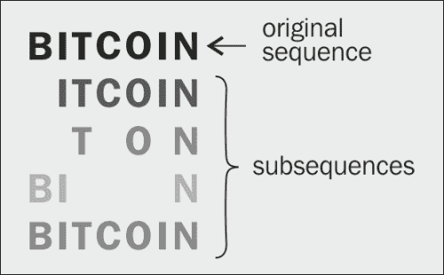
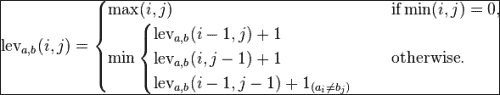
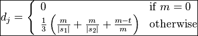
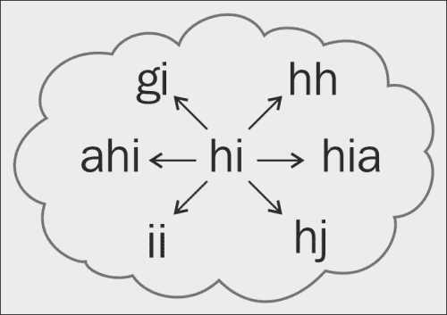

# 第三章：文字的科学

本章将介绍以下食谱：

+   以另一种进制显示数字

+   从另一种进制读取数字

+   使用 Data.ByteString 查找子字符串

+   使用 Boyer–Moore–Horspool 算法搜索字符串

+   使用 Rabin-Karp 算法搜索字符串

+   按行、单词或任意标记拆分字符串

+   查找最长公共子序列

+   计算语音编码

+   计算两个字符串之间的编辑距离

+   计算两个字符串之间的 Jaro–Winkler 距离

+   查找一个编辑距离内的字符串

+   使用编辑距离修正拼写错误

# 介绍


可以在大量单词的语料库上使用许多有趣的分析技术。无论是分析句子的结构还是书籍的内容，这些食谱将为我们介绍一些有用的工具。

在进行数据分析时，处理字符串的最常见函数之一是子字符串查找和编辑距离计算。由于数字通常出现在文本语料库中，本章将首先展示如何将数字表示为字符串，以任意进制显示。接着我们将介绍几种字符串搜索算法，并专注于提取文本，研究单词的使用方式以及它们如何组合在一起。

给定本节提供的一组简单工具，可以构建许多实际应用。例如，在最后一个食谱中，我们将演示如何纠正拼写错误。我们如何使用这些算法完全取决于我们的创造力，但至少有这些工具可用是一个很好的开始。

# 以另一种进制显示数字

字符串是表示不同进制数字的一种自然方式，因为字母被当作数字使用。本食谱将告诉我们如何将数字转换为一个字符串，并作为输出打印出来。

## 如何实现…

1.  我们需要导入以下两个函数：

    ```py
    import Data.Char (intToDigit, chr, ord) 
    import Numeric (showIntAtBase)
    ```

1.  定义一个函数，以表示某个进制的数字，定义如下：

    ```py
    n 'inBase' b = showIntAtBase b numToLetter n ""
    ```

1.  定义数字和字母之间的映射，用于表示大于九的数字，如下所示：

    ```py
    numToLetter :: Int -> Char
    numToLetter n
      | n < 10 = intToDigit n
      | otherwise = chr (ord 'a' n – 10)
    ```

1.  使用以下代码片段打印结果：

    ```py
    main :: IO ()
    main = do
      putStrLn $ 8 'inBase' 12
      putStrLn $ 10 'inBase' 12
      putStrLn $ 12 'inBase' 12
      putStrLn $ 47 'inBase' 12
    ```

1.  以下是运行代码时打印的输出：

    ```py
    $ runhaskell Main.hs

    8
    a
    10
    3b

    ```

## 它是如何工作的…

`showIntAtBase`函数接收一个进制、期望的数字和数字到可打印数字的映射。我们按照以下顺序排列数字：0, 1, 2, 3, 4, 5, 6, 7, 8, 9, a, b, c, d, e, f，依此类推，直到 36 个字符。将这些组合在一起，我们就得到了一个方便的方式，可以将十进制数字表示为任意进制。

## 另见

要将表示数字的字符串从另一种进制读取为十进制整数，请参阅*从另一种进制读取数字*食谱。

# 从另一个进制读取数字

十进制、二进制和十六进制是广泛使用的数字系统，通常使用字符串表示。此方法将展示如何将任意进制的数字字符串转换为十进制整数。我们使用`readInt`函数，它是前一个方法中描述的`showIntAtBase`函数的双重。

## 如何实现...

1.  导入`readInt`以及以下的字符操作函数，如下所示：

    ```py
    import Data.Char (ord, digitToInt, isDigit)
    import Numeric (readInt)
    ```

1.  定义一个函数，将表示某一特定进制的字符串转换为十进制整数，如下所示：

    ```py
    str 'base' b = readInt b isValidDigit letterToNum str
    ```

1.  定义字母和数字之间的映射关系，以处理较大的数字，如以下代码片段所示：

    ```py
    letterToNum :: Char -> Int
    letterToNum d
      | isDigit d = digitToInt d
      | otherwise = ord d - ord 'a' + 10

    isValidDigit :: Char -> Int
    isValidDigit d = letterToNum d >= 0
    ```

1.  使用以下代码行输出结果：

    ```py
    main :: IO ()
    main = do
      print $ "8" 'base' 12
      print $ "a" 'base' 12
      print $ "10" 'base' 12
      print $ "3b" 'base' 12
    ```

1.  输出结果如下所示：

    ```py
    [(8,"")]
    [(10,"")]
    [(12,"")]
    [(47,"")]

    ```

## 它是如何工作的...

`readInt`函数读取一个无符号整数值并将其转换为指定的进制。它的第一个参数是进制，第二个参数是有效字符，第三个参数是字符到数字的映射。我们将数字按以下顺序排列：0，1，2，3，4，5，6，7，8，9，a，b，c，d，e，f，依此类推，直到 36 个字符。把这些结合起来，我们就得到了一种方便的方法，可以将任意进制的数字字符串转换为十进制数字。

### 提示

该方法假定传入`base`函数的字符串有效以进行转换。进一步的错误检查是必要的，以确保错误输入（如`"a" 'base' 4`）不会产生结果。

## 另见

要执行反向操作，请参阅*在另一进制中显示数字*的方法。

# 使用`Data.ByteString`搜索子字符串

搜索一个字符串在另一个字符串中的位置有很多算法。这个方法将使用`Data.ByteString`库中的现有`breakSubstring`函数来完成大部分繁重的工作。

`ByteString`文档通过声明以下内容来确立其优点：

> *"[ByteString 是]一种高效的字节向量实现，使用打包的 Word8 数组，适用于高性能用途，无论是大数据量，还是高速要求。字节向量被编码为严格的 Word8 字节数组，保存在 ForeignPtr 中，并可以在 C 和 Haskell 之间轻松传递。"*

更多信息和文档可以在[`hackage.haskell.org/package/bytestring/docs/Data-ByteString.html`](http://hackage.haskell.org/package/bytestring/docs/Data-ByteString.html)的包网页上获取。

## 如何实现...

1.  导入`breakSubstring`函数以及`Data.ByteString.Char8`包，如下所示：

    ```py
    import Data.ByteString (breakSubstring)
    import qualified Data.ByteString.Char8 as C
    ```

1.  将字符串打包为`ByteString`，并将其传递给`breakSubstring`，其类型为：`ByteString -> ByteString -> (ByteString, ByteString)`。然后确定是否找到该字符串：

    ```py
    substringFound :: String -> String -> Bool

    substringFound query str = 
      (not . C.null . snd) $ 
      breakSubstring (C.pack query) (C.pack str)
    ```

1.  在`main`中尝试以下测试：

    ```py
    main = do
      print $ substringFound "scraf" "swedish scraf mafia"
      print $ substringFound "flute" "swedish scraf mafia"
    ```

1.  执行`main`将输出以下结果：

    ```py
    True
    False

    ```

## 它是如何工作的...

`breakSubstring` 函数递归地检查模式是否是字符串的前缀。为了懒惰地查找字符串的首次出现，我们可以调用 `snd (breakSubstring pat str)`。

## 还有更多……

另一种优雅的快速查找子字符串的方法是使用 `Data.List` 和 `Data.ByteString` 提供的 `isInfixOf` 函数。此外，我们还可以使用 `OverloadedStrings` 语言扩展来去除冗余，如下所示的代码片段所示：

```py
{-# LANGUAGE OverloadedStrings #-}
import Data.ByteString (isInfixOf)

main = do
  print $ isInfixOf "scraf" "swedish scraf mafia"
  print $ isInfixOf "flute" "swedish scraf mafia"
```

## 另见

根据我们要查找的模式的长度和整个字符串的长度，其他算法可能提供更好的性能。有关更多细节，请参阅 *使用 Boyer-Moore-Horspool 算法搜索字符串* 和 *使用 Rabin-Karp 算法搜索字符串* 的食谱。

# 使用 Boyer-Moore-Horspool 算法搜索字符串

在字符串中查找模式时，我们将模式称为 **针**，将整个文本称为 **干草堆**。本食谱中实现的 Horspool 字符串搜索算法对于几乎所有模式长度和字母表大小都表现良好，但对于大字母表大小和大针模式尺寸尤为理想。可以通过访问以下 URL 查找到经验基准：

[`orion.lcg.ufrj.br/Dr.Dobbs/books/book5/chap10.htm`](http://orion.lcg.ufrj.br/Dr.Dobbs/books/book5/chap10.htm)

通过对查询进行预处理，该算法能够有效地跳过冗余的比较。在本食谱中，我们将实现一个简化版的 Horspool 算法，它在平均最佳情况下与 Boyer-Moore 算法相同，且由于开销较小，受益于更小的开销成本，但在极少数情况下，算法执行过多匹配时，可能会遇到与朴素搜索相同的最坏运行时间。只有在接受额外的预处理时间和空间时，才应使用 Boyer-Moore 算法。

## 如何操作……

1.  我们将使用以下几个 `Data.Map` 函数：

    ```py
    import Data.Map (fromList, (!), findWithDefault)
    ```

1.  为了方便，按如下方式定义表示字符索引的元组：

    ```py
    indexMap xs = fromList $ zip [0..] xs

    revIndexMap xs = fromList $ zip (reverse xs) [0..]
    ```

1.  定义搜索算法，使用递归的 `bmh'` 函数如下：

    ```py
    bmh :: Ord a => [a] -> [a] -> Maybe Int

    bmh pat xs = bmh' (length pat - 1) (reverse pat) xs pat
    ```

1.  递归地在当前索引中查找模式，直到索引超过字符串的长度，如下代码片段所示：

    ```py
    bmh' :: Ord a => Int -> [a] -> [a] -> [a] -> Maybe Int 

    bmh' n [] xs pat = Just (n + 1)
    bmh' n (p:ps) xs pat 
      | n >= length xs   = Nothing
      | p == (indexMap xs) ! n = bmh' (n - 1) ps xs pat
      | otherwise              = bmh' (n + findWithDefault
                                      (length pat) (sMap ! n) pMap) 
                                      (reverse pat) xs pat
      where sMap = indexMap xs
            pMap = revIndexMap pat
    ```

1.  按如下方式测试该函数：

    ```py
    main :: IO ()
    main = print $ bmh "Wor" "Hello World"
    ```

1.  以下打印输出显示匹配子字符串的第一个索引：

    ```py
    Just 6

    ```

## 它是如何工作的……

该算法通过一个移动窗口将目标模式与文本进行比较。效率来自于移动窗口如何快速地从左到右在文本中移动。在 Horspool 算法中，查询会从右到左逐个字符与当前窗口进行比较，且窗口在最佳情况下按查询的大小进行移动。

另一版本的 Horspool 算法，由 Remco Niemeijer 设计，可以在[`bonsaicode.wordpress.com/2009/08/29/programming-praxis-string-search-boyer-moore`](http://bonsaicode.wordpress.com/2009/08/29/programming-praxis-string-search-boyer-moore)找到。

## 还有更多...

Boyer-Moore 算法确保在最坏情况下运行更快，但也会有稍微多一些的初始开销。请参考以下命令，使用`Data.ByteString.Search`包中的 Boyer-Moore 算法：

```py
$ cabal install stringsearch

```

导入以下库：

```py
import Data.ByteString.Search
import qualified Data.ByteString.Char8 as C
```

向`indices`函数提供两个`ByteString`类型来运行搜索，方法如下：

```py
main = print $ indices (C.pack "abc") (C.pack "bdeabcdabc")
```

这将打印出以下索引：

```py
[3,7]

```

通过基准测试这个库的性能，我们可以看到较长的搜索针确实能提高运行时间。我们修改代码，通过一个名为`big.txt`的文件在巨大的单词语料库中搜索多个针。这里，我们使用`deepseq`函数强制评估，这样 Haskell 的惰性特性就不会忽略它，如下面的代码所示：

```py
shortNeedles = ["abc", "cba"]
longNeedles = ["very big words", "some long string"]

main = do
  corpus <- BS.readFile "big.txt"
  map (\x -> (not.null) (indices x corpus)) shortNeedles     
    'deepseq' return ()
```

我们可以使用特别的运行时系统（RTS）控制编译这段代码，以便轻松进行性能分析，方法如下：

```py
$ ghc -O2 Main.hs –rtsopts

$ ./Main +RTS -sstder

```

我们使用来自`norvig.com/big.txt`的文本作为我们的语料库。搜索 25 个长针大约需要 0.06 秒；然而，搜索 25 个短针则需要较慢的 0.19 秒。

## 另请参见

要了解另一种高效的字符串搜索算法，请参考*使用 Rabin-Karp 算法搜索字符串*的示例。

# 使用 Rabin-Karp 算法搜索字符串

Rabin-Karp 算法通过将模式的唯一表示与一个滑动窗口进行匹配，来在文本中查找模式。这个唯一表示或哈希值是通过将字符串视为一个数字，并用 26 或更大的任意进制表示来计算的。

Rabin-Karp 的优势在于可以在干草堆中搜索多个针。仅搜索一个字符串效率并不高。经过初步的语料库预处理后，算法可以快速找到匹配项。

## 准备就绪

从 Cabal 安装`Data.ByteString.Search`库，方法如下：

```py
$ cabal install stringsearch

```

## 如何实现...

1.  使用`OverloadedStrings`语言扩展来便于我们代码中的`ByteString`操作，方法如下。它本质上允许字符串具有多态行为，因此当需要时，GHC 编译器可以推断它为`ByteString`类型：

    ```py
    {-# LANGUAGE OverloadedStrings #-}
    ```

1.  导入 Rabin-Karp 算法，方法如下：

    ```py
    import Data.ByteString.Search.KarpRabin (indicesOfAny)
    import qualified Data.ByteString as BS
    ```

1.  定义几个要查找的模式，并从`big.txt`文件中获取语料库，如下面的代码片段所示：

    ```py
    main = do
      let needles = [ "preparing to go away"
                    , "is some letter of recommendation"]
      haystack <- BS.readFile "big.txt"
    ```

1.  运行 Rabin-Karp 算法，处理所有的搜索模式，方法如下：

    ```py
      print $ indicesOfAny needles haystack
    ```

1.  代码将打印出每个针的所有索引，作为一个元组列表。元组的第一个元素是针在干草堆中的位置，第二个元素是针的索引列表。在我们的示例中，我们找到了“准备离开”的一个实例和“某封推荐信”的两个实例。

    ```py
    $ runhaskell Main.hs

    [(3738968,[1]),(5632846,[0]),(5714386,[0])]

    ```

## 它是如何工作的...

在 Rabin-Karp 算法中，一个固定窗口从左到右移动，比较唯一的哈希值，以便高效比较。哈希函数将字符串转换为其数字表示。以下是将字符串转换为以 256 为底的数字的示例：*"hello" = h' * b⁴ + e' * b³ + l' * b² + l' * b¹ + o' * b⁰*（结果为 448378203247），其中每个字母`h' = ord h`（结果为 104），以此类推。

## 另请参见

要了解另一种高效的字符串搜索算法，请参见*使用 Boyer-Moore-Horspool 算法搜索字符串*的相关配方。

# 按行、按单词或按任意标记拆分字符串

有用的数据通常被分隔符（如逗号或空格）夹杂其中，因此字符串拆分对于大多数数据分析任务至关重要。

## 准备中

创建一个类似下面的`input.txt`文件：

```py
$ cat input.txt

first line
second line
words are split by space
comma,separated,values
or any delimiter you want

```

使用 Cabal 按照如下方式安装`split`包：

```py
$ cabal install split

```

## 如何实现...

1.  我们所需要的唯一函数是`splitOn`，它按如下方式导入：

    ```py
    import Data.List.Split (splitOn)
    ```

1.  首先，我们将字符串拆分成行，代码示例如下：

    ```py
    main = do 
      input <- readFile "input.txt"
      let ls = lines input
      print $ ls
    ```

1.  这些行将按如下方式以列表形式打印：

    ```py
    [ "first line","second line"
    , "words are split by space"
    , "comma,separated,values"
    , "or any delimiter you want"]

    ```

1.  接下来，我们按照如下方式在空格处拆分字符串：

    ```py
      let ws = words $ ls !! 2
      print ws
    ```

1.  单词将按如下方式以列表形式打印：

    ```py
    ["words","are","split","by","space"]

    ```

1.  接下来，我们展示如何使用以下代码行在任意值上拆分字符串：

    ```py
      let cs = splitOn "," $ ls !! 3
      print cs
    ```

1.  这些值将按逗号分隔，具体如下：

    ```py
    ["comma","separated","values"]

    ```

1.  最后，我们展示如何按照如下代码片段进行多字母拆分：

    ```py
      let ds = splitOn "an" $ ls !! 4
      print ds
    ```

1.  输出结果如下：

    ```py
    ["or any d","limit","r you want"]

    ```

# 查找最长公共子序列

比较字符串相似性的一种方法是找出它们的最长公共子序列。这在查找数据变异之间的差异时非常有用，例如源代码或基因组序列。

字符串的子序列是从原字符串中删除零个或多个索引后的字符串。因此，“BITCOIN”的一些可能子序列可以是“ITCOIN”，“TON”，“BIN”，甚至是“BITCOIN”本身，如下图所示：



最长公共子序列正如其名，是指两个字符串中最长的公共子序列。例如，"find the lights"和"there are four lights"的最长公共子序列是"the lights"。

## 准备中

从 Cabal 安装`data-memocombinators`包。这个包可以帮助我们最小化冗余计算，从而提升运行时效率，具体如下：

```py
$ cabal install data-memocombinators

```

## 如何实现...

1.  我们需要的唯一导入包是这个方便的包，用于轻松支持记忆化：

    ```py
    import qualified Data.MemoCombinators as Memo
    ```

1.  创建一个方便的函数，以便对接收两个字符串参数的函数进行记忆化处理，代码示例如下：

    ```py
    memoize :: (String -> String -> r) -> String -> String -> r
    memoize = Memo.memo2 
        (Memo.list Memo.char) (Memo.list Memo.char)
    ```

1.  定义最大公共子序列函数，如下所示：

    ```py
    lcs :: String -> String -> String

    lcs = memoize lcs'
      where lcs' xs'@(x:xs) ys'@(y:ys)
        | x == y = x : lcs xs ys
        | otherwise = longer (lcs xs' ys) (lcs xs ys')
        lcs' _ _ = []
    ```

1.  在内部，定义一个返回较长字符串长度的函数。

    ```py
      longer as bs
        | length as > length bs = as
        | otherwise = bs
    ```

1.  按照如下方式在两个字符串上运行该函数。

    ```py
    main :: IO ()
    main = do
      let xs = "find the lights"
      let ys = "there are four lights"
      print $ lcs xs ys
    ```

1.  以下是两个字符串之间的最长公共子序列：

    ```py
    "the lights"

    ```

## 它是如何工作的...

该算法是初步实现的，已在递归调用中添加了记忆化。如果列表的前两个项相同，则最长公共子序列是对列表剩余部分应用的`lcs`函数。否则，最长公共子序列是两个可能性中较长的一个。

直观地说，当两个字符串的长度仅为 10 个字符时，这个算法会停滞不前。由于该代码分解为多个相同的子问题，我们可以轻松使用一个简单的`memoize`函数来记住已经计算过的值，从而大幅提高运行时间。

# 计算语音编码

如果我们处理的是英语单词的语料库，那么我们可以将它们按语音编码进行分类，以查看它们的发音有多相似。语音编码适用于任何字母字符串，而不仅仅是实际的单词。我们将使用`Text.PhoneticCode`包来计算 Soundex 和 Phoneix 语音编码。包文档可以在 Hackage 上找到，网址是[`hackage.haskell.org/package/phonetic-code`](http://hackage.haskell.org/package/phonetic-code)。

## 准备工作

按照以下方式从 Cabal 安装语音编码库：

```py
$ cabal install phonetic-code

```

## 如何实现...

1.  按如下方式导入语音编码函数：

    ```py
    import Text.PhoneticCode.Soundex (soundexNARA, soundexSimple)
    import Text.PhoneticCode.Phonix (phonix)
    ```

1.  按如下方式定义一个相似发音的单词列表：

    ```py
    ws = ["haskell", "hackle", "haggle", "hassle"]
    ```

1.  按照以下代码片段测试这些单词的语音编码：

    ```py
    main :: IO ()
    main = do
      print $ map soundexNARA ws
      print $ map soundexSimple ws
      print $ map phonix ws
    ```

1.  输出将按以下方式打印：

    ```py
    $ runhaskell Main.hs

    ["H240","H240","H240","H240"]

    ["H240","H240","H240","H240"]

    ["H82","H2","H2","H8"]

    ```

注意`phonix`如何比`soundex`产生更精细的分类。

## 它是如何工作的...

算法基于启发式的英语语言相关模式执行简单的字符串操作。

## 还有更多内容...

Metaphone 算法是 Soundex 算法的改进版，您可以在[`aspell.net/metaphone`](http://aspell.net/metaphone)找到它。

# 计算编辑距离

编辑距离或 Levenshtein 距离是将一个字符串转换为另一个字符串所需的最少简单字符串操作次数。在这个方案中，我们将只基于字符的插入、删除和替换来计算编辑距离。

## 准备工作

查看下图中的方程，该方程来自维基百科关于 Levenshtein 距离的文章（[`en.wikipedia.org/wiki/Levenshtein_distance`](http://en.wikipedia.org/wiki/Levenshtein_distance)）：



在这里，*a*和*b*是两个字符串，而 i 和 j 是表示它们长度的数字。

Haskell 代码将直接翻译为这个数学公式。

同样，从 Cabal 安装`data-memocombinators`包。这可以帮助我们减少冗余计算，从而提升运行时间。

```py
$ cabal install data-memocombinators

```

## 如何实现...

1.  我们需要的唯一导入是能够轻松地使用以下代码行对函数进行记忆化：

    ```py
    import qualified Data.MemoCombinators as Memo
    ```

1.  使用以下代码片段精确地定义 Levenshtein 距离函数，正如公式中所描述的那样：

    ```py
    lev :: Eq a => [a] -> [a] -> Int
    lev a b = levM (length a) (length b)
      where levM = memoize lev'
        lev' i j
          | min i j == 0 = max i j
          | otherwise    = minimum 
            [ ( 1 + levM (i-1) j )
            , ( 1 + levM i (j-1) )
            , ( ind i j + levM (i-1) (j-1) ) ]
    ```

1.  定义一个指示函数，如果字符不匹配则返回 1。

    ```py
      ind i j
        | a !! (i-1) == b !! (j-1) = 0
        | otherwise = 1
    ```

1.  创建一个便利函数，用于启用对接受两个字符串参数的函数进行记忆化：

    ```py
    memoize = Memo.memo2 (Memo.integral) (Memo.integral)
    ```

1.  打印出两个字符串之间的编辑距离：

    ```py
    main = print $ lev "mercury" "sylvester"
    ```

1.  结果如下所示：

    ```py
    $ runhaskell Main.hs

    8

    ```

## 它是如何工作的...

该算法递归地尝试所有的删除、插入和替换，并找到从一个字符串到另一个字符串的最小距离。

## 另见

另一种衡量方法在 *计算两个字符串之间的 Jaro-Winkler 距离* 食谱中有所描述。

# 计算两个字符串之间的 Jaro-Winkler 距离

Jaro-Winkler 距离衡量字符串相似度，表示为一个介于 0 和 1 之间的实数。值为 0 表示没有相似性，值为 1 表示完全匹配。

## 准备就绪

该函数背后的算法来源于 Wikipedia 上关于 Jaro-Winkler 距离的文章中展示的以下数学公式：[`en.wikipedia.org/wiki/Jaro%E2%80%93Winkler_distance`](http://en.wikipedia.org/wiki/Jaro%E2%80%93Winkler_distance)：



在前面的公式中，以下是所使用变量的表示形式：

+   *s1* 是第一个字符串。

+   *s2* 是第二个字符串。

+   *m* 是在最大为较长字符串一半的距离内匹配的字符数量。这些称为匹配字符。

+   *t* 是不在同一索引处的匹配字符的一半。换句话说，它是交换位置的字符数的一半。

## 如何实现...

1.  我们需要访问 `elemIndices` 函数，它被如下导入：

    ```py
    import Data.List (elemIndices)
    ```

1.  基于以下公式定义 Jaro-Winkler 函数：

    ```py
    jaro :: Eq a => [a] -> [a] -> Double

    jaro s1 s2
      | m == 0    = 0.0
      | otherwise = (1/3) * (m/ls1 + m/ls2 + (m-t)/m)
    ```

1.  定义所使用的变量，如下所示：

    ```py
      where ls1 = toDouble $ length s1

            ls2 = toDouble $ length s2

             m' = matching s1 s2 d

             d = fromIntegral $ 
             max (length s1) (length s2) 'div' 2 – 1

             m = toDouble m'

             t = toDouble $ (m' - matching s1 s2 0) 'div' 2
    ```

1.  定义一个辅助函数，将整数转换为 `Double` 类型：

    ```py
    toDouble :: Integral a => a -> Double

    toDouble n = (fromIntegral n) :: Double
    ```

1.  定义一个辅助函数，用于查找在指定距离内匹配的字符数量，如下所示的代码片段：

    ```py
    matching :: Eq a => [a] -> [a] -> Int -> Int

    matching s1 s2 d = length $ filter 
      (\(c,i) -> not (null (matches s2 c i d))) 
      (zip s1 [0..])
    ```

1.  定义一个辅助函数，用于查找从指定索引处某个字符开始的匹配字符数量，如下所示：

    ```py
    matches :: Eq a => [a] -> a -> Int -> Int -> [Int]

    matches str c i d = filter (<= d) $ 
      map (dist i) (elemIndices c str)
      where dist a b = abs $ a - b
    ```

1.  通过打印出一些示例来测试算法，如下所示：

    ```py
    main = do
      print $ jaro "marisa" "magical"
      print $ jaro "haskell" "hackage"
    ```

1.  相似度按如下方式打印，意味着 "marisa" 更接近 "magical" 而不是 "haskell" 接近 "hackage"。

    ```py
    $ runhaskell Main.hs

    0.746031746031746
    0.7142857142857142

    ```

## 另见

另一种计算字符串相似度的方法，在之前的食谱 *计算编辑距离* 中有定义。

# 查找一个编辑距离内的字符串

本食谱将展示如何查找与指定字符串具有一个编辑距离的字符串。该函数可用于纠正拼写。

## 准备就绪

本食谱中的算法在很大程度上基于 Peter Norvig 在 [`norvig.com/spell-correct.html`](http://norvig.com/spell-correct.html) 上描述的拼写更正算法。查看并研究那里实现的 `edits1` Python 函数。

## 如何实现...

1.  导入如下所示的几个字符和列表函数：

    ```py
    import Data.Char (toLower)
    import Data.List (group, sort)
    ```

1.  定义一个函数，用于返回与指定字符串只有一个编辑距离的字符串，如下所示的代码片段：

    ```py
    edits1 :: String -> [String]

    edits1 word = unique $ 
                  deletes ++ transposes ++ replaces ++ inserts
      where splits   = [ (take i word', drop i word') | 
        i <- [0..length word']]
    ```

1.  创建一个删除一个字符的字符串列表，如下所示：

    ```py
      deletes = [ a ++ (tail b) | 
        (a,b) <- splits, (not.null) b]
    ```

1.  创建一个交换两个字符的字符串列表，如下所示：

    ```py
      transposes = [a ++ [b!!1] ++ [head b] ++ (drop 2 b) | 
        (a,b) <- splits, length b > 1 ]
    ```

1.  创建一个字符串列表，其中一个字符被字母表中的另一个字母替换，如下所示：

    ```py
      replaces  = [ a ++ [c] ++ (drop 1 b) 
        | (a,b) <- splits
        , c <- alphabet
        , (not.null) b ]
    ```

1.  创建一个字符串列表，其中一个字符在任何位置被插入，如下所示：

    ```py
      inserts = [a ++ [c] ++ b 
      | (a,b) <- splits
      , c <- alphabet ]
    ```

1.  定义字母表和一个辅助函数将字符串转换为小写，如下所示：

    ```py
      alphabet = ['a'..'z']
      word' = map toLower word
    ```

1.  定义一个辅助函数从列表中获取唯一元素，如下所示：

    ```py
      unique :: [String] -> [String]
      unique = map head.group.sort
    ```

1.  打印出所有与以下字符串编辑距离为一的可能字符串，如下所示：

    ```py
    main = print $ edits1 "hi"
    ```

结果如下所示：

```py
["ahi","ai","bhi","bi","chi","ci","dhi","di","ehi","ei","fhi","fi","ghi","gi","h","ha","hai","hb","hbi","hc","hci","hd","hdi","he","hei","hf","hfi","hg","hgi","hh","hhi","hi","hia","hib","hic","hid","hie","hif","hig","hih","hii","hij","hik","hil","him","hin","hio","hip","hiq","hir","his","hit","hiu","hiv","hiw","hix","hiy","hiz","hj","hji","hk","hki","hl","hli","hm","hmi","hn","hni","ho","hoi","hp","hpi","hq","hqi","hr","hri","hs","hsi","ht","hti","hu","hui","hv","hvi","hw","hwi","hx","hxi","hy","hyi","hz","hzi","i","ih","ihi","ii","jhi","ji","khi","ki","lhi","li","mhi","mi","nhi","ni","ohi","oi","phi","pi","qhi","qi","rhi","ri","shi","si","thi","ti","uhi","ui","vhi","vi","whi","wi","xhi","xi","yhi","yi","zhi","zi"]

```

更直观地，我们创建了一个仅通过 1 次插入、删除、替换或交换不同的单词邻域。以下图试图展示这个邻域：



## 还有更多...

我们可以递归地应用`edit1`来查找任意编辑距离的字符串。然而，对于* n *大于三的值，这将需要不可接受的长时间。在以下代码中，`edits1` `'`是一个函数，它接收字符串列表并生成所有编辑距离为一的字符串。然后在`editsN`中，我们简单地按如下方式迭代应用`edits1'`函数：

```py
edits1' :: [String] -> [String]
edits1' ls = unique $ concat $ map edits1 ls

editsN :: String -> Int -> [String]
editsN word n = iterate edits1' (edits1 word) !! n
```

## 另见

这个函数在实现*修正拼写错误*方法中非常有用。

# 修正拼写错误

当收集人工提供的数据时，拼写错误可能悄悄进入。这个方法会使用 Peter Norvig 描述的简单启发式拼写检查器来纠正拼写错误，详情见[`norvig.com/spell-correct.html`](http://norvig.com/spell-correct.html)。

这个方法只是机器学习中解决一个非常困难问题的一个思路。我们可以将其作为起点，或作为灵感去实现一个更强大的解决方案，取得更好的结果。

## 准备就绪

请参考 Norvig 的拼写纠正 Python 算法，位置在[`norvig.com/spell-correct.html`](http://norvig.com/spell-correct.html)。

核心算法如下所示：

+   将原始文本转换为小写字母单词

+   计算所有单词的频率图

+   定义函数来生成所有编辑距离为一或二的字符串

+   查找拼写错误的所有可能候选项，通过查找在编辑距离为一或二以内的有效单词

+   最后，挑选出在训练语料库中出现频率最高的候选项

以下 Haskell 算法模仿了这段 Python 代码。

## 如何实现...

1.  导入以下函数：

    ```py
    import Data.Char (isAlpha, isSpace, toLower)
    import Data.List (group, sort, maximumBy)
    import Data.Ord (comparing)
    import Data.Map (fromListWith, Map, member, (!))
    ```

1.  定义一个函数来自动修正句子中每个单词的拼写：

    ```py
    autofix :: Map String Int -> String -> String

    autofix m sentence = unwords $ 
                         map (correct m) (words sentence)
    ```

1.  从一段文本中提取单词。

    ```py
    getWords :: String -> [String]

    getWords str = words $ 
                   filter (\x -> isAlpha x || isSpace x) lower

      where lower = map toLower str
    ```

1.  计算所提供单词的频率图，如下所示：

    ```py
    train :: [String] -> Map String Int

    train = fromListWith (+) . ('zip' repeat 1)
    ```

1.  查找编辑距离为一的字符串，如下所示：

    ```py
    edits 1 :: String -> [String]

    edits1 word = unique $ 
                  deletes ++ transposes ++ replaces ++ inserts

      where splits = [ (take i word', drop i word') 
                      | i <- [0..length word']]

      deletes = [ a ++ (tail b) 
                      | (a,b) <- splits
                      , (not.null) b ]

      transposes = [ a ++ [b !! 1] ++ [head b] ++ (drop 2 b) 
                      | (a,b) <- splits, length b > 1 ]

      replaces = [ a ++ [c] ++ (drop 1 b) 
                      | (a,b) <- splits, c <- alphabet
                      , (not.null) b ]

      inserts = [a ++ [c] ++ b | 
                        (a,b) <- splits, c <- alphabet ]

      alphabet = ['a'..'z']

      word' = map toLower word
    ```

1.  查找编辑距离为二的单词：

    ```py
    knownEdits2 :: String -> Map String a -> [String]

    knownEdits2 word m = unique $ [ e2 
                                  | e1 <- edits1 word
                                  , e2 <- edits1 e1
                                  , e2 'member' m]
    ```

1.  定义一个辅助函数从列表中获取唯一元素，如下所示：

    ```py
    unique :: [String] -> [String]

    unique = map head.group.sort
    ```

1.  从字符串列表中查找已知单词，如下所示：

    ```py
    known :: [String] -> Map String a -> [String]

    known ws m = filter ('member' m) ws
    ```

1.  通过返回最常见的候选项来纠正拼写错误，如下所示：

    ```py
    correct :: Map String Int -> String -> String

    correct m word = maximumBy (comparing (m!)) candidates
      where candidates = head $ filter (not.null) 
                         [ known [word] m 
                         , known (edits1 word) m
                         , knownEdits2 word m
                         , [word] ]
    ```

1.  从`big.txt`中收集常见文学作品中使用的已知单词列表。该文件可通过[`norvig.com/big.txt`](http://norvig.com/big.txt)访问，或者我们也可以自己创建。然后，按照以下方式测试拼写校正器：

    ```py
    main :: IO ()

    main = do
      rawText <- readFile "big.txt"
      let m = train $ getWords rawText
      let sentence = "such codez many hsakell very spel so korrect"
      print $ autofix m sentence
    ```

1.  正确的拼写将如下所示：

    ```py
    $ runhaskell Main.hs

    "such code many haskell very spell so correct"

    ```

## 它是如何工作的...

该算法假设拼写错误发生在一个或两个编辑距离之内。它建立了一个已知单词的列表，该列表包含一个或两个编辑距离内的单词，并根据通过读取现实世界文本语料库生成的频率图返回最常用的单词。

## 还有更多内容...

该算法运行速度很快，但它非常简单。这段代码为实现拼写校正器提供了一个起点，但绝对不是最先进的技术。可以添加的一些改进包括并行化、缓存或设计更好的启发式方法。

## 另请参见

如需更深入分析`edit1`函数，请参考*在一个编辑距离内查找字符串*的配方。
