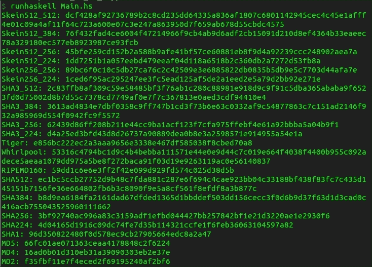
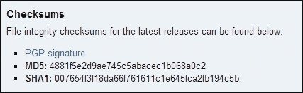
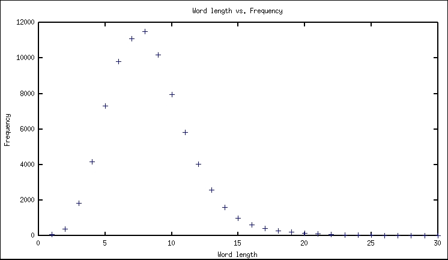
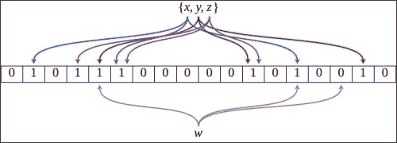

# 第四章 数据哈希

在本章中，我们将介绍以下食谱：

+   哈希原始数据类型

+   哈希自定义数据类型

+   运行流行的加密哈希函数

+   对文件运行加密校验和

+   在数据类型之间进行快速比较

+   使用高性能哈希表

+   使用 Google 的 CityHash 哈希函数对字符串进行哈希

+   计算位置坐标的 Geohash

+   使用布隆过滤器去除唯一项

+   运行 MurmurHash，一个简单但快速的哈希算法

+   使用感知哈希测量图像相似度

# 介绍


**哈希**是一种有损的方式，将对象表示为一个小而通常是固定长度的值。哈希数据使我们能够快速查找和轻松处理大量数据集。

哈希函数的输出被称为**摘要**。一个好的哈希函数的主要特性之一是它必须是确定性的，这意味着给定的输入必须始终产生相同的输出。有时，两个不同的输入可能最终产生相同的输出，我们称之为**碰撞**。仅凭哈希值，我们无法反转过程在合理的时间内重新发现原始对象。为了最小化碰撞的几率，哈希函数的另一个特性叫做**均匀性**。换句话说，每个输出出现的概率应该几乎相同。

我们将首先从输入生成一个简单的摘要。然后，在下一个食谱中，我们将对自定义数据类型运行哈希算法。

哈希的另一个重要应用是在加密学中。我们将介绍一些最流行的加密哈希算法，如 SHA-512。我们还将应用这些哈希对文件进行校验和计算，以确保文件完整性。

最后，我们将介绍许多非传统的哈希方法，包括 CityHash、GeoHashing、布隆过滤器、MurmurHash 和 pHash。

# 哈希原始数据类型

本食谱演示了如何在各种原始数据类型上使用简单的哈希函数。

## 准备工作

从 Cabal 安装`Data.Hashable`包，如下所示：

```py
$ cabal install hashable

```

## 如何操作……

1.  使用以下行导入哈希函数：

    ```py
    import Data.Hashable
    ```

1.  测试`hash`函数对字符串的作用，如下所示；该函数实际上是一个包装器，围绕着默认盐值的`hashWithSalt`函数：

    ```py
    main = do
      print $ hash "foo" 
    ```

1.  使用不同的初始盐值测试`hashWithSalt`函数，如下所示：

    ```py
      print $ hashWithSalt 1 "foo"
      print $ hashWithSalt 2 "foo"
    ```

1.  我们还可以如下对元组和列表进行哈希：

    ```py
      print $ hash [ (1 :: Int, "hello", True)
                   , (0 :: Int, "goodbye", False) ]
    ```

1.  注意以下输出中的前三个哈希尽管输入相同，却产生了不同的结果：

    ```py
    $ runhaskell Main.hs

    7207853227093559468
    367897294438771247
    687941543139326482
    6768682186886785615
    ```

## 它是如何工作的……

使用盐值进行哈希意味着在稍微修改数据后再应用哈希函数。就像我们在通过哈希函数处理输入之前“加盐”了一样。即使盐值稍有变化，也会产生完全不同的哈希摘要。

我们需要这种盐的概念来提高密码安全性。哈希函数对于相同的输入总是产生相同的输出，这既有好处也有坏处。对于所有主要的哈希算法，都有现成的彩虹表数据库，其中包含每个常用密码。如果一个具有登录系统服务的网站（例如 Packt Publishing）使用加密哈希存储密码，但没有使用盐，那么如果密码本身被认为是弱密码，它与明文密码没有区别。如果像 Packt Publishing 这样的服务在其加密哈希中使用盐（并且应该使用），那么它就增加了一层安全性，而彩虹表则变得无用。

## 还有更多……

之前的代码生成了一个字符串的哈希，但这个算法不限于字符串。以下数据类型也实现了 `hashable`：

+   Bool

+   Char

+   Int

+   Int8

+   Int16

+   Int32

+   Int64

+   Word

+   Word8

+   Word16

+   Word32

+   Word64

+   ByteString

+   可哈希项的列表

+   哈希项的元组

+   也许是一个可哈希的项

## 另请参见

关于如何对自定义数据类型使用哈希函数，请参考 *哈希一个自定义数据类型* 这个配方。

# 哈希一个自定义数据类型

即使是自定义定义的数据类型也可以轻松进行哈希。当数据本身占用空间过大，无法直接管理时，处理哈希摘要通常非常有用。通过使用数据的摘要引用，我们可以轻松避免携带整个数据类型的开销。这在数据分析中尤其有用。

## 准备好

通过以下方式从 Cabal 安装 `Data.Hashable` 包：

```py
$ cabal install hashable

```

## 如何实现……

1.  使用 GHC 语言扩展 `DeriveGeneric` 自动定义我们自定义数据类型的哈希函数，如下所示：

    ```py
    {-# LANGUAGE DeriveGeneric #-}
    ```

1.  使用以下代码行导入相关包：

    ```py
    import GHC.Generics (Generic)
    import Data.Hashable
    ```

1.  创建一个自定义数据类型，并让 `GHC` 自动定义其哈希实例，如下所示：

    ```py
    data Point = Point Int Int
               deriving (Eq, Generic)

    instance Hashable Point
    ```

1.  在 `main` 中，创建三个点。让其中两个相同，第三个不同，如以下代码片段所示：

    ```py
    main = do
        let p1 = Point 1 1
        let p2 = Point 1 1
        let p3 = Point 3 5
    ```

1.  打印相同点的哈希值，如下所示：

    ```py
    if p1 == p2
      then putStrLn "p1 = p2"
      else putStrLn "p1 /= p2"
      if hash p1 == hash p2
      then putStrLn "hash p1 = hash p2"
      else putStrLn "hash p1 /= hash p2"
    ```

1.  打印不同点的哈希值，如下所示：

    ```py
      if p1 == p3
        then putStrLn "p1 = p3"
        else putStrLn "p1 /= p3"
      if hash p1 == hash p3
        then putStrLn "hash p1 = hash p3"
        else putStrLn "hash p1 /= hash p3"
    ```

1.  输出将如下所示：

    ```py
    $ runhaskell Main.hs

    p1 = p2
    hash p1 = hash p2
    p1 /= p3
    hash p1 /= hash p3

    ```

## 还有更多……

我们可以通过为 `Hashable` 提供实例来为自定义数据类型定义哈希函数。`Hashable` 实例只需要实现 `hashWithSalt :: Int -> a -> Int`。为了帮助实现 `hashWithSalt`，我们还提供了两个有用的函数：

+   使用盐对指针进行哈希操作，如以下代码片段所示：

    ```py
    hashPtrWithSalt :: Ptr a   --  pointer to the data to hash
                    -> Int     --  length, in bytes
                    -> Int     --  salt
                    -> IO Int  --  hash value
    ```

+   使用盐对字节数组进行哈希操作，如以下代码片段所示：

    ```py
    hashByteArrayWithSalt
        :: ByteArray#  --  data to hash
        -> Int         --  offset, in bytes
        -> Int         --  length, in bytes
        -> Int         --  salt
        -> Int         --  hash value
    ```

## 另请参见

要哈希一个内建的原始类型，请参考 *哈希一个原始数据类型* 这个配方。

# 运行流行的加密哈希函数

一个加密哈希函数具有特定的属性，使其与其他哈希函数不同。首先，从给定的哈希摘要输出生成可能的输入消息应该是不可行的，意味着在实践中解决这个问题必须耗费指数级的时间。

例如，如果哈希值产生了摘要`66fc01ae071363ceaa4178848c2f6224`，那么原则上，发现用于生成摘要的内容应该是困难的。

在实践中，一些哈希函数比其他的更容易破解。例如，MD5 和 SHA-1 被认为很容易破解，不应再使用，但为了完整性，稍后会展示这两个哈希函数。关于 MD5 和 SHA-1 不安全的更多信息可以参考[`www.win.tue.nl/hashclash/rogue-ca`](http://www.win.tue.nl/hashclash/rogue-ca)和[`www.schneier.com/blog/archives/2005/02/cryptanalysis_o.html`](https://www.schneier.com/blog/archives/2005/02/cryptanalysis_o.html)。

## 准备工作

从 Cabal 安装`Crypto.Hash`包，如下所示：

```py
$ cabal install cryptohash

```

## 如何操作……

1.  按如下方式导入加密哈希函数库：

    ```py
    import Data.ByteString.Char8 (ByteString, pack)
    import Crypto.Hash
    ```

1.  按如下方式通过明确关联数据类型来定义每个哈希函数：

    ```py
    skein512_512 :: ByteString -> Digest Skein512_512
    skein512_512 bs = hash bs

    skein512_384 :: ByteString -> Digest Skein512_384
    skein512_384 bs = hash bs

    skein512_256 :: ByteString -> Digest Skein512_256
    skein512_256 bs = hash bs

    skein512_224 :: ByteString -> Digest Skein512_224
    skein512_224 bs = hash bs

    skein256_256 :: ByteString -> Digest Skein256_256
    skein256_256 bs = hash bs

    skein256_224 :: ByteString -> Digest Skein256_224
    skein256_224 bs = hash bs

    sha3_512 :: ByteString -> Digest SHA3_512
    sha3_512 bs = hash bs

    sha3_384 :: ByteString -> Digest SHA3_384
    sha3_384 bs = hash bs

    sha3_256 :: ByteString -> Digest SHA3_256
    sha3_256 bs = hash bs

    sha3_224 :: ByteString -> Digest SHA3_224
    sha3_224 bs = hash bs

    tiger :: ByteString -> Digest Tiger
    tiger bs = hash bs

    whirlpool :: ByteString -> Digest Whirlpool
    whirlpool bs = hash bs

    ripemd160 :: ByteString -> Digest RIPEMD160
    ripemd160 bs = hash bs

    sha512 :: ByteString -> Digest SHA512
    sha512 bs = hash bs

    sha384 :: ByteString -> Digest SHA384
    sha384 bs = hash bs

    sha256 :: ByteString -> Digest SHA256
    sha256 bs = hash bs

    sha224 :: ByteString -> Digest SHA224
    sha224 bs = hash bs

    sha1 :: ByteString -> Digest SHA1
    sha1 bs = hash bs

    md5 :: ByteString -> Digest MD5
    md5 bs = hash bs

    md4 :: ByteString -> Digest MD4
    md4 bs = hash bs

    md2 :: ByteString -> Digest MD2
    md2 bs = hash bs
    ```

1.  按如下代码片段测试每个加密哈希函数在相同输入上的表现：

    ```py
    main = do
      let input = pack "haskell data analysis"
      putStrLn $ "Skein512_512: " ++ (show.skein512_512) input
      putStrLn $ "Skein512_384: " ++ (show.skein512_384) input
      putStrLn $ "Skein512_256: " ++ (show.skein512_256) input
      putStrLn $ "Skein512_224: " ++ (show.skein512_224) input
      putStrLn $ "Skein256_256: " ++ (show.skein256_256) input
      putStrLn $ "Skein256_224: " ++ (show.skein256_224) input
      putStrLn $ "SHA3_512: " ++ (show.sha3_512) input
      putStrLn $ "SHA3_384: " ++ (show.sha3_384) input
      putStrLn $ "SHA3_256: " ++ (show.sha3_256) input
      putStrLn $ "SHA3_224: " ++ (show.sha3_224) input
      putStrLn $ "Tiger: " ++ (show.tiger) input
      putStrLn $ "Whirlpool: " ++ (show.whirlpool) input
      putStrLn $ "RIPEMD160: " ++ (show.ripemd160) input
      putStrLn $ "SHA512: " ++ (show.sha512) input
      putStrLn $ "SHA384: " ++ (show.sha384) input
      putStrLn $ "SHA256: " ++ (show.sha256) input
      putStrLn $ "SHA224: " ++ (show.sha224) input
      putStrLn $ "SHA1: " ++ (show.sha1) input
      putStrLn $ "MD5: " ++ (show.md5) input
      putStrLn $ "MD4: " ++ (show.md4) input
      putStrLn $ "MD2: " ++ (show.md2) input
    ```

1.  最终输出可在以下截图中看到：

    ```py
    $ runhaskell Main.hs

    ```

    

## 另请参见

若要在文件上运行这些加密哈希函数以执行完整性检查，请参考*在文件上运行加密校验和*的配方。

# 在文件上运行加密校验和

判断计算机上的文件是否与其他地方的文件不同的最有效方法之一是通过比较它们的加密哈希值。如果两个哈希值相等，虽然文件相等的可能性非常高，但由于碰撞的可能性，不能严格保证文件完全相同。

下载一个文件，例如从[`www.archlinux.org/download`](https://www.archlinux.org/download)下载 Arch Linux，最好确保其加密哈希值匹配。例如，看看以下截图：



上面的截图显示了截至 2014 年 5 月底 Arch Linux 下载的相应哈希值。

请注意同时提供了 MD5 和 SHA1 哈希值。本配方将展示如何在 Haskell 中计算这些哈希值，以确保数据的完整性。

我们将计算其源文件的 SHA256、SHA512 和 MD5 哈希值。

## 准备工作

从 Cabal 安装`Crypto.Hash`包，如下所示：

```py
$ cabal install cryptohash

```

## 如何操作……

创建一个名为`Main.hs`的文件，并插入以下代码：

1.  按如下方式导入相关的包：

    ```py
    import Crypto.Hash
    import qualified Data.ByteString as BS
    ```

1.  按如下方式定义`MD5`哈希函数：

    ```py
    md5 :: BS.ByteString -> Digest MD5
    md5 bs = hash bs
    ```

1.  按如下方式定义`SHA256`哈希函数：

    ```py
    sha256 :: BS.ByteString -> Digest SHA256
    sha256 bs = hash bs
    ```

1.  按如下方式定义`SHA512`哈希函数：

    ```py
    sha512 :: BS.ByteString -> Digest SHA512
    sha512 bs = hash bs
    ```

1.  使用`Data.ByteString`包提供的`readFile`函数打开`ByteString`类型的文件，如下所示：

    ```py
    main = do
      byteStr <- BS.readFile "Main.hs"
    ```

1.  按如下方式测试文件上的各种哈希值：

    ```py
        putStrLn $ "MD5: " ++ (show.md5) byteStr
        putStrLn $ "SHA256: " ++ (show.sha256) byteStr
        putStrLn $ "SHA512: " ++ (show.sha512) byteStr
    ```

1.  以下是生成的输出：

    ```py
    $ runhaskell Main.hs

    MD5: 242334e552ae8ede926de9c164356d18

    SHA256:
    50364c25e0e9a835df726a056bd5370657f37d20aabc82e0b1719a343ab505d8

    SHA512: 1ad6a9f8922b744c7e5a2d06bf603c267ca6becbf52b2b22f8e5a8e2d82fb52d87ef4a13c9a405b06986d5d19b170d0fd05328b8ae29f9d92ec0bca80f7b60e7

    ```

## 另请参见

若要在数据类型上应用加密哈希函数，请参考*运行常见加密哈希函数*的配方。

# 执行数据类型间的快速比较

`StableName`包允许我们对任意数据类型建立常数时间的比较。Hackage 文档优雅地描述了这一点（[`hackage.haskell.org/package/base-4.7.0.0/docs/System-Mem-StableName.html`](http://hackage.haskell.org/package/base-4.7.0.0/docs/System-Mem-StableName.html)）：

> *“稳定名称解决了以下问题：假设你想要用 Haskell 对象作为键来构建哈希表，但你希望使用指针相等性进行比较；可能是因为键非常大，哈希操作会很慢，或者是因为键的大小是无限的。我们不能使用对象的地址作为键来构建哈希表，因为对象会被垃圾收集器移动，这意味着每次垃圾回收后都需要重新哈希。”*

## 如何操作……

1.  按照以下方式导入内置的`StableName`包：

    ```py
    import System.Mem.StableName
    ```

1.  按照以下方式创建一个自定义数据类型：

    ```py
    data Point = Point [Int]
    ```

1.  在`main`中，按如下方式定义两个点：

    ```py
      main = do
        let p1 = Point [1..]
        let p2 = Point [2,4]
    ```

1.  获取每个点的稳定名称，并使用以下命令集显示它：

    ```py
    sn1 <- makeStableName p1
    sn2 <- makeStableName p2
    print $ hashStableName sn1
    print $ hashStableName sn2
    ```

1.  注意以下结果，我们可以轻松获取任意数据类型的稳定名称：

    ```py
    $ runhaskell Main.hs

    22
    23

    ```

# 使用高性能哈希表

Haskell 已经提供了一个基于大小平衡二叉树的`Data.Map`模块。还有一些优化更好的哈希表库，如`unordered-containers`包中的`Data.HashMap`。

例如，`Data.Map`和`Data.HashMap`都具有 O(log n)的插入和查找时间复杂度；然而，后者使用了较大的基数，因此在实际操作中，这些操作是常数时间。有关`Data.HashMap`的更多文档可以在[`hackage.haskell.org/package/unordered-containers-0.2.4.0/docs/Data-HashMap-Lazy.html`](http://hackage.haskell.org/package/unordered-containers-0.2.4.0/docs/Data-HashMap-Lazy.html)找到。

在这个示例中，我们将使用 Hackage 上的 unordered-contains 库，创建一个将单词长度映射到该长度单词集合的映射。

## 准备就绪

下载一个大文本语料库并将文件命名为`big.txt`，如下所示：

```py
$ wget norvig.com/big.txt

```

使用 Cabal 安装`Data.HashMap`包，方法如下：

```py
$ cabal install unordered-containers

```

## 如何操作……

1.  按照以下方式导入`HashMap`包：

    ```py
    import Data.HashMap.Lazy
    import Data.Set (Set)
    import qualified Data.Set as Set
    ```

1.  创建一个辅助函数来定义一个空的哈希映射，使用以下代码行：

    ```py
    emptyMap = empty :: HashMap Int (Set String)
    ```

1.  使用以下代码片段定义一个函数，将单词插入哈希映射：

    ```py
    insertWord m w = insertWith append key val m
      where append new old = Set.union new old 
        key = length w
        val = Set.singleton w
    ```

1.  按照以下方式从映射中查找特定长度的所有单词：

    ```py
    wordsOfLength len m = Set.size(lookupDefault Set.empty len m )
    ```

1.  使用以下代码行从文本语料库构建哈希映射：

    ```py
    constructMap text = foldl (\m w -> insertWord m w) emptyMap (words text)
    ```

1.  阅读大型文本语料库，构建哈希映射，并打印每个长度单词的数量，代码片段如下：

    ```py
    main = do
      text <- readFile "big.txt"
      let m = constructMap text
      print [wordsOfLength s m | s <- [1..30]]
    ```

1.  输出如下：

    ```py
    $ runhaskell Main.hs

    [59,385,1821,4173,7308,9806,11104,11503,10174,7948,5823,4024,2586,1597,987,625,416,269,219,139,115,78,51,50,27,14,17,15,11,7]

    ```

如果我们绘制数据图表，可以发现一个有趣的趋势，如下图所示：



## 工作原理……

有关该库的技术细节，请参见作者在以下博客文章中的说明：

[`blog.johantibell.com/2012/03/announcing-unordered-containers-02.html`](http://blog.johantibell.com/2012/03/announcing-unordered-containers-02.html)

# 使用 Google 的 CityHash 哈希函数处理字符串

Google 的 CityHash 哈希函数专为字符串哈希优化，但并不适用于密码学安全。CityHash 非常适合实现处理字符串的哈希表。我们将在本食谱中使用它来生成 64 位和 128 位的摘要。

## 准备就绪

如下所示，从 Cabal 安装 `cityhash` 包：

```py
$ cabal install cityhash

```

## 如何做到…

1.  如下所示导入相关包：

    ```py
    import Data.Digest.CityHash
    import Data.ByteString.Char8 (pack)
    import Data.Word (Word64)
    import Data.LargeWord (Word128)
    ```

1.  使用以下代码片段测试不同的哈希函数在输入字符串上的效果：

    ```py
    main = do
     (pack str) (1 :: Word128)  let str = "cityhash"
      print $ cityHash64 (pack str)
      print $ cityHash64WithSeed (pack str) (1 :: Word64)
      print $ cityHash64WithSeed (pack str) (2 :: Word64)
      print $ cityHash128 (pack str)
      print $ cityHash128WithSeed
      print $ cityHash128WithSeed (pack str) (2 :: Word128)
    ```

1.  如下所示显示输出：

    ```py
    $ runhaskell Main.hs

    11900721293443925155
    10843914211836357278
    12209340445019361150
    116468032688941434670559074973810442908
    218656848647432546431274347445469875003
    45074952647722073214392556957268553766

    ```

## 它是如何工作的…

Google 在其博客公告中描述了该包，地址为 [`google-opensource.blogspot.com/2011/04/introducing-cityhash.html`](http://google-opensource.blogspot.com/2011/04/introducing-cityhash.html)，如下所示：

> *"我们方法的关键优势在于，大多数步骤至少包含两个独立的数学运算。现代 CPU 在这种类型的代码上表现最好。"*

## 另请参见

要查看更通用的哈希函数，请参考 *哈希原始数据类型* 和 *哈希自定义数据类型* 这两个食谱。

# 计算位置坐标的 Geohash

Geohash 是一种实际的经纬度坐标编码。与典型的哈希函数不同，Geohash 在位置上有细微变化时，输出摘要也会发生小变化。Geohash 允许高效的邻近搜索，精度由摘要长度决定。

## 准备就绪

安装 Geohashing 库，如下所示：

```py
$ cabal install geohash

```

## 如何做到…

1.  如下所示导入 `Geohash` 库：

    ```py
    import Data.Geohash
    ```

1.  创建一个经纬度坐标对的地理哈希值，如下所示：

    ```py
      main = do
        let geohash1 = encode 10 (37.775, -122.419)
        putStrLn $ "geohash1 is " ++ (show geohash1)
    ```

1.  使用以下代码片段显示地理哈希值：

    ```py
    case geohash1 of
      Just g -> putStrLn $ "decoding geohash1: " ++ (show.decode) g
      Nothing -> putStrLn "error encoding"
    ```

1.  创建另一个相似的经纬度坐标对的地理哈希值，如下所示：

    ```py
    let geohash2 = encode 10 (37.175, -125.419)
    putStrLn $ "geohash2 is " ++ (show geohash2)
    ```

1.  使用以下代码片段显示地理哈希值：

    ```py
    case geohash2 of
    Just g -> putStrLn $ "decoding geohash2: " ++ (show.decode) g
    Nothing -> putStrLn "error encoding"
    ```

1.  输出如下所示。请注意，由于它们的相似性，地理哈希值似乎共享相同的前缀。

    ```py
    $ runhaskell Main.hs

    geohash1 is Just "9q8yyk9pqd"

    decoding geohash1: Just (37.775000631809235,-122.4189966917038)

    geohash2 is Just "9nwg6p88j6"

    decoding geohash2: Just (37.175001204013824,-125.4190045595169)

    ```

# 使用 Bloom 过滤器去除唯一项

Bloom 过滤器是一种抽象数据类型，用于测试某个项是否存在于集合中。与典型的哈希映射数据结构不同，Bloom 过滤器仅占用恒定的空间。它的优势在于处理数十亿数据时非常有效，例如 DNA 链条的字符串表示："GATA"、"CTGCTA" 等。

在本食谱中，我们将使用 Bloom 过滤器尝试从列表中移除唯一的 DNA 链条。这通常是需要的，因为一个典型的 DNA 样本可能包含成千上万只出现一次的链条。Bloom 过滤器的主要缺点是可能会产生假阳性结果，即它可能错误地认为某个元素存在。尽管如此，假阴性是不可发生的：Bloom 过滤器永远不会错误地认为某个元素不存在，即使它实际存在。

## 准备就绪

如下所示，从 Cabal 导入 Bloom 过滤器包：

```py
$ cabal install bloomfilter

```

## 如何做到…

1.  如下所示导入 Bloom 过滤器包：

    ```py
    import Data.BloomFilter (fromListB, elemB, emptyB, insertB)
    import Data.BloomFilter.Hash (cheapHashes)
    import Data.Map (Map, empty, insertWith)
    import qualified Data.Map as Map
    ```

1.  创建一个函数来移除列表中的唯一元素。首先检查每个项目是否存在于布隆过滤器中；如果存在，将其添加到哈希映射中。如果不存在，则将其添加到布隆过滤器中，代码示例如下：

    ```py
    removeUniques strands = foldl bloomMapCheck 
                            (emptyBloom, emptyMap) strands

      where emptyBloom = emptyB (cheapHashes 3) 1024
            emptyMap = empty :: Map String Int
            bloomMapCheck (b, m) x
            | elemB x b = (b, insertWith (+) x 1 m)
            | otherwise = (insertB x b, m)
    ```

1.  在几个 DNA 链示例上运行算法，如下所示：

    ```py
    main = do
    let strands = ["GAT", "GATC", "CGT", "GAT"
                            , "GAT", "CGT", "GAT", "CGT"]
    print $ snd $ removeUniques strands
    ```

1.  我们看到以下可能至少出现两次的串：

    ```py
    $ runhaskell Main.hs

    fromList [("CGT",2),("GAT",3)]

    ```

## 它是如何工作的…

布隆过滤器由几个哈希函数和一个初始化为零的数字列表组成。当将元素插入该数据结构时，会根据每个哈希函数计算哈希，并更新列表中相应的项。布隆过滤器的成员测试是通过计算输入的每个哈希函数并测试所有相应的列表元素是否都超过某个阈值来进行的。



例如，在前面的图示中，三个哈希函数会应用于每个输入。当计算**x**、**y**和**z**的哈希时，表示布隆过滤器的列表中的相应元素会增加。我们可以通过计算三个哈希并检查相应索引是否都达到所需值来确定**w**是否存在于此布隆过滤器中。在此情况下，**w**并不存在于布隆过滤器中。

# 运行 MurmurHash，一个简单但快速的哈希算法

有时，哈希函数的优先级应该是最大化其计算速度。MurmurHash 算法正是为此目的而存在。当处理大规模**数据集**时，速度至关重要。

### 提示

快速哈希算法也有其负面影响。如果哈希算法 A 比哈希算法 B 快 10 倍，那么用随机内容搜索时，找到用 A 生成摘要的内容也会比用 B 快 10 倍。哈希算法应该快速，但不能快到影响算法的安全性。

## 准备中

从 Cabal 安装 Murmur 哈希算法，如下所示：

```py
$ cabal install murmur-hash

```

## 如何操作…

1.  导入 Murmur 哈希算法，如下所示：

    ```py
    import Data.Digest.Murmur32
    ```

1.  定义一个自定义数据类型并实现一个实例来使用 Murmur，如下所示：

    ```py
    data Point = Point Int Int
      instance (Hashable32 Point) where 
      hash32Add (Point x y) h = x `hash32Add` (y `hash32Add` h)
    ```

1.  在不同的输入上运行哈希算法，使用以下代码片段：

    ```py
    main = do
      let p1 = Point 0 0
      let p2 = Point 2 3
      putStrLn $ "hash of string: " 
                               ++ (show.hash32) "SO FAST WOW."
      putStrLn $ "hash of a data-type: " ++ (show.hash32) p1
      putStrLn $ "hash of another data-type: " ++ (show.hash32) p2
    ```

1.  生成以下哈希：

    ```py
    $ runhaskell Main.hs

    hash of string: Hash32 0xa18fa3d2

    hash of a data-type: Hash32 0x30408e22

    hash of another data-type: Hash32 0xfda11257

    ```

# 使用感知哈希衡量图像相似度

感知哈希从图像文件中生成一个小的摘要，其中图像的微小变化只会导致哈希值的轻微变化。这在快速比较成千上万张图像时非常有用。

## 准备中

从[www.phash.org](http://www.phash.org)安装`pHash`库。在基于 Debian 的系统上，我们可以使用`apt-get`命令进行安装，如下所示：

```py
$ sudo apt-get install libphash0-dev

```

从 Cabal 安装`phash`库，如下所示：

```py
$ cabal install phash

```

找到三张几乎相同的图像。我们将使用以下图像：


这是我们将使用的第二张图片


下面的图像是第三张：


## 如何操作…

1.  导入`phash`库，代码如下：

    ```py
    import Data.PHash
    import Data.Maybe (fromJust, isJust)
    ```

1.  对一张图片进行哈希处理，结果如下：

    ```py
    main = do
      phash1 <- imageHash "image1.jpg"
      putStrLn $ "image1: " ++ show phash1
    ```

1.  对一张相似的图片进行哈希处理，结果如下：

    ```py
      phash2 <- imageHash "image2.jpg"
        putStrLn $ "image2: " ++ show phash2
    ```

1.  对一张稍微不同的图片进行哈希处理，结果如下：

    ```py
      phash3 <- imageHash "image3.jpg"
      putStrLn $ "image3: " ++ show phash3
    ```

1.  使用以下代码片段计算前两张图片的相似度：

    ```py
      if isJust phash1 && isJust phash2
        then do putStr "hamming distance between image1 and image2: "
        print $ hammingDistance (fromJust phash1) (fromJust phash2)
      else print "Error, could not read images"
    ```

1.  计算第一张图片与第三张图片的相似度，结果如下：

    ```py
      if isJust phash1 && isJust phash3
        then do putStr "hamming distance between image1 and image3: "
        print $ hammingDistance 
        (fromJust phash1) (fromJust phash3)
      else print "Error, could not read images"
    ```

1.  输出哈希值如下：

    ```py
    $ runhaskell Main.hs

    image1: Just (PHash 14057618708811251228)

    image2: Just (PHash 14488838648009883164)

    image3: Just (PHash 9589915937059962524)

    hamming distance between image1 and image2: 4

    hamming distance between image1 and image3: 10

    ```

## 它是如何工作的…

在十六进制（或二进制）中可视化这些哈希值的相似性要容易得多，因为哈明距离是按比特操作的。

三张图片的十六进制表示如下：

+   **图片 1**: c316b1bc36947e1c

+   **图片 2**: c912b1fc36947e1c

+   **图片 3**: 851639bc3650fe9c

通过比较这些值，我们可以看到，图片 1 和图片 2 仅相差四个字符，而图片 1 和图片 3 相差整整 10 个字符。
