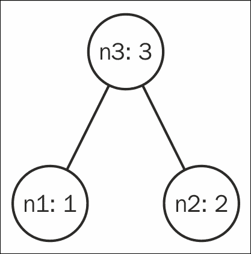
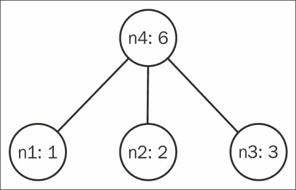
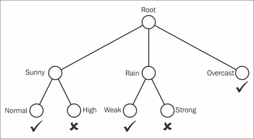
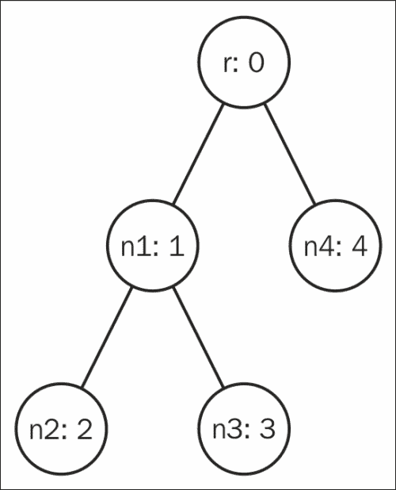

# 第五章 树的舞蹈

本节涵盖了从创建简单的二叉树到哈夫曼编码等实际应用：

+   定义二叉树数据类型

+   定义玫瑰树（多路树）数据类型

+   深度优先遍历树

+   广度优先遍历树

+   为树实现可折叠实例

+   计算树的高度

+   实现二叉搜索树数据结构

+   验证二叉搜索树的顺序属性

+   使用自平衡树

+   实现最小堆数据结构

+   使用哈夫曼树对字符串进行编码

+   解码哈夫曼编码

# 简介


树是广泛应用于各种数据分析技术中的常见数据结构。**树**是一个节点的层次化连接，所有节点都在一个强大的根节点下。每个节点可以有零个或多个子节点，但每个子节点只与一个父节点相关联。此外，根节点是唯一没有父节点的特殊节点。所有没有子节点的节点也称为**叶子**节点。

在 Haskell 中，我们可以优雅地表示树，因为数据结构的递归性质利用了函数式编程的递归特性。本节将介绍创建我们自己的树以及使用库中现有的实现。

我们将实现堆和哈夫曼树，它们是数据分析中最著名的树结构之一。在本书的其他章节中，我们还会遇到 HTML/XML 遍历、层次聚类和决策树，这些都在很大程度上依赖于树数据结构。

# 定义二叉树数据类型

在二叉树中，每个节点最多有两个子节点。我们将定义一个数据结构来包含每个节点的左子树和右子树。

## 准备工作

本节中的代码将表示以下树结构。根节点标记为**n3**，值为**3**。它有一个左节点**n1**，值为**1**，和一个右节点**n2**，值为**2**。



## 如何做...

1.  这段代码不需要任何导入。我们可以直接定义数据结构递归地。树可以是一个带有值的节点，也可以是空/null：

    ```py
    data Tree a = Node { value	:: a
                       , left  :: (Tree a)
                       , right:: (Tree a) }
                | Leaf 
                deriving Show
    ```

1.  在 `main` 中，创建如上图所示的树并将其打印出来：

    ```py
    main = do
      let n1 = Node { value = 1, left = Leaf, right = Leaf }
      let n2 = Node { value = 2, left = Leaf, right = Leaf }
      let n3 = Node { value = 3, left = n1,   right = n2 }
      print n3
    ```

1.  完整的树结构打印结果如下：

    ```py
    $ runhaskell Main.hs

    Node { value = 3
     , left = Node  { value = 1
     , left = Leaf
     , right = Leaf }
     , right = Node { value = 2
     , left = Leaf
     , right = Leaf }
     }

    ```

## 另见

如果树中的节点需要超过两个子节点，则请参阅下一节，*定义玫瑰树（多路树）数据类型*。

# 定义玫瑰树（多路树）数据类型

玫瑰树放松了每个节点最多两个子节点的限制。它可以包含任意数量的元素。玫瑰树在解析 HTML 时很常见，用于表示**文档对象模型**（**DOM**）。

## 准备工作

我们将在本节中表示以下树结构。根节点有三个子节点：



## 如何做...

本节的配方不需要任何导入：

1.  玫瑰树数据类型与二叉树的数据类型相似，不同之处在于它不会使用左、右子节点，而是存储一个任意数量的子节点的列表：

    ```py
    data Tree a = Node { value  :: a
                       , children  :: [Tree a] } 
                       deriving Show
    ```

1.  从前面的图示构建树并将其打印出来：

    ```py
    main = do
      let n1 = Node { value = 1, children = [] }
      let n2 = Node { value = 2, children = [] }
      let n3 = Node { value = 3, children = [] }
      let n4 = Node { value = 6, children = [n1, n2, n3] }
      print n4
    ```

1.  打印的输出将如下所示：

    ```py
    $ runhaskell Main.hs

    Node { value = 6
     , children = [ Node { value = 1
     , children = [] }
     , Node { value = 2
     , children = [] }
     , Node { value = 3
     , children = [] } ] 
     }

    ```

## 它是如何工作的……

玫瑰树不像使用专用的左、右字段来表示子节点，而是使用列表数据结构来表示任意数量的子节点。如果每个节点最多只能有两个子节点，则可以使用玫瑰树模拟二叉树。

## 另见

要表示一个二叉树，使用之前的方案可能会更简单，*定义二叉树数据类型*。

# 深度优先遍历树

本方案将展示一种遍历树的方法。该算法从根节点开始，沿着一条分支深入探索所有节点，直到回到较浅的节点继续探索。

由于我们会在递归地检查子节点之前检查每个节点，因此我们称之为**先序遍历**。相反，如果我们在检查每个节点之后再检查其子节点，那么我们称这种方法为**后序遍历**。介于两者之间的是**中序遍历**，但自然地，玫瑰树没有唯一的中序遍历。

使用深度优先方法的最大优势是最小的空间复杂度。视频游戏中的 AI 常常使用深度优先方法来确定对抗对手时的最佳动作。然而，在庞大或无限的树中，如果我们不断访问后续子节点，深度优先搜索可能永远无法终止。

## 准备就绪

我们将以深度优先的方式遍历以下树。我们从节点**r**开始，首先探索节点**n1**，然后是**n2**，接着返回查找**n3**，最后回溯到**n4**，并最终结束。


## 如何实现……

1.  我们将使用`Data.Tree`中的现有玫瑰树实现：

    ```py
    import Data.Tree (rootLabel, subForest, Tree(..))
    import Data.List (tails)
    ```

1.  这个函数将会深度优先遍历树：

    ```py
    depthFirst :: Tree a -> [a]

    depthFirst (Node r forest) = 
      r : concat [depthFirst t | t <- forest]
    ```

1.  这是一个深度优先实现，目的是将树中的所有值相加：

    ```py
    add :: Tree Int -> Int

    add (Node r forest) = r + sum [add t | t <- forest]
    ```

1.  定义一个树来表示前面的图示：

    ```py
    someTree :: Tree Int

    someTree = r
      where r  = Node { rootLabel = 0, subForest = [n1, n4] }
            n1 = Node { rootLabel = 1, subForest = [n2, n3] }
            n2 = Node { rootLabel = 2, subForest = [] }
            n3 = Node { rootLabel = 3, subForest = [] }
            n4 = Node { rootLabel = 4, subForest = [] }
    ```

1.  测试深度优先函数：

    ```py
    main = do
      print $ depthFirst someTree
      print $ add someTree
    ```

1.  这将打印出以下两行输出：

    ```py
    $ runhaskell Main.hs

    [0,1,2,3,4]
    10

    ```

## 它是如何工作的……

在这个方案中，我们使用了来自`Data.Tree`的内置玫瑰树数据结构。与我们在前一个方案中的实现类似，它的`Tree`数据类型具有以下构造函数：

```py
data Tree a = Node { rootLabel :: a
                   , subForest :: Forest a }
```

我们在每个子节点上递归运行`depthFirst`算法，并将其附加到节点的值上，从而创建一个表示树遍历的列表。

## 另见

如果更倾向于按树的层次遍历树，请查看下一节，*广度优先遍历树*。

# 广度优先遍历树

在树的广度优先搜索方法中，节点按照树的深度顺序被访问。首先访问根节点，然后是它的子节点，再接着是每个子节点的子节点，依此类推。这个过程比深度优先遍历需要更大的空间复杂度，但在优化搜索算法时非常有用。

例如，假设你试图从维基百科文章中找到所有相关的主题。以广度优先的方式遍历文章中的所有链接，有助于确保主题从一开始就具有相关性。

## 准备就绪

请查看下图中的树。广度优先遍历将从根节点**r**开始，然后继续到下一级，遇到**n1**和**n4**，最后是**n2**和**n3**。


## 如何实现...

1.  我们将使用来自`Data.Tree`的现有玫瑰树实现：

    ```py
    import Data.Tree (rootLabel, subForest, Tree(..))
    import Data.List (tails)
    ```

1.  实现树的广度优先遍历：

    ```py
    breadthFirst :: Tree a -> [a]

    breadthFirst t = bf [t]
      where bf forest | null forest = []
                      | otherwise   = map rootLabel forest ++
                             bf (concat (map subForest forest))
    ```

1.  为了演示，实现一个函数来添加树中每个节点的值。

    ```py
    add :: Tree Int -> Int

    add t = sum $ breadthFirst t
    ```

1.  根据前面的图表创建一棵树：

    ```py
    someTree :: Tree Int

    someTree = root
      where root = Node { rootLabel = 0, subForest = [n1, n4] }
            n1   = Node { rootLabel = 1, subForest = [n2, n3] }
            n2   = Node { rootLabel = 2, subForest = [] }
            n3   = Node { rootLabel = 3, subForest = [] }
            n4   = Node { rootLabel = 4, subForest = [] }
    ```

1.  在`main`中测试广度优先算法：

    ```py
    main = do
      print $ breadthFirst someTree
      print $ add someTree
    ```

1.  输出结果如下：

    ```py
    $ runhaskell Main.hs

    [0,1,4,2,3]
    10

    ```

## 它是如何工作的…

在这个配方中，我们使用了`Data.Tree`中的内置玫瑰树数据结构。与我们之前某个配方中的实现类似，它具有以下构造器的`Tree`数据类型：

```py
data Tree a = Node { rootLabel :: a
                   , subForest :: Forest a }
```

我们通过创建一个列表来执行广度优先搜索，该列表从节点的直接子节点的值开始。然后，附加子节点的子节点的值，依此类推，直到树完全遍历。

## 另见

如果空间复杂度成为问题，那么之前的配方，*深度优先遍历树*，可能会提供更好的方法。

# 为树实现一个`Foldable`实例

遍历树的概念可以通过实现一个`Foldable`实例来推广。通常，fold 操作用于列表；例如，`foldr1 (+) [1..10]`遍历一个数字列表以产生总和。类似地，我们可以应用`foldr1 (+) tree`来找到树中所有节点的总和。

## 准备就绪

我们将通过以下树来折叠并获取所有节点值的总和。


## 如何实现...

1.  导入以下内置包：

    ```py
    import Data.Monoid (mempty, mappend)
    import qualified Data.Foldable as F
    import Data.Foldable (Foldable, foldMap)
    ```

1.  `Data.Tree`中的树已经实现了`Foldable`，因此我们将定义自己的树数据类型用于演示：

    ```py
    data Tree a = Node { value :: a
                       , children :: [Tree a] }
                       deriving Show
    ```

1.  为`Foldable`实例实现`foldMap`函数。这个实现将给我们树的后序遍历：

    ```py
    instance Foldable Tree where
      foldMap f Null = mempty
      foldMap f (Node val xs) = foldr mappend (f val) 
                                 [foldMap f x | x <- xs]
    ```

1.  定义一个函数通过树折叠以找到所有节点的和：

    ```py
    add :: Tree Integer -> Integer

    add = F.foldr1 (+)
    ```

1.  构造一个表示前面图表中树的树：

    ```py
    someTree :: Tree Integer

    someTree = root
      where root = Node { value = 0, children = [n1, n4] }
            n1   = Node { value = 1, children = [n2, n3] }
            n2   = Node { value = 2, children = [] }
            n3   = Node { value = 3, children = [] }
            n4   = Node { value = 4, children = [] }
    ```

1.  通过在树上运行`add`函数来测试折叠操作：

    ```py
    main :: IO ()
    main = print $ add someTree
    ```

1.  结果将打印如下：

    ```py
    $ runhaskell Main.hs

    10

    ```

## 它是如何工作的...

定义`Foldable`实例所需的函数是`foldMap`或`foldr`。在本节中，我们定义了`foldMap :: (Foldable t, Data.Monoid.Monoid m) => (a -> m) -> t a -> m`函数，该函数实际上将一个函数`f`映射到树中的每个节点，并通过使用`Data.Monoid`中的`mappend`将其连接起来。

## 另请参见

遍历树的其他方法在前两节中讨论过，*深度优先遍历树*和*广度优先遍历树*。

# 计算树的高度

树的高度是从根节点到最深路径的长度。例如，一个平衡二叉树的高度应该大约是节点数量的以 2 为底的对数。

## 准备就绪

只要我们保持一致，树的高度可以定义为最长路径中节点的数量或边的数量。在本节中，我们将通过节点的数量来计算。该树的最长路径包含三个节点和两条边。因此，这棵树的高度为三个单位。



## 如何操作...

1.  从`Data.List`导入`maximum function`，并从`Data.Tree`导入内置的树数据结构：

    ```py
    import Data.List (maximum)
    import Data.Tree
    ```

1.  定义一个函数来计算树的高度：

    ```py
    height :: Tree a -> Int

    height (Node val []) = 1
    height (Node val xs) = 1 + maximum (map height xs)
    ```

1.  构建一棵树，我们将在其上运行算法：

    ```py
    someTree :: Tree Integer

    someTree = root
      where root = 0 [n1, n4]
            n1   = 1 [n2, n3]
            n2   = 2 []
            n3   = 3 []
            n4   = 4 []
    ```

1.  在`main`中测试该函数：

    ```py
    main = print $ height someTree
    ```

1.  树的高度将如下所示打印出来：

    ```py
    $ runhaskell Main.hs

    3

    ```

## 它是如何工作的...

`height`函数通过递归查找其子树中的最大高度，并返回该值加一。

# 实现二叉搜索树数据结构

二叉搜索树对二叉树施加了一种顺序属性。这个顺序属性要求在每个节点中，左子树中的节点不能大于当前节点，右子树中的节点不能小于当前节点。

## 如何操作...

1.  创建一个二叉`BSTree`模块，用于暴露我们的二叉搜索树数据结构。将以下代码插入一个名为`BSTree.hs`的文件中：

    ```py
    module BSTree (insert, find, single) where
    ```

1.  定义二叉树的数据结构：

    ```py
    data Tree a = Node	{value	:: a
                       , left   :: (Tree a)
                       , right  :: (Tree a)}
                 | Null
                 deriving (Eq, Show)
    ```

1.  定义一个便捷函数来创建一个单节点树：

    ```py
    single :: a -> Tree a

    single n = Node n Null Null
    ```

1.  实现一个函数，用于向二叉搜索树中插入新值：

    ```py
    insert :: Ord a => Tree a -> a -> Tree a

    insert (Node v l r) v'
      | v' < v      = Node v (insert l v') r
      | v' > v      = Node v l (insert r v')
      | otherwise   = Node v l r

    insert _ v' = Node v' Null Null
    ```

1.  实现一个函数，用于在二叉搜索树中查找具有特定值的节点：

    ```py
    find :: Ord a => Tree a -> a -> Bool

    find (Node v l r) v'
      | v' < v      = find l v'
      | v' > v      = find r v'
      | otherwise   = True

    find Null v' = False
    ```

1.  现在，测试`BSTree`模块，在一个新的文件中写入以下代码，可以命名为`Main.hs`：

    ```py
    import BSTree
    ```

1.  在`main`中，通过对不同的值调用`insert`函数构造一棵二叉搜索树：

    ```py
    main = do
      let tree = single 5
      let nodes = [6,4,8,2,9]
      let bst = foldl insert tree nodes
    ```

1.  打印树并测试`find`函数：

    ```py
      print bst
      print $ find bst 1
      print $ find bst 2
    ```

1.  输出应如下所示：

    ```py
    $ runhaskell Main.hs

    Node { value = 5
     , left = Node { value = 4
     , left = Node { value = 2
     , left = Null
     , right = Null }
     , right = Null }
     , right = Node { value = 6
     , left = Null
     , right = Node { value = 8
     , left = Null
     , right = Node { value = 9
     , left = Null
     , right = Null }
     }
     }
     }

    False

    True

    ```

## 它是如何工作的...

二叉搜索树数据结构的核心功能是`insert`和`find`，分别用于在二叉搜索树中插入和查找元素。查找节点是通过遍历树并利用其顺序性质来完成的。如果值低于预期，它会检查左节点；否则，如果值较大，它会检查右节点。最终，这个递归算法要么找到所需的节点，要么到达叶节点，从而找不到该节点。

二叉搜索树不保证树是平衡的，因此不能期望有快速的 O(log n)查找操作。二叉搜索树总有可能最终看起来像一个列表数据结构（例如，当我们按照[1,2,3,4,5]的顺序插入节点时，检查最终结构）。

## 另请参见

给定一棵二叉树，可以使用以下名为*验证二叉搜索树的顺序性质*的实例来验证顺序性质。如果要使用平衡的二叉树，请参考实例*使用自平衡树*。

# 验证二叉搜索树的顺序性质

给定一棵二叉树，本实例将介绍如何验证它是否满足顺序性质，即左子树中的所有元素都较小，而右子树中的所有元素都较大。

## 准备工作

我们将验证以下树是否为二叉搜索树：



## 如何实现...

本实例无需导入任何包。请按照以下步骤检查树是否为二叉搜索树：

1.  定义一个二叉树的数据结构：

    ```py
    data Tree a = Node { value  :: a
                       , left  :: (Tree a)
                       , right :: (Tree a)}
                | Null
        deriving (Eq, Show)
    ```

1.  根据前面的图示构建一棵树：

    ```py
    someTree :: Tree Int

    someTree = root  
      where root = Node 0 n1 n4
            n1   = Node 1 n2 n3
            n2   = Node 2 Null Null
            n3   = Node 3 Null Null
            n4   = Node 4 Null Null
    ```

1.  定义一个函数来验证树是否遵循二叉顺序性质：

    ```py
    valid :: Ord t => Tree t -> Bool

    valid (Node v l r) = leftValid && rightValid
      where leftValid  = if notNull l 
                           then valid l && value l <= v 
                           else True
            rightValid = if notNull r 
                           then valid r && v <= value r 
                           else True
            notNull t  =  t /= Null
    ```

1.  在`main`中测试该功能：

    ```py
    main = print $ valid someTree
    ```

1.  很明显，这棵树不遵循顺序性质，因此，输出结果如下：

    ```py
    $ runhaskell Main.hs

    False

    ```

## 工作原理...

`valid`函数递归地检查左子树是否包含小于当前节点的元素，右子树是否包含大于当前节点的元素。

# 使用自平衡树

AVL 树是一种平衡的二叉搜索树。每个子树的高度差最多为一。在每次插入或删除时，树会通过一系列旋转操作调整节点，使其保持平衡。平衡的树确保了高度最小化，从而保证查找和插入操作在*O(log n)*时间内完成。在这个实例中，我们将直接使用 AVL 树包，但自平衡树也可以在`Data.Set`和`Data.Map`实现中找到。

## 准备工作

我们将使用`AvlTree`包来使用`Data.Tree.AVL`：

```py
$ cabal install AvlTree

```

## 如何实现...

1.  导入相关的 AVL 树包：

    ```py
    import Data.Tree.AVL
    import Data.COrdering
    ```

1.  从一个值列表中设置一个 AVL 树，并读取其中的最小值和最大值：

    ```py
    main = do
      let avl  = asTree fstCC [4,2,1,5,3,6]
      let min  = tryReadL avl
      let max  = tryReadR avl
      print min
      print max
    ```

1.  最小值和最大值如下所示：

    ```py
    $ runhaskell Main.hs

    Just 1
    Just 6

    ```

## 工作原理...

`asTree :: (e -> e -> COrdering e) -> [e] -> AVL` 函数接受一个排序属性和一个元素列表，生成相应元素的 AVL 树。`fstCC :: Ord a => a -> a -> COrdering a` 函数来自 `Data.Cordering`，其定义如下：

*一个为 'Ord' 实例提供的组合比较，它在认为两个参数相等时保留第一个参数，第二个参数则被丢弃。*

## 还有更多…

Haskell 的 `Data.Set` 和 `Data.Map` 函数实现高效地使用了平衡二叉树。我们可以通过简单地使用 `Data.Set` 来重写这个方法：

```py
import qualified Data.Set as S

main = do
  let s = S.fromList [4,2,1,5,3,6]
  let min = S.findMin s
  let max = S.findMax s
  print min
  print max 
```

# 实现一个最小堆数据结构

堆是一个具有形状属性和堆属性的二叉树。形状属性通过定义每个节点除非位于最后一层，否则都必须有两个子节点，强制树以平衡的方式表现。堆属性确保如果是最小堆，则每个节点小于或等于其任何子节点，最大堆则相反。

堆用于常数时间查找最大或最小元素。我们将在下一个示例中使用堆来实现我们自己的霍夫曼树。

## 入门

安装 lens 库以便于数据操作：

```py
$ cabal install lens

```

## 如何实现...

1.  在 `MinHeap.hs` 文件中定义 `MinHeap` 模块：

    ```py
    module MinHeap (empty, insert, deleteMin, weights) where

    import Control.Lens (element, set)
    import Data.Maybe (isJust, fromJust)
    ```

1.  我们将使用一个列表来表示二叉树数据结构，仅用于演示目的。最好将堆实现为实际的二叉树（如我们在前面的章节中所做的），或者我们应使用实际的数组来提供常数时间访问其元素。为了简化起见，我们将定义根节点从索引 1 开始。给定一个位于索引 `i` 的节点，左子节点将始终位于 *2*i*，右子节点位于 *2*i + 1*：

    ```py
    data Heap v = Heap { items :: [Node v] }
                  deriving Show

    data Node v = Node { value :: v, weight :: Int }
                  deriving Show
    ```

1.  我们定义一个方便的函数来初始化一个空堆：

    ```py
    empty = Heap []
    ```

1.  在堆中插入一个节点的方法是将节点添加到数组的末尾，然后将其上浮：

    ```py
    insert v w (Heap xs) = percolateUp position items'
      where items'   = xs ++ [Node v w]
            position = length items' - 1
    ```

1.  从堆中删除一个节点的方法是将根节点与最后一个元素交换，然后从根节点开始向下浮动：

    ```py
    deleteMin (Heap xs) = percolateDown 1 items'
      where items' = set (element 1) (last xs) (init xs)
    ```

1.  创建一个函数来查看最小值：

    ```py
    viewMin heap@(Heap (_:y:_)) = 
      Just (value y, weight y, deleteMin heap)
    viewMin _                   = Nothing
    ```

1.  从一个节点向下浮动意味着确保当前节点的堆属性成立；否则，将节点与其较大或较小的子节点（根据是最大堆还是最小堆）交换。这个过程会递归地应用直到叶节点：

    ```py
    percolateDown i items
       | isJust left && isJust right = percolateDown i' 
                                         (swap i i' items)
       | isJust left = percolateDown l (swap i l items)
       | otherwise = Heap items
    ```

1.  定义 `left`、`right`、`i'`、`l` 和 `r` 变量：

    ```py
      where left   = if l >= length items
                       then Nothing
                       else Just $ items !! l
            right  = if r >= length items
                       then Nothing
                       else Just $ items !! r
            i'     = if (weight (fromJust left)) < 
                          (weight (fromJust right))
                     then l else r
            l      = 2*i
            r      = 2*i + 1
    ```

1.  上浮一个节点意味着递归地将节点与其父节点交换，直到树的堆属性成立：

    ```py
    percolateUp i items
      | i == 1 = Heap items
      | w < w' = percolateUp c (swap i c items)
      | otherwise = Heap items
       where  w  = weight $ items !! i
              w' = weight $ items !! c
              c  = i `div` 2
    ```

1.  我们定义一个方便的函数来交换列表中两个索引处的元素：

    ```py
    swap i j xs = set (element j) vi (set (element i) vj xs)
      where vi = xs !! i
            vj = xs !! j
    ```

1.  为了查看堆在数组表示中的每个节点的权重，我们可以定义如下函数：

    ```py
    weights heap = map weight ((tail.items) heap)
    ```

1.  最后，在一个我们可以命名为 `Main.hs` 的不同文件中，我们可以测试最小堆：

    ```py
    import MinHeap

    main = do
      let heap = foldr (\x -> insert x x) 
                   empty [11, 5, 3, 4, 8]
      print $ weights heap
      print $ weights $ iterate deleteMin heap !! 1
      print $ weights $ iterate deleteMin heap !! 2
      print $ weights $ iterate deleteMin heap !! 3
      print $ weights $ iterate deleteMin heap !! 4
    ```

1.  堆的数组表示中的权重输出如下：

    ```py
    $ runhaskell Main.hs

    [3,5,4,8,11]
    [4,5,11,8]
    [5,8,11]
    [8,11]
    [11]

    ```

## 还有更多…

本节代码用于理解堆数据结构，但效率并不高。Hackage 上有更好的堆实现，包括我们将要探索的`Data.Heap`库：

1.  导入堆库：

    ```py
    import Data.Heap (MinHeap, MaxHeap, empty, insert, view)
    ```

1.  定义一个辅助函数，从列表构建最小堆：

    ```py
    minheapFromList :: [Int] -> MinHeap Int
    minheapFromList ls = foldr insert empty ls
    ```

1.  定义一个辅助函数，从列表构造最大堆：

    ```py
    maxheapFromList :: [Int] -> MaxHeap Int
    maxheapFromList ls = foldr insert empty ls
    ```

1.  测试堆：

    ```py
    main = do
      let myList = [11, 5, 3, 4, 8]
      let minHeap = minheapFromList myList
      let maxHeap = maxheapFromList myList
      print $ view minHeap
      print $ view maxHeap
    ```

1.  视图函数返回一个`Maybe`数据结构中的元组。元组的第一个元素是执行查找操作后的值，第二个元素是删除该值后的新堆：

    ```py
    $ runhaskell Main.hs
    Just (3, fromList [(4,()),(11,()),(5,()),(8,())])
    Just (11, fromList [(8,()),(3,()),(5,()),(4,())])

    ```

# 使用哈夫曼树对字符串进行编码

**哈夫曼树**通过计算字符的概率分布来优化每个字符所占的空间，从而实现高效的数据编码。想象一下将这本书压缩成一张纸，再恢复回来而不丢失任何信息。哈夫曼树允许这种基于统计数据的最优无损数据压缩。

在本节中，我们将实现一个哈夫曼树，从文本源生成它的哈夫曼编码的字符串表示。

例如，字符串“hello world”包含 11 个字符，这些字符根据编码方式和架构的不同，可能只需要占用 11 个字节的空间来表示。本节代码将把该字符串转换成 51 位，或 6.375 字节。

## 准备工作

请确保连接到互联网，因为本节会从[`norgiv.com/big.txt`](http://norgiv.com/big.txt)下载文本以分析许多字符的概率分布。我们将使用前一个食谱中实现的最小堆，通过导入`MinHeap`：

## 如何操作...

1.  导入以下包。我们将使用之前的`MinHeap`模块，因此请确保包含之前食谱中的代码：

    ```py
    import Data.List (group, sort)
    import MinHeap
    import Network.HTTP ( getRequest, getResponseBody, simpleHTTP )
    import Data.Char (isAscii)
    import Data.Maybe (fromJust)
    import Data.Map (fromList, (!))
    ```

1.  定义一个函数，返回字符与其频率的关联列表：

    ```py
    freq xs = map (\x -> (head x, length x)) . 
                group . sort $ xs
    ```

1.  哈夫曼树的数据结构就是一个二叉树：

    ```py
    data HTree  =  HTree { value :: Char
                         , left  :: HTree
                         , right :: HTree }
                | Null
                deriving (Eq, Show)
    ```

1.  使用一个值构造哈夫曼树：

    ```py
    single v = HTree v Null Null
    ```

1.  定义一个函数，通过最小堆构建哈夫曼树：

    ```py
    htree heap = if length (items heap) == 2
                 then case fromJust (viewMin heap) of 
                        (a,b,c) -> a
                 else htree $ insert newNode (w1 + w2) heap3

      where (min1, w1, heap2) = fromJust $ viewMin heap
            (min2, w2, heap3) = fromJust $ viewMin heap2
            newNode           = HTree { value  = ' '
                                      , left   = min1
                                      , right  = min2 }
    ```

1.  从哈夫曼树获取哈夫曼编码的映射：

    ```py
    codes htree = codes' htree ""

      where codes' (HTree v l r) str
                | l==Null && r==Null = [(v, str)]
                | r==Null            = leftCodes
                | l==Null            = rightCodes
                | otherwise          = leftCodes ++ rightCodes
                where  leftCodes  = codes' l ('0':str)
                       rightCodes = codes' r ('1':str)
    ```

1.  定义一个函数，使用哈夫曼编码将字符串编码为文本：

    ```py
    encode str m = concat $ map (m !) str
    ```

1.  通过在`main`中执行以下操作来测试整个过程。下载并计算频率可能需要几分钟：

    ```py
    main = do
      rsp <- simpleHTTP (getRequest 
               "http://norvig.com/big.txt")
      html <- fmap (takeWhile isAscii) (getResponseBody rsp)
      let freqs = freq html
      let heap = foldr (\(v,w) -> insert (single v) w) 
                   empty freqs
      let m = fromList $ codes $ htree heap
      print $ encode "hello world" m
    ```

1.  哈夫曼树的字符串表示形式如下所示：

    ```py
    $ runhaskell Main.hs

    "010001110011110111110001011101000100011011011110010"

    ```

## 工作原理...

首先，我们通过从[`norvig.com/big.txt`](http://norvig.com/big.txt)下载文本来获取分析数据源。接下来，我们获取每个字符的频率映射并将其放入堆中。哈夫曼树通过将两个最低频率的节点合并，直到最小堆中只剩下一个节点。最后，使用哈夫曼编码对示例字符串“hello world”进行编码。

## 另见

要读取编码后的哈夫曼值，请参阅下一节，*解码哈夫曼编码*。

# 解码哈夫曼编码

这段代码在很大程度上依赖于前面的食谱，*使用哈夫曼树编码字符串*。接下来使用相同的哈夫曼树数据结构来解码哈夫曼编码的字符串表示。

## 准备工作

阅读前面的食谱，*使用哈夫曼树编码字符串*。本食谱中使用的是相同的`HTree`数据结构。

## 如何操作...

我们沿着树进行遍历，直到遇到叶子节点。然后，前置找到的字符并从根节点重新开始。这个过程会持续进行，直到没有输入可用为止：

```py
decode :: String -> HTree -> String
decode str htree = decode' str htree
  where  decode' "" _ = ""
      decode' ('0':str) (HTree _ l _)
        | leaf l    = value l : decode' str htree
        | otherwise = decode' str l
      decode' ('1':str) (HTree v _ r)
        | leaf r    = value r : decode' str htree
        | otherwise = decode' str r
      leaf tree = left tree == Null && right tree == Null
```

## 另请参见

要使用哈夫曼树编码数据，请参见前面的食谱，*使用哈夫曼树编码字符串*。
