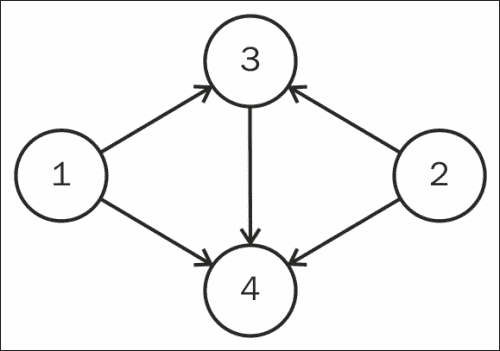
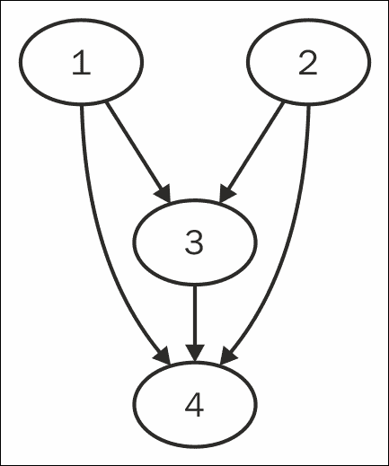
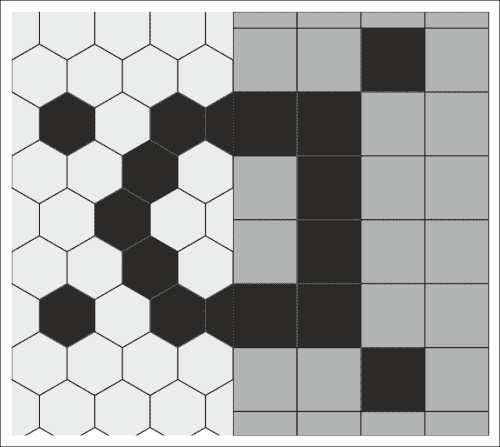
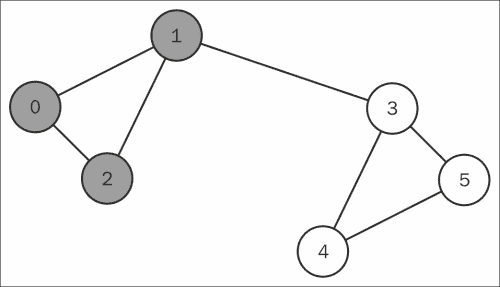
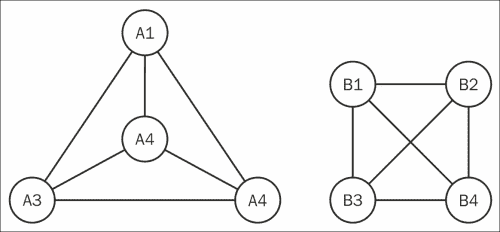

# 第六章 图基础

本章我们将涵盖以下方法：

+   从边的列表表示图

+   从邻接表表示图

+   对图进行拓扑排序

+   深度优先遍历图

+   图的广度优先遍历

+   使用 Graphviz 可视化图

+   使用有向无环图

+   处理六边形和方形网格网络

+   查找图中的最大团

+   确定两个图是否同构

# 介绍


本节关于图的内容是对前一节关于树的内容的自然扩展。图是表示网络的基本数据结构，本章将涵盖一些重要的算法。

图减轻了树的一些限制，使得可以表示网络数据，如生物基因关系、社交网络和道路拓扑。Haskell 支持多种图数据结构库，提供了各种有用的工具和算法。本节将涵盖图的表示、拓扑排序、遍历以及与图相关的包等基础话题。

# 从边的列表表示图

图可以通过一组边来定义，其中边是顶点的元组。在`Data.Graph`包中，顶点就是`Int`。在这个方法中，我们使用`buildG`函数根据一组边构建图数据结构。

## 准备就绪

我们将构建如下图所示的图：



## 如何做……

创建一个新文件，我们将其命名为`Main.hs`，并插入以下代码：

1.  导入`Data.Graph`包：

    ```py
    import Data.Graph
    ```

1.  使用导入库中的`buildG`函数构建图：

    ```py
    myGraph :: Graph

    myGraph= buildG bounds edges  
      where  bounds = (1,4)
          edges = [ (1,3), (1,4)
                  , (2,3), (2,4) 
                  , (3,4) ]
    ```

1.  打印图、它的边和顶点：

    ```py
    main = do
      print $ "The edges are " ++ (show.edges) myGraph
      print $ "The vertices are " ++ (show.vertices) myGraph
    ```

## 它是如何工作的……

一组边被传递给`buildG :: Bounds -> [Edge] -> Graph`函数以构建图数据结构。第一个参数指定了顶点的上下边界，第二个参数指定了组成图的边的列表。

这种图数据类型实际上是一个 Haskell 数组，表示从顶点到顶点列表的映射。它使用了内建的`Data.Array`包，意味着我们可以在图中使用`Data.Array`提供的所有函数。

## 另见

要了解另一种构建图的方式，请参见下一个方法，*从邻接表表示图*。

# 从邻接表表示图

给定邻接表构建图可能会更方便。在本方法中，我们将使用内建的`Data.Graph`包来读取顶点与其连接的顶点列表之间的映射。

## 准备就绪

我们将构建如下图所示的图：


## 如何做……

创建一个新文件，我们将其命名为`Main.hs`，并插入以下代码：

1.  导入`Data.Graph`包：

    ```py
    import Data.Graph
    ```

1.  使用 `graphFromEdges'` 函数获取包含图形的元组。元组的第一个元素是图数据结构 `Graph`，第二个元素是从节点编号到其相应值的映射 `Vertex -> (node, key, [key])`：

    ```py
    myGraph :: Graph

    myGraph = fst $ graphFromEdges'   [ ("Node 1", 1, [3, 4] )
                                      , ("Node 2", 2, [3, 4]) 
                                      , ("Node 3", 3, [4])
                                      , ("Node 4", 4, []) ]
    ```

1.  输出一些图形计算结果：

    ```py
    main = do
      putStrLn $ "The edges are "++ (show.edges) myGraph 
      putStrLn $ "The vertices are "++ (show.vertices) myGraph 
    ```

1.  运行代码会显示图形的边和节点：

    ```py
    $ runhaskell Main.hs

    The edges are [(0,2), (0,3), (1,2), (1,3), (2,3)]
    The vertices are [0, 1, 2, 3]

    ```

## 它是如何工作的...

我们可能会注意到，每个节点的键已经由算法自动分配。`graphFromEdges'` 函数实际上返回一个类型为 `(Graph, Vertex -> (node, key, [key]))` 的元组，其中第一个元素是图数据结构，第二个元素是从节点编号到其实际键的映射。

与之前的配方一样，这个图数据结构实际上是来自 `Data.Array` 包的一个数组，这意味着我们可以在图形中使用 `Data.Array` 提供的所有函数。

## 参见：

如果我们希望从边的列表创建图形，之前的配方 *从邻接表表示图形* 可以完成这个任务。

# 对图进行拓扑排序

如果图是有向图，那么拓扑排序是图的自然排序之一。在依赖关系网络中，拓扑排序将揭示满足这些依赖关系的所有顶点的可能排列。

Haskell 内置的图形包提供了一个非常有用的函数 `topSort`，可以对图形进行拓扑排序。在这个配方中，我们将创建一个依赖关系图，并对其进行拓扑排序。

## 准备工作

我们将从用户输入中读取数据。每一对行将表示一个依赖关系。

创建一个名为 `input.txt` 的文件，文件内容是以下依赖项对：

```py
$ cat input.txt

understand Haskell
do Haskell data analysis
understand data analysis
do Haskell data analysis
do Haskell data analysis
find patterns in big data

```

该文件描述了一个依赖关系列表，内容如下：

+   必须理解 Haskell 才能进行 Haskell 数据分析

+   必须理解数据分析才能进行 Haskell 数据分析

+   必须进行 Haskell 数据分析才能在大数据中找到模式

### 提示

我们将使用 `Data.Graph` 提供的 `topsort` 算法。请注意，这个函数不能检测循环依赖。

## 如何实现...

在一个新文件中，我们将其命名为 `Main.hs`，插入以下代码：

1.  从图形、映射和列表包中导入以下内容：

    ```py
    import Data.Graph
    import Data.Map (Map, (!), fromList)
    import Data.List (nub)
    ```

1.  从输入中读取并根据依赖关系构建图形。对图执行拓扑排序并输出有效的顺序：

    ```py
    main = do
      ls <- fmap lines getContents
      let g = graph ls
      putStrLn $ showTopoSort ls g
    ```

1.  从字符串列表构建图形，其中每一对行表示一个依赖关系：

    ```py
    graph :: Ord k => [k] -> Graph

    graph ls = buildG bounds edges
      where bounds = (1, (length.nub) ls)
        edges = tuples $ map (mappingStrToNum !) ls
        mappingStrToNum = fromList $ zip (nub ls) [1..]
        tuples (a:b:cs) = (a, b) : tuples cs
        tuples _ = []
    ```

1.  对图进行拓扑排序，并输出有效的排序顺序：

    ```py
    showTopoSort :: [String] -> Graph -> String

    showTopoSort ls g = 
      unlines $ map (mappingNumToStr !) (topSort g)
      where mappingNumToStr = fromList $ zip [1..] (nub ls)
    ```

1.  编译代码并将依赖项的文本文件作为输入：

    ```py
    $ runhaskell Main.hs < input.txt

    understand data analysis
    understand Haskell
    do Haskell data analysis
    find patterns in big data

    ```

# 深度优先遍历图形

使用深度优先搜索，能够遍历图形以查看节点的期望顺序。实现拓扑排序、解决迷宫问题以及寻找连通分量，都是依赖于图的深度优先遍历的有用算法示例。

## 如何实现...

开始编辑一个新的源文件，我们将其命名为`Main.hs`：

1.  导入所需的包：

    ```py
    import Data.Graph
    import Data.Array ((!))
    ```

1.  从邻接表构建图形：

    ```py
    graph :: (Graph, Vertex -> (Int, Int, [Int]))

    graph = graphFromEdges'  [ (1, 1, [3, 4] )
                             , (2, 2, [3, 4]) 
                             , (3, 3, [4])
                             , (4, 4, []) ]
    ```

1.  扫描图形进行深度优先遍历：

    ```py
    depth g i = depth' g [] i
    depth' g2(gShape, gMapping) seen i = 
      key : concat (map goDeeper adjacent)
      where goDeeper v = if v `elem` seen 
                          then [] 
                          else depth' g (i:seen) v
             adjacent = gShape ! i
             (_, key, _) = gMapping i
    ```

1.  打印出访问的顶点列表：

    ```py
    main = print $ depth graph 0
    ```

1.  运行算法以查看遍历顺序。

    ```py
    $ runhaskell Main.hs
    [1, 3, 4, 4]

    ```

我们从节点 1（索引为 0）开始。我们沿着第一条边遍历到节点 3。从节点 3，我们沿着第一条边遍历到节点 4。由于 4 没有出边，我们回到节点 3。由于 3 没有剩余的出边，我们回到节点 1。从节点 1，我们沿着第二条边遍历到节点 4。

# 进行广度优先遍历图形

使用广度优先搜索，可以遍历图形以查看节点的顺序。在一个无限图中，深度优先遍历可能永远无法返回到起始节点。广度优先遍历算法的一个显著例子是找到两个节点之间的最短路径。

在本教程中，我们将打印出图中节点的广度优先遍历。

## 如何操作...

在新文件中插入以下代码，可以命名为`Main.hs`：

1.  导入所需的包：

    ```py
    import Data.Graph
    import Data.Array ((!))
    ```

1.  从边的列表构建图形：

    ```py
    graph :: Graph
    graph = buildG bounds edges
      where  bounds = (1,7)
             edges = [ (1,2), (1,5)
                     , (2,3), (2,4) 
                     , (5,6), (5,7) 
                     , (3,1) ]
    ```

1.  扫描图形进行广度优先遍历：

    ```py
    breadth g i = bf [] [i]
      where bf :: [Int] -> [Int] -> [Int]
            bf seen forest | null forest = []
                           | otherwise   = forest ++ 
                                           bf (forest ++ seen) 
                                 (concat (map goDeeper forest))
              where goDeeper v = if elem v seen 
                                  then [] else (g ! v)
    ```

1.  打印出深度优先遍历的访问顶点列表：

    ```py
    main = do
      print $ breadth graph 1
    ```

1.  运行代码显示遍历结果：

    ```py
    $ runhaskell Main.hs
    [1, 5, 2, 7, 6, 4, 3, 1]

    ```

# 使用 Graphviz 可视化图形

使用`graphviz`库，可以轻松绘制表示图形的图像。在数据分析的世界中，直观地解读图像可以揭示数据中的一些特征，这些特征是人眼容易捕捉到的。本教程将帮助我们根据所处理的数据构建一个图表。更多的可视化技术在第十一章，*数据可视化*中进行了详细说明。

## 准备工作

从[`www.graphviz.org/Download.php`](http://www.graphviz.org/Download.php)安装`graphviz`库，因为 Haskell 包需要它。

接下来，通过运行以下命令从 cabal 安装该软件包：

```py
$ cabal install graphviz

```

## 如何操作...

在新文件中插入以下代码。我们将文件命名为`Main.hs`：

1.  导入包：

    ```py
    import Data.GraphViz
    ```

1.  从节点和边创建图形：

    ```py
    graph :: DotGraph Int

    graph = graphElemsToDot graphParams nodes edges
    ```

1.  使用默认参数创建图形。此函数可以修改以调整图形的可视化参数：

    ```py
    graphParams :: GraphvizParams Int String Bool () String

    graphParams = defaultParams
    ```

1.  根据相应的边创建代码：

    ```py
    nodes :: [(Int, String)]

    nodes = map (\x -> (x, "")) [1..4]

    edges:: [(Int, Int, Bool)]

    edges= [ (1, 3, True)
           , (1, 4, True) 
        , (2, 3, True)
        , (2, 4, True)
        , (3, 4, True)]
    ```

1.  执行`main`以输出图形：

    ```py
    main = addExtension (runGraphviz graph) Png "graph"
    ```

    

# 使用有向无环词图

我们使用**有向无环词图**（**DAWG**）从大量字符串语料库中快速检索，且在空间复杂度上几乎不占空间。想象一下，使用 DAWG 压缩词典中的所有单词，从而实现高效的单词查找。这是一种强大的数据结构，当处理大量单词时非常有用。关于 DAWG 的一个非常好的介绍可以在 Steve Hanov 的博客文章中找到：[`stevehanov.ca/blog/index.php?id=115`](http://stevehanov.ca/blog/index.php?id=115)。

我们可以使用此方法将 DAWG 集成到我们的代码中。

## 准备工作

使用 cabal 安装 DAWG 包：

```py
$ cabal install dawg

```

## 如何做...

我们命名一个新文件`Main.hs`并插入以下代码：

1.  导入以下包：

    ```py
    import qualified Data.DAWG.Static as D
    import Network.HTTP ( simpleHTTP, getRequest,  
                          getResponseBody)
    import Data.Char (toLower, isAlphaNum, isSpace)
    import Data.Maybe (isJust)
    ```

1.  在`main`函数中，下载大量文本以存储：

    ```py
    main = do
      let url = "http://norvig.com/big.txt"
      body <- simpleHTTP (getRequest url) >>= getResponseBody
    ```

1.  从由语料库构建的 DAWG 中查找一些字符串：

    ```py
      let corp = corpus body
      print $ isJust $ D.lookup "hello" corp
      print $ isJust $ D.lookup "goodbye" corp
    ```

1.  构建一个获取函数：

    ```py
    getWords :: String -> [String]

    getWords str = words $ map toLower wordlike
      where wordlike = 
               filter (\x -> isAlphaNum x || isSpace x) str
    ```

1.  从语料库字典创建一个 DAWG：

    ```py
    corpus :: String -> D.DAWG Char () ()

    corpus str = D.fromLang $ getWords str
    ```

1.  运行代码显示，这两个词确实存在于大规模语料库中。请注意，需要一个耗时的预处理步骤来构建 DAWG：

    ```py
    $ runhaskell Main.hs

    True
    True

    ```

### 提示

一个天真的方法可能是使用`Data.List`中的`isInfixOf`函数执行子字符串搜索。在一台配备 8 GB RAM 的 Intel i5 处理器的 Typical ThinkPad T530 上，执行`isInfixOf`操作的平均时间约为 0.16 秒。然而，如果我们预处理 DAWG 数据结构，则查找时间小于 0.01 秒！

# 处理六边形和方形网格网络

有时，我们处理的图具有严格的结构，例如六边形或方形网格。许多视频游戏使用六边形网格布局来促进对角线移动，因为在方形网格中对角线移动会使得移动距离的值变得复杂。另一方面，方形网格结构经常用于图像处理算法（如洪泛填充）中的像素遍历。



Haskell 包列表中有一个非常有用的库用于处理这样的拓扑结构。我们可以获取网格的索引以遍历世界，这实质上是嵌入图中的路径。对于每个网格索引，我们可以查询库以找到相邻的索引，有效地使用网格作为图形。

## 入门指南

查阅位于[`github.com/mhwombat/grid/wiki`](https://github.com/mhwombat/grid/wiki)的包文档：

使用 cabal 安装 grid 包：

```py
$ cabal install grid

```

## 如何做...

在一个新文件中，我们将命名为`Main.hs`，插入以下代码：

1.  导入以下库：

    ```py
    import Math.Geometry.Grid (indices, neighbours)
    import Math.Geometry.Grid.Hexagonal (hexHexGrid)
    import Math.Geometry.Grid.Square (rectSquareGrid)
    import Math.Geometry.GridMap ((!))
    import Math.Geometry.GridMap.Lazy (lazyGridMap)
    ```

1.  在`main`函数中，打印一些六边形和网格函数的示例：

    ```py
    main = do
      let putStrLn' str = putStrLn ('\n':str)
      putStrLn' "Indices of hex grid:"
      print $ indices hex
      putStrLn' "Neighbors around (1,1) of hex grid:"
      print $ neighbours hex (1,1)
      putStrLn' "Indices of rect grid:"
      print $ indices rect
      putStrLn' "Neighbors around (1,1) of rect grid:"
      print $ neighbours rect (1,1)
      putStrLn' "value of hex at index (1,1)"
      print $ hexM ! (1,1)
    ```

1.  使用一个辅助函数来构建六边形网格：

    ```py
    hex = hexHexGrid 4
    ```

1.  使用一个辅助函数来构建方形网格：

    ```py
    rect = rectSquareGrid 3 5
    ```

1.  创建一个带有相关数值的六边形网格：

    ```py
    hexM = lazyGridMap hex [1..]
    ```

# 在图中查找最大的团

Haskell 带有许多重要的图形库，其中一个便利的图形库是来自`Data.Algorithm.MaximalCliques`的团检测库。图中的**团**是一个子图，其中所有节点之间都有连接，如下所示：



例如，上述图中包含两个不同颜色阴影的团。也许，该图表示相互链接的网页。从图的结构可以直观推断，由于网络连接的结构，可能存在两个互联网社区的集群。随着连接的网络增加，查找最大团变得成倍困难。

在这个食谱中，我们将使用最大团问题的高效实现。

## 入门

使用 cabal 安装 clique 库：

```py
$ cabal install maximal-cliques

```

## 如何操作...

在一个新文件中编写以下代码，我们将其命名为`Main.hs`：

1.  导入所需的库：

    ```py
    import Data.Algorithm.MaximalCliques
    ```

1.  在`main`中，打印出最大团：

    ```py
    main = print $ getMaximalCliques edges nodes
    ```

1.  创建以下图形：

    ```py
    edges 1 5 = True  
    edges 1 2 = True
    edges 2 3 = True
    edges 2 5 = True
    edges 4 5 = True
    edges 3 4 = True
    edges 4 6 = True
    edges _ _ = False
    ```

1.  确定节点范围：

    ```py
    nodes = [1..6]
    ```

## 它是如何工作的...

该库应用递归的 Bron-Kerbosch 枢轴算法来识别无向图中的最大团。算法的核心思想是智能回溯，直到找到最大团为止。

# 确定两个图是否同构

图形可以拥有任意标签，但它们的拓扑可能是同构的。在数据分析的世界里，我们可以检查不同的图形网络，并识别出连接模式相同的节点群体。这帮助我们发现当两个看似不同的图形网络最终拥有相同的网络映射时。也许这时我们可以声明节点之间的一一同构关系，并从中学习一些关于图形本质的深刻知识。

我们将使用`Data.Graph.Automorphism`中的`isIsomorphic`函数来检测两个图是否在其连接上相同。

在这个食谱中，我们将让库计算下图中两个图是否在其连接上是同构的：



## 入门

安装 Automorphism 库：

```py
$ cabal install hgal

```

## 如何操作...

在一个新文件中编写以下代码，我们将其命名为`Main.hs`：

1.  导入以下包：

    ```py
    import Data.Graph
    import Data.Graph.Automorphism
    ```

1.  构建一个图：

    ```py
    graph = buildG (0,4) [ (1, 3), (1, 4) 
                         , (1, 2), (2, 3)
                         , (2, 4), (3, 4) ]
    ```

1.  构建另一个图：

    ```py
    graph' = buildG (0,4) [ (3, 1), (3, 2) 
                          , (3, 4), (4, 1)
                          , (4, 2), (1, 2) ]
    ```

1.  检查图形是否具有相同的拓扑：

    ```py
    main = print $ isIsomorphic graph graph'
    ```
