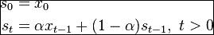
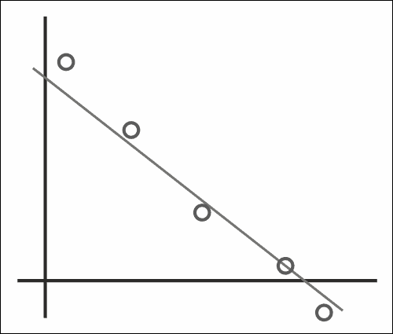
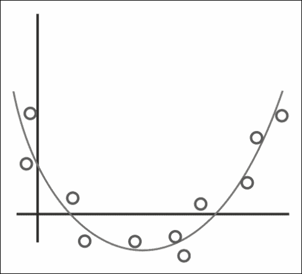
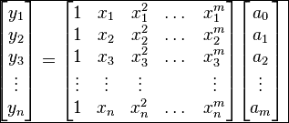
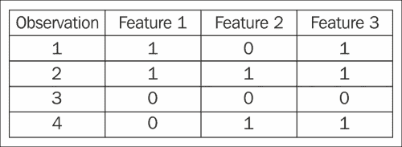
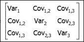
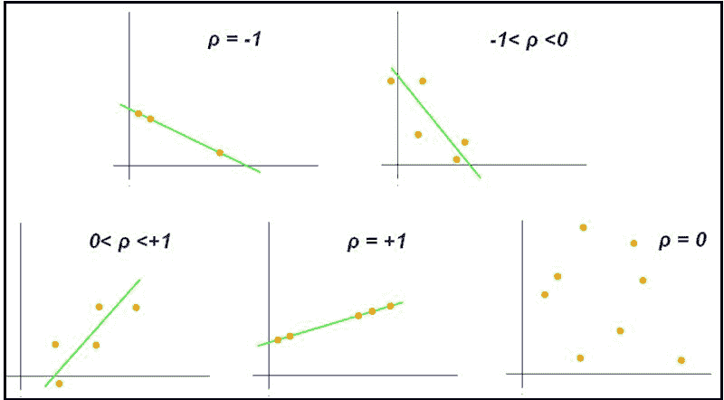
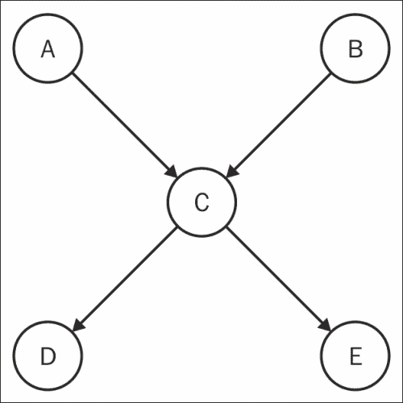
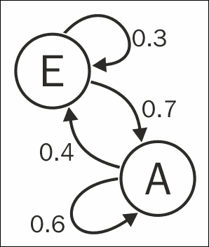
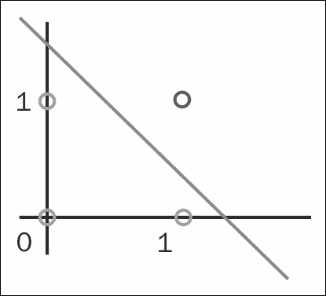

# 第七章 统计与分析

分析大数据的一个核心动机是寻找内在的模式。本章包含了可以回答关于数据偏离常态、线性与二次趋势的存在，以及网络的概率值等问题的配方。通过以下配方，可以揭示一些最具魅力的结果：

+   计算移动平均

+   计算移动中位数

+   逼近线性回归

+   逼近二次回归

+   从样本中获得协方差矩阵

+   查找列表中的所有唯一配对

+   使用皮尔逊相关系数

+   评估贝叶斯网络

+   创建一个扑克牌的数据结构

+   使用马尔科夫链生成文本

+   从列表中创建 *n*-gram

+   构建神经网络感知

# 介绍


前两个配方处理的是总结一系列数据。例如，假设有人问：“每个人的年龄是多少？”一个有效的回答可能是列举每个人的年龄，但根据人数的不同，如果人数多，这可能需要几分钟甚至几小时。相反，我们可以通过平均值或中位数来回答，将所有年龄值总结为一个简单的数字。

接下来的两个配方是关于逼近最能拟合一组点的方程。给定两组坐标，我们可以使用线性或二次逼近来预测其他点。

我们可以通过协方差矩阵和皮尔逊相关性计算来检测数值数据之间的关系，正如在相应的配方中展示的那样。

`Numeric.Probability.Distribution` 库包含许多有用的函数，能够帮助深入理解统计学，正如在贝叶斯网络和扑克牌配方中所展示的那样。

我们还将使用马尔科夫链和 *n*-gram 以获得更多有趣的结果。

最后，我们将从零开始创建一个神经网络，来学习一个带标签的数据集。

# 计算移动平均

将一系列数字总结成一个代表性数字可以通过计算平均值来完成。算术平均数的公式是将所有数值相加，再除以数值的个数。然而，如果所加的数值极其庞大，最终的总和可能会溢出。

在 Haskell 中，`Int` 的范围至少是从 *-2²⁹* 到 *2²⁹-1*。实现可以允许具有更大范围的 `Int` 类型。如果我们尝试通过先计算它们的总和来天真地计算 *2²⁹-2* 和 *2²⁹-3* 的平均值，总和可能会溢出，从而导致平均值的计算错误。

移动平均（或滚动平均）试图避免这一缺陷。我们将使用指数平滑策略，这意味着之前看到的数字对当前移动均值的贡献将以指数方式递减。指数移动平均对最近的数据反应更快。它可以用于检测价格波动或在神经网络中激活神经元。

移动平均的公式如下，其中**α**是平滑常数，**s[t]**是时刻*t*的移动平均值，*x*是原始数据的值：



## 准备工作

创建一个`input.txt`文件，里面是由换行符分隔的数字列表。我们将对这些数字计算移动平均值：

```py
$ cat input.txt

4
3
2
5
3
4
1
3
12
3

```

## 如何实现……

1.  创建一个辅助函数将原始文本输入转换为`Double`类型的列表，如下所示：

    ```py
    clean raw = map (\s -> read s :: Double) (lines raw)
    ```

1.  使用指数平滑技术计算数字列表的移动平均值。我们将平滑常数`a`硬编码为`0.95`，如这里所示：

    ```py
    avg :: [Double] -> Double
    avg (x:xs) = a*x + (1-a)*(avg xs)
    where a = 0.95
    avg [] = 0
    ```

1.  计算真实的算术平均值，以比较差异：

    ```py
    mean xs = (sum xs) / (fromIntegral (length xs))
    ```

1.  输出计算移动平均和算术平均的结果，看看它们的值虽然不相等，但非常接近：

    ```py
    main = do
    rawInput <- readFile "input.txt"
    let input = clean rawInput
    print input
    putStrLn $  "mean is " ++ (show.mean) input
    putStrLn $  "moving average is " ++ (show.avg) input
    ```

1.  我们将看到以下输出：

    ```py
    $ runhaskell Main.hs

    [4.0,3.0,2.0,5.0,3.0,4.0,1.0,3.0,12.0,3.0]
    mean is 4.0
    moving average is 3.9478627675211913
    ```

## 还有更多……

平滑常数应该根据数据的波动来调整。较小的平滑常数能更好地记住先前的值，并产生受数据总体结构影响的平均值。另一方面，较大的平滑常数则更加关注最新的数据，并容易忘记过时的数据。如果我们希望平均值更敏感于新数据，就应使用较大的平滑常数。

## 另见

总结数字列表的另一种方式可以参考*计算移动中位数*的做法。

# 计算移动中位数

数字列表的中位数有相等数量的值小于和大于它。计算中位数的朴素方法是简单地对列表排序并选取中间的数字。然而，在一个非常大的数据集上，这样的计算会效率低下。

另一种寻找移动中位数的方法是使用**最小堆**和**最大堆**的组合，在遍历数据时对值进行排序。我们可以将数字插入到任何一个堆中，并且在需要时，可以通过调整堆的大小使其保持相等或接近相等，从而计算中位数。当堆的大小相等时，找到中间的数字就很简单，这就是中位数。

## 准备工作

创建一个包含一些数字的文件`input.txt`：

```py
$ cat input.txt

3
4
2
5
6
4
2
6
4
1

```

使用 Cabal 安装一个处理堆的库，方法如下：

```py
$ cabal install heap

```

## 如何实现……

1.  导入堆数据结构：

    ```py
    import Data.Heap
    import Data.Maybe (fromJust)
    ```

1.  将原始输入转换为如下所示的数字列表：

    ```py
    clean raw = map (\s -> read s :: Int) (lines raw)
    ```

1.  将列表中的数字划分到适当的堆中。将小的数字放入最大堆，将大的数字放入最小堆，代码示例如下：

    ```py
    median (x:xs) maxheap minheap = case viewHead maxheap of
      Just theMax  -> if x < theMax
                 then median xs (insert x maxheap) minheap
                 else median xs maxheap (insert x minheap)
      Nothing -> median xs (insert x maxheap) minheap
    ```

1.  当没有更多数字可以读取时，开始操作堆直到两者大小相等。中位数将是两个堆中数值之间的数字，代码示例如下：

    ```py
    median [] maxheap minheap
      | size maxheap + 1 < size minheap = 
                     median [] (insert minelem maxheap) $ 
           (snd.fromJust.view) minheap
      | size minheap + 1 < size maxheap = 
                  median [] ((snd.fromJust.view) maxheap) $ 
                  insert maxelem minheap
      | size maxheap == size minheap = 
        (fromIntegral maxelem + fromIntegral minelem)/2.0
      | size maxheap > size minheap = fromIntegral maxelem
      | otherwise = fromIntegral minelem
      where maxelem = fromJust (viewHead maxheap)
            minelem = fromJust (viewHead minheap)
    ```

1.  测试`main`中的代码，如下所示：

    ```py
    main = do
      rawInput <- readFile "input.txt"
      let input = clean rawInput
     print $ input
    print $ median input 
           (empty :: MaxHeap Int) (empty :: MinHeap Int)
    ```

1.  输出如下：

    ```py
    $ runhaskell Main.hs

    [3,4,2,5,6,4,2,6,4,1]
    4.0

    ```

## 它是如何工作的……

首先，我们遍历数字列表，构建一个最小堆和最大堆，以有效地分离流入的数字。然后，我们在最小堆和最大堆之间移动值，直到它们的大小差异不超过一个项目。中位数是额外的项目，或者是最小堆和最大堆值的平均值。

## 另见

若要以不同方式总结一组数字，请参考*计算移动平均*的配方。

# 近似线性回归

给定一组点，我们可以使用一个方便的库`Statistics.LinearRegression`来估算最佳拟合线。

它计算点之间的最小二乘差异来估算最佳拟合线。以下图显示了点的线性回归示例：



使用线性回归通过五个点绘制最佳拟合线

## 准备工作

使用 cabal 安装相应的库，如下所示：

```py
$ cabal install statistics-linreg

```

## 如何实现……

1.  导入以下包：

    ```py
    import Statistics.LinearRegression
    import qualified Data.Vector.Unboxed as U
    ```

1.  从它们的坐标创建一系列点，并将其传递给`linearRegression`函数，如以下代码片段所示：

    ```py
    main = do
      let xs =
        U.fromList [1.0, 2.0, 3.0, 4.0, 5.0] :: U.Vector Double
      let ys = 
        U.fromList [1.0, 2.0, 1.3, 3.75, 2.25]::U.Vector Double

      let (b, m) = linearRegression xs ys

      print $ concat ["y = ", show m, " x + ", show b]
    ```

1.  结果线性方程如下：

    ```py
    $ runhaskell Main.hs

    "y = 0.425 x + 0.785"

    ```

## 它是如何工作的……

我们可以查找`Statistics.LinearRegression`库中的`linearRegression`函数的源代码，网址为：[`hackage.haskell.org/package/statistics-linreg-0.2.4/docs/Statistics-LinearRegression.html`](http://hackage.haskell.org/package/statistics-linreg-0.2.4/docs/Statistics-LinearRegression.html)。

维基百科关于最小二乘近似的文章（[`en.wikipedia.org/wiki/Linear_least_squares_(mathematics)`](http://en.wikipedia.org/wiki/Linear_least_squares_(mathematics)))写得最好：

> *“解决这个问题的最小二乘法是尽可能使右侧和左侧方程之间的“误差”平方和最小，也就是找到该函数的最小值”*

核心计算涉及寻找两个随机变量的均值和方差，以及它们之间的协方差。算法背后的详细数学原理可以在[`www.dspcsp.com/pubs/euclreg.pdf`](http://www.dspcsp.com/pubs/euclreg.pdf)中找到。

如果我们查看库的源代码，我们可以发现其中的基本方程：

*α = µY - β * µX*

*β = covar(X,Y)/σ²X*

*f(x) = βx + α*

## 另见

如果数据不符合线性趋势，请尝试*近似二次回归*的配方。

# 近似二次回归

给定一组点，本配方将尝试找到最佳拟合的二次方程。在下图中，曲线是这些点的最佳拟合二次回归：



## 准备工作

安装`dsp`包以使用`Matrix.LU`，如下所示：

```py
$ cabal install dsp

```

为了执行二次回归，我们将使用 Wolfram MathWorld 上描述的最小二乘多项式拟合算法，详见[`mathworld.wolfram.com/LeastSquaresFittingPolynomial.html`](http://mathworld.wolfram.com/LeastSquaresFittingPolynomial.html)。

## 怎么做…

1.  导入以下包：

    ```py
    import Data.Array (listArray, elems)
    import Matrix.LU (solve)
    ```

1.  实现二次回归算法，如下面的代码片段所示：

    ```py
    fit d vals = elems $ solve mat vec  
    where mat = listArray ((1,1), (d,d)) $ matrixArray
       vec = listArray (1,d) $ take d vals
       matrixArray = concat [ polys x d 
                                    | x <- [0..fromIntegral (d-1)]]
             polys x d = map (x**) [0..fromIntegral (d-1)]
    ```

1.  测试函数如下，使用一些**硬编码**数据：

    ```py
    main = print $ fit 3 [1,6,17,34,57,86,121,162,209,262,321]
    ```

1.  三次方程式*3x² + 2x + 1*的以下值被打印：

    ```py
     $ runhaskell Main.hs

     [1.0,2.0,3.0]

    ```

## 工作原理…

在这个示例中，设计矩阵`mat`与我们希望找到的参数向量相乘，产生响应向量`vec`。我们可以用以下方程式可视化每个数组和矩阵：



构建设计矩阵和响应向量后，我们使用`dsp`库解决这个矩阵方程，并获得我们多项式的系数列表。

## 另请参见

如果数据遵循线性趋势，请参考*逼近线性回归*示例。

# 从样本获取协方差矩阵

协方差矩阵是一个对称的方阵，其第*i*行和第*j*列的元素对应它们之间的相关性。更具体地说，每个元素都是其行和列所代表的变量的协方差。同向运动的变量具有正协方差，而反向运动的变量具有负协方差。

假设我们有三个变量的四组数据，如下表所示：



注意**特征 1**和**特征 3**在模式上看起来相似，然而**特征 1**和**特征 2**似乎不相关。同样，**特征 2**和**特征 3**显著相关。

协方差矩阵将是一个 3 x 3 对称矩阵，其元素如下：



## 准备工作

使用以下命令在 cabal 中安装`hstats`库：

```py
$ cabal install hstats

```

或者，通过以下步骤安装该包：

1.  从[`hackage.haskell.org/package/hstats-0.3/hstats-0.3.tar.gz`](http://hackage.haskell.org/package/hstats-0.3/hstats-0.3.tar.gz)下载包的源代码。

1.  从 cabal 文件`hstats.cabal`中删除`haskell98`依赖项。

1.  在同一个目录下，运行以下命令行：

    ```py
    $ cabal install

    ```

## 怎么做…

1.  如下所示导入`hstats`包：

    ```py
    import Math.Statistics
    ```

1.  根据列表列表创建矩阵，并在其中使用以下代码片段运行`covMatrix`函数：

    ```py
    main = do print $ covMatrix matrixArray
      where matrixArray = [ [1,1,0,0] 
                          , [0,1,0,1] 
                          , [1,1,0,1] ]
    ```

1.  检查输出：

    ```py
    $ runhaskell Main.hs

    [ [ 0.333, 0.000, 0.167]
    , [ 0.000, 0.333, 0.167]
    , [ 0.167, 0.167, 0.250] ]

    ```

注意无关的特征值为零，正如我们预期的那样。

# 在列表中查找所有唯一的配对

比较所有项目对是数据分析中的常见习惯用法。本食谱将介绍如何从一个元素列表中创建一个元素对列表。例如，如果有一个列表 [1, 2, 3]，我们将创建一个所有可能配对的列表 [(1, 2), (1, 3), (2, 3)]。

注意配对的顺序无关紧要。我们将创建一个独特的元组对列表，以便将列表中的每个项目与其他所有项目进行比较。

## 它是如何工作的……

创建一个新文件，我们称之为 `Main.hs`，并插入以下步骤中解释的代码：

1.  导入以下包：

    ```py
    import Data.List (tails, nub, sort)
    ```

1.  从一个项目列表中构造所有独特的配对，方法如下：

    ```py
    pairs xs = [(x, y) | (x:ys) <- tails (nub xs), y <- ys]
    ```

1.  打印出以下列表的所有独特配对：

    ```py
    main = print $ pairs [1,2,3,3,4]
    ```

1.  输出将如下所示：

    ```py
    [(1,2),(1,3),(1,4),(2,3),(2,4),(3,4)]

    ```

## 另见

我们可以将 `pairs` 算法应用于*使用皮尔逊相关系数*这个食谱。

# 使用皮尔逊相关系数

皮尔逊相关系数是一个介于 -1.0 和 1.0 之间的数字，表示两个数值序列的线性关系。值为 1.0 表示强线性相关，-1.0 表示强负相关，0.0 表示这两个序列不相关。

Kiatdd 在[`en.wikipedia.org/wiki/File:Correlation_coefficient.gif`](http://en.wikipedia.org/wiki/File:Correlation_coefficient.gif)上创建了一幅非常有信息量的图表，下面是该图：



例如，Nick 是一个相当慷慨的电影评论家，总是给电影打高分。他的朋友 John 可能是一个更为戏剧化的评论家，提供更广泛的评分，但这两个朋友通常总是能在喜欢的电影上达成一致。

我们可以使用皮尔逊相关系数来检测这两个人评分之间有很强的线性关系。

## 准备工作

使用 cabal 安装 `hstats` 库，方法如下：

```py
$ cabal install hstats

```

创建一个文件，每行包含五个星级评分，表示不同人给出的评分。

在我们的示例中，三个人每人给出了五个评分，使用以下命令：

```py
$ cat ratings.csv
4,5,4,4,3
2,5,4,3,1
5,5,5,5,5

```

注意前两个人的评分趋势相似，但第三个人的评分趋势非常不同。本食谱中的算法将计算皮尔逊相关系数的成对值，并对结果进行排序，以找到评分最相似的两个人。

## 如何操作…

1.  导入以下包：

    ```py
    import Math.Statistics (pearson)
    import Text.CSV
    import Data.List (tails, nub, sort)
    ```

1.  创建以下函数，以计算从列表中获得的相似度：

    ```py
    calcSimilarities (Left err) = error "error parsing"
    calcSimilarities (Right csv) = head $ reverse $ sort $ zip 
      [ pearson (convertList a) (convertList b) 
      | (a,b) <- pairs csv]
      $ (pairs csv)
    ```

1.  将`String`列表转换为`Double`列表，方法如下：

    ```py
    convertList :: [String] -> [Double]

    convertList = map read
    ```

1.  从项目列表中创建所有可能的配对，方法如下：

    ```py
    pairs xs = [(x, y) | (x:ys) <- tails (nub xs), y <- ys]
    ```

1.  通过查找评分最相似的两个人来测试代码，如以下代码片段所示：

    ```py
    main = do
      let fileName = "ratings.csv"
      input <- readFile filename

      let csv = parseCSV fileName input

      print $ calcSimilarities csv
    ```

1.  输出将如下所示：

    ```py
    $ runhaskell Main.hs

    (0.89442719909999159,(["4","5","4","4","3"],["2","5","4","3","1"]))

    ```

# 评估贝叶斯网络

贝叶斯网络是一个概率依赖图。图中的节点是事件，边表示条件依赖。我们可以通过先验知识构建一个网络，从而发现事件的新概率特性。

我们将使用 Haskell 的概率函数式编程库来评估此类网络并计算有趣的概率。

## 准备工作

使用 cabal 安装`probability`库，如下所示：

```py
$ cabal install probability

```

我们将表示以下网络。请将以下图形内化，以直观地理解变量名称：



事件**C**依赖于事件**A**和**B**。同时，事件**D**和**E**依赖于事件**C**。通过概率函数式编程库的强大功能，在这个示例中，我们将找到仅根据事件**D**的信息，计算事件**E**的概率。

## 如何进行…

1.  导入以下包：

    ```py
    import qualified Numeric.Probability.Distribution as Dist
    import Numeric.Probability.Distribution ((??), (?=<<), )
    ```

1.  创建一个辅助函数来定义条件概率，如下所示：

    ```py
    prob p = Dist.choose p True False
    ```

1.  定义变量 A 的概率，P(A)如下：

    ```py
    a :: Dist.T Rational Bool
    a = prob 0.2
    ```

1.  定义变量 B 的概率，P(B)如下：

    ```py
    b :: Dist.T Rational Bool
    b = prob 0.05
    ```

1.  定义给定 A 和 B 的情况下 C 的概率，P(C | AB)如下：

    ```py
    c :: Bool -> Bool -> Dist.T Rational Bool
    c False False = prob 0.9
    c False True = prob 0.5
    c True False = prob 0.3
    c True True = prob 0.1
    ```

1.  定义在给定 C 的情况下 D 的概率，P(D | C)如下：

    ```py
    d :: Bool -> Dist.T Rational Bool
    d False = prob 0.1
    d True = prob 0.4
    ```

1.  定义在给定 C 的情况下 E 的概率，P(E | C)如下：

    ```py
    e :: Bool -> Dist.T Rational Bool
    e False = prob 0.5
    e True = prob 0.2
    ```

1.  定义网络的数据结构，如下所示：

    ```py
    data Network = N {aVal :: Bool
    , bVal :: Bool
    , cVal :: Bool
    , dVal :: Bool
    , eVal :: Bool }
    deriving (Eq, Ord, Show)
    ```

1.  根据前面的图形构建网络：

    ```py
    bNetwork :: Dist.T Rational Network
    bNetwork = do a' <- a
                  b' <- b
                  c' <- c a' b'
                  d' <- d c'
                  e' <- e c'
                  return (N a' b' c' d' e')
    ```

1.  计算在给定 D 的情况下 E 的概率，P(E | D)如下：

    ```py
    main = print $ eVal ?? dVal ?=<< bNetwork
    ```

1.  输出以分数表示如下：

    ```py
    $ runhaskell Main.hs

    3643 % 16430

    ```

# 创建扑克牌的数据结构

许多概率和统计问题都是通过扑克牌提出的。在这个示例中，我们将创建一个数据结构和有用的函数来处理扑克牌。

标准扑克牌共有 52 张，每张卡牌都有以下四种花色之一：

+   黑桃

+   红桃

+   方块

+   梅花

此外，每张卡牌都有 13 个等级中的一个，如下所示：

+   整数范围从 2 到 10（包括 2 和 10）

+   J（杰克）

+   Q（皇后）

+   K（国王）

+   A（王牌）

## 准备工作

使用 cabal 安装`probability`库，如下所示：

```py
$ cabal install probability

```

查看关于集合的`probability`包的示例代码，网址：[`hackage.haskell.org/package/probability-0.2.4/docs/src/Numeric-Probability-Example-Collection.html`](http://hackage.haskell.org/package/probability-0.2.4/docs/src/Numeric-Probability-Example-Collection.html)。

本示例 heavily 基于链接中的概率示例。

## 如何进行…

1.  导入以下包：

    ```py
    import qualified Numeric.Probability.Distribution as Dist
    import Numeric.Probability.Distribution ((??))
    import Control.Monad.Trans.State (StateT(StateT, runStateT), evalStateT)
    import Control.Monad (replicateM)
    import Data.List (delete)
    ```

1.  创建卡牌花色的数据结构，如下所示：

    ```py
    data Suit = Club | Spade | Heart | Diamond
      deriving (Eq,Ord,Show,Enum)
    ```

1.  创建一副牌的等级数据结构，如下所示：

    ```py
    data Rank = Plain Int | Jack | Queen | King | Ace
      deriving (Eq,Ord,Show)
    ```

1.  定义一个快捷类型，将卡牌表示为等级和花色的元组，如下所示：

    ```py
    type Card = (Rank,Suit)
    ```

1.  如下描述普通牌：

    ```py
    plains :: [Rank]
    plains = map Plain [2..10]
    ```

1.  如下描述面牌：

    ```py
    faces :: [Rank]
    faces = [Jack,Queen,King,Ace]
    ```

1.  创建一个辅助函数，如下所示，用于检测是否是面牌：

    ```py
    isFace :: Card -> Bool
    isFace (r,_) = r `elem` faces
    ```

1.  创建一个辅助函数，如下所示，用于检测是否是普通牌：

    ```py
    isPlain :: Card -> Bool
    isPlain (r,_) = r `elem` plains
    ```

1.  定义所有等级牌如下：

    ```py
    ranks :: [Rank]
    ranks = plains ++ faces
    ```

1.  定义花色牌如下：

    ```py
    suits :: [Suit]
    suits = [Club, Spade, Heart, Diamond]
    ```

1.  根据等级和花色创建一副扑克牌，如下所示：

    ```py
    deck :: [Card]
    deck = [ (r,s) | r <- ranks, s <- suits ]
    ```

1.  创建一个帮助函数如下以选择列表中的项目进行概率测量：

    ```py
    selectOne :: (Fractional prob, Eq a) =>
       StateT ([a]) (Dist.T prob) a
    selectOne =
       StateT $ Dist.uniform . removeEach
    ```

1.  创建一个函数如下以从牌组中选择一些卡片：

    ```py
    select :: (Fractional prob, Eq a) => Int -> [a] -> Dist.T prob [a]
    select n = evalStateT (replicateM n selectOne)
    ```

1.  创建一个帮助函数如下，以从列表中移除每个项目：

    ```py
    removeEach xs = zip xs (map (flip delete xs) xs)
    ```

1.  使用创建的概率函数测试卡牌组如下：

    ```py
    main = print $ 
    Dist.just [(Plain 3, Heart), (Plain 3, Diamond)] ?? select 2 deck
    ```

1.  从牌组选择这两张牌的概率如下：

    ```py
    3.770739064856712e-4

    ```

# 使用马尔可夫链生成文本

马尔可夫链是一个系统，根据当前条件预测系统未来的结果。我们可以在数据语料库上训练马尔可夫链，通过跟随状态生成新的文本。

链的图形表示如下图所示：



节点 E 以 70%的概率结束在节点 A，并以 30%的概率保持不变

## 准备好

使用 cabal 安装`markov-chain`库如下：

```py
$ cabal install markov-chain

```

下载一个大语料库的文本，并命名为`big.txt`。在这个示例中，我们将使用从[`norvig.com/big.txt`](http://norvig.com/big.txt)下载的文本。

## 如何做…

1.  导入以下包：

    ```py
    import Data.MarkovChain
    import System.Random (mkStdGen)
    ```

1.  在大文本输入上训练马尔可夫链，然后按以下方式运行它：

    ```py
    main = do
    rawText <- readFile "big.txt"
    let g = mkStdGen 100
    putStrLn $ "Character by character: \n"
    putStrLn $ take 100 $ run 3 rawText 0 g
    putStrLn $ "\nWord by word: \n"
    putStrLn $ unwords $ take 100 $ run 2 (words rawText)0 g
    ```

1.  我们可以运行马尔可夫链并查看输出如下：

    ```py
    $ runhaskell Main.hs

    Generated character by character: 

    The evaturn bring everice Ana Paciously skuling from to was
    fing, of rant of and sway.

    5\. Whendent 

    Generated word by word: 

    The Project gratefully accepts contributions of money, though there was a brief word, showing that he would do so. He could hear all that she had to reply; the room scanned Princess Mary's heartbeat so violently at this age, so dangerous to life, by the friends of the Russians, was trying to free his serfs--and that till the eggs mature, when by their Creator with certain small vessels but no me...." And the cavalry, Colonel, but I don't wish to know which it has a fit, and there was a very large measure, attributed to eating this root. But

    ```

## 它是如何工作的…

代码打印我们由语料库训练的文本，该文本被馈送到马尔可夫链中。

在第一个字符级马尔可夫链中，它试图根据前三个字母生成下一个字母。请注意，大多数短语毫无意义，甚至有些标记不是英语单词。

第二个马尔可夫链是逐词生成的，只基于前两个词进行推断。正如我们所见，它更自然地模拟了英语短语。

这些文本纯粹通过评估概率生成。

# 从列表创建 n-gram

*n*-gram 是连续*n*个项目的序列。例如，在以下数字序列[1, 2, 5, 3, 2]中，一个可能的 3-gram 是[5, 3, 2]。

*n*-gram 在计算概率表以预测下一个项目时非常有用。在这个示例中，我们将从项目列表中创建所有可能的*n*-gram。马尔可夫链可以通过这个示例中的*n*-gram 计算轻松训练。

## 如何做…

1.  定义*n*-gram 函数如下以从列表生成所有可能的*n*-gram：

    ```py
    ngram :: Int -> [a] -> [[a]]
    ngram n xs 
      | n <= length xs = take n xs : ngram n (drop 1 xs)
      | otherwise = []
    ```

1.  在样本列表上测试如下：

    ```py
    main = print $ ngram 3 "hello world"
    ```

1.  打印的 3-gram 如下：

    ```py
    ["hel","ell","llo","lo ","o w"," wo","wor","orl","rld"]

    ```

# 创建一个神经网络感知器

感知器是一个线性分类器，使用标记数据收敛到其答案。给定一组输入及其相应的预期输出，感知器试图线性分离输入值。如果输入不是线性可分的，则算法可能不会收敛。

在这个示例中，我们将处理以下数据列表：

[(0,0), (0,1), (1,0), (1,1)].

每个项目都标有预期输出如下：

+   `(0,0)`预期输出`0`

+   `(0,1)`预期输出`0`

+   `(1,0)`预期输出`0`

+   `(1,1)`期望输出`1`

从图形上看，我们试图找到一条能够分离这些点的线：



## 准备就绪

通过以下方式回顾感知器的概念：

+   阅读关于感知器的维基百科文章，网址为[`en.wikipedia.org/wiki/Perceptron`](http://en.wikipedia.org/wiki/Perceptron)

+   浏览 Moresmau 提供的 Haskell 实现，网址为[`jpmoresmau.blogspot.com/2007/05/perceptron-in-haskell.html`](http://jpmoresmau.blogspot.com/2007/05/perceptron-in-haskell.html)

## 如何做到…

1.  导入`replicateM`、`randomR`和`getStdRandom`来处理神经网络中的随机数生成，如下所示：

    ```py
    import Control.Monad (replicateM)
    import System.Random (randomR, getStdRandom)
    ```

1.  定义类型来帮助描述传入每个辅助方法的变量，如下所示：

    ```py
    type Inputs = [Float]
    type Weights = [Float]
    type Threshold = Float
    type Output = Float
    type Expected = Float
    type Actual = Float
    type Delta = Float
    type Interval = Int
    type Step = (Weights, Interval)
    ```

1.  创建一个函数来生成神经元的输出值，该函数接受一系列输入、相应的权重和一个阈值。如果权重向量与输入向量的点积大于阈值，则神经元触发输出`1`，否则输出`0`，如以下代码片段所示：

    ```py
    output :: Inputs -> Weights -> Threshold -> Output
    output xs ws t 
      | (dot xs ws) > t = 1
      | otherwise = 0
      where dot as bs = sum $ zipWith (*) as bs
    ```

1.  创建一个函数，根据期望结果和实际结果调整神经元的权重。权重使用学习规则进行更新，如以下代码片段所示：

    ```py
    adjustWeights :: Inputs -> Weights -> Expected -> Actual -> Weights
    adjustWeights xs ws ex ac = add ws delta
      where delta = map (err * learningRate *) xs
            add = zipWith (+)
            err = ex - ac
            learningRate = 0.1
    ```

1.  步进一次感知器循环来更新权重，如下所示。对于这个示例，假设每个神经元的阈值为 0.2：

    ```py
    step :: Inputs -> Weights -> Expected -> Weights
    step xs ws ex = adjustWeights xs ws ex (output xs ws t)
      where t = 0.2
    ```

1.  创建一个辅助函数如下，计算每步的权重变化：

    ```py
    epoch :: [(Inputs, Expected)] -> Weights -> (Weights, Delta)
    epoch inputs ws = (newWeights, delta)
      where newWeights = foldl 
        (\acc (xs, ex) -> step xs acc ex) ws inputs
        delta = (sum (absSub newWeights ws)) / length' ws
        absSub as bs = map abs $ zipWith (-) as bs
        length' = fromIntegral . length
    ```

1.  运行`epoch`步骤，直到权重收敛。权重收敛通过注意到权重首次不再显著变化来检测。这在以下代码片段中有所展示：

    ```py
    run :: [(Inputs, Expected)] -> Weights -> Interval -> Step
    run inputs ws n
      | delta == 0.0 = (newWeights, n)
      | otherwise = run inputs newWeights (n+1)
      where (newWeights, delta) = epoch inputs ws
    ```

1.  初始化权重向量，如下所示：

    ```py
    initialWeights :: Int -> IO [Float]
    initialWeights nb = do
      let interval = randomR (-0.5,0.5)
      (replicateM nb (getStdRandom interval))        
    ```

1.  测试感知器网络以分离一个与运算的布尔结构，如下所示：

    ```py
    main :: IO ()
    main = do
      w <- initialWeights 2
      let (ws,i) = run [ ([0,0],0)
                       , ([0,1],0)
                       , ([1,0],0)
                       , ([1,1],1) ] w 1
      print (ws,i)
    ```

1.  有效的输出可能是：

    ```py
    ([0.17867908,3.5879448e-1],8)

    ```

我们可以验证该输出是正确的，因为权重的总和大于阈值 0.2，而每个权重值本身都小于 0.2。因此，输出将仅在输入为(1, 1)时触发，正如所期望的那样。
