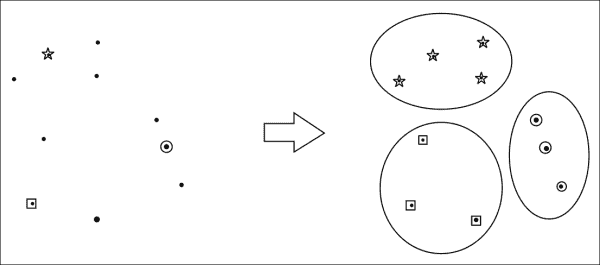
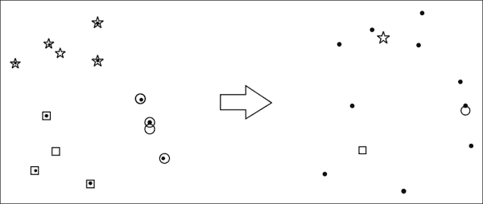
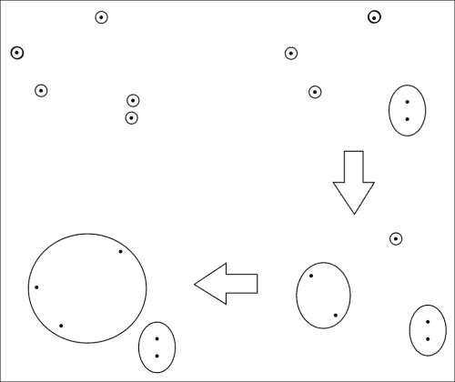
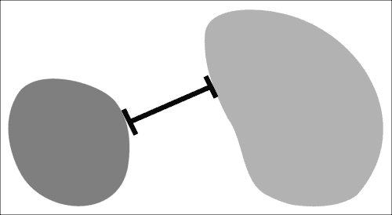
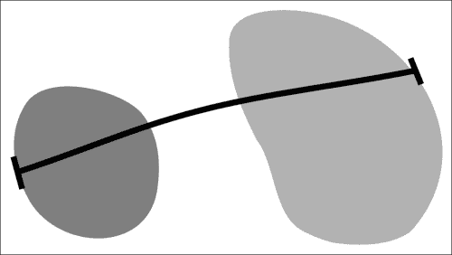
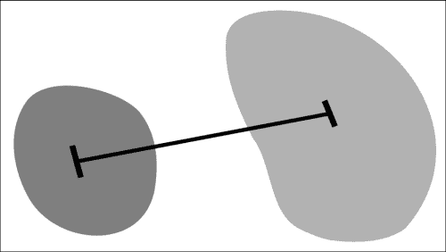
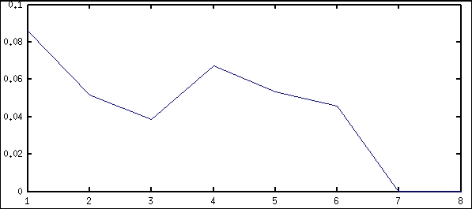
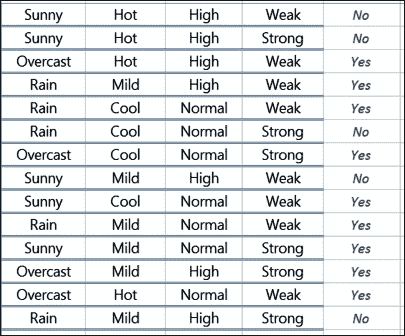
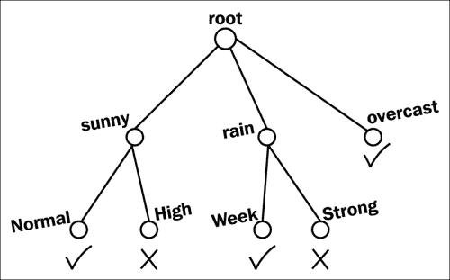
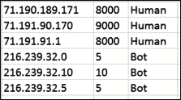

# 第八章 聚类与分类

本章展示了智能地聚类和分类数据的算法：

+   实现 k-means 聚类算法

+   实现层次聚类

+   使用层次聚类库

+   寻找聚类的数量

+   按词根对单词进行聚类

+   对词汇进行词性分类

+   在文本语料库中识别关键字

+   训练一个词性标注器

+   实现决策树分类器

+   实现 k-最近邻分类器

+   使用 Graphics.EasyPlot 可视化数据点

# 介绍


计算机算法在分析大型数据集方面变得越来越优秀。随着性能的提升，它们检测数据中有趣模式的能力也在增强。

本章前几个算法展示了如何查看成千上万的数据点并识别聚类。**聚类**只是通过数据点之间的紧密程度来定义的一个集合。这个“紧密度”的度量完全由我们决定。其中一种最常用的紧密度度量是欧几里得距离。

我们可以通过仰望夜空并指向看似聚集在一起的星星来理解聚类。我们的祖先发现将星星“聚集”命名为星座很方便。我们将会在数据点的“天空”中找到属于自己的星座。

本章还重点介绍了词汇的分类。我们将根据词语的词性以及主题为其标注标签。

我们将实现自己的决策树来分类实际数据。最后，我们将使用绘图库可视化聚类和数据点。

# 实现 k-means 聚类算法

k-means 聚类算法将数据划分为 k 个不同的组。这些 k 个组叫做聚类，而这些聚类的位置是通过迭代调整的。我们计算组内所有点的算术平均值，以获得一个质心点，并用它替代之前的聚类位置。

希望通过这个简明的解释，*k-means 聚类*这个名字不再听起来完全陌生。了解更多关于该算法的最佳途径之一是在 Coursera 上：[`class.coursera.org/ml-003/lecture/78`](https://class.coursera.org/ml-003/lecture/78)。

## 如何做到这一点……

创建一个新文件，命名为`Main.hs`，并执行以下步骤：

1.  导入以下内置库：

    ```py
    import Data.Map (Map)
    import qualified Data.Map as Map
    import Data.List (minimumBy, sort, transpose)
    import Data.Ord (comparing)
    ```

1.  定义如下所示的点的类型同义词：

    ```py
    type Point = [Double] 
    ```

1.  定义两点之间的欧几里得距离函数：

    ```py
    dist :: Point -> Point -> Double

    dist a b = sqrt $ sum $ map (²) $ zipWith (-) a b
    ```

1.  定义 k-means 算法中的分配步骤。每个点将被分配到其最接近的质心：

    ```py
    assign :: [Point] -> [Point] -> Map Point [Point]

    assign centroids points = 
      Map.fromListWith (++) [(assignPoint p, [p]) | p<- points]

      where assignPoint p = 
        minimumBy (comparing (dist p)) centroids
    ```

1.  定义 k-means 算法中的重新定位步骤。每个质心都被重新定位到其对应点的算术平均值：

    ```py
    relocate :: Map Point [Point] -> Map Point [Point]

    relocate centroidsMap = 
      Map.foldWithKey insertCenter Map.empty centroidsMap
      where insertCenter _ ps m = Map.insert (center ps) ps m
            center [] = [0,0]
            center ps = map average (transpose ps)
            average xs = sum xs / fromIntegral (length xs)
    ```

1.  反复运行 k-means 算法，直到质心不再移动：

    ```py
    kmeans :: [Point] -> [Point] -> [Point]

    kmeans centroids points = 
    if converged 
    then centroids 
    else kmeans (Map.keys newCentroidsMap) points

    where converged = 
            all (< 0.00001) $ zipWith dist 
                 (sort centroids) (Map.keys newCentroidsMap)

          newCentroidsMap = 
            relocate (assign centroids points)

          equal a b = dist a b < 0.00001 
    ```

1.  通过几个硬编码点测试聚类。实现 k-means 的通常方法是随机选择起始质心。但是，在这个例子中，我们将简单地采用前 k 个点：

    ```py
    main = do
    let points = [ [0,0], [1,0], [0,1], [1,1]
                 , [7,5], [9,6], [8,7] ]
    let centroids = kmeans (take 2 points) points
    print centroids 
    ```

1.  当算法收敛后，最终的质心将如下所示：

    ```py
    $ runhaskell Main.hs

    [[0.5,0.5],[8.0,6.0]]

    ```

## 工作原理…

该算法重复执行两个过程，直到找到聚类。第一个过程是通过将每个点分配到其最近的质心来分区点。下面的图表显示了数据分配步骤。最初有三个由星号、正方形和圆圈表示的质心，围绕三个不同的点。算法的第一部分将每个点分配到相应的质心。



接下来的步骤是将质心重新定位到它们对应点的中心或算术平均值。在下面的图表中，计算了每个聚类的算术平均值，并将质心移至新的中心：



此算法持续进行，直到质心不再移动。每个点的最终分类是其所属的聚类。

## 还有更多…

尽管易于实现和理解，但是这种算法有几个局限性。k-means 聚类算法的输出对选择的初始质心敏感。此外，使用欧氏距离度量迫使聚类仅通过圆形区域描述。k-means 聚类的另一个局限是用户必须指定初始聚类数 k。用户应该可视化数据并根据自己的判断确定算法开始前的聚类数量。此外，算法的收敛条件对于特殊边界情况是一个问题。

## 另请参见

对于另一种类型的聚类算法，请参阅下一个关于*实现分层聚类*的章节。

# 实现分层聚类

另一种聚类数据的方法是首先假设每个数据项是其自身的一个独立聚类。然后，我们可以退一步，合并两个最近的聚类。这个过程形成了一个聚类的层次结构。

举个例子，可以类比于岛屿和水平面的类比。岛屿仅仅是被水包围的山顶。想象一下我们在海洋中散布着岛屿。如果我们慢慢降低海洋水位，两个附近的小岛屿将会合并成一个更大的岛屿，因为它们与同一山脉连接。我们可以在得到所需数量的较大岛屿时停止水位的下降。

## 如何做…

在一个新文件中，我们命名为`Main.hs`，插入以下代码：

1.  导入内置函数：

    ```py
    import Data.Map (Map, (!), delete)
    import qualified Data.Map as Map
    import Data.Ord (comparing)
    import Data.List (sort, tails, transpose, minimumBy)
    ```

1.  为点定义一个类型同义词：

    ```py
    type Point = [Double]
    ```

1.  定义一个方便的函数来计算点列表的算术平均值：

    ```py
    center :: [Point] -> Point

    center points = map average (transpose points)
      where average xs = sum xs / fromIntegral (length xs)
    ```

1.  组合两个最接近的聚类：

    ```py
    merge :: Map Point [Point] -> Map Point [Point]

    merge m = 
            Map.insert (center [a,b]) ((m ! a) ++ (m ! b)) newM

    where (a,b) = nearest (Map.keys m)

                newM = Map.delete b (Map.delete a m)

                equal a b = dist a b < 0.00001

                dist a b = sqrt $ sum $ map (²) $ zipWith (-) a b

                nearest points = 
                      minimumBy (comparing (uncurry dist)) 
                      [(a, b) | (a : rest) <- tails points, b <- rest] 
    ```

1.  运行分层算法直到有 k 个聚类：

    ```py
    run :: Int -> Map Point [Point] -> Map Point [Point]

    run k m = if length (Map.keys m) == k 
              then m 
              else run k (merge m)
    ```

1.  初始化，使每个点都是其自身的一个聚类：

    ```py
    initialize :: [Point] -> Map Point [Point]

    initialize points = 
      foldl (\m p -> Map.insert p [p] m) Map.empty points
    ```

1.  在一些输入上测试聚类算法：

    ```py
    main = do
          let points = [ [0,0], [1,0], [0,1], [1,1]
                         , [7,5], [9,6], [8,7]]
          let centroids = Map.keys $ run 2 (initialize points)
          print centroids
    ```

1.  算法将输出以下质心：

    ```py
    $ runhaskell Main.hs

    [[0.5,0.5],[7.75,5.75]]

    ```

## 如何工作……

层次聚类的实现方法主要有两种。本示例中的算法实现了*凝聚型*自底向上的方法。每个点最初被视为一个聚类，在每一步中，两个最接近的聚类合并在一起。然而，另一种实现方法是自顶向下的*分裂型*方法，每个点最开始都在一个大聚类中，并逐步分裂成多个小聚类。

在这个示例中，我们首先假设每个点都是自己的聚类。然后，我们退后一步，将两个最接近的聚类合并。这一过程重复进行，直到达到期望的收敛状态。在我们的示例中，一旦得到正好两个聚类，我们就停止。下图展示了层次聚类算法的三次迭代过程：



## 还有更多……

与大多数聚类算法一样，距离度量的选择对结果有很大影响。在这个示例中，我们假设使用欧几里得度量，但根据数据的不同，可能应该使用曼哈顿距离或余弦相似度。

## 另见

对于非层次聚类算法，请参见之前的示例*实现 k-means 聚类算法*。

# 使用层次聚类库

我们将使用层次聚类方法将一组点聚合在一起。我们从假设每个点都是自己的聚类开始。两个最接近的聚类合并在一起，算法重复这一过程，直到满足停止条件为止。在这个算法中，我们将使用一个库来执行层次聚类，直到剩下指定数量的聚类。

## 准备开始

使用 cabal 安装层次聚类包，方法如下（文档请参见 [`hackage.haskell.org/package/hierarchical-clustering`](http://hackage.haskell.org/package/hierarchical-clustering)）：

```py
$ cabal install hierarchical-clustering

```

## 如何实现……

将以下代码插入一个新文件，我们称之为 `Main.hs`：

1.  导入所需的库：

    ```py
    import Data.Clustering.Hierarchical
    ```

1.  定义一个点的数据类型：

    ```py
    data Point = Point [Double] deriving Show
    ```

1.  定义欧几里得距离度量：

    ```py
    dist :: Point -> Point -> Distance
    dist (Point a) (Point b) = sqrt $ sum $ map (²) $ 
                               zipWith (-) a b
    ```

1.  输出聚类结果：

    ```py
    printCluster :: Dendrogram Point -> Double -> IO ()

    printCluster clusters cut = do
             let es = map elements $ clusters `cutAt` cut
             mapM_ print es
    ```

1.  在一些点上测试聚类算法：

    ```py
    main = do
            let points = 
    map Point [ [0,0], [1,0], [0,1], [1,1]
              , [7,5], [9,6], [8,7] ]
            let clusters = dendrogram SingleLinkage points dist
            printCluster clusters 2.0
    ```

1.  每个聚类输出为点的列表：

    ```py
    [Point [0.0,1.0], Point [1.0,0.0], Point [0.0,0.0], Point [1.0,1.0]] 
    [Point [7.0,5.0]] 
    [Point [9.0,6.0], Point [8.0,7.0]]
    ```

## 如何工作……

`dendogram` 函数的类型为 `Linkage -> [a] -> (a -> a -> Distance) -> Dendogram a`。链接方法描述了如何计算距离。在这个示例中，我们使用 `SingleLinkage` 作为第一个参数，这意味着两个聚类之间的距离是它们所有元素之间的最小距离。

第二个参数是点的列表，后面跟着距离度量。该函数的结果是一个**树状图**，也叫做层次树形图。我们使用定义的 `printCluster` 函数来显示聚类结果。

## 还有更多……

该库中其他类型的链接包括以下内容，并且在 Hackage 上有相应的描述：

+   `SingleLinkage`：这是两个聚类之间的最小距离。

    > *"O(n²)时间和 O(n)空间，使用 SLINK 算法。该算法在空间和时间上都是最优的，并且与使用距离矩阵的朴素算法得出的结果相同。"*

+   `CompleteLinkage`：这是两个聚类之间的最大距离。

    > *"O(n³)时间和 O(n²)空间，使用带距离矩阵的朴素算法。如果需要更高性能，使用 CLINK。"*

+   使用**CLINK**的完全连接与之前的连接类型相同，只是它使用了一种更快但不总是最优的算法。

    > *"O(n²)时间和 O(n)空间，使用 CLINK 算法。请注意，该算法并不总是给出与使用距离矩阵的朴素算法相同的结果，但它要快得多。"*

+   UPGMA 是两个聚类之间的平均距离。

    > *"O(n³)时间和 O(n²)空间，使用带距离矩阵的朴素算法。"*

+   最后，FakeAverageLinkage 与之前的 UPGMA 连接相似，但在计算时对两个聚类赋予相同的权重。

    > *"O(n³)时间和 O(n²)空间，使用带距离矩阵的朴素算法。"*

## 另见

若要使用我们自己的层次聚类算法，请参阅之前的食谱*实现层次聚类*。

# 寻找聚类数目

有时，我们并不知道数据集中聚类的数量，但大多数聚类算法需要事先知道这一信息。一种找到聚类数目方法是运行聚类算法，尝试所有可能的聚类数目，并计算每个聚类的平均方差。然后，我们可以绘制聚类数目的平均方差图，并通过找到曲线的第一次波动来确定聚类的数目。

## 准备工作

查看标题为*实现 k 均值聚类算法*的 k-means 食谱。我们将使用在该食谱中定义的`kmeans`和`assign`函数。

从 cabal 安装 Statistics 包：

```py
$ cabal install statistics

```

## 如何操作…

创建一个新文件并插入以下代码。我们将这个文件命名为`Main.hs`。

1.  导入`variance`函数和辅助函数`fromList`：

    ```py
    import Statistics.Sample (variance)
    import Data.Vector.Unboxed (fromList)
    ```

1.  计算每个聚类的方差平均值：

    ```py
    avgVar points centroids = avg [variance . fromList $
      map (dist c) ps | (c, ps) <- Map.assocs m]
      where m = assign centroids points
               avg xs = (sum xs) / (fromIntegral (length xs)) 
    ```

1.  在`main`中定义一个点的列表。注意这里似乎有三个聚类：

    ```py
    main = do
      let points = [ [0,0], [1,0], [0,1]
                           , [20,0], [21,0], [20,1]
                           , [40,5], [40,6], [40,8] ]
    ```

1.  获取每一组聚类的方差平均值：

    ```py
          let centroids = [ kmeans (take k points) points | 
                               k <- [1..length points] ]
          let avgVars = map (avgVar points) centroids
          print avgVars
    ```

1.  输出将是一个数字列表。一旦绘制出来，我们可以看到聚类的数目是三个，这出现在曲线的膝部或局部最大值之前，如下图所示：

# 按照词汇语素对单词进行聚类

看起来相似的单词可以很容易地被聚类在一起。lexeme-clustering 包中的聚类算法基于 Janicki 的研究论文《*用于无监督学习词法形态的词素聚类算法*》。可以通过以下网址直接访问该论文：[`skil.informatik.uni-leipzig.de/blog/wp-content/uploads/proceedings/2012/Janicki2012.37.pdf`](http://skil.informatik.uni-leipzig.de/blog/wp-content/uploads/proceedings/2012/Janicki2012.37.pdf)。

## 准备工作

本教程需要互联网连接，以便从 GitHub 下载包。

## 如何做……

按照以下步骤安装并使用该库：

1.  从 GitHub 获取 lexeme-clustering 库。如果已安装 Git，输入以下命令，否则从[`github.com/BinRoot/lexeme-clustering/archive/master.zip`](https://github.com/BinRoot/lexeme-clustering/archive/master.zip)下载：

    ```py
    $ git clone https://github.com/BinRoot/lexeme-clustering

    ```

1.  切换到库的目录：

    ```py
    $ cd lexeme-clustering/

    ```

1.  安装该包：

    ```py
    $ cabal install

    ```

1.  创建一个每行包含不同单词的输入文件：

    ```py
    $ cat input.txt
    mama
    papa
    sissy
    bro
    mother
    father
    grandfather
    grandmother
    uncle
    mommy
    daddy
    ma
    pa
    mom
    dad
    sister
    brother

    ```

1.  在输入文件上运行 lexeme-clustering 算法：

    ```py
    $ dist/build/lexeme-clustering/lexeme-clustering input.txt

    ```

1.  得到的输出聚类结果将会展示出来：

    ```py
    # Clustering
    bro, brother
    dad, daddy
    grandfather, grandmother
    father, ma, mama, mom, mommy, mother, pa, papa
    sissy, sister
    uncle

    ```

## 它是如何工作的……

通过仔细观察每个单词的**词素**，即最小的有意义成分，相关的词汇会被聚集在一起。

这是基于此算法的研究论文摘要中的一小段摘录：

> *“最初，构建一个单词的前缀树，每个前缀树中的节点都被视为词干的候选。根据互信息对其出现的后缀进行聚类，以识别屈折范式。”*

## 另见

对数据点进行聚类，请参考之前的算法：*实现 k-means 聚类算法*、*实现层次聚类*，以及*使用层次聚类库*。

# 对单词词性进行分类

本教程将演示如何识别句子中每个单词的词性。我们将使用一个非常实用的库叫做**chatter**，它包含了很多有用的**自然语言处理**（**NLP**）工具。你可以从 Hackage 获取该库，地址为[`hackage.haskell.org/package/chatter`](http://hackage.haskell.org/package/chatter)。

自然语言处理（NLP）是将人类语言嵌入到计算机中的研究领域。我们日常说的或写的语言对我们来说似乎是显而易见的，但要从单词中提取意义仍然是计算机面临的一个难题。

## 准备工作

使用 cabal 安装 NLP 库：

```py
cabal install chatter

```

## 如何做……

在一个新文件中，我们命名为`Main.hs`，输入以下源代码：

1.  导入词性库和包函数：

    ```py
    import NLP.POS
    import Data.Text (pack)
    ```

1.  获取库提供的默认标注器：

    ```py
    main = do
    tagger <- defaultTagger
    ```

1.  将`tag`函数与标注器和文本一起使用，查看每个单词对应的词性：

    ```py
    let text = pack "The best jokes have no punchline."
    print $ tag tagger text
    ```

1.  输出将是单词与其词性的关联列表：

    ```py
    [[ ("The", Tag "at"), 
     ("best", Tag "jjt"), 
     ("jokes", Tag "nns"), 
     ("have", Tag "hv"), 
     ("no", Tag "at"), 
     ("punchline",Tag "nn"), 
     (".",Tag ".") ]]

    ```

## 它是如何工作的……

词性标注器是从文本语料库中训练出来的。在这个示例中，我们使用库提供的默认标注器，它会在包中的以下目录 `data/models/brown-train.model.gz` 上进行训练。这个语料库被称为布朗大学现代美式英语标准语料库，创建于 1960 年代。

每个缩写词的定义，如 at、`jjt` 或 `nns`，可以在 [`en.wikipedia.org/wiki/Brown_Corpus#Part-of-speech_tags_used`](http://en.wikipedia.org/wiki/Brown_Corpus#Part-of-speech_tags_used) 找到。

## 还有更多……

我们还可以通过从文件路径加载标注器来训练我们自己的词性标注器，`loadTagger :: FilePath -> IO POSTagger`。

## 另见：

要将单词分类为除词性以外的其他类别，请参见下一节 *识别文本语料库中的关键字*。

# 识别文本语料库中的关键字：

一种预测段落或句子主题的方法是通过识别单词的含义。虽然词性可以为每个单词提供一些信息，但它们仍然无法揭示该单词的含义。在这个食谱中，我们将使用 Haskell 库将单词标记为如 `PERSON`、`CITY`、`DATE` 等主题。

## 准备工作：

本食谱需要互联网连接来下载 `sequor` 包。

通过 cabal 安装：

```py
$ cabal install sequor --prefix=`pwd`

```

否则，按照以下步骤手动安装：

1.  通过打开浏览器并访问以下网址获取 sequor 库的最新版本：[`hackage.haskell.org/package/sequor`](http://hackage.haskell.org/package/sequor)。

1.  在 **Downloads** 部分，下载 cabal 源代码包。

1.  提取内容：

    +   在 Windows 上，使用 7-Zip 是最简单的，它是一款易于使用的文件压缩工具。通过访问 [`www.7-zip.org`](http://www.7-zip.org) 将其安装到你的机器上。然后使用 7-Zip 提取 tarball 文件的内容。

    +   在其他操作系统上，运行以下命令以提取 tarball 文件。替换命令中的数字为下载的正确版本号，因为可能会有新版本（例如 0.7.3）发布：

        ```py
        $ tar –zxvf sequor-0.7.2.tar.gz

        ```

1.  进入该目录：

    ```py
    $ cd sequor-0.7.2

    ```

1.  确保阅读 `README` 文件：

    ```py
    $ cat README.*

    ```

1.  使用以下 Cabal 命令安装该库：

    ```py
    $ cabal install –-prefix=`pwd`

    ```

## 如何操作……

我们将设置一个输入文件，将其输入到程序中。

1.  使用 CoNLL 格式创建一个 `input.txt` 文件，每行一个标记，句子之间用空行分隔：

    ```py
    $ cat input.txt
    On
    Tuesday
    Richard
    Stallman
    will
    visit
    Charlottesville
    ,
    Virginia
    in
    the
    United 
    States

    ```

1.  现在运行输入文件的词标注：

    ```py
    $ bin/seminer en < input.txt > output.txt

    ```

1.  结果会保存在 `output.txt` 文件中。打开文件并查看找到的相应标签：

    ```py
    $ cat output.txt
    O
    B-DATE
    B-PERSON
    I-PERSON
    O
    O
    B-GPE:CITY
    O
    B-GPE:STATE_PROVINCE
    O
    O
    B-GPE:COUNTRY
    I-GPE:COUNTRY

    ```

## 它是如何工作的……

该库使用了 Collins 的序列感知机，该感知机基于他于 2002 年发表的论文《*隐马尔可夫模型的判别训练方法：感知机算法的理论与实验*》。他的个人网站 ([`www.cs.columbia.edu/~mcollins/`](http://www.cs.columbia.edu/~mcollins/)) 包含了关于设计本食谱中使用的算法的详细笔记。

## 另见：

要使用现有的词性标注器，请参阅之前的食谱 *词性分类*。要训练我们自己的词性标注器，请参阅下一个食谱 *训练词性标注器*。

# 训练词性标注器

我们将使用 Haskell 库 sequor 来训练我们自己的词性标注器。然后，我们可以在自己的输入数据上使用这个新训练的模型。

## 准备就绪

请参阅之前食谱中的 *准备就绪* 部分。

## 如何实现…

在一个新文件中，我们将其命名为 `Main.hs`，输入以下源代码：

1.  使用 `sequor` 可执行文件来训练词性标注器：

    +   `sequor` 的第一个参数将是 `train`，表示我们将要训练一个标注器。

    +   下一个参数是模板文件，`data/all.features`。

    +   然后提供训练文件 `data/train.conll`。

    +   我们需要提供的最后一个文件路径是保存已训练模型的位置。

    +   我们可以使用 `-rate` 标志来指定学习率。

    +   可以使用 `-beam` 标志修改波束大小。

    +   使用 `-iter` 标志更改迭代次数。

    +   使用 `-hash` 标志代替特征字典进行哈希处理。

    +   使用 `-heldout` 标志提供一个持有数据的路径。

    +   一个使用 `sequor` 命令的示例如下：

        ```py
        $ ./bin/sequor train data/all.features data/train.conll \
        model --rate 0.1 --beam 10 --iter 5 --hash \
        --heldout data/devel.conll

        ```

1.  在样本输入上测试已训练的模型：

    ```py
    $ ./bin/sequor predict model < data/test.conll > \
    data/test.labels

    ```

1.  输出 `test.labels` 文件的前几行将是：

    ```py
    B-NP
    I-NP
    B-PP
    B-NP
    I-NP
    O
    B-VP
    B-NP
    B-VP
    B-NP

    ```

## 它是如何工作的…

该库使用 Collins 的序列感知器，该感知器基于 2002 年发布的论文 "*Discriminative Training Methods for Hidden Markov Models: Theory and Experiments with Perceptron Algorithms*"。Hackage 文档可以在 [`hackage.haskell.org/package/sequor`](http://hackage.haskell.org/package/sequor) 找到。

## 另见

要使用现有的词性标注器，请参阅之前的食谱 *词性分类*。

# 实现决策树分类器

决策树是一种有效的分类数据的模型。树中每个节点的子节点代表我们正在分类项目的特征。从树的根节点向下遍历到叶节点表示项目的分类。通常希望创建一个尽可能小的树来表示大量的数据样本。

在这个食谱中，我们在 Haskell 中实现了 ID3 决策树算法。它是最容易实现的算法之一，并能产生有用的结果。然而，ID3 并不保证最优解，相比其他算法，它在计算上可能效率较低，并且只支持离散数据。虽然这些问题可以通过更复杂的算法如 C4.5 来解决，但本食谱中的代码足以让你快速启动并运行一个有效的决策树。

## 准备就绪

创建一个 CSV 文件，表示数据样本。最后一列应该是分类。将此文件命名为 `input.csv`。



天气数据由四个属性表示，即天况、温度、湿度和风速。最后一列表示是否适合户外活动。

导入 CSV 辅助库：

```py
$ cabal install csv

```

## 如何做…

将此代码插入到一个新文件中，我们称之为`Main.hs`：

1.  导入内置库：

    ```py
    import Data.List (nub, elemIndices)
    import qualified Data.Map as M
    import Data.Map (Map, (!))
    import Data.List (transpose)
    import Text.CSV
    ```

1.  定义一些类型别名，以更好地理解传递的数据：

    ```py
    type Class = String
    type Feature = String
    type Entropy = Double
    type DataSet = [([String], Class)]
    ```

1.  定义主函数，读取 CSV 文件并处理任何错误：

    ```py
    main = do
      rawCSV <- parseCSVFromFile "input.csv"
      either handleError doWork rawCSV

    handleError = error "invalid file"
    ```

1.  如果文件成功读取，去除任何无效的 CSV 记录并从中构建决策树：

    ```py
    doWork csv = do
      let removeInvalids = filter (\x -> length x > 1)
      let myData = map (\x -> (init x, last x)) $ removeInvalids csv
      print $ dtree "root" myData
    ```

1.  定义辅助函数，将`DataSet`元组拆分为样本列表或类别列表：

    ```py
    samples :: DataSet -> [[String]]
    samples d = map fst d

    classes :: DataSet -> [Class]
    classes d = map snd d
    ```

1.  计算一组值的熵：

    ```py
    entropy :: (Eq a) => [a] -> Entropy

    entropy xs = sum $ map (\x -> prob x * info x) $ nub xs
      where prob x = (length' (elemIndices x xs)) / (length' xs)
            info x = negate $ logBase 2 (prob x)
            length' xs = fromIntegral $ length xs
    ```

1.  按特征拆分一个属性：

    ```py
    splitAttr :: [(Feature, Class)] -> Map Feature [Class]

    splitAttr fc = foldl (\m (f,c) -> M.insertWith (++) f [c] m)
                   M.empty fc
    ```

1.  获取从属性特征拆分后的每个熵值：

    ```py
    splitEntropy :: Map Feature [Class] -> M.Map Feature Entropy

    splitEntropy m = M.map entropy m
    ```

1.  计算通过特征拆分属性后的信息增益：

    ```py
    informationGain :: [Class] -> [(Feature, Class)] -> Double

    informationGain s a = entropy s - newInformation
      where eMap = splitEntropy $ splitAttr a
            m = splitAttr a
            toDouble x = read x :: Double
            ratio x y = (fromIntegral x) / (fromIntegral y)
            sumE = M.map (\x -> (fromIntegral.length) x / (fromIntegral.length) s) m
            newInformation = M.foldWithKey (\k a b -> b + a*(eMap!k)) 
              0 sumE
    ```

1.  确定哪个属性贡献了最高的信息增益：

    ```py
    highestInformationGain :: DataSet -> Int
    highestInformationGain d = snd $ maximum $ 
      zip (map ((informationGain . classes) d) attrs) [0..]
      where attrs = map (attr d) [0..s-1]
            attr d n = map (\(xs,x) -> (xs!!n,x)) d
            s = (length . fst . head) d
    ```

1.  定义我们即将构建的决策树的数据结构：

    ```py
    data DTree = DTree { feature :: String
                       , children :: [DTree] } 
               | Node String String
               deriving Show
    ```

1.  按信息增益最高的属性拆分数据集：

    ```py
    datatrees :: DataSet -> Map String DataSet
    datatrees d = 
      foldl (\m (x,n) -> M.insertWith (++) (x!!i) [((x `dropAt` i), fst (cs!!n))] m)
        M.empty (zip (samples d) [0..])
      where i = highestInformationGain d
        dropAt xs i = let (a,b) = splitAt i xs in a ++ drop 1 b
            cs = zip (classes d) [0..]
    ```

1.  定义辅助函数来确定列表中的所有元素是否相等。我们用这个来检查是否需要进一步拆分数据集，通过检查其类别是否相同：

    ```py
    allEqual :: Eq a => [a] -> Bool
    allEqual [] = True
    allEqual [x] = True
    allEqual (x:xs) = x == (head xs) && allEqual xs
    ```

1.  从标签和样本数据集构建决策树：

    ```py
    dtree :: String -> DataSet -> DTree

    dtree f d 
      | allEqual (classes d) = Node f $ head (classes d)
      | otherwise = DTree f $ 
                M.foldWithKey (\k a b -> b ++ [dtree k a] ) [] 
                (datatrees d)
    ```

1.  运行以下代码查看打印出的树形结构：

    ```py
    DTree { feature = "root"
     , children = [ DTree { feature = "Sunny"
     , children = [ Node "Normal" "Yes"
     , Node "High" "No"
     ]
     , DTree { feature = "Rain"
     , children = [ Node "Weak" "Yes"
     , Node "Strong" "No" 
     ] 
     }
     , Node "Overcast" "Yes" 
     ] 
     }

    ```

可以使用以下图表进行可视化：



## 它是如何工作的……

ID3 算法使用香农熵的概念，通过最大化信息增益的属性将样本集划分开来。这个过程会递归重复，直到处理的是同一分类的样本，或者直到属性用完为止。

在信息论领域，**熵**是不可预测性的度量。公平的硬币比偏向的硬币具有更高的熵。熵可以通过取信息内容的期望值来计算，其中随机变量 X 的信息内容形式为*ln(P(X))*。当方程中的对数以 2 为底时，熵的单位称为*比特*。

信息增益是从先前状态到新状态的熵变化。其公式为*IG = H[1] – H[2]*，其中*H[1]*是样本的原始熵，*H[2]*是在给定属性分裂后的新熵。

# 实现 k-最近邻分类器

一种简单的分类方法是仅查看其邻近数据。k-最近邻算法查看与当前项距离最近的 k 个项。然后，该项将被分类为其 k 个邻居中最常见的分类。这种启发式方法在各种分类任务中都表现得非常有前景。

在本教程中，我们将实现使用**k-d 树**数据结构的 k-最近邻算法，k-d 树是一种具有特殊属性的二叉树，允许在 k 维空间中高效表示点。

假设我们有一个新潮网站的 Web 服务器。每次有人请求网页时，我们的 Web 服务器将获取文件并展示页面。然而，机器人可以轻松地向 Web 服务器发送数千个请求，可能导致拒绝服务攻击。在本教程中，我们将对 Web 请求进行分类，判断请求者是人类还是机器人。

## 准备工作

使用 cabal 安装`KdTree`、`CSV`和`iproute`包：

```py
$ cabal install KdTree
$ cabal install CSV
$ cabal install iproute

```

创建一个包含 IP 地址和自上次访问以来经过的秒数的 CSV 文件。每条 CSV 记录的最后一列应为分类 *Human* 或 *Bot*。我们将文件命名为`input.csv`。



## 如何操作…

创建名为`Main.hs`的新文件后，执行以下步骤：

1.  导入以下包：

    ```py
    import Data.Trees.KdTree
    import Data.IP (IPv4, fromIPv4)
    import Text.CSV
    import qualified Data.Map as M
    import Data.Maybe (fromJust)
    ```

1.  将 IPv4 地址字符串转换为 32 位表示：

    ```py
    ipToNum :: String -> Double

    ipToNum str = fromIntegral $ sum $ 
      zipWith (\a b -> a * 256^b) ns [0..]
      where ns = reverse $ fromIPv4 (read str :: IPv4)
    ```

1.  从 CSV 文件中解析数据，获取点及其相关分类：

    ```py
    parse :: [Record] -> [(Point3d, String)]

    parse [] = []
    parse xs = map pair (cleanList xs)
      where pair [ip, t, c] = 
              (Point3d (ipToNum ip) (read t) 0.0, c)
            cleanList = filter (\x -> length x == 3)
    ```

1.  查找列表中最常出现的项：

    ```py
    maxFreq :: [String] -> String

    maxFreq xs = fst $ foldl myCompare ("", 0) freqs
      where freqs = M.toList $ M.fromListWith (+) 
                                             [(c, 1) | c <- xs]
            myCompare (oldS, oldV) (s,v) = if v > oldV
                                           then (s, v)
                                           else (oldS, oldV)
    ```

1.  给定 KdTree、要使用的最近邻居数量以及训练集点，分类一个测试点：

    ```py
    test :: KdTree Point3d -> Int -> [(Point3d, String)] 
                           -> Point3d -> String

    test kdtree k pairList p = maxFreq $ map classify neighbors
      where neighbors = kNearestNeighbors kdtree k p
            classify x = fromJust (lookup x pairList)
    ```

1.  定义`main`以读取 CSV 文件并处理数据：

    ```py
    main = do
      rawCSV <- parseCSVFromFile "input.csv"
      either handleError doWork rawCSV
    ```

1.  如果 CSV 无法正确读取，处理错误：

    ```py
    handleError = error "Invalid CSV file"
    ```

1.  否则，从 CSV 数据创建一个 KdTree，并测试几个示例：

    ```py
    doWork rawCSV = do
      let ps = parse rawCSV
      let kdtree = fromList (map fst ps)
      let examples = [ ["71.190.100.100", "2000", "?"]
                     , ["216.239.33.1", "1", "?"] ]
      let examplePts = map fst $ parse examples
      print $ map (test kdtree 2 ps) examplePts
    ```

1.  运行代码以查看示例点的分类结果：

    ```py
    $ runhaskell Main.hs

    ["Human", "Bot"]

    ```

## 它是如何工作的…

k-最近邻算法查看训练集中 k 个最接近的点，并返回这些 k 个点中最常见的分类。由于我们处理的是点，每个坐标应该是可排序的。幸运的是，IP 地址有一个微弱的层次结构，我们可以利用这一点。我们将 IP 地址转换为 32 位数字，以获得一个有用的顺序，将其视为空间中一个点的坐标。

# 使用 Graphics.EasyPlot 可视化点

有时，在进行聚类或分类之前，简单地可视化数据点是很方便的，以便检查数据。这个教程将把一个点的列表传递给绘图库，轻松查看数据的图示。

## 准备工作

从 cabal 安装 easyplot：

```py
$ cabal install easyplot

```

创建一个包含二维点的 CSV 文件：

```py
$ cat input.csv

1,2
2,3
3,1
4,5
5,3
6,1

```

## 如何操作…

在一个新的文件`Main.hs`中，按照以下步骤操作：

1.  导入所需的库以读取 CSV 数据，以及用于绘制点的库：

    ```py
    import Text.CSV
    import Graphics.EasyPlot
    ```

1.  创建一个辅助函数，将字符串记录列表转换为双精度数列表。例如，我们想将`[ "1.0,2.0", "3.5,4.5" ]`转换为`[ (1.0, 2.0), (3.5, 4.5) ]`：

    ```py
    tupes :: [[String]] -> [(Double, Double)]

    tupes records = [ (read x, read y) | [x, y] <- records ]
    ```

1.  在`main`中，解析 CSV 文件以供后续使用：

    ```py
    main = do 
      result <- parseCSVFromFile "input.csv"
    ```

1.  如果 CSV 文件有效，使用`plot :: TerminalType -> a -> IO Bool`函数绘制点：

    ```py
      case result of
        Left err -> putStrLn "Error reading CSV file"
        Right csv -> do 
          plot X11 $ Data2D [Title "Plot"] [] (tupes csv)
            return ()
    ```

## 它是如何工作的…

`plot` 的第一个参数告诉 gnuplot 输出应该显示的位置。例如，我们使用 X11 输出到 Linux 上的 X Window 系统。根据计算机的不同，我们可以在不同的终端类型之间选择。`TerminalType` 的构造函数如下：

+   `Aqua`: 输出到 Mac OS X（Aqua 终端）

+   `Windows`: 输出为 MS Windows 格式

+   `X11`: 输出到 X Window 系统

+   `PS 文件路径`: 输出为 PostScript 文件

+   `EPS 文件路径`: 输出为 EPS 文件路径

+   `PNG 文件路径`: 输出为便携网络图形（PNG）并保存为文件

+   `PDF 文件路径`: 输出为便携文档格式（PDF）并保存为文件

+   `SVG 文件路径`: 输出为可缩放矢量图并保存为文件

+   `GIF 文件路径`: 输出为图形交换格式（GIF）并保存为文件

+   `JPEG 文件路径`: 输出为 JPEG 文件

+   `Latex 文件路径`: 输出为 LaTeX 格式

plot 的第二个参数是图形，可以是 `Graph2D`、`Graph3D`，或者它们的列表。
