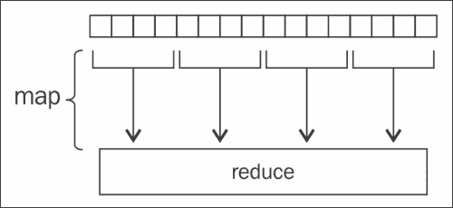

# 第九章。并行与并发设计

本章将涵盖以下食谱：

+   使用 Haskell 运行时系统（RTS）选项

+   并行评估程序

+   按顺序控制并行算法

+   为并发操作分叉 I/O 动作

+   与分叉的 I/O 操作通信

+   终止分叉线程

+   使用 Par 单子并行化纯函数

+   并行映射列表

+   并行访问元组元素

+   实现 MapReduce 以计算单词频率

+   使用 Repa 并行处理图像

+   Haskell 中的运行时性能基准测试

+   使用 criterion 包来测量性能

+   在终端中进行运行时性能基准测试

# 介绍


数据分析研究中的一项伟大成就是对并行和并发设计的智能应用。随着我们收集越来越多的数据，我们能够发现越来越多的模式。然而，这也以时间和空间为代价。更多的数据可能需要更多的计算时间或更多的内存空间。这是一个非常现实的问题，本章将尝试解决它。

前几个食谱将介绍如何并行和顺序地调用纯程序。接下来的分叉食谱将涉及使用 I/O 动作的并发。然后，我们将深入学习如何并行访问列表和元组元素。接着，我们将在 Haskell 中实现 MapReduce 来高效解决一个费时的问题。

我们将通过学习如何进行运行时性能基准测试，结束对并行和并发设计的回顾。有时候，发现代码是否成功地并行运行的最简单方法是将其与非并行版本的代码进行时间对比。如果两者的计算时间看起来相同，那么很可能出现了问题。要么代码没有并行运行，要么激活并行的成本超过了其带来的好处。

# 使用 Haskell 运行时系统选项

Haskell 中的**运行时系统**（**RTS**）配置了如调度、分析和管理已编译 Haskell 程序存储等特殊选项。为了编写多线程代码，我们必须按照本食谱中概述的方式指定自己的 RTS 选项。

如需进一步阅读，GHC 官方 Haskell Wiki 网页上的 GHC 评论部分提供了关于运行时系统的详细说明，网址为[`ghc.haskell.org/trac/ghc/wiki/Commentary/Rts`](https://ghc.haskell.org/trac/ghc/wiki/Commentary/Rts)。

## 如何操作……

打开终端，编译代码，并使用 RTS 选项运行它。假设我们的文件名为`Main.hs`，然后执行以下命令：

```py
$ ghc -O2 --make Main.hs -threaded -rtsopts 
$ ./Main  +RTS -N2

```

## 它是如何工作的……

为了利用多个线程，我们必须在编译代码时启用`threaded`和`rtsopts`标志。

现在，它已经用 `rtsopts` 编译，我们可以使用特殊指令在 `+RTS` 和 `-RTS` 标志之间运行程序。如果存在 `+RTS` 标志但没有 `–RTS` 标志，则假设 RTS 选项会持续到行尾。

我们通过在 RTS 参数中放入 `-Nx` 来设置使用的线程数，其中 `x` 表示“使用 x 个线程”。因此，要使用两个线程，我们应输入 *-N2*。要使用所有可能的线程，我们只需输入 *-N*。

## 还有更多……

指定 RTS 选项的另一种方法是在编译时使用 `--with-rtsopts` 标志。更高级的方法包括修改环境变量或覆盖运行时系统钩子。有关更多信息，请参见官方 Haskell 用户指南，网址为 [`www.haskell.org/ghc/docs/7.4.1/html/users_guide/runtime-control.html`](https://www.haskell.org/ghc/docs/7.4.1/html/users_guide/runtime-control.html)。

# 并行评估一个过程

在这个配方中，我们将并行执行两个耗时的任务。我们将使用来自 hackage 的 `parallel` 包中的 `rpar` 函数。`rpar` 函数将其参数标注为并行执行。然后，我们调用 `runEval` 来实际执行计算。

## 准备工作

使用 cabal 安装 `parallel` 包，如下所示：

```py
$ cabal install parallel

```

## 如何实现……

1.  按如下方式导入 parallel 包：

    ```py
    import Control.Parallel.Strategies (runEval, rpar)
    ```

1.  如下代码片段所示，评估两个任务并行执行，并在两个任务都完成后再返回结果：

    ```py
    main = do
      print $ runEval $ do
        a <- rpar task1
        b <- rpar task2
        return (a, b)
    ```

1.  可以按如下方式创建一个耗时任务：

    ```py
    task1 = 8⁸⁹ :: Integer
    ```

1.  另一个耗时任务可以按如下方式创建：

    ```py
    task2 = 8⁸⁸ :: Integer
    ```

1.  按如下方式编译代码，启用 `threaded` 和 `rtsopts` 标志：

    ```py
    $ ghc -O2 --make Main.hs -threaded –rtsopts

    ```

1.  通过指定核心数来运行它：

    ```py
    $ ./Main +RTS -N2

    ```

### 小贴士

本配方中的耗时计算（`task1` 和 `task2`）需要大量内存，可能会超出正在使用的机器的限制。可以调整任务以使其更易于管理，例如 4⁸⁹ 或 4⁸⁸。特别是，本配方中，将这些简单的数学计算并行化所带来的开销可能大于其带来的收益。

## 它是如何工作的……

耗时函数通过 `rpar` 标注，表示计算应当并行进行。一旦应用了 `runEval`，所触发的代码便会并行运行。代码的其他部分可以继续执行，直到这些并行运行的线程的输出被需要。

在我们的配方中，我们并行执行 `task1` 和 `task2`。我们立即返回结果，以便在代码的未来部分使用，并且代码只在必要时等待任务完成。计算在后台进行，直到稍后需要时才会被处理。

## 另请参见

要探索在并行设计中使用序列的示例，请参阅 *在序列中控制并行算法* 配方。

# 在序列中控制并行算法

在本食谱中，我们将并行执行两个耗时的任务。我们将使用`parallel`包中提供的`rpar`函数和`rseq`函数。`rpar`函数将其参数标记为并行计算。另一个函数`rseq`则强制按**弱头正常形式**进行顺序计算。

## 准备就绪

使用以下命令通过 cabal 安装`parallel`包：

```py
$ cabal install parallel

```

## 如何操作…

1.  按照以下方式导入并使用并行包：

    ```py
    import Control.Parallel
    import Control.Parallel.Strategies
    Evaluate two tasks in parallel, and wait for both tasks to finish before returning.
    main = do
      print $ runEval $ do
        a <- rpar task1
        b <- rpar task2
        rseq a
        rseq b
        return (a, b)
    ```

1.  按照以下方式执行一个耗时任务：

    ```py
    task1 = 8⁸⁹ :: Integer
    ```

1.  按照以下方式执行另一个耗时任务：

    ```py
    task2 = 8⁸⁸ :: Integer
    ```

1.  使用以下命令编译代码，并启用`threaded`和`rtsopts`标志：

    ```py
    $ ghc -O2 --make Main.hs -threaded –rtsopts

    ```

1.  按照以下方式通过指定核心数来运行它：

    ```py
    $ ./Main +RTS -N2

    ```

## 它是如何工作的…

耗时函数通过`rpar`或`rseq`进行标注，分别描述计算是否应并行执行或按顺序执行。如果一个函数被启动为并行执行，那么在该值被需要之前，后续代码部分可以继续执行。在这种情况下，代码会被阻塞，直到并行操作完成。如果需要按顺序执行函数，代码会等待该函数计算出结果，只有在此之后才会继续执行。

在我们的食谱中，我们并行运行`task1`和`task2`。然后，我们对这些值运行`rseq`，以演示顺序的概念。第一次调用`rseq`时，我们强制代码等待`task1`（由变量`a`表示）完成。根据算法的并行设计，可能根本不需要强制顺序计算。我们还强制`task2`（由变量`b`表示）等待计算完成，以此来展示顺序是如何工作的。

## 另请参见

若要查看仅并行设计而没有顺序控制的示例，请参见*并行评估过程*食谱。

# 为了并发执行，进行 I/O 操作的分叉

一种快速且简单的方法是通过调用`Control.Concurrent`包中的`forkIO`函数将 I/O 类型函数在后台启动。在本食谱中，我们将展示在 Haskell 中如何并发地处理简单的输入/输出。我们将从用户输入中获取等待的秒数，然后在后台使其休眠，等线程醒来后打印一条消息。

## 如何操作…

1.  按如下方式导入内建的并发包：

    ```py
    import Control.Concurrent (forkIO, threadDelay)
    ```

1.  提示用户程序需要休眠的秒数。然后，通过调用我们在以下代码片段中定义的`sleep`函数，使程序睡眠相应的秒数。最后，递归地再次调用`main`，以演示用户可以在后台线程运行的同时继续输入：

    ```py
    main = do
      putStr "Enter number of seconds to sleep: "
      time <- fmap (read :: String -> Int) getLine
      forkIO $ sleep time
      main
    ```

1.  定义一个函数，该函数接受要睡眠的秒数，并按如下方式将`threadDelay :: Int -> IO ()`应用于该值：

    ```py
    sleep :: Int -> IO ()
    sleep t = do
      let micro = t * 1000000
      threadDelay micro
      putStrLn $ "[Just woke up after " 
                  ++ show t ++ " seconds]"
    ```

1.  当我们运行程序时，可以快速输入多个数字，直到收到输出，示例如下：

    ```py
    $ ghci Main.hs

    Prelude> main

    Prelude> Enter number of seconds to sleep: 3

    Prelude> Enter number of seconds to sleep: 2

    Prelude> Enter number of seconds to sleep: [Just woke up after 2 seconds]

    [Just woke up after 3 seconds]

    ```

### 注意

`print`和`putrStrLn`函数不是原子的，因此您可能会看到输出交错的情况。

## 另请参见

要向派生的操作发送数据，请参考*与派生的 I/O 操作进行通信*的配方。

# 与派生的 I/O 操作进行通信

启动一个 I/O 类型的后台函数的快速简便方法是调用`Control.Concurrent`包提供的`forkIO`函数。在本配方中，我们将通过使用一种称为`MVar`的变量类型发送消息来与派生的 I/O 操作进行通信。

## 准备就绪

按如下方式从 cabal 安装`HTTP`包：

```py
$ cabal install HTTP

```

## 如何操作……

1.  按如下方式导入相关包：

    ```py
    import Network.HTTP
    import Control.Concurrent
    ```

1.  创建一个新变量，将被派生进程使用。`newEmptyMVar`函数的类型为`IO (MVar a)`，所以我们将表达式提取并标记为`m`，如下所示：

    ```py
    main = do
      m <- newEmptyMVar
      forkIO $ process m
    ```

1.  在运行派生进程后，通过调用`putMVar :: MVar a -> a -> IO ()`向其发送数据，如下代码所示。该变量将保存给定的值，派生的进程等待该数据并恢复：

    ```py
      putStrLn "sending first website..."
      putMVar m "http://www.haskell.com"
    ```

1.  我们可以重用表达式并发送更多数据，如下所示：

    ```py
      putStrLn "sending second website..."
      putMVar m "http://www.gnu.org"
    ```

1.  为了确保`main`在派生进程完成之前不会终止，我们通过调用`threadDelay`函数强制`main`等待 10 秒。这仅用于演示目的，完整的解决方案应该在派生完成后立即终止`main`，如下代码片段所示：

    ```py
      threadDelay $ 10 * 1000000
    ```

1.  按如下方式定义将并行运行的派生代码：

    ```py
    process m = do 
      putStrLn "waiting..."
      v <- takeMVar m
      resp <- get v
      putStrLn $ "response from " ++ show v ++ " is " ++ resp
      process m
    ```

1.  创建一个函数以对 URL 执行 HTTP GET 请求，如下所示：

    ```py
    get :: String -> IO String
    get url = do
       resp <- simpleHTTP (getRequest url)
       body <- getResponseBody resp
       return $ take 10 body
    ```

1.  程序的输出将如下所示：

    ```py
    $ runhaskell Main.hs

    sending first website...
    sending second website...
    waiting...
    waiting...
    response from "http://www.haskell.com" is 

    <!doctype html>
    <html class="no-js" lang="en">
    <head id="ctl00_Head1"><meta http-equiv="X-UA-C

    response from "http://www.gnu.org" is 

    <!DOCTYPE html PUBLIC "-//W3C//DTD XHTML 1.0 Strict//EN"
     "http://www.w3.org/TR/xhtml1/DTD/xhtml1
    waiting...

    ```

## 另见

要查看使用`forkIO`的更简单示例，请参考*并发中的 I/O 操作派生*的配方。

# 终止派生线程

当我们创建一个新线程时，可以跟踪其对应的线程 ID，以便稍后手动终止它。

在本配方中，我们将创建一个命令行界面，用于派生新进程下载一个巨大文件。通过`d`命令后跟数字可以启动下载。运行`d 1`将启动一个线程以下载项目#1。

我们将学习如何在线程仍然运行时终止它们。我们的终止线程命令将像`k 1`，以便终止下载的项目#1。

## 如何操作……

在一个新文件中，我们称之为`Main.hs`，插入以下代码：

1.  按如下方式导入所需的包：

    ```py
    import Control.Concurrent
    import qualified Data.Map as M
    ```

1.  让`main`调用辅助的`download`函数：

    ```py
    main = download (M.empty :: M.Map Int [ThreadId])
    ```

1.  定义一个函数以接受用户查询并做出适当响应，如下所示：

    ```py
    download m = do
      input <- (getLine >>= return . words)
      respond m input >>= download
    ```

1.  响应下载请求：

    ```py
    respond m ["d", nstr] = do
      putStrLn "Starting download..."
      let n = read nstr :: Int
      threadId <- forkIO $ massiveDownload n
      return $ M.insertWith (++) n [threadId] m
    ```

1.  响应终止请求：

    ```py
    respond m ["k", nstr] = do
      let n = read nstr :: Int
      case (M.lookup n m) of
        Just threads -> do 
          putStrLn "Killing download(s)..."
          mapM_ killThread threads
          download $ M.delete n m
        Nothing -> do
          putStrLn "No such download"
          download m
    ```

1.  响应无效请求：

    ```py
    respond m _ = do
      putStrLn 
          "Type `d #` to start a download or `k #` to kill it."
      return m
    ```

1.  假装下载一个巨大文件，如下所示：

    ```py
    massiveDownload n = do
      threadDelay $ 10 * 1000000
      putStrLn $ "[Download " ++ (show n) ++" complete!]"
    ```

1.  运行代码并按如下方式调用几个下载和终止命令：

    ```py
    $ runhaskell Main.hs
    d 1
    Starting download...
    d 2
    Starting download...
    d 3
    Starting download...
    k 1
    Killing download(s)...
    [Download 2 complete!]
    [Download 3 complete!]

    ```

## 它是如何工作的……

程序跟踪从下载编号到线程 ID 的映射。每当启动一个新的下载时，我们会将相应的线程 ID 插入映射中。要终止一个线程，我们调用`killThread`对相应的线程 ID 进行操作。

# 使用 Par 单子并行化纯函数

使用`Control.Monad.Par`包中的 Par monad 来加速使用并行线程的纯函数。信息流由称为`IVar`的变量引导。我们可以并行`put`值到`IVar`或者从中`get`值。

## 准备好

在 cabal 上安装 Par monad 如下：

```py
$ cabal install monad-par

```

## 怎么做…

1.  导入 Par monad 如下：

    ```py
    import Control.Monad.Par
    ```

1.  并行运行计算，并执行一些有趣的功能，如计算数字的数量并打印输出。

    ```py
    main = print $ length $ show $ runPar mypar
    ```

1.  定义 I/O 类型动作如下：

    ```py
    mypar = do 
      v1 <- new :: Par (IVar Integer)
      v2 <- new :: Par (IVar Integer)
      fork $ put v1 task1
      fork $ put v2 task2
      v1' <- get v1
      v2' <- get v2
      return (v1' + v2')  
    ```

1.  执行一个耗时任务，如下所示：

    ```py
    task1 = 8⁸⁸
    ```

1.  执行另一个耗时任务如下：

    ```py
    task2 = 8⁸⁷
    ```

1.  使用以下命令启用`threaded`和`rtsopts`标志编译代码：

    ```py
    $ ghc -O2 --make Main.hs -threaded –rtsopts

    ```

1.  通过以下方式指定核心数来运行它：

    ```py
    $ ./Main +RTS -N2

    15151337

    ```

## 还有更多…

代码的自然非并行化版本确实看起来更清洁。在以下示例中，我们看到与前一个示例中数学上的相同原理，但没有单子的使用。然而，我们不再具有并发的能力：

```py
import Control.Monad.Par

main = print $ length $ show $ task1 + task2

task1 = 8⁸⁸
task2 = 8⁸⁸
```

## 另请参阅

处理使用 I/O 的计算，请参阅*并发执行 I/O 操作*配方。

# 在并行中映射列表

在此配方中，我们将并行应用 map 函数。给定一组值，我们将使用多个线程在每个值上应用函数。

## 怎么做…

1.  导入并行策略如下：

    ```py
    import Control.Parallel.Strategies
    ```

1.  使用以下代码片段使用`rdeepseq`策略映射列表：

    ```py
    main = do
      let results = 
                (parMap rdeepseq (¹⁰) [10¹⁰..10¹⁰+10000]) :: [Int]
      print results
    ```

1.  编译并运行代码后，在此处显示打印输出的前几个字符：

1.  使用以下命令启用`threaded`和`rtsopts`标志编译代码：

    ```py
    $ ghc -O2 --make Main.hs -threaded -rtsopts

    ```

1.  通过以下方式指定核心数来运行代码：

    ```py
    $ ./Main +RTS -N2

    [0,3644720378636855297,1420199564594381824,-9091195533231350103,-3969065814844243968,5699158338132413177,5185631055696798720,-1664423011715345679,-5301432476323807232,-6822228826283293807,-3978116359327587328,-2988467747382449959,669511447655481344,2530383018990005705,-7998143102955305984,  ...

    ```

## 它的工作原理…

`parMap`函数的类型为`Strategy b -> (a -> b) -> [a] -> [b]`。它看起来与 map 函数的类型签名完全相同，只是接受称为 Strategy 的东西。**Strategy**将并行方法与代码实现分离。Strategy 的一个示例是`rdeepseq`，它完全评估其参数。例如，Haskell 是惰性评估的，所以代码`length [5⁵⁵, 6⁶⁶]`不会评估`5⁵⁵`或`6⁶⁶`的值。我们可以使用`rdeepseq`示例更好地控制在并行运行时应评估哪些计算。

相比之下，代码的缓慢且简单版本如下所示：

```py
main = do
  print $ map (¹⁰) [10¹⁰..10¹⁰+10000]
```

尝试计时运行时间，以查看使用多线程时的显著差异。

## 还有更多…

根据应该调用并行性的方式有许多策略，如下所示：

+   `r0`是最简单的策略，只是不评估表达式

+   `dot`用于组合两个策略，以便在更复杂的表达式中进行更精细的控制

+   `rseq`将立即评估表达式

+   `rpar` 将注释要并行评估的表达式

## 另请参阅

+   如果处理元组，请参阅*并行访问元组元素*配方

+   有关时间测试代码的更多细节，请参阅 *Haskell 中的运行时性能基准测试* 配方或 *终端中的运行时性能基准测试* 配方。

# 并行访问元组元素

在这个配方中，我们将介绍如何并行访问元组元素。

## 如何实现…

1.  如下所示，导入内置包：

    ```py
    import Control.Parallel.Strategies
    ```

1.  并行计算元组中的表达式。我们使用不同的策略执行此任务两次，展示如何轻松切换策略以改变代码的并行特性，如下所示：

    ```py
    main = do
      let (a, b) = withStrategy (parTuple2 rseq rseq) (task1, task2)
      print $ seq (a+b) "done 1"
      let (a, bs) = withStrategy (parTuple2 rseq rdeepseq) (task1, tasks)
      print $ seq (a + sum bs) "done 2"
    ```

1.  如下所示，定义耗时任务：

    ```py
    task1 = 8⁸⁸ :: Integer
    task2 = 8⁸⁸ :: Integer
    tasks = [10¹⁰..10¹⁰+10000] :: [Integer]
    ```

1.  如下所示，使用启用 `threaded` 和 `rtsopts` 标志编译代码：

    ```py
    $ ghc -O2 --make Main.hs -threaded -rtsopts

    ```

1.  如下所示，通过指定核心数量来运行：

    ```py
    $ ./Main +RTS -N2

    ```

## 还有更多…

当处理超过两个元素的元组时，还有其他辅助方法，如 `parTuple3`、`parTuple4`、`parTuple5`、`parTuple6`、`parTuple7`、`parTuple8` 和 `parTuple9`。

## 另请参见

如果处理的是列表，请参阅 *并行映射列表* 配方。

# 实现 MapReduce 以计算单词频率

MapReduce 是一个高效并行算法框架，利用了分治法。如果一个任务可以被分解成更小的任务，而且每个单独任务的结果可以合并形成最终答案，那么 MapReduce 很可能是执行此任务的最佳框架。

在下图中，我们可以看到一个大的列表被拆分开来，映射函数在每个拆分部分上并行工作。所有映射完成后，框架的第二阶段启动，将各种计算归约为一个最终答案。

在这个配方中，我们将统计大量文本中的单词频率。给定多个单词文件，我们将应用 MapReduce 框架并行地找到单词频率。



## 准备工作

使用 cabal 安装 `parallel` 包，如下所示：

```py
$ cabal install parallel

```

创建多个包含单词的文件。在这个配方中，我们下载一个巨大的文本文件并使用 UNIX `split` 命令将其拆分，如下所示：

```py
$ wget norvig.com/big.txt

$ split –d big.txt words

$ ls words*
words00
words01
words02
words03
…

```

## 如何实现…

1.  如下所示，导入相关包：

    ```py
    import Data.List (sort, group, sortBy, groupBy, isPrefixOf)
    import Control.Parallel
    import Control.Parallel.Strategies
    import Data.Char (isAlpha, isSpace, toLower)
    import Data.Map (Map, insertWith, empty, toList)
    import System.Directory
    import qualified Data.Map as M
    ```

1.  定义 MapReduce 逻辑。映射函数应都出现在归约逻辑之前，如下所示：

    ```py
    mapReduce :: Strategy b -> (a -> b) -> 
    Strategy b -> ([b] -> b) -> [a] -> b
    mapReduce mStrategy m rStrategy r input = 
      mOutput `pseq` rOutput
      where mOutput = parMap mStrategy m input
            rOutput = r mOutput `using` rStrategy
    ```

1.  如下所示，定义 `mapper` 函数以计算单词频率：

    ```py
    mapper :: String -> [(String,Int)] 
    mapper str = freqCount $ getWords str
    ```

1.  如下所示，计算一个字符串中某个单词出现的次数：

    ```py
          freqCount :: [String] -> [(String, Int)]
          freqCount xs = 
            map (\x -> (head x, length x)) . group . sort $ xs
    ```

1.  如下所示，从任意字符语料库中提取单词：

    ```py
    getWords :: String -> [String]
    getWords str = words $ filter 
                         (\x -> isAlpha x || isSpace x) lower
      where lower = map toLower str
    ```

1.  如下所示，将单词频率列表归约为一个最终答案：

    ```py
    reducer :: [[(String,Int)]] -> [(String,Int)]
    reducer ls = toList $ 
                 foldl (\m (k, v) -> insertWith (+) k v m) 
                       (empty :: Map String Int) 
                       (concat ls)
    ```

1.  设置 MapReduce 问题并运行它：

    ```py
    main = do       
            files <- getCurrentDirectory >>= getDirectoryContents
            let myFiles = filter ("words `isPrefixOf`) files
               rawFileData <- mapM readFile myFiles
               let freqMap = mapReduce (rpar `dot` rdeepseq) 
                                    mapper rseq reducer fawFileData
            putStrLn $ "Found " ++ (show.length) freqMap ++ " words!"
            queryInput freqMap
    ```

1.  请求输入，然后显示每个输入单词的频率：

    ```py
    queryInput freqMap = do
      putStrLn "Enter a sentence: "
      sentence <- readLine
      let freqs = map (`lookup` freqMap) (words sentence)
      print $ zip (words sentence) freqs
      queryInput freqMap
    ```

1.  如下所示，使用启用 `threaded` 和 `rtsopts` 标志编译代码：

    ```py
    $ ghc -O2 --make Main.hs -threaded -rtsopts

    ```

1.  如下所示，通过指定核心数量来运行：

    ```py
    $ ./Main +RTS -N2
    Found 35537 words!
    Enter a sentence:
    no one who is young is ever going to be old
    [ ("no",Just 2328)
    , ("one",Just 3215)
    , ("who",Just 2994)
    , ("is",Just 9731)
    , ("young",Just 624)
    , ("is",Just 9731)
    , ("ever",Just 254)
    , ("going",Just 369)
    , ("to",Just 28614)
    , ("be",Just 6148)
    , ("old",Just 1138) ]

    ```

# 使用 Repa 并行操作图像

Repa 是一个强大的库，用于并行处理高维数组。我们将使用它来读取和编辑图像的像素。

## 准备工作

安装**开发者图像库**（**DevIL**），这是一个跨平台的图像处理工具包。可以从[`openil.sourceforge.net/download.php`](http://openil.sourceforge.net/download.php)下载，或者通过在 Debian 系统上使用`apt-get`命令安装，具体如下：

```py
$ sudo apt-get install libdevil-dev

```

从 cabal 安装 Repa 包，用于 DevIL 工具包，如下所示：

```py
$ cabal install repa-devil

```

创建两个名为`image1.png`和`image2.png`的图像，它们具有相同的尺寸，如下所示：


这里是第二张图片：


## 如何操作…

1.  导入以下库，如下所示：

    ```py
    import System.Environment (getArgs)
    import Data.Word (Word8)
    import qualified Data.Array.Repa as R
    import Data.Array.Repa hiding ((++))
    import Data.Array.Repa.IO.DevIL (runIL, readImage, 
      writeImage, IL, Image(RGB))
    import Data.Array.Repa.Repr.ForeignPtr (F)
    ```

1.  读取图像，处理它们，并生成输出图像，具体如下：

    ```py
    main = do
      let image1 = "image1.png"
      let image2 = "image2.png"
      runIL $ do
        (RGB a) <- readImage image1
        (RGB b) <- readImage image2
        imageOut <- (computeP $ intersect a b) 
                                     :: IL (Array F DIM3 Word8)
        writeImage ("output.png") (RGB imageOut)
    ```

1.  创建一个辅助函数以处理图像，代码如下：

    ```py
    intersect :: Array F DIM3 Word8 -> 
                 Array F DIM3 Word8 -> 
                 Array D DIM3 Word8
    intersect a b = R.zipWith (\w1 w2 -> merge w1 w2) a b
      where merge w1 w2 = if w1 == w2 then 0 else 255
    ```

1.  使用启用`threaded`和`rtsopts`标志来编译代码，如下所示：

    ```py
    $ ghc -O2 --make Main.hs -threaded -rtsopts

    ```

1.  通过指定核心数来运行，具体如下：

    ```py
    $ ./Main +RTS -N2

    ```

输出结果如下：


## 工作原理…

图像被读取为三维的 Repa 像素数组，其中每个像素由一个 Word8 表示。前两个维度按宽度和高度索引图像，最后一个维度选择颜色通道（红色、绿色、蓝色或透明度）。

我们运行由 Repa 提供的`zipWith`函数，将两张图像合并为一张，使用我们的交集/合并规则。为了实际高效地并行执行该过程，我们必须调用`computeP`函数。

# Haskell 中基准测试运行时性能

基准测试运行时是计时代码运行所需时间的过程。通过适当的基准测试，我们可以理解我们的并行或并发代码是否真的比朴素实现更快。本配方将展示如何在 Haskell 中计时代码运行时。

## 如何操作…

1.  导入必要的库，如下所示：

    ```py
    import System.CPUTime (getCPUTime)
    import Control.Monad (replicateM_)
    import Control.Parallel.Strategies (NFData, rdeepseq)
    import Control.Exception (evaluate)
    ```

1.  创建一个函数，用于打印纯任务的持续时间。评估纯表达式非常多次（10⁶），然后计算执行一个纯任务所需的平均 CPU 时间。`getCPUTime` 函数返回自程序执行开始以来经过的皮秒数，如下代码片段所示：

    ```py
    time :: (Num t, NFData t) => t -> IO ()
    time y = do
      let trials = 10⁶
      start <- getCPUTime
      replicateM_ trials $ do
          x <- evaluate $ 1 + y
          rdeepseq x `seq` return ()
      end   <- getCPUTime
      let diff = (fromIntegral (end - start)) / (10¹²)
      putStrLn $ "avg seconds: " ++  
        (show (diff / fromIntegral trials))
      return ()
    ```

1.  测试定时函数，如下所示：

    ```py
    main = do 
        putStrLn "Starting pure..."
        time (3+7 :: Int)
        putStrLn "...Finished pure"
    ```

1.  进行纯任务的测量值会被打印出来。实际测量值会根据机器的状态而有所不同。

    ```py
    Starting pure…
    Avg seconds: 3.2895e-7
    …Finished pure
    ```

## 另见

*终端中基准测试运行时性能*，用于在 Haskell 环境之外生成基准测试结果的配方。

# 使用`criterion`包来测量性能

为了获得更可靠的性能测量，`criterion`包非常有用。该包的描述指出，使用简单的程序来计时纯代码存在一个重大缺陷。

> *"因为 GHC 在使用-O 进行编译时会进行激进优化，因此很容易编写看似无害的基准代码，这些代码只会被评估一次，导致除第一次外的所有定时循环都在计时‘无事可做’的成本。"*

## 准备中

创建一个包含几个单词的`small.txt`文件。创建一个文件`big.txt`，并填充如下文本：

```py
$ wget norvig.com/big.txt

```

按如下方式安装`criterion`库：

```py
$ cabal install criterion

```

## 如何做……

1.  按如下方式导入包：

    ```py
    import Criterion.Main
    ```

1.  定义我们希望计时的 I/O 函数如下：

    ```py
    splitUp filename = readFile filename >>= return . words
    ```

1.  如下所示基准测试所需的功能：

    ```py
    main = defaultMain 
      [ bgroup "splitUp" 
        [ bench "big" $ nfIO $ splitUp "big.txt" 
        , bench "small" $ nfIO $ splitUp "small.txt" ] ]
    ```

1.  按如下方式运行代码：

    ```py
    $ ghc -O --make Main.hs

    $ ./Main

    warming up
    estimating clock resolution...
    mean is 1.082787 us (640001 iterations)
    found 42320 outliers among 639999 samples (6.6%)
     1860 (0.3%) low severe
     40460 (6.3%) high severe
    estimating cost of a clock call...
    mean is 33.40185 ns (10 iterations)
    found 2 outliers among 10 samples (20.0%)
     1 (10.0%) high mild
     1 (10.0%) high severe

    benchmarking splitUp/big
    collecting 100 samples, 1 iterations each, in estimated 65.46450 s
    mean: 656.1964 ms, lb 655.5417 ms, ub 657.1513 ms, ci 0.950
    std dev: 4.018375 ms, lb 3.073741 ms, ub 5.746751 ms, ci 0.950

    benchmarking splitUp/small
    mean: 15.33773 us, lb 15.16429 us, ub 15.56298 us, ci 0.950
    std dev: 1.010893 us, lb 823.5281 ns, ub 1.277931 us, ci 0.950
    found 8 outliers among 100 samples (8.0%)
     5 (5.0%) high mild
     3 (3.0%) high severe
    variance introduced by outliers: 61.572%
    variance is severely inflated by outliers

    ```

## 它是如何工作的……

通过在`main`中调用该库的`defaultMain`函数，我们可以利用一些非常强大的基准测试功能。例如，尝试运行以下命令，查看 criterion 支持的众多功能：

```py
$ ./Main -h

```

# 在终端中基准测试运行时性能

基准测试运行时是计时代码运行所需时间的过程。这个技能非常宝贵，因为它有助于比较性能。通过在外部测量运行时，而不是在代码内部进行检测，我们可以轻松进行，不必理解代码的内部工作原理。如果我们使用的是类似 Unix 的系统，如 Linux 或 OS X，可以使用`time`命令，而在 Windows 系统上，我们可以使用 PowerShell 中的`Measure-Command`。

## 准备中

确保我们的机器是类 Unix 系统（如 Linux 或 OS X）或 Windows。如果不是，我们必须在线搜索计时执行的方法。

## 如何做……

1.  在类 Unix 系统中，内置了`time`命令。运行任何代码时，我们可以在终端前加上`time`，如下所示：

    ```py
    $ time runhaskell Main.hs
    real 0m0.663s
    user 0m0.612s
    sys 0m0.057s

    ```

    该命令的参数是 run，系统资源使用情况会立即总结。结果的实际准确性取决于机器。

1.  在 Windows 上，我们可以使用 PowerShell 中的`Measure-Command`功能。打开 PowerShell，进入正确的目录，并执行以下命令：

    ```py
    > Measure-Command { start-process runhaskell Main.hs –Wait }

    ```

1.  你将看到以下格式的结果：

    ```py
    Days              : 0
    Hours             : 0
    Minutes           : 0
    Seconds           : 1
    Milliseconds      : 10
    Ticks             : 10106611
    TotalDays         : 1.16974664351852E-05
    TotalHours        : 0.000280739194444444
    TotalMinutes      : 0.0168443516666667
    TotalSeconds      : 1.0106611
    TotalMilliseconds : 1010.6611

    ```

## 另见

要在 Haskell 代码内部计时执行，请参考*在 Haskell 中基准测试运行时性能*的教程。
