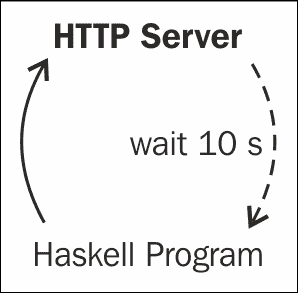
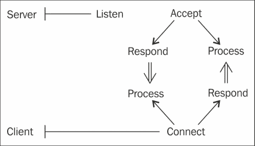

# 第十章：实时数据

本章将涵盖以下示例：

+   为实时情感分析流式传输 Twitter 数据

+   读取 IRC 聊天室消息

+   响应 IRC 消息

+   向 Web 服务器轮询以获取最新更新

+   检测实时文件目录变化

+   通过套接字进行实时通信

+   通过摄像头流检测面部和眼睛

+   用于模板匹配的摄像头流

# 介绍


首先收集数据然后再分析它是相当容易的。然而，有些任务可能需要将这两个步骤结合在一起。实时分析接收到的数据是本章的核心内容。我们将讨论如何管理来自 Twitter 推文、Internet Relay Chat（IRC）、Web 服务器、文件变更通知、套接字和网络摄像头的实时数据输入。

前三个示例将重点处理来自 Twitter 的实时数据。这些主题将包括用户发布的内容以及与关键词相关的帖子。

接下来，我们将使用两个独立的库与 IRC 服务器进行交互。第一个示例将展示如何加入一个 IRC 聊天室并开始监听消息，接下来的示例将展示我们如何在 IRC 服务器上监听直接消息。

如果不支持实时数据，常见的解决方法是频繁查询该数据。这一过程称为 **轮询**，我们将在某个示例中学习如何快速轮询 Web 服务器。

我们还将在文件目录中检测到文件被修改、删除或创建的变化。可以想象在 Haskell 中实现 Dropbox、OneDrive 或 Google Drive。

最后，我们将创建一个简单的服务器-客户端交互，使用套接字并操作实时网络摄像头流。

# 为实时情感分析流式传输 Twitter 数据

Twitter 上充满了每秒钟涌现的内容。开始调查实时数据的一个好方法是检查推文。

本示例将展示如何编写代码来响应与特定搜索查询相关的推文。我们使用外部 Web 端点来确定情感是积极、消极还是中立。

## 准备工作

安装 `twitter-conduit` 包：

```py
$ cabal install twitter-conduit

```

为了解析 JSON，我们使用 `yocto`：

```py
$ cabal install yocto

```

## 如何操作…

按照以下步骤设置 Twitter 凭证并开始编码：

1.  通过访问 [`apps.twitter.com`](https://apps.twitter.com) 创建一个新的 Twitter 应用。

1.  从此 Twitter 应用管理页面找到 OAuth 消费者密钥和 OAuth 消费者密钥。分别为 `OAUTH_CONSUMER_KEY` 和 `OAUTH_CONSUMER_SECRET` 设置系统环境变量。大多数支持 sh 兼容 shell 的 Unix 系统支持 `export` 命令：

    ```py
    $ export OAUTH_CONSUMER_KEY="Your OAuth Consumer Key"
    $ export OAUTH_CONSUMER_SECRET="Your OAuth Consumer Secret"

    ```

1.  此外，通过相同的 Twitter 应用管理页面找到 OAuth 访问令牌和 OAuth 访问密钥，并相应地设置环境变量：

    ```py
    $ export OAUTH_ACCESS_TOKEN="Your OAuth Access Token"
    $ export OAUTH_ACCESS_SECRET="Your OAuth Access Secret"

    ```

    ### 小贴士

    我们将密钥、令牌和秘密 PIN 存储在环境变量中，而不是直接将它们硬编码到程序中，因为这些变量与密码一样重要。就像密码永远不应公开可见，我们尽力将这些令牌和密钥保持在源代码之外。

1.  从`twitter-conduit`包的示例目录中下载`Common.hs`文件，路径为[`github.com/himura/twitter-conduit/tree/master/sample`](https://github.com/himura/twitter-conduit/tree/master/sample)。研究`userstream.hs`示例文件。

1.  首先，我们导入所有相关的库：

    ```py
    {-# LANGUAGE OverloadedStrings #-}

    import qualified Data.Conduit as C
    import qualified Data.Conduit.List as CL
    import qualified Data.Text.IO as T
    import qualified Data.Text as T

    import Control.Monad.IO.Class (liftIO)
    import Network.HTTP (getResponseBody, getRequest, simpleHTTP, urlEncode)
    import Text.JSON.Yocto
    import Web.Twitter.Conduit (stream, statusesFilterByTrack)
    import Common
    import Control.Lens ((^!), (^.), act)
    import Data.Map ((!))
    import Data.List (isInfixOf, or)
    import Web.Twitter.Types 
    ```

1.  在`main`中，运行我们的实时情感分析器以进行搜索查询：

    ```py
    main :: IO ()

    main = do
      let query = "haskell"
      T.putStrLn $ T.concat [ "Streaming Tweets that match \""
                            , query, "\"..."]
      analyze query
    ```

1.  使用`Common`模块提供的`runTwitterFromEnv'`函数，通过我们的 Twitter API 凭证连接到 Twitter 的实时流。我们将使用一些非常规的语法，如`$$+-`或`^!`。请不要被它们吓到，它们主要用于简洁表达。每当触发事件时，例如新的推文或新的关注，我们将调用我们的`process`函数进行处理：

    ```py
    analyze :: T.Text -> IO ()

    analyze query = runTwitterFromEnv' $ do
      src <- stream $ statusesFilterByTrack query
      src C.$$+- CL.mapM_ (^! act (liftIO . process))
    ```

1.  一旦我们获得事件触发的输入，就会运行`process`以获取输出，例如发现文本的情感。在本示例中，我们将情感输出附加到逗号分隔文件中：

    ```py
    process :: StreamingAPI -> IO ()

    process (SStatus s) = do
      let theUser = userScreenName $ statusUser s
      let theTweet = statusText s
      T.putStrLn $ T.concat [theUser, ": ", theTweet]
      val <- sentiment $ T.unpack theTweet
      let record = (T.unpack theUser) ++ "," ++ 
                   (show.fromRational) val ++ "\n"
      appendFile "output.csv" record
      print val
    ```

1.  如果事件触发的输入不是推文，而是朋友关系事件或其他内容，则不执行任何操作：

    ```py
    process s = return ()
    ```

1.  定义一个辅助函数，通过移除所有`@user`提及、`#hashtags`或`http://websites`来清理输入：

    ```py
    clean :: String -> String

    clean str = unwords $ filter 
                (\w -> not (or 
                       [ isInfixOf "@" w
                       , isInfixOf "#" w
                       , isInfixOf "http://" w ]))
                (words str)
    ```

1.  使用外部 API 对文本内容进行情感分析。在本示例中，我们使用 Sentiment140 API，因为它简单易用。更多信息请参考[`help.sentiment140.com/api`](http://help.sentiment140.com/api)。为了防止被限制访问，也请提供`appid`参数，并附上电子邮件地址或获取商业许可证：

    ```py
    sentiment :: String -> IO Rational
    sentiment str = do 
      let baseURL = "http://www.sentiment140.com/api/classify?text="
      resp <- simpleHTTP $ getRequest $ 
              baseURL ++ (urlEncode.clean) str
      body <- getResponseBody resp
      let p = polarity (decode body) / 4.0
      return p
    ```

1.  从我们的 API 的 JSON 响应中提取情感值：

    ```py
    polarity :: Value -> Rational

    polarity (Object m) = polarity' $ m ! "results"
      where polarity' (Object m) = fromNumber $ m ! "polarity"
            fromNumber (Number n) = n
    polarity _ = -1
    ```

1.  运行代码，查看推文在全球任何人公开发布时即刻显示。情感值将是介于 0 和 1 之间的有理数，其中 0 表示负面情感，1 表示正面情感：

    ```py
    $ runhaskell Main.hs
    Streaming Tweets that match "x-men"…

    ```

    查看以下输出：

    

我们还可以从`output.csv`文件中批量分析数据。以下是情感分析的可视化表现：


## 它是如何工作的…

Twitter-conduit 包使用了来自原始包的 conduit 设计模式，原始包位于[`hackage.haskell.org/package/conduit`](https://hackage.haskell.org/package/conduit)。conduit 文档中指出：

*Conduit 是解决流数据问题的方案，允许在恒定内存中进行数据流的生产、转换和消费。它是惰性 I/O 的替代方案，保证了确定性的资源处理，并且与枚举器/迭代器和管道处于相同的通用解决方案空间中。*

为了与 Twitter 的应用程序编程接口（API）进行交互，必须获得访问令牌和应用程序密钥。我们将这些值存储在环境变量中，并让 Haskell 代码从中检索。

`Common.hs`文件负责处理单调的认证代码，应该保持不变。

反应每个 Twitter 事件的函数是`process`。我们可以修改`process`以满足我们特定的需求。更具体地说，我们可以修改情感分析函数，以使用不同的`sentiment`分析服务。

## 还有更多内容…

我们的代码监听任何与我们查询匹配的推文。这个 Twitter-conduit 库还支持另外两种实时流：`statusesFilterByFollow`和`userstream`。前者获取指定用户列表的所有推文，后者获取该账户关注的用户的所有推文。

例如，通过将`statusesFilterByTrack`查询替换为一些 Twitter 用户的 UID 来修改我们的代码：

```py
analyze:: IO ()
analyze = runTwitterFromEnv' $ do
  src <- statusesFilterByFollow [ 103285804, 450331119
                                , 64895420]
  src C.$$+- CL.mapM_ (^! act (liftIO . process))
```

此外，为了仅获取我们关注的用户的推文，我们可以通过将`statusesFilterByTrack`查询替换为`userstream`来修改我们的代码：

```py
analyze :: IO ()
analyze = runTwitterFromEnv' $ do
  src <- stream userstream
  src C.$$+- CL.mapM_ (^! act (liftIO . process))
```

通过[`github.com/himura/twitter-conduit/tree/master/sample`](https://github.com/himura/twitter-conduit/tree/master/sample)可以找到更多示例。

# 阅读 IRC 聊天室消息

Internet Relay Chat（IRC）是最古老且最活跃的群聊服务之一。Haskell 社区在 Freenode IRC 服务器（`irc.freenode.org`）的`#haskell`频道中拥有非常友好的存在。

在这个配方中，我们将构建一个 IRC 机器人，加入一个聊天室并监听文本对话。我们的程序将模拟一个 IRC 客户端，并连接到现有的 IRC 服务器之一。这个配方完全不需要外部库。

## 做好准备

确保启用互联网连接。

要测试 IRC 机器人，最好安装一个 IRC 客户端。例如，顶级的 IRC 客户端之一是**Hexchat**，可以从[`hexchat.github.io`](http://hexchat.github.io)下载。对于基于终端的 IRC 客户端，**Irssi**是最受欢迎的：[`www.irssi.org`](http://www.irssi.org)。

在 Haskell wiki 上查看*自己动手制作 IRC 机器人*文章：[`www.haskell.org/haskellwiki/Roll_your_own_IRC_bot`](http://www.haskell.org/haskellwiki/Roll_your_own_IRC_bot)。这个配方的代码大多基于 wiki 上的内容。

## 如何做…

在一个名为`Main.hs`的新文件中，插入以下代码：

1.  导入相关的包：

    ```py
    import Network
    import Control.Monad (forever)
    import System.IO
    import Text.Printf
    ```

1.  指定 IRC 服务器的具体信息：

    ```py
    server = "irc.freenode.org"
    port   = 6667
    chan   = "#haskelldata"
    nick   = "awesome-bot"
    ```

1.  连接到服务器并监听聊天室中的所有文本：

    ```py
    main = do
      h <- connectTo server (PortNumber (fromIntegral port))
      hSetBuffering h NoBuffering
      write h "NICK" nick
      write h "USER" (nick++" 0 * :tutorial bot")
      write h "JOIN" chan
      listen h

    write :: Handle -> String -> String -> IO ()
    write h s t = do
      hPrintf h "%s %s\r\n" s t
      printf    "> %s %s\n" s t
    ```

1.  定义我们的监听器。对于这个配方，我们将仅将所有事件回显到控制台：

    ```py
    listen :: Handle -> IO ()
    listen h = forever $ do
      s <- hGetLine h
      putStrLn s
    ```

## 另见

要了解另一种与 IRC 交互的方式，请查看下一个配方，*回应 IRC 消息*。

# 回应 IRC 消息

另一种与 IRC 交互的方式是使用`Network.SimpleIRC`包。此包封装了许多底层网络操作，并提供了有用的 IRC 接口。

在本教程中，我们将回应频道中的消息。如果有用户输入触发词，在本案例中为“host?”，我们将回复该用户其主机地址。

## 准备工作

安装`Network.SimpleIRC`包：

```py
$ cabal install simpleirc

```

要测试 IRC 机器人，安装 IRC 客户端会很有帮助。一个不错的 IRC 客户端是 Hexchat，可以从[`hexchat.github.io`](http://hexchat.github.io)下载。对于基于终端的 IRC 客户端，Irssi 是最好的之一：[`www.irssi.org`](http://www.irssi.org)。

## 如何操作…

创建一个新的文件，我们称之为`Main.hs`，并执行以下操作：

1.  导入相关的库：

    ```py
    {-# LANGUAGE OverloadedStrings #-}

    import Network.SimpleIRC
    import Data.Maybe
    import qualified Data.ByteString.Char8 as B
    ```

1.  创建接收到消息时的事件处理程序。如果消息是“host?”，则回复用户其主机信息：

    ```py
    onMessage :: EventFunc
    onMessage s m = do
      case msg of
        "host?" ->  sendMsg s chan $ botMsg
        otherwise -> return ()
      where chan = fromJust $ mChan m
            msg = mMsg m
            host = case mHost m of
              Just h -> h
              Nothing -> "unknown"
            nick = case mNick m of
              Just n -> n
              Nothing -> "unknown user"
            botMsg = B.concat [ "Hi ", nick, "
                              , your host is ", host]
    ```

1.  定义要监听的事件：

    ```py
    events = [(Privmsg onMessage)]
    ```

1.  设置 IRC 服务器配置。连接到任意一组频道，并绑定我们的事件：

    ```py
    freenode = 
      (mkDefaultConfig "irc.freenode.net" "awesome-bot")
      { cChannels = ["#haskelldata"]
      , cEvents   = events
      }
    ```

1.  连接到服务器。不要在新线程中运行，而是打印调试信息，按照相应的布尔参数来指定：

    ```py
    main = connect freenode False True
    ```

1.  运行代码，打开 IRC 客户端进行测试：

## 另见

若要在不使用外部库的情况下连接 IRC 服务器，请参见之前的教程，*读取 IRC 聊天室消息*。

# 轮询 web 服务器以获取最新更新

一些网站的变化非常频繁。例如，Google 新闻和 Reddit 通常在我们刷新页面时，立刻加载最新的帖子。为了随时保持最新数据，最好是频繁地发送 HTTP 请求。

在本教程中，我们每 10 秒轮询一次新的 Reddit 帖子，如下图所示：



## 如何操作…

在一个名为`Main.hs`的新文件中，执行以下步骤：

1.  导入相关的库：

    ```py
    import Network.HTTP
    import Control.Concurrent (threadDelay)
    import qualified Data.Text as T
    ```

1.  定义要轮询的 URL：

    ```py
    url = "http://www.reddit.com/r/pics/new.json"
    ```

1.  定义一个函数来获取最新的 HTTP GET 请求数据：

    ```py
    latest :: IO String

    latest = simpleHTTP (getRequest url) >>= getResponseBody
    ```

1.  轮询实际上是等待指定时间后递归地执行任务。在这种情况下，我们会等 10 秒钟再请求最新的网页数据：

    ```py
    poll :: IO a

    poll = do
      body <- latest
      print $ doWork body
      threadDelay (10 * 10⁶)
      poll
    ```

1.  运行轮询：

    ```py
    main :: IO a
    main = do
      putStrLn $ "Polling " ++ url ++ " …"
      poll
    ```

1.  每次 Web 请求后，分析数据。在本教程中，统计 Imgur 出现的次数：

    ```py
    doWork str = length $ T.breakOnAll 
                  (T.pack "imgur.com/") (T.pack str)
    ```

# 检测实时文件目录变化

在本教程中，我们将实时检测文件是否被创建、修改或删除。类似于流行的文件同步软件 Dropbox，我们每次遇到这样的事件时，都会执行一些有趣的操作。

## 准备工作

安装`fsnotify`包：

```py
$ cabal install fsnotify

```

## 如何操作…

在一个名为`Main.hs`的新文件中，执行以下步骤：

1.  导入相关的库：

    ```py
    {-# LANGUAGE OverloadedStrings #-}
    import Filesystem.Path.CurrentOS
    import System.FSNotify
    import Filesystem
    import Filesystem.Path (filename)
    ```

1.  在当前目录上运行文件监视器：

    ```py
    main :: IO ()

    main = do
      wd <- getWorkingDirectory
      print wd

      man <- startManager
      watchTree man wd (const True) doWork
      putStrLn "press return to stop"

      getLine
      putStrLn "watching stopped, press return to exit"

      stopManager man
      getLine
      return ()
    ```

1.  处理每个文件变化事件。在本教程中，我们仅将操作输出到控制台：

    ```py
    doWork :: Event -> IO ()  

    doWork (Added filepath time) = 
      putStrLn $ (show $ filename filepath) ++ " added"
    doWork (Modified filepath time) = 
      putStrLn $ (show $ filename filepath) ++ " modified"
    doWork (Removed filepath time) = 
      putStrLn $ (show $ filename filepath) ++ " removed"
    ```

1.  运行代码并开始修改同一目录中的一些文件。例如，创建一个新文件，编辑它，然后删除它：

    ```py
    $ runhaskell Main.hs

    press return to stop
    FilePath "hello.txt" added
    FilePath "hello.txt" modified
    FilePath "hello.txt" removed

    ```

## 它是如何工作的…

`fsnotify`库绑定到特定平台文件系统的事件通知服务。在基于 Unix 的系统中，这通常是`inotify`（[`dell9.ma.utexas.edu/cgi-bin/man-cgi?inotify`](http://dell9.ma.utexas.edu/cgi-bin/man-cgi?inotify)）。

# 通过套接字实时通信

套接字提供了一种方便的实时程序间通信方式。可以把它们想象成一个聊天客户端。

在这个教程中，我们将从一个程序向另一个程序发送消息并获取响应。

## 如何做…

将以下代码插入到名为`Main.hs`的新文件中：

1.  创建服务器代码：

    ```py
    import Network ( listenOn, withSocketsDo, accept
                   , PortID(..), Socket )
    import System.Environment (getArgs)
    import System.IO ( hSetBuffering, hGetLine, hPutStrLn
                     , BufferMode(..), Handle )
    import Control.Concurrent (forkIO)
    ```

1.  创建一个套接字连接以进行监听，并在其上附加我们的处理程序`sockHandler`：

    ```py
    main :: IO ()

    main = withSocketsDo $ do
        let port = PortNumber 9001
        sock <- listenOn port
        putStrLn $ "Listening…"
        sockHandler sock
    ```

1.  定义处理每个接收到的消息的处理程序：

    ```py
    sockHandler :: Socket -> IO ()

    sockHandler sock = do
        (h, _, _) <- accept sock
        putStrLn "Connected!"
        hSetBuffering h LineBuffering
        forkIO $ process h
        forkIO $ respond h
        sockHandler sock
    ```

1.  定义如何处理客户端发送的消息：

    ```py
    process :: Handle -> IO ()
    process h = do
        line <- hGetLine h
        print line
        process h
    ```

1.  通过用户输入向客户端发送消息：

    ```py
    respond h = withSocketsDo $ do
      txt <- getLine
      hPutStrLn h txt
      respond h
    ```

1.  现在，在一个新文件`client.hs`中创建客户端代码。首先，导入库：

    ```py
    import Network (connectTo, withSocketsDo, PortID(..))
    import System.Environment (getArgs)
    import System.IO ( hSetBuffering, hPutStrLn
                     , hGetLine, BufferMode(..) )
    ```

1.  将客户端连接到相应的端口，并设置响应者和监听线程：

    ```py
    main = withSocketsDo $ do
      let port = PortNumber 9001
      h <- connectTo "localhost" port
      putStrLn $ "Connected!"
      hSetBuffering h LineBuffering
      forkIO $ respond h
      forkIO $ process h
      loop
    ```

1.  获取用户输入并将其作为消息发送：

    ```py
    respond h = do
      txt <- getLine
      hPutStrLn h txt
      respond h
    ```

1.  监听来自服务器的传入消息：

    ```py
    process h = do
      line <- hGetLine h
      print line
      process h
    ```

1.  先运行服务器，测试代码：

    ```py
    $ runhaskell Main.hs

    ```

1.  接下来，在一个单独的终端中运行客户端：

    ```py
    $ runhaskell client.hs

    ```

1.  现在，我们可以通过键入并按下*Enter*键在两者之间发送消息：

    ```py
    Hello?
    "yup, I can hear you!"

    ```

## 它是如何工作的…

`hGetLine`函数会阻塞代码执行，这意味着代码执行在此处暂停，直到接收到消息为止。这允许我们等待消息并进行实时反应。

我们首先在计算机上指定一个端口，这只是一个尚未被其他程序占用的数字。服务器设置套接字，客户端连接到它，而无需进行设置。两者之间传递的消息是实时发生的。

以下图示演示了服务器-客户端模型的可视化：



# 通过摄像头流检测人脸和眼睛

摄像头是另一个实时数据的来源。随着帧的进出，我们可以使用 OpenCV 库进行强大的分析。

在这个教程中，我们通过实时摄像头流进行人脸检测。

## 准备工作

安装 OpenCV、SDL 和 FTGL 库以进行图像处理和计算机视觉：

```py
sudo apt-get install libopencv-dev libsdl1.2-dev ftgl-dev

```

使用 cabal 安装 OpenCV 库：

```py
cabal install cv-combinators

```

## 如何做…

创建一个新的源文件`Main.hs`，并按照以下步骤操作：

1.  导入相关库：

    ```py
    import AI.CV.ImageProcessors
    import qualified AI.CV.OpenCV.CV as CV
    import qualified Control.Processor as Processor
    import Control.Processor ((--<))
    import AI.CV.OpenCV.Types (PImage)
    import AI.CV.OpenCV.CxCore (CvRect(..), CvSize(..))
    import Prelude hiding (id)
    import Control.Arrow ((&&&), (***))
    import Control.Category ((>>>), id)
    ```

1.  定义摄像头流的来源。我们将使用内置的摄像头。若要改用视频，可以将`camera 0`替换为`videoFile "./myVideo.mpeg"`：

    ```py
    captureDev :: ImageSource
    captureDev = camera 0
    ```

1.  缩小流的大小以提高性能：

    ```py
    resizer :: ImageProcessor
    resizer = resize 320 240 CV.CV_INTER_LINEAR
    ```

1.  使用 OpenCV 提供的训练数据集检测图像中的人脸：

    ```py
    faceDetect :: Processor.IOProcessor PImage [CvRect]

    faceDetect = haarDetect  "/usr/share/opencv/haarcascades/haarcascade_frontalface_alt.xml" 1.1 3 CV.cvHaarFlagNone (CvSize 20 20)
    ```

1.  使用 OpenCV 提供的训练数据集检测图像中的眼睛：

    ```py
    eyeDetect :: Processor.IOProcessor PImage [CvRect]
    eyeDetect = haarDetect "/usr/share/opencv/haarcascades/haarcascade_eye.xml" 1.1 3 CV.cvHaarFlagNone (CvSize 20 20)
    ```

1.  在人脸和眼睛周围画矩形框：

    ```py
    faceRects = (id &&& faceDetect) >>> drawRects

    eyeRects = (id &&& eyeDetect) >>> drawRects
    ```

1.  捕获摄像头流，检测面部和眼睛，绘制矩形，并在两个不同的窗口中显示它们：

    ```py
    start = captureDev >>> resizer --< (faceRects *** eyeRects) 
                 >>> (window 0 *** window 1)
    ```

1.  执行实时摄像头流并在按下某个键后停止：

    ```py
    main :: IO ()
    main = runTillKeyPressed start
    ```

1.  运行代码并查看网络摄像头，以检测面部和眼睛，结果如以下命令后的截图所示：

    ```py
    $ runhaskell Main.hs

    ```

    

## 它是如何工作的…

为了检测面部、眼睛或其他物体，我们使用`haarDetect`函数，它执行从许多正面和负面测试案例中训练出来的分类器。这些测试案例由 OpenCV 提供，通常位于 Unix 系统中的`/usr/share/opencv/haarcascades/`目录下。

cv-combinator 库提供了 OpenCV 底层操作的便捷抽象。为了运行任何有用的代码，我们必须定义一个源、一个过程和一个最终目标（也称为*sink*）。在我们的案例中，源是机器内置的摄像头。我们首先将图像调整为更易处理的大小（`resizer`），然后将流分成两个并行流（`--<`），在一个流中绘制面部框，在另一个流中绘制眼睛框，最后将这两个流输出到两个独立的窗口。有关 cv-combinators 包的更多文档，请参见[`hackage.haskell.org/package/cv-combinators`](https://hackage.haskell.org/package/cv-combinators)。

# 摄像头流的模板匹配

模板匹配是一种机器学习技术，用于寻找与给定模板图像匹配的图像区域。我们将把模板匹配应用于实时视频流的每一帧，以定位图像。

## 准备工作

安装 OpenCV 和 c2hs 工具包：

```py
$ sudo apt-get install c2hs libopencv-dev

```

从 cabal 安装 CV 库。确保根据安装的 OpenCV 版本包含`–fopencv24`或`–fopencv23`参数：

```py
$ cabal install CV -fopencv24

```

同时，创建一个小的模板图像。在这个实例中，我们使用的是 Lena 的图像，这个图像通常用于许多图像处理实验。我们将此图像文件命名为`lena.png`：


## 如何操作…

在一个新的文件`Main.hs`中，从以下步骤开始：

1.  导入相关库：

    ```py
    {-#LANGUAGE ScopedTypeVariables#-}
    module Main where
    import CV.Image (loadImage, rgbToGray, getSize)
    import CV.Video (captureFromCam, streamFromVideo)
    import Utils.Stream (runStream_, takeWhileS, sideEffect)
    import CV.HighGUI (showImage, waitKey)
    import CV.TemplateMatching ( simpleTemplateMatch
                               , MatchType(..) )
    import CV.ImageOp ((<#))
    import CV.Drawing (circleOp, ShapeStyle(..))
    ```

1.  加载模板图像并开始对摄像头流进行模板匹配：

    ```py
    main = do
      Just t <- loadImage "lena.jpg"
      Just c <- captureFromCam 0
      runStream_ . sideEffect (process t) . 
        takeWhileS (\_ -> True) $ streamFromVideo c
    ```

1.  对摄像头流的每一帧执行操作。具体来说，使用模板匹配来定位模板并围绕其绘制一个圆圈：

    ```py
    process t img = do
      let gray = rgbToGray img
      let ((mx, my), _) = 
        simpleTemplateMatch CCOEFF_NORMED gray t
      let circleSize = (fst (getSize t)) `div` 2
      let circleCenter = (mx + circleSize, my + circleSize)
      showImage "test" (img <# circleOp (0,0,0) 
        circleCenter circleSize (Stroked 3))
      waitKey 100
      return ()
    ```

1.  使用以下命令运行代码并显示模板图像。会在找到的图像周围绘制一个黑色圆圈：

    ```py
    $ runhaskell Main.hs

    ```

    

## 还有更多内容……

更多 OpenCV 示例可以在[`github.com/aleator/CV/tree/master/examples`](https://github.com/aleator/CV/tree/master/examples)找到。
