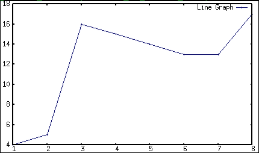

# 第十一章 数据可视化

在本章中，我们将介绍以下可视化技术：

+   使用 Google 的 Chart API 绘制折线图

+   使用 Google 的 Chart API 绘制饼图

+   使用 Google 的 Chart API 绘制条形图

+   使用 gnuplot 显示折线图

+   显示二维点的散点图

+   与三维空间中的点进行交互

+   可视化图形网络

+   自定义图形网络图的外观

+   使用 D3.js 在 JavaScript 中渲染条形图

+   使用 D3.js 在 JavaScript 中渲染散点图

+   从向量列表中绘制路径图

# 引言


可视化在数据分析的所有步骤中都非常重要。无论我们是刚开始接触数据，还是已经完成了分析，通过图形辅助工具直观地理解数据总是非常有用的。幸运的是，Haskell 提供了许多库来帮助实现这一目标。

在本章中，我们将介绍使用各种 API 绘制折线图、饼图、条形图和散点图的技巧。除了常见的数据可视化，我们还将学习如何绘制网络图。此外，在最后一个技巧中，我们将通过在空白画布上绘制向量来描述导航方向。

# 使用 Google 的 Chart API 绘制折线图

我们将使用方便的 Google Chart API ([`developers.google.com/chart`](https://developers.google.com/chart)) 来渲染折线图。该 API 会生成指向图表 PNG 图像的 URL。这个轻量级的 URL 比实际的图像更易于处理。

我们的数据将来自一个文本文件，其中包含按行分隔的数字列表。代码将生成一个 URL 来展示这些数据。

## 准备工作

按如下方式安装 `GoogleChart` 包：

```py
$ cabal install hs-gchart

```

创建一个名为 `input.txt` 的文件，并按如下方式逐行插入数字：

```py
$ cat input.txt 
2
5
3
7
4
1
19
18
17
14
15
16

```

## 如何实现…

1.  按如下方式导入 Google Chart API 库：

    ```py
    import Graphics.Google.Chart
    ```

1.  从文本文件中获取输入，并将其解析为整数列表：

    ```py
    main = do
      rawInput <- readFile "input.txt"
      let nums = map (read :: String -> Int) (lines rawInput)
    ```

1.  通过适当设置属性，创建一个图表 URL，如以下代码片段所示：

    ```py
      putStrLn $ chartURL $
        setSize 500 200 $
        setTitle "Example of Plotting a Chart in Haskell" $
        setData (encodeDataSimple [nums]) $
        setLegend ["Stock Price"] $
        newLineChart
    ```

1.  运行程序将输出一个 Google Chart URL，如下所示：

    ```py
    $ runhaskell Main.hs
    http://chart.apis.google.com/chart?chs=500x200&chtt=Example+of+Plotting+a+Chart+in+Haskell&chd=s:CFDHEBTSROPQ&chdl=Stock+Price&cht=lc

    ```

确保网络连接正常，并导航到该 URL 查看图表，如下图所示：


## 工作原理…

Google 会将所有图表数据编码到 URL 中。我们的图表越复杂，Google 图表 URL 就越长。在这个技巧中，我们使用 `encodeDataSimple` 函数，它创建了一个相对较短的 URL，但只接受 0 到 61 之间的整数（包括 0 和 61）。

## 还有更多内容…

为了可视化一个更详细的图表，允许数据具有小数位数，我们可以使用 `encodeDataText :: RealFrac a => [[a]] -> ChartData` 函数。这将允许 0 到 100 之间的十进制数（包含 0 和 100）。

为了在图表中表示更大的整数范围，我们应使用 `encodeDataExtended` 函数，它支持 0 到 4095 之间的整数（包括 0 和 4095）。

关于 Google Charts Haskell 包的更多信息，请访问 [`hackage.haskell.org/package/hs-gchart`](https://hackage.haskell.org/package/hs-gchart)。

## 另请参见

此配方需要连接互联网以查看图表。如果我们希望在本地执行所有操作，请参考 *使用 gnuplot 显示折线图* 配方。其他 Google API 配方包括 *使用 Google 的 Chart API 绘制饼图* 和 *使用 Google 的 Chart API 绘制条形图*。

# 使用 Google 的 Chart API 绘制饼图

Google Chart API 提供了一个外观非常优雅的饼图界面。通过正确地输入数据和标签，我们可以生成设计精良的饼图，如本配方所示。

## 准备工作

按如下方式安装 GoogleChart 包：

```py
$ cabal install hs-gchart

```

创建一个名为 `input.txt` 的文件，每行插入数字，格式如下：

```py
$ cat input.txt 
2
5
3
7
4
1
19
18
17
14
15
16

```

## 如何操作…

1.  按如下方式导入 Google Chart API 库：

    ```py
    import Graphics.Google.Chart
    ```

1.  从文本文件中收集输入并将其解析为整数列表，如以下代码片段所示：

    ```py
    main = do
      rawInput <- readFile "input.txt"
      let nums = map (read :: String -> Int) (lines rawInput)
    ```

1.  从以下代码中显示的饼图属性中打印出 Google Chart URL：

    ```py
      putStrLn $ chartURL $
        setSize 500 400 $
        setTitle "Example of Plotting a Pie Chart in Haskell" $
        setData (encodeDataSimple [nums]) $
        setLabels (lines rawInput) $
        newPieChart Pie2D
    ```

1.  运行程序将输出如下的 Google Chart URL：

    ```py
    $ runhaskell Main.hs
    http://chart.apis.google.com/chart?chs=500x400&chtt=Example+of+Plotting+a+Pie+Chart+in+Haskell&chd=s:CFDHEBTSROPQ&chl=2|5|3|7|4|1|19|18|17|14|15|16&cht=p

    ```

确保有网络连接，并访问该网址以查看下图所示的图表：


## 如何运作…

Google 将所有图表数据编码在 URL 中。图表越复杂，Google Chart URL 越长。在此配方中，我们使用 `encodeDataSimple` 函数，它创建一个相对较短的 URL，但仅接受 0 到 61（包括 0 和 61）之间的整数。饼图的图例由 `setLabels :: [String] -> PieChart -> PieChart` 函数按照与数据相同的顺序指定。

## 还有更多…

为了可视化一个包含小数的更详细的图表，我们可以使用 `encodeDataText :: RealFrac a => [[a]] -> ChartData` 函数。该函数支持 0 到 100（包括 0 和 100）之间的小数。

为了在图表中表示更大的整数范围，我们应使用 `encodeDataExtended` 函数，该函数支持 0 到 4095（包括 0 和 4095）之间的整数。

关于 Google Charts Haskell 包的更多信息，请访问 [`hackage.haskell.org/package/hs-gchart`](https://hackage.haskell.org/package/hs-gchart)。

## 另请参见

+   *使用 Google 的 Chart API 绘制折线图*

+   *使用 Google 的 Chart API 绘制条形图*

# 使用 Google 的 Chart API 绘制条形图

Google Chart API 也很好地支持条形图。在本配方中，我们将生成包含两组输入数据的条形图，以展示该 API 的实用性。

## 准备工作

按如下方式安装 `GoogleChart` 包：

```py
$ cabal install hs-gchart

```

创建两个文件，名为 `input1.txt` 和 `input2.txt`，每行插入数字，格式如下：

```py
$ cat input1.txt 
2
5
3
7
4
1
19
18
17
14
15
16

$ cat input2.txt
4
2
6
7
8
2
18
17
16
17
15
14

```

## 如何操作…

1.  按如下方式导入 Google Chart API 库：

    ```py
    import Graphics.Google.Chart
    ```

1.  从两个文本文件中获取两个输入值，并将它们解析为两个独立的整数列表，如以下代码片段所示：

    ```py
    main = do
      rawInput1 <- readFile "input1.txt"
      rawInput2 <- readFile "input2.txt"
      let nums1 = map (read :: String -> Int) (lines rawInput1)
      let nums2 = map (read :: String -> Int) (lines rawInput2)
    ```

1.  同样设置柱状图并打印出 Google Chart URL，如下所示：

    ```py
      putStrLn $ chartURL $
        setSize 500 400 $
        setTitle "Example of Plotting a Bar Chart in Haskell" $
        setDataColors ["00ff00", "ff0000"] $
        setLegend ["A", "B"] $
        setData (encodeDataSimple [nums1, nums2]) $
        newBarChart Horizontal Grouped
    ```

1.  运行程序将输出一个 Google Chart URL，如下所示：

    ```py
    $ runhaskell Main.hs
    http://chart.apis.google.com/chart?chs=500x400&chtt=Example+of+Plotting+a+Bar+Chart+in+Haskell&chco=00ff00,ff0000&chdl=A|B&chd=s:CFDHEBTSROPQ,ECGHICSRQRPO&cht=bhg

    ```

确保存在互联网连接并导航到该 URL 以查看以下图表：


## 如何实现…

Google 将所有图表数据编码在 URL 中。图表越复杂，Google Chart URL 就越长。在本教程中，我们使用`encodeDataSimple`函数，它创建了一个相对较短的 URL，但仅接受 0 到 61 之间的整数。

## 还有更多…

若要可视化更详细的图表并允许数据具有小数位，我们可以改用 `encodeDataText :: RealFrac a => [[a]] -> ChartData` 函数。该函数允许介于 0 和 100 之间的小数。

若要在图表中表示更大的整数范围，我们应使用 `encodeDataExtended` 函数，该函数支持介于 0 和 4095 之间的整数。

关于 Google Charts Haskell 包的更多信息，请访问 [`hackage.haskell.org/package/hs-gchart`](https://hackage.haskell.org/package/hs-gchart)。

## 另见

若要使用其他 Google Chart 工具，请参考*使用 Google Chart API 绘制饼图*和*使用 Google Chart API 绘制折线图*的教程。

# 使用 gnuplot 显示折线图

绘制图表通常不需要互联网连接。因此，在本教程中，我们将展示如何在本地绘制折线图。

## 准备工作

本教程使用的库通过 gnuplot 渲染图表。我们应首先安装 gnuplot。

在基于 Debian 的系统（如 Ubuntu）上，我们可以使用 `apt-get` 安装，如下所示：

```py
$ sudo apt-get install gnuplot-x11

```

gnuplot 的官方下载地址是其官方网站 [`www.gnuplot.info`](http://www.gnuplot.info)。

安装 gnuplot 后，使用 cabal 安装 `EasyPlot` Haskell 库，如下所示：

```py
$ cabal install easyplot

```

## 如何实现…

1.  按照以下方式导入`EasyPlot`库：

    ```py
    import Graphics.EasyPlot
    ```

1.  定义一个数字列表进行绘图，如下所示：

    ```py
    main = do
      let values = [4,5,16,15,14,13,13,17]
    ```

1.  如以下代码片段所示，在`X11`窗口上绘制图表。`X11` X Window 系统终端被许多基于 Linux 的机器使用。如果在 Windows 上运行，我们应使用`Windows`终端。在 Mac OS X 上，我们应将`X11`替换为`Aqua`：

    ```py
      plot X11 $ 
        Data2D [ Title "Line Graph"
               , Style Linespoints
               , Color Blue] 
        [] (zip [1..] values)
    ```

运行代码将生成一个 `plot1.dat` 数据文件，并从选定的终端显示可视化图表，如下图所示：



## 如何实现…

`EasyPlot`库将所有用户指定的代码转换为 gnuplot 可理解的语言，用于绘制数据图表。

## 另见

若要使用 Google Chart API 而不是 easy plot，请参考*使用 Google Chart API 绘制折线图*的教程。

# 显示二维点的散点图

本教程介绍了一种快速简单的方法，可以将 2D 点列表可视化为图像中的散点。

## 准备工作

本食谱中使用的库通过 gnuplot 来渲染图表。我们应先安装 gnuplot。

在基于 Debian 的系统（如 Ubuntu）上，我们可以使用 `apt-get` 安装，方法如下：

```py
$ sudo apt-get install gnuplot-x11

```

下载 gnuplot 的官方网站是 [`www.gnuplot.info`](http://www.gnuplot.info)。

在设置好 gnuplot 后，使用 cabal 安装 `easyplot` Haskell 库，如下所示：

```py
$ cabal install easyplot

```

同样，安装一个辅助的 CSV 包，如下所示：

```py
$ cabal install csv

```

同样，创建两个逗号分隔的文件 `input1.csv` 和 `input2.csv`，这两个文件表示两组独立的点，如下所示：

```py
$ cat input1.csv
1,2
3,2
2,3
2,2
3,1
2,2
2,1

```

```py
$ cat input2.csv
7,4
8,4
6,4
7,5
7,3
6,4
7,6

```

## 它是如何工作的…

1.  导入相关的包，如下所示：

    ```py
    import Graphics.EasyPlot

    import Text.CSV
    ```

1.  定义一个辅助函数将 CSV 记录转换为数字元组，如下所示：

    ```py
    convertRawCSV :: [[String]] -> [(Double, Double)]
    convertRawCSV csv = [ (read x, read y) | [x, y] <- csv ]
    ```

1.  读取这两个 CSV 文件，如下所示：

    ```py
    main = do
      csv1Raw <- parseCSVFromFile "input1.csv"
      csv2Raw <- parseCSVFromFile "input2.csv"

      let csv1 = case csv1Raw of 
            Left err -> []
            Right csv -> convertRawCSV csv

      let csv2 = case csv2Raw of 
            Left err -> []
            Right csv -> convertRawCSV csv
    ```

1.  在同一图表上，使用不同颜色将两个数据集并排绘制。对于许多基于 Linux 的机器，使用 `X11` 终端来支持 X Window 系统，如下代码所示。如果在 Windows 上运行，则使用 `Windows` 终端。在 Mac OS X 上，应将 `X11` 替换为 `Aqua`：

    ```py
      plot X11 $ [ Data2D [Color Red] [] csv1
      , Data2D [Color Blue] [] csv2 ]
    ```

1.  运行程序以显示下方截图中所示的图表：

## 它是如何工作的…

`EasyPlot` 库将所有用户指定的代码转换为 gnuplot 可理解的语言来绘制数据。plot 函数的最后一个参数可以接受多个数据集的列表来绘制图形。

## 另见

要可视化 3D 点，请参阅 *与三维空间中的点交互* 这一食谱。

# 与三维空间中的点交互

在可视化 3D 空间中的点时，交互式地旋转、缩放和平移表示非常有用。本食谱演示了如何在 3D 中绘制数据并实时交互。

## 准备工作

本食谱中使用的库通过 gnuplot 来渲染图表。我们应先安装 gnuplot。

在基于 Debian 的系统（如 Ubuntu）上，我们可以使用 `apt-get` 安装，方法如下：

```py
$ sudo apt-get install gnuplot-x11

```

下载 gnuplot 的官方网站是 [`www.gnuplot.info`](http://www.gnuplot.info)。

在设置好 gnuplot 后，使用 Cabal 安装 `easyplot` Haskell 库，如下所示：

```py
$ cabal install easyplot

```

同样，安装一个辅助的 CSV 包，如下所示：

```py
$ cabal install csv

```

同样，创建两个逗号分隔的文件 `input1.csv` 和 `input2.csv`，这两个文件表示两组独立的点，如下所示：

```py
$ cat input1.csv
1,1,1
1,2,1
0,1,1
1,1,0
2,1,0
2,1,1
1,0,1

```

```py
$ cat input2.csv
4,3,2
3,3,2
3,2,3
4,4,3
5,4,2
4,2,3
3,4,3

```

## 它是如何工作的…

1.  导入相关的包，如下所示：

    ```py
    import Graphics.EasyPlot

    import Text.CSV
    ```

1.  定义一个辅助函数将 CSV 记录转换为数字元组，如下所示：

    ```py
    convertRawCSV :: [[String]] -> [(Double, Double, Double)]

    convertRawCSV csv = [ (read x, read y, read z) 
                        | [x, y, z] <- csv ]
    ```

1.  读取这两个 CSV 文件，如下所示：

    ```py
    main = do
      csv1Raw <- parseCSVFromFile "input1.csv"
      csv2Raw <- parseCSVFromFile "input2.csv"

      let csv1 = case csv1Raw of
            Left err -> []
            Right csv -> convertRawCSV csv

      let csv2 = case csv2Raw of
            Left err -> []
            Right csv -> convertRawCSV csv
    ```

1.  使用 `plot'` 函数绘制数据，该函数会保持 gnuplot 运行以启用 `Interactive` 选项。对于许多基于 Linux 的机器，使用 `X11` 终端来支持 X Window 系统，如下代码所示。如果在 Windows 上运行，则使用 `Windows` 终端。在 Mac OS X 上，应将 `X11` 替换为 `Aqua`：

    ```py
      plot' [Interactive] X11 $ 
        [ Data3D [Color Red] [] csv1
        , Data3D [Color Blue] [] csv2]
    ```

    

## 它是如何工作的…

`EasyPlot` 库将所有用户指定的代码转换成 gnuplot 能理解的语言，以绘制数据图表。最后一个参数 `plot` 可以接受一个数据集列表进行绘图。通过使用 `plot'` 函数，我们可以让 gnuplot 持续运行，这样我们可以通过旋转、缩放和平移三维图像与图形进行交互。

## 另请参阅

要可视化二维点，请参考 *显示二维点的散点图* 示例。

# 可视化图形网络

边和节点的图形化网络可能很难调试或理解，因此可视化可以极大地帮助我们。在本教程中，我们将把一个图形数据结构转换成节点和边的图像。

## 准备工作

要使用 Graphviz 图形可视化库，我们首先需要在机器上安装它。Graphviz 的官方网站包含了下载和安装说明（[`www.graphviz.org`](http://www.graphviz.org)）。在基于 Debian 的操作系统上，可以通过以下方式使用 `apt-get` 安装 Graphviz：

```py
$ sudo apt-get install graphviz-dev graphviz

```

接下来，我们需要通过 Cabal 安装 Graphviz 的 Haskell 绑定，具体方法如下：

```py
$ cabal install graphviz

```

## 如何操作…

1.  导入相关的库，如下所示：

    ```py
    import Data.Text.Lazy (Text, empty, unpack)
    import Data.Graph.Inductive (Gr, mkGraph)
    import Data.GraphViz (GraphvizParams, nonClusteredParams, graphToDot)
    import Data.GraphViz.Printing (toDot, renderDot)
    ```

1.  使用以下代码行创建一个通过识别形成边的节点对来定义的图形：

    ```py
    myGraph :: Gr Text Text
    myGraph = mkGraph [ (1, empty)
                      , (2, empty)
                      , (3, empty) ]
              [ (1, 2, empty) 
              , (1, 3, empty) ]
    ```

1.  设置图形使用默认参数，如下所示：

    ```py
    myParams :: GraphvizParams n Text Text () Text
    myParams = nonClusteredParams
    ```

1.  如下所示，将图形的 dot 表示打印到终端：

    ```py
    main :: IO ()
    main = putStr $ unpack $ renderDot $ toDot $ 
           graphToDot myParams myGraph
    ```

1.  运行代码以获取图形的 dot 表示，并将其保存到一个单独的文件中，如下所示：

    ```py
    $ runhaskell Main.hs > graph.dot
    ```

1.  对该文件运行 Graphviz 提供的 `dot` 命令，以渲染出如下的图像：

    ```py
    $ dot -Tpng graph.dot > graph.png
    ```

1.  现在我们可以查看生成的 `graph.png` 文件，截图如下所示：

## 如何工作…

`graphToDot` 函数将图形转换为 DOT 语言，以描述图形。这是图形的文本序列化形式，可以被 Graphviz 的 `dot` 命令读取并转换成可视化图像。

## 更多内容…

在本教程中，我们使用了 `dot` 命令。Graphviz 网站还描述了其他可以将 DOT 语言文本转换成可视化图像的命令：

*dot - "层级"或分层绘制有向图。如果边具有方向性，这是默认的工具。*

*neato - "弹簧模型"布局。如果图形不太大（约 100 个节点）且你对图形没有其他了解，这是默认的工具。Neato 尝试最小化一个全局能量函数，这等同于统计多维尺度化。*

*fdp - "弹簧模型"布局，类似于 neato，但通过减少力来完成布局，而不是使用能量。*

*sfdp - fdp 的多尺度版本，用于大图的布局。*

*twopi - 径向布局，基于 Graham Wills 97。节点根据与给定根节点的距离，放置在同心圆上。*

*circo - 圆形布局，参考 Six 和 Tollis 99，Kauffman 和 Wiese 02。这适用于某些包含多个循环结构的图，如某些电信网络。*

## 另见

要进一步更改图形的外观和感觉，请参考 *自定义图形网络图的外观* 这一食谱。

# 自定义图形网络图的外观

为了更好地呈现数据，我们将介绍如何定制图形网络图的设计。

## 准备工作

要使用 Graphviz 图形可视化库，我们首先需要在机器上安装它。Graphviz 的官方网站包含了下载和安装说明，网址为 [`www.graphviz.org`](http://www.graphviz.org)。在基于 Debian 的操作系统上，可以使用`apt-get`命令来安装 Graphviz，方法如下：

```py
$ sudo apt-get install graphviz-dev graphviz

```

接下来，我们需要从 Cabal 安装 Graphviz Haskell 绑定，方法如下：

```py
$ cabal install graphviz

```

## 如何操作…

1.  导入相关的函数和库，以自定义 Graphviz 图形，方法如下：

    ```py
    import Data.Text.Lazy (Text, pack, unpack)
    import Data.Graph.Inductive (Gr, mkGraph)
    import Data.GraphViz (
      GraphvizParams(..),
      GlobalAttributes(
        GraphAttrs,
        NodeAttrs,
        EdgeAttrs
        ),
      X11Color(Blue, Orange, White),
      nonClusteredParams,
      globalAttributes,
      fmtNode,
      fmtEdge,
      graphToDot
      )
    import Data.GraphViz.Printing (toDot, renderDot)
    import Data.GraphViz.Attributes.Complete
    ```

1.  按照以下代码片段，首先指定所有节点，然后指定哪些节点对形成边，来定义我们的自定义图形：

    ```py
    myGraph :: Gr Text Text
    myGraph = mkGraph [ (1, pack "Haskell")
                      , (2, pack "Data Analysis") 
                      , (3, pack "Haskell Data Analysis")
                      , (4, pack "Profit!")] 
             [ (1, 3, pack "learn") 
             , (2, 3, pack "learn")
             , (3, 4, pack "???")]
    ```

1.  按照以下方式定义我们自己的自定义图形参数：

    ```py
    myParams :: GraphvizParams n Text Text () Text
    myParams = nonClusteredParams { 
    ```

1.  让图形引擎知道我们希望边缘是有向箭头，方法如下：

    ```py
        isDirected       = True
    ```

1.  设置图形、节点和边缘外观的全局属性如下：

    ```py
      , globalAttributes = [myGraphAttrs, myNodeAttrs, myEdgeAttrs]
    ```

1.  按照我们自己的方式格式化节点如下：

    ```py
      , fmtNode          = myFN
    ```

1.  按照我们自己的方式格式化边缘如下：

    ```py
      , fmtEdge          = myFE
      }
    ```

1.  按照以下代码片段定义自定义内容：

    ```py
     where myGraphAttrs = 
                     GraphAttrs [ RankDir FromLeft
                                        , BgColor [toWColor Blue] ]
                 myNodeAttrs = 
                      NodeAttrs [ Shape BoxShape
                                       , FillColor [toWColor Orange]
                                       , Style [SItem Filled []] ]
                 myEdgeAttrs = 
                      EdgeAttrs [ Weight (Int 10) 
                                       , Color [toWColor White]
                                       , FontColor (toColor White) ]
                 myFN (n,l) = [(Label . StrLabel) l]
                 myFE (f,t,l) = [(Label . StrLabel) l]
    ```

1.  将图形的 DOT 语言表示打印到终端。

    ```py
    main :: IO ()
    main = putStr $ unpack $ renderDot $ toDot $ graphToDot myParams myGraph
    ```

1.  运行代码以获取图形的`dot`表示，可以将其保存在单独的文件中，方法如下：

    ```py
    $ runhaskell Main.hs > graph.dot

    ```

1.  在此文件上运行 Graphviz 提供的`dot`命令，以渲染图像，方法如下：

    ```py
    $ dot -Tpng graph.dot > graph.png

    ```

我们现在可以查看生成的`graph.png`文件，如下所示的截图：


## 工作原理…

`graphToDot` 函数将图形转换为 DOT 语言，以描述图形。这是一种图形的文本序列化格式，可以被 Graphviz 的 `dot` 命令读取，并转换为可视化图像。

## 还有更多……

图形、节点和边缘的所有可能自定义选项都可以在 `Data.GraphViz.Attributes.Complete` 包文档中找到，网址为 [`hackage.haskell.org/package/graphviz-2999.12.0.4/docs/Data-GraphViz-Attributes-Complete.html`](http://hackage.haskell.org/package/graphviz-2999.12.0.4/docs/Data-GraphViz-Attributes-Complete.html)。

# 使用 D3.js 在 JavaScript 中渲染条形图

我们将使用名为`D3.js`的便携式 JavaScript 库来绘制条形图。这使得我们能够轻松地创建一个包含图表的网页，该图表来自 Haskell 代码。

## 准备工作

设置过程中需要连接互联网。

按照以下方式安装 `d3js` Haskell 库：

```py
$ cabal install d3js

```

创建一个网站模板，用于承载生成的 JavaScript 代码，方法如下：

```py
$ cat index.html

```

JavaScript 代码如下：

```py
<html>
  <head>
    <title>Chart</title>
  </head>
  <body>
    <div id='myChart'></div>
    <script charset='utf-8' src='http://d3js.org/d3.v3.min.js'></script>
    <script charset='utf-8' src='generated.js'></script>
  </body>
</html>
```

## 如何操作…

1.  按照以下方式导入相关的包：

    ```py
    import qualified Data.Text as T
    import qualified Data.Text.IO as TIO
    import D3JS
    ```

1.  使用`bars`函数创建条形图。输入指定的值和要绘制的条形数量，如以下代码片段所示：

    ```py
    myChart nums numBars = do
      let dim = (300, 300)
      elem <- box (T.pack "#myChart") dim
      bars numBars 300 (Data1D nums) elem
      addFrame (300, 300) (250, 250) elem
    ```

1.  定义要绘制的条形图的值和数量如下：

    ```py
    main = do
      let nums = [10, 40, 100, 50, 55, 156, 80, 74, 40, 10]
      let numBars = 5
    ```

1.  使用`reify`函数从数据生成 JavaScript `D3.js`代码。将 JavaScript 写入名为`generated.js`的文件，如下所示：

    ```py
      let js = reify $ myChart nums numBars
      TIO.writeFile "generated.js" js
    ```

1.  在`index.html`文件和`generated.js`文件并排存在的情况下，我们可以使用支持 JavaScript 的浏览器打开`index.html`网页，并看到如下所示的图表：

## 它是如何工作的…

`D3.js`库是一个用于创建优雅可视化和图表的 JavaScript 库。我们使用浏览器运行 JavaScript 代码，它也充当我们的图表渲染引擎。

## 另请参阅

另一个`D3.js`的用法，请参阅*使用 D3.js 在 JavaScript 中渲染散点图*食谱。

# 使用 D3.js 在 JavaScript 中渲染散点图

我们将使用名为`D3.js`的便携式 JavaScript 库来绘制散点图。这样我们就可以轻松地创建一个包含图表的网页，该图表来自 Haskell 代码。

## 准备工作

进行此设置需要互联网连接。

如下所示安装`d3js` Haskell 库：

```py
$ cabal install d3js

```

创建一个网站模板来承载生成的 JavaScript 代码，如下所示：

```py
$ cat index.html

```

JavaScript 代码如下所示：

```py
<html>
  <head>
    <title>Chart</title>
  </head>
  <body>
    <div id='myChart'></div>
    <script charset='utf-8' src='http://d3js.org/d3.v3.min.js'></script>
    <script charset='utf-8' src='generated.js'></script>
  </body>
</html>
```

## 如何操作…

1.  导入相关库，如下所示：

    ```py
    import D3JS
    import qualified Data.Text as T
    import qualified Data.Text.IO as TIO
    ```

1.  定义散点图并输入点列表，如下所示：

    ```py
    myPlot points = do
      let dim = (300, 300)
      elem <- box (T.pack "#myChart") dim
      scatter (Data2D points) elem
      addFrame (300, 300) (250, 250) elem   
    ```

1.  定义要绘制的点列表，如下所示：

    ```py
    main = do
      let points = [(1,2), (5,10), (139,138), (140,150)]
    ```

1.  使用`reify`函数从数据生成 JavaScript `D3.js`代码。将 JavaScript 写入名为`generated.js`的文件，如下所示：

    ```py
      let js = reify $ myPlot points
      TIO.writeFile "generated.js" js
    ```

1.  在`index.html`和`generated.js`文件并排存在的情况下，我们可以使用支持 JavaScript 的浏览器打开`index.html`网页，并看到如下所示的图表：

## 它是如何工作的…

`graphToDot`函数将图表转换为 DOT 语言来描述图表。这是图表的文本序列化格式，可以通过 Graphviz 的`dot`命令读取并转换为可视化图像。

## 另请参阅

另一个`D3.js`的用法，请参阅*使用 D3.js 在 JavaScript 中渲染条形图*食谱。

# 从向量列表绘制路径

在这个食谱中，我们将使用`diagrams`包来从驾驶路线中绘制路径。我们将所有可能的旅行方向分类为八个基本方向，并附上相应的距离。我们使用下图中 Google Maps 提供的方向，并从文本文件中重建这些方向：


## 准备工作

如下所示安装`diagrams`库：

```py
$ cabal install diagrams

```

创建一个名为`input.txt`的文本文件，其中包含八个基本方向之一，后面跟着距离，每一步用新的一行分隔：

```py
$ cat input.txt

N 0.2
W 0.1
S 0.6
W 0.05
S 0.3
SW 0.1
SW 0.2
SW 0.3
S 0.3

```

## 如何操作…

1.  导入相关库，如下所示：

    ```py
    {-# LANGUAGE NoMonomorphismRestriction #-}
    import Diagrams.Prelude
    import Diagrams.Backend.SVG.CmdLine (mainWith, B)
    ```

1.  从一系列向量中绘制一个连接的路径，如下所示：

    ```py
    drawPath :: [(Double, Double)] -> Diagram B R2
    drawPath vectors = fromOffsets . map r2 $ vectors
    ```

1.  读取一系列方向，将其表示为向量列表，并按如下方式绘制路径：

    ```py
    main = do
      rawInput <- readFile "input.txt"
      let vs = [ makeVector dir (read dist)
               | [dir, dist] <- map words (lines rawInput)]
      print vs
      mainWith $ drawPath vs
    ```

1.  定义一个辅助函数，根据方向及其对应的距离创建一个向量，如下所示：

    ```py
    makeVector :: String -> Double -> (Double, Double)
    makeVector "N" dist = (0, dist)
    makeVector "NE" dist = (dist / sqrt 2, dist / sqrt 2)
    makeVector "E" dist = (dist, 0)
    makeVector "SE" dist = (dist / sqrt 2, -dist / sqrt 2)
    makeVector "S" dist = (0, -dist)
    makeVector "SW" dist = (-dist / sqrt 2, -dist / sqrt 2)
    makeVector "W" dist = (-dist, 0)
    makeVector "NW" dist = (-dist / sqrt 2, dist / sqrt 2)
    makeVector _ _ = (0, 0)
    ```

1.  编译代码并按如下方式运行：

    ```py
    $ ghc --make Main.hs
    $ ./Main –o output.svg –w 400

    ```

    

## 它是如何工作的…

`mainWith` 函数接收一个 `Diagram` 类型，并在终端中调用时生成相应的图像文件。我们通过 `drawPath` 函数获得 `Diagram`，该函数通过偏移量将向量连接在一起。
