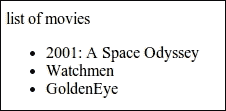
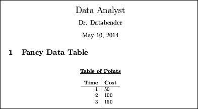

# 第十二章 导出与展示

本章将涵盖如何导出结果并通过以下食谱优雅地展示它们：

+   将数据导出到 CSV 文件

+   将数据导出为 JSON

+   使用 SQLite 存储数据

+   将数据保存到 MongoDB 数据库

+   在 HTML 网页中展示结果

+   创建 LaTeX 表格以展示结果

+   使用文本模板个性化消息

+   将矩阵值导出到文件

# 介绍


在数据收集、清洗、表示和分析后，数据分析的最后一步是将数据导出并以可用格式展示。 本章中的食谱将展示如何将数据结构保存到磁盘，以供其他程序后续使用。此外，我们还将展示如何使用 Haskell 优雅地展示数据。

# 将数据导出到 CSV 文件

有时，使用像 LibreOffice、Microsoft Office Excel 或 Apple Numbers 这样的电子表格程序查看数据更为便捷。导出和导入简单电子表格表格的标准方式是通过**逗号分隔值**（**CSV**）。

在这个食谱中，我们将使用`cassava`包轻松地从数据结构编码一个 CSV 文件。

## 准备工作

使用以下命令从 cabal 安装 Cassava CSV 包：

```py
$ cabal install cassava

```

## 如何实现……

1.  使用以下代码导入相关包：

    ```py
    import Data.Csv
    import qualified Data.ByteString.Lazy as BSL
    ```

1.  定义将作为 CSV 导出的数据关联列表。在这个食谱中，我们将字母和数字配对，如以下代码所示：

    ```py
    myData :: [(Char, Int)]
    myData = zip ['A'..'Z'] [1..]
    ```

1.  运行`encode`函数将数据结构转换为懒加载的 ByteString CSV 表示，如以下代码所示：

    ```py
    main = BSL.writeFile "letters.csv" $ encode myData
    ```

## 它是如何工作的……

CSV 文件只是记录的列表。Cassava 库中的`encode`函数接受实现了`ToRecord`类型类的项列表。

在这个食谱中，我们可以看到像`('A', 1)`这样的大小为 2 的元组是`encode`函数的有效参数。默认情况下，支持大小为 2 到 7 的元组以及任意大小的列表。元组或列表的每个元素必须实现`ToField`类型类，大多数内置的原始数据类型默认支持该类。有关该包的更多细节，请访问[`hackage.haskell.org/package/cassava`](https://hackage.haskell.org/package/cassava)。

## 还有更多……

为了方便地将数据类型转换为 CSV，我们可以实现`ToRecord`类型类。

例如，Cassava 文档展示了以下将`Person`数据类型转换为 CSV 记录的例子：

```py
data Person = Person { name :: Text, age :: Int }

instance ToRecord Person where
     toRecord (Person name age) = record [
        toField name, toField age]
```

## 另请参见

如果是 JSON 格式，请参考以下*导出数据为 JSON*食谱。

# 导出数据为 JSON

存储可能不遵循严格模式的数据的便捷方式是通过 JSON。为此，我们将使用一个名为**Yocto**的简便 JSON 库。它牺牲了性能以提高可读性并减小体积。

在这个食谱中，我们将导出一个点的列表为 JSON 格式。

## 准备工作

使用以下命令从 cabal 安装 Yocto JSON 编码器和解码器：

```py
$ cabal install yocto

```

## 如何实现……

从创建一个新的文件开始，我们称其为`Main.hs`，并执行以下步骤：

1.  如下所示导入相关数据结构：

    ```py
    import Text.JSON.Yocto
    import qualified Data.Map as M
    ```

1.  如下所示定义一个二维点的数据结构：

    ```py
    data Point = Point Rational Rational
    ```

1.  将`Point`数据类型转换为 JSON 对象，如下方代码所示：

    ```py
    pointObject (Point x y) = 
      Object $ M.fromList [ ("x", Number x)
                          , ("y", Number y)]
    ```

1.  创建点并构建一个 JSON 数组：

    ```py
    main = do
      let points = [ Point 1 1
                   , Point 3 5
                   , Point (-3) 2]
      let pointsArray = Array $ map pointObject points
    ```

1.  将 JSON 数组写入文件，如下方代码所示：

    ```py
      writeFile "points.json" $ encode pointsArray
    ```

1.  运行代码时，我们会发现生成了`points.json`文件，如下方代码所示：

    ```py
    $ runhaskell Main.hs
    $ cat points.json
    [{"x":1,"y":1}, {"x":3,"y":5}, {"x":-3,"y":2}]

    ```

## 还有更多内容…

若需更高效的 JSON 编码器，请参考 Aeson 包，位于[`hackage.haskell.org/package/aeson`](http://hackage.haskell.org/package/aeson)。

## 参见

要将数据导出为 CSV，请参考前面标题为*导出数据到 CSV 文件*的食谱。

# 使用 SQLite 存储数据

SQLite 是最流行的数据库之一，用于紧凑地存储结构化数据。我们将使用 Haskell 的 SQL 绑定来存储字符串列表。

## 准备工作

我们必须首先在系统上安装 SQLite3 数据库。在基于 Debian 的系统上，我们可以通过以下命令进行安装：

```py
$ sudo apt-get install sqlite3

```

使用以下命令从 cabal 安装 SQLite 包：

```py
$ cabal install sqlite-simple

```

创建一个名为`test.db`的初始数据库，并设置其模式。在本食谱中，我们只会存储整数和字符串，如下所示：

```py
$ sqlite3 test.db "CREATE TABLE test (id INTEGER PRIMARY KEY, str text);"

```

## 如何实现…

1.  导入相关库，如下方代码所示：

    ```py
    {-# LANGUAGE OverloadedStrings #-}
    import Control.Applicative
    import Database.SQLite.Simple
    import Database.SQLite.Simple.FromRow
    ```

1.  为`TestField`（我们将要存储的数据类型）创建一个`FromRow`类型类的实现，如下方代码所示：

    ```py
    data TestField = TestField Int String deriving (Show)
    instance FromRow TestField where
      fromRow = TestField <$> field <*> field
    ```

1.  创建一个辅助函数，用于仅为调试目的从数据库中检索所有数据，如下方代码所示：

    ```py
    getDB :: Connection -> IO [TestField]

    getDB conn = query_ conn "SELECT * from test"
    ```

1.  创建一个辅助函数，将字符串插入数据库，如下方代码所示：

    ```py
    insertToDB :: Connection -> String -> IO ()  
    insertToDB conn item = 
      execute conn 
      "INSERT INTO test (str) VALUES (?)" 
      (Only item)
    ```

1.  如下所示连接到数据库：

    ```py
    main :: IO ()

    main = withConnection "test.db" dbActions
    ```

1.  设置我们希望插入的字符串数据，如下方代码所示：

    ```py
    dbActions :: Connection -> IO ()

    dbActions conn = do
      let dataItems = ["A", "B", "C"]
    ```

1.  将每个元素插入数据库，如下方代码所示：

    ```py
      mapM_ (insertToDB conn) dataItems
    ```

1.  使用以下代码打印数据库内容：

    ```py
      r <- getDB conn
      mapM_ print r 
    ```

1.  我们可以通过调用以下命令验证数据库中是否包含新插入的数据：

    ```py
    $ sqlite3 test.db "SELECT * FROM test"

    1|A
    2|C
    3|D

    ```

## 参见

若使用另一种类型的数据库，请参考以下食谱*保存数据到 MongoDB 数据库*。

# 保存数据到 MongoDB 数据库

MongoDB 可以非常自然地使用 JSON 语法存储非结构化数据。在本例中，我们将把一组人员数据存储到 MongoDB 中。

## 准备工作

我们必须首先在机器上安装 MongoDB。安装文件可以从[`www.mongodb.org`](http://www.mongodb.org)下载。

我们需要使用以下命令为数据库创建一个目录：

```py
$ mkdir ~/db

```

最后，使用以下命令在该目录下启动 MongoDB 守护进程：

```py
$ mongod –dbpath ~/db

```

使用以下命令从 cabal 安装 MongoDB 包：

```py
$ cabal install mongoDB

```

## 如何实现…

创建一个名为`Main.hs`的新文件，并执行以下步骤：

1.  按照如下方式导入库：

    ```py
    {-# LANGUAGE OverloadedStrings, ExtendedDefaultRules #-}
    import Database.MongoDB
    import Control.Monad.Trans (liftIO)
    ```

1.  如下所示定义一个表示人物姓名的数据类型：

    ```py
    data Person = Person { first :: String 
                         , last :: String }
    ```

1.  设置我们希望存储的几个数据项，如下所示：

    ```py
    myData :: [Person]
    myData = [ Person "Mercury" "Merci"
             , Person "Sylvester" "Smith"]
    ```

1.  连接到 MongoDB 实例并存储所有数据，如下所示：

    ```py
    main = do
        pipe <- runIOE $ connect (host "127.0.0.1")
        e <- access pipe master "test" (store myData)
        close pipe
        print e
    ```

1.  按照以下方式将`Person`数据类型转换为适当的 MongoDB 类型：

    ```py
    store vals = insertMany "people" mongoList 
      where mongoList = map 
                        (\(Person f l) -> 
                          ["first" =: f, "last" =: l]) 
                        vals
    ```

1.  我们必须确保 MongoDB 守护进程正在运行。如果没有，我们可以使用以下命令创建一个监听我们选择目录的进程：

    ```py
    $ mongod --dbpath ~/db

    ```

1.  运行代码后，我们可以通过以下命令检查操作是否成功，方法是访问 MongoDB：

    ```py
    $ runhaskell Main.hs
    $ mongo
    >  db.people.find()
    { "_id" : ObjectId("536d2b13f8712126e6000000"), "first" : "Mercury", "last" : "Merci" }
    { "_id" : ObjectId("536d2b13f8712126e6000001"), "first" : "Sylvester", "last" : "Smith" }

    ```

## 另见

对于 SQL 的使用，请参考之前的*使用 SQLite 存储数据*的做法。

# 在 HTML 网页中展示结果

在线共享数据是触及广泛受众的最快方式之一。然而，直接将数据输入到 HTML 中可能会耗费大量时间。本做法将使用 Blaze Haskell 库生成一个网页，来展示数据结果。更多文档和教程，请访问项目网页[`jaspervdj.be/blaze/`](http://jaspervdj.be/blaze/)。

## 准备工作

从 cabal 使用以下命令安装 Blaze 包：

```py
$ cabal install blaze-html

```

## 如何操作…

在一个名为`Main.hs`的新文件中，执行以下步骤：

1.  按照以下方式导入所有必要的库：

    ```py
    {-# LANGUAGE OverloadedStrings #-}

    import Control.Monad (forM_)
    import Text.Blaze.Html5
    import qualified Text.Blaze.Html5 as H
    import Text.Blaze.Html.Renderer.Utf8 (renderHtml)
    import qualified Data.ByteString.Lazy as BSL
    ```

1.  按照以下代码片段将字符串列表转换为 HTML 无序列表：

    ```py
    dataInList :: Html -> [String] -> Html
    dataInList label items = docTypeHtml $ do    
      H.head $ do
        H.title "Generating HTML from data"
      body $ do
        p label
        ul $ mapM_ (li . toHtml) items
    ```

1.  创建一个字符串列表，并按以下方式将其渲染为 HTML 网页：

    ```py
    main = do    
      let movies = [ "2001: A Space Odyssey"
                   , "Watchmen"
                   , "GoldenEye" ]
      let html = renderHtml $ dataInList "list of movies" movies
      BSL.writeFile "index.html" $ html
    ```

1.  运行代码以生成 HTML 文件，并使用浏览器打开，如下所示：

    ```py
    $ runhaskell Main.hs

    ```

    输出结果如下：

    

## 另见

要将数据呈现为 LaTeX 文档并最终生成 PDF，请参考以下*创建一个 LaTeX 表格来展示结果*的做法。

# 创建一个 LaTeX 表格来展示结果

本做法将通过编程方式创建一个 LaTeX 表格，以便于文档的创建。我们可以从 LaTeX 代码生成 PDF 并随意分享。

## 准备工作

从 cabal 安装`HaTeX`，Haskell LaTeX 库：

```py
$ cabal install LaTeX

```

## 如何操作…

创建一个名为`Main.hs`的文件，并按照以下步骤进行：

1.  按照以下方式导入库：

    ```py
    {-# LANGUAGE OverloadedStrings #-}
    import Text.LaTeX
    import Text.LaTeX.Base.Class
    import Text.LaTeX.Base.Syntax
    import qualified Data.Map as M
    ```

1.  按照以下规格保存一个 LaTeX 文件：

    ```py
    main :: IO ()
    main = execLaTeXT myDoc >>= renderFile "output.tex"
    ```

1.  按照以下方式定义文档，文档被分为前言和正文：

    ```py
    myDoc :: Monad m => LaTeXT_ m

    myDoc = do
      thePreamble
      document theBody
    ```

1.  前言部分包含作者数据、标题、格式选项等内容，如下代码所示：

    ```py
    thePreamble :: Monad m => LaTeXT_ m

    thePreamble = do
      documentclass [] article
      author "Dr. Databender"
      title "Data Analyst"
    ```

1.  按照以下方式定义我们希望转换为 LaTeX 表格的数据列表：

    ```py
    myData :: [(Int,Int)]

    myData = [ (1, 50)
             , (2, 100)
             , (3, 150)]
    ```

1.  按照以下方式定义正文：

    ```py
    theBody :: Monad m => LaTeXT_ m

    theBody = do
    ```

1.  设置标题和章节，并按照以下代码片段构建表格：

    ```py
      maketitle
      section "Fancy Data Table"
      bigskip
      center $ underline $ textbf "Table of Points"
      center $ tabular Nothing [RightColumn, VerticalLine, LeftColumn] $ do
        textbf "Time" & textbf "Cost"
        lnbk
        hline
        mapM_ (\(t, c) -> do texy t & texy c; lnbk) myData 
    ```

1.  运行以下命令后，我们可以获取 PDF 并查看：

    ```py
    $ runhaskell Main.hs
    $ pdflatex output.tex

    ```

    输出结果如下：

    

## 另见

要构建一个网页，请参考前面的做法，标题为*在 HTML 网页中展示结果*。

# 使用文本模板个性化消息

有时我们有一个包含大量用户名和相关数据的列表，并且希望单独向每个人发送消息。本做法将创建一个文本模板，该模板将从数据中填充。

## 准备工作

使用 cabal 安装`template`库：

```py
$ cabal install template

```

## 如何操作…

在一个名为`Main.hs`的新文件中执行以下步骤：

1.  按如下方式导入相关库：

    ```py
    {-# LANGUAGE OverloadedStrings #-}

    import qualified Data.ByteString.Lazy as S
    import qualified Data.Text as T
    import qualified Data.Text.IO as TIO
    import qualified Data.Text.Lazy.Encoding as E
    import qualified Data.ByteString as BS
    import Data.Text.Lazy (toStrict)
    import Data.Text.Template
    ```

1.  定义我们处理的数据如下：

    ```py
    myData = [ [ ("name", "Databender"), ("title", "Dr.") ],
               [ ("name", "Paragon"), ("title", "Master") ],
               [ ("name", "Marisa"), ("title", "Madam") ] ]
    ```

1.  定义数据模板如下：

    ```py
    myTemplate = template "Hello $title $name!"
    ```

1.  创建一个辅助函数，将数据项转换为模板，如下所示：

    ```py
    context :: [(T.Text, T.Text)] -> Context
    context assocs x = maybe err id . lookup x $ assocs
      where err = error $ "Could not find key: " ++ T.unpack x
    ```

1.  将每个数据项与模板匹配，并将所有内容打印到文本文件中，如下代码片段所示：

    ```py
    main :: IO ()
    main = do
      let res = map (\d -> toStrict ( 
                      render myTemplate (context d) )) myData
      TIO.writeFile "messages.txt" $ T.unlines res
    ```

1.  运行代码以查看生成的文件：

    ```py
    $ runhaskell Main.hs

    $ cat messages.txt

    Hello Dr. Databender!
    Hello Master Paragon!
    Hello Madam Marisa!

    ```

# 将矩阵值导出到文件

在数据分析和机器学习中，矩阵是一种常见的数据结构，经常需要导入和导出到程序中。在这个方案中，我们将使用 Repa I/O 库导出一个示例矩阵。

## 准备工作

使用 cabal 安装`repa-io`库，如下所示：

```py
$ cabal install repa-io

```

## 如何做……

创建一个新文件，我们命名为`Main.hs`，并插入接下来步骤中解释的代码：

1.  按如下方式导入相关库：

    ```py
    import Data.Array.Repa.IO.Matrix
    import Data.Array.Repa
    ```

1.  定义一个 4 x 3 的矩阵，如下所示：

    ```py
    x :: Array U DIM2 Int 
    x = fromListUnboxed (Z :. (4::Int) :. (3::Int)) 
      [ 1, 2, 9, 10
      , 4, 3, 8, 11
      , 5, 6, 7, 12 ]
    ```

1.  将矩阵写入文件，如下所示：

    ```py
    main = writeMatrixToTextFile "output.dat" x
    ```

## 工作原理……

矩阵简单地表示为其元素的列表，按行优先顺序排列。文件的前两行定义了数据类型和维度。

## 还有更多内容……

要从此文件中读取矩阵，我们可以使用`readMatrixFromTextFile`函数来检索二维矩阵。更多关于此包的文档可以在[`hackage.haskell.org/package/repa-io`](https://hackage.haskell.org/package/repa-io)找到。
