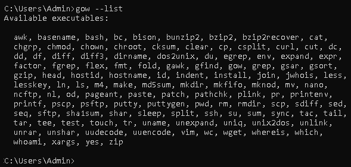
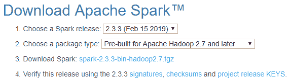
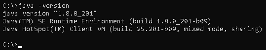
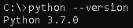
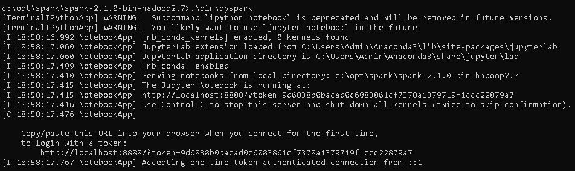
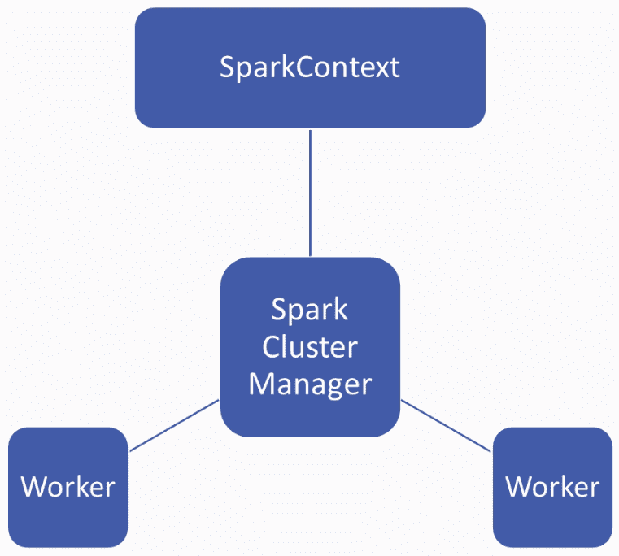
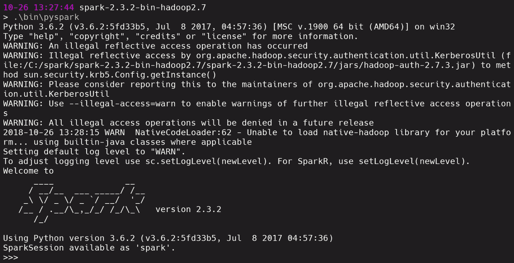

# 第一章：安装 Pyspark 并设置开发环境

在本章中，我们将介绍 Spark 并学习核心概念，如 SparkContext，以及 Spark 工具，如 SparkConf 和 Spark shell。唯一的先决条件是对基本 Python 概念的了解，并且希望从大数据中寻求洞察力。我们将学习如何使用 Spark SQL 分析和发现模式，以改进我们的业务智能。此外，您将能够通过设置 PySpark 来快速迭代解决方案。在本书结束时，您将能够使用 PySpark 处理真实的混乱数据集，从而获得实际的大数据经验。

在本章中，我们将涵盖以下主题：

+   PySpark 概述

+   在 Windows 上设置 Spark 和 PySpark

+   Spark 和 PySpark 中的核心概念

# PySpark 概述

在开始安装 PySpark 之前，PySpark 是 Spark 的 Python 接口，让我们先了解一些 Spark 和 PySpark 的核心概念。Spark 是 Apache 的最新大数据工具，可以通过简单地转到[`spark.apache.org/`](http://spark.apache.org/)找到。它是用于大规模数据处理的统一分析引擎。这意味着，如果您有大量数据，您可以将这些数据输入 Spark 以快速创建一些分析。如果我们比较 Hadoop 和 Spark 的运行时间，Spark 比 Hadoop 快一百倍以上。它非常易于使用，因为有非常好的 API 可用于与 Spark 一起使用。

Spark 平台的四个主要组件如下：

+   **Spark SQL**：Spark 的清理语言

+   **Spark Streaming**：允许您提供实时流数据

+   **MLlib（机器学习）**：Spark 的机器学习库

+   **GraphX（图形）**：Spark 的图形库

Spark 中的核心概念是 RDD，它类似于 pandas DataFrame，或 Python 字典或列表。这是 Spark 用来在基础设施上存储大量数据的一种方式。RDD 与存储在本地内存中的内容（如 pandas DataFrame）的关键区别在于，RDD 分布在许多机器上，但看起来像一个统一的数据集。这意味着，如果您有大量数据要并行操作，您可以将其放入 RDD 中，Spark 将为您处理并行化和数据的集群。

Spark 有三种不同的接口，如下所示：

+   Scala

+   Java

+   Python

Python 类似于 PySpark 集成，我们将很快介绍。现在，我们将从 PySpark 包中导入一些库，以帮助我们使用 Spark。我们理解 Spark 的最佳方式是查看示例，如下面的屏幕截图所示：

```py
lines = sc.textFile("data.txt")
lineLengths = lines.map(lambda s: len(s))
totalLength = lineLengths.reduce(lambda a, b: a + b)
```

在上面的代码中，我们通过调用`SC.textFile("data.txt")`创建了一个名为`lines`的新变量。`sc`是代表我们的 Spark 集群的 Python 对象。Spark 集群是一系列存储我们的 Spark 进程的实例或云计算机。通过调用`textFile`构造函数并输入`data.text`，我们可能已经输入了一个大型文本文件，并仅使用这一行创建了一个 RDD。换句话说，我们在这里要做的是将一个大型文本文件输入到分布式集群和 Spark 中，而 Spark 会为我们处理这个集群。

在第二行和第三行，我们有一个 MapReduce 函数。在第二行，我们使用`lambda`函数将长度函数映射到`data.text`的每一行。在第三行，我们调用了一个减少函数，将所有`lineLengths`相加，以产生文档的总长度。虽然 Python 的`lines`是一个包含`data.text`中所有行的变量，但在幕后，Spark 实际上正在处理`data.text`的片段在 Spark 集群上的两个不同实例上的分布，并处理所有这些实例上的 MapReduce 计算。

# Spark SQL

Spark SQL 是 Spark 平台上的四个组件之一，正如我们在本章中之前看到的。它可以用于执行 SQL 查询或从任何现有的 Hive 绝缘中读取数据，其中 Hive 也是来自 Apache 的数据库实现。Spark SQL 看起来非常类似于 MySQL 或 Postgres。以下代码片段是一个很好的例子：

```py
#Register the DataFrame as a SQL temporary view
df.CreateOrReplaceTempView("people")

sqlDF = spark.sql("SELECT * FROM people")
sqlDF.show()

#+----+-------+
#| age|   name|
#+----+-------+
#+null|Jackson|
#|  30| Martin|
#|  19| Melvin|
#+----|-------|
```

您需要从某个表中选择所有列，例如`people`，并使用 Spark 对象，您将输入一个非常标准的 SQL 语句，这将显示一个 SQL 结果，就像您从正常的 SQL 实现中所期望的那样。

现在让我们看看数据集和数据框。数据集是分布式数据集合。它是在 Spark 1.6 中添加的一个接口，提供了 RDD 的优势。另一方面，数据框对于那些使用过 pandas 或 R 的人来说非常熟悉。数据框只是一个组织成命名列的数据集，类似于关系数据库或 Python 中的数据框。数据集和数据框之间的主要区别在于数据框有列名。可以想象，这对于机器学习工作和输入到诸如 scikit-learn 之类的东西非常方便。

让我们看看如何使用数据框。以下代码片段是数据框的一个快速示例：

```py
# spark is an existing SparkSession
df = spark.read.json("examples/src/main/resources/people.json")
# Displays the content of the DataFrame to stdout
df.show()

#+----+-------+
#| age|   name|
#+----+-------+
#+null|Jackson|
#|  30| Martin|
#|  19| Melvin|
#+----|-------|
```

与 pandas 或 R 一样，`read.json`允许我们从 JSON 文件中输入一些数据，而`df.show`以类似于 pandas 的方式显示数据框的内容。

正如我们所知，MLlib 用于使机器学习变得可扩展和简单。MLlib 允许您执行常见的机器学习任务，例如特征化；创建管道；保存和加载算法、模型和管道；以及一些实用程序，例如线性代数、统计和数据处理。另一件事需要注意的是，Spark 和 RDD 几乎是不可分割的概念。如果您对 Spark 的主要用例是机器学习，Spark 现在实际上鼓励您使用基于数据框的 MLlib API，这对我们来说非常有益，因为我们已经熟悉 pandas，这意味着平稳过渡到 Spark。

在下一节中，我们将看到如何在 Windows 上设置 Spark，并设置 PySpark 作为接口。

# 在 Windows 上设置 Spark 和 PySpark

完成以下步骤，在 Windows 计算机上安装 PySpark：

1.  从[`github.com/bmatzelle/gow/releases/download/v0.8.0/Gow-0.8.0.exe`](https://github.com/bmatzelle/gow/releases/download/v0.8.0/Gow-0.8.0.exe)下载**Gnu on Windows**（**GOW**）。

1.  GOW 允许在 Windows 上使用 Linux 命令。我们可以使用以下命令来查看通过安装 GOW 允许的基本 Linux 命令：

```py
gow --list 
```

这会产生以下输出：



1.  下载并安装 Anaconda。如果需要帮助，可以参考以下教程：[`medium.com/@GalarnykMichael/install-python-on-windows-anaconda-c63c7c3d1444`](https://medium.com/@GalarnykMichael/install-python-on-windows-anaconda-c63c7c3d1444)。

1.  关闭先前的命令行，打开一个新的命令行。

1.  转到 Apache Spark 网站（[`spark.apache.org/`](https://spark.apache.org/)）。

1.  要下载 Spark，请从下拉菜单中选择以下内容：

+   最近的 Spark 版本

+   适当的软件包类型

以下屏幕截图显示了 Apache Spark 的下载页面：



1.  然后，下载 Spark。下载完成后，将文件移动到您想要解压缩的文件夹中。

1.  您可以手动解压缩，也可以使用以下命令：

```py
gzip -d spark-2.1.0-bin-hadoop2.7.tgz tar xvf spark-2.1.0-bin-hadoop2.7.tar
```

1.  现在，使用以下命令将`winutils.exe`下载到您的`spark-2.1.0-bin-hadoop2.7\bin`文件夹中：

```py
curl -k -L -o winutils.exe https://github.com/steveloughran/winutils/blob/master/hadoop-2.6.0/bin/winutils.exe?raw=true
```

1.  确保您的计算机上已安装 Java。您可以使用以下命令查看 Java 版本：

```py
java --version
```

这会产生以下输出：



1.  使用以下命令检查 Python 版本：

```py
python --version 
```

这会产生以下输出：



1.  让我们编辑我们的环境变量，这样我们可以在任何目录中打开 Spark，如下所示：

```py
setx SPARK_HOME C:\opt\spark\spark-2.1.0-bin-hadoop2.7
setx HADOOP_HOME C:\opt\spark\spark-2.1.0-bin-hadoop2.7
setx PYSPARK_DRIVER_PYTHON ipython
setx PYSPARK_DRIVER_PYTHON_OPTS notebook
```

将`C:\opt\spark\spark-2.1.0-bin-hadoop2.7\bin`添加到你的路径中。

1.  关闭终端，打开一个新的终端，并输入以下命令：

```py
--master local[2]
```

`PYSPARK_DRIVER_PYTHON`和`PYSPARK_DRIVER_PYTHON_OPTS`参数用于在 Jupyter Notebook 中启动 PySpark shell。`--master`参数用于设置主节点地址。

1.  接下来要做的是在`bin`文件夹中运行 PySpark 命令：

```py
.\bin\pyspark
```

这将产生以下输出：



# Spark 和 PySpark 中的核心概念

现在让我们来看看 Spark 和 PySpark 中的以下核心概念：

+   SparkContext

+   SparkConf

+   Spark shell

# SparkContext

SparkContext 是 Spark 中的一个对象或概念。它是一个大数据分析引擎，允许你以编程方式利用 Spark 的强大功能。

当你有大量数据无法放入本地机器或笔记本电脑时，Spark 的强大之处就显现出来了，因此你需要两台或更多计算机来处理它。在处理数据的同时，你还需要保持处理速度。我们不仅希望数据在几台计算机上进行计算，还希望计算是并行的。最后，你希望这个计算看起来像是一个单一的计算。

让我们考虑一个例子，我们有一个包含 5000 万个名字的大型联系人数据库，我们可能想从每个联系人中提取第一个名字。显然，如果每个名字都嵌入在一个更大的联系人对象中，将 5000 万个名字放入本地内存中是困难的。这就是 Spark 发挥作用的地方。Spark 允许你给它一个大数据文件，并将帮助处理和上传这个数据文件，同时为你处理在这个数据上进行的所有操作。这种能力由 Spark 的集群管理器管理，如下图所示：



集群管理器管理多个工作节点；可能有 2 个、3 个，甚至 100 个。关键是 Spark 的技术有助于管理这个工作节点集群，你需要一种方法来控制集群的行为，并在工作节点之间传递数据。

**SparkContext** 让你可以像使用 Python 对象一样使用 Spark 集群管理器的功能。因此，有了**SparkContext**，你可以传递作业和资源，安排任务，并完成从**SparkContext**到**Spark 集群管理器**的下游任务，然后**Spark 集群管理器**完成计算后将结果带回来。

让我们看看这在实践中是什么样子，以及如何设置 SparkContext：

1.  首先，我们需要导入`SparkContext`。

1.  创建一个新对象，将其赋给变量`sc`，代表使用`SparkContext`构造函数的 SparkContext。

1.  在`SparkContext`构造函数中，传递一个`local`上下文。在这种情况下，我们正在研究`PySpark`的实际操作，如下所示：

```py
from pyspark import SparkContext
sc = SparkContext('local', 'hands on PySpark')
```

1.  一旦我们建立了这一点，我们只需要使用`sc`作为我们 Spark 操作的入口点，就像下面的代码片段中所演示的那样：

```py
visitors = [10, 3, 35, 25, 41, 9, 29] df_visitors = sc.parallelize(visitors) df_visitors_yearly = df_visitors.map(lambda x: x*365).collect() print(df_visitors_yearly)
```

让我们举个例子；如果我们要分析我们服装店的虚拟数据集的访客数量，我们可能有一个表示每天访客数量的`visitors`列表。然后，我们可以创建一个 DataFrame 的并行版本，调用`sc.parallelize(visitors)`，并输入`visitors`数据集。`df_visitors`然后为我们创建了一个访客的 DataFrame。然后，我们可以映射一个函数；例如，通过映射一个`lambda`函数，将每日数字（`x`）乘以`365`，即一年中的天数，将其推断为一年的数字。然后，我们调用`collect()`函数，以确保 Spark 执行这个`lambda`调用。最后，我们打印出`df_visitors_yearly`。现在，我们让 Spark 在幕后处理我们的虚拟数据的计算，而这只是一个 Python 操作。

# Spark shell

我们将返回到我们的 Spark 文件夹，即`spark-2.3.2-bin-hadoop2.7`，然后通过输入`.\bin\pyspark`来启动我们的 PySpark 二进制文件。

我们可以看到我们已经在以下截图中启动了一个带有 Spark 的 shell 会话：



现在，Spark 对我们来说是一个`spark`变量。让我们在 Spark 中尝试一件简单的事情。首先要做的是加载一个随机文件。在每个 Spark 安装中，都有一个`README.md`的 markdown 文件，所以让我们将其加载到内存中，如下所示：

```py
text_file = spark.read.text("README.md")
```

如果我们使用`spark.read.text`然后输入`README.md`，我们会得到一些警告，但目前我们不必太担心这些，因为我们将在稍后看到如何解决这些问题。这里的主要问题是我们可以使用 Python 语法来访问 Spark。

我们在这里所做的是将`README.md`作为`spark`读取的文本数据放入 Spark 中，然后我们可以使用`text_file.count()`来让 Spark 计算我们的文本文件中有多少个字符，如下所示：

```py
text_file.count()
```

从中，我们得到以下输出：

```py
103
```

我们还可以通过以下方式查看第一行是什么：

```py
text_file.first()
```

我们将得到以下输出：

```py
Row(value='# Apache Spark')
```

现在，我们可以通过以下方式计算包含单词`Spark`的行数：

```py
lines_with_spark = text_file.filter(text_file.value.contains("Spark"))
```

在这里，我们使用`filter()`函数过滤了行，并在`filter()`函数内部指定了`text_file_value.contains`包含单词`"Spark"`，然后将这些结果放入了`lines_with_spark`变量中。

我们可以修改上述命令，简单地添加`.count()`，如下所示：

```py
text_file.filter(text_file.value.contains("Spark")).count()
```

现在我们将得到以下输出：

```py
20
```

我们可以看到文本文件中有`20`行包含单词`Spark`。这只是一个简单的例子，展示了我们如何使用 Spark shell。

# SparkConf

SparkConf 允许我们配置 Spark 应用程序。它将各种 Spark 参数设置为键值对，通常会使用`SparkConf()`构造函数创建一个`SparkConf`对象，然后从`spark.*`底层 Java 系统中加载值。

有一些有用的函数；例如，我们可以使用`sets()`函数来设置配置属性。我们可以使用`setMaster()`函数来设置要连接的主 URL。我们可以使用`setAppName()`函数来设置应用程序名称，并使用`setSparkHome()`来设置 Spark 将安装在工作节点上的路径。

您可以在[`spark.apache.org/docs/0.9.0/api/pyspark/pysaprk.conf.SparkConf-class.html`](https://spark.apache.org/docs/0.9.0/api/pyspark/pysaprk.conf.SparkConf-class.html)了解更多关于 SparkConf 的信息。

# 摘要

在本章中，我们学习了 Spark 和 PySpark 中的核心概念。我们学习了在 Windows 上设置 Spark 和使用 PySpark。我们还介绍了 Spark 的三大支柱，即 SparkContext、Spark shell 和 SparkConf。

在下一章中，我们将学习如何使用 RDD 将大数据导入 Spark 环境。
