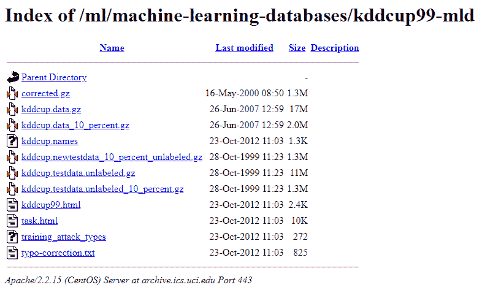
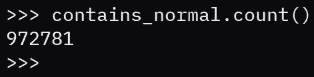
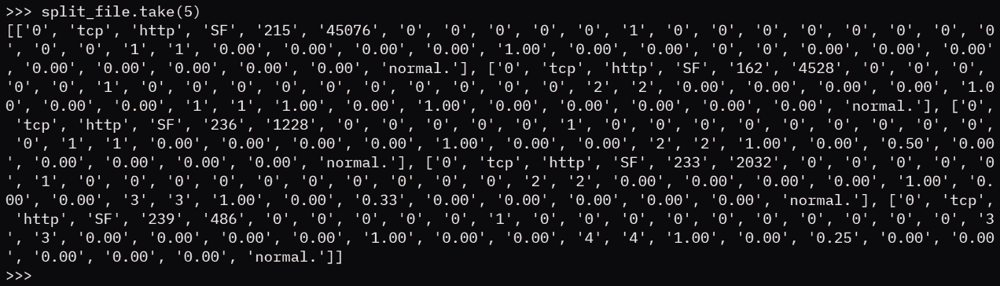

# 第二章：使用 RDD 将大数据导入 Spark 环境

主要是，本章将简要介绍如何使用**弹性分布式数据集**（**RDDs**）将大数据导入 Spark 环境。我们将使用各种工具来与和修改这些数据，以便提取有用的见解。我们将首先将数据加载到 Spark RDD 中，然后使用 Spark RDD 进行并行化。

在本章中，我们将涵盖以下主题：

+   将数据加载到 Spark RDD 中

+   使用 Spark RDD 进行并行化

+   RDD 操作的基础知识

# 将数据加载到 Spark RDD 中

在本节中，我们将看看如何将数据加载到 Spark RDD 中，并将涵盖以下主题：

+   UCI 机器学习数据库

+   从存储库将数据导入 Python

+   将数据导入 Spark

让我们首先概述一下 UCI 机器学习数据库。

# UCI 机器学习库

我们可以通过导航到[`archive.ics.uci.edu/ml/`](https://archive.ics.uci.edu/ml/)来访问 UCI 机器学习库。那么，UCI 机器学习库是什么？UCI 代表加州大学尔湾分校机器学习库，它是一个非常有用的资源，可以获取用于机器学习的开源和免费数据集。尽管 PySpark 的主要问题或解决方案与机器学习无关，但我们可以利用这个机会获取帮助我们测试 PySpark 功能的大型数据集。

让我们来看一下 KDD Cup 1999 数据集，我们将下载，然后将整个数据集加载到 PySpark 中。

# 将数据从存储库加载到 Spark

我们可以按照以下步骤下载数据集并将其加载到 PySpark 中：

1.  点击数据文件夹。

1.  您将被重定向到一个包含各种文件的文件夹，如下所示：



您可以看到有 kddcup.data.gz，还有 kddcup.data_10_percent.gz 中的 10%数据。我们将使用食品数据集。要使用食品数据集，右键单击 kddcup.data.gz，选择复制链接地址，然后返回到 PySpark 控制台并导入数据。

让我们看看如何使用以下步骤：

1.  启动 PySpark 后，我们需要做的第一件事是导入`urllib`，这是一个允许我们与互联网上的资源进行交互的库，如下所示：

```py
import urllib.request
```

1.  接下来要做的是使用这个`request`库从互联网上拉取一些资源，如下面的代码所示：

```py
f = urllib.request.urlretrieve("https://archive.ics.uci.edu/ml/machine-learning-databases/kddcup99-mld/kddcup.data.gz"),"kddcup.data.gz"
```

这个命令将需要一些时间来处理。一旦文件被下载，我们可以看到 Python 已经返回，控制台是活动的。

1.  接下来，使用`SparkContext`加载这个。所以，在 Python 中，`SparkContext`被实例化或对象化为`sc`变量，如下所示：

```py
sc
```

此输出如下面的代码片段所示：

```py
SparkContext
Spark UI
Version
 v2.3.3
Master
 local[*]
AppName
 PySparkShell
```

# 将数据导入 Spark

1.  接下来，使用`sc`将 KDD cup 数据加载到 PySpark 中，如下面的命令所示：

```py
raw_data = sc.textFile("./kddcup.data.gz")
```

1.  在下面的命令中，我们可以看到原始数据现在在`raw_data`变量中：

```py
raw_data
```

此输出如下面的代码片段所示：

```py
./kddcup.data,gz MapPartitionsRDD[3] at textFile at NativeMethodAccessorImpl.java:0
```

如果我们输入`raw_data`变量，它会给我们关于`kddcup.data.gz`的详细信息，其中包含数据文件的原始数据，并告诉我们关于`MapPartitionsRDD`。

现在我们知道如何将数据加载到 Spark 中，让我们学习一下如何使用 Spark RDD 进行并行化。

# 使用 Spark RDD 进行并行化

现在我们知道如何在从互联网接收的文本文件中创建 RDD，我们可以看一种不同的创建这个 RDD 的方法。让我们讨论一下如何使用我们的 Spark RDD 进行并行化。

在这一部分，我们将涵盖以下主题：

+   什么是并行化？

+   我们如何将 Spark RDD 并行化？

让我们从并行化开始。

# 什么是并行化？

了解 Spark 或任何语言的最佳方法是查看文档。如果我们查看 Spark 的文档，它清楚地说明，对于我们上次使用的`textFile`函数，它从 HDFS 读取文本文件。

另一方面，如果我们看一下`parallelize`的定义，我们可以看到这是通过分发本地 Scala 集合来创建 RDD。

使用`parallelize`创建 RDD 和使用`textFile`创建 RDD 之间的主要区别在于数据的来源。

让我们看看这是如何实际工作的。让我们回到之前离开的 PySpark 安装屏幕。因此，我们导入了`urllib`，我们使用`urllib.request`从互联网检索一些数据，然后我们使用`SparkContext`和`textFile`将这些数据加载到 Spark 中。另一种方法是使用`parallelize`。

让我们看看我们可以如何做到这一点。让我们首先假设我们的数据已经在 Python 中，因此，为了演示目的，我们将创建一个包含一百个数字的 Python 列表如下：

```py
a = range(100)
a
```

这给我们以下输出：

```py
range(0, 100)
```

例如，如果我们看一下`a`，它只是一个包含 100 个数字的列表。如果我们将其转换为`list`，它将显示我们的 100 个数字的列表：

```py
list (a)
```

这给我们以下输出：

```py
[0,
 1,
 2,
 3,
 4,
 5,
 6,
 7,
 8,
 9,
 10,
 11,
 12,
 13,
 14,
 15,
 16,
 17,
 18,
 19,
 20,
 21,
 22,
 23,
 24,
 25,
 26,
 27,
...
```

以下命令向我们展示了如何将其转换为 RDD：

```py
list_rdd = sc.parallelize(a)
```

如果我们看一下`list_rdd`包含什么，我们可以看到它是`PythonRDD.scala:52`，因此，这告诉我们 Scala 支持的 PySpark 实例已经识别出这是一个由 Python 创建的 RDD，如下所示：

```py
list_rdd
```

这给我们以下输出：

```py
PythonRDD[3] at RDD at PythonRDD.scala:52
```

现在，让我们看看我们可以用这个列表做什么。我们可以做的第一件事是通过以下命令计算`list_rdd`中有多少元素：

```py
list_rdd.count()
```

这给我们以下输出：

```py
100
```

我们可以看到`list_rdd`计数为 100。如果我们再次运行它而不切入结果，我们实际上可以看到，由于 Scala 在遍历 RDD 时是实时运行的，它比只运行`a`的长度要慢，后者是瞬时的。

然而，RDD 需要一些时间，因为它需要时间来遍历列表的并行化版本。因此，在小规模的情况下，只有一百个数字，可能没有这种权衡非常有帮助，但是对于更大量的数据和数据元素的更大个体大小，这将更有意义。

我们还可以从列表中取任意数量的元素，如下所示：

```py
list_rdd.take(10)
```

这给我们以下输出：

```py
[0, 1, 2, 3, 4, 5, 6, 7, 8, 9]
```

当我们运行上述命令时，我们可以看到 PySpark 在返回列表的前十个元素之前进行了一些计算。请注意，所有这些现在都由 PySpark 支持，并且我们正在使用 Spark 的功能来操作这个包含 100 个项目的列表。

现在让我们在`list_rdd`中使用`reduce`函数，或者在 RDDs 中一般使用，来演示我们可以用 PySpark 的 RDDs 做什么。我们将两个参数函数应用为匿名的`lambda`函数到`reduce`调用如下：

```py
list_rdd.reduce(lambda a, b: a+b)
```

在这里，`lambda`接受两个参数`a`和`b`。它简单地将这两个数字相加，因此`a+b`，并返回输出。通过`RDD`的`reduce`调用，我们可以依次将 RDD 列表的前两个数字相加，返回结果，然后将第三个数字添加到结果中，依此类推。因此，最终，通过使用`reduce`，您可以将所有 100 个数字添加到相同的结果中。

现在，在通过分布式数据库进行一些工作之后，我们现在可以看到，从`0`到`99`的数字相加得到`4950`，并且所有这些都是使用 PySpark 的 RDD 方法完成的。您可能会从 MapReduce 这个术语中认出这个函数，确实，它就是这样。

我们刚刚学习了在 PySpark 中并行化是什么，以及我们如何可以并行化 Spark RDDs。这实际上相当于我们创建 RDDs 的另一种方式，对我们非常有用。现在，让我们来看一些 RDD 操作的基础知识。

# RDD 操作的基础知识

现在让我们来看一些 RDD 操作的基础知识。了解某个功能的最佳方法是查看文档，以便我们可以严格理解函数的执行方式。

这是非常重要的原因是文档是函数定义和设计用途的黄金来源。通过阅读文档，我们确保我们在理解上尽可能接近源头。相关文档的链接是[`spark.apache.org/docs/latest/rdd-programming-guide.html`](https://spark.apache.org/docs/latest/rdd-programming-guide.html)。

让我们从`map`函数开始。`map`函数通过将`f`函数应用于此 RDD 的每个元素来返回一个 RDD。换句话说，它的工作方式与我们在 Python 中看到的`map`函数相同。另一方面，`filter`函数返回一个仅包含满足谓词的元素的新 RDD，该谓词是一个布尔值，通常由输入`filter`函数的`f`函数返回。同样，这与 Python 中的`filter`函数非常相似。最后，`collect()`函数返回一个包含此 RDD 中所有元素的列表。这就是我认为阅读文档真正发光的地方，当我们看到这样的说明时。如果你只是在谷歌搜索这个，这种情况永远不会出现在 Stack Overflow 或博客文章中。

因此，我们说`collect()`只有在预期结果数组很小的情况下才应该使用，因为所有数据都加载在驱动程序的内存中。这意味着，如果我们回想一下第一章，*安装 PySpark 并设置开发环境*，Spark 非常出色，因为它可以在许多不同的独立机器上收集和并行化数据，并且可以从一个终端透明地操作。`collect()`的说明是，如果我们调用`collect()`，则生成的 RDD 将完全加载到驱动程序的内存中，在这种情况下，我们将失去在 Spark 实例集群中分发数据的好处。

现在我们知道了所有这些，让我们看看如何实际将这三个函数应用于我们的数据。因此，返回到 PySpark 终端；我们已经将原始数据作为文本文件加载，就像我们在之前的章节中看到的那样。

我们将编写一个`filter`函数来查找所有包含单词`normal`的行，指示 RDD 数据，如下面的屏幕截图所示：

```py
contains_normal = raw_data.filter(lambda line: "normal." in line)
```

让我们分析一下这意味着什么。首先，我们正在为 RDD 原始数据调用`filter`函数，并且我们正在向其提供一个匿名的`lambda`函数，该函数接受一个`line`参数并返回谓词，正如我们在文档中所读到的，关于单词`normal`是否存在于该行中。此刻，正如我们在之前的章节中讨论的那样，我们实际上还没有计算这个`filter`操作。我们需要做的是调用一个实际整合数据并迫使 Spark 计算某些内容的函数。在这种情况下，我们可以依赖`contains_normal`，就像下面的屏幕截图中所示的那样：



您可以看到，在原始数据中，包含单词`normal`的行数超过了 970,000 行。要使用`filter`函数，我们提供了一个`lambda`函数，并使用一个整合函数，比如`counts`，来强制 Spark 计算和计算底层 DataFrame 中的数据。

对于第二个例子，我们将使用 map。由于我们下载了 KDD 杯数据，我们知道它是一个逗号分隔的值文件，因此，我们很容易做的一件事是通过两个逗号拆分每一行，如下所示：

```py
split_file = raw_data.map(lambda line: line.split(","))
```

让我们分析一下发生了什么。我们在`raw_data`上调用`map`函数。我们向它提供了一个名为`line`的匿名`lambda`函数，在这个函数中，我们使用`,`来分割`line`函数。结果是一个分割文件。现在，这里真正发挥了 Spark 的力量。回想一下，在`contains_normal.`过滤器中，当我们调用一个强制 Spark 计算`count`的函数时，需要几分钟才能得出正确的结果。如果我们执行`map`函数，它会产生相同的效果，因为我们需要对数百万行数据进行映射。因此，快速预览我们的映射函数是否正确运行的一种方法是，我们可以将几行材料化而不是整个文件。

为了做到这一点，我们可以使用之前使用过的`take`函数，如下面的截图所示：



这可能需要几秒钟，因为我们只取了五行，这是我们的分割，实际上相当容易管理。如果我们查看这个样本输出，我们可以理解我们的`map`函数已经成功创建。我们可以做的最后一件事是在原始数据上调用`collect()`，如下所示：

```py
raw_data.collect()
```

这旨在将 Spark 的 RDD 数据结构中的所有原始数据移动到内存中。

# 总结

在本章中，我们学习了如何在 Spark RDD 上加载数据，还介绍了 Spark RDD 的并行化。在加载数据之前，我们简要概述了 UCI 机器学习存储库。我们概述了基本的 RDD 操作，并检查了官方文档中的函数。

在下一章中，我们将介绍大数据清洗和数据整理。
