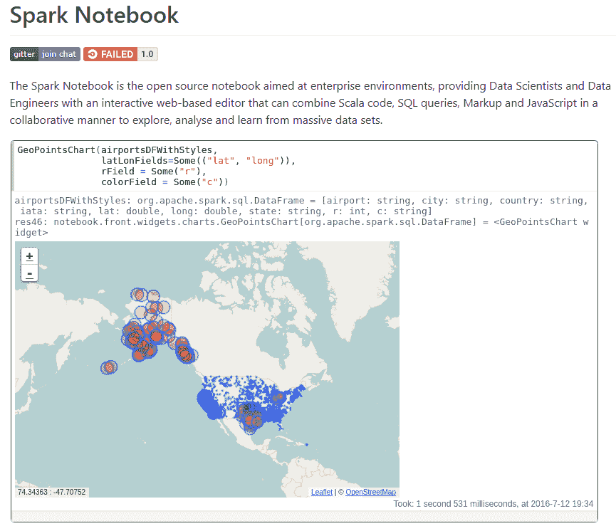
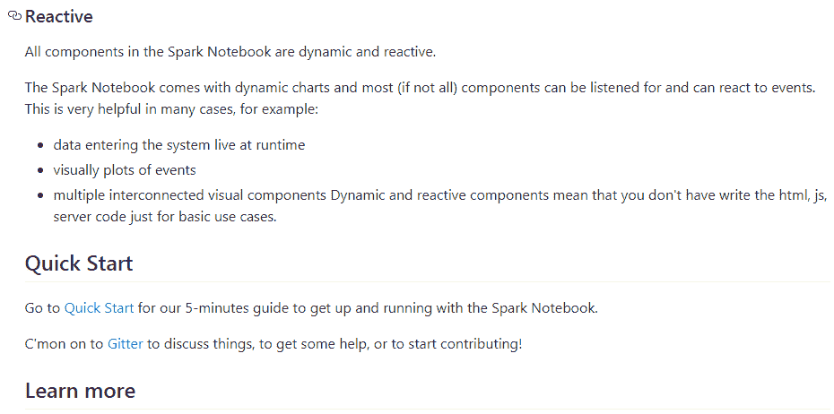
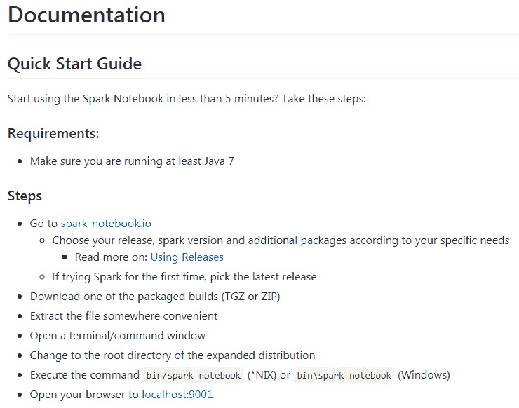
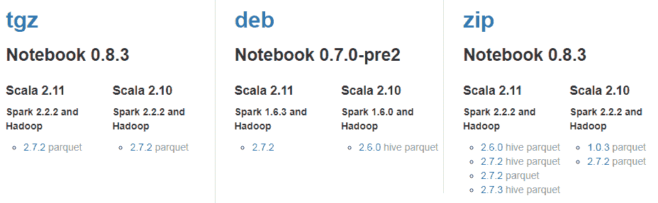
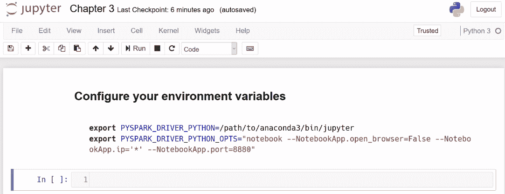
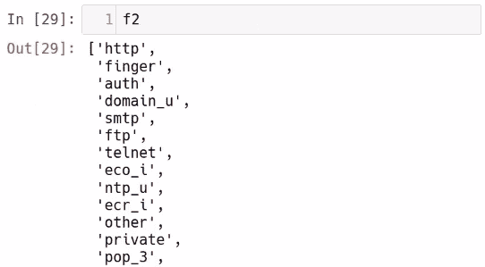

# 第三章：使用 Spark 笔记本进行大数据清洗和整理

在本章中，我们将学习使用 Spark 笔记本进行大数据清洗和整理。我们还将看看在笔记本应用程序上使用 Spark 如何有效地使用 RDD。我们将使用 Spark 笔记本快速迭代想法，并进行抽样/过滤 RDD 以挑选出相关数据点。我们还将学习如何拆分数据集并使用集合操作创建新的组合。

在本章中，我们将讨论以下主题：

+   使用 Spark 笔记本快速迭代想法

+   对 RDD 进行抽样/过滤以挑选出相关数据点

+   拆分数据集并创建一些新的组合

# 使用 Spark 笔记本快速迭代想法

在这一部分，我们将回答以下问题：

+   什么是 Spark 笔记本？

+   如何启动 Spark 笔记本？

+   如何使用 Spark 笔记本？

让我们从为 Spark 设置类似 Jupyter Notebook 的环境开始。Spark 笔记本只是一个使用 Scala 和 Spark 的交互式和反应式数据科学环境。

如果我们查看 GitHub 页面（[`github.com/spark-notebook/spark-notebook`](https://github.com/spark-notebook/spark-notebook)），我们会发现笔记本的功能实际上非常简单，如下截图所示：



如果我们看一下 Spark 笔记本，我们会发现它们看起来非常像 Python 开发人员使用的 Jupyter 笔记本。您可以在文本框中输入一些代码，然后在文本框下方执行代码，这与笔记本格式类似。这使我们能够使用 Apache Spark 和大数据生态系统执行可重现的分析。

因此，我们可以直接使用 Spark 笔记本，我们只需要转到 Spark 笔记本网站，然后点击“快速启动”即可启动笔记本，如下截图所示：



我们需要确保我们正在运行 Java 7。我们可以看到设置步骤也在文档中提到，如下截图所示：



Spark 笔记本的主要网站是`spark-notebook.io`，在那里我们可以看到许多选项。以下截图显示了其中一些选项：



我们可以下载 TAR 文件并解压缩。您可以使用 Spark 笔记本，但是在本书中我们将使用 Jupyter Notebook。因此，回到 Jupyter 环境，我们可以查看 PySpark 附带的代码文件。在`第三章`笔记本中，我们已经包含了一个方便的方法来设置环境变量，以使 PySpark 与 Jupyter 一起工作，如下截图所示：



首先，我们需要在我们的环境中创建两个新的环境变量。如果您使用 Linux，可以使用 Bash RC。如果您使用 Windows，您只需要更改和编辑系统环境变量。有多个在线教程可以帮助您完成此操作。我们要做的是编辑或包含`PYSPARK_DRIVER_PYTHON`变量，并将其指向您的 Jupyter Notebook 安装位置。如果您使用 Anaconda，可能会指向 Anaconda Jupyter Bash 文件。由于我们使用的是 WinPython，我已将其指向了我的 WinPython Jupyter Notebook Bash 文件。我们要导出的第二个环境变量只是`PYSPARK_DRIVER_PYTHON_OPTS`。

其中一个建议是，我们在选项中包括笔记本文件夹和笔记本应用程序，要求它不要在浏览器中打开，并告诉它要绑定到哪个端口。 在实践中，如果您使用的是 Windows 和 WinPython 环境，那么您实际上不需要在这里使用这行代码，您可以直接跳过它。 完成后，只需从命令行重新启动 PySpark。 发生的情况是，与我们以前看到的控制台不同，它直接启动到 Jupyter Notebook 实例，并且我们可以像在 Jupyter Notebook 中一样使用 Spark 和 SparkContext 变量。 因此，让我们测试一下，如下所示：

```py
sc
```

我们立即获得了我们的`SparkContext`，告诉我们 Spark 的版本是`2.3.3`，我们的`Master`是`local`，`AppName`是 Python SparkShell（`PySparkShell`），如下面的代码片段所示：

```py
SparkContext
Spark UI
Version
 v2.3.3
Master
 local[*]
AppName
 PySparkShell
```

因此，现在我们知道了如何在 Jupyter 中创建类似笔记本的环境。 在下一节中，我们将看一下对 RDD 进行抽样和过滤以挑选出相关数据点。

# 抽样/过滤 RDD 以挑选出相关数据点

在本节中，我们将查看对 RDD 进行抽样和过滤以挑选出相关数据点。 这是一个非常强大的概念，它使我们能够规避大数据的限制，并在特定样本上执行我们的计算。

现在让我们检查抽样不仅加速了我们的计算，而且还给了我们对我们试图计算的统计量的良好近似。 为此，我们首先导入`time`库，如下所示：

```py
from time import time
```

我们接下来要做的是查看 KDD 数据库中包含单词`normal`的行或数据点：

```py
raw_data = sc.textFile("./kdd.data.gz")
```

我们需要创建`raw_data`的样本。 我们将样本存储到`sample`变量中，我们正在从`raw_data`中进行无替换的抽样。 我们正在抽样数据的 10％，并且我们提供`42`作为我们的随机种子：

```py
sampled = raw_data.sample(False, 0.1, 42)
```

接下来要做的是链接一些`map`和`filter`函数，就像我们通常处理未抽样数据集一样：

```py
contains_normal_sample = sampled.map(lambda x: x.split(",")).filter(lambda x: "normal" in x)
```

接下来，我们需要计算在样本中计算行数需要多长时间：

```py
t0 = time()
num_sampled = contains_normal_sample.count()
duration = time() - t0
```

我们在这里发布计数声明。 正如您从上一节中所知，这将触发 PySpark 中`contains_normal_sample`中定义的所有计算，并且我们记录了样本计数发生之前的时间。 我们还记录了样本计数发生后的时间，这样我们就可以看到在查看样本时需要多长时间。 一旦完成了这一点，让我们来看看以下代码片段中`duration`持续了多长时间：

```py
duration
```

输出将如下所示：

```py
23.724565505981445
```

我们花了 23 秒来运行这个操作，占数据的 10％。 现在，让我们看看如果我们在所有数据上运行相同的转换会发生什么：

```py
contains_normal = raw_data.map(lambda x: x.split(",")).filter(lambda x: "normal" in x)
t0 = time()
num_sampled = contains_normal.count()
duration = time() - t0
```

让我们再次看一下`duration`：

```py
duration 
```

这将提供以下输出：

```py
36.51565098762512
```

有一个小差异，因为我们正在比较`36.5`秒和`23.7`秒。 但是，随着数据集变得更加多样化，以及您处理的数据量变得更加复杂，这种差异会变得更大。 这其中的好处是，如果您通常处理大数据，使用数据的小样本验证您的答案是否合理可以帮助您更早地捕捉错误。

最后要看的是我们如何使用`takeSample`。 我们只需要使用以下代码：

```py
data_in_memory = raw_data.takeSample(False, 10, 42)
```

正如我们之前学到的，当我们呈现新函数时，我们调用`takeSample`，它将给我们`10`个具有随机种子`42`的项目，现在我们将其放入内存。 现在这些数据在内存中，我们可以使用本机 Python 方法调用相同的`map`和`filter`函数，如下所示：

```py
contains_normal_py = [line.split(",") for line in data_in_memory if "normal" in line]
len(contains_normal_py)
```

输出将如下所示：

```py
1
```

我们现在通过将`data_in_memory`带入来计算我们的`contains_normal`函数。 这很好地说明了 PySpark 的强大之处。

我们最初抽取了 10,000 个数据点的样本，这导致了机器崩溃。 因此，在这里，我们将取这十个数据点，看看它是否包含单词`normal`。

我们可以看到在前一个代码块中计算已经完成，它比在 PySpark 中进行计算花费了更长的时间并且使用了更多的内存。这就是为什么我们使用 Spark，因为 Spark 允许我们并行处理任何大型数据集，并且以并行方式操作它，这意味着我们可以用更少的内存和更少的时间做更多的事情。在下一节中，我们将讨论拆分数据集并使用集合操作创建新的组合。

# 拆分数据集并创建一些新的组合

在本节中，我们将看看如何拆分数据集并使用集合操作创建新的组合。我们将学习特别是减法和笛卡尔积。

让我们回到我们一直在查看包含单词`normal`的数据集中的行的 Jupyter 笔记本的`第三章`。让我们尝试获取不包含单词`normal`的所有行。一种方法是使用`filter`函数查看不包含`normal`的行。但是，在 PySpark 中我们可以使用一些不同的东西：一个名为`subtract`的函数来取整个数据集并减去包含单词`normal`的数据。让我们看看以下片段：

```py
normal_sample = sampled.filter(lambda line: "normal." in line)
```

然后我们可以通过从整个样本中减去`normal`样本来获得不包含单词`normal`的交互或数据点如下：

```py
non_normal_sample = sampled.subtract(normal_sample)
```

我们取`normal`样本，然后从整个样本中减去它，这是整个数据集的 10%。让我们按如下方式发出一些计数：

```py
sampled.count()
```

这将为我们提供以下输出：

```py
490705
```

正如你所看到的，数据集的 10%给我们`490705`个数据点，其中有一些包含单词`normal`的数据点。要找出它的计数，写下以下代码：

```py
normal_sample.count()
```

这将为我们提供以下输出：

```py
97404
```

所以，这里有`97404`个数据点。如果我们计算正常样本，因为我们只是从另一个样本中减去一个样本，计数应该大约略低于 400,000 个数据点，因为我们有 490,000 个数据点减去 97,000 个数据点，这应该导致大约 390,000。让我们看看使用以下代码片段会发生什么：

```py
non_normal_sample.count()
```

这将为我们提供以下输出：

```py
393301
```

正如预期的那样，它返回了`393301`的值，这验证了我们的假设，即减去包含`normal`的数据点会给我们所有非正常的数据点。

现在让我们讨论另一个名为`cartesian`的函数。这允许我们给出两个不同特征的不同值之间的所有组合。让我们看看以下代码片段中这是如何工作的：

```py
feature_1 = sampled.map(lambda line: line.split(",")).map(lambda features: features[1]).distinct()
```

在这里，我们使用`,`来拆分`line`函数。因此，我们将拆分逗号分隔的值 - 对于拆分后得到的所有特征，我们取第一个特征，并找到该列的所有不同值。我们可以重复这个过程来获取第二个特征，如下所示：

```py
feature_2 = sampled.map(lambda line: line.split(",")).map(lambda features: features[2]).distinct()
```

因此，我们现在有两个特征。我们可以查看`feature_1`和`feature_2`中的实际项目，如下所示，通过发出我们之前看到的`collect()`调用：

```py
f1 = feature_1.collect()
f2 = feature_2.collect()
```

让我们分别看一下如下：

```py
f1
```

这将提供以下结果：

```py
['tcp', 'udp', 'icmp']
```

所以，`f1`有三个值；让我们检查`f2`如下：

```py
f2
```

这将为我们提供以下输出：



`f2`有更多的值，我们可以使用`cartesian`函数收集`f1`和`f2`之间的所有组合如下：

```py
len(feature_1.cartesian(feature_2).collect())
```

这将为我们提供以下输出：

```py
198
```

这是我们如何使用`cartesian`函数找到两个特征之间的笛卡尔积。在本章中，我们看了 Spark 笔记本；抽样、过滤和拆分数据集；以及使用集合操作创建新的组合。

# 摘要

在本章中，我们看了 Spark 笔记本进行快速迭代。然后我们使用抽样或过滤来挑选出相关的数据点。我们还学会了如何拆分数据集并使用集合操作创建新的组合。

在下一章中，我们将介绍将数据聚合和汇总为有用的报告。
