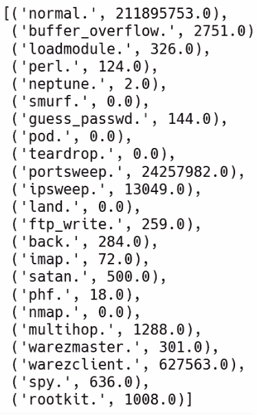
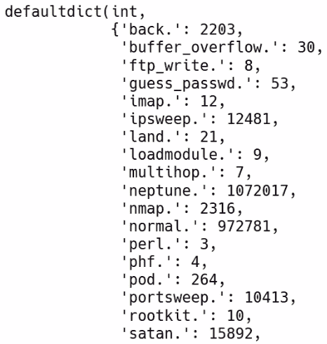

# 第四章：将数据聚合和汇总为有用的报告

在本章中，我们将学习如何将数据聚合和汇总为有用的报告。我们将学习如何使用 `map` 和 `reduce` 函数计算平均值，执行更快的平均计算，并使用键值对数据点的数据透视表。

本章中，我们将涵盖以下主题：

+   使用 `map` 和 `reduce` 计算平均值

+   使用聚合进行更快的平均计算

+   使用键值对数据点进行数据透视表

# 使用 map 和 reduce 计算平均值

在本节中，我们将回答以下三个主要问题：

+   我们如何计算平均值？

+   什么是 map？

+   什么是 reduce？

您可以在[`spark.apache.org/docs/latest/api/python/pyspark.html?highlight=map#pyspark.RDD.map`](https://spark.apache.org/docs/latest/api/python/pyspark.html?highlight=map#pyspark.RDD.map)上查看文档。

`map` 函数接受两个参数，其中一个是可选的。`map` 的第一个参数是 `f`，它是一个应用于整个 RDD 的函数。第二个参数或参数是 `preservesPartitioning` 参数，默认值为 `False`。

如果我们查看文档，它说 `map` 通过将函数应用于此 RDD 的每个元素来简单地返回一个新的 RDD，显然，此函数指的是我们输入到 `map` 函数本身的 `f`。文档中有一个非常简单的例子，如果我们并行化一个包含三个字符 `b`、`a` 和 `c` 的 `rdd` 方法，并且我们映射一个创建每个元素的元组的函数，那么我们将创建一个包含三个元组的列表，其中原始字符放在元组的第一个元素中，整数 `1` 放在第二个元素中，如下所示：

```py
rdd =  sc.paralleize(["b", "a", "c"])
sorted(rdd.map(lambda x: (x, 1)).collect())
```

这将给我们以下输出：

```py
[('a', 1), ('b', 1), ('c', 1)]
```

`reduce` 函数只接受一个参数，即 `f`。`f` 是一个将列表减少为一个数字的函数。从技术角度来看，指定的可交换和可结合的二进制运算符减少了此 RDD 的元素。

让我们使用我们一直在使用的 KDD 数据来举个例子。我们启动我们的 Jupyter Notebook 实例，它链接到一个 Spark 实例，就像我们以前做过的那样。然后我们通过从本地磁盘加载 `kddcup.data.gz` 文本文件来创建一个 `raw_data` 变量，如下所示：

```py
raw_data = sc.textFile("./kddcup.data.gz")
```

接下来要做的是将此文件拆分为 `csv`，然后我们将过滤包含单词 `normal` 的特征 41 的行：

```py
csv = raw_data.map(lambda x: x.split(","))
normal_data = csv.filter(lambda x: x[41]=="normal.")
```

然后我们使用 `map` 函数将这些数据转换为整数，最后，我们可以使用 `reduce` 函数来计算 `total_duration`，然后我们可以打印 `total_duration` 如下：

```py
duration = normal_data.map(lambda x: int(x[0]))
total_duration = duration.reduce(lambda x, y: x+y)
total_duration
```

然后我们将得到以下输出：

```py
211895753
```

接下来要做的是将 `total_duration` 除以数据的计数，如下所示：

```py
total_duration/(normal_data.count())
```

这将给我们以下输出：

```py
217.82472416710442
```

稍微计算后，我们将使用 `map` 和 `reduce` 创建两个计数。我们刚刚学会了如何使用 PySpark 计算平均值，以及 PySpark 中的 `map` 和 `reduce` 函数是什么。

# 使用聚合进行更快的平均计算

在上一节中，我们看到了如何使用 `map` 和 `reduce` 计算平均值。现在让我们看看如何使用 `aggregate` 函数进行更快的平均计算。您可以参考前一节中提到的文档。

`aggregate` 是一个带有三个参数的函数，其中没有一个是可选的。

第一个是 `zeroValue` 参数，我们在其中放入聚合结果的基本情况。

第二个参数是顺序运算符 (`seqOp`)，它允许您在 `zeroValue` 之上堆叠和聚合值。您可以从 `zeroValue` 开始，将您的 RDD 中的值传递到 `seqOp` 函数中，并将其堆叠或聚合到 `zeroValue` 之上。

最后一个参数是`combOp`，表示组合操作，我们只需将通过`seqOp`参数聚合的`zeroValue`参数组合成一个值，以便我们可以使用它来完成聚合。

因此，我们正在聚合每个分区的元素，然后使用组合函数和中性零值对所有分区的结果进行聚合。在这里，我们有两件事需要注意：

1.  `op`函数允许修改`t1`，但不应修改`t2`

1.  第一个函数`seqOp`可以返回不同的结果类型`U`

在这种情况下，我们都需要一个操作来将`T`合并到`U`，以及一个操作来合并这两个`U`。

让我们去我们的 Jupyter Notebook 检查这是如何完成的。`aggregate`允许我们同时计算总持续时间和计数。我们调用`duration_count`函数。然后我们取`normal_data`并对其进行聚合。请记住，聚合有三个参数。第一个是初始值；也就是零值，`(0,0)`。第二个是一个顺序操作，如下所示：

```py
duration_count = duration.aggregate(
 (0,0),
 (lambda db, new_value: (db[0] + new_value, db[1] + 1))
)
```

我们需要指定一个具有两个参数的`lambda`函数。第一个参数是当前的累加器，或者聚合器，或者也可以称为数据库（`db`）。然后，在我们的`lambda`函数中，我们有第二个参数`new_value`，或者我们在 RDD 中处理的当前值。我们只是想对数据库做正确的事情，也就是说，我们知道我们的数据库看起来像一个元组，第一个元素是持续时间的总和，第二个元素是计数。在这里，我们知道我们的数据库看起来像一个元组，持续时间的总和是第一个元素，计数是第二个元素。每当我们查看一个新值时，我们需要将新值添加到当前的运行总数中，并将`1`添加到当前的运行计数中。

运行总数是第一个元素，`db[0]`。然后我们只需要将`1`添加到第二个元素`db[1]`，即计数。这是顺序操作。

每当我们得到一个`new_value`，如前面的代码块所示，我们只需将其添加到运行总数中。而且，因为我们已经将`new_value`添加到运行总数中，我们需要将计数增加`1`。其次，我们需要放入组合器操作。现在，我们只需要将两个单独的数据库`db1`和`db2`的相应元素组合如下：

```py
duration_count = duration.aggregate(
 (0,0),
 (lambda db, new_value: (db[0] + new_value, db[1] + 1)),
 (lambda db1, db2: (db1[0] + db2[0], db1[1] + db2[1]))
)
```

由于持续时间计数是一个元组，它在第一个元素上收集了我们的总持续时间，在第二个元素上记录了我们查看的持续时间数量，计算平均值非常简单。我们需要将第一个元素除以第二个元素，如下所示：

```py
duration_count[0]/duration_count[1]
```

这将给我们以下输出：

```py
217.82472416710442
```

您可以看到它返回了与我们在上一节中看到的相同的结果，这很棒。在下一节中，我们将看一下带有键值对数据点的数据透视表。

# 带有键值对数据点的数据透视表

数据透视表非常简单且易于使用。我们将使用大型数据集，例如 KDD 杯数据集，并根据某些键对某些值进行分组。

例如，我们有一个包含人和他们最喜欢的水果的数据集。我们想知道有多少人把苹果作为他们最喜欢的水果，因此我们将根据水果将人数进行分组，这是值，而不是键。这就是数据透视表的简单概念。

我们可以使用`map`函数将 KDD 数据集移动到键值对范例中。我们使用`lambda`函数将数据集的特征`41`映射到`kv`键值，并将值附加如下：

```py
kv = csv.map(lambda x: (x[41], x))
kv.take(1)
```

我们使用特征`41`作为键，值是数据点，即`x`。我们可以使用`take`函数来获取这些转换行中的一个，以查看其外观。

现在让我们尝试类似于前面的例子。为了找出特征`41`中每种数值的总持续时间，我们可以再次使用`map`函数，简单地将`41`特征作为我们的键。我们可以将数据点中第一个数字的浮点数作为我们的值。我们将使用`reduceByKey`函数来减少每个键的持续时间。

因此，`reduceByKey`不仅仅是减少所有数据点，而是根据它们所属的键来减少持续时间数字。您可以在[`spark.apache.org/docs/latest/api/python/pyspark.html?highlight=map#pyspark.RDD.reduceByKey`](https://spark.apache.org/docs/latest/api/python/pyspark.html?highlight=map#pyspark.RDD.reduceByKey)上查看文档。`reduceByKey`使用关联和交换的`reduce`函数合并每个键的值。它在将结果发送到减速器之前在每个映射器上执行本地合并，这类似于 MapReduce 中的组合器。

`reduceByKey`函数只需一个参数。我们将使用`lambda`函数。我们取两个不同的持续时间并将它们相加，PySpark 足够聪明，可以根据键应用这个减少函数，如下所示：

```py
kv_duration = csv.map(lambda x: (x[41], float(x[0]))).reduceByKey(lambda x, y: x+y)
kv_duration.collect()
```

结果输出如下截图所示：



如果我们收集键值持续时间数据，我们可以看到持续时间是由出现在特征`41`中的值收集的。如果我们在 Excel 中使用数据透视表，有一个方便的函数是`countByKey`函数，它执行的是完全相同的操作，如下所示：

```py
kv.countByKey()
```

这将给我们以下输出：



您可以看到调用`kv.countByKey()`函数与调用`reduceByKey`函数相同，先前是从键到持续时间的映射。 

# 摘要

在本章中，我们学习了如何使用`map`和`reduce`计算平均值。我们还学习了使用`aggregate`进行更快的平均计算。最后，我们了解到数据透视表允许我们根据特征的不同值对数据进行聚合，并且在 PySpark 中，我们可以利用`reducedByKey`或`countByKey`等方便的函数。

在下一章中，我们将学习关于 MLlib 的内容，其中涉及机器学习，这是一个非常热门的话题。
