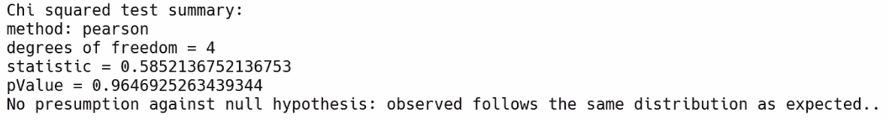

# 第五章：使用 MLlib 进行强大的探索性数据分析

在本章中，我们将探索 Spark 执行回归任务的能力，使用线性回归和支持向量机等模型。我们将学习如何使用 MLlib 计算汇总统计，并使用 Pearson 和 Spearman 相关性发现数据集中的相关性。我们还将在大型数据集上测试我们的假设。

我们将涵盖以下主题：

+   使用 MLlib 计算汇总统计

+   使用 Pearson 和 Spearman 方法发现相关性

+   在大型数据集上测试我们的假设

# 使用 MLlib 计算汇总统计

在本节中，我们将回答以下问题：

+   什么是汇总统计？

+   我们如何使用 MLlib 创建汇总统计？

MLlib 是随 Spark 一起提供的机器学习库。最近有一个新的发展，允许我们使用 Spark 的数据处理能力传输到 Spark 本身的机器学习能力。这意味着我们不仅可以使用 Spark 来摄取、收集和转换数据，还可以分析和使用它来构建 PySpark 平台上的机器学习模型，这使我们能够拥有更无缝的可部署解决方案。

汇总统计是一个非常简单的概念。我们熟悉某个变量的平均值、标准差或方差。这些是数据集的汇总统计。之所以称其为汇总统计，是因为它通过某个统计量给出了某个东西的摘要。例如，当我们谈论数据集的平均值时，我们正在总结数据集的一个特征，而这个特征就是平均值。

让我们看看如何在 Spark 中计算汇总统计。关键因素在于`colStats`函数。`colStats`函数计算`rdd`输入的逐列汇总统计。`colStats`函数接受一个参数，即`rdd`，并允许我们使用 Spark 计算不同的汇总统计。

让我们看一下 Jupyter Notebook 中的代码（可在[`github.com/PacktPublishing/Hands-On-Big-Data-Analytics-with-PySpark/tree/master/Chapter05`](https://github.com/PacktPublishing/Hands-On-Big-Data-Analytics-with-PySpark/tree/master/Chapter05)找到），在`Chapter5.ipynb`中的本章。我们将首先从`kddcup.data.gz`文本文件中收集数据，并将其传输到`raw_data`变量中：

```py
raw_data = sc.textFile("./kddcup.data.gz")
```

`kddcup.data`文件是一个逗号分隔值（CSV）文件。我们必须通过`,`字符拆分这些数据，并将其放入`csv`变量中，如下所示：

```py
csv = raw_data.map(lambda x: x.split(","))
```

让我们取数据文件的第一个特征`x[0]`；这个特征代表`持续时间`，也就是数据的方面。我们将把它转换为整数，并将其包装成列表，如下所示：

```py
duration = csv.map(lambda x: [int(x[0])])
```

这有助于我们对多个变量进行汇总统计，而不仅仅是其中一个。要激活`colStats`函数，我们需要导入`Statistics`包，如下面的代码片段所示：

```py
from pyspark.mllib.stat import Statistics
```

这个`Statistics`包是`pyspark.mllib.stat`的一个子包。现在，我们需要在`Statistics`包中调用`colStats`函数，并向其提供一些数据。这里，我们谈论的是数据集中的`持续时间`数据，并将汇总统计信息输入到`summary`变量中：

```py
summary = Statistics.colStats(duration)
```

要访问不同的汇总统计，如平均值、标准差等，我们可以调用`summary`对象的函数，并访问不同的汇总统计。例如，我们可以访问`mean`，由于我们的`持续时间`数据集中只有一个特征，我们可以通过`00`索引对其进行索引，然后得到数据集的平均值，如下所示：

```py
summary.mean()[0]
```

这将给我们以下输出：

```py
47.97930249928637
```

同样，如果我们从 Python 标准库中导入`sqrt`函数，我们可以创建数据集中持续时间的标准差，如下面的代码片段所示：

```py
from math import sqrt
sqrt(summary.variance()[0])
```

这将给我们以下输出：

```py
707.746472305374
```

如果我们不使用`[0]`对摘要统计信息进行索引，我们可以看到`summary.max()`和`summary.min()`会返回一个数组，其中第一个元素是我们所需的摘要统计信息，如下面的代码片段所示：

```py
summary.max()
array ([58329.]) #output
summary.min()
array([0.])  #output
```

# 使用 Pearson 和 Spearman 相关性来发现相关性

在这一部分，我们将看到在数据集中计算相关性的两种不同方法，这两种方法分别称为 Pearson 和 Spearman 相关性。

# Pearson 相关性

Pearson 相关系数向我们展示了两个不同变量同时变化的程度，然后根据它们的变化程度进行调整。如果你有一个数据集，这可能是计算相关性最流行的方法之一。

# Spearman 相关性

Spearman 秩相关不是内置在 PySpark 中的默认相关计算，但它非常有用。Spearman 相关系数是排名变量之间的 Pearson 相关系数。使用不同的相关性观察方法可以让我们更全面地理解相关性的工作原理。让我们看看在 PySpark 中如何计算这个。

# 计算 Pearson 和 Spearman 相关性

为了理解这一点，让我们假设我们正在从数据集中取出前三个数值变量。为此，我们要访问之前定义的`csv`变量，我们只需使用逗号（`,`）分割`raw_data`。我们只考虑前三列是数值的特征。我们不会取包含文字的任何内容；我们只对纯粹基于数字的特征感兴趣。在我们的例子中，在`kddcup.data`中，第一个特征的索引是`0`；特征 5 和特征 6 的索引分别是`4`和`5`，这些是我们拥有的数值变量。我们使用`lambda`函数将这三个变量放入一个列表中，并将其放入`metrics`变量中：

```py
metrics = csv.map(lambda x: [x[0], x[4], x[5]])
Statistics.corr(metrics, method="spearman")
```

这将给我们以下输出：

```py
array([[1\.       ,  0.01419628,  0.29918926],
 [0.01419628,  1\.        , -0.16793059],
 [0.29918926, -0.16793059,  1\.        ]])
```

在*使用 MLlib 计算摘要统计信息*部分，我们只是将第一个特征放入一个列表中，并创建了一个长度为 1 的列表。在这里，我们将三个变量的三个量放入同一个列表中。现在，每个列表的长度都是三。

为了计算相关性，我们在`metrics`变量上调用`corr`方法，并指定`method`为`"spearman"`。PySpark 会给我们一个非常简单的矩阵，告诉我们变量之间的相关性。在我们的例子中，`metrics`变量中的第三个变量比第二个变量更相关。

如果我们再次在`metrics`上运行`corr`，但指定方法为`pearson`，那么它会给我们 Pearson 相关性。因此，让我们看看为什么我们需要有资格称为数据科学家或机器学习研究人员来调用这两个简单的函数，并简单地改变第二个参数的值。许多机器学习和数据科学都围绕着我们对统计学的理解，对数据行为的理解，对机器学习模型基础的理解以及它们的预测能力是如何产生的。

因此，作为一个机器学习从业者或数据科学家，我们只是把 PySpark 当作一个大型计算器来使用。当我们使用计算器时，我们从不抱怨计算器使用简单——事实上，它帮助我们以更直接的方式完成目标。PySpark 也是一样的情况；一旦我们从数据工程转向 MLlib，我们会注意到代码变得逐渐更容易。它试图隐藏数学的复杂性，但我们需要理解不同相关性之间的差异，也需要知道如何以及何时使用它们。

# 在大型数据集上测试我们的假设

在本节中，我们将研究假设检验，并学习如何使用 PySpark 测试假设。让我们看看 PySpark 中实现的一种特定类型的假设检验。这种假设检验称为 Pearson 卡方检验。卡方检验评估了两个数据集之间的差异是由偶然因素引起的可能性有多大。

例如，如果我们有一个没有任何人流量的零售店，突然之间有了人流量，那么这是随机发生的可能性有多大，或者现在我们得到的访客水平与以前相比是否有任何统计学上显著的差异？之所以称之为卡方检验，是因为测试本身参考了卡方分布。您可以参考在线文档了解更多关于卡方分布的信息。

Pearson 的卡方检验有三种变体。我们将检查观察到的数据集是否与理论数据集分布不同。

让我们看看如何实现这一点。让我们从`pyspark.mllib.linalg`中导入`Vectors`包开始。使用这个向量，我们将创建一个存储中每天访客频率的密集向量。

假设访问频率从每小时的 0.13 到 0.61，0.8，0.5，最后在星期五结束时为 0.3。因此，我们将这些访客频率放入`visitors_freq`变量中。由于我们使用 PySpark，我们可以很容易地从`Statistics`包中运行卡方检验，我们已经导入如下：

```py
from pyspark.mllib.linalg import Vectors
visitors_freq = Vectors.dense(0.13, 0.61, 0.8, 0.5, 0.3)
print(Statistics.chiSqTest(visitors_freq))
```

通过运行卡方检验，`visitors_freq`变量为我们提供了大量有用的信息，如下截图所示：



前面的输出显示了卡方检验的摘要。我们使用了`pearson`方法，在我们的 Pearson 卡方检验中有 4 个自由度，统计数据为 0.585，这意味着`pValue`为 0.964。这导致没有反对零假设的推定。这样，观察到的数据遵循与预期相同的分布，这意味着我们的访客实际上并没有不同。这使我们对假设检验有了很好的理解。

# 摘要

在本章中，我们学习了摘要统计信息并使用 MLlib 计算摘要统计信息。我们还了解了 Pearson 和 Spearman 相关性，以及如何使用 PySpark 在数据集中发现这些相关性。最后，我们学习了一种特定的假设检验方法，称为 Pearson 卡方检验。然后，我们使用 PySpark 的假设检验函数在大型数据集上测试了我们的假设。

在下一章中，我们将学习如何在 Spark SQL 中处理大数据的结构。
