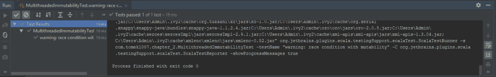

# 第八章：不可变设计

在本章中，我们将看看 Apache Spark 的不可变设计。我们将深入研究 Spark RDD 的父/子链，并以不可变的方式使用 RDD。然后，我们将使用 DataFrame 操作进行转换，以讨论在高度并发的环境中的不可变性。在本章结束时，我们将以不可变的方式使用数据集 API。

在这一章中，我们将涵盖以下主题：

+   深入研究 Spark RDD 的父/子链

+   以不可变的方式使用 RDD

+   使用 DataFrame 操作进行转换

+   在高度并发的环境中的不可变性

+   以不可变的方式使用数据集 API

# 深入研究 Spark RDD 的父/子链

在本节中，我们将尝试实现我们自己的 RDD，继承 RDD 的父属性。

我们将讨论以下主题：

+   扩展 RDD

+   与父 RDD 链接新的 RDD

+   测试我们的自定义 RDD

# 扩展 RDD

这是一个有很多隐藏复杂性的简单测试。让我们从创建记录的列表开始，如下面的代码块所示：

```py
class InheritanceRdd extends FunSuite {
  val spark: SparkContext = SparkSession
    .builder().master("local[2]").getOrCreate().sparkContext

  test("use extended RDD") {
    //given
    val rdd = spark.makeRDD(List(Record(1, "d1")))
```

`Record`只是一个具有`amount`和`description`的案例类，所以`amount`是 1，`d1`是描述。

然后我们创建了`MultipledRDD`并将`rdd`传递给它，然后将乘数设置为`10`，如下面的代码所示：

```py
val extendedRdd = new MultipliedRDD(rdd, 10)
```

我们传递父 RDD，因为它包含在另一个 RDD 中加载的数据。通过这种方式，我们构建了两个 RDD 的继承链。

# 与父 RDD 链接新的 RDD

我们首先创建了一个多重 RDD 类。在`MultipliedRDD`类中，我们有两个传递参数的东西：

+   记录的简要 RDD，即`RDD[Record]`

+   乘数，即`Double`

在我们的情况下，可能会有多个 RDD 的链，这意味着我们的 RDD 中可能会有多个 RDD。因此，这并不总是所有有向无环图的父级。我们只是扩展了类型为记录的 RDD，因此我们需要传递扩展的 RDD。

RDD 有很多方法，我们可以覆盖任何我们想要的方法。但是，这一次，我们选择了`compute`方法，我们将覆盖计算乘数的方法。在这里，我们获取`Partition`分区和`TaskContext`。这些是执行引擎传递给我们方法的，因此我们不需要担心这一点。但是，我们需要返回与我们通过继承链中的 RDD 类传递的类型完全相同的迭代器。这将是记录的迭代器。

然后我们执行第一个父逻辑，第一个父只是获取我们链中的第一个 RDD。这里的类型是`Record`，我们获取`split`和`context`的`iterator`，其中`split`只是将要执行的分区。我们知道 Spark RDD 是由分区器分区的，但是在这里，我们只是获取我们需要拆分的特定分区。因此，迭代器获取分区和任务上下文，因此它知道应该从该迭代方法返回哪些值。对于迭代器中的每条记录，即`salesRecord`，如`amount`和`description`，我们将`amount`乘以传递给构造函数的`multiplier`来获得我们的`Double`。

通过这样做，我们已经将我们的金额乘以了乘数，然后我们可以返回具有新金额的新记录。因此，我们现在有了旧记录乘以我们的“乘数”的金额和`salesRecord`的描述。对于第二个过滤器，我们需要“覆盖”的是`getPartitions`，因为我们希望保留父 RDD 的分区。例如，如果之前的 RDD 有 100 个分区，我们也希望我们的`MultipledRDD`有 100 个分区。因此，我们希望保留关于分区的信息，而不是丢失它。出于同样的原因，我们只是将其代理给`firstParent`。RDD 的`firstParent`然后只会从特定 RDD 中获取先前的分区。

通过这种方式，我们创建了一个新的`multipliedRDD`，它传递了父级和乘数。对于我们的`extendedRDD`，我们需要`collect`它并调用`toList`，我们的列表应该包含`10`和`d1`，如下例所示：

```py
extendedRdd.collect().toList should contain theSameElementsAs List(
 Record(10, "d1")
 )
 }
}
```

当我们创建新的 RDD 时，计算会自动执行，因此它总是在没有显式方法调用的情况下执行。

# 测试我们的自定义 RDD

让我们开始这个测试，以检查这是否已经创建了我们的 RDD。通过这样做，我们可以扩展我们的父 RDD 并向我们的 RDD 添加行为。这在下面的截图中显示：

```py
"C:\Program Files\Java\jdk-12\bin\java.exe" "-javaagent:C:\Program Files\JetBrains\IntelliJ IDEA 2018.3.5\lib\idea_rt.jar=51687:C:\Program Files\JetBrains\IntelliJ IDEA 2018.3.5\bin" -Dfile.encoding=UTF-8 -classpath C:\Users\Sneha\IdeaProjects\Chapter07\out\production\Chapter07 com.company.Main

Process finished with exit code 0
```

在下一节中，我们将以不可变的方式使用 RDD。

# 以不可变的方式使用 RDD

现在我们知道如何使用 RDD 继承创建执行链，让我们学习如何以不可变的方式使用 RDD。

在这一部分，我们将讨论以下主题：

+   理解 DAG 的不可变性

+   从一个根 RDD 创建两个叶子

+   检查两个叶子的结果

让我们首先了解有向无环图的不可变性以及它给我们带来了什么。然后，我们将从一个节点 RDD 创建两个叶子，并检查如果我们在一个叶子 RDD 上创建一个转换，那么两个叶子是否完全独立地行为。然后，我们将检查当前 RDD 的两个叶子的结果，并检查对任何叶子的任何转换是否不会改变或影响根 RDD。以这种方式工作是至关重要的，因为我们发现我们将无法从根 RDD 创建另一个叶子，因为根 RDD 将被更改，这意味着它将是可变的。为了克服这一点，Spark 设计师为我们创建了一个不可变的 RDD。

有一个简单的测试来显示 RDD 应该是不可变的。首先，我们将从`0 到 5`创建一个 RDD，它被添加到来自 Scala 分支的序列中。`to`获取`Int`，第一个参数是一个隐式参数，来自 Scala 包，如下例所示：

```py
class ImmutableRDD extends FunSuite {
    val spark: SparkContext = SparkSession
        .builder().master("local[2]").getOrCreate().sparkContext

test("RDD should be immutable") {
    //given
    val data = spark.makeRDD(0 to 5)
```

一旦我们有了 RDD 数据，我们可以创建第一个叶子。第一个叶子是一个结果（`res`），我们只是将每个元素乘以`2`。让我们创建第二个叶子，但这次它将被标记为`4`，如下例所示：

```py
//when
val res = data.map(_ * 2)

val leaf2 = data.map(_ * 4)
```

所以，我们有我们的根 RDD 和两个叶子。首先，我们将收集第一个叶子，并看到其中的元素为`0, 2, 4, 6, 8, 10`，所以这里的一切都乘以`2`，如下例所示：

```py
//then
res.collect().toList should contain theSameElementsAs List(
    0, 2, 4, 6, 8, 10
)
```

然而，即使我们在`res`上有了通知，数据仍然与一开始的完全相同，即`0, 1, 2, 3, 4, 5`，如下例所示：

```py
data.collect().toList should contain theSameElementsAs List(
    0, 1, 2, 3, 4, 5
    )
  }
}
```

所以，一切都是不可变的，执行`* 2`的转换并没有改变我们的数据。如果我们为`leaf2`创建一个测试，我们将`collect`它并调用`toList`。我们会看到它应该包含像`0, 4, 8, 12, 16, 20`这样的元素，如下例所示：

```py
leaf2.collect().toList should contain theSameElementsAs List(
 0, 4, 8, 12, 16, 20
)
```

当我们运行测试时，我们会看到我们执行中的每条路径，即数据或第一个叶子和第二个叶子，彼此独立地行为，如下面的代码输出所示：

```py
"C:\Program Files\Java\jdk-12\bin\java.exe" "-javaagent:C:\Program Files\JetBrains\IntelliJ IDEA 2018.3.5\lib\idea_rt.jar=51704:C:\Program Files\JetBrains\IntelliJ IDEA 2018.3.5\bin" -Dfile.encoding=UTF-8 -classpath C:\Users\Sneha\IdeaProjects\Chapter07\out\production\Chapter07 com.company.Main

Process finished with exit code 0
```

每次变异都是不同的；我们可以看到测试通过了，这表明我们的 RDD 是不可变的。

# 使用 DataFrame 操作进行转换

API 的数据下面有一个 RDD，因此 DataFrame 是不可变的。在 DataFrame 中，不可变性甚至更好，因为我们可以动态地添加和减去列，而不改变源数据集。

在这一部分，我们将涵盖以下主题：

+   理解 DataFrame 的不可变性

+   从一个根 DataFrame 创建两个叶子

+   通过发出转换来添加新列

我们将首先使用操作的数据来转换我们的 DataFrame。首先，我们需要了解 DataFrame 的不可变性，然后我们将从一个根 DataFrame 创建两个叶子，但这次是。然后，我们将发出一个略有不同于 RDD 的转换。这将向我们的结果 DataFrame 添加一个新列，因为我们在 DataFrame 中是这样操作的。如果我们想要映射数据，那么我们需要从第一列中获取数据，进行转换，并保存到另一列，然后我们将有两列。如果我们不再感兴趣，我们可以删除第一列，但结果将是另一个 DataFrame。

因此，我们将有第一个 DataFrame 有一列，第二个有结果和源，第三个只有一个结果。让我们看看这一部分的代码。

我们将创建一个 DataFrame，所以我们需要调用`toDF()`方法。我们将使用`"a"`作为`"1"`，`"b"`作为`"2"`，`"d"`作为`"200"`来创建`UserData`。`UserData`有`userID`和`data`两个字段，都是`String`类型，如下例所示：

```py
test("Should use immutable DF API") {
 import spark.sqlContext.implicits._
 //given
 val userData =
 spark.sparkContext.makeRDD(List(
 UserData("a", "1"),
 UserData("b", "2"),
 UserData("d", "200")
 )).toDF()
```

在测试中使用案例类创建 RDD 是很重要的，因为当我们调用 DataFrame 时，这部分将推断模式并相应地命名列。以下代码是这方面的一个例子，我们只从`userData`中的`userID`列中进行过滤：

```py
//when
    val res = userData.filter(userData("userId").isin("a"))
```

我们的结果应该只有一条记录，所以我们要删除两列，但是我们创建的`userData`源将有 3 行。因此，通过过滤对其进行修改，创建了另一个名为`res`的 DataFrame，而不修改输入的`userData`，如下例所示：

```py
    assert(res.count() == 1)
    assert(userData.count() == 3)

    }
}
```

让我们开始这个测试，看看来自 API 的不可变数据的行为，如下屏幕截图所示：

```py
"C:\Program Files\Java\jdk-12\bin\java.exe" "-javaagent:C:\Program Files\JetBrains\IntelliJ IDEA 2018.3.5\lib\idea_rt.jar=51713:C:\Program Files\JetBrains\IntelliJ IDEA 2018.3.5\bin" -Dfile.encoding=UTF-8 -classpath C:\Users\Sneha\IdeaProjects\Chapter07\out\production\Chapter07 com.company.Main

Process finished with exit code 0
```

正如我们所看到的，我们的测试通过了，并且从结果（`res`）中，我们知道我们的父级没有被修改。因此，例如，如果我们想在`res.map()`上映射一些东西，我们可以映射`userData`列，如下例所示：

```py
res.map(a => a.getString("userId") + "can")
```

另一个叶子将具有一个额外的列，而不更改`userId`源代码，因此这就是 DataFrame 的不可变性。

# 高并发环境中的不可变性

我们看到了不可变性如何影响程序的创建和设计，现在我们将了解它的用途。

在本节中，我们将涵盖以下主题：

+   可变集合的缺点

+   创建两个同时修改可变集合的线程

+   推理并发程序

让我们首先了解可变集合的原因。为此，我们将创建两个同时修改可变集合的线程。我们将使用此代码进行测试。首先，我们将创建一个`ListBuffer`，它是一个可变列表。然后，我们可以添加和删除链接，而无需为任何修改创建另一个列表。然后，我们可以创建一个具有两个线程的`Executors`服务。我们需要两个线程同时开始修改状态。稍后，我们将使用`Java.util.concurrent`中的`CountDownLatch`构造。这在下面的例子中显示：

```py
import java.util.concurrent.{CountDownLatch, Executors}
import org.scalatest.FunSuite
import scala.collection.mutable.ListBuffer
class MultithreadedImmutabilityTest extends FunSuite {

test("warning: race condition with mutability") {
//given
var listMutable = new ListBuffer[String]()
val executors = Executors.newFixedThreadPool(2)
val latch = new CountDownLatch(2)
```

`CountDownLatch`是一种构造，它帮助我们阻止线程处理，直到我们要求它们开始。我们需要等待逻辑，直到两个线程开始执行。然后，我们向`executors`提交一个`Runnable`，我们的`run()`方法通过发出`countDown()`来表示准备好进行操作，并将`"A"`添加到`listMutable`，如下例所示：

```py
 //when
 executors.submit(new Runnable {
     override def run(): Unit = {
         latch.countDown()
         listMutable += "A"
     }
 })
```

然后，另一个线程启动，并且也使用`countDown`来表示它已准备好开始。但首先，它会检查列表是否包含`"A"`，如果没有，就会添加`"A"`，如下例所示：

```py
 executors.submit(new Runnable {
     override def run(): Unit = {
         latch.countDown()
         if(!listMutable.contains("A")) {
             listMutable += "A"
         }
     }
 })
```

然后，我们使用`await()`等待`countDown`发出，当它发出时，我们可以继续验证我们的程序，如下例所示：

```py
    latch.await()
```

`listMutable`包含`"A"`或可能包含`"A","A"`。`listMutable`检查列表是否包含`"A"`,如果没有，它将不会添加该元素，如下例所示：

```py
    //then
    //listMutable can have ("A") or ("A","A")
    }
}
```

但这里存在竞争条件。在检查`if(!listMutable.contains("A"))`之后，`run()`线程可能会将`"A"`元素添加到列表中。但我们在`if`中，所以我们将通过`listMutable += "A"`添加另一个`"A"`。由于状态的可变性以及它通过另一个线程进行了修改，我们可能会有`"A"`或`"A","A"`。

在使用可变状态时需要小心，因为我们不能有这样一个损坏的状态。为了缓解这个问题，我们可以在`java.util`集合上使用同步列表。

但如果我们有同步块，那么我们的程序将非常慢，因为我们需要独占地访问它。我们还可以使用`java.util.concurrent.locks`包中的`lock`。我们可以使用`ReadLock`或`WriteLock`等实现。在下面的例子中，我们将使用`WriteLock`：

```py
val lock = new WriteLock()
```

我们还需要对我们的`lock()`进行`lock`，然后再进行下一步，如下例所示：

```py
lock.lock()
```

之后，我们可以使用`unlock()`。然而，我们也应该在第二个线程中这样做，这样我们的列表只有一个元素，如下例所示：

```py
lock.unlock()
```

输出如下：



锁定是一个非常艰难和昂贵的操作，因此不可变性是性能程序的关键。

# 以不可变的方式使用数据集 API

在本节中，我们将以不可变的方式使用数据集 API。我们将涵盖以下主题：

+   数据集的不可变性

+   从一个根数据集创建两个叶子

+   通过发出转换添加新列

数据集的测试用例非常相似，但我们需要对我们的数据进行`toDS()`以确保类型安全。数据集的类型是`userData`，如下例所示：

```py
import com.tomekl007.UserData
import org.apache.spark.sql.SparkSession
import org.scalatest.FunSuite

class ImmutableDataSet extends FunSuite {
 val spark: SparkSession = SparkSession
 .builder().master("local[2]").getOrCreate()

test("Should use immutable DF API") {
 import spark.sqlContext.implicits._
 //given
 val userData =
 spark.sparkContext.makeRDD(List(
 UserData("a", "1"),
 UserData("b", "2"),
 UserData("d", "200")
 )).toDF()
```

现在，我们将发出对`userData`的过滤，并指定`isin`，如下例所示：

```py
   //when
    val res = userData.filter(userData("userId").isin("a"))
```

它将返回结果（`res`），这是一个带有我们的`1`元素的叶子。由于这个明显的根，`userData`仍然有`3`个元素。让我们执行这个程序，如下例所示：

```py
    assert(res.count() == 1)
    assert(userData.count() == 3)

 }
}
```

我们可以看到我们的测试通过了，这意味着数据集也是 DataFrame 之上的不可变抽象，并且具有相同的特性。`userData`有一个非常有用的类型集，如果使用`show()`方法，它将推断模式并知道`"a"`字段是字符串或其他类型，如下例所示：

```py
userData.show()
```

输出将如下所示：

```py
+------+----+
|userId|data|
|----- |----|
|     a|   1|
|     b|   2|
|     d| 200|
+------|----+ 
```

在前面的输出中，我们有`userID`和`data`字段。

# 总结

在本章中，我们深入研究了 Spark RDD 的父子链，并创建了一个能够根据父 RDD 计算一切的乘数 RDD，还基于父 RDD 的分区方案。我们以不可变的方式使用了 RDD。我们看到，从父级创建的叶子的修改并没有修改部分。我们还学习了一个更好的抽象，即 DataFrame，因此我们学会了可以在那里使用转换。然而，每个转换只是添加到另一列，而不是直接修改任何内容。接下来，我们只需在高度并发的环境中设置不可变性。我们看到了当访问多个线程时，可变状态是不好的。最后，我们看到数据集 API 也是以不可变的方式创建的，我们可以在这里利用这些特性。

在下一章中，我们将看看如何避免洗牌和减少个人开支。
