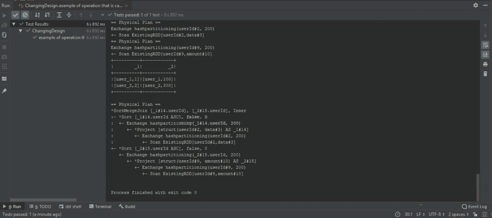
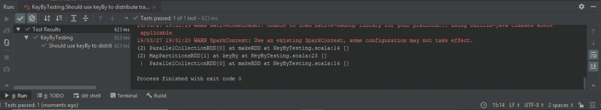
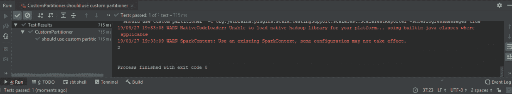

# 第九章：避免洗牌和减少操作费用

在本章中，我们将学习如何避免洗牌并减少我们作业的操作费用，以及检测过程中的洗牌。然后，我们将测试在 Apache Spark 中导致洗牌的操作，以找出我们何时应该非常小心以及我们应该避免哪些操作。接下来，我们将学习如何改变具有广泛依赖关系的作业设计。之后，我们将使用`keyBy()`操作来减少洗牌，在本章的最后一节中，我们将看到如何使用自定义分区来减少数据的洗牌。

在本章中，我们将涵盖以下主题：

+   检测过程中的洗牌

+   在 Apache Spark 中进行导致洗牌的测试操作

+   改变具有广泛依赖关系的作业设计

+   使用`keyBy()`操作来减少洗牌

+   使用自定义分区器来减少洗牌

# 检测过程中的洗牌

在本节中，我们将学习如何检测过程中的洗牌。

在本节中，我们将涵盖以下主题：

+   加载随机分区的数据

+   使用有意义的分区键发出重新分区

+   通过解释查询来理解洗牌是如何发生的

我们将加载随机分区的数据，以查看数据是如何加载的以及数据加载到了哪里。接下来，我们将使用有意义的分区键发出一个分区。然后，我们将使用确定性和有意义的键将数据重新分区到适当的执行程序。最后，我们将使用`explain()`方法解释我们的查询并理解洗牌。在这里，我们有一个非常简单的测试。

我们将创建一个带有一些数据的 DataFrame。例如，我们创建了一个带有一些随机 UID 和`user_1`的`InputRecord`，以及另一个带有`user_1`中随机 ID 的输入，以及`user_2`的最后一条记录。假设这些数据是通过外部数据系统加载的。数据可以从 HDFS 加载，也可以从数据库加载，例如 Cassandra 或 NoSQL：

```py
class DetectingShuffle extends FunSuite {
  val spark: SparkSession = SparkSession.builder().master("local[2]").getOrCreate()

  test("should explain plan showing logical and physical with UDF and DF") {
    //given
    import spark.sqlContext.implicits._
    val df = spark.sparkContext.makeRDD(List(
      InputRecord("1234-3456-1235-1234", "user_1"),
      InputRecord("1123-3456-1235-1234", "user_1"),
      InputRecord("1123-3456-1235-9999", "user_2")
    )).toDF()
```

在加载的数据中，我们的数据没有预定义或有意义的分区，这意味着输入记录编号 1 可能会最先出现在执行程序中，而记录编号 2 可能会最先出现在执行程序中。因此，即使数据来自同一用户，我们也很可能会为特定用户执行操作。

如前一章第八章中所讨论的，*不可变设计*，我们使用了`reducebyKey()`方法，该方法获取用户 ID 或特定 ID 以减少特定键的所有值。这是一个非常常见的操作，但具有一些随机分区。最好使用有意义的键`repartition`数据。

在使用`userID`时，我们将使用`repartition`的方式，使结果记录具有相同用户 ID 的数据。因此，例如`user_1`最终将出现在第一个执行程序上：

```py
//when
    val q = df.repartition(df("userId"))
```

第一个执行程序将拥有所有`userID`的数据。如果`InputRecord("1234-3456-1235-1234", "user_1")`在执行程序 1 上，而`InputRecord("1123-3456-1235-1234", "user_1")`在执行程序 2 上，在对来自执行程序 2 的数据进行分区后，我们需要将其发送到执行程序 1，因为它是此分区键的父级。这会导致洗牌。洗牌是由于加载数据而导致的，这些数据没有有意义地分区，或者根本没有分区。我们需要处理我们的数据，以便我们可以对特定键执行操作。

我们可以进一步`repartition`数据，但应该在链的开头进行。让我们开始测试来解释我们的查询：

```py
 q.explain(true)
```

我们在逻辑计划中对`userID`表达式进行了重新分区，但当我们检查物理计划时，显示使用了哈希分区，并且我们将对`userID`值进行哈希处理。因此，我们扫描所有 RDD 和所有具有相同哈希的键，并将其发送到相同的执行程序以实现我们的目标：

！[](img/d4014b30-3c14-4244-8bdd-4ed9875fa4d4.png)

在下一节中，我们将测试在 Apache Spark 中导致洗牌的操作。

# 在 Apache Spark 中进行导致洗牌的测试操作

在本节中，我们将测试在 Apache Spark 中导致洗牌的操作。我们将涵盖以下主题：

+   使用 join 连接两个 DataFrame

+   使用分区不同的两个 DataFrame

+   测试导致洗牌的连接

连接是一种特定的操作，会导致洗牌，我们将使用它来连接我们的两个 DataFrame。我们将首先检查它是否会导致洗牌，然后我们将检查如何避免它。为了理解这一点，我们将使用两个分区不同的 DataFrame，并检查连接两个未分区或随机分区的数据集或 DataFrame 的操作。如果它们位于不同的物理机器上，将会导致洗牌，因为没有办法连接具有相同分区键的两个数据集。

在我们连接数据集之前，我们需要将它们发送到同一台物理机器上。我们将使用以下测试。

我们需要创建`UserData`，这是一个我们已经见过的案例类。它有用户 ID 和数据。我们有用户 ID，即`user_1`，`user_2`和`user_4`：

```py
test("example of operation that is causing shuffle") {
    import spark.sqlContext.implicits._
    val userData =
    spark.sparkContext.makeRDD(List(
        UserData("user_1", "1"),
        UserData("user_2", "2"),
        UserData("user_4", "200")
    )).toDS()
```

然后我们创建一些类似于用户 ID（`user_1`，`user_2`和`user_3`）的交易数据：

```py
val transactionData =
    spark.sparkContext.makeRDD(List(
        UserTransaction("user_1", 100),
        UserTransaction("user_2", 300),
        UserTransaction("user_3", 1300)
    )).toDS()
```

我们使用`joinWith`在`UserData`上的交易，使用`UserData`和`transactionData`的`userID`列。由于我们发出了`inner`连接，结果有两个元素，因为记录和交易之间有连接，即`UserData`和`UserTransaction`。但是，`UserData`没有交易，`Usertransaction`没有用户数据：

```py
//shuffle: userData can stay on the current executors, but data from
//transactionData needs to be send to those executors according to joinColumn
//causing shuffle
//when
val res: Dataset[(UserData, UserTransaction)]
= userData.joinWith(transactionData, userData("userId") === transactionData("userId"), "inner")
```

当我们连接数据时，数据没有分区，因为这是 Spark 的一些随机数据。它无法知道用户 ID 列是分区键，因为它无法猜测。由于它没有预分区，要连接来自两个数据集的数据，需要将数据从用户 ID 发送到执行器。因此，由于数据没有分区，将会有大量数据从执行器洗牌。

让我们解释查询，执行断言，并通过启动测试显示结果：

```py
//then
 res.show()
 assert(res.count() == 2)
 }
}
```

我们可以看到我们的结果如下：

```py
+------------+-------------+
|         _1 |           _2|
+----------- +-------------+
+ [user_1,1] | [user_1,100]|
| [user_2,2] | [user_2,300]|
+------------+-------------+
```

我们有`[user_1,1]`和`[user_1,100]`，即`userID`和`userTransaction`。看起来连接工作正常，但让我们看看物理参数。我们使用`SortMergeJoin`对第一个数据集和第二个数据集使用`userID`，然后我们使用`Sort`和`hashPartitioning`。

在前一节中，*检测过程中的洗牌*，我们使用了`partition`方法，该方法在底层使用了`hashPartitioning`。虽然我们使用了`join`，但我们仍然需要使用哈希分区，因为我们的数据没有正确分区。因此，我们需要对第一个数据集进行分区，因为会有大量的洗牌，然后我们需要对第二个 DataFrame 做完全相同的事情。再次，洗牌将会进行两次，一旦数据根据连接字段进行分区，连接就可以在执行器本地进行。

在执行物理计划后，将对记录进行断言，指出`userID`用户数据一与用户交易`userID`一位于同一执行器上。没有`hashPartitioning`，就没有保证，因此我们需要进行分区。

在下一节中，我们将学习如何更改具有广泛依赖的作业的设计，因此我们将看到如何在连接两个数据集时避免不必要的洗牌。

# 更改具有广泛依赖的作业的设计

在本节中，我们将更改在未分区数据上执行`join`的作业。我们将更改具有广泛依赖的作业的设计。

在本节中，我们将涵盖以下主题：

+   使用公共分区键对 DataFrame 进行重新分区

+   理解使用预分区数据进行连接

+   理解我们如何避免洗牌

我们将在 DataFrame 上使用`repartition`方法，使用一个公共分区键。我们发现，当进行连接时，重新分区会在底层发生。但通常，在使用 Spark 时，我们希望在 DataFrame 上执行多个操作。因此，当我们与其他数据集执行连接时，`hashPartitioning`将需要再次执行。如果我们在加载数据时进行分区，我们将避免再次分区。

在这里，我们有我们的示例测试用例，其中包含我们之前在 Apache Spark 的“导致洗牌的测试操作”部分中使用的数据。我们有`UserData`，其中包含三条用户 ID 的记录 - `user_1`，`user_2`和`user_4` - 以及`UserTransaction`数据，其中包含用户 ID - 即`user_1`，`user_2`，`user_3`：

```py
test("example of operation that is causing shuffle") {
    import spark.sqlContext.implicits._
    val userData =
        spark.sparkContext.makeRDD(List(
            UserData("user_1", "1"),
            UserData("user_2", "2"),
            UserData("user_4", "200")
        )).toDS()
```

然后，我们需要对数据进行`repartition`，这是要做的第一件非常重要的事情。我们使用`userId`列来重新分区我们的`userData`：

```py
val repartitionedUserData = userData.repartition(userData("userId"))
```

然后，我们将使用`userId`列重新分区我们的数据，这次是针对`transactionData`：

```py
 val repartitionedTransactionData = transactionData.repartition(transactionData("userId"))
```

一旦我们重新分区了我们的数据，我们就可以确保具有相同分区键的任何数据 - 在本例中是`userId` - 将落在同一个执行器上。因此，我们的重新分区数据将不会有洗牌，连接将更快。最终，我们能够进行连接，但这次我们连接的是预分区的数据：

```py
//when
//data is already partitioned using join-column. Don't need to shuffle
val res: Dataset[(UserData, UserTransaction)]
= repartitionedUserData.joinWith(repartitionedTransactionData, userData("userId") === transactionData("userId"), "inner")
```

我们可以使用以下代码显示我们的结果：

```py
 //then
 res.show()
 assert(res.count() == 2)
 }
}
```

输出显示在以下截图中：



在上述截图中，我们有用户 ID 和交易的物理计划。我们对用户 ID 数据和交易数据的用户 ID 列执行了哈希分区。在连接数据之后，我们可以看到数据是正确的，并且连接有一个物理计划。

这次，物理计划有点不同。

我们有一个`SortMergeJoin`操作，并且我们正在对我们的数据进行排序，这些数据在我们执行引擎的上一步已经预分区。这样，我们的 Spark 引擎将执行排序合并连接，无需进行哈希连接。它将正确排序数据，连接将更快。

在下一节中，我们将使用`keyBy()`操作来进一步减少洗牌。

# 使用 keyBy()操作来减少洗牌

在本节中，我们将使用`keyBy()`操作来减少洗牌。我们将涵盖以下主题：

+   加载随机分区的数据

+   尝试以有意义的方式预分区数据

+   利用`keyBy()`函数

我们将加载随机分区的数据，但这次使用 RDD API。我们将以有意义的方式重新分区数据，并提取底层正在进行的信息，类似于 DataFrame 和 Dataset API。我们将学习如何利用`keyBy()`函数为我们的数据提供一些结构，并在 RDD API 中引起预分区。

本节中我们将使用以下测试。我们创建两个随机输入记录。第一条记录有一个随机用户 ID，`user_1`，第二条记录有一个随机用户 ID，`user_1`，第三条记录有一个随机用户 ID，`user_2`：

```py
test("Should use keyBy to distribute traffic properly"){
    //given
    val rdd = spark.sparkContext.makeRDD(List(
        InputRecord("1234-3456-1235-1234", "user_1"),
        InputRecord("1123-3456-1235-1234", "user_1"),
        InputRecord("1123-3456-1235-9999", "user_2")
    ))
```

我们将使用`rdd.toDebugString`提取 Spark 底层发生的情况：

```py
println(rdd.toDebugString)
```

此时，我们的数据是随机分布的，用户 ID 字段的记录可能在不同的执行器上，因为 Spark 执行引擎无法猜测`user_1`是否对我们有意义，或者`1234-3456-1235-1234`是否有意义。我们知道`1234-3456-1235-1234`不是一个有意义的键，而是一个唯一标识符。将该字段用作分区键将给我们一个随机分布和大量的洗牌，因为在使用唯一字段作为分区键时没有数据局部性。

Spark 无法知道相同用户 ID 的数据将落在同一个执行器上，这就是为什么在分区数据时我们需要使用用户 ID 字段，即`user_1`、`user_1`或`user_2`。为了在 RDD API 中实现这一点，我们可以在我们的数据中使用`keyBy(_.userId)`，但这次它将改变 RDD 类型：

```py
val res = rdd.keyBy(_.userId)
```

如果我们检查 RDD 类型，我们会发现这次，RDD 不是输入记录，而是字符串和输入记录的 RDD。字符串是我们在这里期望的字段类型，即`userId`。我们还将通过在结果上使用`toDebugString`来提取有关`keyBy()`函数的信息：

```py
println(res.toDebugString)
```

一旦我们使用`keyBy()`，相同用户 ID 的所有记录都将落在同一个执行器上。正如我们所讨论的，这可能是危险的，因为如果我们有一个倾斜的键，这意味着我们有一个具有非常高基数的键，我们可能会耗尽内存。此外，结果上的所有操作都将按键进行，因此我们将在预分区数据上进行操作：

```py
res.collect()
```

让我们开始这个测试。输出将如下所示：



我们可以看到我们的第一个调试字符串非常简单，我们只有 RDD 上的集合，但第二个有点不同。我们有一个`keyBy()`方法，并在其下面创建了一个 RDD。我们有来自第一部分的子 RDD 和父 RDD，即*测试在 Apache Spark 中引起洗牌的操作*，当我们扩展了 RDD 时。这是由`keyBy()`方法发出的父子链。

在下一节中，我们将使用自定义分区器进一步减少洗牌。

# 使用自定义分区器来减少洗牌

在本节中，我们将使用自定义分区器来减少洗牌。我们将涵盖以下主题：

+   实现自定义分区器

+   使用`partitionBy`方法在 Spark 上使用分区器

+   验证我们的数据是否被正确分区

我们将使用自定义逻辑实现自定义分区器，该分区器将对数据进行分区。它将告诉 Spark 每条记录应该落在哪个执行器上。我们将使用 Spark 上的`partitionBy`方法。最后，我们将验证我们的数据是否被正确分区。为了测试的目的，我们假设有两个执行器：

```py
import com.tomekl007.UserTransaction
import org.apache.spark.sql.SparkSession
import org.apache.spark.{Partitioner, SparkContext}
import org.scalatest.FunSuite
import org.scalatest.Matchers._

class CustomPartitioner extends FunSuite {
val spark: SparkContext = SparkSession.builder().master("local[2]").getOrCreate().sparkContext

test("should use custom partitioner") {
//given
val numberOfExecutors = 2
```

假设我们想将我们的数据均匀地分成`2`个执行器，并且具有相同键的数据实例将落在同一个执行器上。因此，我们的输入数据是一个`UserTransactions`列表：`"a"`,`"b"`,`"a"`,`"b"`和`"c"`。值并不那么重要，但我们需要记住它们以便稍后测试行为。给定`UserTransactions`的`amount`分别为`100`,`101`,`202`,`1`和`55`：

```py
val data = spark
    .parallelize(List(
        UserTransaction("a", 100),
        UserTransaction("b", 101),
        UserTransaction("a", 202),
        UserTransaction("b", 1),
        UserTransaction("c", 55)
```

当我们使用`keyBy`时，`(_.userId)`被传递给我们的分区器，因此当我们发出`partitionBy`时，我们需要扩展`override`方法：

```py
).keyBy(_.userId)
.partitionBy(new Partitioner {
    override def numPartitions: Int = numberOfExecutors
```

`getPartition`方法接受一个`key`，它将是`userId`。键将在这里传递，类型将是字符串：

```py
override def getPartition(key: Any): Int = {
    key.hashCode % numberOfExecutors
    }
})
```

这些方法的签名是`Any`，所以我们需要`override`它，并且还需要覆盖分区的数量。

然后我们打印我们的两个分区，`numPartitions`返回值为`2`：

```py
println(data.partitions.length)
```

`getPartition`非常简单，因为它获取`hashCode`和`numberOfExecutors`的模块。它确保相同的键将落在同一个执行器上。

然后，我们将为各自的分区映射每个分区，因为我们得到一个迭代器。在这里，我们正在为测试目的获取`amount`：

```py
//when
val res = data.mapPartitionsLong.map(_.amount)
).collect().toList
```

最后，我们断言`55`,`100`,`202`,`101`和`1`；顺序是随机的，所以不需要关心顺序：

```py
//then
res should contain theSameElementsAs List(55, 100, 202, 101, 1)
}
}
```

如果我们仍然希望，我们应该使用`sortBy`方法。让我们开始这个测试，看看我们的自定义分区器是否按预期工作。现在，我们可以开始了。我们有`2`个分区，所以它按预期工作，如下面的截图所示：



# 总结

在本章中，我们学习了如何检测过程中的洗牌。我们涵盖了在 Apache Spark 中导致洗牌的测试操作。我们还学习了如何在 RDD 中使用分区。如果需要分区数据，了解如何使用 API 是很重要的，因为 RDD 仍然被广泛使用，所以我们使用`keyBy`操作来减少洗牌。我们还学习了如何使用自定义分区器来减少洗牌。

在下一章中，我们将学习如何使用 Spark API 以正确的格式保存数据。
