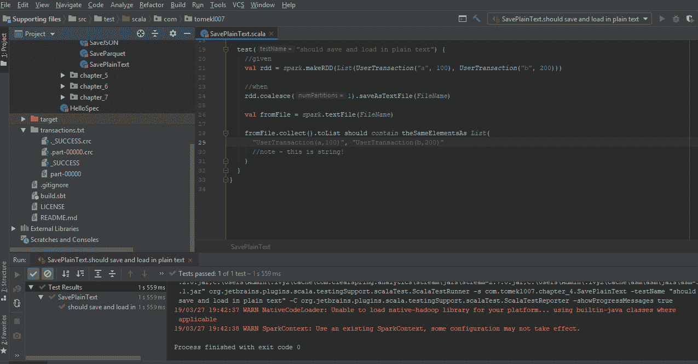
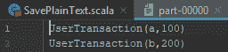
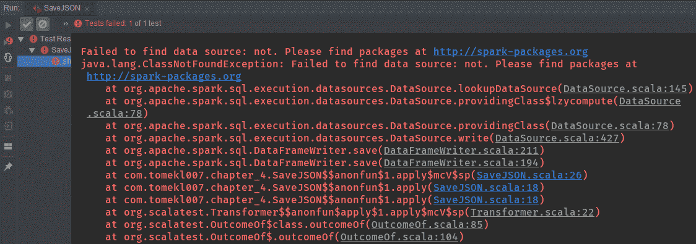
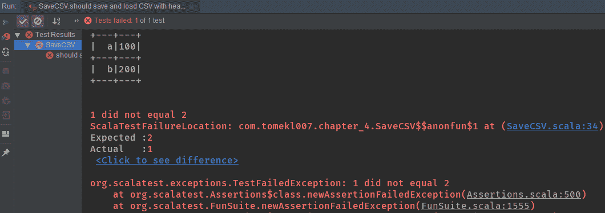
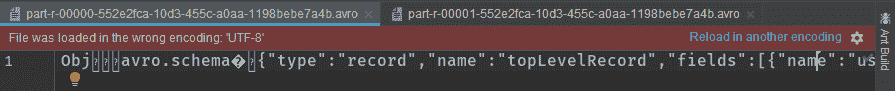

# 第十章：将数据保存在正确的格式中

在之前的章节中，我们专注于处理和加载数据。我们学习了有关转换、操作、连接、洗牌和 Spark 的其他方面。

在本章中，我们将学习如何以正确的格式保存数据，还将使用 Spark 的标准 API 以纯文本格式保存数据。我们还将利用 JSON 作为数据格式，并学习如何使用标准 API 保存 JSON。Spark 有 CSV 格式，我们也将利用该格式。然后，我们将学习更高级的基于模式的格式，其中需要支持导入第三方依赖项。接下来，我们将使用 Avro 与 Spark，并学习如何使用和保存列格式的数据，即 Parquet。到本章结束时，我们还将学会如何检索数据以验证其是否以正确的方式存储。

在本章中，我们将涵盖以下主题：

+   以纯文本格式保存数据

+   利用 JSON 作为数据格式

+   表格式 - CSV

+   使用 Avro 与 Spark

+   列格式 - Parquet

# 以纯文本格式保存数据

在本节中，我们将学习如何以纯文本格式保存数据。将涵盖以下主题：

+   以纯文本格式保存数据

+   加载纯文本数据

+   测试

我们将以纯文本格式保存我们的数据，并研究如何将其保存到 Spark 目录中。然后我们将加载纯文本数据，然后测试并保存以检查我们是否可以产生相同的结果代码。这是我们的`SavePlainText.scala`文件：

```py
package com.tomekl007.chapter_4

import java.io.File

import com.tomekl007.UserTransaction
import org.apache.spark.sql.SparkSession
import org.apache.spark.{Partitioner, SparkContext}
import org.scalatest.{BeforeAndAfterEach, FunSuite}
import org.scalatest.Matchers._

import scala.reflect.io.Path

class SavePlainText extends FunSuite with BeforeAndAfterEach{
    val spark: SparkContext = SparkSession.builder().master("local[2]").getOrCreate().sparkContext

    private val FileName = "transactions.txt"

    override def afterEach() {
        val path = Path (FileName)
        path.deleteRecursively()
    }

    test("should save and load in plain text") {
        //given
        val rdd = spark.makeRDD(List(UserTransaction("a", 100), UserTransaction("b", 200)))

        //when
        rdd.coalesce(1).saveAsTextFile(FileName)

        val fromFile = spark.textFile(FileName)

        fromFile.collect().toList should contain theSameElementsAs List(
            "UserTransaction(a,100)", "UserTransaction(b,200)"
            //note - this is string!
        )
    }
}
```

我们将需要一个`FileName`变量，在我们的情况下，它将是一个文件夹名称，然后 Spark 将在其下创建一些文件：

```py
import java.io.File
import com.tomekl007.UserTransaction
import org.apache.spark.sql.SparkSession
import org.apache.spark.{Partitioner, SparkContext}
import org.scalatest.{BeforeAndAfterEach, FunSuite}
import org.scalatest.Matchers._
import scala.reflect.io.Path
class SavePlainText extends FunSuite with BeforeAndAfterEach{
    val spark: SparkContext = SparkSession.builder().master("local[2]").getOrCreate().sparkContext
    private val FileName = "transactions.txt"
```

我们将在我们的测试用例中使用`BeforeAndAfterEach`来清理我们的目录，这意味着路径应该被递归删除。测试后整个路径将被删除，因为需要重新运行测试而没有失败。我们需要注释掉以下代码，以便在第一次运行时调查保存的文本文件的结构：

```py
//override def afterEach() {
//         val path = Path (FileName)
//         path.deleteRecursively()
//     }

//test("should save and load in plain text") {
```

然后我们将创建两个交易的 RDD，`UserTransaction("a", 100)`和`UserTransaction("b", 200)`：

```py
val rdd = spark.makeRDD(List(UserTransaction("a", 100), UserTransaction("b", 200)))
```

然后，我们将我们的数据合并为一个分区。`coalesce()`是一个非常重要的方面。如果我们想将数据保存在单个文件中，我们需要将其合并为一个，但这样做有一个重要的含义：

```py
rdd.coalesce(1).saveAsTextFile(FileName)
```

如果我们将其合并为一个文件，那么只有一个执行程序可以将数据保存到我们的系统中。这意味着保存数据将非常缓慢，并且还存在内存不足的风险，因为所有数据将被发送到一个执行程序。通常，在生产环境中，我们根据可用的执行程序将其保存为多个分区，甚至乘以自己的因子。因此，如果我们有 16 个执行程序，那么我们可以将其保存为`64`。但这会导致`64`个文件。出于测试目的，我们将保存为一个文件，如前面的代码片段所示：

```py
rdd.coalesce (numPartitions = 1).saveAsTextFile(FileName)
```

现在，我们将加载数据。我们只需要将文件名传递给`TextFile`方法，它将返回`fromFile`：

```py
    val fromFile = spark.textFile(FileName)
```

然后我们断言我们的数据，这将产生`theSameElementsAS List`，`UserTransaction(a,100)`和`UserTransaction(b,200)`：

```py
    fromFile.collect().toList should contain theSameElementsAs List(
      "UserTransaction(a,100)", "UserTransaction(b,200)"
      //note - this is string!
    )
  }
}
```

需要注意的重要事项是，对于字符串列表，Spark 不知道我们的数据模式，因为我们将其保存为纯文本。

这是在保存纯文本时需要注意的一点，因为加载数据并不容易，因为我们需要手动将每个字符串映射到`UserTransaction`。因此，我们将不得不手动解析每条记录，但是，出于测试目的，我们将把我们的交易视为字符串。

现在，让我们开始测试并查看创建的文件夹的结构：



在前面的屏幕截图中，我们可以看到我们的测试通过了，我们得到了`transactions.txt`。在文件夹中，我们有四个文件。第一个是`._SUCCESS.crc`，这意味着保存成功。接下来，我们有`.part-00000.crc`，用于控制和验证一切是否正常工作，这意味着保存是正确的。然后，我们有`_SUCCESS`和`part-00000`，这两个文件都有校验和，但`part-00000`也包含了所有的数据。然后，我们还有`UserTransaction(a,100)`和`UserTransaction(b,200)`：



在下一节中，我们将学习如果增加分区数量会发生什么。

# 利用 JSON 作为数据格式

在本节中，我们将利用 JSON 作为数据格式，并将我们的数据保存为 JSON。以下主题将被涵盖：

+   以 JSON 格式保存数据

+   加载 JSON 数据

+   测试

这些数据是人类可读的，并且比简单的纯文本给我们更多的含义，因为它携带了一些模式信息，比如字段名。然后，我们将学习如何以 JSON 格式保存数据并加载我们的 JSON 数据。

我们将首先创建一个`UserTransaction("a", 100)`和`UserTransaction("b", 200)`的 DataFrame，并使用`.toDF()`保存 DataFrame API：

```py
val rdd = spark.sparkContext
         .makeRDD(List(UserTransaction("a", 100), UserTransaction("b", 200)))
         .toDF()
```

然后我们将发出`coalesce()`，这次我们将取值为`2`，并且我们将得到两个结果文件。然后我们将发出`write.format`方法，并且需要指定一个格式，我们将使用`json`格式：

```py
rdd.coalesce(2).write.format("json").save(FileName)
```

如果我们使用不支持的格式，我们将得到一个异常。让我们通过将源输入为`not`来测试这一点：

```py
rdd.coalesce(2).write.format("not").save(FileName)
```

我们将得到诸如“此格式不是预期的”、“找不到数据源：not”和“没有这样的数据源”等异常：



在我们原始的 JSON 代码中，我们将指定格式，并且需要将其保存到`FileName`。如果我们想要读取，我们需要将其指定为`read`模式，并且还需要添加一个文件夹的路径：

```py
val fromFile = spark.read.json(FileName)
```

在这种情况下，让我们注释掉`afterEach()`来调查生成的 JSON：

```py
// override def afterEach() {
// val path = Path(FileName)
// path.deleteRecursively()
// }
```

让我们开始测试：

```py
 fromFile.show()
 assert(fromFile.count() == 2)
 }
}
```

输出如下：

```py
+------+------+
|amount|userId|
|   200|     b|
|   100|     a|
+------+------+
```

在前面的代码输出中，我们可以看到我们的测试通过了，并且 DataFrame 包含了所有有意义的数据。

从输出中，我们可以看到 DataFrame 具有所需的所有模式。它有`amount`和`userId`，这非常有用。

`transactions.json`文件夹有两部分——一部分是`r-00000`，另一部分是`r-00001`，因为我们发出了两个分区。如果我们在生产系统中保存数据有 100 个分区，我们最终会得到 100 个部分文件，而且每个部分文件都会有一个 CRC 校验和文件。

这是第一个文件：

```py
{"userId":"a","amount":"100"}
```

在这里，我们有一个带有模式的 JSON 文件，因此我们有一个`userID`字段和`amount`字段。

另一方面，我们有第二个文件，其中包含第二条记录，包括`userID`和`amount`：

```py
{"userId":"b","amount":"200"}
```

这样做的好处是 Spark 能够从模式中推断出数据，并且以格式化的 DataFrame 加载，具有适当的命名和类型。然而，缺点是每条记录都有一些额外的开销。每条记录都需要在其中有一个字符串，并且在每个字符串中，如果我们有一个包含数百万个文件的文件，并且我们没有对其进行压缩，那么将会有相当大的开销，这是不理想的。

JSON 是人类可读的，但另一方面，它消耗了大量资源，就像 CPU 用于压缩、读取和写入，以及磁盘和内存用于开销一样。除了 JSON 之外，还有更好的格式，我们将在接下来的部分中介绍。

在下一节中，我们将查看表格格式，我们将介绍一个经常用于导入到 Microsoft Excel 或 Google 电子表格的 CSV 文件。这对数据科学家也是非常有用的格式，但仅在使用较小的数据集时。

# 表格式——CSV

在本节中，我们将介绍文本数据，但以表格格式——CSV。以下主题将被涵盖：

+   以 CSV 格式保存数据

+   加载 CSV 数据

+   测试

保存 CSV 文件比 JSON 和纯文本更复杂，因为我们需要指定是否要在 CSV 文件中保留数据的头信息。

首先，我们将创建一个 DataFrame：

```py
test("should save and load CSV with header") {
 //given
 import spark.sqlContext.implicits._
 val rdd = spark.sparkContext
 .makeRDD(List(UserTransaction("a", 100), UserTransaction("b", 200)))
 .toDF()
```

然后，我们将使用`write`格式 CSV。我们还需要指定我们不想在其中包含`header`选项：

```py
//when
rdd.coalesce(1)
    .write
    .format("csv")
    .option("header", "false")
    .save(FileName)
```

然后，我们将进行测试以验证条件是`true`还是`false`：

```py
    //when
    rdd.coalesce(1)
      .write
      .format("csv")
      .option("header", "true")
      .save(FileName)  
```

此外，我们无需添加任何额外的依赖来支持 CSV，如以前的版本所需。

然后，我们将指定应该与`write`模式相似的`read`模式，并且我们需要指定是否有`header`：

```py
val fromFile = spark.read.option("header", "false").csv(FileName)
```

让我们开始测试并检查输出：

```py
+---+---+
|_c0|_c1|
+---+---+
|  a|100|
|  b|200|
+---+---+
```

在前面的代码输出中，我们可以看到数据已加载，但我们丢失了我们的模式。`c0`和`c1`是由 Spark 创建的列 0（`c0`）和列 1（`c1`）的别名。

因此，如果我们指定`header`应保留该信息，让我们在`write`和`read`时指定`header`：

```py
val fromFile = spark.read.option("header", "true).csv(FileName)
```

我们将指定`header`应保留我们的信息。在以下输出中，我们可以看到关于模式的信息在读写操作中被感知到：

```py
+------+------+
|userId|amount|
+------+------+
|     a|   100|
|     b|   200|
+------+------+
```

让我们看看如果我们在`write`时使用`header`，而在`read`时不使用它会发生什么。我们的测试应该失败，如下面的代码截图所示：



在前面的截图中，我们可以看到我们的测试失败了，因为我们没有模式，因为我们在没有头的情况下进行读取。第一条记录，也就是`header`，被视为列值。

让我们尝试一个不同的情况，我们在没有`header`的情况下进行写入，并在有`header`的情况下进行读取：

```py
  //when
 rdd.coalesce(1)
     .write
     .format("csv")
     .option("header", "false")
     .save(FileName)

val fromFile = spark.read.option("header", "false").csv(FileName)
```

我们的测试将再次失败，因为这一次，我们将我们的第一条记录视为头记录。

让我们将读和写操作都设置为`header`并在之前添加的注释后测试我们的代码：

```py
override def afterEach() {
    val path = Path(FileName)
    path.deleteRecursively()
}
```

CSV 和 JSON 文件将具有模式，但开销较小。因此，它甚至可能比 JSON 更好。

在下一节中，我们将看到如何将基于模式的格式作为整体与 Spark 一起使用。

# 使用 Avro 与 Spark

到目前为止，我们已经看过基于文本的文件。我们使用纯文本、JSON 和 CSV。JSON 和 CSV 比纯文本更好，因为它们携带了一些模式信息。

在本节中，我们将研究一个名为 Avro 的高级模式。将涵盖以下主题：

+   以 Avro 格式保存数据

+   加载 Avro 数据

+   测试

Avro 具有嵌入其中的模式和数据。这是一种二进制格式，不是人类可读的。我们将学习如何以 Avro 格式保存数据，加载数据，然后进行测试。

首先，我们将创建我们的用户交易：

```py
 test("should save and load avro") {
 //given
 import spark.sqlContext.implicits._
 val rdd = spark.sparkContext
     .makeRDD(List(UserTransaction("a", 100), UserTransaction("b", 200)))
     .toDF()
```

然后我们将进行`coalesce`并写入 Avro：

```py
 //when
 rdd.coalesce(2)
     .write
     .avro(FileName)
```

在使用 CSV 时，我们指定了像 CSV 这样的格式，当我们指定 JSON 时，这也是一个格式。但是在 Avro 中，我们有一个方法。这种方法不是标准的 Spark 方法；它来自第三方库。为了具有 Avro 支持，我们需要访问`build.sbt`并从`com.databricks`添加`spark-avro`支持。

然后我们需要导入适当的方法。我们将导入`com.databricks.spark.avro._`以给我们扩展 Spark DataFrame 的隐式函数：

```py
import com.databricks.spark.avro._
```

实际上我们正在使用一个 Avro 方法，我们可以看到`implicit class`接受一个`DataFrameWriter`类，并以 Spark 格式写入我们的数据。

在我们之前使用的`coalesce`代码中，我们可以使用`write`，指定格式，并执行`com.databricks.spark.avro`类。`avro`是一个快捷方式，不需要将`com.databricks.spark.avro`作为整个字符串写入：

```py
//when
 rdd.coalesce(2)
     .write.format(com.databricks.spark.avro)
     .avro(FileName)
```

简而言之，无需指定格式；只需应用隐式`avro`方法。

让我们注释掉代码并删除 Avro 以检查它是如何保存的：

```py
// override def afterEach() {
    // val path = Path(FileName)
    // path.deleteRecursively()
// }
```

如果我们打开`transactions.avro`文件夹，我们有两部分——`part-r-00000`和`part-r-00001`。

第一部分将包含二进制数据。它由许多二进制记录和一些人类可读的数据组成，这就是我们的模式：



我们有两个字段 - `user ID`，它是一个字符串类型或空值，和`name`：`amount`，它是一个整数。作为原始类型，JVM 不能有空值。需要注意的重要事情是，在生产系统中，我们必须保存非常大的数据集，将有成千上万条记录。模式始终在每个文件的第一行。如果我们检查第二部分，我们将看到完全相同的模式，然后是二进制数据。

通常，如果有复杂的模式，我们只有一行或更多行，但仍然是非常少量的数据。

我们可以看到在生成的数据集中，我们有`userID`和`amount`：

```py
+------+------+
|userId|amount|
+------+------+
|     a|   100|
|     b|   200|
+------+------+
```

在上面的代码块中，我们可以看到模式被描绘在文件中。虽然它是一个二进制文件，但我们可以提取它。

在下一节中，我们将研究列格式 - Parquet。

# 列格式 - Parquet

在本节中，我们将研究第二种基于模式的格式 Parquet。将涵盖以下主题：

+   以 Parquet 格式保存数据

+   加载 Parquet 数据

+   测试

这是一种列格式，因为数据是以列方式存储的，而不是以行方式，就像我们在 JSON、CSV、纯文本和 Avro 文件中看到的那样。

这是一个非常有趣和重要的大数据处理格式，可以加快处理过程。在本节中，我们将专注于向 Spark 添加 Parquet 支持，将数据保存到文件系统中，重新加载数据，然后进行测试。Parquet 与 Avro 类似，因为它提供了一个`parquet`方法，但这次是一个稍微不同的实现。

在`build.sbt`文件中，对于 Avro 格式，我们需要添加外部依赖，但对于 Parquet，我们已经在 Spark 中有了该依赖。因此，Parquet 是 Spark 的首选，因为它包含在标准包中。

让我们来看看`SaveParquet.scala`文件中用于保存和加载 Parquet 文件的逻辑。

首先，我们合并了两个分区，指定了格式，然后指定我们要保存`parquet`：

```py
package com.tomekl007.chapter_4

import com.databricks.spark.avro._
import com.tomekl007.UserTransaction
import org.apache.spark.sql.SparkSession
import org.scalatest.{BeforeAndAfterEach, FunSuite}

import scala.reflect.io.Path

class SaveParquet extends FunSuite with BeforeAndAfterEach {
  val spark = SparkSession.builder().master("local[2]").getOrCreate()

  private val FileName = "transactions.parquet"

  override def afterEach() {
    val path = Path(FileName)
    path.deleteRecursively()
  }

  test("should save and load parquet") {
    //given
    import spark.sqlContext.implicits._
    val rdd = spark.sparkContext
      .makeRDD(List(UserTransaction("a", 100), UserTransaction("b", 200)))
      .toDF()

    //when
    rdd.coalesce(2)
      .write
      .parquet(FileName)
```

`read`方法也实现了完全相同的方法：

```py
    val fromFile = spark.read.parquet(FileName)

    fromFile.show()
    assert(fromFile.count() == 2)
  }

}
```

让我们开始这个测试，但在此之前，我们将在`SaveParquet.scala`文件中注释掉以下代码，以查看文件的结构：

```py
//    override def afterEach() {
//    val path = Path(FileName)
//    path.deleteRecursively()
//  } 
```

创建了一个新的`transactions.parquet`文件夹，里面有两个部分 - `part-r-00000`和`part-r-00001`。但这次，格式完全是二进制的，并且嵌入了一些元数据。

我们嵌入了元数据，还有`amount`和`userID`字段，它们是`string`类型。`r-00000`部分完全相同，并且嵌入了模式。因此，Parquet 也是一种基于模式的格式。当我们读取数据时，我们可以看到我们有`userID`和`amount`列可用。

# 摘要

在本章中，我们学习了如何以纯文本格式保存数据。我们注意到，当我们没有正确加载数据时，模式信息会丢失。然后我们学习了如何利用 JSON 作为数据格式，并发现 JSON 保留了模式，但它有很多开销，因为模式是针对每条记录的。然后我们了解了 CSV，并发现 Spark 对其有嵌入支持。然而，这种方法的缺点是模式不是关于特定类型的记录，并且需要隐式推断制表符。在本章的最后，我们介绍了 Avro 和 Parquet，它们具有列格式，也嵌入了 Spark。

在下一章中，我们将使用 Spark 的键/值 API。
