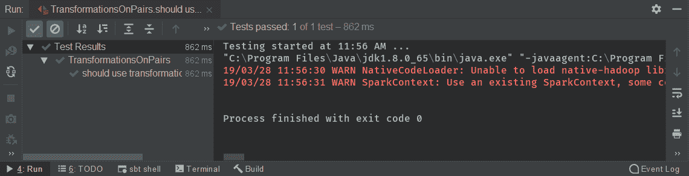
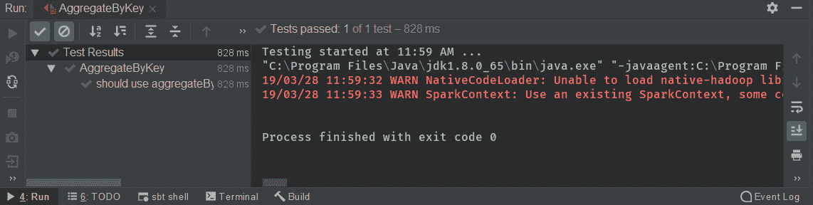
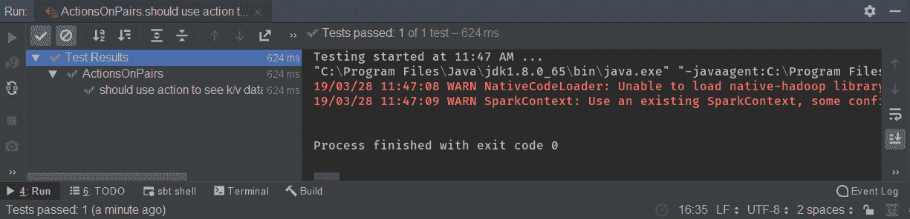
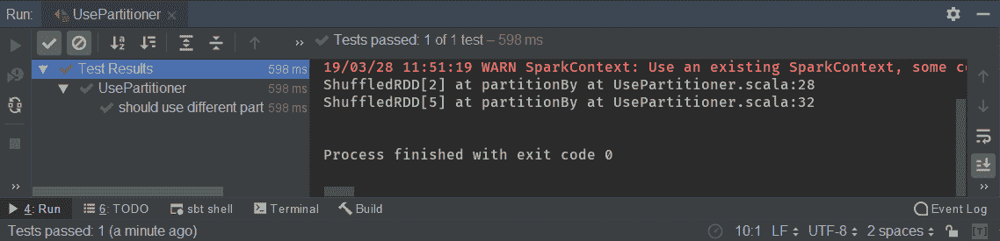
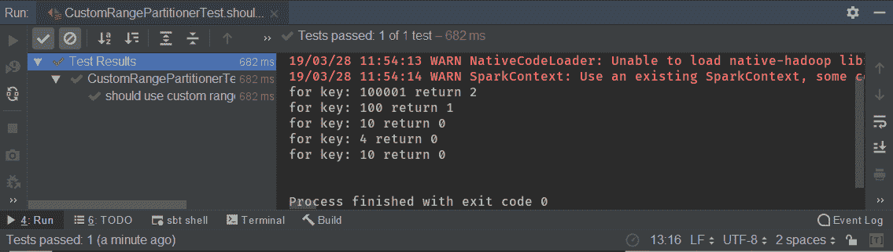

# 第十一章：使用 Spark 键/值 API

在本章中，我们将使用 Spark 键/值 API。我们将首先查看可用的键/值对转换。然后，我们将学习如何使用`aggregateByKey`方法而不是`groupBy()`方法。稍后，我们将研究键/值对的操作，并查看可用的键/值数据分区器。在本章结束时，我们将实现一个高级分区器，该分区器将能够按范围对我们的数据进行分区。

在本章中，我们将涵盖以下主题：

+   可用的键/值对操作

+   使用`aggregateByKey`而不是`groupBy()`

+   键/值对操作

+   可用的键/值数据分区器

+   实现自定义分区器

# 可用的键/值对操作

在本节中，我们将涵盖以下主题：

+   可用的键/值对转换

+   使用`countByKey()`

+   了解其他方法

因此，这是我们众所周知的测试，我们将在其中使用键/值对的转换。

首先，我们将为用户`A`，`B`，`A`，`B`和`C`创建一个用户交易数组，以某种金额，如下例所示：

```py
 val keysWithValuesList =
 Array(
 UserTransaction("A", 100),
 UserTransaction("B", 4),
 UserTransaction("A", 100001),
 UserTransaction("B", 10),
 UserTransaction("C", 10)
 )
```

然后，根据以下示例，我们需要按特定字段对数据进行键入：

```py
val keyed = data.keyBy(_.userId)
```

我们将通过调用`keyBy`方法并使用`userId`参数对其进行键入。

现在，我们的数据分配给了`keyed`变量，其类型为元组。第一个元素是字符串，即`userId`，第二个元素是`UserTransaction`。

让我们看一下可用的转换。首先，我们将看看`countByKey`。

让我们看一下它的实现，如下例所示：

```py
val data = spark.parallelize(keysWithValuesList)
 val keyed = data.keyBy(_.userId)
//when
 val counted = keyed.countByKey()
// keyed.combineByKey()
// keyed.aggregateByKey()
// keyed.foldByKey()
// keyed.groupByKey()
//then
 counted should contain theSameElementsAs Map("B" -> 2, "A" -> 2, "C" -> 1)
```

这将返回一个`Map`，键`K`和`Long`是一种通用类型，因为它可以是任何类型的键。在本例中，键将是一个字符串。每个返回映射的操作都不是完全安全的。如果您看到返回映射的方法的签名，这表明这些数据将被发送到驱动程序，并且需要适合内存。如果有太多的数据无法适应一个驱动程序的内存，那么我们将耗尽内存。因此，在使用此方法时，我们需要谨慎。

然后，我们执行一个包含与地图相同元素的断言计数，如下例所示：

```py
counted should contain theSameElementsAs Map("B" -> 2, "A" -> 2, "C" -> 1)
```

`B`是`2`，因为我们有两个值。另外，`A`与`C`类似，因为它们只有一个值。`countByKey()`不占用内存，因为它只存储键和计数器。但是，如果键是一个复杂且大的对象，例如具有多个字段的交易，超过两个，那么该映射可能会非常大。

但让我们从下面的例子开始这个测试：



从前面的屏幕截图中，我们可以看到我们的测试通过了。

我们还有一个`combineByKey()`方法，它将相同键的相同元素组合在一起，并共享负面的`aggregateByKey()`，能够聚合不同类型。我们有`foldByKey`，它正在获取当前状态和值，但返回与键的值相同的类型。

我们还有`groupByKey()`，我们在上一节中了解过。这将根据特定键对所有内容进行分组，并返回键的值迭代器。这也是一个非常占用内存的操作，因此在使用时需要小心。

在下一节中，我们将使用`aggregateByKey`而不是`groupBy`。我们将学习`groupBy`的工作原理并修复其缺陷。

# 使用`aggregateByKey`而不是`groupBy()`

在本节中，我们将探讨为什么我们使用`aggregateByKey`而不是`groupBy`。

我们将涵盖以下主题：

+   为什么我们应该避免使用`groupByKey`

+   `aggregateByKey`给我们的是什么

+   使用`aggregateByKey`实现逻辑

首先，我们将创建我们的用户交易数组，如下例所示：

```py
 val keysWithValuesList =
 Array(
 UserTransaction("A", 100),
 UserTransaction("B", 4),
 UserTransaction("A", 100001),
 UserTransaction("B", 10),
 UserTransaction("C", 10)
 )
```

然后，我们将使用`parallelize`创建一个 RDD，因为我们希望我们的数据按键排序。这在下面的例子中显示：

```py
 val data = spark.parallelize(keysWithValuesList)
 val keyed = data.keyBy(_.userId)
```

在前面的代码中，我们调用了`keyBy`来对`userId`进行操作，以获得付款人、键和用户交易的数据。

让我们假设我们想要聚合，我们想要对相同的键执行一些特定的逻辑，如下面的例子所示：

```py
 val aggregatedTransactionsForUserId = keyed
 .aggregateByKey(amountForUser)(addAmount, mergeAmounts)
```

这样做的原因可能是选择最大元素、最小元素或计算平均值。`aggregateByKey`需要接受三个参数，如下面的例子所示：

```py
aggregateByKey(amountForUser)(addAmount, mergeAmounts)
```

第一个参数是 T 类型的初始参数，定义`amountForUser`是一个类型为`ArrayBuffer`的初始参数。这非常重要，因为 Scala 编译器将推断出该类型，并且在这个例子中，参数 1 和 2 需要具有完全相同的类型 T：`ArrayBuffer.empty[long]`。

下一个参数是一个方法，它接受我们正在处理的当前元素。在这个例子中，`transaction: UserTransaction) =>`是一个当前交易，也需要带上我们初始化函数的状态，因此这里将是一个数组缓冲区。

它需要与以下代码块中显示的相同类型，因此这是我们的类型 T：

```py
mutable.ArrayBuffer.empty[Long]
```

在这一点上，我们能够获取任何交易并将其添加到特定状态中。这是以分布式方式完成的。对于一个键，执行在一个执行器上完成，对于完全相同的键，执行在不同的执行器上完成。这是并行进行的，因此对于相同的键将添加多个交易。

现在，Spark 知道，对于完全相同的键，它有多个 T 类型的状态`ArrayBuffer`，需要合并。因此，我们需要为相同的键`mergeAmounts`我们的交易。

`mergeArgument`是一个方法，它接受两个状态，这两个状态都是 T 类型的中间状态，如下面的代码块所示：

```py
 val mergeAmounts = (p1: mutable.ArrayBuffer[Long], p2: mutable.ArrayBuffer[Long]) => p1 ++= p2
```

在这个例子中，我们想要将释放缓冲区合并成一个数组缓冲区。因此，我们发出`p1 ++= p2`。这将两个数组缓冲区合并成一个。

现在，我们已经准备好所有参数，我们能够执行`aggregateByKey`并查看结果是什么样子的。结果是一个字符串和类型 T 的 RDD，`ArrayBuffer[long]`，这是我们的状态。我们将不再在 RDD 中保留`UserTransaction`，这有助于减少内存使用。`UserTransaction`是一个重量级对象，因为它可以有多个字段，在这个例子中，我们只对金额字段感兴趣。因此，这样我们可以减少内存的使用。

下面的例子展示了我们的结果应该是什么样子的：

```py
 aggregatedTransactionsForUserId.collect().toList should contain theSameElementsAs List(
 ("A", ArrayBuffer(100, 100001)),
 ("B", ArrayBuffer(4,10)),
 ("C", ArrayBuffer(10)))
```

我们应该有一个键`A`，和一个`ArrayBuffer`的`100`和`10001`，因为这是我们的输入数据。`B`应该是`4`和`10`，最后，`C`应该是`10`。

让我们开始测试，检查我们是否已经正确实现了`aggregateByKey`，如下面的例子所示：



从前面的输出中，我们可以看到它按预期工作。

在下一节中，我们将研究可用于键/值对的操作。

# 键/值对上的操作

在本节中，我们将研究键/值对上的操作。

我们将涵盖以下主题：

+   检查键/值对上的操作

+   使用`collect()`

+   检查键/值 RDD 的输出

在本章的第一部分中，我们介绍了可用于键/值对的转换。我们看到它们与 RDD 相比有些不同。此外，对于操作，结果略有不同，但方法名称并没有变化。

因此，我们将使用`collect()`，并且我们将检查我们对这些键/值对的操作的输出。

首先，我们将根据`userId`创建我们的交易数组和 RDD，如下面的例子所示：

```py
 val keysWithValuesList =
 Array(
 UserTransaction("A", 100),
 UserTransaction("B", 4),
 UserTransaction("A", 100001),
 UserTransaction("B", 10),
 UserTransaction("C", 10)
 )
```

我们首先想到的操作是`collect()`。`collect()`会取出每个元素并将其分配给结果，因此我们的结果与`keyBy`的结果非常不同。

我们的结果是一对键，`userId`和一个值，即`UserTransaction`。我们可以从下面的例子中看到，我们可以有一个重复的键：

```py
 res should contain theSameElementsAs List(
 ("A",UserTransaction("A",100)),
 ("B",UserTransaction("B",4)),
 ("A",UserTransaction("A",100001)),
 ("B",UserTransaction("B",10)),
 ("C",UserTransaction("C",10))
 )//note duplicated key
```

在前面的代码中，我们可以看到同一个订单有多个出现。对于一个简单的字符串键，重复并不是很昂贵。然而，如果我们有一个更复杂的键，那么就会很昂贵。

因此，让我们开始这个测试，如下例所示：



从前面的输出中，我们可以看到我们的测试已经通过。要查看其他动作，我们将查看不同的方法。

如果一个方法返回 RDD，比如`collect[U] (f: PartialFunction[(String, UserTransaction), U])`，这意味着这不是一个动作。如果某些东西返回 RDD，这意味着它不是一个动作。这适用于键/值对。

`collect()`不会返回 RDD，而是返回数组，因此它是一个动作。`count`返回`long`，因此这也是一个动作。`countByKey`返回 map。如果我们想要`reduce`我们的元素，那么这是一个动作，但`reduceByKey`不是一个动作。这就是`reduce`和`reduceByKey`之间的重大区别。

我们可以看到根据 RDD，一切都是正常的，因此动作是相同的，差异只在于转换。

在下一节中，我们将看一下键/值数据上可用的分区器。

# 键/值数据上可用的分区器

我们知道分区和分区器是 Apache Spark 的关键组件。它们影响我们的数据如何分区，这意味着它们影响数据实际驻留在哪些执行器上。如果我们有一个良好的分区器，那么我们将有良好的数据局部性，这将减少洗牌。我们知道洗牌对处理来说是不可取的，因此减少洗牌是至关重要的，因此选择适当的分区器对我们的系统也是至关重要的。

在本节中，我们将涵盖以下主题：

+   检查`HashPartitioner`

+   检查`RangePartitioner`

+   测试

我们将首先检查我们的`HashPartitioner`和`RangePartitioner`。然后我们将比较它们并使用两个分区器测试代码。

首先，我们将创建一个`UserTransaction`数组，如下例所示：

```py
 val keysWithValuesList =
 Array(
 UserTransaction("A", 100),
 UserTransaction("B", 4),
 UserTransaction("A", 100001),
 UserTransaction("B", 10),
 UserTransaction("C", 10)
 )
```

然后我们将使用`keyBy`（如下例所示），因为分区器将自动处理我们数据的键：

```py
 val keyed = data.keyBy(_.userId)
```

然后我们将获取键数据的`partitioner`，如下例所示：

```py
 val partitioner = keyed.partitioner
```

代码显示`partitioner.isEmpty`，因为我们还没有定义任何`partitioner`，因此在这一点上它是空的，如下例所示：

```py
 assert(partitioner.isEmpty)
```

我们可以使用`partitionBy`方法指定一个`partitioner`，如下例所示：

```py
val hashPartitioner = keyed.partitionBy(new HashPartitioner(100))
```

该方法期望一个`partitioner`抽象类的实现。我们将有一些实现，但首先，让我们专注于`HashPartitioner`。

`HashPartitioner`需要一个分区数，并且有一个分区数。`numPartition`返回我们的参数，但`getPartition`会更加复杂，如下例所示：

```py
    def numPartitions: Int = partitions
    def getPartition(key: Any): int = key match {
        case null => 0
        case_ => Utils.nonNegativeMode(key.hashCode, numPartitions)
    }
```

它首先检查我们的`key`是否为`null`。如果是`null`，它将落在分区号`0`。如果我们有带有`null`键的数据，它们都将落在相同的执行器上，正如我们所知，这不是一个好的情况，因为执行器将有很多内存开销，并且它们可能会因为内存异常而失败。

如果`key`不是`null`，那么它会从`hashCode`和分区数中进行`nonNegativeMod`。它必须是分区数的模数，这样它才能分配到适当的分区。因此，`hashCode`方法对我们的键非常重要。

如果我们提供了一个自定义的键而不是像整数或字符串这样的原始类型，它有一个众所周知的`hashCode`，我们需要提供和实现一个适当的`hashCode`。但最佳实践是使用 Scala 中的`case`类，因为它们已经为你实现了`hashCode`和 equals。

我们现在已经定义了`partitioner`，但`partitioner`是可以动态更改的。我们可以将我们的`partitioner`更改为`rangePartitioner`。`rangePartitioner`接受 RDD 中的分区。

`rangePartitioner`更复杂，因为它试图将我们的数据划分为范围，这不像`HashPartitioner`在获取分区时那样简单。该方法非常复杂，因为它试图均匀地分布我们的数据，并且对将其分布到范围中的逻辑非常复杂。

让我们开始我们的测试，检查我们是否能够正确地分配`partitioner`，如下所示的输出：



我们的测试已经通过。这意味着，在最初的时候，`partitioner`是空的，然后我们必须在`partitionBy`处对 RDD 进行洗牌，还有一个`branchPartitioner`。但它只显示了我们创建`partitioner`接口的实例的数值线。

在下一部分，我们将尝试改进它，或者尝试通过实现自定义分区器来调整和玩弄分区器。

# 实现自定义分区器

在这一部分，我们将实现一个自定义的分区器，并创建一个接受带有范围的解析列表的分区器。如果我们的键落入特定范围，我们将分配列表的分区号索引。

我们将涵盖以下主题：

+   实现自定义分区器

+   实现一个范围分区器

+   测试我们的分区器

我们将根据我们自己的范围分区逻辑来实现范围分区，并测试我们的分区器。让我们从不查看实现的黑盒测试开始。

代码的第一部分与我们已经使用的类似，但这次我们有`keyBy`数量的数据，如下例所示：

```py
 val keysWithValuesList =
 Array(
 UserTransaction("A", 100),
 UserTransaction("B", 4),
 UserTransaction("A", 100001),
 UserTransaction("B", 10),
 UserTransaction("C", 10)
 )
 val data = spark.parallelize(keysWithValuesList)
 val keyed = data.keyBy(_.amount)
```

我们按数量进行分组，我们有以下键：`100`，`4`，`100001`，`10`和`10`。

然后，我们将创建一个分区器，并将其命名为`CustomRangePartitioner`，它将接受一个元组列表，如下例所示：

```py
 val partitioned = keyed.partitionBy(new CustomRangePartitioner(List((0,100), (100, 10000), (10000, 1000000))))
```

第一个元素是从`0`到`100`，这意味着如果键在`0`到`100`的范围内，它应该进入分区`0`。因此，有四个键应该落入该分区。下一个分区号的范围是`100`和`10000`，因此该范围内的每条记录都应该落入分区号`1`，包括两端。最后一个范围是`10000`到`1000000`元素之间，因此，如果记录在该范围内，它应该落入该分区。如果我们有一个超出范围的元素，那么分区器将因非法参数异常而失败。

让我们看一下下面的例子，展示了我们自定义范围分区器的实现：

```py
class CustomRangePartitioner(ranges: List[(Int,Int)]) extends Partitioner{
 override def numPartitions: Int = ranges.size
override def getPartition(key: Any): Int = {
 if(!key.isInstanceOf[Int]){
 throw new IllegalArgumentException("partitioner works only for Int type")
 }
 val keyInt = key.asInstanceOf[Int]
 val index = ranges.lastIndexWhere(v => keyInt >= v._1 && keyInt <= v._2)
 println(s"for key: $key return $index")
 index
 }
}
```

它将范围作为元组的参数列表，如下例所示：

```py
(ranges: List[(Int,Int)])
```

我们的`numPartitions`应该等于`ranges.size`，因此分区的数量等于范围的数量。

接下来，我们有`getPartition`方法。首先，我们的分区器只对整数有效，如下例所示：

```py
if(!key.isInstanceOf[Int])
```

我们可以看到这是一个整数，不能用于其他类型。出于同样的原因，我们首先需要检查我们的键是否是整数的实例，如果不是，我们会得到一个`IllegalArgumentException`，因为该分区器只对 int 类型有效。

我们现在可以通过`asInstanceOf`来测试我们的`keyInt`。完成后，我们可以遍历范围，并在索引在谓词之间时取最后一个范围。我们的谓词是一个元组`v`，应该如下所示：

```py
 val index = ranges.lastIndexWhere(v => keyInt >= v._1 && keyInt <= v._2)
```

`KeyInt`应该大于或等于`v._1`，即元组的第一个元素，但也应该小于第二个元素`v._2`。

范围的起始是`v._1`，范围的结束是`v._2`，因此我们可以检查我们的元素是否在范围内。

最后，我们将打印我们在调试目的中找到的键的索引，并返回索引，这将是我们的分区。如下例所示：

```py
println(s"for key: $key return $index")
```

让我们开始下面的测试：



我们可以看到对于键`100001`，代码返回了预期的分区号`2`。对于键`100`返回分区一，对于`10`，`4`，`10`返回分区零，这意味着我们的代码按预期工作。

# 摘要

在本章中，我们首先看到了关于键/值对的转换操作。然后我们学习了如何使用`aggregateByKey`而不是`groupBy`。我们还涵盖了关于键/值对的操作。之后，我们看了一下可用的分区器，比如`rangePartitioner`和`HashPartition`在键/值数据上。在本章结束时，我们已经实现了我们自定义的分区器，它能够根据范围的起始和结束来分配分区，以便学习目的。

在下一章中，我们将学习如何测试我们的 Spark 作业和 Apache Spark 作业。
