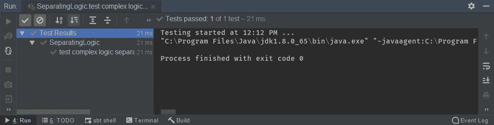
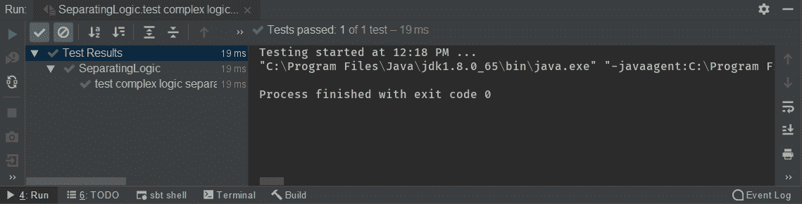
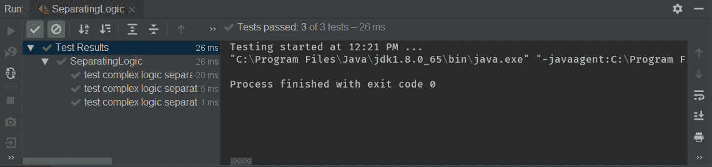
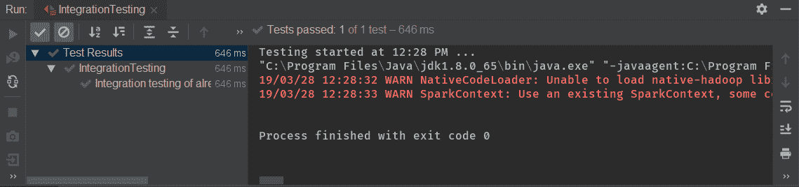
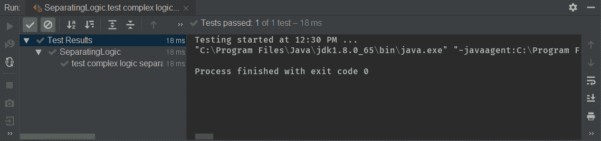
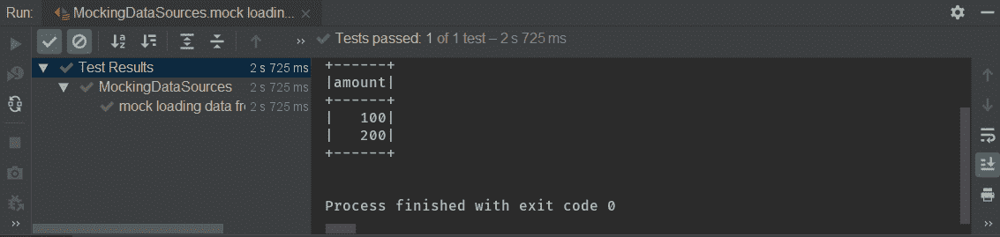
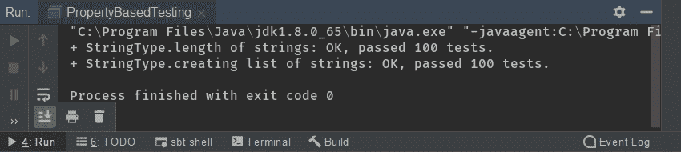
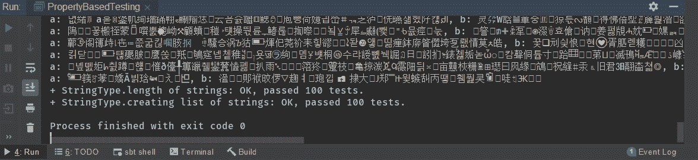

# 第十二章：测试 Apache Spark 作业

在本章中，我们将测试 Apache Spark 作业，并学习如何将逻辑与 Spark 引擎分离。

我们将首先对我们的代码进行单元测试，然后在 SparkSession 中进行集成测试。之后，我们将使用部分函数模拟数据源，然后学习如何利用 ScalaCheck 进行基于属性的测试以及 Scala 中的类型。在本章结束时，我们将在不同版本的 Spark 中执行测试。

在本章中，我们将涵盖以下主题：

+   将逻辑与 Spark 引擎分离-单元测试

+   使用 SparkSession 进行集成测试

+   使用部分函数模拟数据源

+   使用 ScalaCheck 进行基于属性的测试

+   在不同版本的 Spark 中进行测试

# 将逻辑与 Spark 引擎分离-单元测试

让我们从将逻辑与 Spark 引擎分离开始。

在本节中，我们将涵盖以下主题：

+   创建具有逻辑的组件

+   该组件的单元测试

+   使用模型类的案例类进行领域逻辑

让我们先看逻辑，然后是简单的测试。

因此，我们有一个`BonusVerifier`对象，只有一个方法`quaifyForBonus`，它接受我们的`userTransaction`模型类。根据以下代码中的登录，我们加载用户交易并过滤所有符合奖金资格的用户。首先，我们需要测试它以创建一个 RDD 并对其进行过滤。我们需要创建一个 SparkSession，并为模拟 RDD 或 DataFrame 创建数据，然后测试整个 Spark API。由于这涉及逻辑，我们将对其进行隔离测试。逻辑如下：

```py
package com.tomekl007.chapter_6
import com.tomekl007.UserTransaction
object BonusVerifier {
 private val superUsers = List("A", "X", "100-million")
def qualifyForBonus(userTransaction: UserTransaction): Boolean = {
 superUsers.contains(userTransaction.userId) && userTransaction.amount > 100
 }
}
```

我们有一个超级用户列表，其中包括`A`、`X`和`100-million`用户 ID。如果我们的`userTransaction.userId`在`superUsers`列表中，并且`userTransaction.amount`高于`100`，那么用户就有资格获得奖金；否则，他们就没有资格。在现实世界中，奖金资格逻辑将更加复杂，因此非常重要的是对逻辑进行隔离测试。

以下代码显示了我们使用`userTransaction`模型的测试。我们知道我们的用户交易包括`userId`和`amount`。以下示例显示了我们的领域模型对象，它在 Spark 执行集成测试和我们的单元测试之间共享，与 Spark 分开：

```py
package com.tomekl007

import java.util.UUID

case class UserData(userId: String , data: String)

case class UserTransaction(userId: String, amount: Int)

case class InputRecord(uuid: String = UUID.*randomUUID()*.toString(), userId: String)
```

我们需要为用户 ID `X` 和金额`101`创建我们的`UserTransaction`，如下例所示：

```py
package com.tomekl007.chapter_6
import com.tomekl007.UserTransaction
import org.scalatest.FunSuite
class SeparatingLogic extends FunSuite {
test("test complex logic separately from spark engine") {
 //given
 val userTransaction = UserTransaction("X", 101)
//when
 val res = BonusVerifier.qualifyForBonus(userTransaction)
//then
 assert(res)
 }
}
```

然后我们将`userTransaction`传递给`qualifyForBonus`，结果应该是`true`。这个用户应该有资格获得奖金，如下输出所示：



现在，让我们为负面用例编写一个测试，如下所示：

```py
test(testName = "test complex logic separately from spark engine - non qualify") {
 //given
 val userTransaction = UserTransaction("X", 99)
//when
 val res = BonusVerifier.*qualifyForBonus*(userTransaction)
//then
 assert(!res)
 }
```

在这里，我们有一个用户`X`，花费`99`，所以我们的结果应该是 false。当我们验证我们的代码时，我们可以看到从以下输出中，我们的测试已经通过了：



我们已经涵盖了两种情况，但在现实世界的场景中，还有更多。例如，如果我们想测试指定`userId`不在这个超级用户列表中的情况，我们有一个花了很多钱的`some_new_user`，在我们的案例中是`100000`，我们得到以下结果：

```py
test(testName = "test complex logic separately from spark engine - non qualify2") {
 //given
 val userTransaction = UserTransaction("some_new_user", 100000)
//when
 val res = BonusVerifier.*qualifyForBonus*(userTransaction)
//then
 assert(!res)
 }
```

假设它不应该符合条件，因此这样的逻辑有点复杂。因此，我们以单元测试的方式进行测试：



我们的测试非常快，因此我们能够检查一切是否按预期工作，而无需引入 Spark。在下一节中，我们将使用 SparkSession 进行集成测试来更改逻辑。

# 使用 SparkSession 进行集成测试

现在让我们学习如何使用 SparkSession 进行集成测试。

在本节中，我们将涵盖以下主题：

+   利用 SparkSession 进行集成测试

+   使用经过单元测试的组件

在这里，我们正在创建 Spark 引擎。以下行对于集成测试至关重要：

```py
 val spark: SparkContext = SparkSession.builder().master("local[2]").getOrCreate().sparkContext
```

创建一个轻量级对象并不是一件简单的事情。SparkSession 是一个非常重的对象，从头开始构建它是一项昂贵的操作，从资源和时间的角度来看。与上一节的单元测试相比，诸如创建 SparkSession 的测试将花费更多的时间。

出于同样的原因，我们应该经常使用单元测试来转换所有边缘情况，并且仅在逻辑的较小部分，如资本边缘情况时才使用集成测试。

以下示例显示了我们正在创建的数组：

```py
 val keysWithValuesList =
 Array(
 UserTransaction("A", 100),
 UserTransaction("B", 4),
 UserTransaction("A", 100001),
 UserTransaction("B", 10),
 UserTransaction("C", 10)
 )
```

以下示例显示了我们正在创建的 RDD：

```py
 val data = spark.parallelize(keysWithValuesList)
```

这是 Spark 第一次参与我们的集成测试。创建 RDD 也是一个耗时的操作。与仅创建数组相比，创建 RDD 真的很慢，因为它也是一个重量级对象。

我们现在将使用我们的`data.filter`来传递一个`qualifyForBonus`函数，如下例所示：

```py
 val aggregatedTransactionsForUserId = data.filter(BonusVerifier.qualifyForBonus)
```

这个函数已经经过单元测试，所以我们不需要考虑所有边缘情况，不同的 ID，不同的金额等等。我们只是创建了一些 ID 和一些金额来测试我们整个逻辑链是否按预期工作。

应用了这个逻辑之后，我们的输出应该类似于以下内容：

```py
 UserTransaction("A", 100001)
```

让我们开始这个测试，检查执行单个集成测试需要多长时间，如下输出所示：



执行这个简单测试大约需要`646 毫秒`。

如果我们想要覆盖每一个边缘情况，与上一节的单元测试相比，值将乘以数百倍。让我们从三个边缘情况开始这个单元测试，如下输出所示：



我们可以看到我们的测试只花了`18 毫秒`，这意味着即使我们覆盖了三个边缘情况，与只有一个情况的集成测试相比，速度快了 20 倍。

在这里，我们覆盖了许多逻辑，包括数百个边缘情况，我们可以得出结论，尽可能低的级别进行单元测试是非常明智的。

在下一节中，我们将使用部分函数来模拟数据源。

# 使用部分函数模拟数据源

在本节中，我们将涵盖以下主题：

+   创建一个从 Hive 读取数据的 Spark 组件

+   模拟组件

+   测试模拟组件

假设以下代码是我们的生产线：

```py
 ignore("loading data on prod from hive") {
 UserDataLogic.loadAndGetAmount(spark, HiveDataLoader.loadUserTransactions)
 }
```

在这里，我们使用`UserDataLogic.loadAndGetAmount`函数，它需要加载我们的用户数据交易并获取交易的金额。这个方法需要两个参数。第一个参数是`sparkSession`，第二个参数是`sparkSession`的`provider`，它接受`SparkSession`并返回`DataFrame`，如下例所示：

```py
object UserDataLogic {
  def loadAndGetAmount(sparkSession: SparkSession, provider: SparkSession => DataFrame): DataFrame = {
    val df = provider(sparkSession)
    df.select(df("amount"))
  }
}
```

对于生产，我们将加载用户交易，并查看`HiveDataLoader`组件只有一个方法，`sparkSession.sql`和`("select * from transactions")`，如下代码块所示：

```py
object HiveDataLoader {
 def loadUserTransactions(sparkSession: SparkSession): DataFrame = {
 sparkSession.sql("select * from transactions")
 }
}
```

这意味着该函数去 Hive 检索我们的数据并返回一个 DataFrame。根据我们的逻辑，它执行了返回 DataFrame 的`provider`，然后从 DataFrame 中选择`amount`。

这个逻辑并不简单，因为我们的 SparkSession `provider`在生产中与外部系统进行交互。因此，我们可以创建一个如下的函数：

```py
UserDataLogic.loadAndGetAmount(spark, HiveDataLoader.loadUserTransactions)
```

让我们看看如何测试这样一个组件。首先，我们将创建一个用户交易的 DataFrame，这是我们的模拟数据，如下例所示：

```py
 val df = spark.sparkContext
 .makeRDD(List(UserTransaction("a", 100), UserTransaction("b", 200)))
 .toDF()
```

然而，我们需要将数据保存到 Hive 中，嵌入它，然后启动 Hive。

由于我们使用了部分函数，我们可以将部分函数作为第二个参数传递，如下例所示：

```py
val res = UserDataLogic.loadAndGetAmount(spark, _ => df)
```

第一个参数是`spark`，但这次我们的方法中没有使用它。第二个参数是一个接受 SparkSession 并返回 DataFrame 的方法。

然而，我们的执行引擎、架构和代码并不考虑这个 SparkSession 是否被使用，或者是否进行了外部调用；它只想返回 DataFrame。我们可以使用`_`作为我们的第一个参数，因为它被忽略，只返回 DataFrame 作为返回类型。

因此我们的`loadAndGetAmount`将获得一个模拟 DataFrame，这是我们创建的 DataFrame。

但是，对于所示的逻辑，它是透明的，不考虑 DataFrame 是来自 Hive、SQL、Cassandra 还是其他任何来源，如下例所示：

```py
 val df = provider(sparkSession)
 df.select(df("amount"))
```

在我们的例子中，`df`来自我们为测试目的创建的内存。我们的逻辑继续并选择了数量。

然后，我们展示我们的列，`res.show()`，并且该逻辑应该以一个列的数量结束。让我们开始这个测试，如下例所示：



我们可以从上面的例子中看到，我们的结果 DataFrame 在`100`和`200`值中有一个列的数量。这意味着它按预期工作，而无需启动嵌入式 Hive。关键在于使用提供程序而不是在逻辑中嵌入我们的选择开始。

在下一节中，我们将使用 ScalaCheck 进行基于属性的测试。

# 使用 ScalaCheck 进行基于属性的测试

在本节中，我们将涵盖以下主题：

+   基于属性的测试

+   创建基于属性的测试

让我们看一个简单的基于属性的测试。在定义属性之前，我们需要导入一个依赖项。我们还需要一个 ScalaCheck 库的依赖项，这是一个用于基于属性的测试的库。

在上一节中，每个测试都扩展了`FunSuite`。我们使用了功能测试，但是必须显式提供参数。在这个例子中，我们扩展了来自 ScalaCheck 库的`Properties`，并测试了`StringType`，如下所示：

```py
object PropertyBasedTesting extends Properties("StringType")
```

我们的 ScalaCheck 将为我们生成一个随机字符串。如果我们为自定义类型创建基于属性的测试，那么 ScalaCheck 是不知道的。我们需要提供一个生成器，它将生成该特定类型的实例。

首先，让我们以以下方式定义我们字符串类型的第一个属性：

```py
property("length of strings") = forAll { (a: String, b: String) =>
 a.length + b.length >= a.length
 }
```

`forAll`是 ScalaCheck 属性的一个方法。我们将在这里传递任意数量的参数，但它们需要是我们正在测试的类型。

假设我们想要获得两个随机字符串，并且在这些字符串中，不变性应该被感知。

如果我们将字符串`a`的长度加上字符串`b`的长度，那么它们的总和应该大于或等于`a.length`，因为如果`b`是`0`，那么它们将相等，如下例所示：

```py
a.length + b.length >= a.length
```

然而，这是`string`的不变性，对于每个输入字符串，它应该是`true`。

我们正在定义的第二个属性更复杂，如下代码所示：

```py
property("creating list of strings") = forAll { (a: String, b: String, c: String) =>
 List(a,b,c).map(_.length).sum == a.length + b.length + c.length
 }
```

在上面的代码中，我们要求 ScalaCheck 运行时引擎这次共享三个字符串，即`a`、`b`和`c`。当我们创建一个字符串列表时，我们将测试这个。

在这里，我们正在创建一个字符串列表，即`a`、`b`、`c`，如下代码所示：

```py
List(a,b,c)
```

当我们将每个元素映射到`length`时，这些元素的总和应该等于通过长度添加所有元素。在这里，我们有`a.length + b.length + c.length`，我们将测试集合 API，以检查映射和其他函数是否按预期工作。

让我们开始这个基于属性的测试，以检查我们的属性是否正确，如下例所示：



我们可以看到`string`的`StringType.length`属性通过并执行了`100`次测试。`100`次测试被执行可能会让人惊讶，但让我们尝试看看通过以下代码传递了什么参数：

```py
println(s"a: $a, b: $b")
```

我们将打印`a`参数和`b`参数，并通过测试以下输出来重试我们的属性：



我们可以看到生成了许多奇怪的字符串，因此这是一个我们无法事先创建的边缘情况。基于属性的测试将创建一个非常奇怪的唯一代码，这不是一个合适的字符串。因此，这是一个用于测试我们的逻辑是否按预期针对特定类型工作的好工具。

在下一节中，我们将在不同版本的 Spark 中进行测试。

# 在不同版本的 Spark 中进行测试

在本节中，我们将涵盖以下主题：

+   将组件更改为与 Spark pre-2.x 一起使用

+   Mock 测试 pre-2.x

+   RDD 模拟测试

让我们从本章第三节开始，模拟数据源——*使用部分函数模拟数据源*。

由于我们正在测试`UserDataLogic.loadAndGetAmount`，请注意一切都在 DataFrame 上操作，因此我们有一个 SparkSession 和 DataFrame。

现在，让我们将其与 Spark pre-2.x 进行比较。我们可以看到这一次我们无法使用 DataFrame。假设以下示例显示了我们在以前的 Spark 中的逻辑：

```py
test("mock loading data from hive"){
 //given
 import spark.sqlContext.implicits._
 val df = spark.sparkContext
 .makeRDD(List(UserTransaction("a", 100), UserTransaction("b", 200)))
 .toDF()
 .rdd
//when
 val res = UserDataLogicPre2.loadAndGetAmount(spark, _ => df)
//then
 println(res.collect().toList)
 }
}
```

我们可以看到这一次我们无法使用 DataFrame。

在前面的部分中，`loadAndGetAmount`正在接受`spark`和 DataFrame，但在下面的示例中，DataFrame 是一个 RDD，不再是 DataFrame，因此我们传递了一个`rdd`：

```py
 val res = UserDataLogicPre2.loadAndGetAmount(spark, _ => rdd)
```

然而，我们需要为 Spark 创建一个不同的`UserDataLogicPre2`，它接受 SparkSession 并在映射整数的 RDD 之后返回一个 RDD，如下例所示：

```py
object UserDataLogicPre2 {
 def loadAndGetAmount(sparkSession: SparkSession, provider: SparkSession => RDD[Row]): RDD[Int] = {
 provider(sparkSession).map(_.getAsInt)
 }
}
object HiveDataLoaderPre2 {
 def loadUserTransactions(sparkSession: SparkSession): RDD[Row] = {
 sparkSession.sql("select * from transactions").rdd
 }
}
```

在前面的代码中，我们可以看到`provider`正在执行我们的提供程序逻辑，映射每个元素，将其作为`int`获取。然后，我们得到了金额。`Row`是一个可以有可变数量参数的泛型类型。

在 Spark pre-2.x 中，我们没有`SparkSession`，因此需要使用`SparkContext`并相应地更改我们的登录。

# 总结

在本章中，我们首先学习了如何将逻辑与 Spark 引擎分离。然后，我们查看了一个在没有 Spark 引擎的情况下经过良好测试的组件，并使用 SparkSession 进行了集成测试。为此，我们通过重用已经经过良好测试的组件创建了一个 SparkSession 测试。通过这样做，我们不必在集成测试中涵盖所有边缘情况，而且我们的测试速度更快。然后，我们学习了如何利用部分函数在测试阶段提供模拟数据。我们还介绍了 ScalaCheck 用于基于属性的测试。在本章结束时，我们已经在不同版本的 Spark 中测试了我们的代码，并学会了将 DataFrame 模拟测试更改为 RDD。

在下一章中，我们将学习如何利用 Spark GraphX API。
