# 第十三章：利用 Spark GraphX API

在本章中，我们将学习如何从数据源创建图。然后，我们将使用 Edge API 和 Vertex API 进行实验。在本章结束时，您将知道如何计算顶点的度和 PageRank。

在本章中，我们将涵盖以下主题：

+   从数据源创建图

+   使用 Vertex API

+   使用 Edge API

+   计算顶点的度

+   计算 PageRank

# 从数据源创建图

我们将创建一个加载器组件，用于加载数据，重新审视图格式，并从文件加载 Spark 图。

# 创建加载器组件

`graph.g`文件包含顶点到顶点的结构。在下面的`graph.g`文件中，如果我们将`1`对齐到`2`，这意味着顶点 ID`1`和顶点 ID`2`之间有一条边。第二行表示从顶点 ID`1`到顶点 ID`3`有一条边，然后从`2`到`3`，最后从`3`到`5`：

```py
1  2
1  3
2  3
3  5
```

我们将取`graph.g`文件，加载它，并查看它将如何在 Spark 中提供结果。首先，我们需要获取我们的`graph.g`文件的资源。我们将使用`getClass.getResource()`方法来获取它的路径，如下所示：

```py
package com.tomekl007.chapter_7

import org.apache.spark.SparkContext
import org.apache.spark.sql.SparkSession
import org.scalatest.FunSuite

class CreatingGraph extends FunSuite {
  val spark: SparkContext = SparkSession.builder().master("local[2]").getOrCreate().sparkContext

  test("should load graph from a file") {
    //given
    val path = getClass.getResource("/graph.g").getPath
```

# 重新审视图格式

接下来，我们有`GraphBuilder`方法，这是我们自己的组件：

```py
    //when
    val graph = GraphBuilder.loadFromFile(spark, path)
```

以下是我们的`GraphBuilder.scala`文件，用于我们的`GraphBuilder`方法：

```py
package com.tomekl007.chapter_7

import org.apache.spark.SparkContext
import org.apache.spark.graphx.{Graph, GraphLoader}

object GraphBuilder {

  def loadFromFile(sc: SparkContext, path: String): Graph[Int, Int] = {
    GraphLoader.edgeListFile(sc, path)
  }
}
```

它使用了`org.apache.spark.graphx.{Graph, GraphLoader}`包中的`GraphLoader`类，并且我们指定了格式。

这里指定的格式是`edgeListFile`。我们传递了`sc`参数，即`SparkContext`和`path`参数，其中包含文件的路径。得到的图将是`Graph [Int, Int]`，我们将使用它作为我们顶点的标识符。

# 从文件加载 Spark

一旦我们得到了结果图，我们可以将`spark`和`path`参数传递给我们的`GraphBuilder.loadFromFile()`方法，此时，我们将得到一个`Graph [Int, Int]`的构造图，如下所示：

```py
  val graph = GraphBuilder.loadFromFile(spark, path)
```

迭代和验证我们的图是否被正确加载，我们将使用`图`中的`三元组`，它们是一对顶点到顶点，也是这些顶点之间的边。我们将看到图的结构是否被正确加载：

```py
    //then
    graph.triplets.foreach(println(_))
```

最后，我们断言我们得到了`4`个三元组（如前面在*创建加载器组件*部分中所示，我们从`graph.g`文件中有四个定义）：

```py
    assert(graph.triplets.count() == 4)
  }

}
```

我们将开始测试并查看我们是否能够正确加载我们的图。

我们得到了以下输出。这里，我们有`(2, 1)`，`(3, 1)`，`(3,1)`，`(5,1)`，`(1,1)`，`(2,1)`，`(1,1)`和`(3,1)`：

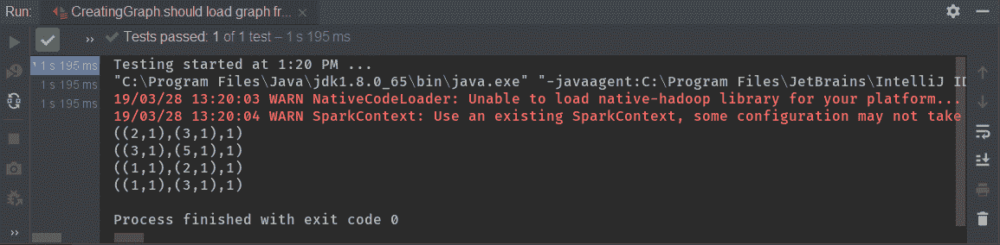

因此，根据输出的图，我们能够使用 Spark 重新加载我们的图。

# 使用 Vertex API

在这一部分，我们将使用边来构建图。我们将学习使用 Vertex API，并利用边的转换。

# 使用顶点构建图

构建图不是一项简单的任务；我们需要提供顶点和它们之间的边。让我们专注于第一部分。第一部分包括我们的`users`，`users`是一个`VertexId`和`String`的 RDD，如下所示：

```py
package com.tomekl007.chapter_7

import org.apache.spark.SparkContext
import org.apache.spark.graphx.{Edge, Graph, VertexId}
import org.apache.spark.rdd.RDD
import org.apache.spark.sql.SparkSession
import org.scalatest.FunSuite

class VertexAPI extends FunSuite {
  val spark: SparkContext = SparkSession.builder().master("local[2]").getOrCreate().sparkContext

  test("Should use Vertex API") {
    //given
    val users: RDD[(VertexId, (String))] =
      spark.parallelize(Array(
        (1L, "a"),
        (2L, "b"),
        (3L, "c"),
        (4L, "d")
      ))
```

`VertexId`是`long`类型；这只是`Long`的`type`别名：

```py
type VertexID = Long
```

但由于我们的图有时包含大量内容，`VertexId`应该是唯一的且非常长的数字。我们的顶点 RDD 中的每个顶点都应该有一个唯一的`VertexId`。与顶点关联的自定义数据可以是任何类，但我们将选择使用`String`类来简化。首先，我们创建一个 ID 为`1`的顶点和字符串数据`a`，下一个 ID 为`2`的顶点和字符串数据`b`，下一个 ID 为`3`的顶点和字符串数据`c`，以及 ID 为`4`的数据和字符串`d`，如下所示：

```py
    val users: RDD[(VertexId, (String))] =
      spark.parallelize(Array(
        (1L, "a"),
        (2L, "b"),
        (3L, "c"),
        (4L, "d")
      ))
```

仅从顶点创建图是正确的，但并不是非常有用。图是查找数据之间关系的最佳方式，这就是为什么图是社交网络的主要构建块。

# 创建夫妻关系

在这一部分，我们将创建顶点之间的夫妻关系和边缘。在这里，我们将有一个关系，即`Edge`。`Edge`是来自`org.apache.spark.graphx`包的一个样例类。它稍微复杂一些，因为我们需要指定源顶点 ID 和目标顶点 ID。我们想要指定顶点 ID`1`和`2`有一个关系，所以让我们为这个关系创建一个标签。在下面的代码中，我们将指定顶点 ID`1`和 ID`2`为`friend`，然后我们还将指定顶点 ID`1`和 ID`3`也为`friend`。最后，顶点 ID`2`和 ID`4`将是`wife`：

```py
    val relationships =
      spark.parallelize(Array(
        Edge(1L, 2L, "friend"),
        Edge(1L, 3L, "friend"),
        Edge(2L, 4L, "wife")
      ))
```

此外，标签可以是任何类型-它不需要是`String`类型；我们可以输入我们想要的内容并传递它。一旦我们有了我们的顶点、用户和边缘关系，我们就可以创建一个图。我们使用`Graph`类的`apply`方法来构建我们的 Spark GraphX 图。我们需要传递`users`、`VertexId`和`relationships`，如下所示：

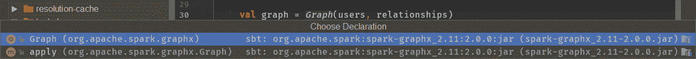

返回的`graph`是一个 RDD，但它是一个特殊的 RDD：

```py
    val graph = Graph(users, relationships)
```

当我们转到`Graph`类时，我们会看到`Graph`类有一个顶点的 RDD 和一个边缘的 RDD，所以`Graph`类是两个 RDD 的伴生对象，如下截图所示：

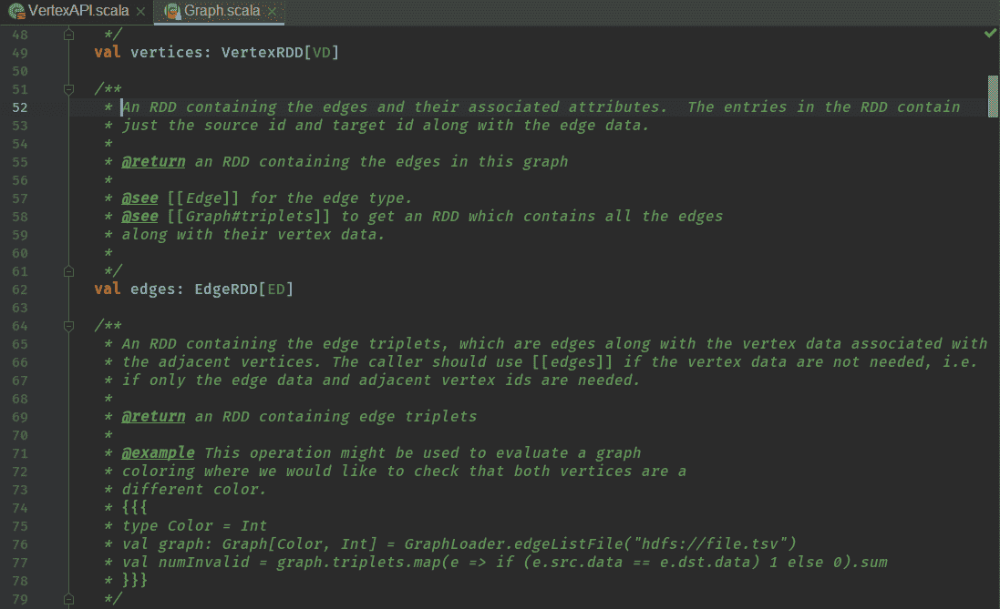

我们可以通过发出一些方法来获取`vertices`和`edges`的基础 RDD。例如，如果要获取所有顶点，我们可以映射所有顶点，我们将获取属性和`VertexId`。在这里，我们只对属性感兴趣，我们将其转换为大写，如下所示：

```py
    val res = graph.mapVertices((_, att) => att.toUpperCase())
```

以下是属性：

```py
    val users: RDD[(VertexId, (String))] =
      spark.parallelize(Array(
        (1L, "a"),
        (2L, "b"),
        (3L, "c"),
        (4L, "d")
      ))
```

一旦我们将其转换为大写，我们可以收集所有顶点并执行`toList()`，如下所示：

```py
    println(res.vertices.collect().toList)
  }

}
```

我们可以看到，在对值应用转换后，我们的图具有以下顶点：

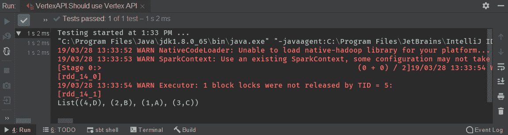

# 使用 Edge API

在这一部分，我们将使用 Edge API 构建图。我们还将使用顶点，但这次我们将专注于边缘转换。

# 使用边缘构建图

正如我们在前面的部分中看到的，我们有边缘和顶点，这是一个 RDD。由于这是一个 RDD，我们可以获取一个边缘。我们有许多可用于普通 RDD 的方法。我们可以使用`max`方法、`min`方法、`sum`方法和所有其他操作。我们将应用`reduce`方法，因此`reduce`方法将获取两个边缘，我们将获取`e1`、`e2`，并对其执行一些逻辑。

`e1`边缘是一个具有属性、目的地和源的边缘，如下截图所示：

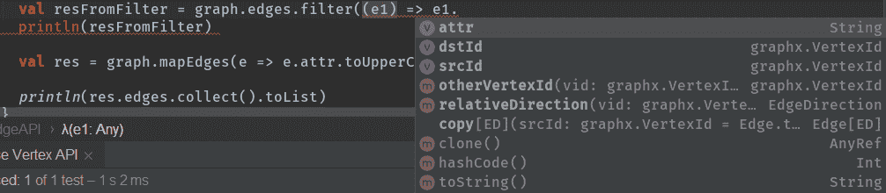

由于边缘将两个顶点链接在一起，我们可以在这里执行一些逻辑。例如，如果`e1`边缘属性等于`friend`，我们希望使用`filter`操作提升一个边缘。因此，`filter`方法只获取一个边缘，然后如果边缘`e1`是`friend`，它将被自动感知。我们可以看到最后我们可以`collect`它并执行`toList`，以便 Spark 上的 API 可供我们使用。以下代码将帮助我们实现我们的逻辑：

```py
import org.apache.spark.SparkContext
import org.apache.spark.graphx.{Edge, Graph, VertexId}
import org.apache.spark.rdd.RDD
import org.apache.spark.sql.SparkSession
import org.scalatest.FunSuite

class EdgeAPI extends FunSuite {
  val spark: SparkContext = SparkSession.builder().master("local[2]").getOrCreate().sparkContext

  test("Should use Edge API") {
    //given
    val users: RDD[(VertexId, (String))] =
      spark.parallelize(Array(
        (1L, "a"),
        (2L, "b"),
        (3L, "c"),
        (4L, "d")
      ))

    val relationships =
      spark.parallelize(Array(
        Edge(1L, 2L, "friend"),
        Edge(1L, 3L, "friend"),
        Edge(2L, 4L, "wife")
      ))

    val graph = Graph(users, relationships)

    //when
 val resFromFilter = graph.edges.filter((e1) => e1.attr == "friend").collect().toList
 println(resFromFilter)
```

它还具有标准 RDD 的一些方法。例如，我们可以执行一个 map edge，它将获取一个边缘，我们可以获取一个属性，并将每个标签映射为大写，如下所示：

```py
    val res = graph.mapEdges(e => e.attr.toUpperCase)
```

在图上，我们还可以执行边缘分组。边缘分组类似于`GROUP BY`，但仅适用于边缘。

输入以下命令以打印线路映射边缘：

```py
    println(res.edges.collect().toList)
```

让我们开始我们的代码。我们可以在输出中看到，我们的代码已经过滤了`wife`边缘-我们只能感知从顶点 ID`1`到 ID`2`的`friend`边缘，以及从顶点 ID`1`到 ID`3`的边缘，并将边缘映射如下截图所示：

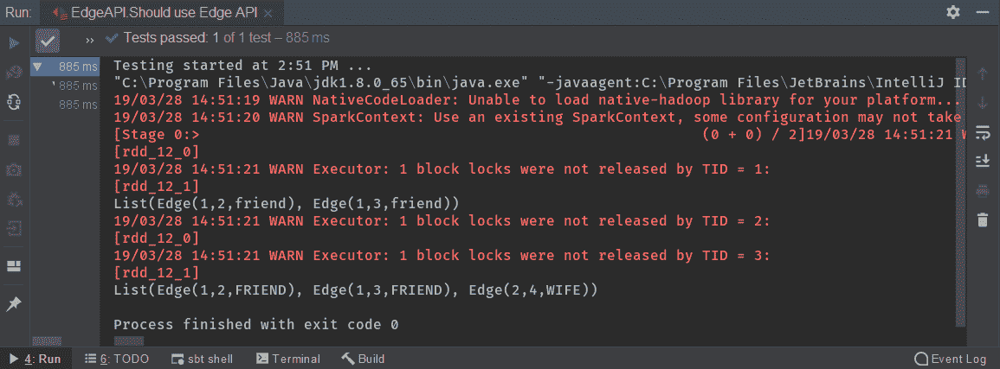

# 计算顶点的度

在本节中，我们将涵盖总度数，然后将其分为两部分——入度和出度——并且我们将了解这在代码中是如何工作的。

对于我们的第一个测试，让我们构建我们已经了解的图：

```py
package com.tomekl007.chapter_7

import org.apache.spark.SparkContext
import org.apache.spark.graphx.{Edge, Graph, VertexId}
import org.apache.spark.rdd.RDD
import org.apache.spark.sql.SparkSession
import org.scalatest.FunSuite
import org.scalatest.Matchers._

class CalculateDegreeTest extends FunSuite {
  val spark: SparkContext = SparkSession.builder().master("local[2]").getOrCreate().sparkContext

  test("should calculate degree of vertices") {
    //given
    val users: RDD[(VertexId, (String))] =
      spark.parallelize(Array(
        (1L, "a"),
        (2L, "b"),
        (3L, "c"),
        (4L, "d")
      ))

    val relationships =
      spark.parallelize(Array(
        Edge(1L, 2L, "friend"),
        Edge(1L, 3L, "friend"),
        Edge(2L, 4L, "wife")
      ))
```

我们可以使用`degrees`方法获得度。`degrees`方法返回`VertexRDD`，因为`degrees`是一个顶点：

```py
    val graph = Graph(users, relationships)

    //when
    val degrees = graph.degrees.collect().toList
```

结果如下：

```py
    //then
    degrees should contain theSameElementsAs List(
      (4L, 1L),
      (2L, 2L),
      (1L, 2L),
      (3L, 1L)
    )
  }
```

上面的代码解释了对于`VertexId 4L`实例，只有一个关系，因为`2L`和`4L`之间存在关系。

然后，对于`VertexId 2L`实例，有两个，分别是`1L, 2L`和`2L, 4L`。对于`VertexId 1L`实例，有两个，分别是`1L, 2L`和`1L, 3L`，对于`VertexId 3L`，只有一个关系，即`1L`和`3L`之间。通过这种方式，我们可以检查我们的图是如何耦合的，以及有多少关系。我们可以通过对它们进行排序来找出哪个顶点最知名，因此我们可以看到我们的测试在下面的截图中通过了。

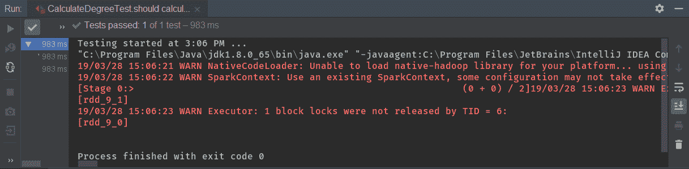

# 入度

入度告诉我们有多少个顶点进入第二个顶点，但反之则不然。这次，我们可以看到对于`VertexId 2L`实例，只有一个入站顶点。我们可以看到`2L`与`1L`有关系，`3L`也与`1L`有关系，`4L`与`1L`有关系。在下面的结果数据集中，将没有`VertexId 1L`的数据，因为`1L`是输入。所以，`1L`只会是一个源，而不是目的地：

```py
  test("should calculate in-degree of vertices") {
    //given
    val users: RDD[(VertexId, (String))] =
      spark.parallelize(Array(
        (1L, "a"),
        (2L, "b"),
        (3L, "c"),
        (4L, "d")
      ))

    val relationships =
      spark.parallelize(Array(
        Edge(1L, 2L, "friend"),
        Edge(1L, 3L, "friend"),
        Edge(2L, 4L, "wife")
      ))

    val graph = Graph(users, relationships)

    //when
    val degrees = graph.inDegrees.collect().toList

    //then
    degrees should contain theSameElementsAs List(
      (2L, 1L),
      (3L, 1L),
      (4L, 1L)
    )
  }
```

入度的前面特征是一个非常有用的属性。当我们无法找出哪些页面非常重要，因为它们通过页面而不是从页面链接时，我们使用入度。

通过运行这个测试，我们可以看到它按预期工作：

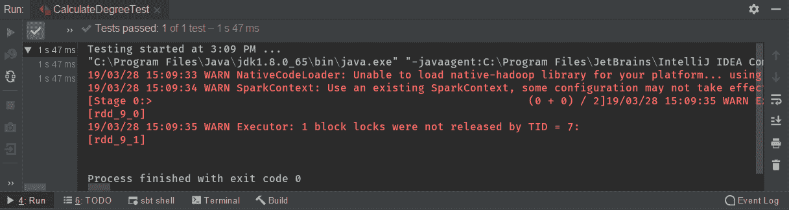

# 出度

出度解释了有多少个顶点出去。这次，我们将计算边缘、关系的源，而不是目的地，就像我们在入度方法中所做的那样。

为了获得出度，我们将使用以下代码：

```py
val degrees = graph.outDegrees.collect().toList
```

`outDegrees`方法包含`RDD`和`VertexRDD`，我们使用`collect`和`toList`方法将其收集到列表中。

在这里，`VertexId 1L`应该有两个出站顶点，因为`1L, 2L`和`1L, 3L`之间存在关系：

```py
  test("should calculate out-degree of vertices") {
    //given
    val users: RDD[(VertexId, (String))] =
      spark.parallelize(Array(
        (1L, "a"),
        (2L, "b"),
        (3L, "c"),
        (4L, "d")
      ))

    val relationships =
      spark.parallelize(Array(
        Edge(1L, 2L, "friend"),
        Edge(1L, 3L, "friend"),
        Edge(2L, 4L, "wife")
      ))

    val graph = Graph(users, relationships)

    //when
    val degrees = graph.outDegrees.collect().toList

    //then
    degrees should contain theSameElementsAs List(
      (1L, 2L),
      (2L, 1L)
    )
  }

}
```

另外，`VertexId 2L`应该有一个出站顶点，因为`2L`和`4L`之间存在关系，而反之则不然，如前面的代码所示。

我们将运行这个测试并得到以下输出：

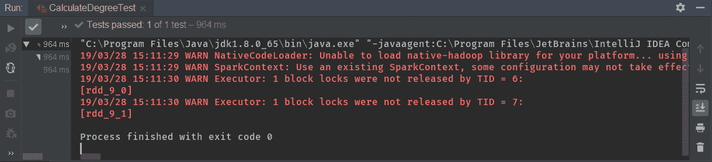

# 计算 PageRank

在本节中，我们将加载关于用户的数据并重新加载关于他们关注者的数据。我们将使用图形 API 和我们的数据结构，并计算 PageRank 来计算用户的排名。

首先，我们需要加载`edgeListFile`，如下所示：

```py
package com.tomekl007.chapter_7

import org.apache.spark.graphx.GraphLoader
import org.apache.spark.sql.SparkSession
import org.scalatest.FunSuite
import org.scalatest.Matchers._

class PageRankTest extends FunSuite {
  private val sc = SparkSession.builder().master("local[2]").getOrCreate().sparkContext

  test("should calculate page rank using GraphX API") {
    //given
    val graph = GraphLoader.edgeListFile(sc, getClass.getResource("/pagerank/followers.txt").getPath)
```

我们有一个`followers.txt`文件；以下截图显示了文件的格式，与我们在*创建加载器组件*部分看到的文件类似：

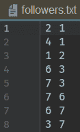

我们可以看到每个顶点 ID 之间存在关系。因此，我们从`followers.txt`文件加载`graph`，然后发出 PageRank。我们将需要`vertices`，如下所示：

```py
    val ranks = graph.pageRank(0.0001).vertices
```

PageRank 将计算我们的顶点之间的影响和关系。

# 加载和重新加载关于用户和关注者的数据

为了找出哪个用户有哪个名字，我们需要加载`users.txt`文件。`users.txt`文件将`VertexId`分配给用户名和自己的名字。我们使用以下代码：

```py
    val users = sc.textFile(getClass.getResource("/pagerank/users.txt").getPath).map { line =>
```

以下是`users.txt`文件：

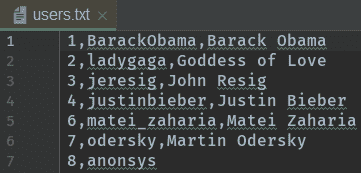

我们在逗号上拆分，第一组是我们的整数，它将是顶点 ID，然后`fields(1)`是顶点的名称，如下所示：

```py
      val fields = line.split(",")
      (fields(0).toLong, fields(1))
    }
```

接下来，我们将使用`join`将`users`与`ranks`连接起来。我们将使用用户的`VertexId`通过用户的`username`和`rank`来`join` `users`。一旦我们有了这些，我们就可以按`rank`对所有内容进行排序，所以我们将取元组的第二个元素，并且应该按`sortBy ((t) =>t.2`进行排序。在文件的开头，我们将拥有影响力最大的用户：

```py
    //when
 val rankByUsername = users.join(ranks).map {
      case (_, (username, rank)) => (username, rank)
    }.sortBy((t) => t._2, ascending = false)
      .collect()
      .toList
```

我们将打印以下内容并按`rankByUsername`进行排序：

```py
    println(rankByUsername)
    //then
    rankByUsername.map(_._1) should contain theSameElementsInOrderAs List(
      "BarackObama",
      "ladygaga",
      "odersky",
      "jeresig",
      "matei_zaharia",
      "justinbieber"
    )
  }

}
```

如果我们跳过`sortBy`方法，Spark 不保证元素的任何排序；为了保持排序，我们需要使用`sortBy`方法。

在运行代码后，我们得到以下输出：

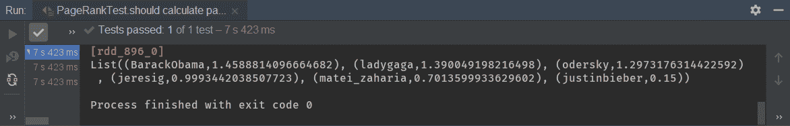

当我们开始运行这个测试时，我们可以看到 GraphX PageRank 是否能够计算出我们用户的影响力。我们得到了前面截图中显示的输出，其中`BarackObama`的影响力最大为`1.45`，然后是`ladygaga`，影响力为`1.39`，`odersky`为`1.29`，`jeresig`为`0.99`，`matai_zaharia`为`0.70`，最后是`justinbieber`，影响力为`0.15`。

根据前面的信息，我们能够用最少的代码计算复杂的算法。

# 总结

在本章中，我们深入研究了转换和操作，然后学习了 Spark 的不可变设计。我们研究了如何避免洗牌以及如何减少运营成本。然后，我们看了如何以正确的格式保存数据。我们还学习了如何使用 Spark 键/值 API 以及如何测试 Apache Spark 作业。之后，我们学习了如何从数据源创建图形，然后研究并尝试了边缘和顶点 API。我们学习了如何计算顶点的度。最后，我们看了 PageRank 以及如何使用 Spark GraphicX API 进行计算。
