# 第二章：*第二章*：使用 Pandas DataFrame

是时候开始我们的 `pandas` 之旅了。本章将让我们熟悉在进行数据分析时使用 `pandas` 执行一些基本但强大的操作。

我们将从介绍主要的 `pandas` 开始。数据结构为我们提供了一种组织、管理和存储数据的格式。了解 `pandas` 数据结构在解决问题或查找如何对数据执行某项操作时将无比有帮助。请记住，这些数据结构与标准 Python 数据结构不同，原因是它们是为特定的分析任务而创建的。我们必须记住，某个方法可能只能在特定的数据结构上使用，因此我们需要能够识别最适合我们要解决的问题的数据结构。

接下来，我们将把第一个数据集导入 Python。我们将学习如何从 API 获取数据、从其他 Python 数据结构创建 `DataFrame` 对象、读取文件并与数据库进行交互。起初，你可能会想，为什么我们需要从其他 Python 数据结构创建 `DataFrame` 对象；然而，如果我们想要快速测试某些内容、创建自己的数据、从 API 拉取数据，或者重新利用其他项目中的 Python 代码，那么我们会发现这些知识是不可或缺的。最后，我们将掌握检查、描述、过滤和总结数据的方法。

本章将涵盖以下主题：

+   Pandas 数据结构

+   从文件、API 请求、SQL 查询和其他 Python 对象创建 DataFrame 对象

+   检查 DataFrame 对象并计算总结统计量

+   通过选择、切片、索引和过滤获取数据的子集

+   添加和删除数据

# 本章内容

本章中我们将使用的文件可以在 GitHub 仓库中找到，地址是 [`github.com/stefmolin/Hands-On-Data-Analysis-with-Pandas-2nd-edition/tree/master/ch_02`](https://github.com/stefmolin/Hands-On-Data-Analysis-with-Pandas-2nd-edition/tree/master/ch_02)。我们将使用来自 `data/` 目录的地震数据。

本章中会使用四个 CSV 文件和一个 SQLite 数据库文件，它们将在不同的时间点被使用。`earthquakes.csv`文件包含从 USGS API 拉取的 2018 年 9 月 18 日到 10 月 13 日的数据。对于数据结构的讨论，我们将使用`example_data.csv`文件，该文件包含五行数据，并且是`earthquakes.csv`文件中的列的子集。`tsunamis.csv`文件是`earthquakes.csv`文件中所有伴随海啸的地震数据的子集，时间范围为上述日期。`quakes.db`文件包含一个 SQLite 数据库，其中有一个表存储着海啸数据。我们将利用这个数据库学习如何使用`pandas`从数据库中读取和写入数据。最后，`parsed.csv`文件将用于本章结尾的练习，我们也将在本章中演示如何创建它。

本章的伴随代码已被分成六个 Jupyter Notebooks，按照使用顺序编号。它们包含了我们在本章中将运行的代码片段，以及任何需要为本文本进行裁剪的命令的完整输出。每次需要切换笔记本时，文本会指示进行切换。

在`1-pandas_data_structures.ipynb`笔记本中，我们将开始学习主要的`pandas`数据结构。之后，我们将在`2-creating_dataframes.ipynb`笔记本中讨论创建`DataFrame`对象的各种方式。我们将在`3-making_dataframes_from_api_requests.ipynb`笔记本中继续讨论此话题，探索 USGS API 以收集数据供`pandas`使用。学习完如何收集数据后，我们将开始学习如何在`4-inspecting_dataframes.ipynb`笔记本中检查数据。然后，在`5-subsetting_data.ipynb`笔记本中，我们将讨论各种选择和过滤数据的方式。最后，我们将在`6-adding_and_removing_data.ipynb`笔记本中学习如何添加和删除数据。让我们开始吧。

# Pandas 数据结构

Python 本身已经提供了几种数据结构，如元组、列表和字典。Pandas 提供了两种主要的数据结构来帮助处理数据：`Series`和`DataFrame`。`Series`和`DataFrame`数据结构中各自包含了另一种`pandas`数据结构——`Index`，我们也需要了解它。然而，为了理解这些数据结构，我们首先需要了解 NumPy（[`numpy.org/doc/stable/`](https://numpy.org/doc/stable/)），它提供了`pandas`所依赖的 n 维数组。

前述的数据结构以 Python `CapWords`风格实现，而对象则采用`snake_case`书写。（更多 Python 风格指南请参见[`www.python.org/dev/peps/pep-0008/`](https://www.python.org/dev/peps/pep-0008/)。）

我们使用`pandas`函数将 CSV 文件读取为`DataFrame`类的对象，但我们使用`DataFrame`对象的方法对其执行操作，例如删除列或计算汇总统计数据。使用`pandas`时，我们通常希望访问`pandas`对象的属性，如维度、列名、数据类型以及是否为空。

重要提示

在本书的其余部分，我们将`DataFrame`对象称为 dataframe，`Series`对象称为 series，`Index`对象称为 index/indices，除非我们明确指的是类本身。

对于本节内容，我们将在`1-pandas_data_structures.ipynb`笔记本中进行操作。首先，我们将导入`numpy`并使用它读取`example_data.csv`文件的内容到一个`numpy.array`对象中。数据来自美国地质调查局（USGS）的地震 API（来源：[`earthquake.usgs.gov/fdsnws/event/1/`](https://earthquake.usgs.gov/fdsnws/event/1/)）。请注意，这是我们唯一一次使用 NumPy 读取文件，并且这样做仅仅是为了演示；重要的是要查看 NumPy 表示数据的方式：

```py
>>> import numpy as np
>>> data = np.genfromtxt(
...     'data/example_data.csv', delimiter=';', 
...     names=True, dtype=None, encoding='UTF'
... )
>>> data
array([('2018-10-13 11:10:23.560',
'262km NW of Ozernovskiy, Russia', 
        'mww', 6.7, 'green', 1),
('2018-10-13 04:34:15.580', 
        '25km E of Bitung, Indonesia', 'mww', 5.2, 'green', 0),
('2018-10-13 00:13:46.220', '42km WNW of Sola, Vanuatu', 
        'mww', 5.7, 'green', 0),
('2018-10-12 21:09:49.240', 
        '13km E of Nueva Concepcion, Guatemala',
        'mww', 5.7, 'green', 0),
('2018-10-12 02:52:03.620', 
        '128km SE of Kimbe, Papua New Guinea',
        'mww', 5.6, 'green', 1)],
      dtype=[('time', '<U23'), ('place', '<U37'),
             ('magType', '<U3'), ('mag', '<f8'),
             ('alert', '<U5'), ('tsunami', '<i8')])
```

现在我们将数据存储在一个 NumPy 数组中。通过使用`shape`和`dtype`属性，我们可以分别获取数组的维度信息和其中包含的数据类型：

```py
>>> data.shape
(5,)
>>> data.dtype
dtype([('time', '<U23'), ('place', '<U37'), ('magType', '<U3'), 
       ('mag', '<f8'), ('alert', '<U5'), ('tsunami', '<i8')])
```

数组中的每个条目都是 CSV 文件中的一行。NumPy 数组包含单一的数据类型（不同于允许混合类型的列表）；这使得快速的矢量化操作成为可能。当我们读取数据时，我们得到了一个`numpy.void`对象的数组，它用于存储灵活的类型。这是因为 NumPy 必须为每一行存储多种不同的数据类型：四个字符串，一个浮点数和一个整数。不幸的是，这意味着我们不能利用 NumPy 为单一数据类型对象提供的性能提升。

假设我们想找出最大幅度——我们可以使用`numpy.void`对象。这会创建一个列表，意味着我们可以使用`max()`函数来找出最大值。我们还可以使用`%%timeit` `%`）来查看这个实现所花费的时间（时间会有所不同）：

```py
>>> %%timeit
>>> max([row[3] for row in data])
9.74 µs ± 177 ns per loop 
(mean ± std. dev. of 7 runs, 100000 loops each)
```

请注意，每当我们编写一个只有一行内容的`for`循环，或者想要对初始列表的成员执行某个操作时，应该使用列表推导式。这是一个相对简单的列表推导式，但我们可以通过添加`if...else`语句使其更加复杂。列表推导式是我们工具箱中一个非常强大的工具。更多信息可以参考 Python 文档：https://docs.python.org/3/tutorial/datastructures.html#list-comprehensions。

提示

**IPython** ([`ipython.readthedocs.io/en/stable/index.html`](https://ipython.readthedocs.io/en/stable/index.html)) 提供了一个 Python 的交互式 Shell。Jupyter 笔记本是建立在 IPython 之上的。虽然本书不要求掌握 IPython，但熟悉一些 IPython 的功能会有所帮助。IPython 在其文档中提供了一个教程，链接是 [`ipython.readthedocs.io/en/stable/interactive/`](https://ipython.readthedocs.io/en/stable/interactive/)。

如果我们为每一列创建一个 NumPy 数组，那么这项操作将变得更加简单（且更高效）。为了实现这一点，我们将使用**字典推导式** ([`www.python.org/dev/peps/pep-0274/`](https://www.python.org/dev/peps/pep-0274/)) 来创建一个字典，其中键是列名，值是包含数据的 NumPy 数组。同样，重要的部分在于数据现在是如何使用 NumPy 表示的：

```py
>>> array_dict = {
...     col: np.array([row[i] for row in data])
...     for i, col in enumerate(data.dtype.names)
... }
>>> array_dict
{'time': array(['2018-10-13 11:10:23.560',
        '2018-10-13 04:34:15.580', '2018-10-13 00:13:46.220',
        '2018-10-12 21:09:49.240', '2018-10-12 02:52:03.620'],
        dtype='<U23'),
 'place': array(['262km NW of Ozernovskiy, Russia', 
        '25km E of Bitung, Indonesia',
        '42km WNW of Sola, Vanuatu',
        '13km E of Nueva Concepcion, Guatemala',
        '128km SE of Kimbe, Papua New Guinea'], dtype='<U37'),
 'magType': array(['mww', 'mww', 'mww', 'mww', 'mww'], 
        dtype='<U3'),
 'mag': array([6.7, 5.2, 5.7, 5.7, 5.6]),
 'alert': array(['green', 'green', 'green', 'green', 'green'], 
        dtype='<U5'),
 'tsunami': array([1, 0, 0, 0, 1])}
```

现在，获取最大值的幅度仅仅是选择`mag`键并在 NumPy 数组上调用`max()`方法。这比列表推导式的实现速度快近两倍，尤其是处理仅有五个条目的数据时——想象一下，第一个尝试在大数据集上的表现将会有多糟糕：

```py
>>> %%timeit
>>> array_dict['mag'].max()
5.22 µs ± 100 ns per loop 
(mean ± std. dev. of 7 runs, 100000 loops each)
```

然而，这种表示方式还有其他问题。假设我们想获取最大幅度的地震的所有信息；我们该如何操作呢？我们需要找到最大值的索引，然后对于字典中的每一个键，获取该索引。结果现在是一个包含字符串的 NumPy 数组（我们的数值已被转换），并且我们现在处于之前看到的格式：

```py
>>> np.array([
...     value[array_dict['mag'].argmax()]
...     for key, value in array_dict.items()
... ])
array(['2018-10-13 11:10:23.560',
       '262km NW of Ozernovskiy, Russia',
       'mww', '6.7', 'green', '1'], dtype='<U31')
```

考虑如何按幅度从小到大排序数据。在第一种表示方式中，我们需要通过检查第三个索引来对行进行排序。而在第二种表示方式中，我们需要确定`mag`列的索引顺序，然后按照这些相同的索引排序所有其他数组。显然，同时操作多个包含不同数据类型的 NumPy 数组有些繁琐；然而，`pandas`是在 NumPy 数组之上构建的，可以让这一过程变得更加简单。让我们从`Series`数据结构的概述开始，探索`pandas`。

## Series

`Series`类提供了一种数据结构，用于存储单一类型的数组，就像 NumPy 数组一样。然而，它还提供了一些额外的功能。这个一维表示可以被看作是电子表格中的一列。我们为我们的列命名，而其中的数据是相同类型的（因为我们测量的是相同的变量）：

```py
>>> import pandas as pd
>>> place = pd.Series(array_dict['place'], name='place')
>>> place
0          262km NW of Ozernovskiy, Russia
1              25km E of Bitung, Indonesia
2                42km WNW of Sola, Vanuatu
3    13km E of Nueva Concepcion, Guatemala
4      128km SE of Kimbe, Papua New Guinea
Name: place, dtype: object
```

注意结果左侧的数字；这些数字对应于原始数据集中行号（由于 Python 中的计数是从 0 开始的，因此行号比实际行号少 1）。这些行号构成了索引，我们将在接下来的部分讨论。行号旁边是行的实际值，在本示例中，它是一个字符串，指示地震发生的地点。请注意，在 `Series` 对象的名称旁边，我们有 `dtype: object`；这表示 `place` 的数据类型是 `object`。在 `pandas` 中，字符串会被分类为 `object`。

要访问 `Series` 对象的属性，我们使用 `<object>.<attribute_name>` 这种属性表示法。以下是我们将要访问的一些常用属性。注意，`dtype` 和 `shape` 是可用的，正如我们在 NumPy 数组中看到的那样：

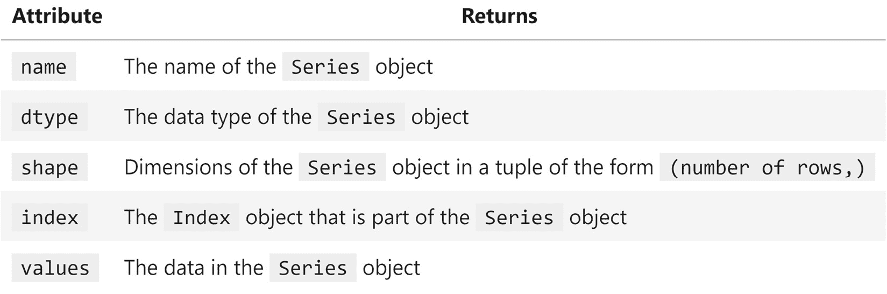

图 2.1 – 常用的系列属性

重要提示

大多数情况下，`pandas` 对象使用 NumPy 数组来表示其内部数据。然而，对于某些数据类型，`pandas` 在 NumPy 的基础上构建了自己的数组（https://pandas.pydata.org/pandas-docs/stable/reference/arrays.html）。因此，根据数据类型，`values` 方法返回的可能是 `pandas.array` 或 `numpy.array` 对象。因此，如果我们需要确保获得特定类型的数据，建议使用 `array` 属性或 `to_numpy()` 方法，而不是 `values`。

请务必将 `pandas.Series` 文档（[`pandas.pydata.org/pandas-docs/stable/reference/api/pandas.Series.html`](https://pandas.pydata.org/pandas-docs/stable/reference/api/pandas.Series.html)）收藏以便以后参考。它包含有关如何创建 `Series` 对象、所有可用属性和方法的完整列表，以及源代码链接。在了解了 `Series` 类的高层次介绍后，我们可以继续学习 `Index` 类。

## 索引

`Index` 类的引入使得 `Series` 类比 NumPy 数组更为强大。`Index` 类为我们提供了行标签，使得我们可以通过行号选择数据。根据索引的类型，我们可以提供行号、日期，甚至字符串来选择行。它在数据条目的标识中起着关键作用，并在 `pandas` 中的多种操作中被使用，正如我们在本书中将要看到的那样。我们可以通过 `index` 属性访问索引：

```py
>>> place_index = place.index
>>> place_index
RangeIndex(start=0, stop=5, step=1)
```

注意，这是一个 `RangeIndex` 对象。它的值从 `0` 开始，到 `4` 结束。步长为 `1` 表明索引值之间的差距为 1，意味着我们有该范围内的所有整数。默认的索引类是 `RangeIndex`；但是，我们可以更改索引，正如我们将在*第三章* *《数据清理与 Pandas》*中讨论的那样。通常，我们要么使用行号的 `Index` 对象，要么使用日期（时间）的 `Index` 对象。

与`Series`对象一样，我们可以通过`values`属性访问底层数据。请注意，这个`Index`对象是基于一个 NumPy 数组构建的：

```py
>>> place_index.values
array([0, 1, 2, 3, 4], dtype=int64)
```

`Index`对象的一些有用属性包括：

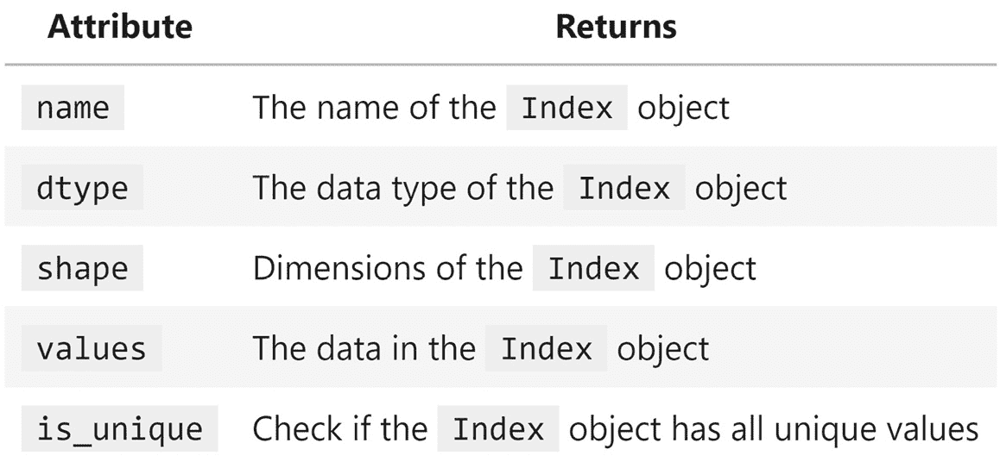

图 2.2 – 常用的索引属性

NumPy 和`pandas`都支持算术运算，这些运算将按元素逐一执行。NumPy 会使用数组中的位置来进行运算：

```py
>>> np.array([1, 1, 1]) + np.array([-1, 0, 1])
array([0, 1, 2])
```

在`pandas`中，这种按元素逐一执行的算术运算是基于匹配的索引值进行的。如果我们将一个索引从`0`到`4`的`Series`对象（存储在`x`中）与另一个索引从`1`到`5`的`y`对象相加，只有当索引对齐时，我们才会得到结果（`1`到`4`）。在*第三章*，*使用 Pandas 进行数据整理*中，我们将讨论一些方法来改变和对齐索引，这样我们就可以执行这些类型的操作而不丢失数据：

```py
>>> numbers = np.linspace(0, 10, num=5) # [0, 2.5, 5, 7.5, 10]
>>> x = pd.Series(numbers) # index is [0, 1, 2, 3, 4]
>>> y = pd.Series(numbers, index=pd.Index([1, 2, 3, 4, 5]))
>>> x + y
0     NaN
1     2.5
2     7.5
3    12.5
4    17.5
5     NaN
dtype: float64
```

现在我们已经了解了`Series`和`Index`类的基础知识，接下来我们可以学习`DataFrame`类。请注意，关于`Index`类的更多信息可以在相应的文档中找到：[`pandas.pydata.org/pandas-docs/stable/reference/api/pandas.Index.html`](https://pandas.pydata.org/pandas-docs/stable/reference/api/pandas.Index.html)。

## 数据框

在`Series`类中，我们本质上处理的是电子表格的列，数据类型都是相同的。`DataFrame`类是在`Series`类基础上构建的，可以拥有多个列，每列都有其自己的数据类型；我们可以将其看作是代表整个电子表格。我们可以将我们从示例数据中构建的 NumPy 表示形式转化为`DataFrame`对象：

```py
>>> df = pd.DataFrame(array_dict) 
>>> df
```

这给我们提供了一个由六个系列组成的数据框。请注意`time`列前面的那一列；它是行的`Index`对象。在创建`DataFrame`对象时，`pandas`会将所有的系列对齐到相同的索引。在这种情况下，它仅仅是行号，但我们也可以轻松地使用`time`列作为索引，这将启用一些额外的`pandas`功能，正如我们在*第四章*，*聚合 Pandas 数据框*中将看到的那样：

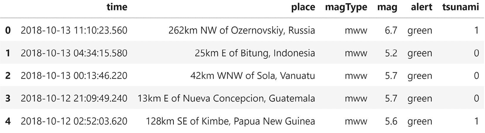

图 2.3 – 我们的第一个数据框

我们的列每一列都有单一的数据类型，但它们并非都具有相同的数据类型：

```py
>>> df.dtypes
time        object
place       object
magType     object
mag        float64
alert       object
tsunami      int64
dtype: object
```

数据框的值看起来与我们最初的 NumPy 表示非常相似：

```py
>>> df.values
array([['2018-10-13 11:10:23.560',
        '262km NW of Ozernovskiy, Russia',
        'mww', 6.7, 'green', 1],
['2018-10-13 04:34:15.580', 
        '25km E of Bitung, Indonesia', 'mww', 5.2, 'green', 0],
['2018-10-13 00:13:46.220', '42km WNW of Sola, Vanuatu', 
        'mww', 5.7, 'green', 0],
       ['2018-10-12 21:09:49.240',
        '13km E of Nueva Concepcion, Guatemala',
        'mww', 5.7, 'green', 0],
['2018-10-12 02:52:03.620','128 km SE of Kimbe, 
Papua New Guinea', 'mww', 5.6, 'green', 1]], 
      dtype=object)
```

我们可以通过`columns`属性访问列名。请注意，它们实际上也存储在一个`Index`对象中：

```py
>>> df.columns
Index(['time', 'place', 'magType', 'mag', 'alert', 'tsunami'], 
      dtype='object')
```

以下是一些常用的数据框属性：

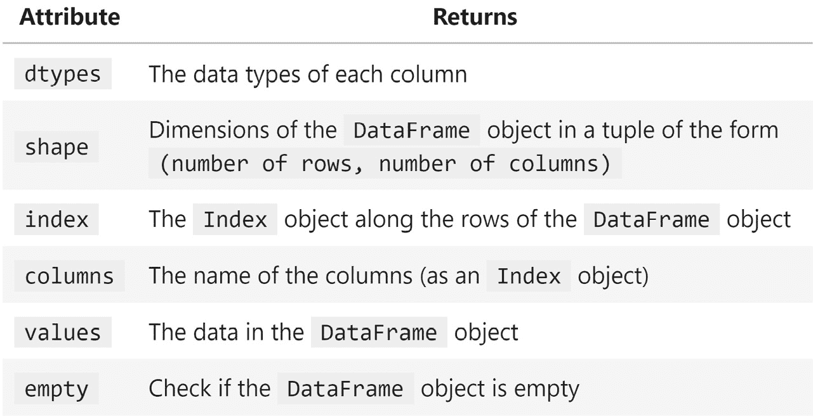

图 2.4 – 常用的数据框属性

请注意，我们也可以对数据框执行算术运算。例如，我们可以将`df`加到它自己上，这将对数值列进行求和，并将字符串列进行连接：

```py
>>> df + df
```

Pandas 只有在索引和列都匹配时才会执行操作。在这里，`pandas`将字符串类型的列（`time`、`place`、`magType` 和 `alert`）在数据框之间进行了合并。而数值类型的列（`mag` 和 `tsunami`）则进行了求和：

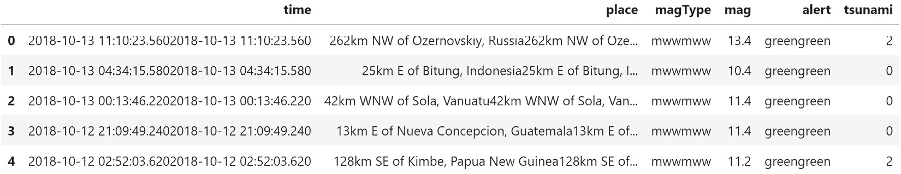

图 2.5 – 添加数据框

关于`DataFrame`对象以及可以直接对其执行的所有操作的更多信息，请参考官方文档：[`pandas.pydata.org/pandas-docs/stable/reference/api/pandas.DataFrame.html`](https://pandas.pydata.org/pandas-docs/stable/reference/api/pandas.DataFrame.html)；请务必将其添加书签以备将来参考。现在，我们已经准备好开始学习如何从各种来源创建`DataFrame`对象。

# 创建 pandas DataFrame

现在我们已经了解了将要使用的数据结构，接下来可以讨论创建它们的不同方式。然而，在深入代码之前，了解如何直接从 Python 获取帮助是非常重要的。如果我们在使用 Python 时遇到不确定的地方，可以使用内置的`help()`函数。我们只需要运行`help()`，并传入我们想查看文档的包、模块、类、对象、方法或函数。当然，我们也可以在线查找文档；然而，在大多数情况下，`help()`与在线文档是等效的，因为它们用于生成文档。

假设我们首先运行了`import pandas as pd`，然后可以运行`help(pd)`来显示有关`pandas`包的信息；`help(pd.DataFrame)`来查看所有关于`DataFrame`对象的方法和属性（注意，我们也可以传入一个`DataFrame`对象）；`help(pd.read_csv)`以了解有关`pandas`读取 CSV 文件到 Python 中的函数及其使用方法。我们还可以尝试使用`dir()`函数和`__dict__`属性，它们将分别为我们提供可用项的列表或字典；不过，它们可能没有`help()`函数那么有用。

此外，我们还可以使用`?`和`??`来获取帮助，这得益于 IPython，它是 Jupyter Notebooks 强大功能的一部分。与`help()`函数不同，我们可以在想要了解更多的内容后加上问号，就像在问 Python 一个问题一样；例如，`pd.read_csv?`和`pd.read_csv??`。这三者会输出略有不同的信息：`help()`会提供文档字符串；`?`会提供文档字符串，并根据我们的查询增加一些附加信息；而`??`会提供更多信息，且在可能的情况下，还会显示源代码。

现在，让我们转到下一个笔记本文件`2-creating_dataframes.ipynb`，并导入我们即将使用的包。我们将使用 Python 标准库中的`datetime`，以及第三方包`numpy`和`pandas`：

```py
>>> import datetime as dt
>>> import numpy as np
>>> import pandas as pd
```

重要提示

我们通过将`pandas`包引入并为其指定别名`pd`，这是导入`pandas`最常见的方式。事实上，我们只能用`pd`来引用它，因为那是我们导入到命名空间中的别名。包需要在使用之前导入；安装将所需的文件放在我们的计算机上，但为了节省内存，Python 不会在启动时加载所有已安装的包——只有我们明确告诉它加载的包。

现在我们已经准备好开始使用`pandas`了。首先，我们将学习如何从其他 Python 对象创建`pandas`对象。接着，我们将学习如何从平面文件、数据库中的表格以及 API 请求的响应中创建`pandas`对象。

## 从 Python 对象

在讲解如何从 Python 对象创建`DataFrame`对象的所有方法之前，我们应该先了解如何创建`Series`对象。记住，`Series`对象本质上是`DataFrame`对象中的一列，因此，一旦我们掌握了这一点，理解如何创建`DataFrame`对象应该就不难了。假设我们想创建一个包含五个介于`0`和`1`之间的随机数的序列，我们可以使用 NumPy 生成随机数数组，并从中创建序列。

提示

NumPy 使得生成数值数据变得非常简单。除了生成随机数外，我们还可以使用`np.linspace()`函数在某个范围内生成均匀分布的数值；使用`np.arange()`函数获取一系列整数；使用`np.random.normal()`函数从标准正态分布中抽样；以及使用`np.zeros()`函数轻松创建全零数组，使用`np.ones()`函数创建全一数组。本书中我们将会一直使用 NumPy。

为了确保结果是可重复的，我们将在这里设置种子。任何具有类似列表结构的`Series`对象（例如 NumPy 数组）：

```py
>>> np.random.seed(0) # set a seed for reproducibility
>>> pd.Series(np.random.rand(5), name='random')
0    0.548814
1    0.715189
2    0.602763
3    0.544883
4    0.423655
Name: random, dtype: float64
```

创建`DataFrame`对象是创建`Series`对象的扩展；它由一个或多个系列组成，每个系列都会有不同的名称。这让我们联想到 Python 中的字典结构：键是列名，值是列的内容。注意，如果我们想将一个单独的`Series`对象转换为`DataFrame`对象，可以使用它的`to_frame()`方法。

提示

在计算机科学中，`__init__()`方法。当我们运行`pd.Series()`时，Python 会调用`pd.Series.__init__()`，该方法包含实例化新`Series`对象的指令。我们将在*第七章*中进一步了解`__init__()`方法，*金融分析 – 比特币与股票市场*。

由于列可以是不同的数据类型，让我们通过这个例子来做一些有趣的事情。我们将创建一个包含三列、每列有五个观察值的`DataFrame`对象：

+   `random`：五个介于`0`和`1`之间的随机数，作为一个 NumPy 数组

+   `text`：一个包含五个字符串或`None`的列表

+   `truth`：一个包含五个随机布尔值的列表

我们还将使用`pd.date_range()`函数创建一个`DatetimeIndex`对象。该索引将包含五个日期（`periods=5`），日期之间相隔一天（`freq='1D'`），并以 2019 年 4 月 21 日（`end`）为结束日期，索引名称为`date`。请注意，关于`pd.date_range()`函数接受的频率值的更多信息，请参见[`pandas.pydata.org/pandas-docs/stable/user_guide/timeseries.html#offset-aliases`](https://pandas.pydata.org/pandas-docs/stable/user_guide/timeseries.html#offset-aliases)。

我们所需要做的，就是将列打包成字典，使用所需的列名作为键，并在调用`pd.DataFrame()`构造函数时传入该字典。索引通过`index`参数传递：

```py
>>> np.random.seed(0) # set seed so result is reproducible
>>> pd.DataFrame(
...     {
...         'random': np.random.rand(5),
...         'text': ['hot', 'warm', 'cool', 'cold', None],
...         'truth': [np.random.choice([True, False]) 
...                   for _ in range(5)]
...     }, 
...     index=pd.date_range(
...         end=dt.date(2019, 4, 21),
...         freq='1D', periods=5, name='date'
...     )
... )
```

重要提示

按照约定，我们使用`_`来存放在循环中我们不关心的变量。在这里，我们使用`range()`作为计数器，其值不重要。有关`_`在 Python 中作用的更多信息，请参见[`hackernoon.com/understanding-the-underscore-of-python-309d1a029edc`](https://hackernoon.com/understanding-the-underscore-of-python-309d1a029edc)。

在索引中包含日期，使得通过日期（甚至日期范围）选择条目变得容易，正如我们在*第三章*《Pandas 数据处理》中将看到的那样：

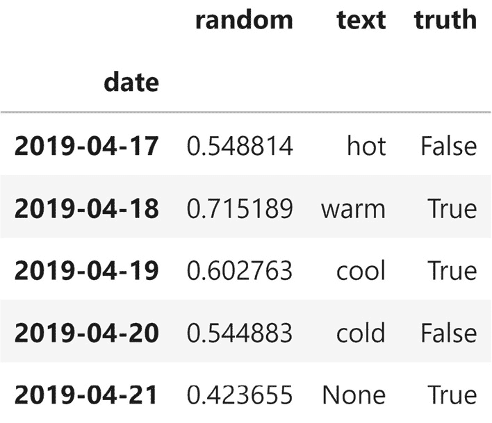

图 2.6 – 从字典创建数据框

在数据不是字典而是字典列表的情况下，我们仍然可以使用`pd.DataFrame()`。这种格式的数据通常来自 API。当数据以这种格式时，列表中的每个条目将是一个字典，字典的键是列名，字典的值是该索引处该列的值：

```py
>>> pd.DataFrame([
...     {'mag': 5.2, 'place': 'California'},
...     {'mag': 1.2, 'place': 'Alaska'},
...     {'mag': 0.2, 'place': 'California'},
... ])
```

这将给我们一个包含三行（每个列表条目对应一行）和两列（每个字典的键对应一列）的数据框：

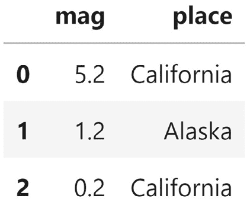

图 2.7 – 从字典列表创建数据框

事实上，`pd.DataFrame()`也适用于元组列表。注意，我们还可以通过`columns`参数将列名作为列表传入：

```py
>>> list_of_tuples = [(n, n**2, n**3) for n in range(5)]
>>> list_of_tuples
[(0, 0, 0), (1, 1, 1), (2, 4, 8), (3, 9, 27), (4, 16, 64)]
>>> pd.DataFrame(
...     list_of_tuples,
...     columns=['n', 'n_squared', 'n_cubed']
... )
```

每个元组被当作记录处理，并成为数据框中的一行：

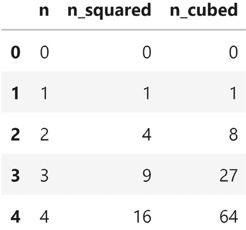

图 2.8 – 从元组列表创建数据框

我们还可以选择使用`pd.DataFrame()`与 NumPy 数组：

```py
>>> pd.DataFrame(
...     np.array([
...         [0, 0, 0],
...         [1, 1, 1],
...         [2, 4, 8],
...         [3, 9, 27],
...         [4, 16, 64]
...     ]), columns=['n', 'n_squared', 'n_cubed']
... )
```

这样会将数组中的每个条目按行堆叠到数据框中，得到的结果与*图 2.8*完全相同。

## 从文件

我们想要分析的数据大多数来自 Python 之外。在很多情况下，我们可能会从数据库或网站获得一个**数据转储**，然后将其带入 Python 进行筛选。数据转储之所以得名，是因为它包含大量数据（可能是非常详细的层次），且最初往往不加区分；因此，它们可能显得笨重。

通常，这些数据转储会以文本文件（`.txt`）或 CSV 文件（`.csv`）的形式出现。Pandas 提供了许多读取不同类型文件的方法，因此我们只需查找匹配我们文件格式的方法即可。我们的地震数据是 CSV 文件，因此我们使用`pd.read_csv()`函数来读取它。然而，在尝试读取之前，我们应始终先进行初步检查；这将帮助我们确定是否需要传递其他参数，比如`sep`来指定分隔符，或`names`来在文件没有表头行的情况下手动提供列名。

重要提示

**Windows 用户**：根据您的设置，接下来的代码块中的命令可能无法正常工作。如果遇到问题，笔记本中有替代方法。

我们可以直接在 Jupyter Notebook 中进行尽职调查，得益于 IPython，只需在命令前加上`!`，表示这些命令将作为 Shell 命令执行。首先，我们应该检查文件的大小，既要检查行数，也要检查字节数。要检查行数，我们使用`wc`工具（单词计数）并加上`-l`标志来计算行数。我们文件中有 9,333 行：

```py
>>> !wc -l data/earthquakes.csv
9333 data/earthquakes.csv
```

现在，让我们检查一下文件的大小。为此，我们将使用`ls`命令查看`data`目录中的文件列表。我们可以添加`-lh`标志，以便以易于阅读的格式获取文件信息。最后，我们将此输出发送到`grep`工具，它将帮助我们筛选出我们想要的文件。这告诉我们，`earthquakes.csv`文件的大小为 3.4 MB：

```py
>>> !ls -lh data | grep earthquakes.csv
-rw-r--r-- 1 stefanie stefanie 3.4M ... earthquakes.csv
```

请注意，IPython 还允许我们将命令的结果捕获到 Python 变量中，因此，如果我们不熟悉管道符（`|`）或`grep`，我们可以这样做：

```py
>>> files = !ls -lh data
>>> [file for file in files if 'earthquake' in file]
['-rw-r--r-- 1 stefanie stefanie 3.4M ... earthquakes.csv']
```

现在，让我们看一下文件的顶部几行，看看文件是否包含表头。我们将使用`head`工具，并通过`-n`标志指定行数。这告诉我们，第一行包含数据的表头，并且数据是以逗号分隔的（仅仅因为文件扩展名是`.csv`并不意味着它是逗号分隔的）：

```py
>>> !head -n 2 data/earthquakes.csv
alert,cdi,code,detail,dmin,felt,gap,ids,mag,magType,mmi,net,nst,place,rms,sig,sources,status,time,title,tsunami,type,types,tz,updated,url
,,37389218,https://earthquake.usgs.gov/[...],0.008693,,85.0,",ci37389218,",1.35,ml,,ci,26.0,"9km NE of Aguanga, CA",0.19,28,",ci,",automatic,1539475168010,"M 1.4 - 9km NE of Aguanga, CA",0,earthquake,",geoserve,nearby-cities,origin,phase-data,",-480.0,1539475395144,https://earthquake.usgs.gov/earthquakes/eventpage/ci37389218
```

请注意，我们还应该检查文件的底部几行，以确保没有多余的数据需要通过`tail`工具忽略。这个文件没有问题，因此结果不会在此处重复；不过，笔记本中包含了结果。

最后，我们可能对查看数据中的列数感兴趣。虽然我们可以仅通过计算`head`命令结果的第一行中的字段数来实现，但我们也可以选择使用`awk`工具（用于模式扫描和处理）来计算列数。`-F`标志允许我们指定分隔符（在这种情况下是逗号）。然后，我们指定对文件中的每个记录执行的操作。我们选择打印`NF`，这是一个预定义变量，其值是当前记录中字段的数量。在这里，我们在打印之后立即使用`exit`，以便只打印文件中第一行的字段数，然后停止。这看起来有点复杂，但这绝不是我们需要记住的内容：

```py
>>> !awk -F',' '{print NF; exit}' data/earthquakes.csv
26
```

由于我们知道文件的第一行包含标题，并且该文件是逗号分隔的，我们也可以通过使用`head`获取标题并用 Python 解析它们来计算列数：

```py
>>> headers = !head -n 1 data/earthquakes.csv
>>> len(headers[0].split(','))
26
```

重要说明

直接在 Jupyter Notebook 中运行 Shell 命令极大地简化了我们的工作流程。然而，如果我们没有命令行的经验，最初学习这些命令可能会很复杂。IPython 的文档提供了一些关于运行 Shell 命令的有用信息，您可以在[`ipython.readthedocs.io/en/stable/interactive/reference.html#system-shell-access`](https://ipython.readthedocs.io/en/stable/interactive/reference.html#system-shell-access)找到。

总结一下，我们现在知道文件大小为 3.4MB，使用逗号分隔，共有 26 列和 9,333 行，第一行是标题。这意味着我们可以使用带有默认设置的`pd.read_csv()`函数：

```py
>>> df = pd.read_csv('earthquakes.csv')
```

请注意，我们不仅仅局限于从本地机器上的文件读取数据；文件路径也可以是 URL。例如，我们可以从 GitHub 读取相同的 CSV 文件：

```py
>>> df = pd.read_csv(
...     'https://github.com/stefmolin/'
...     'Hands-On-Data-Analysis-with-Pandas-2nd-edition'
...     '/blob/master/ch_02/data/earthquakes.csv?raw=True'
... )
```

Pandas 通常非常擅长根据输入数据自动判断需要使用的选项，因此我们通常不需要为此调用添加额外的参数；然而，若有需要，仍有许多选项可以使用，其中包括以下几种：

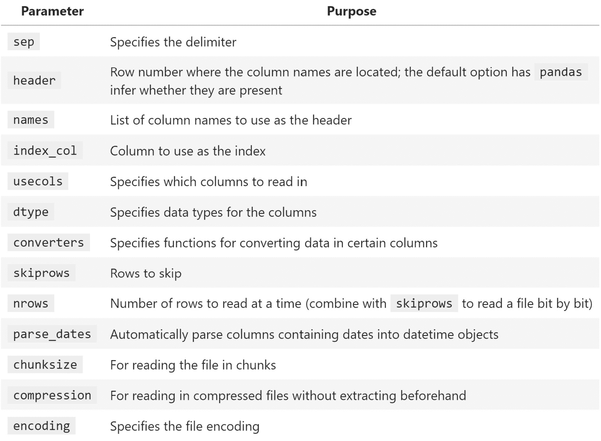

图 2.9 – 读取文件时有用的参数

本书中，我们将处理 CSV 文件；但请注意，我们也可以使用`read_excel()`函数读取 Excel 文件，使用`read_json()`函数读取`json`文件，或者使用带有`sep`参数的`read_csv()`函数来处理不同的分隔符。

如果我们不学习如何将数据框保存到文件中，以便与他人分享，那将是失职。为了将数据框写入 CSV 文件，我们调用其`to_csv()`方法。在这里我们必须小心；如果数据框的索引只是行号，我们可能不想将其写入文件（对数据的使用者没有意义），但这是默认设置。我们可以通过传入`index=False`来写入不包含索引的数据：

```py
>>> df.to_csv('output.csv', index=False)
```

与从文件中读取数据一样，`Series` 和 `DataFrame` 对象也有方法将数据写入 Excel（`to_excel()`）和 JSON 文件（`to_json()`）。请注意，虽然我们使用 `pandas` 中的函数来读取数据，但我们必须使用方法来写入数据；读取函数创建了我们想要处理的 `pandas` 对象，而写入方法则是我们使用 `pandas` 对象执行的操作。

提示

上述读取和写入的文件路径是 `/home/myuser/learning/hands_on_pandas/data.csv`，而我们当前的工作目录是 `/home/myuser/learning/hands_on_pandas`，因此我们可以简单地使用 `data.csv` 的相对路径作为文件路径。

Pandas 提供了从许多其他数据源读取和写入的功能，包括数据库，我们接下来会讨论这些内容；pickle 文件（包含序列化的 Python 对象——有关更多信息，请参见 *进一步阅读* 部分）；以及 HTML 页面。请务必查看 `pandas` 文档中的以下资源，以获取完整的功能列表：[`pandas.pydata.org/pandas-docs/stable/user_guide/io.html`](https://pandas.pydata.org/pandas-docs/stable/user_guide/io.html)。

## 从数据库中读取

Pandas 可以与 SQLite 数据库进行交互，而无需安装任何额外的软件包；不过，若要与其他类型的数据库进行交互，则需要安装 SQLAlchemy 包。与 SQLite 数据库的交互可以通过使用 Python 标准库中的 `sqlite3` 模块打开数据库连接来实现，然后使用 `pd.read_sql()` 函数查询数据库，或在 `DataFrame` 对象上使用 `to_sql()` 方法将数据写入数据库。

在我们从数据库中读取数据之前，先来写入数据。我们只需在我们的 DataFrame 上调用 `to_sql()`，并告诉它要写入哪个表，使用哪个数据库连接，以及如果表已存在该如何处理。本书 GitHub 仓库中的这一章节文件夹里已经有一个 SQLite 数据库：`data/quakes.db`。请注意，要创建一个新的数据库，我们可以将 `'data/quakes.db'` 更改为新数据库文件的路径。现在让我们把 `data/tsunamis.csv` 文件中的海啸数据写入名为 `tsunamis` 的数据库表中，如果表已存在，则替换它：

```py
>>> import sqlite3
>>> with sqlite3.connect('data/quakes.db') as connection:
...     pd.read_csv('data/tsunamis.csv').to_sql(
...         'tsunamis', connection, index=False,
...         if_exists='replace'
...     )
```

查询数据库与写入数据库一样简单。请注意，这需要了解 `pandas` 与 SQL 的对比关系，并且可以参考 *第四章*，*聚合 Pandas DataFrames*，了解一些 `pandas` 操作与 SQL 语句的关系示例。

让我们查询数据库中的完整`tsunamis`表。当我们编写 SQL 查询时，首先声明我们要选择的列，在本例中是所有列，因此我们写`"SELECT *"`。接下来，我们声明要从哪个表中选择数据，在我们这里是`tsunamis`，因此我们写`"FROM tsunamis"`。这就是我们完整的查询（当然，它可以比这更复杂）。要实际查询数据库，我们使用`pd.read_sql()`，传入查询和数据库连接：

```py
>>> import sqlite3
>>> with sqlite3.connect('data/quakes.db') as connection:
...     tsunamis = \
...         pd.read_sql('SELECT * FROM tsunamis', connection)
>>> tsunamis.head()
```

我们现在在数据框中已经有了海啸数据：

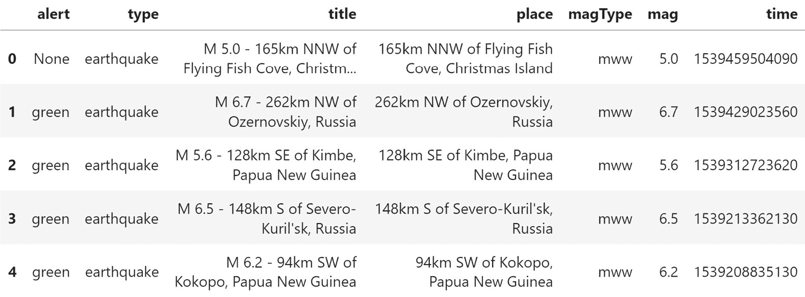

图 2.10 – 从数据库读取数据

重要说明

我们在两个代码块中创建的`connection`对象是`with`语句的一个示例，自动在代码块执行后进行清理（在本例中是关闭连接）。这使得清理工作变得简单，并确保我们不会留下任何未完成的工作。一定要查看标准库中的`contextlib`，它提供了使用`with`语句和上下文管理器的工具。文档请参考 [`docs.python.org/3/library/contextlib.html`](https://docs.python.org/3/library/contextlib.html)。

## 来自 API

我们现在可以轻松地从 Python 中的数据或从获得的文件中创建`Series`和`DataFrame`对象，但如何从在线资源（如 API）获取数据呢？无法保证每个数据源都会以相同的格式提供数据，因此我们必须在方法上保持灵活，并能够检查数据源以找到合适的导入方法。在本节中，我们将从 USGS API 请求一些地震数据，并查看如何从结果中创建数据框。在*第三章*《使用 Pandas 进行数据清理》中，我们将使用另一个 API 收集天气数据。

在本节中，我们将在`3-making_dataframes_from_api_requests.ipynb`笔记本中工作，因此我们需要再次导入所需的包。与之前的笔记本一样，我们需要`pandas`和`datetime`，但我们还需要`requests`包来发起 API 请求：

```py
>>> import datetime as dt
>>> import pandas as pd
>>> import requests
```

接下来，我们将向 USGS API 发起`GET`请求，获取一个 JSON 负载（包含请求或响应数据的类似字典的响应），并指定`geojson`格式。我们将请求过去 30 天的地震数据（可以使用`dt.timedelta`对`datetime`对象进行运算）。请注意，我们将`yesterday`作为日期范围的结束日期，因为 API 尚未提供今天的完整数据：

```py
>>> yesterday = dt.date.today() - dt.timedelta(days=1)
>>> api = 'https://earthquake.usgs.gov/fdsnws/event/1/query'
>>> payload = {
...     'format': 'geojson',
...     'starttime': yesterday - dt.timedelta(days=30),
...     'endtime': yesterday
... }
>>> response = requests.get(api, params=payload)
```

重要说明

`GET` 是一种 HTTP 方法。这个操作告诉服务器我们想要读取一些数据。不同的 API 可能要求我们使用不同的方法来获取数据；有些会要求我们发送 `POST` 请求，在其中进行身份验证。你可以在[`nordicapis.com/ultimate-guide-to-all-9-standard-http-methods/`](https://nordicapis.com/ultimate-guide-to-all-9-standard-http-methods/)上了解更多关于 API 请求和 HTTP 方法的信息。

在我们尝试从中创建 dataframe 之前，应该先确认我们的请求是否成功。我们可以通过检查`response`对象的`status_code`属性来做到这一点。状态码及其含义的列表可以在[`en.wikipedia.org/wiki/List_of_HTTP_status_codes`](https://en.wikipedia.org/wiki/List_of_HTTP_status_codes)找到。`200`响应将表示一切正常：

```py
>>> response.status_code
200
```

我们的请求成功了，接下来让我们看看我们得到的数据是什么样的。我们请求了一个 JSON 负载，它本质上是一个字典，因此我们可以使用字典方法来获取更多关于它结构的信息。这将是大量的数据；因此，我们不想只是将它打印到屏幕上进行检查。我们需要从 HTTP 响应（存储在`response`变量中）中提取 JSON 负载，然后查看键以查看结果数据的主要部分：

```py
>>> earthquake_json = response.json()
>>> earthquake_json.keys()
dict_keys(['type', 'metadata', 'features', 'bbox'])
```

我们可以检查这些键对应的值是什么样的数据；其中一个将是我们需要的数据。`metadata`部分告诉我们一些关于请求的信息。虽然这些信息确实有用，但它不是我们现在需要的：

```py
>>> earthquake_json['metadata']
{'generated': 1604267813000,
 'url': 'https://earthquake.usgs.gov/fdsnws/event/1/query?
format=geojson&starttime=2020-10-01&endtime=2020-10-31',
 'title': 'USGS Earthquakes',
 'status': 200,
 'api': '1.10.3',
 'count': 13706}
```

`features` 键看起来很有前景；如果它确实包含了我们所有的数据，我们应该检查它的数据类型，以避免试图将所有内容打印到屏幕上：

```py
>>> type(earthquake_json['features'])
list
```

这个键包含一个列表，所以让我们查看第一个条目，看看这是不是我们想要的数据。请注意，USGS 数据可能会随着更多关于地震信息的披露而被修改或添加，因此查询相同的日期范围可能会得到不同数量的结果。基于这个原因，以下是一个条目的示例：

```py
>>> earthquake_json['features'][0]
{'type': 'Feature',
 'properties': {'mag': 1,
  'place': '50 km ENE of Susitna North, Alaska',
  'time': 1604102395919, 'updated': 1604103325550, 'tz': None,
  'url': 'https://earthquake.usgs.gov/earthquakes/eventpage/ak020dz5f85a',
  'detail': 'https://earthquake.usgs.gov/fdsnws/event/1/query?eventid=ak020dz5f85a&format=geojson',
  'felt': None, 'cdi': None, 'mmi': None, 'alert': None,
  'status': 'reviewed', 'tsunami': 0, 'sig': 15, 'net': 'ak',
  'code': '020dz5f85a', 'ids': ',ak020dz5f85a,',
  'sources': ',ak,', 'types': ',origin,phase-data,',
  'nst': None, 'dmin': None, 'rms': 1.36, 'gap': None,
  'magType': 'ml', 'type': 'earthquake',
  'title': 'M 1.0 - 50 km ENE of Susitna North, Alaska'},
 'geometry': {'type': 'Point', 'coordinates': [-148.9807, 62.3533, 5]},
 'id': 'ak020dz5f85a'} 
```

这绝对是我们需要的数据，但我们需要全部数据吗？仔细检查后，我们只关心`properties`字典中的内容。现在，我们面临一个问题，因为我们有一个字典的列表，而我们只需要从中提取一个特定的键。我们该如何提取这些信息，以便构建我们的 dataframe 呢？我们可以使用列表推导式从`features`列表中的每个字典中隔离出`properties`部分：

```py
>>> earthquake_properties_data = [
...     quake['properties'] 
...     for quake in earthquake_json['features']
... ]
```

最后，我们准备创建我们的 dataframe。Pandas 已经知道如何处理这种格式的数据（字典列表），因此我们只需要在调用`pd.DataFrame()`时传入数据：

```py
>>> df = pd.DataFrame(earthquake_properties_data)
```

现在我们知道如何从各种数据源创建 dataframes，我们可以开始学习如何操作它们。

# 检查一个 DataFrame 对象

我们读取数据时应该做的第一件事就是检查它；我们需要确保数据框不为空，并且行数据符合预期。我们的主要目标是验证数据是否正确读取，并且所有数据都存在；然而，这次初步检查还会帮助我们了解应将数据处理工作重点放在哪里。在本节中，我们将探索如何在`4-inspecting_dataframes.ipynb`笔记本中检查数据框。

由于这是一个新笔记本，我们必须再次处理设置。此次，我们需要导入`pandas`和`numpy`，并读取包含地震数据的 CSV 文件：

```py
>>> import numpy as np
>>> import pandas as pd
>>> df = pd.read_csv('data/earthquakes.csv')
```

## 检查数据

首先，我们要确保数据框中确实有数据。我们可以检查`empty`属性来了解情况：

```py
>>> df.empty
False
```

到目前为止，一切顺利；我们有数据。接下来，我们应检查读取了多少数据；我们想知道观察数（行数）和变量数（列数）。为此，我们使用`shape`属性。我们的数据包含 9,332 个观察值和 26 个变量，这与我们最初检查文件时的结果一致：

```py
>>> df.shape
(9332, 26)
```

现在，让我们使用`columns`属性查看数据集中列的名称：

```py
>>> df.columns
Index(['alert', 'cdi', 'code', 'detail', 'dmin', 'felt', 'gap', 
       'ids', 'mag', 'magType', 'mmi', 'net', 'nst', 'place', 
       'rms', 'sig', 'sources', 'status', 'time', 'title', 
       'tsunami', 'type', 'types', 'tz', 'updated', 'url'],
      dtype='object')
```

重要提示

拥有列的列表并不意味着我们知道每一列的含义。特别是在数据来自互联网的情况下，在得出结论之前，务必查阅列的含义。有关`geojson`格式中字段的信息，包括每个字段在 JSON 负载中的含义（以及一些示例值），可以在美国地质调查局（USGS）网站上的[`earthquake.usgs.gov/earthquakes/feed/v1.0/geojson.php`](https://earthquake.usgs.gov/earthquakes/feed/v1.0/geojson.php)找到。

我们知道数据的维度，但它实际是什么样的呢？为此，我们可以使用`head()`和`tail()`方法，分别查看顶部和底部的行。默认情况下，这将显示五行数据，但我们可以通过传入不同的数字来更改这一设置。让我们看看前几行数据：

```py
>>> df.head()
```

以下是我们使用`head()`方法获得的前五行：

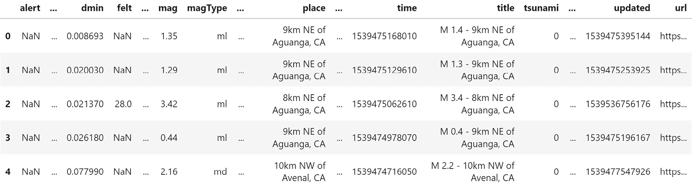

图 2.11 – 检查数据框的前五行

要获取最后两行，我们使用`tail()`方法并传入`2`作为行数：

```py
>>> df.tail(2)
```

以下是结果：

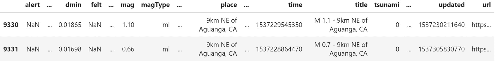

图 2.12 – 检查数据框的底部两行

提示

默认情况下，当我们在 Jupyter Notebook 中打印包含许多列的数据框时，只有一部分列会显示出来。这是因为`pandas`有一个显示列数的限制。我们可以使用`pd.set_option('display.max_columns', <new_value>)`来修改此行为。有关更多信息，请查阅[`pandas.pydata.org/pandas-docs/stable/user_guide/options.html`](https://pandas.pydata.org/pandas-docs/stable/user_guide/options.html)。该文档中还包含了一些示例命令。

我们可以使用`dtypes`属性查看各列的数据类型，这样可以轻松地发现哪些列被错误地存储为不正确的类型。（记住，字符串会被存储为`object`。）这里，`time`列被存储为整数，这是我们将在*第三章*《数据清洗与 Pandas》中学习如何修复的问题：

```py
>>> df.dtypes
alert       object
...
mag        float64
magType     object
...
time         int64
title       object
tsunami      int64
...
tz         float64
updated      int64
url         object
dtype: object
```

最后，我们可以使用`info()`方法查看每列中有多少非空条目，并获取关于索引的信息。`pandas`通常会将对象类型的值表示为`None`，而`NaN`（`float`或`integer`类型的列）表示缺失值：

```py
>>> df.info()
<class 'pandas.core.frame.DataFrame'>
RangeIndex: 9332 entries, 0 to 9331
Data columns (total 26 columns):
 #   Column   Non-Null Count  Dtype  
---  ------   --------------  -----  
 0   alert    59 non-null     object 
 ... 
 8   mag      9331 non-null   float64
 9   magType  9331 non-null   object 
 ... 
 18  time     9332 non-null   int64  
 19  title    9332 non-null   object 
 20  tsunami  9332 non-null   int64  
 ... 
 23  tz       9331 non-null   float64
 24  updated  9332 non-null   int64  
 25  url      9332 non-null   object 
dtypes: float64(9), int64(4), object(13)
memory usage: 1.9+ MB
```

在初步检查之后，我们已经了解了数据的结构，现在可以开始尝试理解数据的含义。

## 描述和总结数据

到目前为止，我们已经检查了从地震数据创建的`DataFrame`对象的结构，但除了几行数据的样子，我们对数据一无所知。接下来的步骤是计算总结统计数据，这将帮助我们更好地了解数据。Pandas 提供了几种方法来轻松实现这一点；其中一种方法是`describe()`，如果我们只对某一列感兴趣，它也适用于`Series`对象。让我们获取数据中数字列的总结：

```py
>>> df.describe()
```

这会为我们提供 5 个数字总结，以及数字列的计数、均值和标准差：

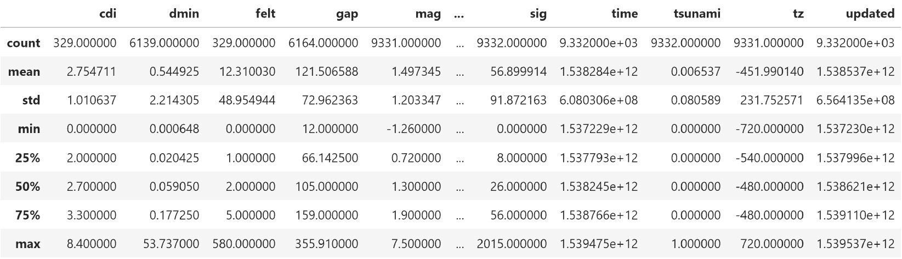

图 2.13 – 计算总结统计数据

提示

如果我们想要不同的百分位数，可以通过`percentiles`参数传递它们。例如，如果我们只想要 5%和 95%的百分位数，我们可以运行`df.describe(percentiles=[0.05, 0.95])`。请注意，我们仍然会得到第 50 个百分位数的结果，因为那是中位数。

默认情况下，`describe()`不会提供关于`object`类型列的任何信息，但我们可以提供`include='all'`作为参数，或者单独运行它来查看`np.object`类型的数据：

```py
>>> df.describe(include=np.object)
```

当描述非数字数据时，我们仍然可以得到非空出现的计数（**count**）；然而，除了其他总结统计数据外，我们会得到唯一值的数量（**unique**）、众数（**top**）以及众数出现的次数（**freq**）：

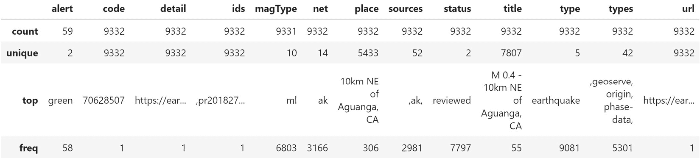

图 2.14 – 类别列的总结统计数据

重要提示

`describe()` 方法只会为非空值提供摘要统计信息。这意味着，如果我们有 100 行数据，其中一半是空值，那么平均值将是 50 个非空行的总和除以 50。

使用 `describe()` 方法可以轻松获取数据的快照，但有时我们只想要某个特定的统计数据，不论是针对某一列还是所有列。Pandas 也使得这变得非常简单。下表列出了适用于 `Series` 和 `DataFrame` 对象的方法：

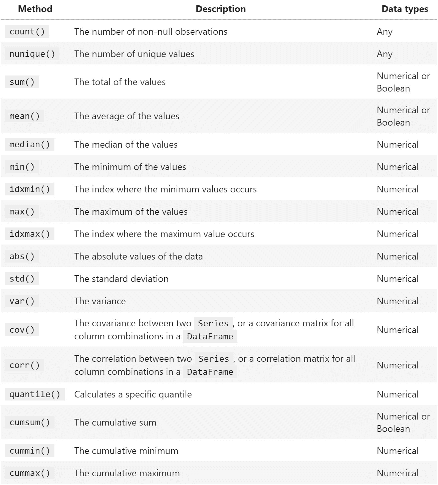

Figure 2.15 – 对系列和数据框架的有用计算方法

提示

Python 使得计算某个条件为 `True` 的次数变得容易。在底层，`True` 计算为 `1`，`False` 计算为 `0`。因此，我们可以对布尔值序列运行 `sum()` 方法，得到 `True` 输出的计数。

对于 `Series` 对象，我们有一些额外的方法来描述我们的数据：

+   `unique()`: 返回列中的不同值。

+   `value_counts()`: 返回给定列中每个唯一值出现的频率表，或者，当传入`normalize=True`时，返回每个唯一值出现的百分比。

+   `mode()`: 返回列中最常见的值。

查阅 USGS API 文档中的 `alert` 字段（可以在 [`earthquake.usgs.gov/data/comcat/data-eventterms.php#alert`](https://earthquake.usgs.gov/data/comcat/data-eventterms.php#alert) 找到）告诉我们，`alert` 字段的值可以是 `'green'`、`'yellow'`、`'orange'` 或 `'red'`（当字段被填充时），并且 `alert` 列中的警报级别是两个唯一值的字符串，其中最常见的值是 `'green'`，但也有许多空值。那么，另一个唯一值是什么呢？

```py
>>> df.alert.unique()
array([nan, 'green', 'red'], dtype=object)
```

现在我们了解了该字段的含义以及数据中包含的值，我们预计 `'green'` 的数量会远远大于 `'red'`；我们可以通过使用 `value_counts()` 来检查我们的直觉，得到一个频率表。注意，我们只会得到非空条目的计数：

```py
>>> df.alert.value_counts()
green    58
red       1
Name: alert, dtype: int64
```

请注意，`Index` 对象也有多个方法，能够帮助我们描述和总结数据：

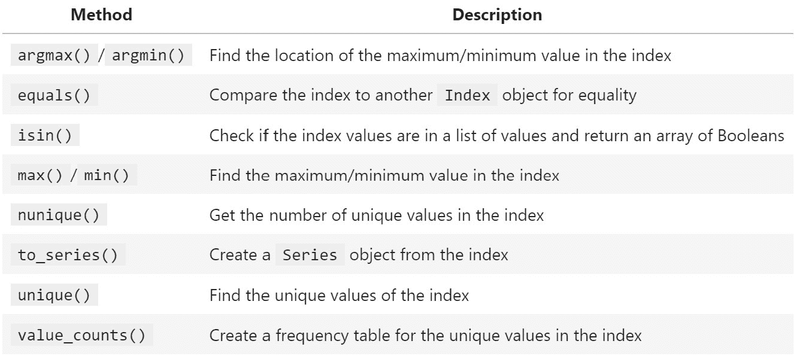

Figure 2.16 – 对索引的有用方法

当我们使用 `unique()` 和 `value_counts()` 时，我们已经预览了如何选择数据的子集。现在，让我们更详细地讨论选择、切片、索引和过滤。

# 获取数据的子集

到目前为止，我们已经学习了如何处理和总结整个数据；然而，我们通常会对对数据子集进行操作和/或分析感兴趣。我们可能希望从数据中提取许多类型的子集，比如选择特定的列或行，或者当满足特定条件时选择某些列或行。为了获取数据的子集，我们需要熟悉选择、切片、索引和过滤等操作。

在本节中，我们将在`5-subsetting_data.ipynb`笔记本中进行操作。我们的设置如下：

```py
>>> import pandas as pd
>>> df = pd.read_csv('data/earthquakes.csv')
```

## 选择列

在前一部分，我们看到了列选择的例子，当时我们查看了`alert`列中的唯一值；我们作为数据框的属性访问了这个列。记住，列是一个`Series`对象，因此，例如，选择地震数据中的`mag`列将给我们返回一个包含地震震级的`Series`对象：

```py
>>> df.mag
0       1.35
1       1.29
2       3.42
3       0.44
4       2.16
        ... 
9327    0.62
9328    1.00
9329    2.40
9330    1.10
9331    0.66
Name: mag, Length: 9332, dtype: float64
```

Pandas 为我们提供了几种选择列的方法。使用字典式的符号来选择列是替代属性符号选择列的一种方法：

```py
>>> df['mag']
0       1.35
1       1.29
2       3.42
3       0.44
4       2.16
        ... 
9327    0.62
9328    1.00
9329    2.40
9330    1.10
9331    0.66
Name: mag, Length: 9332, dtype: float64
```

提示

我们还可以使用`get()`方法来选择列。这样做的好处是，如果列不存在，不会抛出错误，而且可以提供一个备选值，默认值是`None`。例如，如果我们调用`df.get('event', False)`，它将返回`False`，因为我们没有`event`列。

请注意，我们并不局限于一次只选择一列。通过将列表传递给字典查找，我们可以选择多列，从而获得一个`DataFrame`对象，它是原始数据框的一个子集：

```py
>>> df[['mag', 'title']]
```

这样我们就得到了来自原始数据框的完整`mag`和`title`列：

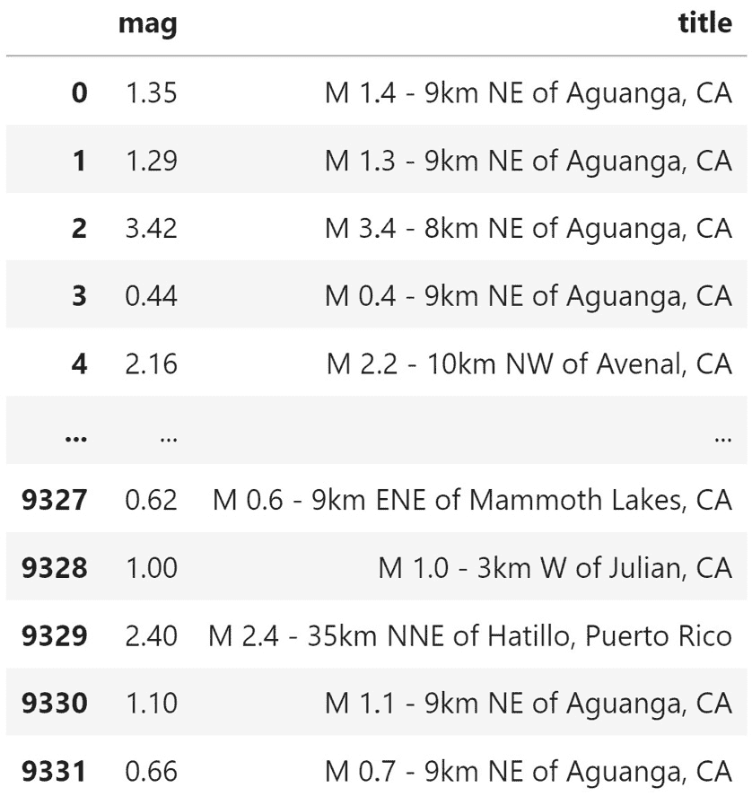

图 2.17 – 选择数据框的多列

字符串方法是选择列的一种非常强大的方式。例如，如果我们想选择所有以`mag`开头的列，并同时选择`title`和`time`列，我们可以这样做：

```py
>>> df[
...     ['title', 'time'] 
...     + [col for col in df.columns if col.startswith('mag')]
... ]
```

我们得到了一个由四列组成的数据框，这些列符合我们的筛选条件。注意，返回的列顺序是我们要求的顺序，而不是它们最初出现的顺序。这意味着如果我们想要重新排序列，所要做的就是按照希望的顺序选择它们：

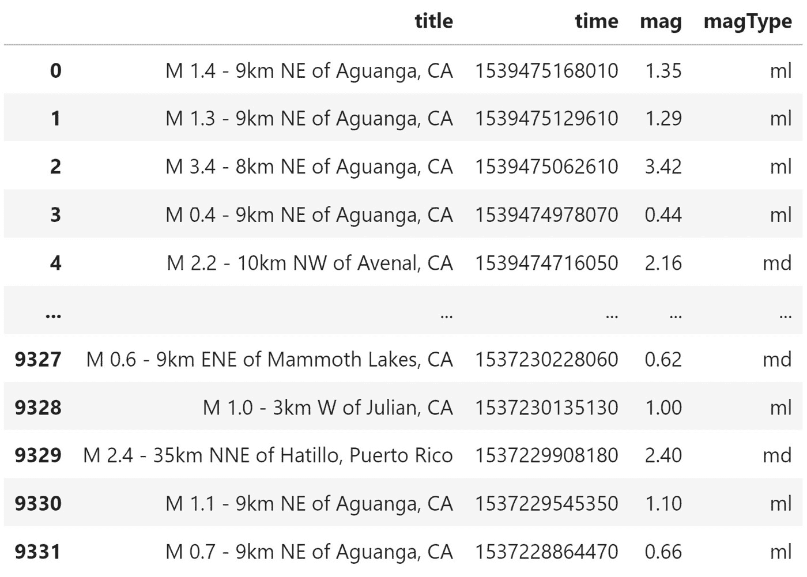

图 2.18 – 根据列名选择列

让我们来分析这个例子。我们使用列表推导式遍历数据框中的每一列，只保留那些列名以`mag`开头的列：

```py
>>> [col for col in df.columns if col.startswith('mag')]
['mag', 'magType']
```

然后，我们将这个结果与另外两个我们想要保留的列（`title`和`time`）合并：

```py
>>> ['title', 'time'] \
... + [col for col in df.columns if col.startswith('mag')]
['title', 'time', 'mag', 'magType']
```

最后，我们能够使用这个列表在数据框上执行实际的列选择操作，最终得到了*图 2.18*中的数据框：

```py
>>> df[
...     ['title', 'time'] 
...     + [col for col in df.columns if col.startswith('mag')]
... ]
```

提示

字符串方法的完整列表可以在 Python 3 文档中找到：[`docs.python.org/3/library/stdtypes.html#string-methods`](https://docs.python.org/3/library/stdtypes.html#string-methods)。

## 切片

当我们想要从数据框中提取特定的行（切片）时，我们使用`DataFrame`切片，切片的方式与其他 Python 对象（如列表和元组）类似，第一个索引是包含的，最后一个索引是不包含的：

```py
>>> df[100:103]
```

当指定切片`100:103`时，我们会返回行`100`、`101`和`102`：

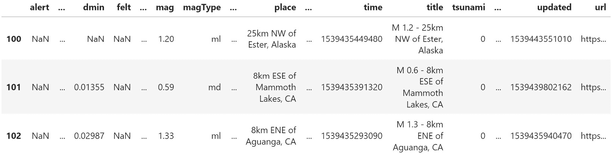

](img/Figure_2.19_B16834.jpg)

图 2.19 – 切片数据框以提取特定行

我们可以通过使用**链式操作**来结合行和列的选择：

```py
>>> df[['title', 'time']][100:103]
```

首先，我们选择了所有行中的`title`和`time`列，然后提取了索引为`100`、`101`和`102`的行：

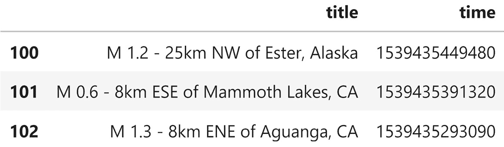

](img/Figure_2.20_B16834.jpg)

图 2.20 – 使用链式操作选择特定行和列

在前面的例子中，我们选择了列，然后切片了行，但顺序并不重要：

```py
>>> df[100:103][['title', 'time']].equals(
...     df[['title', 'time']][100:103]
... )
True
```

提示

请注意，我们可以对索引中的任何内容进行切片；然而，确定我们想要的最后一个字符串或日期后面的内容会很困难，因此在使用`pandas`时，切片日期和字符串的方式与整数切片不同，并且包含两个端点。只要我们提供的字符串可以解析为`datetime`对象，日期切片就能正常工作。在*第三章*《使用 Pandas 进行数据清洗》中，我们将看到一些相关示例，并学习如何更改作为索引的内容，从而使这种类型的切片成为可能。

如果我们决定使用链式操作来更新数据中的值，我们会发现`pandas`会抱怨我们没有正确执行（即使它能正常工作）。这是在提醒我们，使用顺序选择来设置数据可能不会得到我们预期的结果。（更多信息请参见[`pandas.pydata.org/pandas-docs/stable/user_guide/indexing.html#returning-a-view-versus-a-copy`](https://pandas.pydata.org/pandas-docs/stable/user_guide/indexing.html#returning-a-view-versus-a-copy)。）

让我们触发这个警告，以便更好地理解它。我们将尝试更新一些地震事件的`title`列，使其变为小写：

```py
>>> df[110:113]['title'] = df[110:113]['title'].str.lower()
/.../book_env/lib/python3.7/[...]:1: SettingWithCopyWarning:  
A value is trying to be set on a copy of a slice from a DataFrame.
Try using .loc[row_indexer,col_indexer] = value instead
See the caveats in the documentation: https://pandas.pydata.org/pandas-docs/stable/user_guide/indexing.html#returning-a-view-versus-a-copy
  """Entry point for launching an IPython kernel.
```

正如警告所示，成为一个有效的`pandas`用户，不仅仅是知道如何选择和切片—我们还必须掌握**索引**。由于这只是一个警告，我们的值已经更新，但这并不总是如此：

```py
>>> df[110:113]['title']
110               m 1.1 - 35km s of ester, alaska
111    m 1.9 - 93km wnw of arctic village, alaska
112      m 0.9 - 20km wsw of smith valley, nevada
Name: title, dtype: object
```

现在，让我们讨论如何使用索引正确设置值。

## 索引

Pandas 的索引操作为我们提供了一种单一方法，来选择我们想要的行和列。我们可以使用`loc[]`和`iloc[]`，分别通过标签或整数索引来选择数据子集。记住它们的区别的好方法是将它们想象为**loc**ation（位置）与**i**nteger **loc**ation（整数位置）。对于所有的索引方法，我们先提供行索引器，再提供列索引器，两者之间用逗号分隔：

```py
df.loc[row_indexer, column_indexer]
```

注意，使用`loc[]`时，如警告信息所示，我们不再触发`pandas`的任何警告。我们还将结束索引从`113`改为`112`，因为`loc[]`是包含端点的：

```py
>>> df.loc[110:112, 'title'] = \
...     df.loc[110:112, 'title'].str.lower()
>>> df.loc[110:112, 'title']
110               m 1.1 - 35km s of ester, alaska
111    m 1.9 - 93km wnw of arctic village, alaska
112      m 0.9 - 20km wsw of smith valley, nevada
Name: title, dtype: object
```

如果我们使用`:`作为行（列）索引器，就可以选择所有的行（列），就像普通的 Python 切片一样。让我们使用`loc[]`选择`title`列的所有行：

```py
>>> df.loc[:,'title']
0                  M 1.4 - 9km NE of Aguanga, CA
1                  M 1.3 - 9km NE of Aguanga, CA
2                  M 3.4 - 8km NE of Aguanga, CA
3                  M 0.4 - 9km NE of Aguanga, CA
4                  M 2.2 - 10km NW of Avenal, CA
                          ...                   
9327        M 0.6 - 9km ENE of Mammoth Lakes, CA
9328                 M 1.0 - 3km W of Julian, CA
9329    M 2.4 - 35km NNE of Hatillo, Puerto Rico
9330               M 1.1 - 9km NE of Aguanga, CA
9331               M 0.7 - 9km NE of Aguanga, CA
Name: title, Length: 9332, dtype: object
```

我们可以同时选择多行和多列，使用`loc[]`：

```py
>>> df.loc[10:15, ['title', 'mag']]
```

这让我们仅选择`10`到`15`行的`title`和`mag`列：

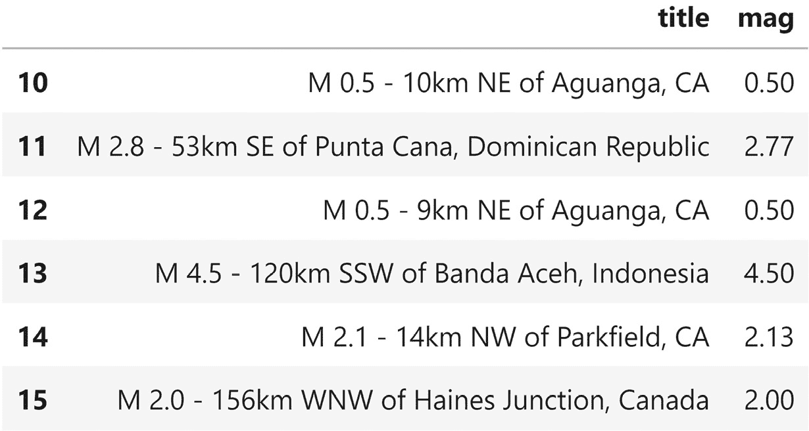

图 2.21 – 使用索引选择特定的行和列

如我们所见，使用`loc[]`时，结束索引是包含的。但`iloc[]`则不是这样：

```py
>>> df.iloc[10:15, [19, 8]]
```

观察我们如何需要提供一个整数列表来选择相同的列；这些是列的编号（从`0`开始）。使用`iloc[]`时，我们丢失了索引为`15`的行；这是因为`iloc[]`使用的整数切片在结束索引上是排除的，类似于 Python 切片语法：

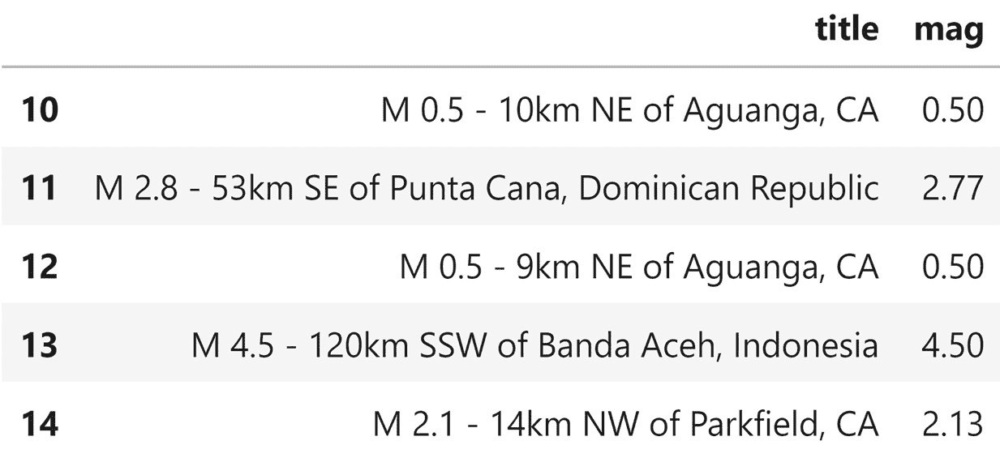

图 2.22 – 通过位置选择特定的行和列

然而，我们并不限于只对行使用切片语法；列同样适用：

```py
>>> df.iloc[10:15, 6:10]
```

通过切片，我们可以轻松地抓取相邻的行和列：

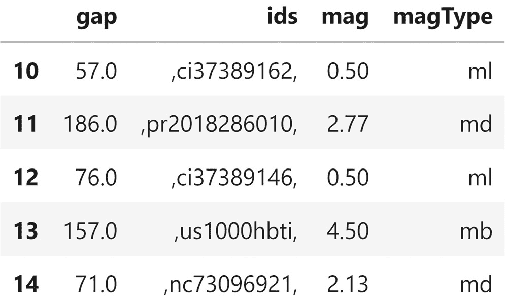

图 2.23 – 通过位置选择相邻行和列的范围

使用`loc[]`时，切片操作也可以在列名上进行。这给我们提供了多种实现相同结果的方式：

```py
>>> df.iloc[10:15, 6:10].equals(df.loc[10:14, 'gap':'magType'])
True
```

要查找标量值，我们使用`at[]`和`iat[]`，它们更快。让我们选择记录在索引为`10`的行中的地震幅度（`mag`列）：

```py
>>> df.at[10, 'mag']
0.5
```

"幅度"列的列索引为`8`；因此，我们也可以通过`iat[]`查找幅度：

```py
>>> df.iat[10, 8]
0.5
```

到目前为止，我们已经学习了如何使用行/列名称和范围来获取数据子集，但如何只获取符合某些条件的数据呢？为此，我们需要学习如何过滤数据。

## 过滤

Pandas 为我们提供了几种过滤数据的方式，包括`True`/`False`值；`pandas`可以使用这些值来为我们选择适当的行/列。创建布尔掩码的方式几乎是无限的——我们只需要一些返回每行布尔值的代码。例如，我们可以查看`mag`列中震级大于 2 的条目：

```py
>>> df.mag > 2
0       False
1       False
2        True
3       False
        ...  
9328    False
9329     True
9330    False
9331    False
Name: mag, Length: 9332, dtype: bool
```

尽管我们可以在整个数据框上运行此操作，但由于我们的地震数据包含不同类型的列，这样做可能不太有用。然而，我们可以使用这种策略来获取一个子集，其中地震的震级大于或等于 7.0：

```py
>>> df[df.mag >= 7.0]
```

我们得到的结果数据框只有两行：

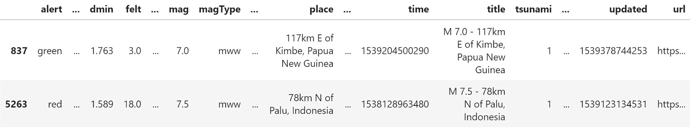

图 2.24 – 使用布尔掩码过滤

不过，我们得到了很多不需要的列。我们本可以将列选择附加到最后一个代码片段的末尾；然而，`loc[]`同样可以处理布尔掩码：

```py
>>> df.loc[
...     df.mag >= 7.0, 
...     ['alert', 'mag', 'magType', 'title', 'tsunami', 'type']
... ]
```

以下数据框已经过滤，只包含相关列：

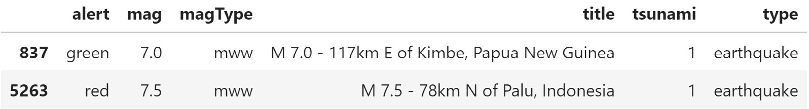

图 2.25 – 使用布尔掩码进行索引

我们也不局限于只使用一个条件。让我们筛选出带有红色警报和海啸的地震。为了组合多个条件，我们需要将每个条件用括号括起来，并使用`&`来要求*两个*条件都为真：

```py
>>> df.loc[
...     (df.tsunami == 1) & (df.alert == 'red'), 
...     ['alert', 'mag', 'magType', 'title', 'tsunami', 'type']
... ]
```

数据中只有一个地震满足我们的标准：

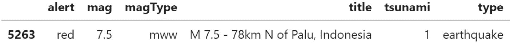

图 2.26 – 使用 AND 组合过滤条件

如果我们想要*至少一个*条件为真，则可以使用`|`：

```py
>>> df.loc[
...     (df.tsunami == 1) | (df.alert == 'red'), 
...     ['alert', 'mag', 'magType', 'title', 'tsunami', 'type']
... ]
```

请注意，这个过滤器要宽松得多，因为虽然两个条件都可以为真，但我们只要求其中一个为真：

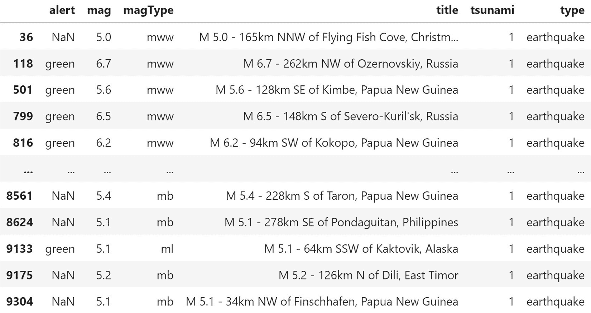

图 2.27 – 使用 OR 组合过滤条件

重要提示

在创建布尔掩码时，我们必须使用位运算符（`&`、`|`、`~`）而不是逻辑运算符（`and`、`or`、`not`）。记住这一点的一个好方法是：我们希望对我们正在测试的系列中的每一项返回一个布尔值，而不是返回单一的布尔值。例如，在地震数据中，如果我们想选择震级大于 1.5 的行，那么我们希望每一行都有一个布尔值，表示该行是否应该被选中。如果我们只希望对数据得到一个单一的值，或许是为了总结它，我们可以使用`any()`/`all()`将布尔系列压缩成一个可以与逻辑运算符一起使用的布尔值。我们将在*第四章*《聚合 Pandas 数据框》中使用`any()`和`all()`方法。

在前面两个示例中，我们的条件涉及到相等性；然而，我们并不局限于此。让我们选择所有在阿拉斯加的地震数据，其中`alert`列具有非空值：

```py
>>> df.loc[
...     (df.place.str.contains('Alaska')) 
...     & (df.alert.notnull()), 
...     ['alert', 'mag', 'magType', 'title', 'tsunami', 'type']
... ]
```

所有阿拉斯加的地震，`alert`值为`green`，其中一些伴随有海啸，最大震级为 5.1：

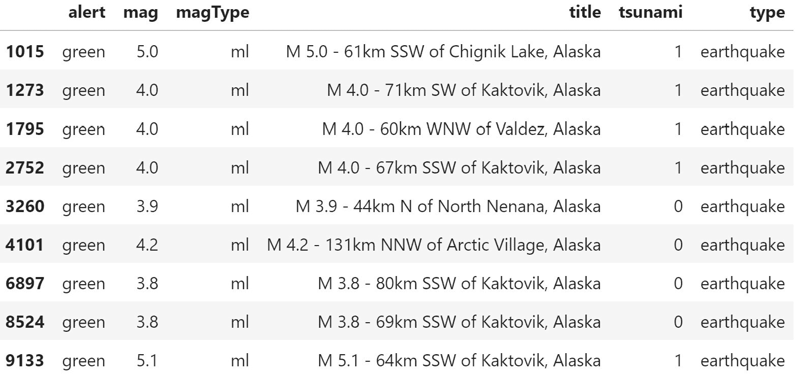

图 2.28 – 使用非数字列创建布尔掩码

让我们来分解一下我们是如何得到这个的。`Series`对象有一些字符串方法，可以通过`str`属性访问。利用这一点，我们可以创建一个布尔掩码，表示`place`列中包含单词`Alaska`的所有行：

```py
df.place.str.contains('Alaska')
```

为了获取`alert`列不为 null 的所有行，我们使用了`Series`对象的`notnull()`方法（这同样适用于`DataFrame`对象），以创建一个布尔掩码，表示`alert`列不为 null 的所有行：

```py
df.alert.notnull()
```

提示

我们可以使用`~`，也称为`True`值和`False`的反转。所以，`df.alert.notnull()`和`~df.alert.isnull()`是等价的。

然后，像我们之前做的那样，我们使用`&`运算符将两个条件结合起来，完成我们的掩码：

```py
(df.place.str.contains('Alaska')) & (df.alert.notnull())
```

请注意，我们不仅限于检查每一行是否包含文本；我们还可以使用正则表达式。`r`字符出现在引号外面；这样，Python 就知道这是一个`\`）字符，而不是在尝试转义紧随其后的字符（例如，当我们使用`\n`表示换行符时，而不是字母`n`）。这使得它非常适合与正则表达式一起使用。Python 标准库中的`re`模块（[`docs.python.org/3/library/re.html`](https://docs.python.org/3/library/re.html)）处理正则表达式操作；然而，`pandas`允许我们直接使用正则表达式。

使用正则表达式，让我们选择所有震级至少为 3.8 的加利福尼亚地震。我们需要选择`place`列中以`CA`或`California`结尾的条目，因为数据不一致（我们将在下一节中学习如何解决这个问题）。`$`字符表示*结束*，`'CA$'`给我们的是以`CA`结尾的条目，因此我们可以使用`'CA|California$'`来获取以任一项结尾的条目：

```py
>>> df.loc[
...     (df.place.str.contains(r'CA|California$'))
...     & (df.mag > 3.8),         
...     ['alert', 'mag', 'magType', 'title', 'tsunami', 'type']
... ]
```

在我们研究的时间段内，加利福尼亚只有两次震级超过 3.8 的地震：

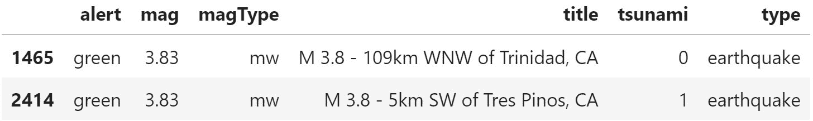

图 2.29 – 使用正则表达式进行过滤

提示

正则表达式功能非常强大，但不幸的是，也很难正确编写。通常，抓取一些示例行进行解析并使用网站测试它们会很有帮助。请注意，正则表达式有很多种类型，因此务必选择 Python 类型。这个网站支持 Python 类型的正则表达式，并且还提供了一个不错的备忘单： https://regex101.com/。

如果我们想获取震级在 6.5 和 7.5 之间的所有地震怎么办？我们可以使用两个布尔掩码——一个检查震级是否大于或等于 6.5，另一个检查震级是否小于或等于 7.5——然后用 `&` 运算符将它们结合起来。幸运的是，`pandas` 使得创建这种类型的掩码变得更容易，它提供了 `between()` 方法：

```py
>>> df.loc[
...     df.mag.between(6.5, 7.5), 
...     ['alert', 'mag', 'magType', 'title', 'tsunami', 'type']
... ]
```

结果包含所有震级在 [6.5, 7.5] 范围内的地震——默认情况下包括两个端点，但我们可以传入 `inclusive=False` 来更改这一点：

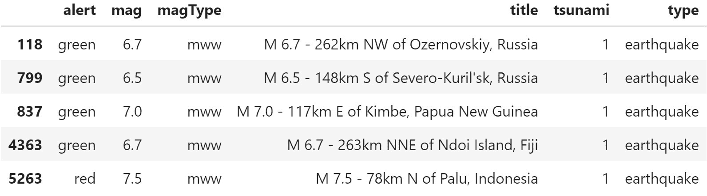

图 2.30 – 使用数值范围进行过滤

我们可以使用 `isin()` 方法创建一个布尔掩码，用于匹配某个值是否出现在值列表中。这意味着我们不必为每个可能匹配的值编写一个掩码，然后使用 `|` 将它们连接起来。让我们利用这一点来过滤 `magType` 列，这一列表示用于量化地震震级的测量方法。我们将查看使用 `mw` 或 `mwb` 震级类型测量的地震：

```py
>>> df.loc[
...     df.magType.isin(['mw', 'mwb']), 
...     ['alert', 'mag', 'magType', 'title', 'tsunami', 'type']
... ]
```

我们有两个震级采用 `mwb` 测量类型的地震，四个震级采用 `mw` 测量类型的地震：

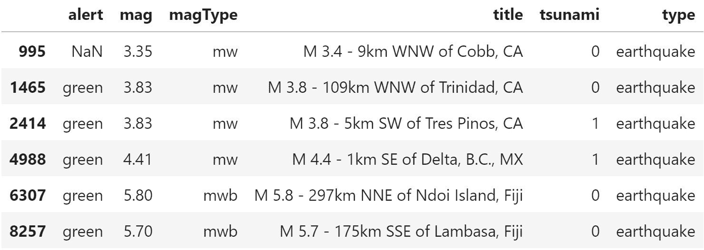

图 2.31 – 使用列表中的成员关系进行过滤

到目前为止，我们一直在基于特定的值进行过滤，但假设我们想查看最低震级和最高震级地震的所有数据。与其先找到 `mag` 列的最小值和最大值，再创建布尔掩码，不如让 `pandas` 给我们这些值出现的索引，并轻松地过滤出完整的行。我们可以分别使用 `idxmin()` 和 `idxmax()` 来获取最小值和最大值的索引。让我们抓取最低震级和最高震级地震的行号：

```py
>>> [df.mag.idxmin(), df.mag.idxmax()]
[2409, 5263]
```

我们可以使用这些索引来抓取相应的行：

```py
>>> df.loc[
...     [df.mag.idxmin(), df.mag.idxmax()], 
...     ['alert', 'mag', 'magType', 'title', 'tsunami', 'type']
... ]
```

最小震级的地震发生在阿拉斯加，最大震级的地震发生在印度尼西亚，并伴随海啸。我们将在 *第五章*，《使用 Pandas 和 Matplotlib 可视化数据》，以及 *第六章*，《使用 Seaborn 绘图与自定义技术》中讨论印度尼西亚的地震：

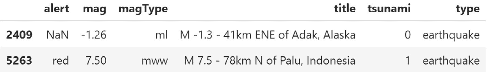

图 2.32 – 过滤以隔离包含列的最小值和最大值的行

重要说明

请注意，`filter()` 方法并不是像我们在本节中所做的那样根据值来过滤数据；相反，它可以根据行或列的名称来子集化数据。有关 `DataFrame` 和 `Series` 对象的示例，请参见笔记本。

# 添加和移除数据

在前面的章节中，我们经常选择列的子集，但如果某些列/行对我们不有用，我们应该直接删除它们。我们也常常根据`mag`列的值来选择数据；然而，如果我们创建了一个新列，用于存储布尔值以便后续选择，那么我们只需要计算一次掩码。非常少情况下，我们会遇到既不想添加也不想删除数据的情况。

在我们开始添加和删除数据之前，理解一个重要概念非常关键：虽然大多数方法会返回一个新的`DataFrame`对象，但有些方法是就地修改数据的。如果我们编写一个函数，传入一个数据框并修改它，那么它也会改变原始的数据框。如果我们遇到这种情况，即不想改变原始数据，而是希望返回一个已经修改过的数据副本，那么我们必须在做任何修改之前确保复制我们的数据框：

```py
df_to_modify = df.copy()
```

重要提示

默认情况下，`df.copy()`会创建一个`deep=False`的**浅拷贝**，对浅拷贝的修改会影响原数据框，反之亦然。我们通常希望使用深拷贝，因为我们可以修改深拷贝而不影响原始数据。更多信息可以参考文档：[`pandas.pydata.org/pandas-docs/stable/reference/api/pandas.DataFrame.copy.html`](https://pandas.pydata.org/pandas-docs/stable/reference/api/pandas.DataFrame.copy.html)。

现在，让我们转向最后一个笔记本`6-adding_and_removing_data.ipynb`，并为本章剩余部分做准备。我们将再次使用地震数据，但这次我们只读取一部分列：

```py
>>> import pandas as pd
>>> df = pd.read_csv(
...     'data/earthquakes.csv', 
...     usecols=[
...         'time', 'title', 'place', 'magType', 
...         'mag', 'alert', 'tsunami'
...     ]
... )
```

## 创建新数据

创建新列可以通过与变量赋值相同的方式来实现。例如，我们可以创建一列来表示数据的来源；由于我们所有的数据都来自同一来源，我们可以利用**广播**将这一列的每一行都设置为相同的值：

```py
>>> df['source'] = 'USGS API'
>>> df.head()
```

新列被创建在原始列的右侧，并且每一行的值都是`USGS API`：

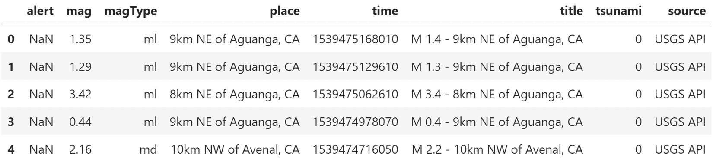


图 2.33 – 添加新列

重要提示

我们不能通过属性符号（`df.source`）创建新列，因为数据框还没有这个属性，因此必须使用字典符号（`df['source']`）。

我们不仅仅限于将一个值广播到整列；我们可以让这一列存储布尔逻辑结果或数学公式。例如，如果我们有关于距离和时间的数据，我们可以创建一列速度，它是通过将距离列除以时间列得到的结果。在我们的地震数据中，我们可以创建一列，告诉我们地震的震级是否为负数：

```py
>>> df['mag_negative'] = df.mag < 0
>>> df.head()
```

请注意，新列已添加到右侧：

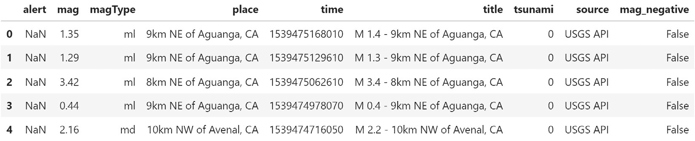


图 2.34 – 在新列中存储布尔掩码

在前一部分中，我们看到`place`列存在一些数据一致性问题——同一个实体有多个名称。在某些情况下，加利福尼亚的地震标记为`CA`，而在其他情况下标记为`California`。不言而喻，这会引起混淆，如果我们没有仔细检查数据，可能会导致问题。例如，仅选择`CA`时，我们错过了 124 个标记为`California`的地震。这并不是唯一存在问题的地方（`Nevada`和`NV`也都有）。通过使用正则表达式提取`place`列中逗号后的所有内容，我们可以亲眼看到一些问题：

```py
>>> df.place.str.extract(r', (.*$)')[0].sort_values().unique()
array(['Afghanistan', 'Alaska', 'Argentina', 'Arizona',
       'Arkansas', 'Australia', 'Azerbaijan', 'B.C., MX',
       'Barbuda', 'Bolivia', ..., 'CA', 'California', 'Canada',
       'Chile', ..., 'East Timor', 'Ecuador', 'Ecuador region',
       ..., 'Mexico', 'Missouri', 'Montana', 'NV', 'Nevada', 
       ..., 'Yemen', nan], dtype=object)
```

如果我们想将国家及其附近的任何地方视为一个整体实体，我们还需要做一些额外的工作（参见`Ecuador`和`Ecuador region`）。此外，我们通过查看逗号后面的信息来解析位置的简单尝试显然失败了；这是因为在某些情况下，我们并没有逗号。我们需要改变解析的方式。

这是一个`df.place.unique()`，我们可以简单地查看并推断如何正确地匹配这些名称。然后，我们可以使用`replace()`方法根据需要替换`place`列中的模式：

```py
>>> df['parsed_place'] = df.place.str.replace(
...     r'.* of ', '', regex=True # remove <x> of <x> 
... ).str.replace(
...     'the ', '' # remove "the "
... ).str.replace(
...     r'CA$', 'California', regex=True # fix California
... ).str.replace(
...     r'NV$', 'Nevada', regex=True # fix Nevada
... ).str.replace(
...     r'MX$', 'Mexico', regex=True # fix Mexico
... ).str.replace(
...     r' region$', '', regex=True # fix " region" endings
... ).str.replace(
...     'northern ', '' # remove "northern "
... ).str.replace(
...     'Fiji Islands', 'Fiji' # line up the Fiji places
... ).str.replace( # remove anything else extraneous from start 
...     r'^.*, ', '', regex=True 
... ).str.strip() # remove any extra spaces
```

现在，我们可以检查剩下的解析地点。请注意，关于`South Georgia and South Sandwich Islands`和`South Sandwich Islands`，可能还有更多需要修正的地方。我们可以通过另一次调用`replace()`来解决这个问题；然而，这表明实体识别确实可能相当具有挑战性：

```py
>>> df.parsed_place.sort_values().unique()
array([..., 'California', 'Canada', 'Carlsberg Ridge', ...,
       'Dominican Republic', 'East Timor', 'Ecuador',
       'El Salvador', 'Fiji', 'Greece', ...,
       'Mexico', 'Mid-Indian Ridge', 'Missouri', 'Montana',
       'Nevada', 'New Caledonia', ...,
       'South Georgia and South Sandwich Islands', 
       'South Sandwich Islands', ..., 'Yemen'], dtype=object)
```

重要提示

在实践中，实体识别可能是一个极其困难的问题，我们可能会尝试使用**自然语言处理**（**NLP**）算法来帮助我们。虽然这超出了本书的范围，但可以在 https://www.kdnuggets.com/2018/12/introduction-named-entity-recognition.html 上找到更多信息。

Pandas 还提供了一种通过一次方法调用创建多个新列的方式。使用`assign()`方法，参数是我们想要创建（或覆盖）的列名，而值是这些列的数据。我们将创建两个新列；一个列将告诉我们地震是否发生在加利福尼亚，另一个列将告诉我们地震是否发生在阿拉斯加。我们不仅仅展示前五行（这些地震都发生在加利福尼亚），我们将使用`sample()`随机选择五行：

```py
>>> df.assign(
...     in_ca=df.parsed_place.str.endswith('California'), 
...     in_alaska=df.parsed_place.str.endswith('Alaska')
... ).sample(5, random_state=0)
```

请注意，`assign()`并不会改变我们的原始数据框；相反，它返回一个包含新列的`DataFrame`对象。如果我们想用这个新的数据框替换原来的数据框，我们只需使用变量赋值将`assign()`的结果存储在`df`中（例如，`df = df.assign(...)`）：

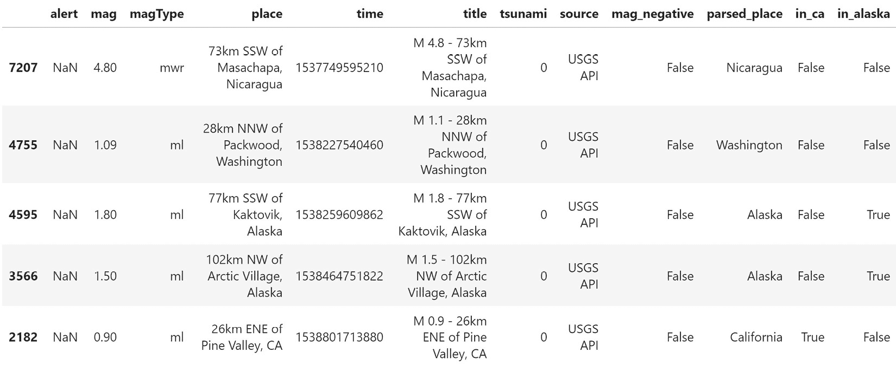

图 2.35 – 一次创建多个新列

`assign()` 方法也接受 `assign()`，它会将数据框传递到 `lambda` 函数作为 `x`，然后我们可以在这里进行操作。这使得我们可以利用在 `assign()` 中创建的列来计算其他列。例如，让我们再次创建 `in_ca` 和 `in_alaska` 列，这次还会创建一个新列 `neither`，如果 `in_ca` 和 `in_alaska` 都是 `False`，那么 `neither` 就为 `True`：

```py
>>> df.assign(
...     in_ca=df.parsed_place == 'California', 
...     in_alaska=df.parsed_place == 'Alaska',
...     neither=lambda x: ~x.in_ca & ~x.in_alaska
... ).sample(5, random_state=0)
```

记住，`~` 是按位取反运算符，所以这允许我们为每一行创建一个列，其结果是 `NOT in_ca AND NOT in_alaska`：

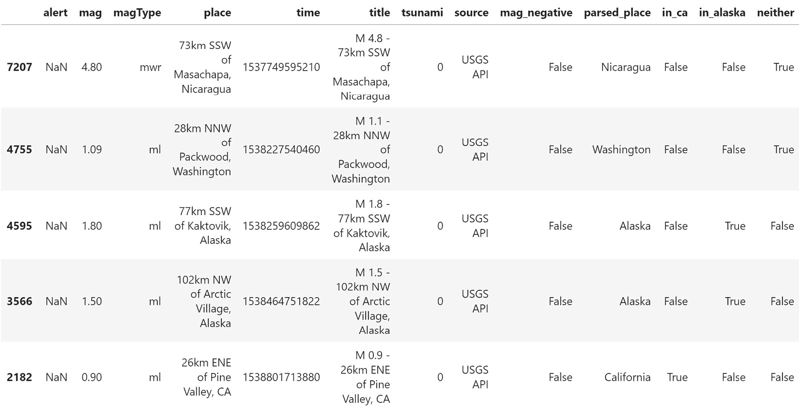

图 2.36 – 使用 lambda 函数一次性创建多个新列

提示

在使用 `pandas` 时，熟悉 `lambda` 函数至关重要，因为它们可以与许多功能一起使用，并且会显著提高代码的质量和可读性。在本书中，我们将看到许多可以使用 `lambda` 函数的场景。

现在我们已经了解了如何添加新列，让我们来看一下如何添加新行。假设我们正在处理两个不同的数据框：一个包含地震和海啸的数据，另一个则是没有海啸的地震数据：

```py
>>> tsunami = df[df.tsunami == 1]
>>> no_tsunami = df[df.tsunami == 0]
>>> tsunami.shape, no_tsunami.shape
((61, 10), (9271, 10))
```

如果我们想查看所有的地震数据，我们可能需要将两个数据框合并成一个。要将行追加到数据框的底部，我们可以使用 `pd.concat()` 或者数据框本身的 `append()` 方法。`concat()` 函数允许我们指定操作的轴——`0` 表示将行追加到底部，`1` 表示将数据追加到最后一列的右侧，依据的是连接列表中最左边的 `pandas` 对象。让我们使用 `pd.concat()` 并保持默认的 `axis=0` 来处理行：

```py
>>> pd.concat([tsunami, no_tsunami]).shape
(9332, 10) # 61 rows + 9271 rows
```

请注意，之前的结果等同于在数据框上运行 `append()` 方法。它仍然返回一个新的 `DataFrame` 对象，但避免了我们需要记住哪个轴是哪个，因为 `append()` 实际上是 `concat()` 函数的一个包装器：

```py
>>> tsunami.append(no_tsunami).shape
(9332, 10) # 61 rows + 9271 rows
```

到目前为止，我们一直在处理 CSV 文件中的部分列，但假设我们现在想处理读取数据时忽略的一些列。由于我们已经在这个笔记本中添加了新列，所以我们不想重新读取文件并再次执行这些操作。相反，我们将沿列方向（`axis=1`）进行合并，添加回我们缺失的内容：

```py
>>> additional_columns = pd.read_csv(
...     'data/earthquakes.csv', usecols=['tz', 'felt', 'ids']
... )
>>> pd.concat([df.head(2), additional_columns.head(2)], axis=1)
```

由于数据框的索引对齐，附加的列被放置在原始列的右侧：

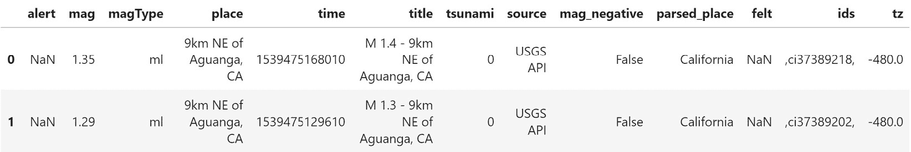

图 2.37 – 按照匹配的索引连接列

`concat()`函数使用索引来确定如何连接值。如果它们不对齐，这将生成额外的行，因为`pandas`不知道如何对齐它们。假设我们忘记了原始 DataFrame 的索引是行号，并且我们通过将`time`列设置为索引来读取了其他列：

```py
>>> additional_columns = pd.read_csv(
...     'data/earthquakes.csv',
...     usecols=['tz', 'felt', 'ids', 'time'], 
...     index_col='time'
... )
>>> pd.concat([df.head(2), additional_columns.head(2)], axis=1)
```

尽管额外的列包含了前两行的数据，`pandas`仍然为它们创建了一个新行，因为索引不匹配。在*第三章*，*使用 Pandas 进行数据清洗*中，我们将看到如何重置索引和设置索引，这两种方法都可以解决这个问题：

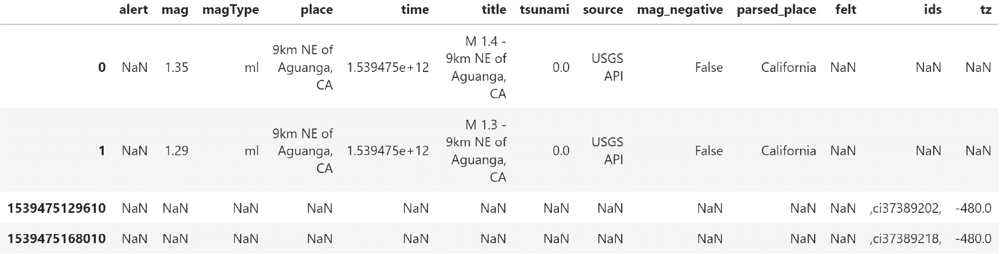

图 2.38 – 连接具有不匹配索引的列

重要提示

在*第四章*，*聚合 Pandas DataFrame*中，我们将讨论合并操作，这将处理一些在增加 DataFrame 列时遇到的问题。通常，我们会使用`concat()`或`append()`来添加行，但会使用`merge()`或`join()`来添加列。

假设我们想连接`tsunami`和`no_tsunami`这两个 DataFrame，但`no_tsunami` DataFrame 多了一列（假设我们向其中添加了一个名为`type`的新列）。`join`参数指定了如何处理列名重叠（在底部添加时）或行名重叠（在右侧连接时）。默认情况下，这是`outer`，所以我们会保留所有内容；但是，如果使用`inner`，我们只会保留它们共有的部分：

```py
>>> pd.concat(
...     [
...         tsunami.head(2),
...         no_tsunami.head(2).assign(type='earthquake')
...     ], 
...     join='inner'
... )
```

注意，`no_tsunami` DataFrame 中的`type`列没有出现，因为它在`tsunami` DataFrame 中不存在。不过，看看索引；这些是原始 DataFrame 的行号，在我们将其分为`tsunami`和`no_tsunami`之前：

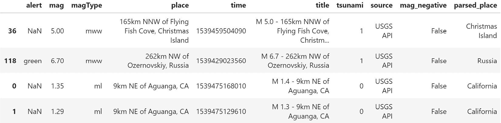

图 2.39 – 添加行并仅保留共享列

如果索引没有实际意义，我们还可以传入`ignore_index`来获取连续的索引值：

```py
>>> pd.concat(
...     [
...         tsunami.head(2), 
...         no_tsunami.head(2).assign(type='earthquake')
...     ],
...     join='inner', ignore_index=True
... )
```

现在索引是连续的，行号与原始 DataFrame 不再匹配：

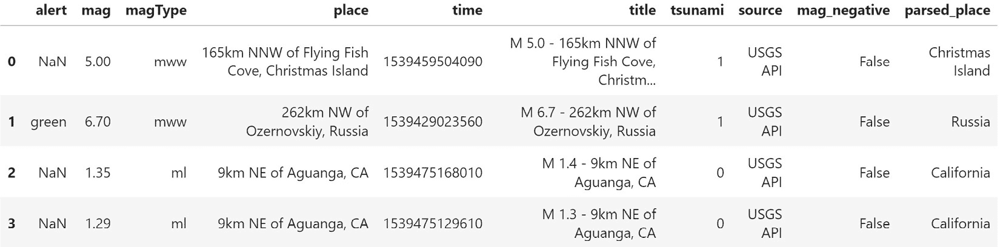

图 2.40 – 添加行并重置索引

确保查阅`pandas`文档以获取有关`concat()`函数和其他数据合并操作的更多信息，我们将在*第四章*，*聚合 Pandas DataFrame*中讨论这些内容：http://pandas.pydata.org/pandas-docs/stable/user_guide/merging.html#concatenating-objects。

## 删除不需要的数据

在将数据添加到我们的数据框后，我们可以看到有删除不需要数据的需求。我们需要一种方法来撤销我们的错误并去除那些我们不打算使用的数据。和添加数据一样，我们可以使用字典语法删除不需要的列，就像从字典中删除键一样。`del df['<column_name>']` 和 `df.pop('<column_name>')` 都可以工作，前提是确实有一个名为该列的列；否则，我们会得到一个 `KeyError`。这里的区别在于，虽然 `del` 会立即删除它，`pop()` 会返回我们正在删除的列。记住，这两个操作都会修改原始数据框，因此请小心使用它们。

让我们使用字典语法删除 `source` 列。注意，它不再出现在 `df.columns` 的结果中：

```py
>>> del df['source']
>>> df.columns
Index(['alert', 'mag', 'magType', 'place', 'time', 'title', 
       'tsunami', 'mag_negative', 'parsed_place'],
      dtype='object')
```

注意，如果我们不确定列是否存在，应该将我们的列删除代码放在 `try...except` 块中：

```py
try:
    del df['source']
except KeyError:
    pass # handle the error here
```

之前，我们创建了 `mag_negative` 列来过滤数据框；然而，我们现在不再希望将这个列包含在数据框中。我们可以使用 `pop()` 获取 `mag_negative` 列的系列，这样我们可以将它作为布尔掩码稍后使用，而不必将其保留在数据框中：

```py
>>> mag_negative = df.pop('mag_negative')
>>> df.columns
Index(['alert', 'mag', 'magType', 'place', 'time', 'title', 
       'tsunami', 'parsed_place'],
      dtype='object')
```

我们现在在 `mag_negative` 变量中有一个布尔掩码，它曾经是 `df` 中的一列：

```py
>>> mag_negative.value_counts()
False    8841
True      491
Name: mag_negative, dtype: int64
```

由于我们使用 `pop()` 移除了 `mag_negative` 系列而不是删除它，我们仍然可以使用它来过滤数据框：

```py
>>> df[mag_negative].head()
```

这样我们就得到了具有负震级的地震数据。由于我们还调用了 `head()`，因此返回的是前五个这样的地震数据：

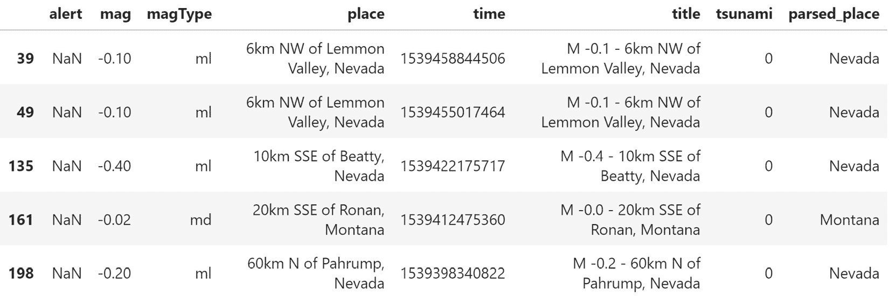

图 2.41 – 使用弹出的列作为布尔掩码

`DataFrame` 对象有一个 `drop()` 方法，用于删除多行或多列，可以原地操作（覆盖原始数据框而不需要重新赋值）或返回一个新的 `DataFrame` 对象。要删除行，我们传入索引列表。让我们删除前两行：

```py
>>> df.drop([0, 1]).head(2)
```

请注意，索引从 `2` 开始，因为我们删除了 `0` 和 `1`：

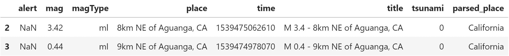

图 2.42 – 删除特定的行

默认情况下，`drop()` 假设我们要删除的是行（`axis=0`）。如果我们想删除列，我们可以传入 `axis=1`，或者使用 `columns` 参数指定我们要删除的列名列表。让我们再删除一些列：

```py
>>> cols_to_drop = [
...     col for col in df.columns
...     if col not in [
...         'alert', 'mag', 'title', 'time', 'tsunami'
...     ]
... ]
>>> df.drop(columns=cols_to_drop).head()
```

这会删除所有不在我们想保留的列表中的列：

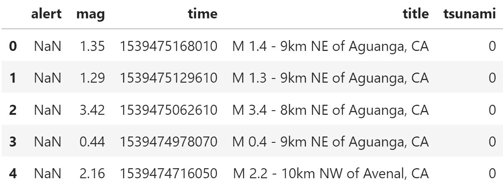

图 2.43 – 删除特定的列

无论我们决定将 `axis=1` 传递给 `drop()` 还是使用 `columns` 参数，我们的结果都是等效的：

```py
>>> df.drop(columns=cols_to_drop).equals(
...     df.drop(cols_to_drop, axis=1)
... )
True
```

默认情况下，`drop()` 会返回一个新的 `DataFrame` 对象；然而，如果我们确实想从原始数据框中删除数据，我们可以传入 `inplace=True`，这将避免我们需要将结果重新赋值回数据框。结果与 *图 2.43* 中的相同：

```py
>>> df.drop(columns=cols_to_drop, inplace=True)
>>> df.head()
```

使用就地操作时要始终小心。在某些情况下，可能可以撤销它们；然而，在其他情况下，可能需要从头开始并重新创建`DataFrame`。

# 总结

在本章中，我们学习了如何使用`pandas`进行数据分析中的数据收集部分，并使用统计数据描述我们的数据，这将在得出结论阶段时派上用场。我们学习了`pandas`库的主要数据结构，以及我们可以对其执行的一些操作。接下来，我们学习了如何从多种来源创建`DataFrame`对象，包括平面文件和 API 请求。通过使用地震数据，我们讨论了如何总结我们的数据并从中计算统计数据。随后，我们讲解了如何通过选择、切片、索引和过滤来提取数据子集。最后，我们练习了如何添加和删除`DataFrame`中的列和行。

这些任务也是我们`pandas`工作流的核心，并为接下来几章关于数据清理、聚合和数据可视化的新主题奠定了基础。请确保在继续之前完成下一节提供的练习。

# 练习

使用`data/parsed.csv`文件和本章的材料，完成以下练习以练习你的`pandas`技能：

1.  使用`mb`震级类型计算日本地震的 95 百分位数。

1.  找出印度尼西亚与海啸相关的地震百分比。

1.  计算内华达州地震的汇总统计。

1.  添加一列，指示地震是否发生在环太平洋火山带上的国家或美国州。使用阿拉斯加、南极洲（查找 Antarctic）、玻利维亚、加利福尼亚、加拿大、智利、哥斯达黎加、厄瓜多尔、斐济、危地马拉、印度尼西亚、日本、克麦得岛、墨西哥（注意不要选择新墨西哥州）、新西兰、秘鲁、菲律宾、俄罗斯、台湾、汤加和华盛顿。

1.  计算环太平洋火山带内外地震的数量。

1.  计算环太平洋火山带上的海啸数量。

# 进一步阅读

具有 R 和/或 SQL 背景的人可能会发现查看`pandas`语法的比较会有所帮助：

+   *与 R / R 库的比较*: https://pandas.pydata.org/pandas-docs/stable/getting_started/comparison/comparison_with_r.html

+   *与 SQL 的比较*: https://pandas.pydata.org/pandas-docs/stable/comparison_with_sql.html

+   *SQL 查询*: https://pandas.pydata.org/pandas-docs/stable/getting_started/comparison/comparison_with_sql.html

以下是一些关于处理序列化数据的资源：

+   *Python 中的 Pickle: 对象序列化*: https://www.datacamp.com/community/tutorials/pickle-python-tutorial

+   *将 RData/RDS 文件读取到 pandas.DataFrame 对象中（pyreader）*: https://github.com/ofajardo/pyreadr

以下是一些关于使用 API 的附加资源：

+   *requests 包文档*: https://requests.readthedocs.io/en/master/

+   *HTTP 方法*: https://restfulapi.net/http-methods/

+   *HTTP 状态码*: https://restfulapi.net/http-status-codes/

要了解更多关于正则表达式的知识，请参考以下资源：

+   *《精通 Python 正则表达式》 作者：Félix López, Víctor Romero*: https://www.packtpub.com/application-development/mastering-python-regular-expressions

+   *正则表达式教程 — 学习如何使用正则表达式*: https://www.regular-expressions.info/tutorial.html
