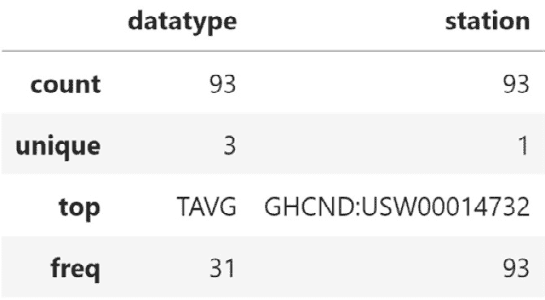
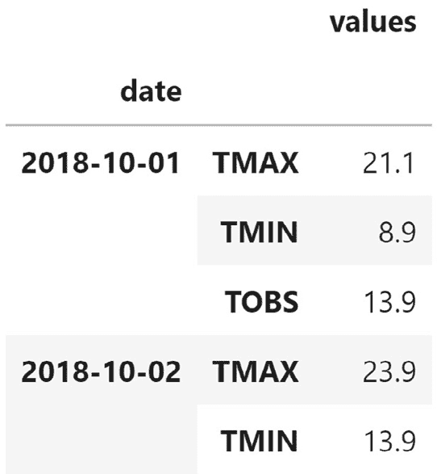

# 第四章：*第三章*：使用 Pandas 进行数据整理

在上一章中，我们学习了主要的`pandas`数据结构，如何用收集到的数据创建`DataFrame`对象，以及检查、总结、筛选、选择和处理`DataFrame`对象的各种方法。现在，我们已经熟练掌握了初步数据收集和检查阶段，可以开始进入数据整理的世界。

如*第一章*，《*数据分析简介*》中所提到的，准备数据进行分析通常是从事数据工作的人耗费最多时间的部分，而且往往是最不令人愉快的部分。幸运的是，`pandas`非常适合处理这些任务，通过掌握本书中介绍的技能，我们将能够更快地进入更有趣的部分。

需要注意的是，数据整理并非我们在分析中只做一次的工作；很可能在完成一次数据整理并转向其他分析任务（如数据可视化）后，我们会发现仍然需要进行额外的数据整理。我们对数据越熟悉，就越能为分析做好准备。形成一种直觉，了解数据应该是什么类型、我们需要将数据转换成什么格式来进行可视化，以及我们需要收集哪些数据点来进行分析，这一点至关重要。这需要经验积累，因此我们必须在每次处理自己数据时，实践本章中将涉及的技能。

由于这是一个非常庞大的话题，关于数据整理的内容将在本章和*第四章*，《*聚合 Pandas 数据框*》中分开讲解。本章将概述数据整理，然后探索`requests`库。接着，我们将讨论一些数据整理任务，这些任务涉及为初步分析和可视化准备数据（我们将在*第五章*，《*使用 Pandas 和 Matplotlib 进行数据可视化*》以及*第六章*，《*使用 Seaborn 绘图和定制技巧*》中学习到的内容）。我们将针对与聚合和数据集合并相关的更高级的数据整理内容，在*第四章*，《*聚合 Pandas 数据框*》中进行讲解。

本章将涵盖以下主题：

+   理解数据整理

+   探索 API 查找并收集温度数据

+   清理数据

+   数据重塑

+   处理重复、缺失或无效数据

# 本章材料

本章的材料可以在 GitHub 上找到，链接为 [`github.com/stefmolin/Hands-On-Data-Analysis-with-Pandas-2nd-edition/tree/master/ch_03`](https://github.com/stefmolin/Hands-On-Data-Analysis-with-Pandas-2nd-edition/tree/master/ch_03)。这里有五个笔记本，我们将按顺序进行学习，并有两个目录，`data/` 和 `exercises/`，分别包含了上述笔记本和章节末尾练习所需的所有 CSV 文件。`data/` 目录中包含以下文件：


图 3.1 – 本章使用的数据集解析

我们将在 `1-wide_vs_long.ipynb` 笔记本中开始，讨论宽格式和长格式数据的区别。接下来，我们将在 `2-using_the_weather_api.ipynb` 笔记本中从 NCEI API 获取每日气温数据，API 地址为 [`www.ncdc.noaa.gov/cdo-web/webservices/v2`](https://www.ncdc.noaa.gov/cdo-web/webservices/v2)。我们将使用的 **全球历史气候网络–每日**（**GHCND**）数据集的文档可以在 [`www1.ncdc.noaa.gov/pub/data/cdo/documentation/GHCND_documentation.pdf`](https://www1.ncdc.noaa.gov/pub/data/cdo/documentation/GHCND_documentation.pdf) 找到。

重要提示

NCEI 是 **国家海洋和大气管理局**（**NOAA**）的一部分。如 API 的 URL 所示，该资源是在 NCEI 被称为 NCDC 时创建的。如果将来该资源的 URL 发生变化，可以搜索 *NCEI weather API* 来找到更新后的 URL。

在 `3-cleaning_data.ipynb` 笔记本中，我们将学习如何对温度数据和一些财务数据进行初步清理，这些财务数据是通过我们将在 *第七章* 中构建的 `stock_analysis` 包收集的，*财务分析——比特币与股市*。然后，我们将在 `4-reshaping_data.ipynb` 笔记本中探讨如何重塑数据。最后，在 `5-handling_data_issues.ipynb` 笔记本中，我们将学习如何使用一些脏数据（可在 `data/dirty_data.csv` 中找到）处理重复、缺失或无效数据的策略。文本中将指示何时切换笔记本。

# 理解数据处理

就像任何专业领域一样，数据分析充满了术语，初学者往往很难理解这些行话——本章的主题也不例外。当我们进行**数据清洗**时，我们将输入数据从其原始状态转化为可以进行有意义分析的格式。**数据操作**是指这一过程的另一种说法。没有固定的操作清单；唯一的目标是，经过清洗后的数据对我们来说比开始时更有用。在实践中，数据清洗过程通常涉及以下三项常见任务：

+   数据清理

+   数据转换

+   数据丰富化

应该注意的是，这些任务没有固定的顺序，我们很可能会在数据清洗过程中多次执行每一项。这一观点引出了一个有趣的难题：如果我们需要清洗数据以为分析做准备，难道不能以某种方式清洗数据，让它告诉我们它在说什么，而不是我们去了解它在说什么吗？

“如果你对数据施加足够的压力，它就会承认任何事情。”

— 罗纳德·科斯，诺贝尔经济学奖得主

从事数据工作的人会发现，通过操作数据很容易扭曲事实。然而，我们的责任是尽最大努力避免欺骗，通过时刻关注我们操作对数据完整性产生的影响，并且向分析使用者解释我们得出结论的过程，让他们也能作出自己的判断。

## 数据清理

一旦我们收集到数据，将其导入`DataFrame`对象，并运用在*第二章*中讨论的技巧熟悉数据后，我们将需要进行一些数据清理。初步的数据清理通常能为我们提供开始探索数据所需的最基本条件。一些必须掌握的基本数据清理任务包括：

+   重命名

+   排序与重新排序

+   数据类型转换

+   处理重复数据

+   处理缺失或无效数据

+   筛选出所需的数据子集

数据清理是数据清洗的最佳起点，因为将数据存储为正确的数据类型和易于引用的名称将为许多探索途径提供便利，如总结统计、排序和筛选。由于我们在*第二章*中已经讲解过筛选内容，*与 Pandas DataFrame 的合作*，本章将重点讨论上一节提到的其他主题。

## 数据转换

经常在一些初步数据清洗之后，我们会进入数据转换阶段，但完全有可能我们的数据集在当前的形式下无法使用，我们必须在进行任何数据清理之前对其进行重构。在**数据转换**中，我们专注于改变数据的结构，以促进后续分析；这通常涉及改变哪些数据沿行展示，哪些数据沿列展示。

我们将遇到的大多数数据都是**宽格式**或**长格式**；这两种格式各有其优点，了解我们需要哪一种格式进行分析是非常重要的。通常，人们会以宽格式记录和呈现数据，但有些可视化方法需要数据采用长格式：


图 3.2 – (左)宽格式与(右)长格式

宽格式更适合分析和数据库设计，而长格式被认为是一种不良设计，因为每一列应该代表一个数据类型并具有单一含义。然而，在某些情况下，当需要在关系型数据库中添加新字段（或删除旧字段）时，数据库管理员可能会选择使用长格式，这样可以避免每次都修改所有表格。这样，他们可以为数据库用户提供固定的模式，同时根据需要更新数据库中的数据。在构建 API 时，如果需要灵活性，可能会选择长格式。比如，API 可能会提供一种通用的响应格式（例如日期、字段名和字段值），以支持来自数据库的各种表格。这也可能与如何根据 API 所使用的数据库存储数据来简化响应的构建过程相关。由于我们将遇到这两种格式的数据，理解如何处理它们并在两者之间转换是非常重要的。

现在，让我们导航到`1-wide_vs_long.ipynb`笔记本，查看一些示例。首先，我们将导入`pandas`和`matplotlib`（这些将帮助我们说明每种格式在可视化方面的优缺点，相关内容将在*第五章*《使用 Pandas 和 Matplotlib 进行数据可视化》和*第六章*《使用 Seaborn 和自定义技巧进行绘图》中讨论），并读取包含宽格式和长格式数据的 CSV 文件：

```py
>>> import matplotlib.pyplot as plt
>>> import pandas as pd
>>> wide_df = \
...     pd.read_csv('data/wide_data.csv', parse_dates=['date'])
>>> long_df = pd.read_csv(
...     'data/long_data.csv', 
...     usecols=['date', 'datatype', 'value'], 
...     parse_dates=['date']
... )[['date', 'datatype', 'value']] # sort columns
```

### 宽格式数据

对于宽格式数据，我们用各自的列来表示变量的测量值，每一行代表这些变量的一个观测值。这使得我们可以轻松地比较不同观测中的变量，获取汇总统计数据，执行操作并展示我们的数据；然而，一些可视化方法无法使用这种数据格式，因为它们可能依赖于长格式来拆分、调整大小和/或着色图表内容。

让我们查看`wide_df`中宽格式数据的前六条记录：

```py
>>> wide_df.head(6)
```

每列包含特定类别温度数据的前六条观测记录，单位是摄氏度——最高温度 (**TMAX**)、最低温度 (**TMIN**)、和观测时温度 (**TOBS**)，其频率为每日：


图 3.3 – 宽格式温度数据

在处理宽格式数据时，我们可以通过使用`describe()`方法轻松获得该数据的总结统计信息。请注意，虽然旧版本的`pandas`将`datetimes`视为分类数据，但`pandas`正朝着将其视为数值型数据的方向发展，因此我们传入`datetime_is_numeric=True`来抑制警告：

```py
>>> wide_df.describe(include='all', datetime_is_numeric=True)
```

几乎不费力气，我们就能获得日期、最高温度、最低温度和观测时温度的总结统计信息：


图 3.4 – 宽格式温度数据的总结统计

正如我们之前讨论的，前面表格中的总结数据容易获得，并且富有信息。这种格式也可以用`pandas`轻松绘制，只要我们告诉它确切需要绘制的内容：

```py
>>> wide_df.plot(
...     x='date', y=['TMAX', 'TMIN', 'TOBS'], figsize=(15, 5),
...     title='Temperature in NYC in October 2018' 
... ).set_ylabel('Temperature in Celsius')
>>> plt.show()
```

`pandas`将每日最高温度、最低温度和观测时温度绘制成单一折线图的三条线：


图 3.5 – 绘制宽格式温度数据

重要提示

现在不用担心理解可视化代码，它的目的是仅仅展示这些数据格式如何使某些任务更简单或更困难。我们将在*第五章*中讲解如何使用`pandas`和`matplotlib`进行数据可视化，*使用 Pandas 和 Matplotlib 可视化数据*。

### 长格式数据

长格式数据每一行代表一个变量的观测值；这意味着，如果我们有三个每天测量的变量，每天的观测将有三行数据。长格式的设置可以通过将变量的列名转化为单一列来实现，这一列的值就是变量名称，然后将变量的值放在另一列。

我们可以查看`long_df`中长格式数据的前六行，看看宽格式数据和长格式数据之间的差异：

```py
>>> long_df.head(6)
```

注意，现在我们为每个日期有三条记录，并且**数据类型**列告诉我们**值**列中数据的含义：


图 3.6 – 长格式温度数据

如果我们像处理宽格式数据一样尝试获取总结统计，结果将不那么有用：

```py
>>> long_df.describe(include='all', datetime_is_numeric=True)
```

**value** 列展示了汇总统计数据，但这是对每日最高气温、最低气温和观测时气温的汇总。最大值是每日最高气温的最大值，最小值是每日最低气温的最小值。这意味着这些汇总数据并不十分有用：


图 3.7 – 长格式温度数据的汇总统计

这种格式并不容易理解，当然也不应该是我们展示数据的方式；然而，它使得创建可视化变得容易，利用我们的绘图库可以根据变量的名称为线条着色、根据某个变量的值调整点的大小，并且进行分面。Pandas 期望绘图数据为宽格式数据，因此，为了轻松绘制出我们用宽格式数据绘制的相同图表，我们必须使用另一个绘图库，叫做 `seaborn`，我们将在*第六章*中讲解，*使用 Seaborn 绘图与定制技术*：

```py
>>> import seaborn as sns
>>> sns.set(rc={'figure.figsize': (15, 5)}, style='white')
>>> ax = sns.lineplot(
...     data=long_df, x='date', y='value', hue='datatype'
... )
>>> ax.set_ylabel('Temperature in Celsius')
>>> ax.set_title('Temperature in NYC in October 2018')
>>> plt.show()
```

Seaborn 可以根据 `datatype` 列对数据进行子集化，给我们展示每日最高气温、最低气温和观测时的气温的单独线条：


图 3.8 – 绘制长格式温度数据

Seaborn 允许我们指定用于 `hue` 的列，这样可以根据温度类型为*图 3.8*中的线条着色。不过，我们并不局限于此；对于长格式数据，我们可以轻松地对图表进行分面：

```py
>>> sns.set(
...     rc={'figure.figsize': (20, 10)},
...     style='white', font_scale=2 
... )
>>> g = sns.FacetGrid(long_df, col='datatype', height=10)
>>> g = g.map(plt.plot, 'date', 'value')
>>> g.set_titles(size=25)
>>> g.set_xticklabels(rotation=45)
>>> plt.show()
```

Seaborn 可以使用长格式数据为 `datatype` 列中的每个不同值创建子图：


图 3.9 – 绘制长格式温度数据的子集

重要提示

虽然使用 `pandas` 和 `matplotlib` 的子图可以创建类似于之前图表的图形，但更复杂的分面组合将使得使用 `seaborn` 变得极其简便。我们将在*第六章*中讲解 `seaborn`，*使用 Seaborn 绘图与定制技术*。

在*重塑数据*部分，我们将讲解如何通过“melting”将数据从宽格式转换为长格式，以及如何通过“pivoting”将数据从长格式转换为宽格式。此外，我们还将学习如何转置数据，即翻转列和行。

## 数据丰富

一旦我们拥有了格式化良好的清理数据用于分析，我们可能会发现需要稍微丰富一下数据。**数据丰富**通过某种方式向数据添加更多内容，从而提升数据的质量。这个过程在建模和机器学习中非常重要，它是**特征工程**过程的一部分（我们将在*第十章*中提到，*做出更好的预测——优化模型*）。

当我们想要丰富数据时，我们可以**合并**新数据与原始数据（通过附加新行或列）或使用原始数据创建新数据。以下是使用原始数据增强数据的几种方法：

+   **添加新列**：使用现有列中的数据，通过函数计算出新值。

+   **分箱**：将连续数据或具有许多不同值的离散数据转换为区间，这使得列变为离散的，同时让我们能够控制列中可能值的数量。

+   **聚合**：将数据汇总并概括。

+   **重采样**：在特定的时间间隔内聚合时间序列数据。

现在我们已经理解了数据整理的概念，接下来让我们收集一些数据来进行操作。请注意，在本章中我们将讨论数据清理和转换，而数据丰富将在*第四章*中讨论，内容包括*聚合 Pandas 数据框*。

# 探索 API 以查找并收集温度数据

在*第二章*中，*使用 Pandas 数据框*，我们处理了数据收集以及如何进行初步检查和筛选数据；这通常会给我们一些启示，告诉我们在进一步分析之前需要解决的事项。由于本章内容建立在这些技能的基础上，我们也将在这里练习其中的一些技能。首先，我们将开始探索 NCEI 提供的天气 API。接下来，在下一节中，我们将学习如何使用之前从该 API 获取的温度数据进行数据整理。

重要提示

要使用 NCEI API，您需要填写此表格并提供您的电子邮件地址以申请一个令牌：[`www.ncdc.noaa.gov/cdo-web/token`](https://www.ncdc.noaa.gov/cdo-web/token)。

在本节中，我们将在`2-using_the_weather_api.ipynb`笔记本中请求 NCEI API 的温度数据。正如我们在*第二章*中学到的，*使用 Pandas 数据框*，我们可以使用`requests`库与 API 进行交互。在下面的代码块中，我们导入了`requests`库，并创建了一个便捷函数来向特定端点发出请求，并附带我们的令牌。要使用此函数，我们需要提供一个令牌，具体如下所示（以粗体显示）：

```py
>>> import requests
>>> def make_request(endpoint, payload=None):
...     """
...     Make a request to a specific endpoint on the 
...     weather API passing headers and optional payload.
...     Parameters:
...         - endpoint: The endpoint of the API you want to 
...                     make a GET request to.
...         - payload: A dictionary of data to pass along 
...                    with the request.
...     
...     Returns:
...         A response object.
...     """
...     return requests.get(
...         'https://www.ncdc.noaa.gov/cdo-web/'
...         f'api/v2/{endpoint}',
...         headers={'token': 'PASTE_YOUR_TOKEN_HERE'},
...         params=payload
...     )
```

小贴士

这个函数使用了`format()`方法：`'api/v2/{}'.format(endpoint)`。

要使用`make_request()`函数，我们需要学习如何构建请求。NCEI 提供了一个有用的入门页面（[`www.ncdc.noaa.gov/cdo-web/webservices/v2#gettingStarted`](https://www.ncdc.noaa.gov/cdo-web/webservices/v2#gettingStarted)），该页面向我们展示了如何构建请求；我们可以通过页面上的选项卡逐步确定查询中需要哪些过滤条件。`requests`库负责将我们的搜索参数字典（作为`payload`传递）转换为`2018-08-28`的`start`和`2019-04-15`的`end`，最终得到`?start=2018-08-28&end=2019-04-15`，就像网站上的示例一样。这个 API 提供了许多不同的端点，供我们探索所提供的内容，并构建我们最终的实际数据集请求。我们将从使用`datasets`端点查找我们想查询的数据集 ID（`datasetid`）开始。让我们检查哪些数据集在 2018 年 10 月 1 日至今天之间有数据：

```py
>>> response = \
...     make_request('datasets', {'startdate': '2018-10-01'})
```

请记住，我们需要检查`status_code`属性，以确保请求成功。或者，我们可以使用`ok`属性来获取布尔指示，查看是否一切按预期进行：

```py
>>> response.status_code
200
>>> response.ok
True
```

提示

API 限制我们每秒最多 5 个请求，每天最多 10,000 个请求。如果超过这些限制，状态码将显示客户端错误（意味着错误似乎是由我们引起的）。客户端错误的状态码通常在 400 系列；例如，404 表示请求的资源无法找到，400 表示服务器无法理解我们的请求（或拒绝处理）。有时，服务器在处理我们的请求时遇到问题，在这种情况下，我们会看到 500 系列的状态码。您可以在[`restfulapi.net/http-status-codes/`](https://restfulapi.net/http-status-codes/)找到常见状态码及其含义的列表。

一旦我们得到响应，就可以使用`json()`方法获取有效载荷。然后，我们可以使用字典方法来确定我们想查看的部分：

```py
>>> payload = response.json()
>>> payload.keys()
dict_keys(['metadata', 'results'])
```

`metadata`部分的 JSON 有效载荷告诉我们有关结果的信息，而`results`部分包含实际的结果。让我们看看我们收到了多少数据，这样我们就知道是否可以打印结果，或者是否应该尝试限制输出：

```py
>>> payload['metadata']
{'resultset': {'offset': 1, 'count': 11, 'limit': 25}}
```

我们收到了 11 行数据，因此让我们看看`results`部分的 JSON 有效载荷包含哪些字段。`results`键包含一个字典列表。如果我们选择第一个字典，可以查看键以了解数据包含哪些字段。然后，我们可以将输出缩减到我们关心的字段：

```py
>>> payload['results'][0].keys()
dict_keys(['uid', 'mindate', 'maxdate', 'name', 
           'datacoverage', 'id'])
```

对于我们的目的，我们希望查看数据集的 ID 和名称，因此让我们使用列表推导式仅查看这些：

```py
>>> [(data['id'], data['name']) for data in payload['results']]
[('GHCND', 'Daily Summaries'),
 ('GSOM', 'Global Summary of the Month'),
 ('GSOY', 'Global Summary of the Year'),
 ('NEXRAD2', 'Weather Radar (Level II)'),
 ('NEXRAD3', 'Weather Radar (Level III)'),
 ('NORMAL_ANN', 'Normals Annual/Seasonal'),
 ('NORMAL_DLY', 'Normals Daily'),
 ('NORMAL_HLY', 'Normals Hourly'),
 ('NORMAL_MLY', 'Normals Monthly'),
 ('PRECIP_15', 'Precipitation 15 Minute'),
 ('PRECIP_HLY', 'Precipitation Hourly')]
```

结果中的第一个条目就是我们要找的。现在我们有了`datasetid`的值（`GHCND`），我们继续识别一个`datacategoryid`，我们需要使用`datacategories`端点请求温度数据。在这里，我们可以打印 JSON 负载，因为它并不是很大（仅九个条目）：

```py
>>> response = make_request(
...     'datacategories', payload={'datasetid': 'GHCND'}
... )
>>> response.status_code
200
>>> response.json()['results']
[{'name': 'Evaporation', 'id': 'EVAP'},
 {'name': 'Land', 'id': 'LAND'},
 {'name': 'Precipitation', 'id': 'PRCP'},
 {'name': 'Sky cover & clouds', 'id': 'SKY'},
 {'name': 'Sunshine', 'id': 'SUN'},
 {'name': 'Air Temperature', 'id': 'TEMP'},
 {'name': 'Water', 'id': 'WATER'},
 {'name': 'Wind', 'id': 'WIND'},
 {'name': 'Weather Type', 'id': 'WXTYPE'}]
```

根据先前的结果，我们知道我们想要`TEMP`的值作为`datacategoryid`。接下来，我们使用此值通过`datatypes`端点识别我们想要的数据类型。我们将再次使用列表推导式仅打印名称和 ID；这仍然是一个相当大的列表，因此输出已经被缩短。

```py
>>> response = make_request(
...     'datatypes', 
...     payload={'datacategoryid': 'TEMP', 'limit': 100}
... )
>>> response.status_code
200
>>> [(datatype['id'], datatype['name'])
...  for datatype in response.json()['results']]
[('CDSD', 'Cooling Degree Days Season to Date'),
 ...,
 ('TAVG', 'Average Temperature.'),
 ('TMAX', 'Maximum temperature'),
 ('TMIN', 'Minimum temperature'),
 ('TOBS', 'Temperature at the time of observation')]
```

我们正在寻找`TAVG`、`TMAX`和`TMIN`数据类型。现在我们已经准备好请求所有位置的温度数据，我们需要将其缩小到特定位置。要确定`locationcategoryid`的值，我们必须使用`locationcategories`端点：

```py
>>> response = make_request(
...     'locationcategories', payload={'datasetid': 'GHCND'}
... )
>>> response.status_code
200
```

注意我们可以使用来自 Python 标准库的`pprint`（[`docs.python.org/3/library/pprint.html`](https://docs.python.org/3/library/pprint.html)）来以更易读的格式打印我们的 JSON 负载：

```py
>>> import pprint
>>> pprint.pprint(response.json())
{'metadata': {
     'resultset': {'count': 12, 'limit': 25, 'offset': 1}},
 'results': [{'id': 'CITY', 'name': 'City'},
             {'id': 'CLIM_DIV', 'name': 'Climate Division'},
             {'id': 'CLIM_REG', 'name': 'Climate Region'},
             {'id': 'CNTRY', 'name': 'Country'},
             {'id': 'CNTY', 'name': 'County'},
             ...,
             {'id': 'ST', 'name': 'State'},
             {'id': 'US_TERR', 'name': 'US Territory'},
             {'id': 'ZIP', 'name': 'Zip Code'}]}
```

我们想要查看纽约市，因此对于`locationcategoryid`过滤器，`CITY`是正确的值。我们正在使用 API 上的**二分搜索**来搜索字段的笔记本；二分搜索是一种更有效的有序列表搜索方法。因为我们知道字段可以按字母顺序排序，并且 API 提供了有关请求的元数据，我们知道 API 对于给定字段有多少项，并且可以告诉我们是否已经通过了我们正在寻找的项。

每次请求时，我们获取中间条目并将其与我们的目标字母顺序比较；如果结果在我们的目标之前出现，我们查看大于我们刚获取的数据的一半；否则，我们查看较小的一半。每次，我们都将数据切成一半，因此当我们获取中间条目进行测试时，我们越来越接近我们寻找的值（见*图 3.10*）：

```py
>>> def get_item(name, what, endpoint, start=1, end=None):
...     """
...     Grab the JSON payload using binary search.
... 
...     Parameters:
...         - name: The item to look for.
...         - what: Dictionary specifying what item `name` is.
...         - endpoint: Where to look for the item.
...         - start: The position to start at. We don't need
...           to touch this, but the function will manipulate
...           this with recursion.
...         - end: The last position of the items. Used to 
...           find the midpoint, but like `start` this is not 
...           something we need to worry about.
... 
...     Returns: Dictionary of the information for the item 
...              if found, otherwise an empty dictionary.
...     """
...     # find the midpoint to cut the data in half each time 
...     mid = (start + (end or 1)) // 2
...     
...     # lowercase the name so this is not case-sensitive
...     name = name.lower()
...     # define the payload we will send with each request
...     payload = {
...         'datasetid': 'GHCND', 'sortfield': 'name',
...         'offset': mid, # we'll change the offset each time
...         'limit': 1 # we only want one value back
...     }
...     
...     # make request adding additional filters from `what`
...     response = make_request(endpoint, {**payload, **what})
...     
...     if response.ok:
...         payload = response.json()
...     
...         # if ok, grab the end index from the response 
...         # metadata the first time through
...         end = end or \
...             payload['metadata']['resultset']['count']
...         
...         # grab the lowercase version of the current name
...         current_name = \
...             payload['results'][0]['name'].lower()  
...
...         # if what we are searching for is in the current 
...         # name, we have found our item
...         if name in current_name:
...             # return the found item
...             return payload['results'][0] 
...         else:
...             if start >= end: 
...                 # if start index is greater than or equal
...                 # to end index, we couldn't find it
...                 return {}
...             elif name < current_name:
...                 # name comes before the current name in the 
...                 # alphabet => search further to the left
...                 return get_item(name, what, endpoint, 
...                                 start, mid - 1)
...             elif name > current_name:
...                 # name comes after the current name in the 
...                 # alphabet => search further to the right
...                 return get_item(name, what, endpoint,
...                                 mid + 1, end) 
...     else:
...         # response wasn't ok, use code to determine why
...         print('Response not OK, '
...               f'status: {response.status_code}')
```

这是算法的**递归**实现，这意味着我们从内部调用函数自身；我们在这样做时必须非常小心，以定义一个**基本条件**，以便最终停止并避免进入无限循环。可以以迭代方式实现此功能。有关二分搜索和**递归**的更多信息，请参阅本章末尾的*进一步阅读*部分。

重要说明

在传统的二分搜索实现中，查找我们搜索的列表的长度是微不足道的。使用 API，我们必须发出一个请求来获取计数；因此，我们必须请求第一个条目（偏移量为 1）来确定方向。这意味着与我们开始时所需的相比，我们在这里多做了一个额外的请求。

现在，让我们使用二分查找实现来查找纽约市的 ID，这将作为后续查询中 `locationid` 的值：

```py
>>> nyc = get_item(
...     'New York', {'locationcategoryid': 'CITY'}, 'locations'
... )
>>> nyc
{'mindate': '1869-01-01',
 'maxdate': '2021-01-14',
 'name': 'New York, NY US',
 'datacoverage': 1,
 'id': 'CITY:US360019'}
```

通过在这里使用二分查找，我们只用了 **8** 次请求就找到了 **纽约**，尽管它位于 1,983 个条目的中间！做个对比，使用线性查找，我们在找到它之前会查看 1,254 个条目。在下面的图示中，我们可以看到二分查找是如何系统性地排除位置列表中的部分内容的，这在数轴上用黑色表示（白色表示该部分仍可能包含所需值）：


图 3.10 – 二分查找定位纽约市

提示

一些 API（如 NCEI API）限制我们在某些时间段内可以进行的请求次数，因此我们必须聪明地进行请求。当查找一个非常长的有序列表时，想一想二分查找。

可选地，我们可以深入挖掘收集数据的站点 ID。这是最细粒度的层次。再次使用二分查找，我们可以获取中央公园站点的站点 ID：

```py
>>> central_park = get_item(
...     'NY City Central Park',
...     {'locationid': nyc['id']}, 'stations'
... )
>>> central_park
{'elevation': 42.7,
 'mindate': '1869-01-01',
 'maxdate': '2020-01-13',
 'latitude': 40.77898,
 'name': 'NY CITY CENTRAL PARK, NY US',
 'datacoverage': 1,
 'id': 'GHCND:USW00094728',
 'elevationUnit': 'METERS',
 'longitude': -73.96925}
```

现在，让我们请求 2018 年 10 月来自中央公园的纽约市温度数据（摄氏度）。为此，我们将使用 `data` 端点，并提供在探索 API 过程中收集的所有参数：

```py
>>> response = make_request(
...     'data', 
...     {'datasetid': 'GHCND',
...      'stationid': central_park['id'],
...      'locationid': nyc['id'],
...      'startdate': '2018-10-01',
...      'enddate': '2018-10-31',
...      'datatypeid': ['TAVG', 'TMAX', 'TMIN'],
...      'units': 'metric',
...      'limit': 1000}
... )
>>> response.status_code
200
```

最后，我们将创建一个 `DataFrame` 对象；由于 JSON 数据负载中的 `results` 部分是字典列表，我们可以直接将其传递给 `pd.DataFrame()`：

```py
>>> import pandas as pd
>>> df = pd.DataFrame(response.json()['results'])
>>> df.head()
```

我们得到了长格式的数据。**datatype** 列是正在测量的温度变量，**value** 列包含测得的温度：


图 3.11 – 从 NCEI API 获取的数据

提示

我们可以使用之前的代码将本节中处理过的任何 JSON 响应转换为 `DataFrame` 对象，如果我们觉得这样更方便。但需要强调的是，JSON 数据负载几乎在所有 API 中都很常见（作为 Python 用户，我们应该熟悉类似字典的对象），因此，熟悉它们不会有什么坏处。

我们请求了 `TAVG`、`TMAX` 和 `TMIN`，但注意到我们没有得到 `TAVG`。这是因为尽管中央公园站点在 API 中列出了提供平均温度的选项，但它并没有记录该数据——现实世界中的数据是有缺陷的：

```py
>>> df.datatype.unique()
array(['TMAX', 'TMIN'], dtype=object)
>>> if get_item(
...     'NY City Central Park', 
...     {'locationid': nyc['id'], 'datatypeid': 'TAVG'}, 
...     'stations'
... ):
...     print('Found!')
Found!
```

计划 B 的时候到了：让我们改用拉瓜迪亚机场作为本章剩余部分的站点。或者，我们本可以获取覆盖整个纽约市的所有站点的数据；不过，由于这会导致一些温度测量数据每天有多个条目，我们不会在这里这么做——要处理这些数据，我们需要一些将在 *第四章* 中介绍的技能，*聚合 Pandas DataFrames*。

从 LaGuardia 机场站收集天气数据的过程与从中央公园站收集数据的过程相同，但为了简洁起见，我们将在下一个笔记本中讨论清洗数据时再读取 LaGuardia 的数据。请注意，当前笔记本底部的单元格包含用于收集这些数据的代码。

# 清洗数据

接下来，让我们转到`3-cleaning_data.ipynb`笔记本讨论数据清洗。和往常一样，我们将从导入`pandas`并读取数据开始。在这一部分，我们将使用`nyc_temperatures.csv`文件，该文件包含 2018 年 10 月纽约市 LaGuardia 机场站的每日最高气温（`TMAX`）、最低气温（`TMIN`）和平均气温（`TAVG`）：

```py
>>> import pandas as pd
>>> df = pd.read_csv('data/nyc_temperatures.csv')
>>> df.head()
```

我们从 API 获取的是长格式数据；对于我们的分析，我们需要宽格式数据，但我们将在本章稍后的*数据透视*部分讨论这个问题：


图 3.12 – 纽约市温度数据

目前，我们将专注于对数据进行一些小的调整，使其更易于使用：重命名列、将每一列转换为最合适的数据类型、排序和重新索引。通常，这也是过滤数据的时机，但我们在从 API 请求数据时已经进行了过滤；有关使用`pandas`过滤的回顾，请参考*第二章*，*使用 Pandas DataFrame*。

## 重命名列

由于我们使用的 API 端点可以返回任何单位和类别的数据，因此它将该列命名为`value`。我们只提取了摄氏度的温度数据，因此所有观测值的单位都相同。这意味着我们可以重命名`value`列，以便明确我们正在处理的数据：

```py
>>> df.columns
Index(['date', 'datatype', 'station', 'attributes', 'value'],
      dtype='object')
```

`DataFrame`类有一个`rename()`方法，该方法接收一个字典，将旧列名映射到新列名。除了重命名`value`列外，我们还将`attributes`列重命名为`flags`，因为 API 文档提到该列包含有关数据收集的信息标志：

```py
>>> df.rename(
...     columns={'value': 'temp_C', 'attributes': 'flags'},
...     inplace=True
... )
```

大多数时候，`pandas`会返回一个新的`DataFrame`对象；然而，由于我们传递了`inplace=True`，原始数据框被直接更新了。使用原地操作时要小心，因为它们可能难以或不可能撤销。我们的列现在已经有了新名字：

```py
>>> df.columns
Index(['date', 'datatype', 'station', 'flags', 'temp_C'], 
      dtype='object')
```

提示

`Series`和`Index`对象也可以使用它们的`rename()`方法重命名。只需传入新名称。例如，如果我们有一个名为`temperature`的`Series`对象，并且我们想将其重命名为`temp_C`，我们可以运行`temperature.rename('temp_C')`。变量仍然叫做`temperature`，但 Series 本身的数据名称将变为`temp_C`。

我们还可以使用`rename()`对列名进行转换。例如，我们可以将所有列名转换为大写：

```py
>>> df.rename(str.upper, axis='columns').columns
Index(['DATE', 'DATATYPE', 'STATION', 'FLAGS', 'TEMP_C'], 
      dtype='object')
```

该方法甚至允许我们重命名索引的值，尽管目前我们还不需要这样做，因为我们的索引只是数字。然而，作为参考，只需将前面代码中的 `axis='columns'` 改为 `axis='rows'` 即可。

## 类型转换

现在，列名已经能够准确指示它们所包含的数据，我们可以检查它们所持有的数据类型。在之前使用 `head()` 方法查看数据框的前几行时，我们应该已经对数据类型有了一些直观的理解。通过类型转换，我们的目标是将当前的数据类型与我们认为应该是的类型进行对比；我们将更改数据的表示方式。

请注意，有时我们可能会遇到认为应该是某种类型的数据，比如日期，但它实际上存储为字符串；这可能有很合理的原因——数据可能丢失了。在这种情况下，存储为文本的缺失数据（例如 `?` 或 `N/A`）会被 `pandas` 在读取时作为字符串处理。使用 `dtypes` 属性查看数据框时，它将被标记为 `object` 类型。如果我们尝试转换（或**强制转换**）这些列，要么会出现错误，要么结果不符合预期。例如，如果我们有小数点数字的字符串，但尝试将其转换为整数，就会出现错误，因为 Python 知道它们不是整数；然而，如果我们尝试将小数数字转换为整数，就会丢失小数点后的任何信息。

话虽如此，让我们检查一下温度数据中的数据类型。请注意，`date` 列实际上并没有以日期时间格式存储：

```py
>>> df.dtypes
date         object
datatype     object
station      object
flags        object 
temp_C      float64
dtype: object
```

我们可以使用 `pd.to_datetime()` 函数将其转换为日期时间：

```py
>>> df.loc[:,'date'] = pd.to_datetime(df.date)
>>> df.dtypes 
date        datetime64[ns] 
datatype            object
station             object
flags               object 
temp_C             float64
dtype: object
```

现在好多了。现在，当我们总结 `date` 列时，可以得到有用的信息：

```py
>>> df.date.describe(datetime_is_numeric=True)
count                     93
mean     2018-10-16 00:00:00
min      2018-10-01 00:00:00
25%      2018-10-08 00:00:00
50%      2018-10-16 00:00:00
75%      2018-10-24 00:00:00
max      2018-10-31 00:00:00
Name: date, dtype: object
```

处理日期可能会比较棘手，因为它们有很多不同的格式和时区；幸运的是，`pandas` 提供了更多我们可以用来处理转换日期时间对象的方法。例如，在处理 `DatetimeIndex` 对象时，如果我们需要跟踪时区，可以使用 `tz_localize()` 方法将我们的日期时间与时区关联：

```py
>>> pd.date_range(start='2018-10-25', periods=2, freq='D')\
...     .tz_localize('EST')
DatetimeIndex(['2018-10-25 00:00:00-05:00', 
               '2018-10-26 00:00:00-05:00'], 
              dtype='datetime64[ns, EST]', freq=None)
```

这同样适用于具有 `DatetimeIndex` 类型索引的 `Series` 和 `DataFrame` 对象。我们可以再次读取 CSV 文件，这次指定 `date` 列为索引，并将 CSV 文件中的所有日期解析为日期时间：

```py
>>> eastern = pd.read_csv(
...     'data/nyc_temperatures.csv',
...     index_col='date', parse_dates=True
... ).tz_localize('EST')
>>> eastern.head()
```

在这个例子中，我们不得不重新读取文件，因为我们还没有学习如何更改数据的索引（将在本章稍后的*重新排序、重新索引和排序数据*部分讲解）。请注意，我们已经将东部标准时间偏移（UTC-05:00）添加到了索引中的日期时间：


图 3.13 – 索引中的时区感知日期

我们可以使用`tz_convert()`方法将时区转换为其他时区。让我们将数据转换为 UTC 时区：

```py
>>> eastern.tz_convert('UTC').head()
```

现在，偏移量是 UTC（+00:00），但请注意，日期的时间部分现在是上午 5 点；这次转换考虑了-05:00 的偏移：


图 3.14 – 将数据转换为另一个时区

我们也可以使用`to_period()`方法截断日期时间，如果我们不关心完整的日期，这个方法非常有用。例如，如果我们想按月汇总数据，我们可以将索引截断到仅包含月份和年份，然后进行汇总。由于我们将在*第四章*《聚合 Pandas DataFrame》中讨论聚合方法，我们这里只做截断。请注意，我们首先去除时区信息，以避免`pandas`的警告，提示`PeriodArray`类没有时区信息，因此会丢失。这是因为`PeriodIndex`对象的底层数据是存储为`PeriodArray`对象：

```py
>>> eastern.tz_localize(None).to_period('M').index
PeriodIndex(['2018-10', '2018-10', ..., '2018-10', '2018-10'],
            dtype='period[M]', name='date', freq='M')
```

我们可以使用`to_timestamp()`方法将我们的`PeriodIndex`对象转换为`DatetimeIndex`对象；然而，所有的日期时间现在都从每月的第一天开始：

```py
>>> eastern.tz_localize(None)\
...     .to_period('M').to_timestamp().index
DatetimeIndex(['2018-10-01', '2018-10-01', '2018-10-01', ...,
               '2018-10-01', '2018-10-01', '2018-10-01'],
              dtype='datetime64[ns]', name='date', freq=None)
```

或者，我们可以使用`assign()`方法来处理任何类型转换，通过将列名作为命名参数传递，并将其新值作为该参数的值传递给方法调用。在实践中，这样做会更有益，因为我们可以在一次调用中执行许多任务，并使用我们在该调用中创建的列来计算额外的列。例如，我们将`date`列转换为日期时间，并为华氏温度（`temp_F`）添加一个新列。`assign()`方法返回一个新的`DataFrame`对象，因此如果我们想保留它，必须记得将其分配给一个变量。在这里，我们将创建一个新的对象。请注意，我们原始的日期转换已经修改了该列，因此为了说明我们可以使用`assign()`，我们需要再次读取数据：

```py
>>> df = pd.read_csv('data/nyc_temperatures.csv').rename(
...     columns={'value': 'temp_C', 'attributes': 'flags'}
... )
>>> new_df = df.assign(
...     date=pd.to_datetime(df.date),
...     temp_F=(df.temp_C * 9/5) + 32
... )
>>> new_df.dtypes
date        datetime64[ns] 
datatype            object
station             object
flags               object 
temp_C             float64
temp_F             float64
dtype: object
>>> new_df.head()
```

我们现在在`date`列中有日期时间，并且有了一个新列`temp_F`：


图 3.15 – 同时进行类型转换和列创建

此外，我们可以使用`astype()`方法一次转换一列。例如，假设我们只关心每个整数的温度，但不想进行四舍五入。在这种情况下，我们只是想去掉小数点后的信息。为此，我们可以将浮动值转换为整数。此次，我们将使用`temp_F`列创建`temp_F_whole`列，即使在调用`assign()`之前，`df`中并没有这个列。结合`assign()`使用 lambda 函数是非常常见（且有用）的：

```py
>>> df = df.assign(
...     date=lambda x: pd.to_datetime(x.date),
...     temp_C_whole=lambda x: x.temp_C.astype('int'),
...     temp_F=lambda x: (x.temp_C * 9/5) + 32,
...     temp_F_whole=lambda x: x.temp_F.astype('int')
... )
>>> df.head()
```

注意，如果我们使用 lambda 函数，我们可以引用刚刚创建的列。还需要提到的是，我们不必知道是将列转换为浮动数值还是整数：我们可以使用`pd.to_numeric()`，如果数据中有小数，它会将数据转换为浮动数；如果所有数字都是整数，它将转换为整数（显然，如果数据根本不是数字，仍然会出现错误）：


图 3.16 – 使用 lambda 函数创建列

最后，我们有两列当前存储为字符串的数据，可以用更适合此数据集的方式来表示。`station`和`datatype`列分别只有一个和三个不同的值，这意味着我们在内存使用上并不高效，因为我们将它们存储为字符串。这样可能会在后续的分析中出现问题。Pandas 能够将列定义为类别，并且其他包可以处理这些数据，提供有意义的统计信息，并正确使用它们。类别变量可以取几个值中的一个；例如，血型就是一个类别变量——人们只能有 A 型、B 型、AB 型或 O 型中的一种。

回到温度数据，我们的`station`列只有一个值，`datatype`列只有三个不同的值（`TAVG`、`TMAX`、`TMIN`）。我们可以使用`astype()`方法将它们转换为类别，并查看汇总统计信息：

```py
>>> df_with_categories = df.assign(
...     station=df.station.astype('category'),
...     datatype=df.datatype.astype('category')
... )
>>> df_with_categories.dtypes 
date            datetime64[ns]
datatype              category
station               category
flags                   object
temp_C                 float64
temp_C_whole             int64
temp_F                 float64
temp_F_whole             int64
dtype: object
>>> df_with_categories.describe(include='category')
```

类别的汇总统计信息与字符串的汇总统计类似。我们可以看到非空条目的数量（**count**）、唯一值的数量（**unique**）、众数（**top**）以及众数的出现次数（**freq**）：



图 3.17 – 类别列的汇总统计

我们刚刚创建的类别没有顺序，但是`pandas`确实支持这一点：

```py
>>> pd.Categorical(
...     ['med', 'med', 'low', 'high'], 
...     categories=['low', 'med', 'high'], 
...     ordered=True
... )
['med', 'med', 'low', 'high'] 
Categories (3, object): ['low' < 'med' < 'high']
```

当我们的数据框中的列被存储为适当的类型时，它为探索其他领域打开了更多的可能性，比如计算统计数据、汇总数据和排序值。例如，取决于我们的数据源，数字数据可能被表示为字符串，在这种情况下，如果尝试按值进行排序，排序结果将按字典顺序重新排列，意味着结果可能是 1、10、11、2，而不是 1、2、10、11（数字排序）。类似地，如果日期以除 YYYY-MM-DD 格式以外的字符串表示，排序时可能会导致非按时间顺序排列；但是，通过使用`pd.to_datetime()`转换日期字符串，我们可以按任何格式提供的日期进行按时间排序。类型转换使得我们可以根据数值而非初始的字符串表示，重新排序数字数据和日期。

## 重新排序、重新索引和排序数据

我们经常需要根据一个或多个列的值对数据进行排序。例如，如果我们想找到 2018 年 10 月在纽约市达到最高温度的日期；我们可以按 `temp_C`（或 `temp_F`）列降序排序，并使用 `head()` 选择我们想查看的天数。为了实现这一点，我们可以使用 `sort_values()` 方法。让我们看看前 10 天：

```py
>>> df[df.datatype == 'TMAX']\
...     .sort_values(by='temp_C', ascending=False).head(10)
```

根据 LaGuardia 站的数据，这表明 2018 年 10 月 7 日和 10 月 10 日的温度达到了 2018 年 10 月的最高值。我们还在 10 月 2 日和 4 日、10 月 1 日和 9 日、10 月 5 日和 8 日之间存在平局，但请注意，日期并不总是按顺序排列——10 日排在 7 日之后，但 4 日排在 2 日之前：


图 3.18 – 排序数据以找到最温暖的天数

`sort_values()` 方法可以与列名列表一起使用，以打破平局。提供列的顺序将决定排序顺序，每个后续的列将用于打破平局。例如，确保在打破平局时按升序排列日期：

```py
>>> df[df.datatype == 'TMAX'].sort_values(
...     by=['temp_C', 'date'], ascending=[False, True] 
... ).head(10)
```

由于我们按升序排序，在平局的情况下，年份较早的日期会排在年份较晚的日期之前。请注意，尽管 10 月 2 日和 4 日的温度读数相同，但现在 10 月 2 日排在 10 月 4 日之前：


图 3.19 – 使用多个列进行排序以打破平局

提示

在 `pandas` 中，索引与行相关联——当我们删除行、筛选或执行任何返回部分行的操作时，我们的索引可能会看起来不按顺序（正如我们在之前的示例中看到的）。此时，索引仅代表数据中的行号，因此我们可能希望更改索引的值，使第一个条目出现在索引 `0` 位置。为了让 `pandas` 自动执行此操作，我们可以将 `ignore_index=True` 传递给 `sort_values()`。

Pandas 还提供了一种额外的方式来查看排序值的子集；我们可以使用 `nlargest()` 按照特定标准抓取具有最大值的 `n` 行，使用 `nsmallest()` 抓取具有最小值的 `n` 行，无需事先对数据进行排序。两者都接受列名列表或单列的字符串。让我们这次抓取按平均温度排序的前 10 天：

```py
>>> df[df.datatype == 'TAVG'].nlargest(n=10, columns='temp_C')
```

我们找到了 10 月份最温暖的天数（平均温度）：


图 3.20 – 排序以找到平均温度最高的 10 天

我们不仅限于对值进行排序；如果需要，我们甚至可以按字母顺序排列列，并按索引值对行进行排序。对于这些任务，我们可以使用`sort_index()`方法。默认情况下，`sort_index()`会针对行进行操作，以便我们在执行打乱操作后对索引进行排序。例如，`sample()`方法会随机选择若干行，这将导致索引混乱，所以我们可以使用`sort_index()`对它们进行排序：

```py
>>> df.sample(5, random_state=0).index
Int64Index([2, 30, 55, 16, 13], dtype='int64')
>>> df.sample(5, random_state=0).sort_index().index
Int64Index([2, 13, 16, 30, 55], dtype='int64')
```

小贴士

如果我们希望`sample()`的结果是可重复的，可以传入`random_state`参数。种子初始化一个伪随机数生成器，只要使用相同的种子，结果就会是相同的。

当我们需要操作列时，必须传入`axis=1`；默认是操作行（`axis=0`）。请注意，这个参数在许多`pandas`方法和函数（包括`sample()`）中都存在，因此理解其含义非常重要。我们可以利用这一点按字母顺序对数据框的列进行排序：

```py
>>> df.sort_index(axis=1).head()
```

将列按字母顺序排列在使用`loc[]`时很有用，因为我们可以指定一系列具有相似名称的列；例如，现在我们可以使用`df.loc[:,'station':'temp_F_whole']`轻松获取所有温度列及站点信息：


图 3.21 – 按名称对列进行排序

重要提示

`sort_index()`和`sort_values()`都会返回新的`DataFrame`对象。我们必须传入`inplace=True`来更新正在处理的数据框。

`sort_index()`方法还可以帮助我们在测试两个数据框是否相等时获得准确的答案。Pandas 会检查，在数据相同的情况下，两个数据框的索引值是否也相同。如果我们按摄氏温度对数据框进行排序，并检查其是否与原数据框相等，`pandas`会告诉我们它们不相等。我们必须先对索引进行排序，才能看到它们是相同的：

```py
>>> df.equals(df.sort_values(by='temp_C'))
False
>>> df.equals(df.sort_values(by='temp_C').sort_index())
True
```

有时，我们并不关心数字索引，但希望使用其他列中的一个（或多个）作为索引。在这种情况下，我们可以使用`set_index()`方法。让我们将`date`列设置为索引：

```py
>>> df.set_index('date', inplace=True)
>>> df.head()
```

请注意，`date`列已移到最左侧，作为索引的位置，我们不再有数字索引：


图 3.22 – 将日期列设置为索引

小贴士

我们还可以提供一个列的列表，将其作为索引使用。这将创建一个`MultiIndex`对象，其中列表中的第一个元素是最外层级，最后一个是最内层级。我们将在*数据框的透视*部分进一步讨论这一点。

将索引设置为日期时间格式，让我们能够利用日期时间切片和索引功能，正如我们在*第二章*《处理 Pandas 数据框》中简要讨论的那样。只要我们提供`pandas`能够理解的日期格式，就可以提取数据。要选择 2018 年的所有数据，我们可以使用`df.loc['2018']`；要选择 2018 年第四季度的数据，我们可以使用`df.loc['2018-Q4']`；而要选择 10 月的数据，我们可以使用`df.loc['2018-10']`。这些也可以组合起来构建范围。请注意，在使用范围时，`loc[]`是可选的：

```py
>>> df['2018-10-11':'2018-10-12']
```

这为我们提供了从 2018 年 10 月 11 日到 2018 年 10 月 12 日（包括这两个端点）的数据：


图 3.23 – 选择日期范围

我们可以使用`reset_index()`方法恢复`date`列：

```py
>>> df['2018-10-11':'2018-10-12'].reset_index()
```

现在我们的索引从`0`开始，日期被放在一个叫做`date`的列中。如果我们有一些数据不想丢失在索引中，比如日期，但需要像没有在索引中一样进行操作，这种做法尤其有用：


图 3.24 – 重置索引

在某些情况下，我们可能有一个想要继续使用的索引，但需要将其对齐到某些特定的值。为此，我们可以使用`reindex()`方法。我们提供一个要对齐数据的索引，它会相应地调整索引。请注意，这个新索引不一定是数据的一部分——我们只是有一个索引，并希望将当前数据与之匹配。

作为一个例子，我们将使用`sp500.csv`文件中的 S&P 500 股票数据。它将`date`列作为索引并解析日期：

```py
>>> sp = pd.read_csv(
...     'data/sp500.csv', index_col='date', parse_dates=True
... ).drop(columns=['adj_close']) # not using this column
```

让我们看看数据的样子，并为每一行标注星期几，以便理解索引包含的内容。我们可以轻松地从类型为`DatetimeIndex`的索引中提取日期部分。在提取日期部分时，`pandas`会给出我们所需的数值表示；如果我们需要字符串版本，我们应该先看看是否已经有现成的方法，而不是自己编写转换函数。在这种情况下，方法是`day_name()`：

```py
>>> sp.head(10)\
...     .assign(day_of_week=lambda x: x.index.day_name())
```

小贴士

我们也可以通过系列来做这件事，但首先，我们需要访问`dt`属性。例如，如果在`sp`数据框中有一个`date`列，我们可以通过`sp.date.dt.month`提取月份。你可以在[`pandas.pydata.org/pandas-docs/stable/reference/series.html#datetimelike-properties`](https://pandas.pydata.org/pandas-docs/stable/reference/series.html#datetimelike-properties)找到可以访问的完整列表。

由于股市在周末（和假期）关闭，我们只有工作日的数据：


图 3.25 – S&P 500 OHLC 数据

如果我们正在分析一个包括标准普尔 500 指数和像比特币这样在周末交易的资产组合，我们需要为标准普尔 500 指数的每一天提供数据。否则，在查看我们投资组合的每日价值时，我们会看到市场休市时每天的巨大跌幅。为了说明这一点，让我们从 `bitcoin.csv` 文件中读取比特币数据，并将标准普尔 500 指数和比特币的数据结合成一个投资组合。比特币数据还包含 OHLC 数据和交易量，但它有一列叫做 `market_cap` 的数据，我们不需要，因此我们首先需要删除这列：

```py
>>> bitcoin = pd.read_csv(
...     'data/bitcoin.csv', index_col='date', parse_dates=True
... ).drop(columns=['market_cap'])
```

要分析投资组合，我们需要按天汇总数据；这是*第四章*的内容，*汇总 Pandas DataFrame*，所以现在不用过于担心汇总是如何执行的——只需知道我们按天将数据进行求和。例如，每天的收盘价将是标准普尔 500 指数收盘价和比特币收盘价的总和：

```py
# every day's closing price = S&P 500 close + Bitcoin close
# (same for other metrics)
>>> portfolio = pd.concat([sp, bitcoin], sort=False)\
...     .groupby(level='date').sum()
>>> portfolio.head(10).assign(
...     day_of_week=lambda x: x.index.day_name()
... )
```

现在，如果我们检查我们的投资组合，我们会看到每周的每一天都有数据；到目前为止，一切正常：


图 3.26 – 标准普尔 500 指数和比特币的投资组合

然而，这种方法有一个问题，通过可视化展示会更容易看出。绘图将在*第五章*中详细介绍，*使用 Pandas 和 Matplotlib 可视化数据*，以及*第六章*，*使用 Seaborn 绘图与自定义技术*，因此暂时不用担心细节：

```py
>>> import matplotlib.pyplot as plt # module for plotting
>>> from matplotlib.ticker import StrMethodFormatter 
# plot the closing price from Q4 2017 through Q2 2018
>>> ax = portfolio['2017-Q4':'2018-Q2'].plot(
...     y='close', figsize=(15, 5), legend=False,
...     title='Bitcoin + S&P 500 value without accounting '
...           'for different indices'
... )
# formatting
>>> ax.set_ylabel('price')
>>> ax.yaxis\
...     .set_major_formatter(StrMethodFormatter('${x:,.0f}'))
>>> for spine in ['top', 'right']:
...     ax.spines[spine].set_visible(False)
# show the plot
>>> plt.show()
```

注意这里有一个周期性模式吗？它在每个市场关闭的日子都会下降，因为汇总时只能用比特币数据来填充那些天：


图 3.27 – 未考虑股市休市的投资组合收盘价

显然，这是一个问题；资产的价值不会因为市场关闭而降至零。如果我们希望 `pandas` 为我们填补缺失的数据，我们需要使用 `reindex()` 方法将标准普尔 500 指数的数据与比特币的索引重新对齐，并传递以下策略之一给 `method` 参数：

+   `'ffill'`：该方法将值向前填充。在前面的示例中，这会将股市休市的那几天填充为股市上次开盘时的数据。

+   `'bfill'`：该方法将值向后填充，这将导致将未来的数据传递到过去的日期，这意味着在这里并不是正确的选择。

+   `'nearest'`：该方法根据最接近缺失行的行来填充，在这个例子中，这将导致周日获取下一个周一的数据，而周六获取前一个周五的数据。

前向填充似乎是最好的选择，但由于我们不确定，我们首先会查看数据的几行，看看它的效果：

```py
>>> sp.reindex(bitcoin.index, method='ffill').head(10)\
...     .assign(day_of_week=lambda x: x.index.day_name())
```

你注意到这个有问题吗？嗯，`volume`（成交量）列让它看起来像我们用前向填充的那些天，实际上是市场开放的日期：


图 3.28 – 前向填充缺失值的日期

提示

`compare()` 方法将展示在标记相同的数据框中（相同的索引和列）不同的值；我们可以使用它来在这里进行前向填充时，隔离数据中的变化。在笔记本中有一个示例。

理想情况下，我们只希望在股市关闭时保持股票的值——成交量应该为零。为了以不同的方式处理每列中的 `NaN` 值，我们将使用 `assign()` 方法。为了用 `0` 填充 `volume`（成交量）列中的任何 `NaN` 值，我们将使用 `fillna()` 方法，这部分我们将在本章稍后的 *处理重复、缺失或无效数据* 部分详细介绍。`fillna()` 方法还允许我们传入一个方法而不是一个值，这样我们就可以对 `close`（收盘价）列进行前向填充，而这个列是我们之前尝试中唯一合适的列。最后，我们可以对其余的列使用 `np.where()` 函数，这使得我们可以构建一个向量化的 `if...else`。它的形式如下：

```py
np.where(boolean condition, value if True, value if False)
```

`pandas` 中，我们应避免编写循环，而应该使用向量化操作以提高性能。NumPy 函数设计用于操作数组，因此它们非常适合用于高性能的 `pandas` 代码。这将使我们能够轻松地将 `open`（开盘价）、`high`（最高价）或 `low`（最低价）列中的任何 `NaN` 值替换为同一天 `close`（收盘价）列中的值。由于这些操作发生在处理完 `close` 列之后，我们将可以使用前向填充的 `close` 值来填充其他列中需要的地方：

```py
>>> import numpy as np
>>> sp_reindexed = sp.reindex(bitcoin.index).assign(
...     # volume is 0 when the market is closed
...     volume=lambda x: x.volume.fillna(0),
...     # carry this forward
...     close=lambda x: x.close.fillna(method='ffill'),
...     # take the closing price if these aren't available
...     open=lambda x: \
...         np.where(x.open.isnull(), x.close, x.open),
...     high=lambda x: \
...         np.where(x.high.isnull(), x.close, x.high),
...     low=lambda x: np.where(x.low.isnull(), x.close, x.low)
... )
>>> sp_reindexed.head(10).assign(
...     day_of_week=lambda x: x.index.day_name()
... )
```

在 1 月 7 日星期六和 1 月 8 日星期日，我们现在的成交量为零。OHLC（开盘、最高、最低、收盘）价格都等于 1 月 6 日星期五的收盘价：


图 3.29 – 根据每列的特定策略重新索引 S&P 500 数据

提示

在这里，我们使用 `np.where()` 来引入一个我们将在本书中反复看到的函数，并且让它更容易理解发生了什么，但请注意，`np.where(x.open.isnull(), x.close, x.open)` 可以被 `combine_first()` 方法替代，在这个用例中它等同于 `x.open.combine_first(x.close)`。我们将在本章稍后的 *处理重复、缺失或无效数据* 部分中使用 `combine_first()` 方法。

现在，让我们使用重新索引后的标准普尔 500 数据重建投资组合，并使用可视化将其与之前的尝试进行比较（再次说明，不用担心绘图代码，这部分内容将在*第五章*“*使用 Pandas 和 Matplotlib 可视化数据*”以及*第六章*“*使用 Seaborn 和自定义技术绘图*”中详细讲解）：

```py
# every day's closing price = S&P 500 close adjusted for
# market closure + Bitcoin close (same for other metrics)
>>> fixed_portfolio = sp_reindexed + bitcoin
# plot the reindexed portfolio's close (Q4 2017 - Q2 2018)
>>> ax = fixed_portfolio['2017-Q4':'2018-Q2'].plot(
...     y='close', figsize=(15, 5), linewidth=2, 
...     label='reindexed portfolio of S&P 500 + Bitcoin', 
...     title='Reindexed portfolio vs.' 
...           'portfolio with mismatched indices'
... )
# add line for original portfolio for comparison
>>> portfolio['2017-Q4':'2018-Q2'].plot(
...     y='close', ax=ax, linestyle='--',
...     label='portfolio of S&P 500 + Bitcoin w/o reindexing' 
... ) 
# formatting
>>> ax.set_ylabel('price')
>>> ax.yaxis\
...     .set_major_formatter(StrMethodFormatter('${x:,.0f}'))
>>> for spine in ['top', 'right']:
...     ax.spines[spine].set_visible(False)
# show the plot
>>> plt.show() 
```

橙色虚线是我们最初尝试研究投资组合的结果（未重新索引），而蓝色实线是我们刚刚使用重新索引以及为每列采用不同填充策略构建的投资组合。请在*第七章*“*金融分析——比特币与股市*”的练习中牢记此策略：


](img/Figure_3.30_B16834.jpg)

图 3.30 – 可视化重新索引的效果

提示

我们还可以使用`reindex()`方法重新排序行。例如，如果我们的数据存储在`x`中，那么`x.reindex([32, 20, 11])`将返回一个新的`DataFrame`对象，包含三行：32、20 和 11（按此顺序）。也可以通过`axis=1`沿列进行此操作（默认值是`axis=0`，用于行）。

现在，让我们将注意力转向数据重构。回想一下，我们首先需要通过`datatype`列筛选温度数据，然后进行排序以找出最热的日子；重构数据将使这一过程更加简便，并使我们能够聚合和总结数据。

# 数据重构

数据并不总是以最方便我们分析的格式提供给我们。因此，我们需要能够根据我们想要进行的分析，将数据重构为宽格式或长格式。对于许多分析，我们希望使用宽格式数据，以便能够轻松查看汇总统计信息，并以这种格式分享我们的结果。

然而，数据重构并不总是像从长格式到宽格式或反之那样简单。请考虑以下来自*练习*部分的数据：


](img/Figure_3.31_B16834.jpg)

图 3.31 – 一些列为长格式，一些列为宽格式的数据

有时数据的某些列可能是宽格式的（对这些数据使用`describe()`并没有帮助，除非我们先使用`pandas`进行筛选——我们需要使用`seaborn`。另外，我们也可以将数据重构为适合该可视化的格式。

现在我们理解了重构数据的动机，接下来让我们转到下一个笔记本`4-reshaping_data.ipynb`。我们将从导入`pandas`并读取`long_data.csv`文件开始，添加华氏温度列（`temp_F`），并进行一些我们刚刚学到的数据清理操作：

```py
>>> import pandas as pd
>>> long_df = pd.read_csv(
...     'data/long_data.csv',
...     usecols=['date', 'datatype', 'value']
... ).rename(columns={'value': 'temp_C'}).assign(
...     date=lambda x: pd.to_datetime(x.date),
...     temp_F=lambda x: (x.temp_C * 9/5) + 32
... )
```

我们的长格式数据如下所示：


](img/Figure_3.32_B16834.jpg)

图 3.32 – 长格式的温度数据

在本节中，我们将讨论数据的转置、透视和熔化。请注意，重塑数据后，我们通常会重新访问数据清理任务，因为数据可能已发生变化，或者我们可能需要修改之前无法轻易访问的内容。例如，如果在长格式下，所有值都变成了字符串，我们可能需要进行类型转换，但在宽格式下，一些列显然是数字类型的。

## 转置数据框（DataFrames）

虽然我们大多数时候只会使用宽格式或长格式，`pandas`提供了重构数据的方式，我们可以根据需要调整，包括执行**转置**（将行和列交换），这在打印数据框部分内容时可能有助于更好地利用显示区域：

```py
>>> long_df.set_index('date').head(6).T
```

请注意，索引现在已转换为列，而列名已变为索引：


图 3.33 – 转置后的温度数据

这可能一开始不太显而易见有多有用，但在本书中，我们会看到多次使用这种方法；例如，在*第七章*中，*财务分析——比特币与股票市场*，以及在*第九章*中，*Python 中的机器学习入门*，我们都会使用它来让内容更容易显示，并为机器学习构建特定的可视化。

## 数据框透视

我们的`pivot()`方法执行了这种数据框（`DataFrame`）对象的重构。为了进行数据透视，我们需要告诉`pandas`哪个列包含当前的值（通过`values`参数），以及哪个列将成为宽格式下的列名（通过`columns`参数）。我们还可以选择提供新的索引（通过`index`参数）。让我们将数据透视为宽格式，其中每一列都代表一个摄氏温度测量，并使用日期作为索引：

```py
>>> pivoted_df = long_df.pivot(
...     index='date', columns='datatype', values='temp_C'
... )
>>> pivoted_df.head()
```

在我们初始的数据框中，有一个`datatype`列，其中只包含`TMAX`、`TMIN`或`TOBS`作为字符串。现在，这些已经变成了列名，因为我们传入了`columns='datatype'`。通过传入`index='date'`，`date`列成为了我们的索引，而无需运行`set_index()`。最后，对于每个`date`和`datatype`的组合，`temp_C`列中的值是对应的摄氏温度：


图 3.34 – 将长格式温度数据透视为宽格式

正如我们在本章开头讨论的那样，数据处于宽格式时，我们可以轻松地使用`describe()`方法获取有意义的汇总统计：

```py
>>> pivoted_df.describe()
```

我们可以看到，对于所有三种温度测量，我们有 31 个观测值，并且本月的温度变化范围很广（最高日最高气温为 26.7°C，最低日最低气温为-1.1°C）：


图 3.35 – 透视温度数据的汇总统计

不过，我们失去了华氏温度。如果我们想保留它，可以将多个列提供给`values`：

```py
>>> pivoted_df = long_df.pivot(
...     index='date', columns='datatype',
...     values=['temp_C', 'temp_F']
... )
>>> pivoted_df.head()
```

然而，我们现在在列名上方增加了一个额外的层级。这被称为**层级索引**：


图 3.36 – 使用多个值列进行透视

使用这个层级索引，如果我们想选择华氏温度中的`TMIN`，我们首先需要选择`temp_F`，然后选择`TMIN`：

```py
>>> pivoted_df['temp_F']['TMIN'].head()
date
2018-10-01    48.02
2018-10-02    57.02
2018-10-03    60.08
2018-10-04    53.06
2018-10-05    53.06
Name: TMIN, dtype: float64
```

重要提示

在需要在透视时进行聚合（因为索引中存在重复值）的情况下，我们可以使用`pivot_table()`方法，我们将在*第四章*中讨论，*聚合 Pandas 数据框*。

在本章中，我们一直使用单一索引；然而，我们可以使用`set_index()`从任意数量的列创建索引。这将给我们一个`MultiIndex`类型的索引，其中最外层对应于提供给`set_index()`的列表中的第一个元素：

```py
>>> multi_index_df = long_df.set_index(['date', 'datatype'])
>>> multi_index_df.head().index
MultiIndex([('2018-10-01', 'TMAX'),
            ('2018-10-01', 'TMIN'),
            ('2018-10-01', 'TOBS'),
            ('2018-10-02', 'TMAX'),
            ('2018-10-02', 'TMIN')],
           names=['date', 'datatype'])
>>> multi_index_df.head()
```

请注意，现在我们在索引中有两个层级——`date`是最外层，`datatype`是最内层：


图 3.37 – 操作多级索引

`pivot()`方法期望数据只有一列可以设置为索引；如果我们有多级索引，我们应该改用`unstack()`方法。我们可以在`multi_index_df`上使用`unstack()`，并得到与之前类似的结果。顺序在这里很重要，因为默认情况下，`unstack()`会将索引的最内层移到列中；在这种情况下，这意味着我们将保留`date`层级在索引中，并将`datatype`层级移到列名中。要解开不同层级，只需传入要解开的层级的索引，0 表示最左侧，-1 表示最右侧，或者传入该层级的名称（如果有）。这里，我们将使用默认设置：

```py
>>> unstacked_df = multi_index_df.unstack()
>>> unstacked_df.head()
```

在`multi_index_df`中，我们将`datatype`作为索引的最内层，因此，在使用`unstack()`后，它出现在列中。注意，我们再次在列中有了层级索引。在*第四章*中，*聚合 Pandas 数据框*，我们将讨论如何将其压缩回单一层级的列：


图 3.38 – 解开多级索引以转换数据

`unstack()`方法的一个额外好处是，它允许我们指定如何填充在数据重塑过程中出现的缺失值。为此，我们可以使用`fill_value`参数。假设我们只得到 2018 年 10 月 1 日的`TAVG`数据。我们可以将其附加到`long_df`，并将索引设置为`date`和`datatype`列，正如我们之前所做的：

```py
>>> extra_data = long_df.append([{
...     'datatype': 'TAVG', 
...     'date': '2018-10-01', 
...     'temp_C': 10, 
...     'temp_F': 50
... }]).set_index(['date', 'datatype']).sort_index()
>>> extra_data['2018-10-01':'2018-10-02']
```

我们现在有了 2018 年 10 月 1 日的四个温度测量值，但剩余的日期只有三个：


图 3.39 – 向数据中引入额外的温度测量

使用 `unstack()`，正如我们之前所做的，将会导致大部分 `TAVG` 数据变为 `NaN` 值：

```py
>>> extra_data.unstack().head()
```

看一下我们解压栈后的 `TAVG` 列：


图 3.40 – 解压栈可能会导致空值

为了应对这个问题，我们可以传入适当的 `fill_value`。然而，我们仅能为此传入一个值，而非策略（正如我们在讨论重建索引时所看到的），因此，虽然在这个案例中没有合适的值，我们可以使用 `-40` 来说明这种方法是如何工作的：

```py
>>> extra_data.unstack(fill_value=-40).head()
```

现在，`NaN` 值已经被 `-40.0` 替换。然而，值得注意的是，现在 `temp_C` 和 `temp_F` 都有相同的温度读数。实际上，这就是我们选择 `-40` 作为 `fill_value` 的原因；这是摄氏度和华氏度相等的温度，因此我们不会因为它们是相同的数字而混淆人们；比如 `0`（因为 0°C = 32°F 和 0°F = -17.78°C）。由于这个温度也远低于纽约市的测量温度，并且低于我们所有数据的 `TMIN`，它更可能被认为是数据输入错误或数据缺失的信号，而不是如果我们使用了 `0` 的情况。请注意，实际上，如果我们与他人共享数据时，最好明确指出缺失的数据，并保留 `NaN` 值：


图 3.41 – 使用默认值解压栈以填补缺失的组合

总结来说，当我们有一个多级索引并希望将其中一个或多个级别移动到列时，`unstack()` 应该是我们的首选方法；然而，如果我们仅使用单一索引，`pivot()` 方法的语法可能更容易正确指定，因为哪个数据会出现在何处更加明确。

## 熔化数据框

要从宽格式转为长格式，我们需要 `wide_data.csv` 文件：

```py
>>> wide_df = pd.read_csv('data/wide_data.csv')
>>> wide_df.head()
```

我们的宽格式数据包含一个日期列和每个温度测量列：


图 3.42 – 宽格式温度数据

我们可以使用 `melt()` 方法进行灵活的重塑—使我们能够将其转为长格式，类似于从 API 获取的数据。重塑需要我们指定以下内容：

+   哪一列（们）能唯一标识宽格式数据中的一行，使用 `id_vars` 参数

+   哪一列（们）包含 `value_vars` 参数的变量（们）

可选地，我们还可以指定如何命名包含变量名的列（`var_name`）和包含变量值的列（`value_name`）。默认情况下，这些列名将分别为 `variable` 和 `value`。

现在，让我们使用 `melt()` 方法将宽格式数据转换为长格式：

```py
>>> melted_df = wide_df.melt(
...     id_vars='date', value_vars=['TMAX', 'TMIN', 'TOBS'], 
...     value_name='temp_C', var_name='measurement'
... )
>>> melted_df.head()
```

`date` 列是我们行的标识符，因此我们将其作为 `id_vars` 提供。我们将 `TMAX`、`TMIN` 和 `TOBS` 列中的值转换为一个单独的列，列中包含温度（`value_vars`），并将它们的列名作为测量列的值（`var_name='measurement'`）。最后，我们将值列命名为（`value_name='temp_C'`）。现在我们只有三列；日期、摄氏度的温度读数（`temp_C`），以及一个列，指示该行的 `temp_C` 单元格中的温度测量（`measurement`）：


图 3.43 – 将宽格式的温度数据转化为长格式

就像我们有另一种方法通过 `unstack()` 方法对数据进行透视一样，我们也有另一种方法通过 `stack()` 方法对数据进行熔化。该方法会将列透视到索引的最内层（导致生成 `MultiIndex` 类型的索引），因此我们在调用该方法之前需要仔细检查索引。它还允许我们在选择时删除没有数据的行/列组合。我们可以通过以下方式获得与 `melt()` 方法相似的输出：

```py
>>> wide_df.set_index('date', inplace=True)
>>> stacked_series = wide_df.stack() # put datatypes in index
>>> stacked_series.head()
date          
2018-10-01  TMAX    21.1
            TMIN     8.9
            TOBS    13.9
2018-10-02  TMAX    23.9
            TMIN    13.9
dtype: float64
```

注意，结果返回的是一个 `Series` 对象，因此我们需要重新创建 `DataFrame` 对象。我们可以使用 `to_frame()` 方法，并传入一个名称，用于在数据框中作为列名：

```py
>>> stacked_df = stacked_series.to_frame('values')
>>> stacked_df.head()
```

现在，我们有一个包含多层索引的 DataFrame，其中包含 `date` 和 `datatype`，`values` 作为唯一列。然而，注意到的是，只有索引中的 `date` 部分有名称：




图 3.44 – 堆叠数据以将温度数据转化为长格式

最初，我们使用 `set_index()` 将索引设置为 `date` 列，因为我们不想对其进行熔化；这形成了多层索引的第一层。然后，`stack()` 方法将 `TMAX`、`TMIN` 和 `TOBS` 列移动到索引的第二层。然而，这一层从未命名，因此显示为 `None`，但我们知道这一层应该命名为 `datatype`：

```py
>>> stacked_df.head().index
MultiIndex([('2018-10-01', 'TMAX'),
            ('2018-10-01', 'TMIN'),
            ('2018-10-01', 'TOBS'),
            ('2018-10-02', 'TMAX'),
            ('2018-10-02', 'TMIN')],
           names=['date', None])
```

我们可以使用 `set_names()` 方法来处理这个问题：

```py
>>> stacked_df.index\
...     .set_names(['date', 'datatype'], inplace=True)
>>> stacked_df.index.names
FrozenList(['date', 'datatype'])
```

现在我们已经了解了数据清洗和重塑的基础知识，接下来我们将通过一个示例来展示如何将这些技巧结合使用，处理包含各种问题的数据。

# 处理重复、缺失或无效数据

到目前为止，我们讨论的是可以改变数据表示方式而不会带来后果的事情。然而，我们还没有讨论数据清理中一个非常重要的部分：如何处理看起来是重复的、无效的或缺失的数据。这部分与数据清理的其他内容分开讨论，因为它是一个需要我们做一些初步数据清理、重塑数据，并最终处理这些潜在问题的例子；这也是一个相当庞大的话题。

我们将在 `5-handling_data_issues.ipynb` 笔记本中工作，并使用 `dirty_data.csv` 文件。让我们先导入 `pandas` 并读取数据：

```py
>>> import pandas as pd
>>> df = pd.read_csv('data/dirty_data.csv')
```

`dirty_data.csv` 文件包含来自天气 API 的宽格式数据，经过修改以引入许多我们在实际中会遇到的常见数据问题。它包含以下字段：

+   `PRCP`: 降水量（毫米）

+   `SNOW`: 降雪量（毫米）

+   `SNWD`: 雪深（毫米）

+   `TMAX`: 日最高温度（摄氏度）

+   `TMIN`: 日最低温度（摄氏度）

+   `TOBS`: 观察时的温度（摄氏度）

+   `WESF`: 雪的水当量（毫米）

本节分为两部分。在第一部分，我们将讨论一些揭示数据集问题的策略，在第二部分，我们将学习如何减轻数据集中的一些问题。

## 寻找问题数据

在*第二章*《与 Pandas DataFrames 一起工作》中，我们学习了获取数据时检查数据的重要性；并非巧合的是，许多检查数据的方法将帮助我们发现这些问题。调用 `head()` 和 `tail()` 来检查数据的结果始终是一个好的第一步：

```py
>>> df.head()
```

实际上，`head()` 和 `tail()` 并不像我们将在本节讨论的其他方法那样强大，但我们仍然可以通过从这里开始获取一些有用的信息。我们的数据是宽格式的，快速浏览一下，我们可以看到一些潜在的问题。有时，`station` 字段记录为 `?`，而有时则记录为站点 ID。我们有些雪深度 (`SNWD`) 的值是负无穷大 (`-inf`)，同时 `TMAX` 也有一些非常高的温度。最后，我们可以看到多个列中有许多 `NaN` 值，包括 `inclement_weather` 列，这列似乎还包含布尔值：


图 3.45 – 脏数据

使用 `describe()`，我们可以查看是否有缺失数据，并通过五数概括（5-number summary）来发现潜在的问题：

```py
>>> df.describe()
```

`SNWD`列似乎没什么用，而`TMAX`列看起来也不可靠。为了提供参考，太阳光球的温度大约是 5,505°C，因此我们肯定不会在纽约市（或者地球上的任何地方）看到如此高的气温。这很可能意味着当`TMAX`列的数据不可用时，它被设置为一个荒谬的大数字。它之所以能通过`describe()`函数得到的总结统计结果被识别出来，正是因为这个值过大。如果这些未知值是通过其他值来编码的，比如 40°C，那么我们就不能确定这是不是实际的数据：


图 3.46 – 脏数据的总结统计

我们可以使用`info()`方法查看是否有缺失值，并检查我们的列是否具有预期的数据类型。这样做时，我们立即发现两个问题：我们有 765 行数据，但其中五列的非空值条目远少于其他列。该输出还告诉我们`inclement_weather`列的数据类型不是布尔值，尽管从名称上我们可能以为是。注意，当我们使用`head()`时，`station`列中看到的`?`值在这里没有出现——从多个角度检查数据非常重要：

```py
>>> df.info()
<class 'pandas.core.frame.DataFrame'>
RangeIndex: 765 entries, 0 to 764
Data columns (total 10 columns):
 #   Column             Non-Null Count  Dtype  
---  ------             --------------  -----  
 0   date               765 non-null    object 
 1   station            765 non-null    object 
 2   PRCP               765 non-null    float64
 3   SNOW               577 non-null    float64
 4   SNWD               577 non-null    float64
 5   TMAX               765 non-null    float64
 6   TMIN               765 non-null    float64
 7   TOBS               398 non-null    float64
 8   WESF               11 non-null     float64
 9   inclement_weather  408 non-null    object 
dtypes: float64(7), object(3)
memory usage: 59.9+ KB
```

现在，让我们找出这些空值。`Series`和`DataFrame`对象提供了两个方法来实现这一点：`isnull()`和`isna()`。请注意，如果我们在`DataFrame`对象上使用该方法，结果将告诉我们哪些行完全为空值，而这并不是我们想要的。在这种情况下，我们想检查那些在`SNOW`、`SNWD`、`TOBS`、`WESF`或`inclement_weather`列中含有空值的行。这意味着我们需要结合每列的检查，并使用`|`（按位或）运算符：

```py
>>> contain_nulls = df[
...     df.SNOW.isna() | df.SNWD.isna() | df.TOBS.isna() 
...     | df.WESF.isna() | df.inclement_weather.isna()
... ]
>>> contain_nulls.shape[0]
765
>>> contain_nulls.head(10)
```

如果我们查看`contain_nulls`数据框的`shape`属性，我们会看到每一行都包含一些空数据。查看前 10 行时，我们可以看到每行中都有一些`NaN`值：


图 3.47 – 脏数据中的含有空值的行

提示

默认情况下，我们在本章早些时候讨论的`sort_values()`方法会将任何`NaN`值放在最后。如果我们希望将它们放在最前面，可以通过传递`na_position='first'`来改变这种行为，这在数据排序列含有空值时，查找数据模式也会很有帮助。

请注意，我们无法检查列的值是否等于`NaN`，因为`NaN`与任何值都不相等：

```py
>>> import numpy as np
>>> df[df.inclement_weather == 'NaN'].shape[0] # doesn't work
0
>>> df[df.inclement_weather == np.nan].shape[0] # doesn't work
0
```

我们必须使用上述选项（`isna()`/`isnull()`）：

```py
>>> df[df.inclement_weather.isna()].shape[0] # works
357
```

请注意，`inf`和`-inf`实际上是`np.inf`和`-np.inf`。因此，我们可以通过以下方式找到包含`inf`或`-inf`值的行数：

```py
>>> df[df.SNWD.isin([-np.inf, np.inf])].shape[0]
577
```

这仅仅告诉我们关于单一列的信息，因此我们可以编写一个函数，使用字典推导式返回每列中无限值的数量：

```py
>>> def get_inf_count(df):
...     """Find the number of inf/-inf values per column"""
...     return {
...         col: df[
...             df[col].isin([np.inf, -np.inf])
...         ].shape[0] for col in df.columns
...     }
```

使用我们的函数，我们发现`SNWD`列是唯一一个具有无限值的列，但该列中的大多数值都是无限的：

```py
>>> get_inf_count(df)
{'date': 0, 'station': 0, 'PRCP': 0, 'SNOW': 0, 'SNWD': 577,
 'TMAX': 0, 'TMIN': 0, 'TOBS': 0, 'WESF': 0,
 'inclement_weather': 0}
```

在我们决定如何处理雪深的无限值之前，我们应该查看降雪（`SNOW`）的总结统计信息，因为这在确定雪深（`SNWD`）时占据了很大一部分。为此，我们可以创建一个包含两列的数据框，其中一列包含当雪深为`np.inf`时的降雪列的总结统计信息，另一列则包含当雪深为`-np.inf`时的总结统计信息。此外，我们将使用`T`属性对数据进行转置，以便更容易查看：

```py
>>> pd.DataFrame({
...     'np.inf Snow Depth':
...         df[df.SNWD == np.inf].SNOW.describe(),
...     '-np.inf Snow Depth': 
...         df[df.SNWD == -np.inf].SNOW.describe()
... }).T
```

当没有降雪时，雪深被记录为负无穷；然而，我们不能确定这是不是只是巧合。如果我们只是处理这个固定的日期范围，我们可以将其视为雪深为`0`或`NaN`，因为没有降雪。不幸的是，我们无法对正无穷的条目做出任何假设。它们肯定不是真正的无穷大，但我们无法决定它们应该是什么，因此最好还是将其忽略，或者不看这一列：


Figure 3.48 – 当雪深为无穷大时的降雪总结统计信息

我们正在处理一年的数据，但不知为何我们有 765 行数据，所以我们应该检查一下原因。我们尚未检查的唯一列是`date`和`station`列。我们可以使用`describe()`方法查看它们的总结统计信息：

```py
>>> df.describe(include='object')
```

在 765 行数据中，`date`列只有 324 个唯一值（意味着某些日期缺失），有些日期出现了多达八次（`station`列，最常见的值为`?`，当我们之前使用`head()`查看时（*Figure 3.45*），我们知道那是另一个值；不过如果我们没有使用`unique()`，我们可以查看所有唯一值）。我们还知道`?`出现了 367 次（765 - 398），无需使用`value_counts()`：


Figure 3.49 – 脏数据中非数值列的总结统计信息

在实际操作中，我们可能不知道为什么有时站点被记录为`?`——这可能是故意的，表示他们没有该站点，或者是记录软件的错误，或者是由于意外遗漏导致被编码为`?`。我们如何处理这种情况将是一个判断问题，正如我们将在下一部分讨论的那样。

当我们看到有 765 行数据和两个不同的站点 ID 值时，我们可能会假设每天有两条记录——每个站点一条。然而，这样只能解释 730 行数据，而且我们现在也知道一些日期缺失了。我们来看看能否找到任何可能的重复数据来解释这个问题。我们可以使用`duplicated()`方法的结果作为布尔掩码来查找重复的行：

```py
>>> df[df.duplicated()].shape[0]
284
```

根据我们试图实现的目标不同，我们可能会以不同的方式处理重复项。返回的行可以用`keep`参数进行修改。默认情况下，它是`'first'`，对于每个出现超过一次的行，我们只会得到额外的行（除了第一个）。但是，如果我们传入`keep=False`，我们将得到所有出现超过一次的行，而不仅仅是每个额外的出现：

```py
>>> df[df.duplicated(keep=False)].shape[0] 
482
```

还有一个`subset`参数（第一个位置参数），它允许我们只专注于某些列的重复项。使用这个参数，我们可以看到当`date`和`station`列重复时，其余数据也重复了，因为我们得到了与之前相同的结果。然而，我们不知道这是否真的是一个问题：

```py
>>> df[df.duplicated(['date', 'station'])].shape[0]
284
```

现在，让我们检查一些重复的行：

```py
>>> df[df.duplicated()].head()
```

只看前五行就能看到一些行至少重复了三次。请记住，`duplicated()`的默认行为是不显示第一次出现，这意味着第 1 行和第 2 行在数据中有另一个匹配值（第 5 行和第 6 行也是如此）：


图 3.50 – 检查重复数据

现在我们知道如何在我们的数据中找到问题了，让我们学习一些可以尝试解决它们的方法。请注意，这里没有万能药，通常都要了解我们正在处理的数据并做出判断。

## 缓解问题

我们的数据处于一个不理想的状态，尽管我们可以努力改善它，但最佳的行动计划并不总是明显的。也许当面对这类数据问题时，我们可以做的最简单的事情就是删除重复的行。然而，评估这样一个决定可能对我们的分析产生的后果至关重要。即使在看起来我们处理的数据是从一个有额外列的更大数据集中收集而来，从而使我们所有的数据都是不同的，我们也不能确定移除这些列是导致剩余数据重复的原因——我们需要查阅数据的来源和任何可用的文档。

由于我们知道两个站点都属于纽约市，我们可能决定删除`station`列——它们可能只是在收集不同的数据。如果我们然后决定使用`date`列删除重复行，并保留非`?`站点的数据，在重复的情况下，我们将失去所有关于`WESF`列的数据，因为`?`站点是唯一报告`WESF`测量值的站点：

```py
>>> df[df.WESF.notna()].station.unique()
array(['?'], dtype=object)
```

在这种情况下，一个令人满意的解决方案可能是执行以下操作：

1.  对`date`列进行类型转换：

    ```py
    >>> df.date = pd.to_datetime(df.date)
    ```

1.  将`WESF`列保存为一个系列：

    ```py
    >>> station_qm_wesf = df[df.station == '?']\
    ...     .drop_duplicates('date').set_index('date').WESF
    ```

1.  按`station`列降序排序数据框，以将没有 ID（`?`）的站点放在最后：

    ```py
    >>> df.sort_values(
    ...     'station', ascending=False, inplace=True
    ... )
    ```

1.  删除基于日期的重复行，保留首次出现的行，即那些`station`列有 ID 的行（如果该站点有测量数据）。需要注意的是，`drop_duplicates()`可以原地操作，但如果我们要做的事情比较复杂，最好不要一开始就使用原地操作：

    ```py
    >>> df_deduped = df.drop_duplicates('date')
    ```

1.  丢弃`station`列，并将索引设置为`date`列（这样它就能与`WESF`数据匹配）：

    ```py
    >>> df_deduped = df_deduped.drop(columns='station')\
    ...     .set_index('date').sort_index()
    ```

1.  使用`combine_first()`方法更新`WESF`列为`?`。由于`df_deduped`和`station_qm_wesf`都使用日期作为索引，因此值将正确匹配到相应的日期：

    ```py
    >>> df_deduped = df_deduped.assign(WESF= 
    ...     lambda x: x.WESF.combine_first(station_qm_wesf)
    ... )
    ```

这可能听起来有些复杂，但主要是因为我们还没有学习聚合的内容。在*第四章*《聚合 Pandas DataFrame》中，我们将学习另一种方法来处理这个问题。让我们通过上述实现查看结果：

```py
>>> df_deduped.shape
(324, 8)
>>> df_deduped.head()
```

现在，我们剩下 324 行——每行代表数据中的一个独特日期。我们通过将`WESF`列与其他站点的数据并排放置，成功保存了`WESF`列：


图 3.51 – 使用数据整理保持 WESF 列中的信息

提示

我们还可以指定保留最后一项数据而不是第一项，或者使用`keep`参数丢弃所有重复项，就像我们使用`duplicated()`检查重复项时一样。记住，`duplicated()`方法可以帮助我们在去重任务中做干运行，以确认最终结果。

现在，让我们处理空值数据。我们可以选择丢弃空值、用任意值替换，或使用周围的数据进行填充。每个选项都有其影响。如果我们丢弃数据，我们的分析将只基于部分数据；如果我们丢弃了大部分行，这将对结果产生很大影响。更改数据值时，我们可能会影响分析的结果。

要删除包含任何空值的行（这不必在行的所有列中都为真，因此要小心），我们使用`dropna()`方法；在我们的例子中，这会留下 4 行数据：

```py
>>> df_deduped.dropna().shape
(4, 8)
```

我们可以通过`how`参数更改默认行为，仅在所有列都为空时才删除行，但这样做并不会删除任何内容：

```py
>>> df_deduped.dropna(how='all').shape # default is 'any'
(324, 8)
```

幸运的是，我们还可以使用部分列来确定需要丢弃的内容。假设我们想查看雪的数据；我们很可能希望确保数据中包含`SNOW`、`SNWD`和`inclement_weather`的值。这可以通过`subset`参数来实现：

```py
>>> df_deduped.dropna(
...     how='all', subset=['inclement_weather', 'SNOW', 'SNWD']
... ).shape
(293, 8)
```

请注意，此操作也可以沿着列进行，并且我们可以通过`thresh`参数设置必须观察到的空值数量阈值，以决定是否丢弃数据。例如，如果我们要求至少 75%的行必须为空才能丢弃该列，那么我们将丢弃`WESF`列：

```py
>>> df_deduped.dropna(
...     axis='columns', 
...     thresh=df_deduped.shape[0] * .75 # 75% of rows
... ).columns
Index(['PRCP', 'SNOW', 'SNWD', 'TMAX', 'TMIN', 'TOBS',
       'inclement_weather'],
      dtype='object')
```

由于我们有很多空值，我们可能更关心保留这些空值，并可能找到一种更好的方式来表示它们。如果我们替换空数据，必须在决定填充什么内容时谨慎；用其他值填充我们没有的数据可能会导致后续产生奇怪的结果，因此我们必须首先思考如何使用这些数据。

要用其他数据填充空值，我们使用`fillna()`方法，它允许我们指定一个值或填充策略。我们首先讨论用单一值填充的情况。`WESF`列大多是空值，但由于它是以毫升为单位的测量，当没有降雪的水当量时，它的值为`NaN`，因此我们可以用零来填充这些空值。请注意，这可以就地完成（同样，作为一般规则，我们应该谨慎使用就地操作）：

```py
>>> df_deduped.loc[:,'WESF'].fillna(0, inplace=True)
>>> df_deduped.head()
```

`WESF`列不再包含`NaN`值：


图 3.52 – 填充 WESF 列中的空值

到目前为止，我们已经做了所有不扭曲数据的工作。我们知道缺少日期，但如果重新索引，我们不知道如何填充结果中的`NaN`值。对于天气数据，我们不能假设某天下雪了就意味着第二天也会下雪，或者温度会相同。因此，请注意，以下示例仅供说明用途——只是因为我们能做某件事，并不意味着我们应该这样做。正确的解决方案很可能取决于领域和我们希望解决的问题。

话虽如此，让我们试着解决一些剩余的温度数据问题。我们知道当`TMAX`表示太阳的温度时，必须是因为没有测量值，因此我们将其替换为`NaN`。对于`TMIN`，目前使用-40°C 作为占位符，尽管纽约市记录的最低温度是 1934 年 2 月 9 日的-15°F（-26.1°C）([`www.weather.gov/media/okx/Climate/CentralPark/extremes.pdf`](https://www.weather.gov/media/okx/Climate/CentralPark/extremes.pdf))，我们也会进行同样的处理：

```py
>>> df_deduped = df_deduped.assign(
...     TMAX=lambda x: x.TMAX.replace(5505, np.nan), 
...     TMIN=lambda x: x.TMIN.replace(-40, np.nan) 
... )
```

我们还会假设温度在不同日期之间不会剧烈变化。请注意，这其实是一个很大的假设，但它将帮助我们理解当我们通过`method`参数提供策略时，`fillna()`方法如何工作：`'ffill'`向前填充或`'bfill'`向后填充。注意我们没有像在重新索引时那样使用`'nearest'`选项，这本来是最佳选择；因此，为了说明这种方法的工作原理，我们将使用向前填充：

```py
>>> df_deduped.assign(
...     TMAX=lambda x: x.TMAX.fillna(method='ffill'),
...     TMIN=lambda x: x.TMIN.fillna(method='ffill')
... ).head()
```

查看 1 月 1 日和 4 日的`TMAX`和`TMIN`列。1 日的值都是`NaN`，因为我们没有之前的数据可以向前填充，但 4 日现在的值和 3 日相同：


图 3.53 – 向前填充空值

如果我们想处理`SNWD`列中的空值和无限值，我们可以使用`np.nan_to_num()`函数；它会将`NaN`转换为 0，将`inf`/`-inf`转换为非常大的正/负有限数字，从而使得机器学习模型（在*第九章**, 用 Python 入门机器学习*中讨论）可以从这些数据中学习：

```py
>>> df_deduped.assign(
...     SNWD=lambda x: np.nan_to_num(x.SNWD)
... ).head()
```

然而，这对于我们的用例来说意义不大。对于`-np.inf`的情况，我们可以选择将`SNWD`设置为 0，因为我们已经看到这些天没有降雪。然而，我们不知道该如何处理`np.inf`，而且较大的正数无疑使得数据更难以解读：


图 3.54 – 替换无限值

根据我们处理的数据，我们可能选择使用`clip()`方法作为`np.nan_to_num()`函数的替代方法。`clip()`方法使得我们能够将值限制在特定的最小值和/或最大值阈值内。由于雪深不能为负值，我们可以使用`clip()`强制设定下限为零。为了展示上限如何工作，我们将使用降雪量（`SNOW`）作为估算值：

```py
>>> df_deduped.assign(
...     SNWD=lambda x: x.SNWD.clip(0, x.SNOW)
... ).head()
```

1 月 1 日至 3 日的`SNWD`值现在为`0`，而不是`-inf`，1 月 4 日和 5 日的`SNWD`值从`inf`变为当日的`SNOW`值：


图 3.55 – 将值限制在阈值内

我们的最后一个策略是插补。当我们用从数据中得出的新值替代缺失值时，使用汇总统计数据或其他观测值的数据，这种方法叫做**插补**。例如，我们可以用平均值来替代温度值。不幸的是，如果我们仅在十月月底缺失数据，而我们用剩余月份的平均值替代，这可能会偏向极端值，在这个例子中是十月初的较高温度。就像本节中讨论的其他内容一样，我们必须小心谨慎，考虑我们的行为可能带来的任何后果或副作用。

我们可以将插补与`fillna()`方法结合使用。例如，我们可以用`TMAX`和`TMIN`的中位数来填充`NaN`值，用`TMIN`和`TMAX`的平均值来填充`TOBS`（在插补后）：

```py
>>> df_deduped.assign(
...     TMAX=lambda x: x.TMAX.fillna(x.TMAX.median()),
...     TMIN=lambda x: x.TMIN.fillna(x.TMIN.median()),
...     # average of TMAX and TMIN
...     TOBS=lambda x: x.TOBS.fillna((x.TMAX + x.TMIN) / 2)
... ).head()
```

从 1 月 1 日和 4 日数据的变化可以看出，最大和最小温度的中位数分别是 14.4°C 和 5.6°C。这意味着，当我们插补`TOBS`且数据中没有`TMAX`和`TMIN`时，我们得到 10°C：


图 3.56 – 使用汇总统计数据插补缺失值

如果我们想对所有列进行相同的计算，我们应该使用`apply()`方法，而不是`assign()`，因为这样可以避免为每一列重复写相同的计算。例如，让我们用滚动 7 天中位数填充所有缺失值，并将计算所需的周期数设置为零，以确保我们不会引入额外的空值。我们将在*第四章*《聚合 Pandas 数据框》中详细讲解滚动计算和`apply()`方法，所以这里只是一个预览：

```py
>>> df_deduped.apply(lambda x:
...     # Rolling 7-day median (covered in chapter 4).
...     # we set min_periods (# of periods required for
...     # calculation) to 0 so we always get a result
...     x.fillna(x.rolling(7, min_periods=0).median())
... ).head(10)
```

这里很难看出我们的填补值在哪里——温度会随着每天的变化波动相当大。我们知道 1 月 4 日的数据缺失，正如我们之前的尝试所示；使用这种策略时，我们填补的温度比周围的温度要低。在实际情况下，那天的温度稍微温暖一些（大约-3°C）：


图 3.57 – 使用滚动中位数填补缺失值

重要提示

在进行填补时，必须小心谨慎。如果我们选择了错误的策略，可能会弄得一团糟。

另一种填补缺失数据的方法是让`pandas`使用`interpolate()`方法计算出这些值。默认情况下，它会执行线性插值，假设所有行是均匀间隔的。我们的数据是每日数据，虽然有些天的数据缺失，因此只需要先重新索引即可。我们可以将其与`apply()`方法结合，来一次性插值所有列：

```py
>>> df_deduped.reindex(
...     pd.date_range('2018-01-01', '2018-12-31', freq='D')
... ).apply(lambda x: x.interpolate()).head(10)
```

看看 1 月 9 日，这是我们之前没有的数据——`TMAX`、`TMIN`和`TOBS`的值是前一天（1 月 8 日）和后一天（1 月 10 日）的平均值：


图 3.58 – 插值缺失值

可以通过`method`参数指定不同的插值策略；务必查看`interpolate()`方法的文档，了解可用的选项。

# 摘要

恭喜你完成了本章！数据整理可能不是分析流程中最令人兴奋的部分，但我们将花费大量时间在这上面，因此最好熟悉`pandas`提供的功能。

在本章中，我们进一步了解了数据整理的概念（不仅仅是数据科学的流行术语），并亲身体验了如何清洗和重塑数据。通过使用`requests`库，我们再次练习了如何使用 API 提取感兴趣的数据；然后，我们使用`pandas`开始了数据整理的介绍，下一章我们将继续深入探讨这一主题。最后，我们学习了如何处理重复、缺失和无效的数据点，并讨论了这些决策的后果。

基于这些概念，在下一章中，我们将学习如何聚合数据框并处理时间序列数据。在继续之前，请务必完成本章末的练习。

# 练习

使用我们到目前为止在本书中学到的知识和`exercises/`目录中的数据完成以下练习：

1.  我们希望查看我们将在*第七章*中构建的`stock_analysis`包的数据，*金融分析 - 比特币与股票市场*）。将它们合并成一个文件，并将 FAANG 数据的数据框存储为`faang`，以便进行接下来的练习：

    a) 读取`aapl.csv`、`amzn.csv`、`fb.csv`、`goog.csv`和`nflx.csv`文件。

    b) 向每个数据框中添加一个名为`ticker`的列，表示它对应的股票代码（例如，苹果的股票代码是 AAPL）；这是查询股票的方式。在这个例子中，文件名恰好是股票代码。

    c) 将它们合并成一个单一的数据框。

    d) 将结果保存为名为`faang.csv`的 CSV 文件。

1.  使用`faang`，通过类型转换将`date`列的值转换为日期时间格式，并将`volume`列的值转换为整数。然后，按`date`和`ticker`进行排序。

1.  找出`faang`中`volume`值最小的七行数据。

1.  现在，数据介于长格式和宽格式之间。使用`melt()`将其完全转化为长格式。提示：`date`和`ticker`是我们的 ID 变量（它们唯一标识每一行）。我们需要将其他列进行转化，以避免有单独的`open`、`high`、`low`、`close`和`volume`列。

1.  假设我们发现 2018 年 7 月 26 日数据记录出现了故障。我们应该如何处理这个问题？注意，此练习不需要编写代码。

1.  `covid19_cases.csv`文件。

    b) 使用`dateRep`列中的数据和`pd.to_datetime()`函数创建一个`date`列。

    c) 将`date`列设置为索引并对索引进行排序。

    d) 将所有出现的`United_States_of_America`和`United_Kingdom`分别替换为`USA`和`UK`。提示：`replace()`方法可以在整个数据框上运行。

    e) 使用`countriesAndTerritories`列，将清洗后的 COVID-19 数据筛选为阿根廷、巴西、中国、哥伦比亚、印度、意大利、墨西哥、秘鲁、俄罗斯、西班牙、土耳其、英国和美国的数据。

    f) 将数据透视，使索引包含日期，列包含国家名称，值为病例数（即`cases`列）。确保将`NaN`值填充为`0`。

1.  为了高效地确定每个国家的病例总数，我们需要在*第四章*中学习到的聚合技能，即*聚合 Pandas 数据框*，因此 ECDC 数据在 `covid19_cases.csv` 文件中已为我们进行了聚合，并保存在 `covid19_total_cases.csv` 文件中。该文件包含每个国家的病例总数。使用这些数据查找 COVID-19 病例总数最多的 20 个国家。提示：在读取 CSV 文件时，传入 `index_col='cases'`，并注意，在提取国家信息之前，先转置数据将会很有帮助。

# 深入阅读

查看以下资源，了解更多关于本章涵盖的主题信息：

+   *关系型数据库设计快速入门教程*：[`www.ntu.edu.sg/home/ehchua/programming/sql/relational_database_design.html`](https://www.ntu.edu.sg/home/ehchua/programming/sql/relational_database_design.html)

+   *二分查找*：[`www.khanacademy.org/computing/computer-science/algorithms/binary-search/a/binary-search`](https://www.khanacademy.org/computing/computer-science/algorithms/binary-search/a/binary-search)

+   *递归如何工作—通过流程图和视频讲解*：[`www.freecodecamp.org/news/how-recursion-works-explained-with-flowcharts-and-a-video-de61f40cb7f9/`](https://www.freecodecamp.org/news/how-recursion-works-explained-with-flowcharts-and-a-video-de61f40cb7f9/)

+   *Python f-strings*：[`realpython.com/python-f-strings/`](https://realpython.com/python-f-strings/)

+   *整洁数据（Hadley Wickham 文章）*：[`www.jstatsoft.org/article/view/v059i10`](https://www.jstatsoft.org/article/view/v059i10)

+   *伟大的 Web API 设计的 5 个黄金法则*：[`www.toptal.com/api-developers/5-golden-rules-for-designing-a-great-web-api`](https://www.toptal.com/api-developers/5-golden-rules-for-designing-a-great-web-api)
