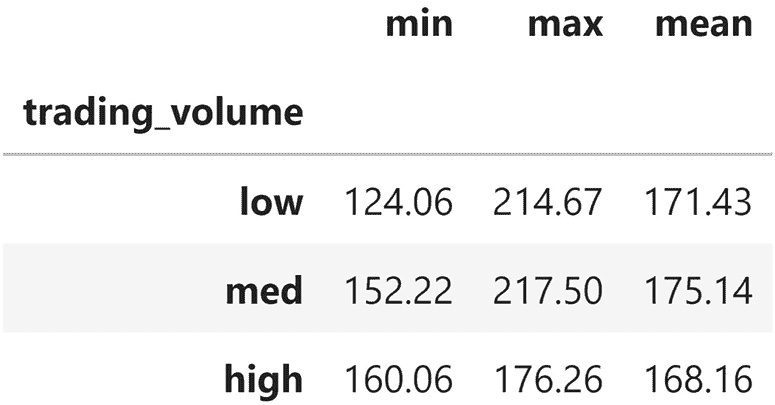
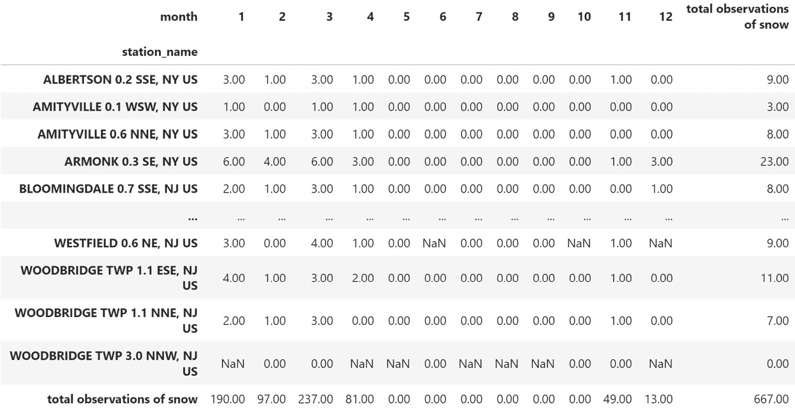
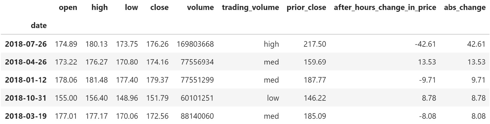

# 第五章：*第四章*：聚合 Pandas DataFrames

在本章中，我们将继续探讨*第三章*中的数据清理内容，*使用 Pandas 进行数据清理*，通过讨论数据的丰富和聚合。包括一些重要技能，如合并数据框、创建新列、执行窗口计算以及按组进行聚合。计算聚合和总结有助于我们从数据中得出结论。

我们还将探讨`pandas`在处理时间序列数据时的额外功能，超出我们在前几章中介绍的时间序列切片内容，包括如何通过聚合对数据进行汇总，以及如何根据一天中的时间选择数据。我们将遇到的大部分数据都是时间序列数据，因此有效地处理时间序列数据至关重要。当然，高效地执行这些操作也很重要，因此我们还将回顾如何编写高效的`pandas`代码。

本章将帮助我们熟练使用`DataFrame`对象进行分析。因此，这些主题相比之前的内容更为高级，可能需要反复阅读几遍，所以请确保跟随带有额外示例的笔记本进行学习。

本章将涵盖以下主题：

+   在`DataFrame`上执行类似数据库的操作

+   使用`DataFrame`操作来丰富数据

+   聚合数据

+   处理时间序列数据

# 本章资料

本章的资料可以在 GitHub 上找到，网址为[`github.com/stefmolin/Hands-On-Data-Analysis-with-Pandas-2nd-edition/tree/master/ch_04`](https://github.com/stefmolin/Hands-On-Data-Analysis-with-Pandas-2nd-edition/tree/master/ch_04)。我们将通过四个笔记本来学习，每个笔记本按使用顺序编号，文本会提示你切换。我们将从`1-querying_and_merging.ipynb`笔记本开始，学习如何查询和合并数据框。然后，我们将进入`2-dataframe_operations.ipynb`笔记本，讨论通过操作如分箱、窗口函数和管道来丰富数据。在这一部分，我们还将使用`window_calc.py` Python 文件，该文件包含一个使用管道进行窗口计算的函数。

提示

`understanding_window_calculations.ipynb`笔记本包含一些交互式可视化，用于帮助理解窗口函数。可能需要一些额外的设置，但笔记本中有说明。

接下来，在`3-aggregations.ipynb`笔记本中，我们将讨论聚合、透视表和交叉表。最后，我们将重点介绍`pandas`在处理时间序列数据时提供的额外功能，这些内容将在`4-time_series.ipynb`笔记本中讨论。请注意，我们不会讲解`0-weather_data_collection.ipynb`笔记本；然而，对于有兴趣的人，它包含了从**国家环境信息中心**（**NCEI**）API 收集数据的代码，API 链接可见于[`www.ncdc.noaa.gov/cdo-web/webservices/v2`](https://www.ncdc.noaa.gov/cdo-web/webservices/v2)。

在本章中，我们将使用多种数据集，所有数据集均可以在`data/`目录中找到：


图 4.1 – 本章使用的数据集

请注意，`exercises/`目录包含了完成本章末尾练习所需的 CSV 文件。更多关于这些数据集的信息可以在`exercises/README.md`文件中找到。

# 在 DataFrame 上执行数据库风格的操作

`DataFrame`对象类似于数据库中的表：每个对象都有一个我们用来引用它的名称，由行组成，并包含特定数据类型的列。因此，`pandas`允许我们在其上执行数据库风格的操作。传统上，数据库支持至少四种操作，称为**CRUD**：**C**reate（创建）、**R**ead（读取）、**U**pdate（更新）和**D**elete（删除）。

一种数据库查询语言——在本节中将讨论的大多数是`pandas`操作，它可能有助于熟悉 SQL 的人理解。许多数据专业人员都对基础的 SQL 有所了解，因此请参考*进一步阅读*部分以获取提供更正式介绍的资源。

在本节中，我们将在`1-querying_and_merging.ipynb`笔记本中进行操作。我们将从导入库并读取纽约市天气数据的 CSV 文件开始：

```py
>>> import pandas as pd
>>> weather = pd.read_csv('data/nyc_weather_2018.csv')
>>> weather.head()
```

这是长格式数据——我们有多个不同的天气观测数据，涵盖了 2018 年纽约市各个站点的每日数据：


图 4.2 – 纽约市天气数据

在 *第二章*，*使用 Pandas DataFrame* 中，我们介绍了如何创建 DataFrame；这相当于 SQL 中的 `"CREATE TABLE ..."` 语句。当我们在 *第二章*，*使用 Pandas DataFrame* 和 *第三章*，*使用 Pandas 进行数据清洗* 中讨论选择和过滤时，我们主要关注的是从 DataFrame 中读取数据，这等同于 SQL 中的 `SELECT`（选择列）和 `WHERE`（按布尔条件过滤）子句。我们在讨论处理缺失数据时执行了更新（SQL 中的 `UPDATE`）和删除（SQL 中的 `DELETE FROM`）操作，这些内容出现在 *第三章*，*使用 Pandas 进行数据清洗* 中。除了这些基本的 CRUD 操作外，本节还介绍了 `pandas` 在实现查询 `DataFrame` 对象方面的概念。

## 查询 DataFrame

Pandas 提供了 `query()` 方法，使我们能够轻松编写复杂的过滤器，而无需使用布尔掩码。其语法类似于 SQL 语句中的 `WHERE` 子句。为了说明这一点，让我们查询所有 `SNOW` 列值大于零且站点 ID 包含 `US1NY` 的站点的天气数据：

```py
>>> snow_data = weather.query(
...     'datatype == "SNOW" and value > 0 '
...     'and station.str.contains("US1NY")'
... ) 
>>> snow_data.head()
```

每一行都是某个日期和站点组合下的雪观测数据。注意，1 月 4 日的数据差异很大——有些站点的降雪量比其他站点多：


图 4.3 – 查询雪的天气数据观测值

这个查询在 SQL 中等价于以下语句。注意，`SELECT *` 会选择表中的所有列（在这里是我们的 DataFrame）：

```py
SELECT * FROM weather
WHERE
  datatype == "SNOW" AND value > 0 AND station LIKE "%US1NY%";
```

在 *第二章*，*使用 Pandas DataFrame* 中，我们学习了如何使用布尔掩码得到相同的结果：

```py
>>> weather[
...     (weather.datatype == 'SNOW') & (weather.value > 0)
...     & weather.station.str.contains('US1NY')
... ].equals(snow_data)
True
```

大部分情况下，我们选择使用哪种方式主要取决于个人偏好；然而，如果我们的 DataFrame 名称很长，我们可能会更喜欢使用 `query()` 方法。在前面的例子中，我们不得不额外输入三次 DataFrame 的名称来使用掩码。

提示

在使用 `query()` 方法时，我们可以使用布尔逻辑操作符（`and`、`or`、`not`）和按位操作符（`&`、`|`、`~`）。

## 合并 DataFrame

当我们在 *第二章*，*使用 Pandas DataFrame* 中讨论通过 `pd.concat()` 函数和 `append()` 方法将 DataFrame 堆叠在一起时，我们实际上在执行 SQL 中的 `UNION ALL` 语句（如果删除重复项，我们就是在执行 `UNION`，正如我们在 *第三章*，*使用 Pandas 进行数据清洗* 中所看到的那样）。合并 DataFrame 涉及如何按行将它们对齐。

在数据库中，合并通常被称为**连接**。连接有四种类型：全连接（外连接）、左连接、右连接和内连接。这些连接类型告诉我们，如何根据连接两边只有一方有的值来影响结果。这是一个更容易通过图示来理解的概念，所以我们来看一些维恩图，并对天气数据进行一些示例连接。在这里，较深的区域表示我们在执行连接后留下的数据：


图 4.4 – 理解连接类型

我们一直在处理来自众多气象站的数据，但除了它们的 ID 外，我们对这些站点一无所知。如果能够了解每个气象站的具体位置，将有助于更好地理解同一天纽约市天气读数之间的差异。当我们查询雪量数据时，我们看到 1 月 4 日的读数存在相当大的变化（见*图 4.3*）。这很可能是由于气象站的位置不同。位于更高海拔或更北方的站点可能会记录更多的降雪。根据它们与纽约市的距离，它们可能正经历某个地方的暴风雪，例如康涅狄格州或北新泽西。

NCEI API 的`stations`端点提供了我们所需的所有气象站信息。这些信息存储在`weather_stations.csv`文件中，并且也存在于 SQLite 数据库中的`stations`表中。我们可以将这些数据读取到一个数据框中：

```py
>>> station_info = pd.read_csv('data/weather_stations.csv')
>>> station_info.head()
```

供参考，纽约市中央公园的坐标是 40.7829° N, 73.9654° W（纬度 40.7829， 经度-73.9654），纽约市的海拔为 10 米。记录纽约市数据的前五个站点不在纽约州。这些位于新泽西州的站点在纽约市的西南，而位于康涅狄格州的站点则位于纽约市的东北：


图 4.5 – 气象站数据集

连接要求我们指定如何匹配数据。`weather`数据框架与`station_info`数据框架唯一共有的数据是气象站 ID。然而，包含这些信息的列名并不相同：在`weather`数据框架中，这一列被称为`station`，而在`station_info`数据框架中，它被称为`id`。在我们进行连接之前，先获取一些关于有多少个不同气象站以及每个数据框架中有多少条记录的信息：

```py
>>> station_info.id.describe()
count                   279
unique                  279
top       GHCND:US1NJBG0029
freq                      1
Name: id, dtype: object
>>> weather.station.describe()
count                 78780
unique                  110
top       GHCND:USW00094789
freq                   4270
Name: station, dtype: object
```

数据框架中唯一站点数量的差异告诉我们，它们并不包含完全相同的站点。根据我们选择的连接类型，我们可能会丢失一些数据。因此，在连接前后查看行数是很重要的。我们可以在`describe()`中查看这一点，但不需要仅仅为了获取行数而运行它。相反，我们可以使用`shape`属性，它会返回一个元组，格式为（行数，列数）。要选择行，我们只需获取索引为`0`的值（列数为`1`）：

```py
>>> station_info.shape[0], weather.shape[0] # 0=rows, 1=cols
(279, 78780)
```

由于我们将频繁检查行数，所以编写一个函数来为任意数量的数据框提供行数更为合适。`*dfs`参数将所有输入收集成一个元组，我们可以通过列表推导式遍历这个元组来获取行数：

```py
>>> def get_row_count(*dfs):
...     return [df.shape[0] for df in dfs]
>>> get_row_count(station_info, weather)
[279, 78780]
```

现在我们知道，天气数据有 78,780 行，站点信息数据有 279 行，我们可以开始查看不同类型的连接。我们将从内连接开始，内连接会产生最少的行数（除非两个数据框在连接列上有完全相同的值，在这种情况下，所有的连接结果都是等价的）。在`weather.station`列和`station_info.id`列上连接，我们将只获得`station_info`中存在的站点的天气数据。

我们将使用`merge()`方法来执行连接（默认是内连接），通过提供左右数据框，并指定要连接的列名。由于站点 ID 列在不同数据框中命名不同，我们必须使用`left_on`和`right_on`来指定列名。左侧数据框是我们调用`merge()`的方法所在的数据框，而右侧数据框是作为参数传递进来的：

```py
>>> inner_join = weather.merge(
...     station_info, left_on='station', right_on='id'
... )
>>> inner_join.sample(5, random_state=0)
```

请注意，我们有五个额外的列，它们被添加到了右侧。这些列来自`station_info`数据框。这个操作也保留了`station`和`id`列，它们是完全相同的：


图 4.6 – 天气数据集和站点数据集的内连接结果

为了去除`station`和`id`列中的重复信息，我们可以在连接前重命名其中一列。因此，我们只需要为`on`参数提供一个值，因为这两列将共享相同的名称：

```py
>>> weather.merge(
...     station_info.rename(dict(id='station'), axis=1), 
...     on='station'
... ).sample(5, random_state=0)
```

由于这两列共享相同的名称，所以在连接时我们只会得到一列数据：


图 4.7 – 匹配连接列的名称以防止结果中的重复数据

提示

我们可以通过将列名列表传递给`on`参数，或者传递给`left_on`和`right_on`参数来进行多列连接。

请记住，我们在`station_info`数据框中有 279 个唯一的站点，但在天气数据中只有 110 个唯一的站点。当我们执行内连接时，所有没有天气观测数据的站点都丢失了。如果我们不想丢失某一侧的数据框的行，可以改为执行左连接或右连接。**左连接**要求我们将希望保留的行所在的数据框（即使它们在另一个数据框中不存在）放在左侧，将另一个数据框放在右侧；**右连接**则是相反的操作：

```py
>>> left_join = station_info.merge(
...     weather, left_on='id', right_on='station', how='left'
... )
>>> right_join = weather.merge(
...     station_info, left_on='station', right_on='id',
...     how='right'
... )
>>> right_join[right_join.datatype.isna()].head() # see nulls
```

在另一个数据框没有数据的地方，我们会得到 null 值。我们可能需要调查为什么这些站点没有关联的天气数据。或者，我们的分析可能涉及确定每个站点的数据可用性，所以获得 null 值不一定是个问题：


图 4.8 – 不使用内连接时可能引入 null 值

因为我们将`station_info`数据框放在左边用于左连接，右边用于右连接，所以这里的结果是等效的。在两种情况下，我们都选择保留`station_info`数据框中所有的站点，并接受天气观测值为 null。为了证明它们是等效的，我们需要将列按相同顺序排列，重置索引，并排序数据：

```py
>>> left_join.sort_index(axis=1)\
...     .sort_values(['date', 'station'], ignore_index=True)\
...     .equals(right_join.sort_index(axis=1).sort_values(
...         ['date', 'station'], ignore_index=True
...     ))
True
```

请注意，在左连接和右连接中我们有额外的行，因为我们保留了所有没有天气观测值的站点：

```py
>>> get_row_count(inner_join, left_join, right_join)
[78780, 78949, 78949]
```

最后一种连接类型是`US1NY`作为站点 ID，因为我们认为测量 NYC 天气的站点必须标注为此。这意味着，内连接会丢失来自康涅狄格州和新泽西州站点的观测数据，而左连接或右连接则可能导致站点信息或天气数据丢失。外连接将保留所有数据。我们还会传入`indicator=True`，为结果数据框添加一列，指示每一行数据来自哪个数据框：

```py
>>> outer_join = weather.merge(
...     station_info[station_info.id.str.contains('US1NY')], 
...     left_on='station', right_on='id',
...     how='outer', indicator=True
... )
# view effect of outer join
>>> pd.concat([
...     outer_join.query(f'_merge == "{kind}"')\
...         .sample(2, random_state=0)
...     for kind in outer_join._merge.unique()
... ]).sort_index()
```

站点 ID 中的`US1NY`导致了站点信息列为 null。底部的两行是来自纽约的站点，但没有提供 NYC 的天气观测数据。这个连接保留了所有数据，通常会引入 null 值，不同于内连接，内连接不会引入 null 值：


图 4.9 – 外连接保留所有数据

前述的连接等同于 SQL 语句，形式如下，其中我们只需将`<JOIN_TYPE>`替换为`(INNER) JOIN`、`LEFT JOIN`、`RIGHT JOIN`或`FULL OUTER JOIN`，以适应所需的连接类型：

```py
SELECT *
FROM left_table
<JOIN_TYPE> right_table
ON left_table.<col> == right_table.<col>;
```

连接数据框使得处理*第三章*中脏数据变得更容易，*Pandas 数据清洗*也因此变得更简单。记住，我们有来自两个不同站点的数据：一个有有效的站点 ID，另一个是`?`。`?`站点是唯一一个记录雪的水当量（`WESF`）的站点。现在我们了解了连接数据框的方式，我们可以通过日期将有效站点 ID 的数据与我们缺失的`?`站点的数据连接起来。首先，我们需要读取 CSV 文件，并将`date`列设为索引。然后，我们将删除重复数据和`SNWD`列（雪深），因为我们发现`SNWD`列在大多数情况下没有提供有用信息（无论是有雪还是没有雪，值都是无限大）：

```py
>>> dirty_data = pd.read_csv(
...     'data/dirty_data.csv', index_col='date'
... ).drop_duplicates().drop(columns='SNWD')
>>> dirty_data.head()
```

我们的起始数据看起来是这样的：


图 4.10 – 上一章中的脏数据

现在，我们需要为每个站点创建一个数据框。为了减少输出，我们将删除一些额外的列：

```py
>>> valid_station = dirty_data.query('station != "?"')\
...     .drop(columns=['WESF', 'station'])
>>> station_with_wesf = dirty_data.query('station == "?"')\
...     .drop(columns=['station', 'TOBS', 'TMIN', 'TMAX'])
```

这次，我们要连接的列（日期）实际上是索引，因此我们将传入`left_index`来表示左侧数据框要使用的列是索引，接着传入`right_index`来表示右侧数据框的相应列也是索引。我们将执行左连接，确保不会丢失任何有效站点的行，并且在可能的情况下，用`?`站点的观测数据补充它们：

```py
>>> valid_station.merge(
...     station_with_wesf, how='left',
...     left_index=True, right_index=True
... ).query('WESF > 0').head()
```

对于数据框中共有的所有列，但未参与连接的列，现在我们有了两个版本。来自左侧数据框的版本在列名后添加了`_x`后缀，来自右侧数据框的版本则在列名后添加了`_y`后缀：


图 4.11 – 来自不同站点的天气数据合并

我们可以通过`suffixes`参数提供自定义的后缀。让我们只为`?`站点使用一个后缀：

```py
>>> valid_station.merge(
...     station_with_wesf, how='left',
...     left_index=True, right_index=True, 
...     suffixes=('', '_?')
... ).query('WESF > 0').head()
```

由于我们为左侧后缀指定了空字符串，来自左侧数据框的列保持其原始名称。然而，右侧后缀`_?`被添加到了来自右侧数据框的列名中：


图 4.12 – 为不参与连接的共享列指定后缀

当我们在索引上进行连接时，一种更简单的方法是使用`join()`方法，而不是`merge()`。它也默认为内连接，但可以通过`how`参数更改此行为，就像`merge()`一样。`join()`方法将始终使用左侧数据框的索引进行连接，但如果传递右侧数据框的列名给`on`参数，它也可以使用右侧数据框中的列。需要注意的是，后缀现在通过`lsuffix`指定左侧数据框的后缀，`rsuffix`指定右侧数据框的后缀。这将产生与之前示例相同的结果（*图 4.12*）：

```py
>>> valid_station.join(
...     station_with_wesf, how='left', rsuffix='_?'
... ).query('WESF > 0').head()
```

需要记住的一件重要事情是，连接操作可能相当消耗资源，因此在执行连接之前，弄清楚行会发生什么通常是有益的。如果我们还不知道想要哪种类型的连接，使用这种方式可以帮助我们得到一些思路。我们可以在计划连接的索引上使用**集合操作**来弄清楚这一点。

请记住，**集合**的数学定义是不同对象的集合。按照定义，索引是一个集合。集合操作通常通过维恩图来解释：


图 4.13 – 集合操作

重要提示

请注意，`set`也是 Python 标准库中可用的一种类型。集合的一个常见用途是去除列表中的重复项。有关 Python 中集合的更多信息，请参见文档：[`docs.python.org/3/library/stdtypes.html#set-types-set-frozenset`](https://docs.python.org/3/library/stdtypes.html#set-types-set-frozenset)。

让我们使用`weather`和`station_info`数据框来说明集合操作。首先，我们必须将索引设置为用于连接操作的列：

```py
>>> weather.set_index('station', inplace=True)
>>> station_info.set_index('id', inplace=True)
```

要查看内连接后将保留的内容，我们可以取索引的**交集**，这将显示我们重叠的站点：

```py
>>> weather.index.intersection(station_info.index)
Index(['GHCND:US1CTFR0039', ..., 'GHCND:USW1NYQN0029'],
      dtype='object', length=110)
```

正如我们在执行内连接时看到的那样，我们只得到了有天气观测的站点信息。但这并没有告诉我们丢失了什么；为此，我们需要找到**集合差异**，即减去两个集合，得到第一个索引中不在第二个索引中的值。通过集合差异，我们可以轻松看到，在执行内连接时，我们并没有丢失天气数据中的任何行，但我们丢失了 169 个没有天气观测的站点：

```py
>>> weather.index.difference(station_info.index)
Index([], dtype='object')
>>> station_info.index.difference(weather.index)
Index(['GHCND:US1CTFR0022', ..., 'GHCND:USW00014786'],
      dtype='object', length=169)
```

请注意，这个输出还告诉我们左连接和右连接的结果如何。为了避免丢失行，我们希望将`station_info`数据框放在连接的同一侧（左连接时在左边，右连接时在右边）。

提示

我们可以使用`symmetric_difference()`方法对参与连接的数据框的索引进行操作，查看从两侧丢失的内容：`index_1.symmetric_difference(index_2)`。结果将是仅在其中一个索引中存在的值。笔记本中有一个示例。

最后，我们可以使用`weather`数据框，它包含了重复出现的站点信息，因为这些站点提供每日测量值，所以在进行并集操作之前，我们会调用`unique()`方法查看我们将保留的站点数量：

```py
>>> weather.index.unique().union(station_info.index)
Index(['GHCND:US1CTFR0022', ..., 'GHCND:USW00094789'],
      dtype='object', length=279)
```

本章最后的*进一步阅读*部分包含了一些关于集合操作的资源，以及`pandas`与 SQL 的对比。目前，让我们继续进行数据丰富化操作。

# 使用 DataFrame 操作来丰富数据

现在我们已经讨论了如何查询和合并`DataFrame`对象，接下来让我们学习如何在这些对象上执行复杂操作，创建和修改列和行。在本节中，我们将在`2-dataframe_operations.ipynb`笔记本中使用天气数据，以及 2018 年 Facebook 股票的交易量和每日开盘价、最高价、最低价和收盘价。让我们导入所需的库并读取数据：

```py
>>> import numpy as np
>>> import pandas as pd
>>> weather = pd.read_csv(
...     'data/nyc_weather_2018.csv', parse_dates=['date']
... )
>>> fb = pd.read_csv(
...     'data/fb_2018.csv', index_col='date', parse_dates=True
... )
```

我们将首先回顾总结整行和整列的操作，然后再学习分箱、在行和列上应用函数，以及窗口计算，这些操作是在一定数量的观测值上对数据进行汇总（例如，移动平均）。

## 算术和统计

Pandas 提供了几种计算统计数据和执行数学运算的方法，包括比较、整除和取模运算。这些方法使我们在定义计算时更加灵活，允许我们指定在哪个轴上执行计算（当对`DataFrame`对象进行操作时）。默认情况下，计算将在列上执行（`axis=1`或`axis='columns'`），列通常包含单一变量的单一数据类型的观测值；但是，我们也可以传入`axis=0`或`axis='index'`来沿着行执行计算。

在本节中，我们将使用这些方法中的一些来创建新列并修改数据，看看如何利用新数据得出一些初步结论。完整的列表可以在[`pandas.pydata.org/pandas-docs/stable/reference/series.html#binary-operator-functions`](https://pandas.pydata.org/pandas-docs/stable/reference/series.html#binary-operator-functions)找到。

首先，让我们创建一列 Facebook 股票交易量的 Z 分数，并利用它找出 Z 分数绝对值大于三的日期。这些值距离均值超过三倍标准差，可能是异常值（具体取决于数据）。回想一下我们在*第一章*《数据分析导论》中讨论的 Z 分数，我们通过减去均值并除以标准差来计算 Z 分数。我们将不使用减法和除法的数学运算符，而是分别使用`sub()`和`div()`方法：

```py
>>> fb.assign(
...     abs_z_score_volume=lambda x: x.volume \
...         .sub(x.volume.mean()).div(x.volume.std()).abs()
... ).query('abs_z_score_volume > 3')
```

2018 年有五天的交易量 Z 分数绝对值大于三。这些日期将会在本章的后续内容中频繁出现，因为它们标志着 Facebook 股价的一些问题点：


图 4.14 – 添加 Z 分数列

另外两个非常有用的方法是`rank()`和`pct_change()`，它们分别用于对列的值进行排名（并将排名存储在新列中）和计算不同时间段之间的百分比变化。通过将这两者结合使用，我们可以看到 Facebook 股票在前一天与五天内交易量变化百分比最大的一天：

```py
>>> fb.assign(
...     volume_pct_change=fb.volume.pct_change(),
...     pct_change_rank=lambda x: \
...         x.volume_pct_change.abs().rank(ascending=False)
... ).nsmallest(5, 'pct_change_rank')
```

交易量变化百分比最大的一天是 2018 年 1 月 12 日，这恰好与 2018 年震撼股市的多个 Facebook 丑闻之一重合（[`www.cnbc.com/2018/11/20/facebooks-scandals-in-2018-effect-on-stock.html`](https://www.cnbc.com/2018/11/20/facebooks-scandals-in-2018-effect-on-stock.html)）。当时 Facebook 公布了新闻源的变化，优先显示来自用户朋友的内容，而非他们所关注的品牌。考虑到 Facebook 的收入大部分来自广告（2017 年约为 89%，*来源*：[`www.investopedia.com/ask/answers/120114/how-does-facebook-fb-make-money.asp`](https://www.investopedia.com/ask/answers/120114/how-does-facebook-fb-make-money.asp)），这引发了恐慌，许多人抛售股票，导致交易量大幅上升，并使股票价格下跌：


图 4.15 – 按交易量变化百分比对交易日进行排名

我们可以使用切片方法查看这一公告前后的变化：

```py
>>> fb['2018-01-11':'2018-01-12']
```

请注意，我们如何能够将前几章所学的所有内容结合起来，从数据中获取有趣的见解。我们能够筛选出一整年的股票数据，并找到一些对 Facebook 股票产生巨大影响的日期（无论是好是坏）：


图 4.16 – 公布新闻源变化前后 Facebook 股票数据

最后，我们可以使用聚合布尔操作来检查数据框。例如，我们可以使用`any()`方法看到 Facebook 股票在 2018 年内从未有过低于 $215 的日最低价：

```py
>>> (fb > 215).any()
open          True
high          True
low          False
close         True
volume        True
dtype: bool
```

如果我们想查看某列中的所有行是否符合标准，可以使用`all()`方法。该方法告诉我们，Facebook 至少有一天的开盘价、最高价、最低价和收盘价小于或等于 $215：

```py
>>> (fb > 215).all()
open      False
high      False
low       False
close     False
volume     True
dtype: bool
```

现在，让我们看看如何使用分箱法来划分数据，而不是使用具体的数值，例如在`any()`和`all()`示例中的 $215。

## 分箱法

有时候，使用类别而不是具体数值进行分析更加方便。一个常见的例子是年龄分析——通常我们不想查看每个年龄的数据，比如 25 岁和 26 岁之间的差异；然而，我们很可能会对 25-34 岁组与 35-44 岁组之间的比较感兴趣。这就是所谓的**分箱**或**离散化**（从连续数据转为离散数据）；我们将数据按照其所属的范围放入不同的箱（或桶）中。通过这样做，我们可以大幅减少数据中的不同数值，并使分析变得更容易。

重要提示

虽然对数据进行分箱可以使某些分析部分变得更简单，但请记住，它会减少该字段中的信息，因为粒度被降低了。

我们可以做的一件有趣的事情是观察哪些日期的交易量较高，并查看这些日期是否有关于 Facebook 的新闻，或者是否有股价的大幅波动。不幸的是，几乎不可能有两天的交易量是相同的；事实上，我们可以确认，在数据中，没有两天的交易量是相同的：

```py
>>> (fb.volume.value_counts() > 1).sum()
0
```

请记住，`fb.volume.value_counts()`会告诉我们每个唯一`volume`值的出现次数。然后，我们可以创建一个布尔掩码，判断该次数是否大于 1，并对其进行求和（`True`会被计算为`1`，`False`则为`0`）。另外，我们也可以使用`any()`代替`sum()`，这样做会告诉我们，如果至少有一个交易量发生了多次，返回`True`，否则返回`False`，而不是告诉我们有多少个唯一的`volume`值出现超过一次。

显然，我们需要为交易量创建一些区间，以便查看高交易量的日期，但我们如何决定哪个区间是合适的呢？一种方法是使用`pd.cut()`函数基于数值进行分箱。首先，我们应该决定要创建多少个区间——三个位数似乎是一个好的分割，因为我们可以将这些区间分别标记为低、中和高。接下来，我们需要确定每个区间的宽度；`pandas`会尽可能简化这个过程，所以如果我们想要等宽的区间，只需要指定我们想要的区间数（否则，我们必须指定每个区间的上限作为列表）：

```py
>>> volume_binned = pd.cut(
...     fb.volume, bins=3, labels=['low', 'med', 'high']
... )
>>> volume_binned.value_counts()
low     240
med       8
high      3
Name: volume, dtype: int64
```

提示

请注意，我们在这里为每个区间提供了标签；如果我们不这样做，系统会根据包含的数值区间为每个区间标记标签，这可能对我们有用，也可能没有用，取决于我们的应用。如果我们想同时标记区间的值并在后续查看区间，可以在调用`pd.cut()`时传入`retbins=True`。然后，我们可以通过返回的元组的第一个元素访问分箱数据，第二个元素则是区间范围。

看起来绝大多数交易日都属于低交易量区间；请记住，这一切都是相对的，因为我们将最小和最大交易量之间的范围进行了均匀分割。现在让我们看一下这三天高交易量的交易数据：

```py
>>> fb[volume_binned == 'high']\
...     .sort_values('volume', ascending=False)
```

即使在高交易量的日子里，我们也能看到 2018 年 7 月 26 日的交易量远高于 3 月的其他两个日期（交易量增加了近 4000 万股）：


图 4.17 – 高交易量区间内的 Facebook 股票数据

实际上，通过搜索引擎查询 *Facebook 股票价格 2018 年 7 月 26 日* 可以发现，Facebook 在 7 月 25 日股市收盘后宣布了其收益和令人失望的用户增长，随后发生了大量盘后抛售。当第二天股市开盘时，股票从 25 日收盘的 $217.50 跌至 26 日开盘时的 $174.89。让我们提取这些数据：

```py
>>> fb['2018-07-25':'2018-07-26']
```

不仅股票价格大幅下跌，而且交易量也飙升，增加了超过 1 亿股。所有这些导致了 Facebook 市值约 1200 亿美元的损失（[`www.marketwatch.com/story/facebook-stock-crushed-after-revenue-user-growth-miss-2018-07-25`](https://www.marketwatch.com/story/facebook-stock-crushed-after-revenue-user-growth-miss-2018-07-25)）：


图 4.18 – 2018 年 Facebook 股票数据，直至最高交易量那天

如果我们查看另外两天被标记为高交易量的交易日，会发现有大量的信息说明原因。这两天都与 Facebook 的丑闻有关。剑桥分析公司（Cambridge Analytica）的政治数据隐私丑闻于 2018 年 3 月 17 日星期六爆发，因此与该信息相关的交易直到 3 月 19 日星期一才开始（[`www.nytimes.com/2018/03/19/technology/facebook-cambridge-analytica-explained.html`](https://www.nytimes.com/2018/03/19/technology/facebook-cambridge-analytica-explained.html)）：

```py
>>> fb['2018-03-16':'2018-03-20']
```

一旦在接下来的几天里披露了关于事件严重性的更多信息，情况变得更糟：


图 4.19 – 剑桥分析丑闻爆发时的 Facebook 股票数据

至于第三个高交易量的交易日（2018 年 3 月 26 日），美国联邦贸易委员会（FTC）启动了对剑桥分析丑闻的调查，因此 Facebook 的困境持续下去（[`www.cnbc.com/2018/03/26/ftc-confirms-facebook-data-breach-investigation.html`](https://www.cnbc.com/2018/03/26/ftc-confirms-facebook-data-breach-investigation.html)）。

如果我们查看中等交易量组内的一些日期，会发现许多都属于我们刚刚讨论的三个交易事件。这迫使我们重新审视最初创建区间的方式。也许等宽区间并不是答案？大多数日期的交易量相对接近；然而，少数几天导致区间宽度较大，这使得每个区间内的日期数量不均衡：


图 4.20 – 可视化等宽区间

如果我们希望每个区间有相同数量的观测值，可以使用 `pd.qcut()` 函数基于均匀间隔的分位数来划分区间。我们可以将交易量划分为四分位数，从而将观测值均匀分配到宽度不同的区间中，得到**q4**区间中的 63 个最高交易量的天数：

```py
>>> volume_qbinned = pd.qcut(
...     fb.volume, q=4, labels=['q1', 'q2', 'q3', 'q4']
... )
>>> volume_qbinned.value_counts()
q1    63
q2    63
q4    63
q3    62
Name: volume, dtype: int64
```

请注意，这些区间现在不再覆盖相同的交易量范围：


](img/Figure_4.21_B16834.jpg)

图 4.21 – 基于四分位数可视化区间

小贴士

在这两个例子中，我们让 `pandas` 计算区间范围；然而，`pd.cut()` 和 `pd.qcut()` 都允许我们将每个区间的上界指定为列表。

## 应用函数

到目前为止，我们对数据进行的大多数操作都是针对单独列进行的。当我们希望在数据框架的所有列上运行相同的代码时，可以使用 `apply()` 方法，使代码更加简洁。请注意，这个操作不会就地执行。

在开始之前，让我们先隔离中央公园站的天气观测数据，并将数据透视：

```py
>>> central_park_weather = weather.query(
...     'station == "GHCND:USW00094728"'
... ).pivot(index='date', columns='datatype', values='value')
```

让我们计算 2018 年 10 月中央公园的`TMIN`（最低气温）、`TMAX`（最高气温）和`PRCP`（降水量）观测值的 Z 分数。重要的是，我们不要试图跨全年的数据计算 Z 分数。纽约市有四个季节，什么是正常的天气取决于我们查看的是哪个季节。通过将计算范围限制在 10 月份，我们可以看看 10 月是否有任何天气与其他天差异很大：

```py
>>> oct_weather_z_scores = central_park_weather\
...     .loc['2018-10', ['TMIN', 'TMAX', 'PRCP']]\
...     .apply(lambda x: x.sub(x.mean()).div(x.std()))
>>> oct_weather_z_scores.describe().T
```

`TMIN` 和 `TMAX` 似乎没有任何与 10 月其余时间显著不同的数值，但 `PRCP` 确实有：


](img/Figure_4.22_B16834.jpg)

图 4.22 – 一次计算多个列的 Z 分数

我们可以使用 `query()` 提取该日期的值：

```py
>>> oct_weather_z_scores.query('PRCP > 3').PRCP
date
2018-10-27    3.936167
Name: PRCP, dtype: float64
```

如果我们查看 10 月份降水量的汇总统计数据，我们可以看到，这一天的降水量远远超过其他日子：

```py
>>> central_park_weather.loc['2018-10', 'PRCP'].describe()
count    31.000000
mean      2.941935
std       7.458542
min       0.000000
25%       0.000000
50%       0.000000
75%       1.150000
max      32.300000
Name: PRCP, dtype: float64
```

`apply()` 方法让我们可以对整个列或行一次性运行矢量化操作。我们可以应用几乎任何我们能想到的函数，只要这些操作在数据的所有列（或行）上都是有效的。例如，我们可以使用之前讨论的 `pd.cut()` 和 `pd.qcut()` 分箱函数，将每一列分成若干区间（前提是我们希望分成相同数量的区间或数值范围）。请注意，如果我们要应用的函数不是矢量化的，还可以使用 `applymap()` 方法。或者，我们可以使用 `np.vectorize()` 将函数矢量化，以便与 `apply()` 一起使用。有关示例，请参考笔记本。

Pandas 确实提供了一些用于迭代数据框的功能，包括`iteritems()`、`itertuples()`和`iterrows()`方法；然而，除非我们完全找不到其他解决方案，否则应避免使用这些方法。Pandas 和 NumPy 是为向量化操作设计的，这些操作要快得多，因为它们是用高效的 C 代码编写的；通过编写一个循环逐个迭代元素，我们让计算变得更加复杂，因为 Python 实现整数和浮点数的方式。举个例子，看看完成一个简单操作（将数字`10`加到每个浮点数值上）所需的时间，使用`iteritems()`时，它会随着行数的增加线性增长，而使用向量化操作时，无论行数多大，所需时间几乎保持不变：


图 4.23 – 向量化与迭代操作

到目前为止，我们使用的所有函数和方法都涉及整个行或列；然而，有时我们更关心进行窗口计算，它们使用数据的一部分。

## 窗口计算

Pandas 使得对窗口或行/列范围进行计算成为可能。在这一部分中，我们将讨论几种构建这些窗口的方法。根据窗口类型的不同，我们可以得到数据的不同视角。

### 滚动窗口

当我们的索引类型为`DatetimeIndex`时，我们可以按日期部分指定窗口（例如，`2H`表示两小时，`3D`表示三天）；否则，我们可以指定期数的整数值。例如，如果我们对滚动 3 天窗口内的降水量感兴趣；用我们目前所学的知识来实现这一点会显得相当繁琐（而且可能效率低下）。幸运的是，我们可以使用`rolling()`方法轻松获取这些信息：

```py
>>> central_park_weather.loc['2018-10'].assign(
...     rolling_PRCP=lambda x: x.PRCP.rolling('3D').sum()
... )[['PRCP', 'rolling_PRCP']].head(7).T
```

在执行滚动 3 天总和后，每个日期将显示该日期和前两天的降水量总和：


图 4.24 – 滚动 3 天总降水量

提示

如果我们想使用日期进行滚动计算，但索引中没有日期，我们可以将日期列的名称传递给`rolling()`调用中的`on`参数。相反，如果我们想使用行号的整数索引，我们可以直接传递一个整数作为窗口；例如，`rolling(3)`表示一个 3 行的窗口。

要更改聚合，只需在`rolling()`的结果上调用不同的方法；例如，`mean()`表示平均值，`max()`表示最大值。滚动计算也可以应用于所有列一次：

```py
>>> central_park_weather.loc['2018-10']\
...     .rolling('3D').mean().head(7).iloc[:,:6]
```

这会给我们提供来自中央公园的所有天气观测数据的 3 天滚动平均值：


图 4.25 – 所有天气观测数据的滚动 3 天平均值

若要对不同的列应用不同的聚合操作，我们可以使用`agg()`方法，它允许我们为每列指定预定义的或自定义的聚合函数。我们只需传入一个字典，将列映射到需要执行的聚合操作。让我们来找出滚动的 3 天最高气温（`TMAX`）、最低气温（`TMIN`）、平均风速（`AWND`）和总降水量（`PRCP`）。然后，我们将其与原始数据进行合并，以便进行比较：

```py
>>> central_park_weather\
...     ['2018-10-01':'2018-10-07'].rolling('3D').agg({
...     'TMAX': 'max', 'TMIN': 'min',
...     'AWND': 'mean', 'PRCP': 'sum'
... }).join( # join with original data for comparison
...     central_park_weather[['TMAX', 'TMIN', 'AWND', 'PRCP']], 
...     lsuffix='_rolling'
... ).sort_index(axis=1) # put rolling calcs next to originals
```

使用`agg()`，我们能够为每列计算不同的滚动聚合操作：


图 4.26 – 对每列使用不同的滚动计算

小提示

我们还可以通过额外的努力使用变宽窗口：我们可以创建`BaseIndexer`的子类，并在`get_window_bounds()`方法中提供确定窗口边界的逻辑（更多信息请参考[`pandas.pydata.org/pandas-docs/stable/user_guide/computation.html#custom-window-rolling`](https://pandas.pydata.org/pandas-docs/stable/user_guide/computation.html#custom-window-rolling)），或者我们可以使用`pandas.api.indexers`模块中的预定义类。我们当前使用的笔记本中包含了使用`VariableOffsetWindowIndexer`类执行 3 个工作日滚动计算的示例。

使用滚动计算时，我们有一个滑动窗口，在这个窗口上我们计算我们的函数；然而，在某些情况下，我们更关心函数在所有数据点上的输出，这时我们使用扩展窗口。

### 扩展窗口

扩展计算将为我们提供聚合函数的累积值。我们使用`expanding()`方法进行扩展窗口计算；像`cumsum()`和`cummax()`这样的函数会使用扩展窗口进行计算。直接使用`expanding()`的优点是额外的灵活性：我们不局限于预定义的聚合方法，并且可以通过`min_periods`参数指定计算开始前的最小周期数（默认为 1）。使用中央公园的天气数据，让我们使用`expanding()`方法来计算当月至今的平均降水量：

```py
>>> central_park_weather.loc['2018-06'].assign(
...     TOTAL_PRCP=lambda x: x.PRCP.cumsum(),
...     AVG_PRCP=lambda x: x.PRCP.expanding().mean()
... ).head(10)[['PRCP', 'TOTAL_PRCP', 'AVG_PRCP']].T
```

请注意，虽然没有计算累积平均值的方法，但我们可以使用`expanding()`方法来计算它。`AVG_PRCP`列中的值是`TOTAL_PRCP`列中的值除以处理的天数：


图 4.27 – 计算当月至今的平均降水量

正如我们在使用`rolling()`时做的那样，我们可以通过`agg()`方法提供列特定的聚合操作。让我们来找出扩展后的最高气温、最低气温、平均风速和总降水量。注意，我们还可以将 NumPy 函数传递给`agg()`：

```py
>>> central_park_weather\
...     ['2018-10-01':'2018-10-07'].expanding().agg({
...     'TMAX': np.max, 'TMIN': np.min, 
...     'AWND': np.mean, 'PRCP': np.sum
... }).join(
...     central_park_weather[['TMAX', 'TMIN', 'AWND', 'PRCP']], 
...     lsuffix='_expanding'
... ).sort_index(axis=1)
```

我们再次将窗口计算与原始数据结合进行比较：


图 4.28 – 对每列执行不同的扩展窗口计算

滚动窗口和扩展窗口在执行计算时，都会平等地权重窗口中的所有观测值，但有时我们希望对较新的值赋予更多的重视。一种选择是对观测值进行指数加权。

### 指数加权移动窗口

Pandas 还提供了`ewm()`方法，用于进行指数加权移动计算。正如在*第一章*《数据分析导论》中讨论的那样，我们可以使用`span`参数指定用于 EWMA 计算的周期数：

```py
>>> central_park_weather.assign(
...     AVG=lambda x: x.TMAX.rolling('30D').mean(),
...     EWMA=lambda x: x.TMAX.ewm(span=30).mean()
... ).loc['2018-09-29':'2018-10-08', ['TMAX', 'EWMA', 'AVG']].T
```

与滚动平均不同，EWMA 对最近的观测值赋予更高的权重，因此 10 月 7 日的温度突变对 EWMA 的影响大于对滚动平均的影响：


图 4.29 – 使用移动平均平滑数据

提示

查看`understanding_window_calculations.ipynb`笔记本，其中包含了一些用于理解窗口函数的交互式可视化。这可能需要一些额外的设置，但相关说明已包含在笔记本中。

## 管道

管道使得将多个操作链接在一起变得更加简便，这些操作期望`pandas`数据结构作为它们的第一个参数。通过使用管道，我们可以构建复杂的工作流，而不需要编写高度嵌套且难以阅读的代码。通常，管道让我们能够将像`f(g(h(data), 20), x=True)`这样的表达式转变为以下形式，使其更易读：

```py
data.pipe(h)\ # first call h(data)
    .pipe(g, 20)\ # call g on the result with positional arg 20
    .pipe(f, x=True) # call f on result with keyword arg x=True
```

假设我们希望通过调用此函数，打印 Facebook 数据框某个子集的维度，并进行一些格式化：

```py
>>> def get_info(df):
...     return '%d rows, %d cols and max closing Z-score: %d' 
...             % (*df.shape, df.close.max()) 
```

然而，在调用函数之前，我们需要计算所有列的 Z 得分。一种方法如下：

```py
>>> get_info(fb.loc['2018-Q1']\
...            .apply(lambda x: (x - x.mean())/x.std()))
```

另外，我们可以在计算完 Z 得分后，将数据框传递给这个函数：

```py
>>> fb.loc['2018-Q1'].apply(lambda x: (x - x.mean())/x.std())\
...     .pipe(get_info)
```

管道还可以使编写可重用代码变得更容易。在本书中的多个代码片段中，我们看到了将一个函数传递给另一个函数的概念，例如我们将 NumPy 函数传递给`apply()`，并在每一列上执行它。我们可以使用管道将该功能扩展到`pandas`数据结构的方法：

```py
>>> fb.pipe(pd.DataFrame.rolling, '20D').mean().equals(
...     fb.rolling('20D').mean()
... ) # the pipe is calling pd.DataFrame.rolling(fb, '20D')
True
```

为了说明这如何为我们带来好处，让我们看一个函数，它将给出我们选择的窗口计算结果。该函数位于`window_calc.py`文件中。我们将导入该函数，并使用`??`从 IPython 查看函数定义：

```py
>>> from window_calc import window_calc
>>> window_calc??
Signature: window_calc(df, func, agg_dict, *args, **kwargs)
Source:   
def window_calc(df, func, agg_dict, *args, **kwargs):
    """
    Run a window calculation of your choice on the data.
    Parameters:
        - df: The `DataFrame` object to run the calculation on.
        - func: The window calculation method that takes `df` 
          as the first argument.
        - agg_dict: Information to pass to `agg()`, could be 
          a dictionary mapping the columns to the aggregation 
          function to use, a string name for the function, 
          or the function itself.
        - args: Positional arguments to pass to `func`.
        - kwargs: Keyword arguments to pass to `func`.

    Returns:
        A new `DataFrame` object.
    """
    return df.pipe(func, *args, **kwargs).agg(agg_dict)
File:      ~/.../ch_04/window_calc.py
Type:      function
```

我们的`window_calc()`函数接受数据框架、需要执行的函数（只要它的第一个参数是数据框架），以及如何聚合结果的信息，还可以传递任何可选的参数，然后返回一个包含窗口计算结果的新数据框架。让我们使用这个函数来计算 Facebook 股票数据的扩展中位数：

```py
>>> window_calc(fb, pd.DataFrame.expanding, np.median).head()
```

注意，`expanding()`方法不需要我们指定任何参数，因此我们只需要传入`pd.DataFrame.expanding`（不带括号），并附带需要进行的聚合操作，作为数据框架上的窗口计算：


图 4.30 – 使用管道进行扩展窗口计算

`window_calc()`函数还接受`*args`和`**kwargs`；这些是可选参数，如果提供，它们会在按名称传递时被 Python 收集到`kwargs`中（例如`span=20`），如果未提供（按位置传递），则会收集到`args`中。然后可以使用`*`表示`args`，`**`表示`kwargs`。我们需要这种行为，以便使用`ewm()`方法计算 Facebook 股票收盘价的指数加权移动平均（EWMA）：

```py
>>> window_calc(fb, pd.DataFrame.ewm, 'mean', span=3).head()
```

在前面的示例中，我们不得不使用`**kwargs`，因为`span`参数并不是`ewm()`接收的第一个参数，我们不想传递它前面的那些参数：


图 4.31 – 使用管道进行指数加权窗口计算

为了计算中央公园的 3 天滚动天气聚合，我们利用了`*args`，因为我们知道窗口是`rolling()`的第一个参数：

```py
>>> window_calc(
...     central_park_weather.loc['2018-10'], 
...     pd.DataFrame.rolling, 
...     {'TMAX': 'max', 'TMIN': 'min',
...      'AWND': 'mean', 'PRCP': 'sum'},
...     '3D'
... ).head()
```

我们能够对每一列进行不同的聚合，因为我们传入了一个字典，而不是一个单一的值：


图 4.32 – 使用管道进行滚动窗口计算

注意，我们是如何能够为窗口计算创建一致的 API，而调用者无需弄清楚在窗口函数之后需要调用哪个聚合方法。这隐藏了一些实现细节，同时使得使用更加方便。我们将在*第七章*中构建的`StockVisualizer`类的某些功能中使用这个函数，*金融分析 - 比特币与股市*。

# 聚合数据

在我们讨论窗口计算和管道操作的上一节中，已经对聚合有了初步了解。在这里，我们将专注于通过聚合来汇总数据帧，这将改变我们数据帧的形状（通常是通过减少行数）。我们还看到，利用 NumPy 的矢量化函数在`pandas`数据结构上进行聚合是多么容易。这正是 NumPy 最擅长的：在数值数组上执行高效的数学计算。

NumPy 与聚合数据框非常搭配，因为它为我们提供了一种通过不同的预写函数汇总数据的简便方法；通常，在进行聚合时，我们只需要使用 NumPy 函数，因为大多数我们自己编写的函数已经由 NumPy 实现。我们已经看到了一些常用的 NumPy 聚合函数，比如`np.sum()`、`np.mean()`、`np.min()`和`np.max()`；然而，我们不仅限于数值操作——我们还可以在字符串上使用诸如`np.unique()`之类的函数。总是检查 NumPy 是否已经提供了所需的函数，再决定是否自己实现。

本节中，我们将在`3-aggregations.ipynb`笔记本中进行操作。让我们导入`pandas`和`numpy`，并读取我们将要处理的数据：

```py
>>> import numpy as np
>>> import pandas as pd
>>> fb = pd.read_csv(
...     'data/fb_2018.csv', index_col='date', parse_dates=True
... ).assign(trading_volume=lambda x: pd.cut(
...     x.volume, bins=3, labels=['low', 'med', 'high'] 
... ))
>>> weather = pd.read_csv(
...     'data/weather_by_station.csv', 
...     index_col='date', parse_dates=True
... )
```

请注意，本节的天气数据已经与部分站点数据合并：


图 4.33 – 本节合并的天气与站点数据

在进行任何计算之前，我们先确保数据不会以科学计数法显示。我们将修改浮动数值的显示格式。我们将应用的格式是`.2f`，该格式会提供一个小数点后两位的浮动数值：

```py
>>> pd.set_option('display.float_format', lambda x: '%.2f' % x)
```

首先，我们将查看如何汇总完整数据集，然后再进行按组汇总，并构建数据透视表和交叉表。

## 汇总数据帧

当我们讨论窗口计算时，我们看到可以在`rolling()`、`expanding()`或`ewm()`的结果上运行`agg()`方法；然而，我们也可以像对待数据框一样直接调用它。唯一的区别是，通过这种方式执行的聚合将在所有数据上进行，这意味着我们将只得到一个包含整体结果的系列。让我们像在窗口计算中一样对 Facebook 的股票数据进行聚合。请注意，对于`trading_volume`列（它包含`pd.cut()`生成的交易量区间），我们不会得到任何结果；这是因为我们没有为该列指定聚合操作：

```py
>>> fb.agg({
...     'open': np.mean, 'high': np.max, 'low': np.min, 
...     'close': np.mean, 'volume': np.sum
... })
open            171.45
high            218.62
low             123.02
close           171.51
volume   6949682394.00
dtype: float64
```

我们可以使用聚合函数轻松找到 2018 年中央公园的总降雪量和降水量。在这种情况下，由于我们将在两者上执行求和操作，我们可以使用`agg('sum')`或直接调用`sum()`：

```py
>>> weather.query('station == "GHCND:USW00094728"')\
...     .pivot(columns='datatype', values='value')\
...     [['SNOW', 'PRCP']].sum()
datatype
SNOW   1007.00
PRCP   1665.30
dtype: float64
```

此外，我们还可以为每个要聚合的列提供多个函数。正如我们之前所见，当每列只有一个聚合函数时，我们会得到一个`Series`对象。若每列有多个聚合函数，`pandas`将返回一个`DataFrame`对象。这个数据框的索引会告诉我们正在为哪个列计算哪种指标：

```py
>>> fb.agg({
...     'open': 'mean', 
...     'high': ['min', 'max'],
...     'low': ['min', 'max'], 
...     'close': 'mean'
... })
```

这将产生一个数据框，其中行表示应用于数据列的聚合函数。请注意，对于我们没有明确要求的任何聚合与列的组合，结果会是空值：


图 4.34 – 每列执行多个聚合

到目前为止，我们已经学会了如何在特定窗口和整个数据框上进行聚合；然而，真正的强大之处在于按组别进行聚合。这使我们能够计算如每月、每个站点的总降水量，以及我们为每个交易量区间创建的股票 OHLC 平均价格等内容。

## 按组聚合

要按组计算聚合，我们必须首先在数据框上调用`groupby()`方法，并提供我们想用来确定不同组的列。让我们来看一下我们用`pd.cut()`创建的每个交易量区间的股票数据点的平均值；记住，这些是三个等宽区间：

```py
>>> fb.groupby('trading_volume').mean()
```

较大交易量的 OHLC 平均价格较小，这是预期之中的，因为高交易量区间的三个日期是抛售日：


图 4.35 – 按组聚合

在运行`groupby()`后，我们还可以选择特定的列进行聚合：

```py
>>> fb.groupby('trading_volume')\
...     ['close'].agg(['min', 'max', 'mean'])
```

这给我们带来了每个交易量区间的收盘价聚合：



图 4.36 – 按组聚合特定列

如果我们需要更精细地控制每个列的聚合方式，我们可以再次使用`agg()`方法，并提供一个将列映射到聚合函数的字典。如同之前一样，我们可以为每一列提供多个函数；不过结果会看起来有些不同：

```py
>>> fb_agg = fb.groupby('trading_volume').agg({
...     'open': 'mean', 'high': ['min', 'max'],
...     'low': ['min', 'max'], 'close': 'mean'
... })
>>> fb_agg
```

现在，我们的列有了层级索引。记住，这意味着，如果我们想选择中等交易量区间的最低低价，我们需要使用`fb_agg.loc['med', 'low']['min']`：


图 4.37 – 按组进行每列的多个聚合

列存储在一个`MultiIndex`对象中：

```py
>>> fb_agg.columns
MultiIndex([( 'open', 'mean'),
            ( 'high',  'min'),
            ( 'high',  'max'),
            (  'low',  'min'),
            (  'low',  'max'),
            ('close', 'mean')],
           )
```

我们可以使用列表推导来移除这个层级，而是将列名转换为`<column>_<agg>`的形式。在每次迭代中，我们将从`MultiIndex`对象中获取一个元组的层级，这些层级可以组合成一个单一的字符串来去除层级：

```py
>>> fb_agg.columns = ['_'.join(col_agg) 
...                   for col_agg in fb_agg.columns]
>>> fb_agg.head()
```

这将把列中的层级替换为单一层级：


图 4.38 – 扁平化层级索引

假设我们想查看所有站点每天的平均降水量。我们需要按日期进行分组，但日期在索引中。在这种情况下，我们有几种选择：

+   重采样，我们将在本章后面的*处理时间序列数据*部分讲解。

+   重置索引，并使用从索引中创建的日期列。

+   将`level=0`传递给`groupby()`，表示分组应在索引的最外层进行。

+   使用`Grouper`对象。

在这里，我们将`level=0`传递给`groupby()`，但请注意，我们也可以传入`level='date'`，因为我们的索引已经命名。这将给我们一个跨所有站点的平均降水量观察结果，这可能比仅查看某个站点的数据更能帮助我们了解天气。由于结果是一个单列的`DataFrame`对象，我们调用`squeeze()`将其转换为`Series`对象：

```py
>>> weather.loc['2018-10'].query('datatype == "PRCP"')\ 
...     .groupby(level=0).mean().head().squeeze()
date
2018-10-01    0.01
2018-10-02    2.23
2018-10-03   19.69
2018-10-04    0.32
2018-10-05    0.96
Name: value, dtype: float64
```

我们还可以一次性按多个类别进行分组。让我们找出每个站点每季度的降水总量。在这里，我们需要使用`Grouper`对象将频率从日度聚合到季度，而不是将`level=0`传递给`groupby()`。由于这将创建多层级索引，我们还将使用`unstack()`在聚合完成后将内层级（季度）放置在列中：

```py
>>> weather.query('datatype == "PRCP"').groupby(
...     ['station_name', pd.Grouper(freq='Q')]
... ).sum().unstack().sample(5, random_state=1)
```

对于这个结果，有许多可能的后续分析。我们可以查看哪些站点接收到的降水最多/最少。我们还可以回到每个站点的位置信息和海拔数据，看看这些是否影响降水。我们还可以查看哪个季度在所有站点中降水最多/最少：


图 4.39 – 按包含日期的列进行聚合

提示

`groupby()`方法返回的`DataFrameGroupBy`对象具有一个`filter()`方法，允许我们过滤组。我们可以使用它来从聚合中排除某些组。只需传入一个返回布尔值的函数，针对每个组的子集（`True`表示包含该组，`False`表示排除该组）。示例可以在笔记本中查看。

让我们看看哪个月份降水最多。首先，我们需要按天进行分组，并对各个站点的降水量求平均。然后，我们可以按月分组并求和。最后，我们将使用`nlargest()`来获取降水量最多的前五个月：

```py
>>> weather.query('datatype == "PRCP"')\
...     .groupby(level=0).mean()\
...     .groupby(pd.Grouper(freq='M')).sum().value.nlargest()
date
2018-11-30   210.59
2018-09-30   193.09
2018-08-31   192.45
2018-07-31   160.98
2018-02-28   158.11
Name: value, dtype: float64
```

也许前面的结果让人感到惊讶。俗话说，*四月的阵雨带来五月的花*；然而，四月并未出现在前五名中（五月也没有）。雪也会计入降水量，但这并不能解释为何夏季的降水量会高于四月。让我们查找在某月降水量占比较大的天数，看看四月是否会出现在那里。

为此，我们需要计算每个气象站的日均降水量，并计算每月的总降水量；这将作为分母。然而，为了将每日的值除以其所在月份的总值，我们需要一个维度相等的`Series`对象。这意味着我们需要使用`transform()`方法，它会对数据执行指定的计算，并始终返回一个与起始对象维度相同的对象。因此，我们可以在`Series`对象上调用它，并始终返回一个`Series`对象，无论聚合函数本身返回的是什么：

```py
>>> weather.query('datatype == "PRCP"')\
...     .rename(dict(value='prcp'), axis=1)\
...     .groupby(level=0).mean()\
...     .groupby(pd.Grouper(freq='M'))\
...     .transform(np.sum)['2018-01-28':'2018-02-03']
```

与其对一月和二月分别得到一个总和，不如注意到我们在一月的条目中得到了相同的值，而在二月的条目中得到了不同的值。注意，二月的值是我们在前面结果中找到的那个值：


](img/Figure_4.40_B16834.jpg)

图 4.40 – 用于计算月度降水百分比的分母

我们可以在数据框中创建这一列，以便轻松计算每天发生的月度降水百分比。然后，我们可以使用`nlargest()`方法提取最大的值：

```py
>>> weather.query('datatype == "PRCP"')\
...     .rename(dict(value='prcp'), axis=1)\
...     .groupby(level=0).mean()\
...     .assign(
...         total_prcp_in_month=lambda x: x.groupby(
...             pd.Grouper(freq='M')).transform(np.sum),
...         pct_monthly_prcp=lambda x: \
...             x.prcp.div(x.total_prcp_in_month)
...     ).nlargest(5, 'pct_monthly_prcp')
```

在按月降水量排序的前四和第五天中，它们加起来占了四月降水量的 50%以上。这两天也是连续的：


](img/Figure_4.41_B16834.jpg)

图 4.41 – 计算每天发生的月度降水百分比

重要提示

`transform()`方法同样适用于`DataFrame`对象，在这种情况下它将返回一个`DataFrame`对象。我们可以使用它一次性轻松地标准化所有列。示例可以在笔记本中找到。

## 数据透视表和交叉表

本节的最后，我们将讨论一些`pandas`函数，这些函数能够将我们的数据聚合为一些常见格式。我们之前讨论的聚合方法会给我们最大的自定义空间；然而，`pandas`还提供了一些函数，可以快速生成数据透视表和交叉表，格式上符合常见标准。

为了生成数据透视表，我们必须指定按什么进行分组，并可选择指定要聚合的列子集和/或聚合方式（默认情况下为平均）。让我们创建一个 Facebook 按交易量分组的平均 OHLC 数据的透视表：

```py
>>> fb.pivot_table(columns='trading_volume')
```

由于我们传入了`columns='trading_volume'`，`trading_volume`列中的不同值被放置在了列中。原始数据框中的列则转到了索引。请注意，列的索引有一个名称（**trading_volume**）：


图 4.42 – 每个交易量区间的列平均值透视表

提示

如果我们将`trading_volume`作为`index`参数传入，得到的将是*图 4.42*的转置，这也是使用`groupby()`时得到的与*图 4.35*完全相同的输出。

使用`pivot()`方法时，我们无法处理多级索引或具有重复值的索引。正因为如此，我们无法将天气数据放入宽格式。`pivot_table()`方法解决了这个问题。为此，我们需要将`date`和`station`信息放入索引中，将`datatype`列的不同值放入列中。值将来自`value`列。对于任何重叠的组合（如果有），我们将使用中位数进行聚合：

```py
>>> weather.reset_index().pivot_table(
...     index=['date', 'station', 'station_name'], 
...     columns='datatype', 
...     values='value', 
...     aggfunc='median'
... ).reset_index().tail()
```

在重置索引后，我们得到了宽格式的数据。最后一步是重命名索引：


图 4.43 – 每种数据类型、站点和日期的中位数值透视表

我们可以使用`pd.crosstab()`函数来创建一个频率表。例如，如果我们想查看每个月 Facebook 股票的低、中、高交易量交易天数，可以使用交叉表。语法非常简单；我们将行和列标签分别传递给`index`和`columns`参数。默认情况下，单元格中的值将是计数：

```py
>>> pd.crosstab(
...     index=fb.trading_volume, columns=fb.index.month,
...     colnames=['month'] # name the columns index
... )
```

这样可以方便地查看 Facebook 股票在不同月份的高交易量：


图 4.44 – 显示每个月、每个交易量区间的交易天数的交叉表

提示

我们可以通过传入`normalize='rows'`/`normalize='columns'`来将输出标准化为行/列总计的百分比。示例见笔记本。

要更改聚合函数，我们可以为`values`提供一个参数，然后指定`aggfunc`。为了说明这一点，让我们计算每个月每个交易量区间的平均收盘价，而不是上一个示例中的计数：

```py
>>> pd.crosstab(
...     index=fb.trading_volume, columns=fb.index.month,
...     colnames=['month'], values=fb.close, aggfunc=np.mean
... )
```

现在我们得到了每个月、每个交易量区间的平均收盘价，数据中没有该组合时则显示为 null 值：


图 4.45 – 使用平均值而非计数的交叉表

我们还可以使用`margins`参数来获取行和列的小计。让我们统计每个月每个站点记录到雪的次数，并包括小计：

```py
>>> snow_data = weather.query('datatype == "SNOW"')
>>> pd.crosstab(
...     index=snow_data.station_name,
...     columns=snow_data.index.month, 
...     colnames=['month'],
...     values=snow_data.value,
...     aggfunc=lambda x: (x > 0).sum(),
...     margins=True, # show row and column subtotals
...     margins_name='total observations of snow' # subtotals
... )
```

在底部的行中，我们展示了每月的总降雪观测数据，而在最右边的列中，我们列出了 2018 年每个站点的总降雪观测数据：



](img/Figure_4.46_B16834.jpg)

图 4.46 – 统计每个月每个站点降雪天数的交叉表

通过查看少数几个站点，我们可以发现，尽管它们都提供了纽约市的天气信息，但它们并不共享天气的每个方面。根据我们选择查看的站点，我们可能会添加或减少与纽约市实际发生的雪量。

# 使用时间序列数据

使用时间序列数据时，我们可以进行一些额外的操作，涵盖从选择和筛选到聚合的各个方面。我们将在 `4-time_series.ipynb` 笔记本中探索一些这种功能。我们先从读取前面章节中的 Facebook 数据开始：

```py
>>> import numpy as np
>>> import pandas as pd
>>> fb = pd.read_csv(
...     'data/fb_2018.csv', index_col='date', parse_dates=True
... ).assign(trading_volume=lambda x: pd.cut( 
...     x.volume, bins=3, labels=['low', 'med', 'high']     
... ))
```

本节将从讨论时间序列数据的选择和筛选开始，接着讲解数据的平移、差分、重采样，最后讲解基于时间的数据合并。请注意，设置日期（或日期时间）列作为索引非常重要，这将使我们能够利用接下来要讲解的额外功能。某些操作无需设置索引也能工作，但为了确保分析过程的顺利进行，建议使用 `DatetimeIndex` 类型的索引。

## 基于时间的选择和筛选

让我们先快速回顾一下日期时间切片和索引的内容。我们可以通过索引轻松提取特定年份的数据：`fb.loc['2018']`。对于我们的股票数据，由于只有 2018 年的数据，因此会返回整个数据框；不过，我们也可以过滤出某个月的数据（例如 `fb.loc['2018-10']）` 或者某个日期范围的数据。请注意，对于范围的选择，使用 `loc[]` 是可选的：

```py
>>> fb['2018-10-11':'2018-10-15']
```

我们仅能获得三天的数据，因为股市在周末休市：


](img/Figure_4.47_B16834.jpg)

图 4.47 – 基于日期范围选择数据

请记住，日期范围也可以使用其他频率提供，例如按月或按季度：

```py
>>> fb.loc['2018-q1'].equals(fb['2018-01':'2018-03'])
True
```

当目标是日期范围的开始或结束时，`pandas` 提供了一些额外的方法来选择指定时间单位内的第一行或最后一行数据。我们可以使用 `first()` 方法和 `1W` 偏移量来选择 2018 年的第一周股价数据：

```py
>>> fb.first('1W')
```

2018 年 1 月 1 日是节假日，股市休市。而且那天是周一，因此这一周只有四天：


](img/Figure_4.48_B16834.jpg)

图 4.48 – 2018 年首周 Facebook 股票数据

我们也可以对最近的日期执行类似的操作。选择数据中的最后一周，只需将 `first()` 方法替换为 `last()` 方法即可：

```py
>>> fb.last('1W')
```

由于 2018 年 12 月 31 日是星期一，最后一周只包含一天：


图 4.49 – 2018 年最后一周的 Facebook 股票数据

在处理每日股票数据时，我们只有股市开放日期的数据。假设我们将数据重新索引，以便为每一天添加一行：

```py
>>> fb_reindexed = fb.reindex(
...     pd.date_range('2018-01-01', '2018-12-31', freq='D')
... )
```

重新索引的数据将在 1 月 1 日和其他市场关闭的日期上显示所有空值。我们可以结合使用 `first()`、`isna()` 和 `all()` 方法来确认这一点。这里，我们还将使用 `squeeze()` 方法将通过调用 `first('1D').isna()` 得到的 1 行 `DataFrame` 对象转换为 `Series` 对象，以便调用 `all()` 时返回单一值：

```py
>>> fb_reindexed.first('1D').isna().squeeze().all()
True
```

我们可以使用 `first_valid_index()` 方法获取数据中第一个非空条目的索引，它将是数据中的第一个交易日。要获取最后一个交易日，我们可以使用 `last_valid_index()` 方法。对于 2018 年第一季度，交易的第一天是 1 月 2 日，最后一天是 3 月 29 日：

```py
>>> fb_reindexed.loc['2018-Q1'].first_valid_index()
Timestamp('2018-01-02 00:00:00', freq='D')
>>> fb_reindexed.loc['2018-Q1'].last_valid_index()
Timestamp('2018-03-29 00:00:00', freq='D')
```

如果我们想知道 2018 年 3 月 31 日 Facebook 的股票价格，最初的想法可能是使用索引来获取它。然而，如果我们尝试通过 `loc[]` (`fb_reindexed.loc['2018-03-31']`) 来获取，我们将得到空值，因为那天股市并未开放。如果我们改用 `asof()` 方法，它将返回在我们要求的日期之前的最近非空数据，在本例中是 3 月 29 日。因此，如果我们想查看 Facebook 在每个月的最后一天的表现，可以使用 `asof()`，而无需先检查当天股市是否开放：

```py
>>> fb_reindexed.asof('2018-03-31')
open                   155.15
high                   161.42
low                    154.14
close                  159.79
volume            59434293.00
trading_volume            low
Name: 2018-03-31 00:00:00, dtype: object
```

在接下来的几个例子中，我们除了日期之外还需要时间信息。到目前为止，我们处理的数据集缺少时间组件，因此我们将切换到来自 Nasdaq.com 的 2019 年 5 月 20 日至 2019 年 5 月 24 日的按分钟划分的 Facebook 股票数据。为了正确解析日期时间，我们需要将一个 lambda 函数作为 `date_parser` 参数传入，因为这些数据并非标准格式（例如，2019 年 5 月 20 日 9:30 AM 表示为 `2019-05-20 09-30`）；该 lambda 函数将指定如何将 `date` 字段中的数据转换为日期时间：

```py
>>> stock_data_per_minute = pd.read_csv(
...     'data/fb_week_of_may_20_per_minute.csv', 
...     index_col='date', parse_dates=True, 
...     date_parser=lambda x: \
...         pd.to_datetime(x, format='%Y-%m-%d %H-%M')
... )
>>> stock_data_per_minute.head()
```

我们有每分钟的 OHLC 数据，以及每分钟的成交量数据：


图 4.50 – Facebook 股票数据按分钟划分

重要说明

为了正确解析非标准格式的日期时间，我们需要指定其格式。有关可用代码的参考，请查阅 Python 文档：[`docs.python.org/3/library/datetime.html#strftime-strptime-behavior`](https://docs.python.org/3/library/datetime.html#strftime-strptime-behavior)。

我们可以使用`first()`和`last()`结合`agg()`将这些数据转换为每日的粒度。为了获取真实的开盘价，我们需要每天获取第一个观察值；相反，对于真实的收盘价，我们需要每天获取最后一个观察值。高点和低点将分别是它们每天各自列的最大和最小值。成交量将是每日的总和：

```py
>>> stock_data_per_minute.groupby(pd.Grouper(freq='1D')).agg({
...     'open': 'first', 
...     'high': 'max', 
...     'low': 'min', 
...     'close': 'last', 
...     'volume': 'sum'
... })
```

这将数据升级到每日频率：


Figure 4.51 – 将数据从分钟级别升级到日级别

接下来我们将讨论的两种方法帮助我们基于日期时间的时间部分选择数据。`at_time()`方法允许我们隔离日期时间的时间部分是我们指定的时间的行。通过运行`at_time('9:30')`，我们可以抓取所有开盘价格（股票市场在上午 9:30 开盘）：

```py
>>> stock_data_per_minute.at_time('9:30')
```

这告诉我们每天开盘铃响时的股票数据是怎样的：


Figure 4.52 – 每天市场开盘时的股票数据

我们可以使用`between_time()`方法来抓取时间部分位于两个时间之间（默认包含端点）的所有行。如果我们想要逐日查看某个时间范围内的数据，这种方法非常有用。让我们抓取每天交易的最后两分钟内的所有行（15:59 - 16:00）：

```py
>>> stock_data_per_minute.between_time('15:59', '16:00')
```

看起来最后一分钟（16:00）每天的交易量显著高于前一分钟（15:59）。也许人们会在闭市前赶紧进行交易：


Figure 4.53 – 每天交易最后两分钟的股票数据

我们可能会想知道这是否也发生在前两分钟内。人们是否在前一天晚上进行交易，然后在市场开盘时执行？更改前面的代码以回答这个问题是微不足道的。相反，让我们看看在讨论的这周中，平均而言，更多的股票是在开盘后的前 30 分钟内交易还是在最后 30 分钟内交易。我们可以结合`between_time()`和`groupby()`来回答这个问题。此外，我们需要使用`filter()`来排除聚合中的组。被排除的组是不在我们想要的时间范围内的时间：

```py
>>> shares_traded_in_first_30_min = stock_data_per_minute\
...     .between_time('9:30', '10:00')\
...     .groupby(pd.Grouper(freq='1D'))\
...     .filter(lambda x: (x.volume > 0).all())\
...     .volume.mean()
>>> shares_traded_in_last_30_min = stock_data_per_minute\
...     .between_time('15:30', '16:00')\
...     .groupby(pd.Grouper(freq='1D'))\
...     .filter(lambda x: (x.volume > 0).all())\
...     .volume.mean()
```

在讨论的这周中，开盘时间周围的平均交易量比收盘时间多了 18,593 笔：

```py
>>> shares_traded_in_first_30_min \
... - shares_traded_in_last_30_min
18592.967741935485
```

小贴士

我们可以对`DatetimeIndex`对象使用`normalize()`方法或在首次访问`Series`对象的`dt`属性后使用它，以将所有日期时间规范化为午夜。当时间对我们的数据没有添加价值时，这非常有用。笔记本中有此类示例。

通过股票数据，我们可以获得每分钟或每天的价格快照（具体取决于数据粒度），但我们可能更关心将时间段之间的变化作为时间序列显示，而不是聚合数据。为此，我们需要学习如何创建滞后数据。

## 滞后数据的偏移

我们可以使用`shift()`方法创建滞后数据。默认情况下，偏移量为一个周期，但它可以是任何整数（正数或负数）。我们来使用`shift()`方法创建一个新列，表示每日 Facebook 股票的前一日收盘价。通过这个新列，我们可以计算由于盘后交易导致的价格变化（即一天市场收盘后至下一天市场开盘前的交易）：

```py
>>> fb.assign(
...     prior_close=lambda x: x.close.shift(),
...     after_hours_change_in_price=lambda x: \
...         x.open - x.prior_close,
...     abs_change=lambda x: \
...         x.after_hours_change_in_price.abs()
... ).nlargest(5, 'abs_change')
```

这给我们展示了受盘后交易影响最大的日期：



图 4.54 – 使用滞后数据计算盘后股价变化

提示

若要从索引中的日期时间添加/减去时间，可以考虑使用`Timedelta`对象。笔记本中有相关示例。

在之前的例子中，我们使用了偏移后的数据来计算跨列的变化。然而，如果我们感兴趣的不是盘后交易，而是 Facebook 股价的每日变化，我们将计算收盘价与偏移后收盘价之间的差异。Pandas 使这变得比这更简单，我们稍后会看到。

## 差分数据

我们已经讨论过如何使用`shift()`方法创建滞后数据。然而，通常我们关心的是值从一个时间周期到下一个时间周期的变化。为此，`pandas`提供了`diff()`方法。默认情况下，它会计算从时间周期*t-1*到时间周期*t*的变化：


请注意，这相当于从原始数据中减去`shift()`的结果：

```py
>>> (fb.drop(columns='trading_volume') 
...  - fb.drop(columns='trading_volume').shift()
... ).equals(fb.drop(columns='trading_volume').diff())
True
```

我们可以使用`diff()`轻松计算 Facebook 股票数据的逐日变化：

```py
>>> fb.drop(columns='trading_volume').diff().head()
```

对于年的前几个交易日，我们可以看到股价上涨，而成交量每天减少：


图 4.55 – 计算逐日变化

提示

要指定用于计算差异的周期数，只需向`diff()`传递一个整数。请注意，这个数字可以是负数。笔记本中有相关示例。

## 重采样

有时，数据的粒度不适合我们的分析。假设我们有 2018 年全年的每分钟数据，粒度和数据的性质可能使得绘图无用。因此，我们需要将数据汇总到一个较低粒度的频率：


图 4.56 – 重采样可以用于汇总细粒度数据

假设我们拥有*图 4.50*中的一整年的数据（Facebook 股票按分钟显示）。这种粒度可能超出了我们的需求，在这种情况下，我们可以使用 `resample()` 方法将时间序列数据聚合为不同的粒度。使用 `resample()` 时，我们只需要告诉它如何汇总数据，并可选地调用聚合方法。例如，我们可以将这些按分钟的股票数据重采样为每日频率，并指定如何聚合每一列：

```py
>>> stock_data_per_minute.resample('1D').agg({
...     'open': 'first', 
...     'high': 'max', 
...     'low': 'min', 
...     'close': 'last', 
...     'volume': 'sum'
... })
```

这与我们在*基于时间的选择和过滤*部分得到的结果相当（*图 4.51*）：


](img/Figure_4.57_B16834.jpg)

图 4.57 – 将每分钟的数据重采样为日数据

我们可以重采样为 `pandas` 支持的任何频率（更多信息可以参考文档：[`pandas.pydata.org/pandas-docs/stable/user_guide/timeseries.html`](http://pandas.pydata.org/pandas-docs/stable/user_guide/timeseries.html)）。让我们将每日的 Facebook 股票数据重采样为季度平均值：

```py
>>> fb.resample('Q').mean()
```

这给出了股票的季度平均表现。2018 年第四季度显然很糟糕：


](img/Figure_4.58_B16834.jpg)

图 4.58 – 重采样为季度平均值

为了进一步分析，我们可以使用 `apply()` 方法查看季度开始和结束时的差异。我们还需要在*基于时间的选择和过滤*部分使用 `first()` 和 `last()` 方法：

```py
>>> fb.drop(columns='trading_volume').resample('Q').apply(
...     lambda x: x.last('1D').values - x.first('1D').values
... )
```

Facebook 的股票价格在除第二季度外的所有季度都出现了下降：


](img/Figure_4.57_B16834.jpg)

图 4.59 – 总结 Facebook 2018 年每个季度的股票表现

请考虑 `melted_stock_data.csv` 中按分钟融化的股票数据：

```py
>>> melted_stock_data = pd.read_csv(
...     'data/melted_stock_data.csv', 
...     index_col='date', parse_dates=True
... )
>>> melted_stock_data.head()
```

OHLC 格式使得分析股票数据变得更加容易，但如果数据只有一列，则会变得更加复杂：


](img/Figure_4.60_B16834.jpg)

图 4.60 – 按分钟显示股票价格

我们在调用 `resample()` 后得到的 `Resampler` 对象有一个 `ohlc()` 方法，我们可以使用它来获取我们习惯看到的 OHLC 数据：

```py
>>> melted_stock_data.resample('1D').ohlc()['price']
```

由于原始数据中的列叫做 `price`，我们在调用 `ohlc()` 后选择它，这样我们就能对数据进行透视处理。否则，我们会在列中得到一个层次化索引：


](img/Figure_4.61_B16834.jpg)

图 4.61 – 将按分钟的股票价格重采样以形成每日 OHLC 数据

在之前的示例中，我们使用 `asfreq()` 来避免对结果进行聚合：

```py
>>> fb.resample('6H').asfreq().head()
```

请注意，当我们在比已有数据更细粒度的情况下进行重采样时，它将引入 `NaN` 值：


](img/Figure_4.58_B16834.jpg)

图 4.62 – 向上采样增加了数据的粒度，并会引入空值

以下是处理`NaN`值的一些方法。为了简洁起见，示例在笔记本中：

+   在`resample()`之后使用`pad()`进行前向填充。

+   在`resample()`之后调用`fillna()`，正如我们在*第三章*《使用 Pandas 进行数据清洗》中看到的，当我们处理缺失值时。

+   使用`asfreq()`后接`assign()`来单独处理每一列。

到目前为止，我们一直在处理存储在单个`DataFrame`对象中的时间序列数据，但我们可能希望合并多个时间序列。虽然在*合并 DataFrame*部分讨论的技术适用于时间序列，`pandas`提供了更多的功能来合并时间序列，这样我们就可以基于接近的匹配进行合并，而不需要完全匹配。接下来我们将讨论这些内容。

## 合并时间序列

时间序列通常精确到秒，甚至更为细致，这意味着如果条目没有相同的日期时间，合并可能会非常困难。Pandas 通过两个附加的合并函数解决了这个问题。当我们想要配对接近时间的观测值时，可以使用`pd.merge_asof()`，根据附近的键进行匹配，而不是像我们在连接中那样使用相等的键。另一方面，如果我们想匹配相等的键并交错没有匹配项的键，可以使用`pd.merge_ordered()`。

为了说明这些方法的工作原理，我们将使用`stocks.db` SQLite 数据库中的`fb_prices`和`aapl_prices`表。这些表分别包含 Facebook 和 Apple 股票的价格，以及记录价格时的时间戳。请注意，Apple 数据是在 2020 年 8 月股票拆分之前收集的([`www.marketwatch.com/story/3-things-to-know-about-apples-stock-split-2020-08-28`](https://www.marketwatch.com/story/3-things-to-know-about-apples-stock-split-2020-08-28))。让我们从数据库中读取这些表：

```py
>>> import sqlite3
>>> with sqlite3.connect('data/stocks.db') as connection:
...     fb_prices = pd.read_sql(
...         'SELECT * FROM fb_prices', connection, 
...         index_col='date', parse_dates=['date']
...     )
...     aapl_prices = pd.read_sql(
...         'SELECT * FROM aapl_prices', connection, 
...         index_col='date', parse_dates=['date']
...     )
```

Facebook 的数据是按分钟粒度的；然而，Apple 的数据是按（虚构的）秒粒度的：

```py
>>> fb_prices.index.second.unique()
Int64Index([0], dtype='int64', name='date')
>>> aapl_prices.index.second.unique()
Int64Index([ 0, 52, ..., 37, 28], dtype='int64', name='date')
```

如果我们使用`merge()`或`join()`，只有当 Apple 的价格位于整分钟时，我们才会得到两者的匹配值。相反，为了对齐这些数据，我们可以执行*as of*合并。为了处理这种不匹配情况，我们将指定合并时使用最近的分钟(`direction='nearest'`)，并要求匹配只能发生在相差不超过 30 秒的时间之间(`tolerance`)。这将把 Apple 数据与最接近的分钟对齐，因此`9:31:52`将与`9:32`匹配，`9:37:07`将与`9:37`匹配。由于时间位于索引中，我们像在`merge()`中一样，传入`left_index`和`right_index`：

```py
>>> pd.merge_asof(
...     fb_prices, aapl_prices, 
...     left_index=True, right_index=True,
...     # merge with nearest minute
...     direction='nearest',
...     tolerance=pd.Timedelta(30, unit='s')
... ).head()
```

这类似于左连接；然而，在匹配键时我们更加宽松。需要注意的是，如果多个苹果数据条目匹配相同的分钟，这个函数只会保留最接近的一个。我们在`9:31`处得到一个空值，因为苹果在`9:31`的条目是`9:31:52`，当使用`nearest`时它会被放置到`9:32`：


图 4.63 – 在 30 秒容忍度下合并时间序列数据

如果我们不希望使用左连接的行为，可以改用`pd.merge_ordered()`函数。这将允许我们指定连接类型，默认情况下为`'outer'`。然而，我们需要重置索引才能在日期时间上进行连接：

```py
>>> pd.merge_ordered(
...     fb_prices.reset_index(), aapl_prices.reset_index()
... ).set_index('date').head()
```

这种策略会在时间不完全匹配时给我们空值，但至少会对它们进行排序：


图 4.64 – 对时间序列数据执行严格的合并并对其进行排序

提示

我们可以将`fill_method='ffill'`传递给`pd.merge_ordered()`，以在一个值后填充第一个`NaN`，但它不会继续传播；另外，我们可以链式调用`fillna()`。笔记本中有一个示例。

`pd.merge_ordered()`函数还使得按组合并成为可能，因此请务必查看文档以获取更多信息。

# 概述

在本章中，我们讨论了如何连接数据框，如何使用集合操作确定每种连接类型丢失的数据，以及如何像查询数据库一样查询数据框。接着我们讲解了一些更复杂的列变换，例如分箱和排名，以及如何使用`apply()`方法高效地进行这些操作。我们还学习了在编写高效`pandas`代码时矢量化操作的重要性。随后，我们探索了窗口计算和使用管道来使代码更简洁。关于窗口计算的讨论为聚合整个数据框和按组聚合奠定了基础。我们还讨论了如何生成透视表和交叉表。最后，我们介绍了`pandas`中针对时间序列的特定功能，涵盖了从选择、聚合到合并等各个方面。

在下一章中，我们将讨论可视化，`pandas`通过提供一个封装器来实现这一功能，封装了`matplotlib`。数据清洗将在准备数据以进行可视化时发挥关键作用，因此在继续之前，一定要完成下一节提供的练习。

# 练习

使用`exercises/`文件夹中的 CSV 文件以及我们到目前为止在本书中学到的内容，完成以下练习：

1.  使用`earthquakes.csv`文件，选择所有日本的地震，并使用`mb`震级类型筛选震级为 4.9 或更大的地震。

1.  创建每个地震震级完整数字的箱子（例如，第一个箱子是(0, 1]，第二个箱子是(1, 2]，以此类推），使用`ml`震级类型并计算每个箱子中的数量。

1.  使用`faang.csv`文件，按股票代码分组并重采样为月频率。进行以下聚合：

    a) 开盘价的均值

    b) 最高价的最大值

    c) 最低价的最小值

    d) 收盘价的均值

    e) 成交量总和

1.  构建一个交叉表，展示地震数据中`tsunami`列和`magType`列之间的关系。不要显示频次计数，而是显示每个组合观察到的最大震级。将震级类型放在列中。

1.  计算 FAANG 数据中每个股票的 OHLC 数据的滚动 60 天聚合值。使用与练习*3*相同的聚合方法。

1.  创建一个 FAANG 数据的透视表，比较股票。将股票代码放入行中，显示 OHLC 和成交量数据的平均值。

1.  使用`apply()`方法计算 2018 年第四季度亚马逊数据（`ticker`为 AMZN）每个数值列的 Z 分数。

1.  添加事件描述：

    a) 创建一个数据框，包含以下三列：`ticker`，`date`和`event`。这些列应包含以下值：

    i) `ticker`: `'FB'`

    ii) `date`: `['2018-07-25', '2018-03-19', '2018-03-20']`

    iii) `event`: `['公布财报后用户增长令人失望。', '剑桥分析丑闻', 'FTC 调查']`

    b) 将索引设置为`['date', 'ticker']`。

    c) 使用外连接将此数据与 FAANG 数据合并。

1.  对 FAANG 数据使用`transform()`方法，将所有的值表示为数据中第一个日期的值。为此，将每个股票的所有值除以该股票在数据中第一个日期的值。这被称为`transform()`可以接受一个函数名称。

1.  `covid19_cases.csv` 文件。

    ii) 通过解析`dateRep`列为 datetime 格式来创建一个`date`列。

    iii) 将`date`列设置为索引。

    iv) 使用`replace()`方法将所有`United_States_of_America`和`United_Kingdom`替换为`USA`和`UK`。

    v) 排序索引。

    b) 对于病例最多的五个国家（累计），找出病例数最多的那一天。

    c) 找出数据中最后一周五个疫情病例最多的国家的 COVID-19 病例 7 天平均变化。

    d) 找出中国以外的每个国家首次出现病例的日期。

    e) 按累计病例数使用百分位数对国家进行排名。

# 进一步阅读

查看以下资源，了解本章中涉及的主题：

+   *SQL 入门：查询和管理数据*：[`www.khanacademy.org/computing/computer-programming/sql`](https://www.khanacademy.org/computing/computer-programming/sql)

+   *(Pandas)与 SQL 的比较*：[`pandas.pydata.org/pandas-docs/stable/getting_started/comparison/comparison_with_sql.html`](https://pandas.pydata.org/pandas-docs/stable/getting_started/comparison/comparison_with_sql.html)

+   *集合运算*：[`www.probabilitycourse.com/chapter1/1_2_2_set_operations.php`](https://www.probabilitycourse.com/chapter1/1_2_2_set_operations.php)

+   **Python 中的**args 和**kwargs 解释*：[`pythontips.com/2013/08/04/args-and-kwargs-in-python-explained/`](https://yasoob.me/2013/08/04/args-and-kwargs-in-python-explained/)
