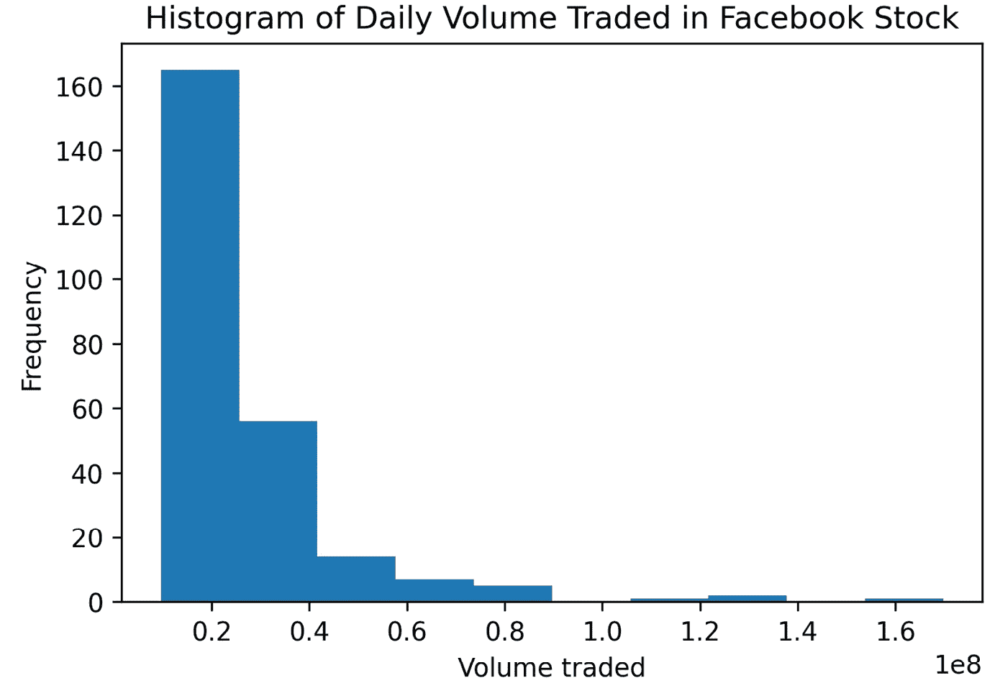
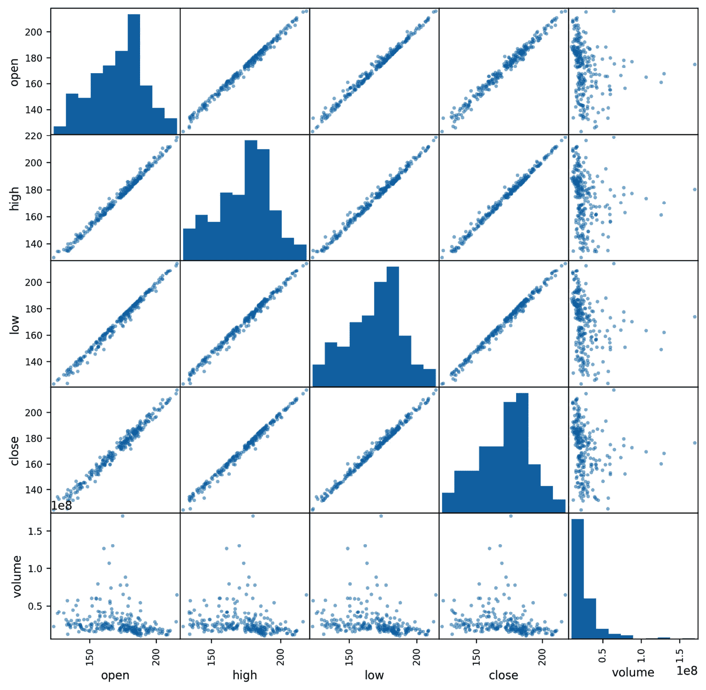

# 第六章：*第五章*：使用 Pandas 和 Matplotlib 可视化数据

到目前为止，我们一直在处理严格的表格格式数据。然而，人类大脑擅长识别视觉模式；因此，我们的自然下一步是学习如何将数据可视化。可视化使得我们更容易发现数据中的异常，并向他人解释我们的发现。然而，我们不应将数据可视化仅仅保留给向他人呈现结论的人，因为在我们的探索性数据分析中，数据可视化对于帮助我们迅速且全面地理解数据至关重要。

有许多种类的可视化远超我们之前可能见过的内容。在本章中，我们将介绍最常见的图表类型，如折线图、直方图、散点图和条形图，以及基于这些类型的一些其他图表。我们不会讨论饼图——它们通常很难正确阅读，而且有更好的方式传达我们的观点。

Python 有许多用于创建可视化的库，但主要用于数据分析（以及其他目的）的是 `matplotlib`。`matplotlib` 库刚开始学习时可能有点棘手，但幸运的是，`pandas` 为一些 `matplotlib` 功能提供了自己的封装，使我们能够创建许多不同类型的可视化，而不需要写一行 `matplotlib` 代码（或者至少，写得非常少）。对于那些不在 `pandas` 或 `matplotlib` 内置的更复杂图表类型，我们有 `seaborn` 库，我们将在下一章讨论。有了这三个工具，我们应该能够创建大多数（如果不是全部）我们所需要的可视化。动画和交互式图表超出了本书的范围，但你可以在*进一步阅读*部分找到更多信息。

在本章中，我们将覆盖以下主题：

+   matplotlib 简介

+   使用 pandas 绘图

+   pandas.plotting 模块

# 本章材料

本章的材料可以在 GitHub 上找到，链接：[`github.com/stefmolin/Hands-On-Data-Analysis-with-Pandas-2nd-edition/tree/master/ch_05`](https://github.com/stefmolin/Hands-On-Data-Analysis-with-Pandas-2nd-edition/tree/master/ch_05)。我们将使用三个数据集，这些数据集都可以在 `data/` 目录中找到。在 `fb_stock_prices_2018.csv` 文件中，我们有 Facebook 股票从 2018 年 1 月到 12 月的每日开盘价、最高价、最低价和收盘价，以及交易量。这些数据是通过 `stock_analysis` 包获取的，我们将在*第七章*，*金融分析 - 比特币与股票市场*中构建该包。股市在周末休市，因此我们只有交易日的数据。

`earthquakes.csv`文件包含从`mag`列收集的地震数据，包括震级（`mag`列）、震中测量的尺度（`magType`列）、发生的时间（`time`列）和地点（`place`列），以及标明地震发生所在州或国家的`parsed_place`列（我们在*第二章*，《使用 Pandas DataFrame》中添加了此列）。其他不必要的列已被删除。

在`covid19_cases.csv`文件中，我们有来自**欧洲疾病预防控制中心**（**ECDC**）提供的*全球各国每日新增 COVID-19 确诊病例数*数据集的导出文件，可以通过[`www.ecdc.europa.eu/en/publications-data/download-todays-data-geographic-distribution-covid-19-cases-worldwide`](https://www.ecdc.europa.eu/en/publications-data/download-todays-data-geographic-distribution-covid-19-cases-worldwide)获取。对于脚本化或自动化收集此数据，ECDC 通过[`opendata.ecdc.europa.eu/covid19/casedistribution/csv`](https://opendata.ecdc.europa.eu/covid19/casedistribution/csv)提供当天的 CSV 文件。我们将使用的快照数据收集日期为 2020 年 9 月 19 日，包含了 2019 年 12 月 31 日至 2020 年 9 月 18 日各国新增 COVID-19 病例数，并包含 2020 年 9 月 19 日的部分数据。在本章中，我们将查看 2020 年 1 月 18 日至 2020 年 9 月 18 日这 8 个月的数据。

在本章中，我们将通过三个笔记本进行学习。这些笔记本按使用顺序编号——每个笔记本对应本章的一个主要部分。我们将在`1-introducing_matplotlib.ipynb`笔记本中介绍 Python 绘图，首先介绍`matplotlib`。然后，我们将在`2-plotting_with_pandas.ipynb`笔记本中学习如何使用`pandas`创建可视化。最后，我们将在`3-pandas_plotting_module.ipynb`笔记本中探索`pandas`提供的一些额外绘图选项。在需要切换笔记本时，系统会提示您。

# matplotlib 介绍

`pandas`和`seaborn`的绘图功能由`matplotlib`提供支持：这两个包为`matplotlib`中的底层功能提供了封装。因此，我们只需编写最少的代码，就能拥有丰富的可视化选项；然而，这也有代价：我们在创作时的灵活性有所降低。

我们可能会发现`pandas`或`seaborn`的实现无法完全满足我们的需求，实际上，使用它们创建图形后可能无法覆盖某些特定设置，这意味着我们将不得不使用`matplotlib`来完成一些工作。此外，许多对最终可视化效果的微调将通过`matplotlib`命令来处理，我们将在下一章中讨论这些内容。因此，了解`matplotlib`的工作原理将对我们大有裨益。

## 基础知识

`matplotlib`包相当大，因为它涵盖了很多功能。幸运的是，对于我们大多数的绘图任务，我们只需要`pyplot`模块，它提供了类似 MATLAB 的绘图框架。偶尔，我们会需要导入其他模块来处理其他任务，比如动画、改变样式或修改默认参数；我们将在下一章看到一些示例。

我们将只导入`pyplot`模块，而不是导入整个`matplotlib`包，使用点（`.`）符号；这样可以减少输入量，并且避免在内存中占用不需要的代码空间。请注意，`pyplot`通常会被别名为`plt`：

```py
import matplotlib.pyplot as plt
```

在我们查看第一个图形之前，先来了解如何实际查看它们。Matplotlib 将通过绘图命令来创建我们的可视化；然而，直到我们请求查看它之前，我们是看不到可视化的。这样做是为了让我们在准备好最终版本之前，能够不断通过额外的代码调整可视化效果。除非我们保存对图形的引用，否则一旦它被显示出来，我们将需要重新创建它以进行更改。这是因为对上一个图形的引用已经被销毁，以释放内存资源。

Matplotlib 使用`plt.show()`函数来显示可视化。每创建一次可视化都必须调用它。当使用 Python Shell 时，它还会阻止其他代码的执行，直到窗口被关闭，因为它是一个阻塞函数。在 Jupyter Notebooks 中，我们只需使用一次`%matplotlib inline`，我们的可视化将在执行包含可视化代码的单元时自动显示。魔法命令（或简称*magics*）在 Jupyter Notebook 单元内作为常规代码执行。如果到目前为止你还不热衷于使用 Jupyter Notebooks，并希望现在设置它，你可以参考*第一章*，*数据分析入门*。

重要提示

`%matplotlib inline` 魔法命令将图表的静态图像嵌入到我们的笔记本中。另一个常见的选项是 `%matplotlib notebook` 魔法命令。它通过允许进行缩放和调整大小等操作，为图表提供了一定程度的交互性，但请注意，如果你使用 JupyterLab，还需要进行一些额外的设置，而且可能会出现一些困惑的错误，具体取决于笔记本中运行的代码。欲了解更多信息，请查阅此文章：`medium.com/@1522933668924/using-matplotlib-in-jupyter-notebooks-comparing-methods-and-some-tips-python-c38e85b40ba1`。

让我们在 `1-introducing_matplotlib.ipynb` 笔记本中创建我们的第一个图表，使用本章仓库中的 `fb_stock_prices_2018.csv` 文件中的 Facebook 股票价格数据。首先，我们需要导入 `pyplot` 和 `pandas`（在这个示例中，我们将使用 `plt.show()`，因此不需要在这里运行魔法命令）：

```py
>>> import matplotlib.pyplot as plt
>>> import pandas as pd
```

接下来，我们读取 CSV 文件，并将 `date` 列指定为索引，因为我们已经知道数据的格式，来自前面的章节：

```py
>>> fb = pd.read_csv(
...     'data/fb_stock_prices_2018.csv', 
...     index_col='date',
...     parse_dates=True
... )
```

为了理解 Facebook 股票随时间的变化，我们可以创建一条显示每日开盘价的折线图。对于这个任务，我们将使用`plt.plot()`函数，分别提供用于 *x* 轴和 *y* 轴的数据。接着，我们会调用`plt.show()`来显示图表：

```py
>>> plt.plot(fb.index, fb.open)
>>> plt.show()
```

结果如下图所示：


图 5.1 – 使用 matplotlib 绘制的第一个图表

如果我们想要展示这个可视化图表，我们需要返回并添加轴标签、图表标题、图例（如果适用），并可能调整 *y* 轴的范围；这些内容将在下一章讨论如何格式化和自定义图表外观时进行讲解。至少，Pandas 和 `seaborn` 会为我们处理一些部分。

在本书的其余部分，我们将使用 `%matplotlib inline` 魔法命令（记住，这个命令仅在 Jupyter Notebook 中有效），所以在绘图代码后，我们将不再调用 `plt.show()`。以下代码与前面的代码块产生相同的输出：

```py
>>> %matplotlib inline
>>> import matplotlib.pyplot as plt
>>> import pandas as pd
>>> fb = pd.read_csv(
...     'data/fb_stock_prices_2018.csv', 
...     index_col='date',
...     parse_dates=True
... )
>>> plt.plot(fb.index, fb.open)
```

重要提示

如果你在使用 Jupyter Notebook，请确保现在运行 `%matplotlib inline` 魔法命令。这将确保本章其余部分的绘图代码能够自动显示输出。

我们还可以使用`plt.plot()`函数生成散点图，只要在绘图时指定格式字符串作为第三个参数。格式字符串的形式为`'[marker][linestyle][color]'`；例如，`'--k'`表示黑色虚线。由于我们不希望散点图中显示线条，所以省略了`linestyle`部分。我们可以使用`'or'`格式字符串来绘制红色圆形散点图；其中，`o`代表圆形，`r`代表红色。以下代码生成了一个高价与低价的散点图。请注意，我们可以将数据框传递给`data`参数，然后使用列名字符串，而不是将序列作为`x`和`y`传递：

```py
>>> plt.plot('high', 'low', 'or', data=fb.head(20))
```

除了大幅波动的日子，我们期望这些点呈现出一条直线的形式，因为高价和低价不会相差太远。这在大多数情况下是正确的，但要小心自动生成的刻度——*x* 轴和 *y* 轴并未完全对齐：


图 5.2 – 使用 matplotlib 创建散点图

请注意，指定格式字符串时有一定的灵活性。例如，形如`'[color][marker][linestyle]'`的格式字符串是有效的，除非它具有歧义。下表展示了如何为各种绘图样式构建格式字符串的示例；完整的选项列表可以在文档的**注释**部分找到，地址为[`matplotlib.org/api/_as_gen/matplotlib.pyplot.plot.html`](https://matplotlib.org/api/_as_gen/matplotlib.pyplot.plot.html)：


图 5.3 – matplotlib 的样式快捷方式

格式字符串是一种方便的方式，可以一次性指定多个选项，幸运的是，正如我们在*使用 pandas 绘图*部分中将看到的，它同样适用于`pandas`中的`plot()`方法。然而，如果我们宁愿单独指定每个选项，也可以使用`color`、`linestyle`和`marker`参数；可以在文档中查看我们可以作为关键字参数传递给`plt.plot()`的值——`pandas`会将这些参数传递给`matplotlib`。

提示

作为为每个绘制变量定义样式的替代方案，可以尝试使用`matplotlib`团队提供的`cycler`，来指定`matplotlib`应当在哪些组合之间循环（[`matplotlib.org/gallery/color/color_cycler.html`](https://matplotlib.org/gallery/color/color_cycler.html)）。我们将在*第七章*中看到这个例子的应用，*金融分析 – 比特币与股市*。

要使用`matplotlib`创建直方图，我们需要使用`hist()`函数。让我们使用`ml`震级类型测量的`earthquakes.csv`文件中的地震震级数据，制作一个直方图：

```py
>>> quakes = pd.read_csv('data/earthquakes.csv')
>>> plt.hist(quakes.query('magType == "ml"').mag)
```

由此产生的直方图可以帮助我们了解使用`ml`测量技术时，预期地震震级的范围：


](img/Figure_5.4_B16834.jpg)

图 5.4 – 使用 matplotlib 绘制直方图

正如我们可以猜到的那样，震级通常较小，分布看起来相对正常。然而，关于直方图，有一点需要注意——箱子大小很重要。在某些情况下，我们可以通过改变数据被分成的箱子数量，来改变直方图所表示的分布。例如，如果我们使用不同数量的箱子制作两个直方图，分布会看起来不同：

```py
>>> x = quakes.query('magType == "ml"').mag
>>> fig, axes = plt.subplots(1, 2, figsize=(10, 3))
>>> for ax, bins in zip(axes, [7, 35]):
...     ax.hist(x, bins=bins)
...     ax.set_title(f'bins param: {bins}')
```

请注意，左侧子图中的分布似乎是单峰的，而右侧子图中的分布看起来是双峰的：


图 5.5 – 不同的箱子大小会大幅改变直方图

提示

关于选择箱子数量的一些常见经验法则，可以参考[`en.wikipedia.org/wiki/Histogram#Number_of_bins_and_width`](https://en.wikipedia.org/wiki/Histogram#Number_of_bins_and_width)。然而，请注意，在某些情况下，蜜蜂群图可能比直方图更容易解释；这一点可以通过`seaborn`来实现，我们将在*第六章*中看到，*使用 Seaborn 进行绘图及自定义技巧*。

从这个例子中，还有几个额外的注意事项，我们将在下一节的图形组件中讨论：

+   我们可以制作子图。

+   在`pyplot`中绘制函数也可以作为`matplotlib`对象的方法使用，例如`Figure`和`Axes`对象。

关于基本用法的最后一件事，我们会发现保存图像为图片非常方便——我们不应该仅限于在 Python 中展示图形。我们可以通过传递保存图像的路径，使用`plt.savefig()`函数来保存最后一张图像；例如，`plt.savefig('my_plot.png')`。请注意，如果在保存之前调用了`plt.show()`，那么文件将是空的，因为在调用`plt.show()`之后，最后一张图形的引用将会消失（`matplotlib`会关闭`Figure`对象以释放内存中的资源）。通过使用`%matplotlib inline`魔法命令，我们可以在同一个单元格中同时查看并保存图像。

## 图形组件

在之前使用`plt.plot()`的例子中，我们不需要创建`Figure`对象——`matplotlib`在后台为我们处理了它。然而，正如我们在创建*图 5.5*时看到的那样，任何超出基本图形的内容都需要稍微更多的工作，包括我们自己创建`Figure`对象。`Figure`类是`matplotlib`可视化的顶层对象。它包含`Axes`对象，而`Axes`对象本身又包含其他绘图对象，如线条和刻度。对于子图来说，`Figure`对象包含具有附加功能的`Axes`对象。

我们使用`plt.figure()`函数来创建`Figure`对象；这些对象在添加图表之前不会有任何`Axes`对象：

```py
>>> fig = plt.figure()
<Figure size 432x288 with 0 Axes>
```

`plt.subplots()`函数创建一个带有`Axes`对象的`Figure`对象，用于指定排列方式的子图。如果我们请求`plt.subplots()`创建一行一列，它将返回一个包含一个`Axes`对象的`Figure`对象。这在编写根据输入生成子图布局的函数时非常有用，因为我们不需要为单个子图处理特殊情况。这里，我们将指定一行两列的排列方式；这将返回一个`(Figure, Axes)`元组，我们可以对其进行解包：

```py
>>> fig, axes = plt.subplots(1, 2)
```

使用`%matplotlib inline`魔法命令时，我们会看到创建的图表：


图 5.6 – 创建子图

使用`plt.subplots()`的替代方法是，在运行`plt.figure()`之后，使用`Figure`对象上的`add_axes()`方法。`add_axes()`方法接受一个列表，形式为`[left, bottom, width, height]`，表示子图在图形中占据的区域，它是图形维度的比例：

```py
>>> fig = plt.figure(figsize=(3, 3))
>>> outside = fig.add_axes([0.1, 0.1, 0.9, 0.9])
>>> inside = fig.add_axes([0.7, 0.7, 0.25, 0.25])
```

这使得可以在图表内部创建子图：


图 5.7 – 使用 matplotlib 绘制带有嵌套图的图表

如果我们的目标是将所有图表分开但不一定是相同大小的，我们可以使用`Figure`对象上的`add_gridspec()`方法来创建子图的网格。然后，我们可以运行`add_subplot()`，传入网格中给定子图应该占据的区域：

```py
>>> fig = plt.figure(figsize=(8, 8))
>>> gs = fig.add_gridspec(3, 3)
>>> top_left = fig.add_subplot(gs[0, 0])
>>> mid_left = fig.add_subplot(gs[1, 0])
>>> top_right = fig.add_subplot(gs[:2, 1:])
>>> bottom = fig.add_subplot(gs[2,:])
```

这将导致以下布局：


图 5.8 – 使用 matplotlib 构建自定义图表布局

在上一节中，我们讨论了如何使用`plt.savefig()`保存可视化，但我们也可以使用`Figure`对象上的`savefig()`方法：

```py
>>> fig.savefig('empty.png')
```

这一点非常重要，因为使用`plt.<func>()`时，我们只能访问最后一个`Figure`对象；然而，如果我们保存对`Figure`对象的引用，我们就可以操作其中任何一个，不管它们是在什么时候创建的。此外，这也预示了本章中你会注意到的一个重要概念：`Figure`和`Axes`对象具有与其`pyplot`函数对应项相似或相同的方法名称。

尽管能够引用我们创建的所有`Figure`对象非常方便，但在完成工作后关闭它们是一个好习惯，这样我们就不会浪费任何资源。这可以通过`plt.close()`函数来实现。如果我们不传入任何参数，它将关闭最后一个`Figure`对象；但是，我们可以传入特定的`Figure`对象，以便仅关闭该对象，或者传入`'all'`来关闭我们打开的所有`Figure`对象：

```py
>>> plt.close('all')
```

直接操作`Figure`和`Axes`对象非常重要，因为这可以让你对结果的可视化进行更精细的控制。下一章中会更加明显地体现这一点。

## 其他选项

我们的一些可视化图表看起来有些压缩。为了解决这个问题，我们可以在调用`plt.figure()`或`plt.subplots()`时传入`figsize`的值。我们用一个`(宽度, 高度)`的元组来指定尺寸，单位是英寸。我们将会看到的`pandas`的`plot()`方法也接受`figsize`参数，所以请记住这一点：

```py
>>> fig = plt.figure(figsize=(10, 4))
<Figure size 720x288 with 0 Axes>
>>> fig, axes = plt.subplots(1, 2, figsize=(10, 4))
```

注意，这些子图比我们没有指定`figsize`时的*图 5.6*中的子图更接近正方形：


图 5.9 – 指定绘图大小

为我们的每个图表单独指定`figsize`参数还不算太麻烦。然而，如果我们发现每次都需要调整为相同的尺寸，有一个更好的替代方法。Matplotlib 将其默认设置保存在`rcParams`中，`rcParams`像一个字典一样运作，这意味着我们可以轻松覆盖会话中的某些设置，并在重启 Python 会话时恢复默认值。由于该字典中有许多选项（写作时超过 300 个），让我们随便选择一些，以了解可用的选项：

```py
>>> import random
>>> import matplotlib as mpl
>>> rcparams_list = list(mpl.rcParams.keys())
>>> random.seed(20) # make this repeatable
>>> random.shuffle(rcparams_list)
>>> sorted(rcparams_list[:20])
['axes.axisbelow',
 'axes.formatter.limits',
 'boxplot.vertical',
 'contour.corner_mask',
 'date.autoformatter.month',
 'legend.labelspacing',
 'lines.dashed_pattern',
 'lines.dotted_pattern',
 'lines.scale_dashes',
 'lines.solid_capstyle',
 'lines.solid_joinstyle',
 'mathtext.tt',
 'patch.linewidth',
 'pdf.fonttype',
 'savefig.jpeg_quality',
 'svg.fonttype',
 'text.latex.preview',
 'toolbar',
 'ytick.labelright',
 'ytick.minor.size'] 
```

如你所见，这里有许多选项可以调整。让我们检查一下当前`figsize`的默认值是什么：

```py
>>> mpl.rcParams['figure.figsize']
[6.0, 4.0]
```

要为当前会话更改此设置，只需将其设置为新值：

```py
>>> mpl.rcParams['figure.figsize'] = (300, 10)
>>> mpl.rcParams['figure.figsize']
[300.0, 10.0]
```

在继续之前，让我们使用`mpl.rcdefaults()`函数恢复默认设置。`figsize`的默认值实际上与我们之前的不同；这是因为`%matplotlib inline`在首次运行时会为一些与绘图相关的参数设置不同的值（[`github.com/ipython/ipykernel/blob/master/ipykernel/pylab/config.py#L42-L56`](https://github.com/ipython/ipykernel/blob/master/ipykernel/pylab/config.py#L42-L56)）：

```py
>>> mpl.rcdefaults()
>>> mpl.rcParams['figure.figsize']
[6.8, 4.8]
```

请注意，如果我们知道其组（在本例中是`figure`）和参数名称（`figsize`），也可以使用`plt.rc()`函数更新特定的设置。正如我们之前所做的，我们可以使用`plt.rcdefaults()`来重置默认值：

```py
# change `figsize` default to (20, 20)
>>> plt.rc('figure', figsize=(20, 20)) 
>>> plt.rcdefaults() # reset the default
```

提示

如果我们发现每次启动 Python 时都需要做相同的更改，那么我们应该考虑读取配置文件，而不是每次更新默认值。有关更多信息，请参考`mpl.rc_file()`函数。

# 使用 pandas 进行绘图

`Series` 和 `DataFrame` 对象都有一个 `plot()` 方法，可以让我们创建几种不同类型的图表，并控制一些格式方面的内容，如子图布局、图形大小、标题以及是否共享子图之间的坐标轴。这使得绘制数据变得更加方便，因为通过一次方法调用就可以完成大部分用于创建可展示图表的工作。实际上，`pandas` 在背后调用了多个 `matplotlib` 方法来生成图表。`plot()` 方法中一些常用的参数包括以下内容：


图 5.10 – 常用的 pandas 绘图参数

与我们在讨论 `matplotlib` 时看到的每种图表类型都有单独的函数不同，`pandas` 的 `plot()` 方法允许我们使用 `kind` 参数来指定我们想要的图表类型。图表类型的选择将决定哪些其他参数是必需的。我们可以使用 `plot()` 方法返回的 `Axes` 对象进一步修改图表。

让我们在 `2-plotting_with_pandas.ipynb` 笔记本中探索这个功能。在我们开始之前，我们需要处理本节的导入，并读取将要使用的数据（Facebook 股票价格、地震数据和 COVID-19 病例数据）：

```py
>>> %matplotlib inline
>>> import matplotlib.pyplot as plt
>>> import numpy as np
>>> import pandas as pd
>>> fb = pd.read_csv(
...     'data/fb_stock_prices_2018.csv', 
...     index_col='date',
...     parse_dates=True
... )
>>> quakes = pd.read_csv('data/earthquakes.csv')
>>> covid = pd.read_csv('data/covid19_cases.csv').assign(
...     date=lambda x: \
...         pd.to_datetime(x.dateRep, format='%d/%m/%Y')
... ).set_index('date').replace(
...     'United_States_of_America', 'USA'
... ).sort_index()['2020-01-18':'2020-09-18']
```

在接下来的几节中，我们将讨论如何为特定的分析目标生成合适的可视化图表，比如展示随时间的变化或数据中变量之间的关系。请注意，在可能的情况下，图表已被样式化，使其可以在本书中以黑白形式进行解读。

## 随时间演变

在处理时间序列数据时（例如存储在 `fb` 变量中的 Facebook 股票数据），我们通常希望展示数据随时间的变化。为此，我们使用折线图，在某些情况下使用条形图（在*计数与频率*部分中介绍）。对于折线图，我们只需在 `plot()` 中提供 `kind='line'`，并指定哪些列作为 `x` 和 `y`。请注意，我们实际上不需要为 `x` 提供列，因为 `pandas` 默认使用索引（这也使得生成 `Series` 对象的折线图成为可能）。此外，注意我们可以像在 `matplotlib` 图表中那样，为 `style` 参数提供格式字符串：

```py
>>> fb.plot(
...     kind='line', y='open', figsize=(10, 5), style='-b',
...     legend=False, title='Evolution of Facebook Open Price'
... )
```

这给我们一个与 `matplotlib` 类似的图表；然而，在这次方法调用中，我们只为这个图表指定了图形的大小，关闭了图例，并为其设置了标题：


图 5.11 – 使用 pandas 绘制的第一个图表

与 `matplotlib` 一样，我们不必使用样式格式字符串——相反，我们可以将每个组件与其关联的关键字分开传递。例如，以下代码给出的结果与之前的结果相同：

```py
fb.plot(
    kind='line', y='open', figsize=(10, 5),
    color='blue', linestyle='solid',
    legend=False, title='Evolution of Facebook Open Price'
)
```

我们在使用 `plot()` 方法时并不局限于一次绘制一条线；我们也可以传递一个列列表来绘制，并单独设置样式。请注意，实际上我们不需要指定 `kind='line'`，因为这是默认值：

```py
>>> fb.first('1W').plot(
...     y=['open', 'high', 'low', 'close'], 
...     style=['o-b', '--r', ':k', '.-g'],
...     title='Facebook OHLC Prices during '
...           '1st Week of Trading 2018'
... ).autoscale() # add space between data and axes
```

这将生成以下图形，其中每条线的样式不同：


图 5.12 – 绘制多个列

此外，我们可以轻松地让 `pandas` 在同一调用中绘制所有列。`x` 和 `y` 参数可以接受单个列名或它们的列表；如果我们不提供任何内容，`pandas` 将使用所有列。请注意，当 `kind='line'` 时，列必须作为 `y` 参数传递；然而，其他绘图类型也支持将列列表传递给 `x`。在这种情况下，要求子图而不是将所有线条绘制在同一图中可能会更有帮助。让我们将 Facebook 数据中的所有列作为折线图进行可视化：

```py
>>> fb.plot(
...     kind='line', subplots=True, layout=(3, 2),
...     figsize=(15, 10), title='Facebook Stock 2018'
... )
```

使用 `layout` 参数，我们告诉 `pandas` 如何排列我们的子图（三行两列）：


图 5.13 – 使用 pandas 创建子图

请注意，子图自动共享 *x* 轴，因为它们共享一个索引。*y* 轴没有共享，因为 `volume` 时间序列的尺度不同。我们可以通过在某些绘图类型中将 `sharex` 或 `sharey` 参数与布尔值一起传递给 `plot()` 来改变这种行为。默认情况下会渲染图例，因此对于每个子图，我们在图例中有一个单独的项目，表示其包含的数据。在这种情况下，我们没有通过 `title` 参数提供子图标题列表，因为图例已起到了这个作用；然而，我们为整个图形传递了一个单一字符串作为标题。总结一下，当处理子图时，我们在标题方面有两种选择：

+   传递一个字符串作为整个图形的标题。

+   传递一个字符串列表，用作每个子图的标题。

有时，我们希望制作子图，每个子图包含一些变量供比较。可以通过首先使用 `plt.subplots()` 创建子图，然后将 `Axes` 对象提供给 `ax` 参数来实现这一点。为了说明这一点，让我们来看一下中国、西班牙、意大利、美国、巴西和印度的 COVID-19 每日新增病例数据。这是长格式数据，因此我们必须首先将其透视，使日期（我们在读取 CSV 文件时设置为索引）成为透视表的索引，国家（`countriesAndTerritories`）成为列。由于这些值波动较大，我们将使用 *第四章* 中介绍的 `rolling()` 方法绘制新增病例的 7 天移动平均值，*聚合 Pandas 数据框*：

```py
>>> new_cases_rolling_average = covid.pivot_table(
...     index=covid.index,
...     columns='countriesAndTerritories',
...     values='cases'
... ).rolling(7).mean()
```

我们不会为每个国家创建单独的图表（这会使比较变得更困难），也不会将它们全部绘制在一起（这样会使较小的值难以看到），而是将病例数量相似的国家绘制在同一个子图中。我们还将使用不同的线条样式，以便在黑白图中区分它们：

```py
>>> fig, axes = plt.subplots(1, 3, figsize=(15, 5))
>>> new_cases_rolling_average[['China']]\
...     .plot(ax=axes[0], style='-.c')
>>> new_cases_rolling_average[['Italy', 'Spain']].plot(
...     ax=axes[1], style=['-', '--'],
...     title='7-day rolling average of new '
...           'COVID-19 cases\n(source: ECDC)'
... )
>>> new_cases_rolling_average[['Brazil', 'India', 'USA']]\ 
...     .plot(ax=axes[2], style=['--', ':', '-'])
```

通过直接使用`matplotlib`生成每个子图的`Axes`对象，我们获得了更多的布局灵活性：


图 5.14 – 控制每个子图中绘制的数据

在前面的图中，我们能够比较病例数量相似的国家，但由于比例问题，我们无法将所有国家都绘制在同一个子图中。解决这个问题的一种方法是使用**面积图**，这样我们就能在可视化整体 7 天滚动平均的新增 COVID-19 病例的同时，看到每个国家对总数的贡献。为了提高可读性，我们将意大利和西班牙归为一组，并为美国、巴西和印度以外的国家创建另一个类别：

```py
>>> cols = [
...     col for col in new_cases_rolling_average.columns 
...     if col not in [
...         'USA', 'Brazil', 'India', 'Italy & Spain'
...     ]
... ]
>>> new_cases_rolling_average.assign(
...     **{'Italy & Spain': lambda x: x.Italy + x.Spain}
... ).sort_index(axis=1).assign(
...     Other=lambda x: x[cols].sum(axis=1)
... ).drop(columns=cols).plot(
...     kind='area', figsize=(15, 5), 
...     title='7-day rolling average of new '
...           'COVID-19 cases\n(source: ECDC)'
... )
```

对于那些以黑白查看结果图的人，巴西是底层，印度在其上方，以此类推。图表区域的合计高度表示总体值，而给定阴影区域的高度表示该国的值。这表明，超过一半的每日新增病例集中在巴西、印度、意大利、西班牙和美国：


图 5.15 – 创建面积图

另一种可视化随时间演变的方法是查看随时间累积的和。我们将绘制中国、西班牙、意大利、美国、巴西和印度的 COVID-19 累计病例数，使用`ax`参数再次创建子图。为了计算随时间的累计和，我们按位置（`countriesAndTerritories`）和日期分组，日期是我们的索引，因此我们使用`pd.Grouper()`；这次，我们将使用`groupby()`和`unstack()`将数据透视为宽格式，用于绘图：

```py
>>> fig, axes = plt.subplots(1, 3, figsize=(15, 3))
>>> cumulative_covid_cases = covid.groupby(
...     ['countriesAndTerritories', pd.Grouper(freq='1D')]
... ).cases.sum().unstack(0).apply('cumsum')
>>> cumulative_covid_cases[['China']]\
...     .plot(ax=axes[0], style='-.c')
>>> cumulative_covid_cases[['Italy', 'Spain']].plot(
...     ax=axes[1], style=['-', '--'], 
...     title='Cumulative COVID-19 Cases\n(source: ECDC)'
... )
>>> cumulative_covid_cases[['Brazil', 'India', 'USA']]\ 
...     .plot(ax=axes[2], style=['--', ':', '-'])
```

观察累计 COVID-19 病例数据表明，尽管中国和意大利似乎已经控制了 COVID-19 病例，但西班牙、美国、巴西和印度仍在挣扎：


图 5.16 – 随时间绘制累计和

重要说明

我们在这一部分多次使用了虚线和点线，以确保生成的图表可以在黑白模式下进行解读；然而，请注意，当以彩色方式展示这些图表时，接受默认的颜色和线条样式就足够了。通常，不同的线条样式表示数据类型的差异——例如，我们可以使用实线来表示时间演变，使用虚线来表示滚动平均值。

## 变量之间的关系

当我们想要可视化变量之间的关系时，我们通常从散点图开始，散点图展示了不同 `x` 变量值下的 `y` 变量值。这使我们非常容易发现相关性和可能的非线性关系。在上一章，当我们查看 Facebook 股票数据时，我们看到高交易量的天数似乎与股价的大幅下跌相关。我们可以使用散点图来可视化这种关系：

```py
>>> fb.assign(
...     max_abs_change=fb.high - fb.low
... ).plot(
...     kind='scatter', x='volume', y='max_abs_change',
...     title='Facebook Daily High - Low vs. Volume Traded'
... )
```

似乎存在某种关系，但它似乎不是线性的：


图 5.17 – 使用 pandas 绘制散点图

让我们试着取交易量的对数。为此，我们有几个选择：

+   创建一个新的列，将交易量取对数，使用 `np.log()`。

+   通过将 `logx=True` 传递给 `plot()` 方法或调用 `plt.xscale('log')` 来对 *x* 轴使用对数刻度。

在这种情况下，最有意义的是仅仅改变数据的显示方式，因为我们并不会使用新的列：

```py
>>> fb.assign(
...     max_abs_change=fb.high - fb.low
... ).plot(
...     kind='scatter', x='volume', y='max_abs_change',
...     title='Facebook Daily High - '
...           'Low vs. log(Volume Traded)',
...     logx=True
... )
```

修改 *x* 轴刻度后，我们得到如下散点图：


图 5.18 – 对 *x* 轴应用对数刻度

提示

`pandas` 中的 `plot()` 方法有三个参数用于对数刻度：`logx`/`logy` 用于单轴调整，`loglog` 用于同时设置两个轴为对数刻度。

散点图的一个问题是，很难分辨给定区域内点的集中程度，因为它们只是简单地叠加在一起。我们可以使用 `alpha` 参数来控制点的透明度；这个参数的值范围从 `0` 到 `1`，其中 `0` 表示完全透明，`1` 表示完全不透明。默认情况下，它们是完全不透明的（值为 `1`）；然而，如果我们使它们更透明，我们应该能够看到一些重叠：

```py
>>> fb.assign(
...     max_abs_change=fb.high - fb.low
... ).plot(
...     kind='scatter', x='volume', y='max_abs_change',
...     title='Facebook Daily High - '
...           'Low vs. log(Volume Traded)', 
...     logx=True, alpha=0.25
... )
```

现在我们可以开始看出图表左下区域的点密度，但仍然相对较难：


图 5.19 – 修改透明度以可视化重叠

幸运的是，我们还有另一种可用的图表类型：`hexbin`。**六边形图**通过将图表划分为一个六边形网格，并根据每个六边形内的点密度来进行着色，形成一个二维直方图。让我们将数据以六边形图的形式展示：

```py
>>> fb.assign(
...     log_volume=np.log(fb.volume),
...     max_abs_change=fb.high - fb.low
... ).plot(
...     kind='hexbin', 
...     x='log_volume', 
...     y='max_abs_change', 
...     title='Facebook Daily High - '
...           'Low vs. log(Volume Traded)', 
...     colormap='gray_r', 
...     gridsize=20,
...     sharex=False # bug fix to keep the x-axis label
... )
```

侧边的颜色条表示颜色与该 bin 中点数之间的关系。我们选择的色图（`gray_r`）使得高密度的 bins 颜色较深（趋向黑色），低密度的 bins 颜色较浅（趋向白色）。通过传入 `gridsize=20`，我们指定在 *x* 轴上使用 20 个六边形，并让 `pandas` 确定在 *y* 轴上使用多少个，以使它们大致呈规则形状；不过，我们也可以传入一个元组来选择两个方向上的数量。增大 `gridsize` 的值会使得 bins 更难以辨识，而减小则会导致 bins 更满，占用更多的空间——我们需要找到一个平衡点：


图 5.20 – 使用 pandas 绘制 hexbins

最后，如果我们只想可视化变量之间的相关性，我们可以绘制一个相关矩阵。使用 `pandas` 和 `matplotlib` 中的 `plt.matshow()` 或 `plt.imshow()` 函数。由于需要在同一单元格中运行大量代码，我们将在代码块后立即讨论每个部分的目的：

```py
>>> fig, ax = plt.subplots(figsize=(20, 10))
# calculate the correlation matrix
>>> fb_corr = fb.assign(
...     log_volume=np.log(fb.volume),
...     max_abs_change=fb.high - fb.low
... ).corr()
# create the heatmap and colorbar
>>> im = ax.matshow(fb_corr, cmap='seismic')
>>> im.set_clim(-1, 1)
>>> fig.colorbar(im)
# label the ticks with the column names
>>> labels = [col.lower() for col in fb_corr.columns]
>>> ax.set_xticks(ax.get_xticks()[1:-1])
>>> ax.set_xtickabels(labels, rotation=45)
>>> ax.set_yticks(ax.get_yticks()[1:-1])
>>> ax.set_yticklabels(labels)
# include the value of the correlation coefficient in the boxes
>>> for (i, j), coef in np.ndenumerate(fb_corr):
...     ax.text(
...         i, j, fr'$\rho$ = {coef:.2f}', 
...         ha='center', va='center', 
...         color='white', fontsize=14
...     )
```

使用 `seismic` 色图，然后将颜色刻度的限制设置为[-1, 1]，因为相关系数的范围就是这些：

```py
im = ax.matshow(fb_corr, cmap='seismic')
im.set_clim(-1, 1) # set the bounds of the color scale
fig.colorbar(im) # add the colorbar to the figure
```

为了能够读取生成的热图，我们需要用数据中变量的名称标记行和列：

```py
labels = [col.lower() for col in fb_corr.columns]
ax.set_xticks(ax.get_xticks()[1:-1]) # to handle matplotlib bug
ax.set_xticklabels(labels, rotation=45)
ax.set_yticks(ax.get_yticks()[1:-1]) # to handle matplotlib bug
ax.set_yticklabels(labels)
```

虽然颜色刻度可以帮助我们区分弱相关和强相关，但通常也很有帮助的是在热图上注释实际的相关系数。这可以通过在包含图形的 `Axes` 对象上使用 `text()` 方法来实现。对于这个图形，我们放置了白色、居中对齐的文本，表示每对变量组合的皮尔逊相关系数的值：

```py
# iterate over the matrix 
for (i, j), coef in np.ndenumerate(fb_corr): 
    ax.text(
        i, j, 
        fr'$\rho$ = {coef:.2f}', # raw (r), format (f) string
        ha='center', va='center', 
        color='white', fontsize=14
    )
```

这将生成一个带注释的热图，展示 Facebook 数据集中的变量之间的相关性：


图 5.21 – 将相关性可视化为热图

在*图 5.21*中，我们可以清楚地看到 OHLC 时间序列之间存在较强的正相关性，以及交易量和最大绝对变化值之间的正相关性。然而，这些组之间存在较弱的负相关性。此外，我们还可以看到，对交易量取对数确实增加了与`max_abs_change`的相关系数，从 0.64 增加到 0.73。在下一章讨论 `seaborn` 时，我们将学习一种更简单的生成热图的方法，并更详细地讲解注释。

## 分布

通常，我们希望可视化数据的分布，以了解数据所呈现的值。根据数据类型的不同，我们可能会选择使用直方图、**核密度估计**（**KDEs**）、箱型图或**经验累积分布函数**（**ECDFs**）。在处理离散数据时，直方图是一个很好的起点。让我们来看一下 Facebook 股票的每日交易量直方图：

```py
>>> fb.volume.plot(
...     kind='hist', 
...     title='Histogram of Daily Volume Traded '
...           'in Facebook Stock'
... )
>>> plt.xlabel('Volume traded') # label x-axis (see ch 6)
```

这是一个很好的实际数据示例，数据显然不是正态分布的。交易量偏右，右侧有一个长尾。回想一下在*第四章*，*聚合 Pandas DataFrames* 中，我们讨论了分箱并查看了低、中、高交易量时，几乎所有数据都落在低交易量区间，这与我们在此直方图中看到的情况一致：



图 5.22 – 使用 pandas 创建直方图

提示

与 `matplotlib` 中的 `plt.hist()` 函数类似，我们可以通过 `bins` 参数为箱数提供自定义值。但是，我们必须小心，确保不会误导数据分布。

我们还可以在同一图表上绘制多个直方图，以比较不同的分布，方法是使用 `ax` 参数为每个图表指定相同的 `Axes` 对象。在这种情况下，我们必须使用 `alpha` 参数以便看到任何重叠。由于我们有许多不同的地震测量方法（`magType` 列），我们可能会想要比较它们所产生的不同震级范围：

```py
>>> fig, axes = plt.subplots(figsize=(8, 5))
>>> for magtype in quakes.magType.unique():
...     data = quakes.query(f'magType == "{magtype}"').mag
...     if not data.empty:
...         data.plot(
...             kind='hist', 
...             ax=axes, 
...             alpha=0.4, 
...             label=magtype, 
...             legend=True, 
...             title='Comparing histograms '
...                   'of earthquake magnitude by magType'
...         )
>>> plt.xlabel('magnitude') # label x-axis (discussed in ch 6)
```

这表明 `ml` 是最常见的 `magType`，其次是 `md`，它们的震级范围相似；然而，第三常见的 `mb` 震级更高：


图 5.23 – 使用 pandas 绘制重叠直方图

在处理连续数据（如股票价格）时，我们可以使用 KDE。让我们看看 Facebook 股票的日最高价的 KDE。请注意，我们可以传递 `kind='kde'` 或 `kind='density'`：

```py
>>> fb.high.plot(
...     kind='kde', 
...     title='KDE of Daily High Price for Facebook Stock'
... )
>>> plt.xlabel('Price ($)') # label x-axis (discussed in ch 6)
```

得到的密度曲线有一些左偏：


图 5.24 – 使用 pandas 可视化 KDE

我们可能还想将 KDE 可视化叠加在直方图上。Pandas 允许我们传递希望绘制的 `Axes` 对象，并且在创建可视化后会返回该对象，这使得操作变得非常简单：

```py
>>> ax = fb.high.plot(kind='hist', density=True, alpha=0.5)
>>> fb.high.plot(
...     ax=ax, kind='kde', color='blue', 
...     title='Distribution of Facebook Stock\'s '
...           'Daily High Price in 2018'
... )
>>> plt.xlabel('Price ($)') # label x-axis (discussed in ch 6)
```

请注意，当我们生成直方图时，必须传入`density=True`，以确保直方图和 KDE 的*y*轴处于相同的尺度。否则，KDE 会变得太小，无法看到。然后，直方图会以密度作为*y*轴进行绘制，这样我们就可以更好地理解 KDE 是如何形成其形状的。我们还增加了直方图的透明度，以便能够看到上面叠加的 KDE 线。请注意，如果我们移除 KDE 调用中的`color='blue'`部分，我们就不需要更改直方图调用中的`alpha`值，因为 KDE 和直方图会使用不同的颜色；我们将它们都绘制为蓝色，因为它们表示的是相同的数据：


](img/Figure_5.25_B16834.jpg)

图 5.25 – 使用 pandas 结合 KDE 和直方图

KDE 展示了一个估计的**概率密度函数**（**PDF**），它告诉我们概率是如何在数据值上分布的。然而，在某些情况下，我们更关心的是获取某个值以下（或以上）的概率，我们可以通过**累积分布函数**（**CDF**）来查看。

重要提示

使用 CDF 时，*x*变量的值沿着*x*轴分布，而获取最多某个*x*值的累积概率沿着*y*轴分布。这个累积概率介于 0 和 1 之间，并写作*P(X ≤ x)*，其中小写（*x*）是用于比较的值，大写（*X*）是随机变量*X*。更多信息请参考[`www.itl.nist.gov/div898/handbook/eda/section3/eda362.htm`](https://www.itl.nist.gov/div898/handbook/eda/section3/eda362.htm)。

使用`statsmodels`包，我们可以估算 CDF 并得到`ml`震级类型：

```py
>>> from statsmodels.distributions.empirical_distribution \
...     import ECDF
>>> ecdf = ECDF(quakes.query('magType == "ml"').mag)
>>> plt.plot(ecdf.x, ecdf.y)
# axis labels (we will cover this in chapter 6)
>>> plt.xlabel('mag') # add x-axis label 
>>> plt.ylabel('cumulative probability') # add y-axis label
# add title (we will cover this in chapter 6)
>>> plt.title('ECDF of earthquake magnitude with magType ml')
```

这会产生以下 ECDF：


](img/Figure_5.26_B16834.jpg)

图 5.26 – 可视化 ECDF

这在我们进行 EDA 时非常有用，可以帮助我们更好地理解数据。然而，我们必须小心如何解释这些结果以及如何向他人解释，特别是如果我们选择这么做的话。在这里，我们可以看到，如果该分布确实代表了总体，使用该测量技术测得的地震`ml`震级小于或等于**3**的概率为**98%**：


](img/Figure_5.27_B16834.jpg)

图 5.27 – 解释 ECDF

最后，我们可以使用箱线图来可视化潜在的离群值和通过四分位数描述的分布。举个例子，我们来可视化 Facebook 股票在整个数据集中的 OHLC 价格：

```py
>>> fb.iloc[:,:4].plot(
...     kind='box', 
...     title='Facebook OHLC Prices Box Plot'
... )
>>> plt.ylabel('price ($)') # label x-axis (discussed in ch 6)
```

请注意，我们确实失去了一些在其他图中得到的信息。我们不再能够了解分布中点的密度；通过箱线图，我们更关注的是五数概括：


](img/Figure_5.28_B16834.jpg)

图 5.28 – 使用 pandas 创建箱线图

小贴士

我们可以通过传递`notch=True`来创建带缺口的箱线图。缺口标记了中位数的 95%置信区间，这在比较组之间的差异时很有帮助。笔记本中有一个示例。

我们还可以在调用`groupby()`之后调用`boxplot()`方法。让我们来看一下在根据交易量计算时，箱线图如何变化：

```py
>>> fb.assign(
...     volume_bin=\
...         pd.cut(fb.volume, 3, labels=['low', 'med', 'high']) 
... ).groupby('volume_bin').boxplot(
...     column=['open', 'high', 'low', 'close'], 
...     layout=(1, 3), figsize=(12, 3)
... )
>>> plt.suptitle(
...     'Facebook OHLC Box Plots by Volume Traded', y=1.1
... )
```

记得从*第四章*，“*汇总 Pandas 数据框*”中，我们知道大多数天数都落在低交易量范围内，因此我们可以预期在这里会看到更多的波动，因为股票数据随时间变化的情况：


图 5.29 – 使用 pandas 绘制每组箱线图

我们还可以使用这种方法查看根据使用的`magType`，地震震级的分布，并与 USGS 网站上预期的范围进行比较（[`www.usgs.gov/natural-hazards/earthquake-hazards/science/magnitude-types`](https://www.usgs.gov/natural-hazards/earthquake-hazards/science/magnitude-types)）：

```py
>>> quakes[['mag', 'magType']]\
...     .groupby('magType')\
...     .boxplot(figsize=(15, 8), subplots=False)
# formatting (covered in chapter 6)
>>> plt.title('Earthquake Magnitude Box Plots by magType')
>>> plt.ylabel('magnitude')
```

美国地质调查局（USGS）网站提到了一些情况下无法使用某些测量技术，以及每种测量技术适用的幅度范围（当超出该范围时，使用其他技术）。在这里，我们可以看到这些技术一起覆盖了广泛的幅度范围，但没有一种技术能够覆盖所有的情况：


图 5.30 – 单一图表中每组的箱线图

重要提示

虽然直方图、KDE、ECDF 和箱线图都是展示数据分布的方式，但我们看到每种可视化方法展示了数据的不同方面。在得出结论之前，从多个角度可视化数据是很重要的。

## 计数和频率

在处理分类数据时，我们可以创建条形图来显示数据的计数或特定值的频率。条形图可以是垂直的（`kind='bar'`）或水平的（`kind='barh'`）。当我们有许多类别或类别之间有某种顺序时（例如，随着时间的演变），垂直条形图非常有用。水平条形图便于比较每个类别的大小，并为长类别名称提供足够的空间（无需旋转它们）。

我们可以使用水平条形图来查看`quakes`数据框中哪些地方发生了最多的地震。首先，我们对`parsed_place`系列调用`value_counts()`方法，提取出发生地震次数最多的前 15 个地方。接下来，我们反转顺序，以便在条形图中将最小的值排在上面，这样我们将得到按地震次数排序的条形图。注意，我们也可以将反转排序作为`value_counts()`的参数，但由于我们仍然需要提取前 15 名，因此我们将两者结合在一个`iloc`调用中：

```py
>>> quakes.parsed_place.value_counts().iloc[14::-1,].plot(
...     kind='barh', figsize=(10, 5), 
...     title='Top 15 Places for Earthquakes '
...           '(September 18, 2018 - October 13, 2018)'
... )
>>> plt.xlabel('earthquakes') # label x-axis (see ch 6)
```

请记住，切片表示法是`[start:stop:step]`，在本例中，由于步长是负数，顺序被反转；我们从索引`14`（第 15 个条目）开始，每次都朝着索引`0`靠近。通过传递`kind='barh'`，我们可以得到水平条形图，显示出该数据集中大多数地震发生在阿拉斯加。也许看到在如此短的时间内发生的地震数量令人惊讶，但许多地震的震级很小，以至于人们根本感觉不到：


图 5.31 – 使用 pandas 绘制水平条形图

我们的数据还包含了地震是否伴随海啸的信息。我们可以使用`groupby()`来绘制一个条形图，展示在我们数据中时间段内遭遇海啸的前 10 个地方：

```py
>>> quakes.groupby(
...     'parsed_place'
... ).tsunami.sum().sort_values().iloc[-10:,].plot(
...     kind='barh', figsize=(10, 5), 
...     title='Top 10 Places for Tsunamis '
...           '(September 18, 2018 - October 13, 2018)'
... )
>>> plt.xlabel('tsunamis') # label x-axis (discussed in ch 6)
```

请注意，这次我们使用了`iloc[-10:,]`，它从第 10 大值开始（因为`sort_values()`默认按升序排序），一直到最大值，从而得到前 10 个数据。这里我们可以看到，在这段时间内，印尼发生的海啸数量远远超过其他地区：


图 5.32 – 按组计算结果的绘制

看到这样的数据后，我们可能会想进一步探究印尼每天发生的海啸数量。我们可以通过线图或使用`kind='bar'`的垂直条形图来可视化这种随时间变化的情况。这里我们将使用条形图，以避免插值点：

```py
>>> indonesia_quakes = quakes.query(
...     'parsed_place == "Indonesia"'
... ).assign(
...     time=lambda x: pd.to_datetime(x.time, unit='ms'),
...     earthquake=1
... ).set_index('time').resample('1D').sum()
# format the datetimes in the index for the x-axis
>>> indonesia_quakes.index = \
...     indonesia_quakes.index.strftime('%b\n%d')
>>> indonesia_quakes.plot(
...     y=['earthquake', 'tsunami'], kind='bar', rot=0, 
...     figsize=(15, 3), label=['earthquakes', 'tsunamis'], 
...     title='Earthquakes and Tsunamis in Indonesia '
...           '(September 18, 2018 - October 13, 2018)'
... )
# label the axes (discussed in chapter 6)
>>> plt.xlabel('date')
>>> plt.ylabel('count')
```

2018 年 9 月 28 日，我们可以看到印尼的地震和海啸出现了激增；在这一天，发生了一次 7.5 级地震，引发了毁灭性的海啸：


图 5.33 – 随时间变化的计数比较

我们还可以通过使用`groupby()`和`unstack()`从单列的值中创建分组条形图。这使得我们能够为列中的每个独特值生成条形图。让我们用这种方法查看海啸与地震同时发生的频率，作为一个百分比。我们可以使用`apply()`方法，如我们在*第四章*《聚合 Pandas DataFrames》中所学，沿着`axis=1`（逐行应用）。为了说明，我们将查看海啸伴随地震发生比例最高的七个地方：

```py
>>> quakes.groupby(['parsed_place', 'tsunami']).mag.count()\
...     .unstack().apply(lambda x: x / x.sum(), axis=1)\
...     .rename(columns={0: 'no', 1: 'yes'})\
...     .sort_values('yes', ascending=False)[7::-1]\
...     .plot.barh(
...         title='Frequency of a tsunami accompanying '
...               'an earthquake'
...     )
# move legend to the right of the plot; label axes
>>> plt.legend(title='tsunami?', bbox_to_anchor=(1, 0.65))
>>> plt.xlabel('percentage of earthquakes')
>>> plt.ylabel('')
```

圣诞岛在这段时间内发生了 1 次地震，但伴随了海啸。相比之下，巴布亚新几内亚约 40%的地震都伴随了海啸：


图 5.34 – 按组绘制的条形图

提示

在保存前面的图表时，较长的类别名称可能会被截断；如果是这种情况，尝试在保存之前运行`plt.tight_layout()`。

现在，让我们使用垂直条形图来查看哪些地震震级测量方法最为常见，方法是使用`kind='bar'`：

```py
>>> quakes.magType.value_counts().plot(
...     kind='bar', rot=0,
...     title='Earthquakes Recorded per magType'
... )
# label the axes (discussed in ch 6)
>>> plt.xlabel('magType')
>>> plt.ylabel('earthquakes')
```

看起来`ml`是测量地震震级时最常用的方法。这是有道理的，因为它是*由理查德·里希特和古滕贝格在 1935 年定义的原始震级关系，用于测量局部地震*，这一点可以参考我们使用的数据集中关于`magType`字段的 USGS 页面([`www.usgs.gov/natural-hazards/earthquake-hazards/science/magnitude-types`](https://www.usgs.gov/natural-hazards/earthquake-hazards/science/magnitude-types))：


图 5.35 – 比较类别计数

假设我们想要查看某一震级的地震数量，并按`magType`区分它们。这样一个图表可以在一个图中展示多个信息：

+   哪些震级在`magType`中最常出现。

+   每种`magType`对应的震级的相对范围。

+   `magType`的最常见值。

为此，我们可以制作一个堆叠条形图。首先，我们将所有震级四舍五入到最接近的整数。这意味着所有地震都会标记为小数点前的震级部分（例如，5.5 被标记为 5，就像 5.7、5.2 和 5.0 一样）。接下来，我们需要创建一个透视表，将震级放入索引，将震级类型放入列中；我们将计算各个值对应的地震数量：

```py
>>> pivot = quakes.assign(
...     mag_bin=lambda x: np.floor(x.mag)
... ).pivot_table(
...     index='mag_bin', 
...     columns='magType', 
...     values='mag', 
...     aggfunc='count'
... )
```

一旦我们有了透视表，就可以通过在绘制时传入`stacked=True`来创建堆叠条形图：

```py
>>> pivot.plot.bar(
...     stacked=True,
...     rot=0, 
...     title='Earthquakes by integer magnitude and magType'
... )
>>> plt.ylabel('earthquakes') # label axes (discussed in ch 6)
```

这将产生以下图表，显示大多数地震使用`ml`震级类型，并且震级低于 4：


图 5.36 – 堆叠条形图

其他条形图相比于`ml`显得较小，这使得我们很难看清哪些震级类型将较高的震级赋给了地震。为了解决这个问题，我们可以制作一个标准化堆叠条形图。我们将不再显示每种震级和`magType`组合的地震数量，而是显示每种震级下，使用每种`magType`的地震百分比：

```py
>>> normalized_pivot = \
...     pivot.fillna(0).apply(lambda x: x / x.sum(), axis=1)
... 
>>> ax = normalized_pivot.plot.bar(
...     stacked=True, rot=0, figsize=(10, 5),
...     title='Percentage of earthquakes by integer magnitude '
...           'for each magType'
... )
>>> ax.legend(bbox_to_anchor=(1, 0.8)) # move legend
>>> plt.ylabel('percentage') # label axes (discussed in ch 6)
```

现在，我们可以轻松看到`mww`产生较高的震级，而`ml`似乎分布在震级范围的较低端：


图 5.37 – 标准化堆叠条形图

请注意，我们也可以使用`groupby()`方法和`unstack()`方法来实现这个策略。让我们重新查看伴随地震的海啸频率图，但这次我们不使用分组条形图，而是将其堆叠显示：

```py
>>> quakes.groupby(['parsed_place', 'tsunami']).mag.count()\
...     .unstack().apply(lambda x: x / x.sum(), axis=1)\
...     .rename(columns={0: 'no', 1: 'yes'})\
...     .sort_values('yes', ascending=False)[7::-1]\
...     .plot.barh(
...         title='Frequency of a tsunami accompanying '
...               'an earthquake',
...         stacked=True
...     )
# move legend to the right of the plot
>>> plt.legend(title='tsunami?', bbox_to_anchor=(1, 0.65))
# label the axes (discussed in chapter 6)
>>> plt.xlabel('percentage of earthquakes')
>>> plt.ylabel('')
```

这个堆叠条形图使得我们很容易比较不同地方的海啸频率：


图 5.38 – 按组归类的标准化堆叠条形图

类别数据限制了我们可以使用的图表类型，但也有一些替代方案可以替代条形图。在下一章的*利用 seaborn 进行高级绘图*部分，我们将详细介绍它们；现在，让我们先来看看 `pandas.plotting` 模块。

# pandas.plotting 模块

在*使用 pandas 绘图*部分，我们讲解了 `pandas` 提供的标准图表类型。 然而，`pandas` 也有一个模块（名为 `plotting`），其中包含一些可以在数据上使用的特殊图表。请注意，由于它们的构成和返回方式，这些图表的自定义选项可能更为有限。

在这一部分，我们将在 `3-pandas_plotting_module.ipynb` 笔记本中进行操作。像往常一样，我们将从导入库和读取数据开始；这里只使用 Facebook 数据：

```py
>>> %matplotlib inline
>>> import matplotlib.pyplot as plt
>>> import numpy as np
>>> import pandas as pd
>>> fb = pd.read_csv(
...     'data/fb_stock_prices_2018.csv', 
...     index_col='date', 
...     parse_dates=True
... )
```

现在，让我们来了解一下 `pandas.plotting` 模块中提供的一些图表，学习如何将这些可视化结果应用于我们的探索性数据分析（EDA）。

## 散点矩阵

在本章的前面，我们讨论了如何使用散点图来展示变量之间的关系。通常，我们希望查看数据中每一对变量的散点图，这可能会很繁琐。`pandas.plotting` 模块包含了 `scatter_matrix()` 函数，这使得这个过程变得更加容易。我们可以用它来查看 Facebook 股票价格数据中各列组合的散点图：

```py
>>> from pandas.plotting import scatter_matrix
>>> scatter_matrix(fb, figsize=(10, 10))
```

这样会得到以下的绘图矩阵，这在机器学习中通常用于查看哪些变量在构建模型时可能有用。我们可以很容易地看到，开盘价、最高价、最低价和收盘价之间有强烈的正相关关系：



图 5.39 – Pandas 散点矩阵

默认情况下，在对角线上，列与自己配对时，我们会得到它的直方图。或者，我们可以通过传入 `diagonal='kde'` 来请求 KDE：

```py
>>> scatter_matrix(fb, figsize=(10, 10), diagonal='kde')
```

这样得到的散点矩阵在对角线处是 KDE，而不是直方图：


图 5.40 – 带有 KDE 的散点矩阵

尽管散点矩阵可以方便地检查变量之间的关系，但有时我们更关心**自相关性**，即时间序列与其滞后版本之间的相关性。可视化自相关性的一种方法是使用滞后图。

## 滞后图

我们可以使用 `data[:-1]`（去掉最后一项）和 `data[1:]`（从第二项到最后一项）。

如果我们的数据是随机的，这个图表将没有任何模式。让我们用 NumPy 生成一些随机数据来测试这一点：

```py
>>> from pandas.plotting import lag_plot
>>> np.random.seed(0) # make this repeatable
>>> lag_plot(pd.Series(np.random.random(size=200)))
```

随机数据点并未显示出任何模式，只有随机噪声：


图 5.41 – 随机噪声的滞后图

对于我们的股票数据，我们知道某一天的价格是由前一天的情况决定的；因此，我们预计在滞后图中会看到一种模式。让我们使用 Facebook 股票的收盘价来测试我们的直觉是否正确：

```py
>>> lag_plot(fb.close)
```

正如预期的那样，这导致了一个线性模式：


图 5.42 – Facebook 股票价格的滞后图

我们还可以指定用于滞后的周期数。默认滞后为 1，但我们可以通过 `lag` 参数更改它。例如，我们可以使用 `lag=5` 比较每个值与前一周的值（记住，股票数据仅包含工作日的数据，因为市场在周末关闭）：

```py
>>> lag_plot(fb.close, lag=5)
```

这仍然产生了强相关性，但与*图 5.42*相比，它看起来明显较弱：


图 5.43 – 自定义滞后图的周期数

虽然滞后图帮助我们可视化自相关，但它们并不能告诉我们数据包含多少个自相关周期。为此，我们可以使用自相关图。

## 自相关图

Pandas 提供了一种额外的方法来查找我们数据中的自相关，使用 `autocorrelation_plot()` 函数，它通过滞后的数量来显示自相关。随机数据的自相关值接近零。

正如我们讨论滞后图时所做的那样，让我们首先检查一下使用 NumPy 生成的随机数据是什么样子的：

```py
>>> from pandas.plotting import autocorrelation_plot
>>> np.random.seed(0) # make this repeatable
>>> autocorrelation_plot(pd.Series(np.random.random(size=200)))
```

确实，自相关接近零，且该线位于置信带内（99% 是虚线；95% 是实线）：


图 5.44 – 随机数据的自相关图

让我们探索一下 Facebook 股票收盘价的自相关图，因为滞后图显示了几个自相关周期：

```py
>>> autocorrelation_plot(fb.close)
```

在这里，我们可以看到，在变为噪声之前，许多滞后周期存在自相关：


图 5.45 – Facebook 股票价格的自相关图

提示

回想一下 *第一章*，*数据分析导论*，ARIMA 模型中的一个组成部分是自回归成分。自相关图可以帮助确定要使用的时间滞后数。我们将在 *第七章*，*金融分析 – 比特币与股市* 中构建一个 ARIMA 模型。

## 自助法图

Pandas 还提供了一个绘图功能，用于评估常见汇总统计量的不确定性，通过 `samples` 和 `size` 参数分别计算汇总统计量。然后，它将返回结果的可视化图像。

让我们看看交易量数据的汇总统计的不确定性情况：

```py
>>> from pandas.plotting import bootstrap_plot
>>> fig = bootstrap_plot(
...     fb.volume, fig=plt.figure(figsize=(10, 6))
... )
```

这将生成以下子图，我们可以用它来评估均值、中位数和中值范围（区间中点）的不确定性：


图 5.46 – Pandas bootstrap 图

这是`pandas.plotting`模块中一些函数的示例。完整列表请查看[`pandas.pydata.org/pandas-docs/stable/reference/plotting.html`](https://pandas.pydata.org/pandas-docs/stable/reference/plotting.html)。

# 总结

完成本章后，我们已经能够使用`pandas`和`matplotlib`快速创建各种可视化图表。我们现在理解了`matplotlib`的基本原理以及图表的主要组成部分。此外，我们讨论了不同类型的图表以及在什么情况下使用它们——数据可视化的一个关键部分是选择合适的图表。请务必参考附录中的*选择合适的可视化*部分以备将来参考。

请注意，最佳的可视化实践不仅适用于图表类型，还适用于图表的格式设置，我们将在下一章讨论此内容。除此之外，我们将在此基础上进一步讨论使用`seaborn`的其他图表，以及如何使用`matplotlib`自定义我们的图表。请务必完成章节末的练习，以便在继续前进之前练习绘图，因为我们将在此章节的内容上进行扩展。

# 练习

使用到目前为止在本书中所学的内容创建以下可视化。请使用本章`data/`目录中的数据：

1.  使用`pandas`绘制 Facebook 收盘价的 20 天滚动最低值。

1.  创建 Facebook 股票开盘到收盘价变化的直方图和 KDE。

1.  使用地震数据，为印度尼西亚使用的每个`magType`绘制箱线图。

1.  绘制一条线图，表示 Facebook 每周的最高价和最低价之间的差异。这应为单条线。

1.  绘制巴西、中国、印度、意大利、西班牙和美国每日新增 COVID-19 病例的 14 天移动平均值：

    a) 首先，使用`diff()`方法，该方法在《第四章》的*处理时间序列数据*部分介绍，用于计算每日新增病例的变化。然后，使用`rolling()`计算 14 天的移动平均值。

    b) 创建三个子图：一个显示中国；一个显示西班牙和意大利；另一个显示巴西、印度和美国。

1.  使用`matplotlib`和`pandas`，创建并排显示的两个子图，展示盘后交易对 Facebook 股票价格的影响：

    a) 第一个子图将包含每日开盘价与前一天收盘价之间的差值线图（请务必查看*第四章*中的*处理时间序列数据*部分，*聚合 Pandas 数据框*，以便轻松实现）。

    b) 第二个子图将是一个条形图，显示这一变动的月度净效应，使用`resample()`。

    c) 奖励 #1：根据股价是上涨（绿色）还是下跌（红色）来为条形图着色。

    d) 奖励 #2：修改条形图的 *x* 轴，以显示月份的三字母缩写。

# 进一步阅读

请查看以下资源，获取本章讨论概念的更多信息：

+   *自助法（统计学）*: [`en.wikipedia.org/wiki/Bootstrapping_(statistics)`](https://en.wikipedia.org/wiki/Bootstrapping_(statistics))

+   *数据可视化 – 最佳实践与基础*: [`www.toptal.com/designers/data-visualization/data-visualization-best-practices`](https://www.toptal.com/designers/data-visualization/data-visualization-best-practices)

+   *如何在 Python 中创建动画图形（使用 matplotlib）*: [`towardsdatascience.com/how-to-create-animated-graphs-in-python-bb619cc2dec1`](https://towardsdatascience.com/how-to-create-animated-graphs-in-python-bb619cc2dec1)

+   *使用 JavaScript 进行交互式绘图（D3.js）*: [`d3js.org/`](https://d3js.org/)

+   *Python 动画入门（使用 plotly）*: [`plot.ly/python/animations/`](https://plot.ly/python/animations/)

+   *IPython: 内置魔法命令*: [`ipython.readthedocs.io/en/stable/interactive/magics.html`](https://ipython.readthedocs.io/en/stable/interactive/magics.html)

+   *诚信的重要性：绘图参数如何影响解读*: [`www.t4g.com/insights/plot-parameters-influence-interpretation/`](https://www.t4g.com/insights/plot-parameters-influence-interpretation/)

+   *5 个用于创建交互式绘图的 Python 库*: [`mode.com/blog/python-interactive-plot-libraries/`](https://mode.com/blog/python-interactive-plot-libraries/)
